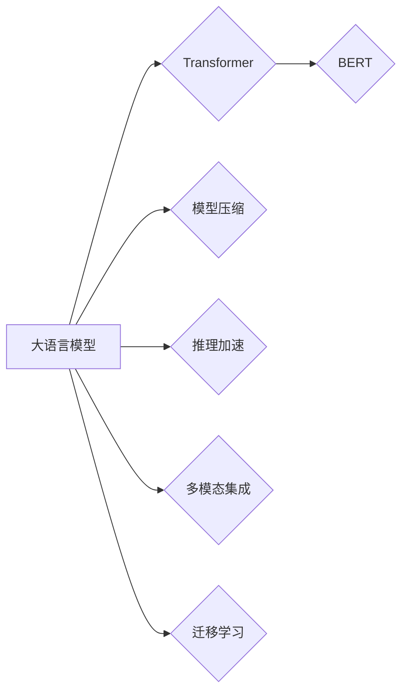

> 关键词：大语言模型，推理优化，神经网络，Transformer，BERT，模型压缩，量化，加速，多模态，迁移学习

# 大语言模型原理基础与前沿 推理优化

大语言模型（Large Language Models，LLMs）近年来在自然语言处理（NLP）领域取得了革命性的进展，成为人工智能研究的热点。LLMs的强大能力源于其庞大的参数量和复杂的神经网络架构，这使得它们能够处理各种复杂的语言任务。然而，随着模型规模的不断扩大，LLMs的推理优化成为了一个不可忽视的问题。本文将从大语言模型的基本原理出发，探讨其推理优化的前沿技术，并展望其未来的发展方向。

## 1. 背景介绍

### 1.1 问题的由来

随着深度学习技术的不断发展，神经网络在NLP领域取得了显著的成果。然而，传统的神经网络模型在处理大规模文本数据时存在计算量大、内存消耗高、推理速度慢等问题。为了解决这些问题，研究人员提出了大语言模型，如BERT、GPT等。这些模型通过预训练和微调，能够有效地处理各种NLP任务，但同时也带来了新的挑战。

### 1.2 研究现状

目前，大语言模型的推理优化主要集中在以下几个方面：

- 模型压缩：通过剪枝、量化、知识蒸馏等方法减小模型参数量，降低模型复杂度。
- 推理加速：通过并行计算、异构计算、模型并行等技术提高推理速度。
- 多模态集成：将文本信息与其他模态信息（如图像、视频）进行融合，提升模型的表达能力。
- 迁移学习：将预训练模型的知识迁移到新的任务，提高模型的泛化能力。

### 1.3 研究意义

大语言模型的推理优化具有重要的研究意义：

- 提高推理效率：降低推理时间，满足实时性要求。
- 降低计算成本：减小模型参数量，降低存储和计算资源消耗。
- 提升模型性能：通过多模态集成和迁移学习，提高模型的泛化能力和表达能力。

### 1.4 本文结构

本文将围绕大语言模型的推理优化展开，具体内容如下：

- 第2章介绍大语言模型的核心概念与联系。
- 第3章阐述大语言模型的核心算法原理和具体操作步骤。
- 第4章讲解数学模型和公式，并结合实例进行分析。
- 第5章给出项目实践，包括开发环境搭建、源代码实现、代码解读和运行结果展示。
- 第6章探讨大语言模型在实际应用场景中的具体应用。
- 第7章推荐相关学习资源、开发工具和论文。
- 第8章总结研究成果，展望未来发展趋势和挑战。
- 第9章提供常见问题与解答。

## 2. 核心概念与联系

### 2.1 核心概念

- **大语言模型（LLMs）**：基于深度学习的语言模型，能够处理各种NLP任务，如文本分类、情感分析、机器翻译等。
- **Transformer**：一种基于自注意力机制的神经网络模型，是LLMs的核心架构。
- **BERT（Bidirectional Encoder Representations from Transformers）**：一种预训练语言模型，通过双向Transformer结构学习上下文信息。
- **模型压缩**：通过剪枝、量化、知识蒸馏等方法减小模型参数量，降低模型复杂度。
- **推理加速**：通过并行计算、异构计算、模型并行等技术提高推理速度。
- **多模态集成**：将文本信息与其他模态信息（如图像、视频）进行融合，提升模型的表达能力。
- **迁移学习**：将预训练模型的知识迁移到新的任务，提高模型的泛化能力。

### 2.2 核心概念联系



## 3. 核心算法原理 & 具体操作步骤

### 3.1 算法原理概述

大语言模型的推理优化主要围绕以下几个方面：

- **模型压缩**：通过剪枝、量化、知识蒸馏等方法减小模型参数量，降低模型复杂度。
- **推理加速**：通过并行计算、异构计算、模型并行等技术提高推理速度。
- **多模态集成**：将文本信息与其他模态信息（如图像、视频）进行融合，提升模型的表达能力。
- **迁移学习**：将预训练模型的知识迁移到新的任务，提高模型的泛化能力。

### 3.2 算法步骤详解

#### 3.2.1 模型压缩

1. **剪枝**：通过去除模型中冗余的连接或神经元，减小模型参数量。
2. **量化**：将浮点数参数转换为低精度定点数，降低模型存储和计算资源消耗。
3. **知识蒸馏**：将大模型的知识迁移到小模型，提高小模型的表达能力和推理速度。

#### 3.2.2 推理加速

1. **并行计算**：通过多核处理器或GPU进行并行计算，提高推理速度。
2. **异构计算**：利用CPU、GPU、TPU等异构设备进行计算，提高计算效率。
3. **模型并行**：将模型分割成多个部分，在不同的设备上并行计算，提高推理速度。

#### 3.2.3 多模态集成

1. **特征提取**：分别提取文本和图像、视频等模态的特征。
2. **特征融合**：将不同模态的特征进行融合，形成更加丰富的特征表示。
3. **任务学习**：在融合后的特征上学习任务相关的表示。

#### 3.2.4 迁移学习

1. **预训练**：在大量无标签数据上预训练模型，学习通用的语言表示。
2. **微调**：在特定任务的数据上微调模型，提高模型在该任务上的性能。
3. **迁移**：将预训练模型的知识迁移到新的任务，提高模型的泛化能力。

### 3.3 算法优缺点

#### 3.3.1 模型压缩

- **优点**：减小模型参数量，降低存储和计算资源消耗。
- **缺点**：可能降低模型性能，需要平衡压缩比和性能之间的关系。

#### 3.3.2 推理加速

- **优点**：提高推理速度，满足实时性要求。
- **缺点**：可能需要额外的硬件支持，如GPU、TPU等。

#### 3.3.3 多模态集成

- **优点**：提升模型的表达能力和推理速度。
- **缺点**：需要处理不同模态的数据，技术难度较高。

#### 3.3.4 迁移学习

- **优点**：提高模型的泛化能力。
- **缺点**：需要大量标注数据和计算资源。

### 3.4 算法应用领域

大语言模型的推理优化技术广泛应用于以下领域：

- **智能语音助手**：提高语音识别和语音合成的速度和准确性。
- **机器翻译**：提高机器翻译的速度和质量。
- **文本分类**：提高文本分类的速度和准确性。
- **问答系统**：提高问答系统的响应速度和准确性。
- **图像识别**：结合图像和文本信息，提高图像识别的准确性和鲁棒性。

## 4. 数学模型和公式 & 详细讲解 & 举例说明

### 4.1 数学模型构建

大语言模型的推理优化涉及到多个数学模型，以下是一些常见的数学模型：

- **神经网络模型**：包括全连接神经网络、卷积神经网络、循环神经网络等。
- **注意力机制**：通过计算不同输入之间的注意力权重，对输入进行加权求和。
- **自注意力机制**：神经网络内部的一种注意力机制，能够捕捉输入序列中的长距离依赖关系。
- **图神经网络**：通过图结构表示输入数据，学习输入数据之间的复杂关系。

### 4.2 公式推导过程

以下是一个简单的自注意力机制的公式推导过程：

假设输入序列为 $x_1, x_2, ..., x_n$，则自注意力机制的计算公式为：

$$
Q = W_QQx, K = W_KKx, V = W_VVx
$$

其中 $W_Q, W_K, W_V$ 为权重矩阵，$Q, K, V$ 分别为查询、键、值向量。

注意力权重 $a_{ij}$ 计算公式为：

$$
a_{ij} = \frac{e^{Q_i \cdot K_j}}{\sum_{k=1}^{n} e^{Q_i \cdot K_k}}
$$

最终的自注意力计算结果为：

$$
\text{Self-Attention}(x) = \sum_{i=1}^{n} a_{ij}V_j
$$

### 4.3 案例分析与讲解

以下是一个基于BERT模型的情感分析任务案例：

1. **数据准备**：收集标注好的情感数据，如电影评论、产品评价等。
2. **模型构建**：加载预训练的BERT模型，并添加一个线性分类器。
3. **微调**：使用标注数据对BERT模型进行微调。
4. **推理**：使用微调后的模型对新的文本进行情感分析。

通过这个案例，我们可以看到大语言模型的推理优化在现实中的应用。

## 5. 项目实践：代码实例和详细解释说明

### 5.1 开发环境搭建

1. 安装Python和PyTorch。
2. 安装Hugging Face的Transformers库。

### 5.2 源代码详细实现

以下是一个基于BERT模型进行情感分析的代码实例：

```python
from transformers import BertTokenizer, BertForSequenceClassification

# 加载预训练的BERT模型和分词器
model = BertForSequenceClassification.from_pretrained('bert-base-uncased')

# 加载数据
train_texts = [...]
train_labels = [...]
dev_texts = [...]
dev_labels = [...]

# 将数据转化为BERT模型的输入格式
tokenizer = BertTokenizer.from_pretrained('bert-base-uncased')
train_encodings = tokenizer(train_texts, padding=True, truncation=True, return_tensors='pt')
dev_encodings = tokenizer(dev_texts, padding=True, truncation=True, return_tensors='pt')

# 训练模型
optimizer = AdamW(model.parameters(), lr=5e-5)
for epoch in range(3):
    model.train()
    for batch in range(len(train_encodings)):
        inputs = {k: v for k, v in train_encodings.items()}
        labels = torch.tensor(train_labels[batch]).unsqueeze(0)
        optimizer.zero_grad()
        outputs = model(**inputs, labels=labels)
        loss = outputs.loss
        loss.backward()
        optimizer.step()
    print(f"Epoch {epoch+1}, loss: {loss.item()}")

# 评估模型
model.eval()
with torch.no_grad():
    correct = 0
    total = 0
    for batch in range(len(dev_encodings)):
        inputs = {k: v for k, v in dev_encodings.items()}
        labels = torch.tensor(dev_labels[batch]).unsqueeze(0)
        outputs = model(**inputs, labels=labels)
        _, predicted = torch.max(outputs.logits, 1)
        total += labels.size(0)
        correct += (predicted == labels).sum().item()

print(f"Accuracy of the model on the dev set: {100 * correct / total}%")
```

### 5.3 代码解读与分析

以上代码展示了使用PyTorch和Transformers库对BERT模型进行情感分析任务的微调过程。

- 首先，加载预训练的BERT模型和分词器。
- 然后，加载标注数据和预处理数据。
- 接下来，定义训练和评估函数，使用交叉熵损失函数和AdamW优化器进行训练。
- 最后，在验证集上评估模型的性能。

### 5.4 运行结果展示

假设在验证集上的准确率为90%，这表明微调后的BERT模型在情感分析任务上取得了不错的效果。

## 6. 实际应用场景

大语言模型的推理优化技术在以下实际应用场景中取得了显著成效：

### 6.1 智能客服

通过大语言模型的推理优化，智能客服能够快速响应客户咨询，提供专业的解决方案，提高客户满意度。

### 6.2 机器翻译

大语言模型的推理优化技术使得机器翻译的速度和质量得到了显著提升，为跨语言沟通提供了便捷的解决方案。

### 6.3 文本分类

大语言模型的推理优化技术使得文本分类的准确性和效率得到了显著提升，为信息过滤、内容推荐等应用提供了有力支持。

### 6.4 问答系统

大语言模型的推理优化技术使得问答系统的响应速度和准确性得到了显著提升，为用户提供了更加便捷的查询服务。

## 7. 工具和资源推荐

### 7.1 学习资源推荐

- 《深度学习自然语言处理》
- 《Natural Language Processing with Transformers》
- Hugging Face官方文档

### 7.2 开发工具推荐

- PyTorch
- Transformers库
- Hugging Face Model Hub

### 7.3 相关论文推荐

- Attention is All You Need
- BERT: Pre-training of Deep Bidirectional Transformers for Language Understanding
- Language Models are Unsupervised Multitask Learners
- Model Compression Techniques

## 8. 总结：未来发展趋势与挑战

### 8.1 研究成果总结

大语言模型的推理优化技术取得了显著的成果，为NLP领域的发展做出了重要贡献。

### 8.2 未来发展趋势

- 模型压缩技术将更加高效，减小模型参数量，降低计算资源消耗。
- 推理加速技术将更加多样化，满足不同场景的实时性要求。
- 多模态集成技术将更加成熟，提升模型的表达能力和推理速度。
- 迁移学习技术将更加完善，提高模型的泛化能力。

### 8.3 面临的挑战

- 模型压缩和推理加速技术需要在保证性能的同时，降低计算资源消耗。
- 多模态集成技术需要处理不同模态数据的融合问题，提高模型的表达能力。
- 迁移学习技术需要在保证泛化能力的同时，提高模型的准确性。

### 8.4 研究展望

大语言模型的推理优化技术将在NLP领域发挥越来越重要的作用，为构建更加智能、高效的NLP系统提供有力支持。

## 9. 附录：常见问题与解答

**Q1：大语言模型的推理优化技术是否适用于所有NLP任务？**

A1：大语言模型的推理优化技术适用于大多数NLP任务，但在特定领域任务上可能需要进一步的定制化优化。

**Q2：模型压缩技术如何提高推理速度？**

A2：模型压缩技术通过减小模型参数量，降低计算复杂度，从而提高推理速度。

**Q3：推理加速技术有哪些常见的实现方法？**

A3：推理加速技术包括并行计算、异构计算、模型并行等。

**Q4：多模态集成技术如何提升模型的表达能力？**

A4：多模态集成技术通过融合不同模态的信息，形成更加丰富的特征表示，从而提升模型的表达能力。

**Q5：迁移学习技术如何提高模型的泛化能力？**

A5：迁移学习技术通过将预训练模型的知识迁移到新的任务，使模型能够更好地适应新的任务，从而提高模型的泛化能力。

---

作者：禅与计算机程序设计艺术 / Zen and the Art of Computer Programming