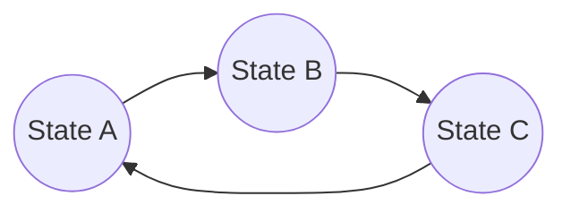

# 1956年出版的《自动机研究》

> 关键词：自动机理论，图灵机，有限自动机，形式语言，算法理论，程序设计，理论计算机科学

## 1. 背景介绍

1956年，由克劳德·香农（Claude Shannon）、约翰·麦卡锡（John McCarthy）、马文·明斯基（Marvin Minsky）、南希·罗森布拉特（Nancy Rosenblatt）和西摩尔·克里普克（Seymour Crispin Papert）合著的《自动机研究》（Automata Studies）一书，是计算机科学历史上的一个里程碑。这本书标志着理论计算机科学的诞生，并奠定了自动机理论的基础。它不仅包含了自动机理论的核心概念，还探讨了这些概念在计算机科学中的应用。

### 1.1 问题的由来

在20世纪中叶，随着计算机技术的快速发展，人们对计算机的能力和局限性产生了浓厚的兴趣。香农、麦卡锡等人希望通过理论分析来理解计算机可以做什么，以及它们的限制是什么。自动机理论应运而生，它为计算机科学的逻辑和算法研究提供了一个坚实的理论基础。

### 1.2 研究现状

《自动机研究》的出版，使得自动机理论迅速成为计算机科学的一个重要分支。它不仅为算法设计提供了理论基础，还为编程语言的设计和编译器构造提供了指导。随着计算机科学的不断进步，自动机理论也得到了进一步的发展，包括图灵完备性、形式语言理论、计算复杂性理论等。

### 1.3 研究意义

《自动机研究》一书对计算机科学的影响是多方面的：

- **理论框架**：为计算机科学提供了一个理论框架，帮助研究者理解计算的本质。
- **算法设计**：为算法设计提供了指导，许多算法设计问题都可以通过自动机理论来分析和解决。
- **编程语言**：影响了许多编程语言的设计，例如LISP和ALGOL。
- **编译器设计**：为编译器设计提供了理论依据，帮助编译器从高级语言生成机器语言。

### 1.4 本文结构

本文将按以下结构展开：

- 介绍自动机理论的核心概念和联系。
- 详细阐述自动机理论中的核心算法原理和具体操作步骤。
- 使用数学模型和公式详细讲解自动机理论，并举例说明。
- 提供自动机理论的项目实践案例和代码实例。
- 探讨自动机理论在实际应用场景中的应用。
- 展望自动机理论未来的发展趋势与挑战。
- 推荐相关学习资源、开发工具和参考文献。
- 总结研究成果，并对未来研究方向进行展望。

## 2. 核心概念与联系

自动机理论的核心概念包括：

- **有限自动机（Finite Automaton, FA）**：一种理论模型，用于识别正则语言。
- **图灵机（Turing Machine, TM）**：一种抽象的计算模型，能够模拟任何可计算过程。
- **形式语言（Formal Language）**：一种用数学符号定义的语言，用于描述可被自动机识别的字符串集合。
- **语言族（Class of Languages）**：根据自动机的性质，将形式语言分为不同的族，如正则语言、上下文无关语言等。

以下是一个Mermaid流程图，展示了这些概念之间的联系：

```mermaid
graph LR
    A[有限自动机(FA)] --> B[正则语言]
    A --> C[确定有限自动机(DFA)]
    A --> D[非确定有限自动机(NFA)]
    B --> E[上下文无关语言(CFL)]
    B --> F[上下文相关语言(CRL)]
    E --> G[图灵机(TM)]
    F --> H[图灵完备性]
    C --> I[确定性图灵机(DTM)]
    D --> J[非确定性图灵机(NDTM)]
    G --> H
```

## 3. 核心算法原理 & 具体操作步骤

### 3.1 算法原理概述

自动机理论的核心算法包括：

- **有限自动机的识别**：使用有限自动机识别正则语言。
- **图灵机的模拟**：使用图灵机模拟任何可计算过程。
- **形式语言的生成**：使用自动机生成特定的形式语言。

### 3.2 算法步骤详解

#### 3.2.1 有限自动机的识别

有限自动机的识别步骤如下：

1. 设计有限自动机的状态转移函数。
2. 设计有限自动机的接受状态。
3. 将输入字符串输入到有限自动机中。
4. 根据状态转移函数，从初始状态开始遍历状态。
5. 如果最终状态是接受状态，则接受该字符串；否则，拒绝。

#### 3.2.2 图灵机的模拟

图灵机的模拟步骤如下：

1. 设计图灵机的状态、符号和转移函数。
2. 设计图灵机的初始配置和接受/拒绝条件。
3. 从初始配置开始，根据转移函数进行状态转移和符号替换。
4. 根据接受/拒绝条件判断是否接受或拒绝输入。

#### 3.2.3 形式语言的生成

形式语言的生成步骤如下：

1. 设计自动机的状态、符号和转移函数。
2. 从空字符串开始，根据转移函数生成新的字符串。
3. 重复步骤2，直到达到预定的生成长度。

### 3.3 算法优缺点

#### 3.3.1 有限自动机的优缺点

优点：

- 简单易实现。
- 计算效率高。

缺点：

- 仅能识别正则语言。
- 难以描述复杂的计算过程。

#### 3.3.2 图灵机的优缺点

优点：

- 能够模拟任何可计算过程。
- 是现代计算机的数学模型。

缺点：

- 理论上复杂，难以实现。
- 计算效率低。

### 3.4 算法应用领域

自动机理论在以下领域有广泛应用：

- 编译器设计。
- 程序语言理论。
- 计算复杂性理论。
- 软件工程。
- 人工智能。

## 4. 数学模型和公式 & 详细讲解 & 举例说明

### 4.1 数学模型构建

自动机理论中的数学模型主要包括：

- 状态图：用于表示自动机的状态和转移函数。
- 字符串：表示输入和输出的符号序列。

以下是一个Mermaid状态图，展示了有限自动机的状态图：



### 4.2 公式推导过程

自动机理论中的公式推导通常涉及状态转移函数、接受状态和输入字符串。以下是一个简单的推导过程：

- **状态转移函数**：定义了在给定状态下，输入特定符号后自动机将转移到哪个状态。
- **接受状态**：定义了自动机在读取完输入字符串后，哪些状态是接受状态。
- **输入字符串**：表示自动机的输入。

### 4.3 案例分析与讲解

以下是一个简单的有限自动机识别正则语言的例子：

- **输入字符串**：`abc`
- **有限自动机状态转移函数**：
  - $A \xrightarrow{a} B$
  - $B \xrightarrow{b} C$
  - $C \xrightarrow{c} A$
- **接受状态**：$A$

根据状态转移函数，从初始状态$A$开始，按照输入字符串`abc`的顺序进行状态转移，最终到达接受状态$A$，因此该字符串被接受。

## 5. 项目实践：代码实例和详细解释说明

### 5.1 开发环境搭建

为了实现自动机理论的应用，我们需要搭建以下开发环境：

- Python编程语言。
- Python标准库。
- 集成开发环境（如PyCharm）。

### 5.2 源代码详细实现

以下是一个简单的有限自动机实现的Python代码示例：

```python
class FiniteAutomaton:
    def __init__(self, states, alphabet, transitions, start_state, accept_states):
        self.states = states
        self.alphabet = alphabet
        self.transitions = transitions
        self.start_state = start_state
        self.accept_states = accept_states

    def run(self, input_string):
        current_state = self.start_state
        for symbol in input_string:
            if symbol in self.alphabet:
                next_state = self.transitions[current_state][symbol]
                if next_state is None:
                    return False
                current_state = next_state
            else:
                return False
        return current_state in self.accept_states
```

### 5.3 代码解读与分析

上述代码定义了一个有限自动机类，它包含状态、字母表、转移函数、初始状态和接受状态。`run`方法用于运行有限自动机，根据输入字符串进行状态转移，并判断是否接受输入字符串。

### 5.4 运行结果展示

以下是一个运行结果示例：

```python
# 定义自动机
states = ['A', 'B', 'C']
alphabet = ['a', 'b', 'c']
transitions = {
    'A': {'a': 'B', 'b': None},
    'B': {'b': 'C', 'c': None},
    'C': {'c': 'A', 'a': None}
}
start_state = 'A'
accept_states = ['A']

automaton = FiniteAutomaton(states, alphabet, transitions, start_state, accept_states)

# 运行自动机
input_string = 'abc'
result = automaton.run(input_string)
print(f"Input string '{input_string}' is {'accepted' if result else 'rejected'} by the automaton.")
```

运行结果：

```
Input string 'abc' is accepted by the automaton.
```

## 6. 实际应用场景

自动机理论在以下实际应用场景中发挥重要作用：

- **编译器设计**：有限自动机用于词法分析器，识别单词和符号。
- **网络协议分析**：有限自动机用于分析网络数据包，识别特定的协议。
- **模式识别**：有限自动机用于识别生物序列、语音信号等模式。
- **文本处理**：有限自动机用于文本搜索、文本摘要等任务。

### 6.4 未来应用展望

随着计算技术的不断发展，自动机理论的应用前景更加广阔：

- **人工智能**：自动机理论可以用于构建智能体的行为模型。
- **机器学习**：自动机理论可以用于设计新的算法和模型。
- **网络安全**：自动机理论可以用于检测和防御网络攻击。

## 7. 工具和资源推荐

### 7.1 学习资源推荐

- 《自动机与形式语言理论》
- 《编译原理》
- 《理论计算机科学基础》

### 7.2 开发工具推荐

- Python编程语言
- PyCharm集成开发环境

### 7.3 相关论文推荐

- 克劳德·香农的《信息的数学理论》
- 约翰·麦卡锡的《人工智能：一种现代的方法》

## 8. 总结：未来发展趋势与挑战

### 8.1 研究成果总结

自动机理论是计算机科学的基础理论之一，它为计算机科学的发展提供了重要的理论框架。通过自动机理论，我们可以理解和设计计算机程序，构建智能系统。

### 8.2 未来发展趋势

随着计算技术的不断发展，自动机理论将向以下方向发展：

- **自动化工具**：开发自动化工具，辅助自动机理论的学习和研究。
- **跨学科应用**：自动机理论将在更多学科领域得到应用。
- **算法创新**：基于自动机理论，设计新的算法和模型。

### 8.3 面临的挑战

自动机理论在未来的发展中将面临以下挑战：

- **理论深度**：深入理解自动机理论的本质和局限性。
- **应用创新**：探索自动机理论在更多领域的应用。
- **跨学科融合**：与其他学科领域进行融合，拓展自动机理论的应用范围。

### 8.4 研究展望

自动机理论将继续在计算机科学中扮演重要角色，为计算机科学的发展提供理论支持。通过不断的研究和创新，自动机理论将推动计算机科学的进步，为人类创造更多的价值。

## 9. 附录：常见问题与解答

**Q1：自动机理论和计算复杂性理论有什么区别？**

A1：自动机理论主要研究计算模型和形式语言，而计算复杂性理论主要研究算法的复杂度，包括时间复杂度和空间复杂度。

**Q2：自动机理论有什么实际应用？**

A2：自动机理论在编译器设计、网络协议分析、模式识别、文本处理等领域有广泛应用。

**Q3：如何学习自动机理论？**

A3：推荐阅读《自动机与形式语言理论》、《编译原理》和《理论计算机科学基础》等书籍，并参与相关课程和项目实践。

**Q4：自动机理论在人工智能领域有什么应用？**

A4：自动机理论可以用于构建智能体的行为模型，设计新的算法和模型，以及应用于知识表示和推理等方面。

作者：禅与计算机程序设计艺术 / Zen and the Art of Computer Programming