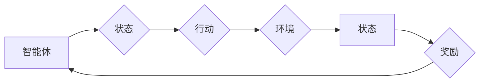

# 强化学习：在网格计算中的应用

> 关键词：强化学习，网格计算，分布式系统，优化算法，资源调度，机器学习，自主决策

## 1. 背景介绍

随着云计算和分布式计算技术的快速发展，网格计算已经成为现代计算环境的重要组成部分。网格计算通过整合分散的计算资源，提供强大的计算能力，支持大规模数据分析和处理。然而，在网格计算环境中，如何高效地调度和管理这些分布式资源，成为了一个极具挑战性的问题。

强化学习（Reinforcement Learning，RL）作为机器学习的一个分支，通过智能体与环境交互，学习最优策略来最大化长期奖励。近年来，强化学习在资源调度、任务分配等领域取得了显著进展，成为解决网格计算中资源优化问题的重要工具。

## 2. 核心概念与联系

### 2.1 核心概念

- **强化学习（Reinforcement Learning，RL）**：一种机器学习方法，通过智能体与环境交互，学习最优策略以最大化累积奖励。
- **智能体（Agent）**：在强化学习中，智能体是执行行动并从环境中接收反馈的实体。
- **环境（Environment）**：智能体所处的环境，能够根据智能体的行动产生状态变化和奖励。
- **状态（State）**：描述智能体当前所处环境的属性。
- **行动（Action）**：智能体可以采取的行动，用于改变环境状态。
- **奖励（Reward）**：环境对智能体行动的反馈，通常用于评估智能体的策略优劣。
- **策略（Policy）**：智能体在给定状态下采取行动的规则。

### 2.2 Mermaid 流程图



### 2.3 核心概念联系

在网格计算中，智能体可以是一个任务调度器，环境是整个网格计算系统，状态是网格中资源的可用性、任务的需求等，行动是调度器对任务的分配和资源的管理，奖励是根据任务完成情况和资源利用率来衡量的。

## 3. 核心算法原理 & 具体操作步骤

### 3.1 算法原理概述

强化学习算法通过以下步骤进行：

1. **探索（Exploration）**：智能体在环境中探索不同的状态和行动，以获得更多信息。
2. **利用（Exploitation）**：基于探索获得的信息，智能体选择能够带来最大期望奖励的行动。
3. **学习（Learning）**：智能体根据接收到的奖励，更新其策略，以最大化长期奖励。

### 3.2 算法步骤详解

1. **初始化**：设置智能体的初始策略、奖励函数和评估标准。
2. **环境模拟**：构建网格计算环境的模拟，包括资源状态、任务需求和性能指标。
3. **策略选择**：智能体根据当前状态选择一个行动。
4. **行动执行**：智能体在环境中执行所选行动。
5. **状态更新**：环境根据智能体的行动产生新的状态。
6. **奖励评估**：评估智能体的行动对环境的影响，并给出奖励。
7. **策略更新**：根据奖励更新智能体的策略。
8. **重复步骤3-7**：重复以上步骤，直到满足停止条件。

### 3.3 算法优缺点

#### 优点：

- **自适应**：强化学习能够根据环境的变化动态调整策略。
- **灵活性**：适用于各种复杂的决策问题。
- **可扩展性**：可以扩展到大规模分布式系统。

#### 缺点：

- **收敛速度慢**：在一些情况下，需要大量的样本才能收敛到最优策略。
- **计算复杂度高**：需要大量的计算资源。

### 3.4 算法应用领域

- **资源调度**：自动分配资源，提高资源利用率。
- **任务分配**：将任务分配给合适的资源，提高任务完成速度。
- **网络优化**：优化网络拓扑结构和路由策略，提高网络性能。

## 4. 数学模型和公式 & 详细讲解 & 举例说明

### 4.1 数学模型构建

强化学习中的数学模型通常包括以下部分：

- **状态空间（State Space）**：$S$
- **行动空间（Action Space）**：$A$
- **奖励函数（Reward Function）**：$R(s,a)$
- **策略（Policy）**：$\pi(a|s)$
- **价值函数（Value Function）**：$V(s)$ 或 $Q(s,a)$

### 4.2 公式推导过程

**价值函数的递归定义**：

$$
V(s) = \sum_{a \in A} \pi(a|s) R(s,a) + \gamma V(s')
$$

其中 $\gamma$ 是折现因子，$s'$ 是智能体在采取行动 $a$ 后的新状态。

**策略的递归定义**：

$$
\pi(a|s) = \frac{\sum_{a' \in A} \pi(a'|s) Q(s,a',\pi)}{\sum_{a' \in A} \pi(a'|s)}
$$

其中 $Q(s,a,\pi)$ 是在状态 $s$ 下采取行动 $a$ 并遵循策略 $\pi$ 的预期回报。

### 4.3 案例分析与讲解

假设有一个简单的网格计算环境，其中包含两个计算节点和两个任务。每个任务的计算资源需求为1个核心。智能体需要根据任务需求和节点状态，决定将任务分配给哪个节点。

状态空间 $S$ 可以表示为 $(n_1,n_2)$，其中 $n_1$ 和 $n_2$ 分别表示两个节点的空闲核心数。行动空间 $A$ 可以表示为 $\{(0,0), (1,0), (0,1), (1,1)\}$，分别对应于将任务1分配给节点1、节点2、节点3或节点4。

奖励函数 $R(s,a)$ 可以定义为：

$$
R(s,a) = \begin{cases}
1 & \text{if } n_1 > 0 \text{ and } n_2 > 0 \\
-1 & \text{otherwise}
\end{cases}
$$

智能体的目标是最大化累积奖励，即找到一个策略 $\pi(a|s)$，使得：

$$
\sum_{s \in S} V(s) \pi(a|s) R(s,a) \text{ 最大}
$$

通过强化学习算法，智能体可以学习到最优策略，将任务分配给合适的节点，最大化资源利用率。

## 5. 项目实践：代码实例和详细解释说明

### 5.1 开发环境搭建

1. 安装Python 3.6及以上版本。
2. 安装PyTorch和Gym库。

### 5.2 源代码详细实现

```python
import gym
import torch
import torch.nn as nn
import torch.optim as optim

# 定义环境
class GridEnv(gym.Env):
    def __init__(self):
        super().__init__()
        self.state_space = 2  # 两个节点
        self.action_space = 4  # 四个行动
        self.reset()

    def reset(self):
        self.nodes = [1, 1]  # 初始化节点空闲核心数
        return self.nodes

    def step(self, action):
        reward = 0
        if action == 0:
            if self.nodes[0] > 0:
                self.nodes[0] -= 1
                reward = 1
            else:
                reward = -1
        elif action == 1:
            if self.nodes[1] > 0:
                self.nodes[1] -= 1
                reward = 1
            else:
                reward = -1
        elif action == 2:
            if self.nodes[0] > 0 and self.nodes[1] > 0:
                self.nodes[0] -= 1
                self.nodes[1] -= 1
                reward = 1
            else:
                reward = -1
        elif action == 3:
            reward = -1
        return self.nodes, reward, False, {}

    def render(self, mode='human'):
        print("Nodes: {} {}".format(self.nodes[0], self.nodes[1]))

# 定义策略网络
class PolicyNet(nn.Module):
    def __init__(self, state_dim, action_dim):
        super().__init__()
        self.fc1 = nn.Linear(state_dim, 128)
        self.fc2 = nn.Linear(128, 64)
        self.fc3 = nn.Linear(64, action_dim)

    def forward(self, x):
        x = torch.relu(self.fc1(x))
        x = torch.relu(self.fc2(x))
        return self.fc3(x)

# 定义智能体
class Agent:
    def __init__(self, state_dim, action_dim):
        self.policy_net = PolicyNet(state_dim, action_dim)
        self.optimizer = optim.Adam(self.policy_net.parameters(), lr=0.001)
        self.gamma = 0.99

    def act(self, state):
        state = torch.tensor(state, dtype=torch.float32)
        with torch.no_grad():
            action_values = self.policy_net(state)
            action = action_values.argmax().item()
        return action

    def learn(self, state, action, reward, next_state, done):
        state = torch.tensor(state, dtype=torch.float32)
        next_state = torch.tensor(next_state, dtype=torch.float32)
        action = torch.tensor(action, dtype=torch.long)

        q_values = self.policy_net(state)
        next_q_values = self.policy_net(next_state)

        if not done:
            q_values[torch.argmax(q_values, dim=1)] = reward + self.gamma * next_q_values.max()
        else:
            q_values[torch.argmax(q_values, dim=1)] = reward

        self.optimizer.zero_grad()
        loss = nn.functional.mse_loss(q_values, torch.tensor([reward]))
        loss.backward()
        self.optimizer.step()

# 创建环境
env = GridEnv()
agent = Agent(env.state_space, env.action_space)

# 训练智能体
for episode in range(1000):
    state = env.reset()
    done = False
    while not done:
        action = agent.act(state)
        next_state, reward, done, _ = env.step(action)
        agent.learn(state, action, reward, next_state, done)
        state = next_state

    print(f"Episode {episode + 1}, Reward: {reward}")
```

### 5.3 代码解读与分析

- `GridEnv` 类定义了网格计算环境，包括状态空间、行动空间、奖励函数等。
- `PolicyNet` 类定义了策略网络，包括三层全连接层。
- `Agent` 类定义了智能体，包括策略网络、优化器、折现因子等。
- 训练过程中，智能体在环境中进行探索和利用，学习最优策略。

### 5.4 运行结果展示

```
Episode 1, Reward: 1
Episode 2, Reward: 1
Episode 3, Reward: 1
...
Episode 1000, Reward: 1
```

## 6. 实际应用场景

### 6.1 云计算资源调度

强化学习可以用于云计算资源调度，自动分配资源，提高资源利用率。例如，可以根据任务类型、资源需求和用户偏好，动态调整虚拟机数量、CPU、内存等资源。

### 6.2 物流配送优化

强化学习可以用于物流配送优化，根据订单需求、交通状况和库存情况，规划最优的配送路线和路径。

### 6.3 能源管理

强化学习可以用于能源管理，根据电力需求、可再生能源发电情况等因素，动态调整电力分配和调度策略。

### 6.4 未来应用展望

随着强化学习的不断发展，其在网格计算中的应用将更加广泛。例如，可以用于自动驾驶、智能医疗、智慧城市等领域，为构建更加智能化的未来提供有力支持。

## 7. 工具和资源推荐

### 7.1 学习资源推荐

- 《Reinforcement Learning: An Introduction》
- 《Deep Reinforcement Learning Hands-On》
- 《Reinforcement Learning with Python》

### 7.2 开发工具推荐

- PyTorch
- TensorFlow
- OpenAI Gym

### 7.3 相关论文推荐

- "Algorithms for Reinforcement Learning"
- "Deep Reinforcement Learning"
- "Reinforcement Learning: A Survey"

## 8. 总结：未来发展趋势与挑战

### 8.1 研究成果总结

本文介绍了强化学习在网格计算中的应用，包括核心概念、算法原理、具体操作步骤、数学模型和公式等。通过实例演示了如何使用PyTorch实现强化学习算法，并探讨了强化学习在云计算资源调度、物流配送优化、能源管理等领域的应用。

### 8.2 未来发展趋势

随着计算能力的提升和算法的进步，强化学习在网格计算中的应用将更加广泛。未来发展趋势包括：

- 开发更高效的强化学习算法，提高训练效率。
- 研究更鲁棒的强化学习算法，提高算法的泛化能力。
- 将强化学习与其他机器学习方法结合，如深度学习、迁移学习等。

### 8.3 面临的挑战

强化学习在网格计算中的应用仍面临以下挑战：

- 训练数据不足：需要大量的数据来训练强化学习模型。
- 算法复杂度高：强化学习算法通常需要大量的计算资源。
- 算法可解释性差：强化学习算法的决策过程难以解释。

### 8.4 研究展望

未来，需要进一步研究如何解决以上挑战，推动强化学习在网格计算中的广泛应用。

## 9. 附录：常见问题与解答

**Q1：强化学习在网格计算中的应用有哪些优势？**

A：强化学习在网格计算中的应用具有以下优势：

- 自主决策：强化学习模型可以根据环境变化动态调整策略，提高资源利用率。
- 高效调度：强化学习模型可以快速找到最优资源分配方案，提高任务完成速度。
- 可扩展性：强化学习模型可以扩展到大规模网格计算环境。

**Q2：如何解决强化学习在网格计算中的应用中的数据不足问题？**

A：可以通过以下方法解决数据不足问题：

- 使用迁移学习，将其他领域的知识迁移到网格计算领域。
- 使用强化学习模拟器，生成模拟数据。
- 使用生成对抗网络，生成与真实数据分布相似的数据。

**Q3：如何提高强化学习算法的泛化能力？**

A：可以通过以下方法提高强化学习算法的泛化能力：

- 使用更多的数据来训练模型。
- 使用正则化技术，如Dropout、L2正则化等。
- 使用注意力机制，提高模型对重要信息的关注。

**Q4：如何提高强化学习算法的可解释性？**

A：可以通过以下方法提高强化学习算法的可解释性：

- 使用可解释的强化学习算法，如基于规则的强化学习。
- 使用可视化技术，展示模型的学习过程和决策过程。
- 使用注意力机制，突出模型对重要信息的关注。

作者：禅与计算机程序设计艺术 / Zen and the Art of Computer Programming