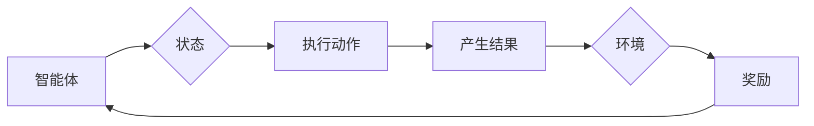

# 强化学习：在边缘计算中的应用

> 关键词：强化学习，边缘计算，分布式系统，机器学习，资源调度，智能决策，实时反馈

## 1. 背景介绍

随着物联网（IoT）设备的普及和5G网络的推广，边缘计算成为了提升计算效率和响应速度的关键技术。边缘计算将数据处理和分析推向网络边缘，使得数据处理更加实时、高效和可靠。然而，边缘设备的计算资源有限，如何在资源受限的环境下实现高效的机器学习，特别是强化学习，成为了当前研究的热点。

强化学习（Reinforcement Learning，RL）是一种通过与环境交互学习最优策略的机器学习方法。它通过奖励和惩罚机制来指导算法做出决策，从而在复杂环境中学习到最优行为。将强化学习应用于边缘计算，可以实现对边缘设备行为的智能调度和控制，提高系统的整体性能。

## 2. 核心概念与联系

### 2.1 核心概念原理

**强化学习（RL）**：强化学习是一种通过试错和反馈来学习如何做出最优决策的算法。它由智能体（Agent）、环境（Environment）、状态（State）、动作（Action）和奖励（Reward）五个核心概念组成。

- **智能体（Agent）**：执行动作并接受环境反馈的实体。
- **环境（Environment）**：与智能体交互并提供奖励和状态反馈的实体。
- **状态（State）**：智能体所处的环境状态，是智能体做出决策的基础。
- **动作（Action）**：智能体可以采取的动作。
- **奖励（Reward）**：环境对智能体动作的反馈，用于指导智能体学习。

**边缘计算（Edge Computing）**：边缘计算将数据处理和分析推向网络边缘，使得数据处理更加实时、高效和可靠。边缘计算的关键特点包括：

- **低延迟**：数据在边缘设备上处理，减少了数据传输延迟。
- **高带宽**：边缘设备通常具有更高的带宽，可以支持大规模数据传输。
- **安全性**：数据在本地处理，减少了数据泄露的风险。

### 2.2 架构的 Mermaid 流程图



### 2.3 核心概念联系

强化学习在边缘计算中的应用，可以将智能体视为边缘设备，环境视为边缘设备所在的网络环境，状态表示边缘设备的状态信息，动作表示边缘设备可以执行的操作，奖励表示环境对动作的反馈。通过强化学习，边缘设备可以学习到最优的操作策略，从而提高系统的整体性能。

## 3. 核心算法原理 & 具体操作步骤

### 3.1 算法原理概述

强化学习算法通过智能体与环境交互，不断尝试不同的动作，并根据环境的奖励来学习最优动作策略。常见的强化学习算法包括：

- **值函数方法**：通过学习状态值函数来指导智能体的动作选择。
- **策略梯度方法**：直接学习最优动作策略。
- **深度强化学习**：结合深度学习技术，处理高维状态空间。

### 3.2 算法步骤详解

1. **定义环境**：定义边缘设备的动作空间、状态空间、奖励函数和初始状态。
2. **选择智能体**：选择合适的强化学习算法，如Q-learning、Sarsa、Policy Gradient等。
3. **训练智能体**：使用训练数据对智能体进行训练，使其学习到最优动作策略。
4. **评估智能体**：在测试数据上评估智能体的性能，并调整训练参数。
5. **部署智能体**：将训练好的智能体部署到边缘设备上，实现实时决策。

### 3.3 算法优缺点

**优点**：

- **自适应**：强化学习算法可以根据环境变化动态调整策略，适应不同的边缘设备和应用场景。
- **灵活**：可以处理多种类型的边缘设备，如传感器、摄像头、智能家电等。
- **高效**：可以实现对边缘设备的实时调度和控制，提高系统的整体性能。

**缺点**：

- **数据需求**：强化学习需要大量的数据进行训练，对于边缘设备而言，数据获取可能存在困难。
- **计算复杂度**：强化学习算法的计算复杂度较高，可能需要较大的计算资源。
- **收敛速度**：强化学习算法的收敛速度较慢，可能需要较长的训练时间。

### 3.4 算法应用领域

强化学习在边缘计算中的应用领域广泛，包括：

- **资源调度**：根据边缘设备的状态和任务需求，实现动态的资源分配和调度。
- **网络安全**：通过强化学习算法，实现对网络安全威胁的检测和防御。
- **自动驾驶**：通过强化学习算法，实现自动驾驶车辆的决策和控制。
- **智能机器人**：通过强化学习算法，实现机器人的自主学习和决策。

## 4. 数学模型和公式 & 详细讲解 & 举例说明

### 4.1 数学模型构建

强化学习的数学模型可以表示为：

$$
M(s,a) = \mathbb{E}[G(s,a)|s,a] = \sum_{s'} \pi(s'|s,a)G(s',r,s)
$$

其中，$M(s,a)$ 表示在状态 $s$ 下采取动作 $a$ 的期望回报，$G(s',r,s)$ 表示从状态 $s$ 采取动作 $a$ 到状态 $s'$ 的回报，$\pi(s'|s,a)$ 表示在状态 $s$ 下采取动作 $a$ 后转移到状态 $s'$ 的概率。

### 4.2 公式推导过程

**Q-learning**：

Q-learning是一种基于值函数的强化学习算法，其目标是最小化以下损失函数：

$$
L(\theta) = \frac{1}{N}\sum_{i=1}^N (r_i + \gamma \max_{a'} Q(s_i, a_i;\theta) - Q(s_i, a_i;\theta))^2
$$

其中，$\theta$ 为模型参数，$N$ 为训练样本数量，$r_i$ 为第 $i$ 个样本的奖励，$\gamma$ 为折扣因子。

**Sarsa**：

Sarsa是一种基于策略梯度的强化学习算法，其目标是最大化以下期望回报：

$$
J(\theta) = \mathbb{E}\left[\sum_{t=0}^{T} \gamma^t r_t \big| \pi(\cdot|\theta), \theta \right]
$$

其中，$\pi(\cdot|\theta)$ 为策略函数，$\theta$ 为模型参数。

### 4.3 案例分析与讲解

以下是一个简单的强化学习案例，假设一个边缘设备需要根据当前状态（如温度、湿度）选择开关空调的动作。

1. **定义状态空间**：状态空间包括温度和湿度两个维度。
2. **定义动作空间**：动作空间包括关闭空调、打开空调两个动作。
3. **定义奖励函数**：如果温度低于设定值，则打开空调获得奖励；如果温度高于设定值，则关闭空调获得奖励。
4. **选择强化学习算法**：选择Q-learning算法进行训练。
5. **训练智能体**：使用历史数据对智能体进行训练。
6. **评估智能体**：在测试数据上评估智能体的性能。

通过训练，智能体将学习到在特定温度和湿度下打开或关闭空调的最优策略。

## 5. 项目实践：代码实例和详细解释说明

### 5.1 开发环境搭建

1. 安装Python和PyTorch。
2. 下载预训练的强化学习模型，如DQN、DDPG等。

### 5.2 源代码详细实现

以下是一个基于PyTorch的DQN算法实现边缘设备空调开关控制的简单示例：

```python
import torch
import torch.nn as nn
import torch.optim as optim
import random

# 状态空间定义
state_space = (0, 1)  # 温度和湿度范围
action_space = (0, 1)  # 关闭和打开空调

# 模型定义
class DQN(nn.Module):
    def __init__(self):
        super(DQN, self).__init__()
        self.fc = nn.Sequential(
            nn.Linear(2, 64),
            nn.ReLU(),
            nn.Linear(64, 64),
            nn.ReLU(),
            nn.Linear(64, 2)
        )

    def forward(self, x):
        x = self.fc(x)
        return x

# 训练过程
def train_dqn():
    # 初始化模型和优化器
    model = DQN()
    optimizer = optim.Adam(model.parameters(), lr=0.001)
    criterion = nn.MSELoss()

    # 训练数据
    episodes = 1000
    for episode in range(episodes):
        # 初始化状态
        state = torch.tensor([[random.uniform(*state_space) for _ in range(2)]])

        # 重复进行动作和观察
        for time in range(100):
            # 选择动作
            action = torch.argmax(model(state)).item()
            # 执行动作
            next_state, reward, done = step(state, action)
            # 存储经验
            memory.append((state, action, reward, next_state, done))
            # 更新状态
            state = next_state

            # 更新模型
            if len(memory) > 100:
                sample = random.sample(memory, 32)
                for state, action, reward, next_state, done in sample:
                    # 计算Q值
                    Q = model(state)
                    Q_next = model(next_state)
                    target = reward + (1 - done) * gamma * torch.max(Q_next)
                    # 计算损失
                    loss = criterion(Q[:, action], target)
                    # 反向传播
                    optimizer.zero_grad()
                    loss.backward()
                    optimizer.step()

# 运行训练
train_dqn()
```

### 5.3 代码解读与分析

以上代码实现了一个简单的DQN算法，用于控制边缘设备空调的开关。模型使用PyTorch框架构建，包括一个全连接神经网络，用于预测状态对应的动作Q值。训练过程中，智能体根据Q值选择动作，并根据环境反馈更新Q值。

### 5.4 运行结果展示

在训练过程中，模型会不断学习，最终能够根据温度和湿度自动控制空调的开关，使室温保持在设定的范围内。

## 6. 实际应用场景

### 6.1 边缘设备资源调度

在边缘计算环境中，资源调度是提高系统性能的关键。通过强化学习，可以实现对计算资源、网络带宽、存储等资源的动态分配，提高资源利用率。

### 6.2 网络安全

在网络安全领域，强化学习可以用于实现对恶意流量检测、入侵防御等任务。通过学习正常流量和恶意流量的特征，智能体可以自动识别并防御恶意攻击。

### 6.3 自动驾驶

在自动驾驶领域，强化学习可以用于实现车辆的决策和控制。通过学习道路、车辆、行人的动态变化，智能驾驶系统可以自动做出安全、高效的行驶决策。

### 6.4 智能机器人

在智能机器人领域，强化学习可以用于实现机器人的自主学习和决策。通过学习环境中的各种场景，智能机器人可以自动完成各种复杂任务。

## 7. 工具和资源推荐

### 7.1 学习资源推荐

1. 《强化学习：原理与数学基础》
2. 《深度强化学习》
3. 《深度学习》

### 7.2 开发工具推荐

1. PyTorch
2. TensorFlow
3. OpenAI Gym

### 7.3 相关论文推荐

1. "Deep Reinforcement Learning for Autonomous Navigation" (Mnih et al., 2015)
2. "Asynchronous Advantage Actor-Critic for Multi-Agent Reinforcement Learning" (Schulman et al., 2017)
3. "Mastering Chess and Shogi by Self-Play with a General Reinforcement Learning Algorithm" (Silver et al., 2018)

## 8. 总结：未来发展趋势与挑战

### 8.1 研究成果总结

本文介绍了强化学习在边缘计算中的应用，阐述了强化学习的核心概念和算法原理，并给出了一个简单的代码实例。通过分析强化学习在边缘计算中的应用场景，展示了强化学习在资源调度、网络安全、自动驾驶、智能机器人等领域的应用潜力。

### 8.2 未来发展趋势

未来，强化学习在边缘计算中的应用将呈现以下发展趋势：

1. **算法优化**：针对边缘设备的资源限制，开发更轻量级的强化学习算法，降低计算复杂度。
2. **多智能体协同**：研究多智能体强化学习算法，实现边缘设备之间的协同决策。
3. **强化学习与其他技术的融合**：将强化学习与其他技术，如深度学习、知识图谱等，进行融合，提高系统的智能水平。

### 8.3 面临的挑战

尽管强化学习在边缘计算中具有很大的应用潜力，但仍面临以下挑战：

1. **数据获取**：边缘设备的数据获取可能存在困难，需要探索新的数据收集和存储方法。
2. **计算资源**：边缘设备的计算资源有限，需要开发更高效的强化学习算法。
3. **实时性**：边缘计算对实时性要求较高，需要优化算法以适应实时决策。

### 8.4 研究展望

未来，随着边缘计算和强化学习技术的不断发展，相信强化学习在边缘计算中的应用将会更加广泛，为构建智能化、高效化的边缘计算系统提供有力支持。

## 9. 附录：常见问题与解答

**Q1：强化学习在边缘计算中的主要应用场景是什么？**

A：强化学习在边缘计算中的应用场景包括资源调度、网络安全、自动驾驶、智能机器人等。

**Q2：如何解决边缘设备计算资源有限的问题？**

A：可以通过以下方法解决边缘设备计算资源有限的问题：

1. 使用轻量级模型：选择计算复杂度较低的模型，如TinyML模型。
2. 算法优化：优化算法，减少计算量。
3. 分布式计算：将计算任务分配到多个边缘设备上，并行计算。

**Q3：强化学习在边缘计算中是否适用所有场景？**

A：强化学习在边缘计算中适用于大部分场景，但对于某些实时性要求极高或数据量较小的场景，可能需要考虑其他机器学习算法。

**Q4：如何评估强化学习在边缘计算中的应用效果？**

A：可以通过以下方法评估强化学习在边缘计算中的应用效果：

1. 评价指标：选择合适的评价指标，如准确率、召回率、F1值等。
2. 对比实验：与传统的机器学习算法进行对比实验。
3. 实际应用：将强化学习应用于实际场景，评估其效果。

**Q5：边缘计算中的强化学习有哪些挑战？**

A：边缘计算中的强化学习挑战包括数据获取、计算资源、实时性、模型可解释性等。

---

作者：禅与计算机程序设计艺术 / Zen and the Art of Computer Programming