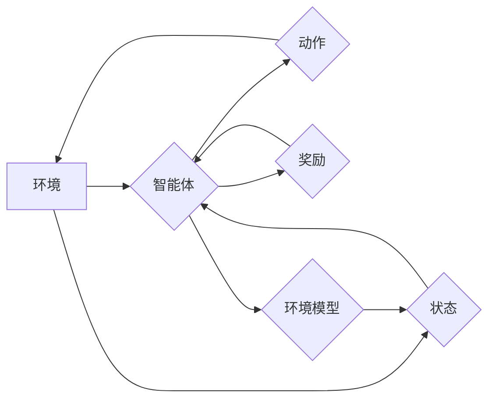

## 强化学习：环境模型的建立与利用

> 关键词：强化学习、环境模型、预测模型、价值函数、策略梯度、深度强化学习、应用场景

## 1. 背景介绍

强化学习 (Reinforcement Learning, RL) 作为机器学习领域的重要分支，近年来取得了显著进展，并在机器人控制、游戏 AI、推荐系统等领域展现出强大的应用潜力。强化学习的核心在于训练智能体在与环境交互的过程中，通过不断尝试和学习，最终找到最优策略以最大化累积奖励。

然而，传统的强化学习算法通常依赖于直接与环境交互进行学习，这在现实世界中往往面临着高成本、数据稀缺等挑战。例如，训练一个机器人完成复杂的任务可能需要大量的试错和反馈，这不仅耗时耗力，也可能导致机器人遭受损害。

为了解决这些问题，环境模型的建立与利用成为强化学习研究的热点方向。环境模型能够模拟环境的动态行为，为智能体提供一个虚拟的学习环境，从而降低训练成本，提高学习效率。

## 2. 核心概念与联系

环境模型是强化学习中一个重要的组成部分，它试图学习一个函数，该函数能够预测环境在给定状态和动作下将产生的下一个状态和奖励。

**核心概念：**

* **状态 (State):** 环境的当前状态，例如机器人的位置、速度、传感器读数等。
* **动作 (Action):** 智能体在当前状态下可以执行的动作，例如机器人向前移动、向左转弯等。
* **奖励 (Reward):** 环境对智能体动作的反馈，可以是正向奖励或负向惩罚。
* **下一个状态 (Next State):** 环境在当前状态和动作下转移到的下一个状态。
* **环境模型 (Environment Model):** 一个函数，能够预测下一个状态和奖励，即：

$$
P(s', r | s, a)
$$

其中：

* $s$：当前状态
* $a$：当前动作
* $s'$：下一个状态
* $r$：奖励

**架构流程图：**



## 3. 核心算法原理 & 具体操作步骤

### 3.1  算法原理概述

环境模型的建立可以采用多种算法，其中深度强化学习 (Deep Reinforcement Learning, DRL) 由于其强大的泛化能力和表达能力，在该领域取得了显著进展。

DRL 算法通常使用深度神经网络来构建环境模型，通过训练网络预测下一个状态和奖励。训练过程通常采用监督学习的方式，利用历史的交互数据来训练模型。

### 3.2  算法步骤详解

1. **数据收集:** 首先需要收集大量的环境交互数据，包括状态、动作、奖励和下一个状态。
2. **数据预处理:** 对收集到的数据进行预处理，例如归一化、编码等，以便于模型训练。
3. **模型构建:** 使用深度神经网络构建环境模型，网络结构可以根据具体任务和环境复杂度进行设计。
4. **模型训练:** 使用监督学习算法，例如均方误差 (MSE) 或交叉熵 (Cross-Entropy)，训练模型预测下一个状态和奖励。
5. **模型评估:** 使用测试数据评估模型的性能，例如预测准确率、平均奖励等。
6. **模型部署:** 将训练好的环境模型部署到实际应用场景中，例如用于强化学习算法的训练或决策辅助系统。

### 3.3  算法优缺点

**优点:**

* **降低训练成本:** 通过使用环境模型，智能体可以在虚拟环境中进行训练，从而降低与真实环境交互的成本。
* **提高学习效率:** 环境模型可以提供更丰富的训练数据，帮助智能体更快地学习最优策略。
* **增强鲁棒性:** 环境模型可以帮助智能体应对未知或不确定环境的变化。

**缺点:**

* **模型准确性:** 环境模型的准确性直接影响强化学习算法的性能，如果模型过于简化或不准确，可能会导致智能体学习到错误的策略。
* **模型复杂度:** 构建准确的环境模型可能需要复杂的网络结构和大量的训练数据，这会增加训练成本和时间。
* **数据依赖:** 环境模型的训练需要大量的环境交互数据，如果数据不足或不完整，可能会导致模型性能下降。

### 3.4  算法应用领域

环境模型在强化学习领域有着广泛的应用，例如：

* **机器人控制:** 用于训练机器人完成复杂的任务，例如导航、抓取、组装等。
* **游戏 AI:** 用于训练游戏 AI 玩家，例如围棋、Go、策略游戏等。
* **推荐系统:** 用于预测用户对商品或服务的兴趣，从而提供个性化的推荐。
* **医疗诊断:** 用于辅助医生诊断疾病，例如预测患者的病情发展趋势。

## 4. 数学模型和公式 & 详细讲解 & 举例说明

### 4.1  数学模型构建

环境模型可以表示为一个状态转移函数和一个奖励函数。

* **状态转移函数:**

$$
P(s' | s, a)
$$

该函数描述了在当前状态 $s$ 执行动作 $a$ 后，转移到下一个状态 $s'$ 的概率。

* **奖励函数:**

$$
R(s, a)
$$

该函数描述了在当前状态 $s$ 执行动作 $a$ 后获得的奖励。

### 4.2  公式推导过程

环境模型的训练目标是学习这两个函数，使其能够准确地预测下一个状态和奖励。

可以使用最大似然估计 (Maximum Likelihood Estimation) 来训练状态转移函数。最大似然估计的目标是找到参数，使得模型在训练数据上出现的概率最大。

可以使用均方误差 (MSE) 来训练奖励函数。MSE 的目标是找到参数，使得模型预测的奖励与实际奖励之间的误差最小。

### 4.3  案例分析与讲解

例如，考虑一个简单的环境，其中智能体可以执行两个动作：向上移动或向下移动。

状态 $s$ 可以表示为智能体的当前位置，奖励函数 $R(s, a)$ 可以设置为：

* 如果智能体移动到目标位置，则奖励为 1。
* 否则，奖励为 0。

状态转移函数 $P(s' | s, a)$ 可以根据环境的规则进行定义，例如：

* 如果智能体在位置 $s$ 执行向上移动动作，则下一个状态 $s'$ 为 $s + 1$。
* 如果智能体在位置 $s$ 执行向下移动动作，则下一个状态 $s'$ 为 $s - 1$。

通过训练环境模型，智能体可以学习到状态转移函数和奖励函数，从而找到到达目标位置的最优策略。

## 5. 项目实践：代码实例和详细解释说明

### 5.1  开发环境搭建

* Python 3.x
* TensorFlow 或 PyTorch
* OpenAI Gym 或其他强化学习库

### 5.2  源代码详细实现

```python
import tensorflow as tf

# 定义环境模型
class EnvironmentModel(tf.keras.Model):
    def __init__(self, state_size, action_size):
        super(EnvironmentModel, self).__init__()
        self.dense1 = tf.keras.layers.Dense(64, activation='relu')
        self.dense2 = tf.keras.layers.Dense(32, activation='relu')
        self.output_state = tf.keras.layers.Dense(state_size)
        self.output_reward = tf.keras.layers.Dense(1)

    def call(self, inputs):
        x = self.dense1(inputs)
        x = self.dense2(x)
        state_output = self.output_state(x)
        reward_output = self.output_reward(x)
        return state_output, reward_output

# 实例化环境模型
model = EnvironmentModel(state_size=4, action_size=2)

# 训练环境模型
#...

# 使用环境模型预测下一个状态和奖励
state = tf.constant([0, 1, 2, 3])
action = tf.constant([0, 1])
next_state, reward = model(state, action)
```

### 5.3  代码解读与分析

* 环境模型使用深度神经网络进行构建，包含多个全连接层和激活函数。
* 输入层接收当前状态和动作信息。
* 输出层分别预测下一个状态和奖励。
* 训练过程使用监督学习算法，例如 MSE 或交叉熵。

### 5.4  运行结果展示

训练完成后，可以使用环境模型预测下一个状态和奖励，并评估模型的性能。

## 6. 实际应用场景

环境模型在强化学习领域有着广泛的应用，例如：

* **机器人控制:** 用于训练机器人完成复杂的任务，例如导航、抓取、组装等。
* **游戏 AI:** 用于训练游戏 AI 玩家，例如围棋、Go、策略游戏等。
* **推荐系统:** 用于预测用户对商品或服务的兴趣，从而提供个性化的推荐。
* **医疗诊断:** 用于辅助医生诊断疾病，例如预测患者的病情发展趋势。

### 6.4  未来应用展望

随着深度学习技术的不断发展，环境模型的构建和应用将会更加广泛和深入。

例如，未来可能出现：

* 更准确、更鲁棒的环境模型，能够模拟更复杂的真实世界环境。
* 基于环境模型的强化学习算法，能够在更短的时间内学习到更优的策略。
* 环境模型在更多领域得到应用，例如自动驾驶、金融交易、科学研究等。

## 7. 工具和资源推荐

### 7.1  学习资源推荐

* **书籍:**
    * Reinforcement Learning: An Introduction by Richard S. Sutton and Andrew G. Barto
    * Deep Reinforcement Learning Hands-On by Maxim Lapan
* **课程:**
    * Deep Reinforcement Learning Specialization by DeepLearning.AI
    * Reinforcement Learning by David Silver (University of DeepMind)
* **博客:**
    * OpenAI Blog
    * DeepMind Blog

### 7.2  开发工具推荐

* **TensorFlow:** https://www.tensorflow.org/
* **PyTorch:** https://pytorch.org/
* **OpenAI Gym:** https://gym.openai.com/

### 7.3  相关论文推荐

* **Deep Q-Network (DQN):** Mnih et al., 2015
* **Proximal Policy Optimization (PPO):** Schulman et al., 2017
* **Trust Region Policy Optimization (TRPO):** Schulman et al., 2015

## 8. 总结：未来发展趋势与挑战

### 8.1  研究成果总结

环境模型的建立与利用为强化学习带来了新的发展方向，有效降低了训练成本，提高了学习效率，并增强了智能体的鲁棒性。

### 8.2  未来发展趋势

未来，环境模型的研究将朝着以下方向发展：

* **更准确、更鲁棒的环境模型:** 探索新的模型架构和训练方法，提高环境模型的准确性和鲁棒性。
* **可解释性更强的环境模型:** 研究如何解释环境模型的决策过程，提高模型的可解释性和可信任性。
* **多模态环境模型:** 构建能够处理多种类型数据的环境模型，例如图像、文本、音频等。

### 8.3  面临的挑战

环境模型的建立与利用也面临着一些挑战：

* **数据获取和标注:** 构建准确的环境模型需要大量的环境交互数据，获取和标注这些数据成本高昂。
* **模型复杂度:** 构建准确的环境模型可能需要复杂的网络结构和大量的训练数据，这会增加训练成本和时间。
* **模型泛化能力:** 环境模型的泛化能力需要进一步提升，使其能够适应不同的环境和任务。

### 8.4  研究展望

尽管面临挑战，但环境模型的建立与利用仍然是一个充满希望的研究方向。随着人工智能技术的不断发展，相信未来会有更多突破性的进展，推动环境模型在强化学习