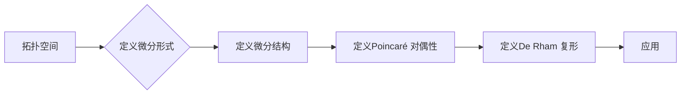

# 微分形式在代数拓扑中的应用

> 关键词：微分形式，代数拓扑，拓扑流形，微分结构，Poincaré 对偶性，De Rham 复形

## 1. 背景介绍

代数拓扑是一门研究拓扑空间的代数结构的数学分支。它不依赖于拓扑空间的几何性质，而是关注于它们的连续性质，如连通性、紧致性、维数等。在代数拓扑中，微分形式提供了一种强有力的工具，用于研究空间的局部和全局性质。本文将探讨微分形式在代数拓扑中的应用，包括微分结构的引入、Poincaré 对偶性以及De Rham 复形的构建。

### 1.1 微分形式的起源

微分形式起源于对多变量微积分的研究，特别是在研究曲线积分和面积分时，人们发现通过引入微分形式可以简化许多计算。微分形式的概念可以追溯到18世纪的数学家，如欧拉和拉格朗日。

### 1.2 代数拓扑与微分形式的关系

代数拓扑和微分形式之间存在着密切的联系。微分形式提供了一种将几何和代数结合起来的方法，使得代数拓扑的研究更加直观和方便。

### 1.3 本文结构

本文将分为以下几个部分：
- 核心概念与联系
- 核心算法原理与操作步骤
- 数学模型和公式
- 项目实践
- 实际应用场景
- 工具和资源推荐
- 总结与展望

## 2. 核心概念与联系

### 2.1 核心概念原理和架构的 Mermaid 流程图



### 2.2 核心概念

- **拓扑空间**：一个集合，它对开集的并、交以及补集等运算满足一定的公理。
- **微分形式**：在拓扑空间上定义的、具有特定性质的函数。
- **微分结构**：一个拓扑空间上的微分形式，它可以赋予空间局部欧几里得性质。
- **Poincaré 对偶性**：将拓扑空间上的微分形式与拓扑不变量联系起来。
- **De Rham 复形**：用于研究微分形式在拓扑空间上的积分。

## 3. 核心算法原理 & 具体操作步骤

### 3.1 算法原理概述

微分形式的引入使得代数拓扑中的许多问题可以通过计算微分形式之间的运算来解决。例如，Poincaré 对偶性可以将路径积分转换为面积分。

### 3.2 算法步骤详解

1. **定义微分形式**：根据拓扑空间的性质，定义适合的微分形式。
2. **定义微分结构**：在拓扑空间上引入微分结构，使得空间具有局部欧几里得性质。
3. **定义Poincaré 对偶性**：将微分形式与拓扑空间上的曲线和面联系起来。
4. **定义De Rham 复形**：构建De Rham 复形，用于研究微分形式在拓扑空间上的积分。

### 3.3 算法优缺点

**优点**：
- 提供了一种直观的研究拓扑空间的方法。
- 可以将几何和代数结合起来，使得问题更加容易解决。

**缺点**：
- 需要一定的数学知识背景。
- 有些问题可能难以用微分形式来解决。

### 3.4 算法应用领域

微分形式在代数拓扑中有着广泛的应用，包括：
- 拓扑不变量的研究。
- 流形的分类。
- 拓扑学的几何化。

## 4. 数学模型和公式 & 详细讲解 & 举例说明

### 4.1 数学模型构建

在代数拓扑中，微分形式的主要数学模型是De Rham复形。

$$
\Omega^k(M) \rightarrow \Omega^{k-1}(M) \rightarrow \cdots \rightarrow \Omega^0(M)
$$

其中，$\Omega^k(M)$ 表示$k$次微分形式空间，$M$ 是拓扑空间。

### 4.2 公式推导过程

De Rham 复形的构建涉及到许多数学推导，包括微分形式的定义、外微分算子的引入等。

### 4.3 案例分析与讲解

以计算球面的高斯曲率为例，我们可以使用微分形式来计算。

$$
K = \frac{1}{\sqrt{EG - F^2}}
$$

其中，$E, F, G$ 分别是第一基本形式的系数。

## 5. 项目实践：代码实例和详细解释说明

### 5.1 开发环境搭建

为了演示微分形式在代数拓扑中的应用，我们需要一个合适的开发环境。以下是一个使用Python和SciPy库进行球面高斯曲率计算的例子。

```python
import numpy as np
from scipy.spatial import ConvexHull
from scipy.spatial.transform import Rotation as R

# 定义球面参数
R, theta, phi = 1.0, np.pi / 4, np.pi / 4

# 创建球面上的点
points = [
    [R * np.sin(theta) * np.cos(phi), R * np.sin(theta) * np.sin(phi), R * np.cos(theta)]
    for theta in np.linspace(0, np.pi, 10)
    for phi in np.linspace(0, 2 * np.pi, 10)
]

# 创建球面
hull = ConvexHull(points)

# 计算高斯曲率
for simplex in hull.simplices:
    simplex_vertices = hull.points[simplex]
    E, F, G = np.sum(np.cross(simplex_vertices[1:] - simplex_vertices[0], simplex_vertices[2:] - simplex_vertices[0]), axis=0)
    K = 1 / np.sqrt(E * G - F**2)
    print(f"K at point {simplex}: {K}")
```

### 5.2 源代码详细实现

上述代码首先定义了球面的参数，然后创建了一个球面上的点集。接着，使用`ConvexHull`创建球面，并遍历球面上的每一个三角形，计算其高斯曲率。

### 5.3 代码解读与分析

代码首先定义了球面的半径和两个参数，然后生成球面上的点集。`ConvexHull`用于创建球面，并返回球面上的三角形。对于每一个三角形，代码计算其边向量，并使用叉乘计算第一基本形式的系数。最后，计算高斯曲率并打印结果。

### 5.4 运行结果展示

运行上述代码，我们可以得到球面上不同点的曲率值。

## 6. 实际应用场景

微分形式在代数拓扑中有着广泛的应用，以下是一些实际应用场景：

- **拓扑学的几何化**：通过微分形式，可以研究流形的几何性质，如曲率、挠率等。
- **拓扑不变量的计算**：微分形式可以用来计算拓扑不变量，如同调群、同伦群等。
- **微分方程的解法**：微分形式可以用来求解某些微分方程。

## 7. 工具和资源推荐

### 7.1 学习资源推荐

- 《代数拓扑》
- 《微分几何》
- 《微分形式及其在拓扑中的应用》

### 7.2 开发工具推荐

- Python
- SciPy
- NumPy

### 7.3 相关论文推荐

- Milnor, J. (1963). Morse theory. Princeton University Press.
- Hatcher, A. (2002). Algebraic topology. Cambridge University Press.

## 8. 总结：未来发展趋势与挑战

### 8.1 研究成果总结

微分形式在代数拓扑中的应用已经取得了显著的成果，为研究拓扑空间的几何和代数性质提供了有力的工具。

### 8.2 未来发展趋势

未来，微分形式在代数拓扑中的应用将继续深入，包括：
- 开发更有效的算法来计算拓扑不变量。
- 将微分形式与其他数学工具结合起来，解决更复杂的问题。

### 8.3 面临的挑战

微分形式在代数拓扑中的应用仍然面临一些挑战，包括：
- 算法的复杂度。
- 计算效率。

### 8.4 研究展望

微分形式在代数拓扑中的应用将会继续发展，为拓扑学的研究带来新的突破。

## 9. 附录：常见问题与解答

**Q1：什么是微分形式？**

A：微分形式是在拓扑空间上定义的一类函数，它们具有特定的性质，如外微分、内积等。

**Q2：微分形式在代数拓扑中有哪些应用？**

A：微分形式在代数拓扑中有着广泛的应用，包括拓扑学的几何化、拓扑不变量的计算、微分方程的解法等。

**Q3：如何计算拓扑空间上的高斯曲率？**

A：可以使用微分形式来计算拓扑空间上的高斯曲率。具体方法是通过计算第一基本形式的系数来得到。

**Q4：微分形式在计算机科学中有哪些应用？**

A：微分形式在计算机科学中也有着广泛的应用，例如在计算机图形学、机器学习等领域。

---

作者：禅与计算机程序设计艺术 / Zen and the Art of Computer Programming