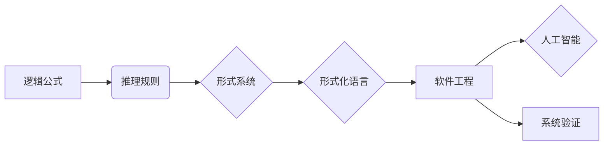

> 逻辑学，形式化方法，计算机科学，人工智能，认知自由，形式化语言的局限性

# 思想生而自由，却又无处不在形式化之中

## 1. 背景介绍

自亚里士多德时代起，逻辑学就一直是人类理性思维和知识体系构建的基石。从古希腊的逻辑三段论到现代的数理逻辑，逻辑学的发展推动了人类对世界认知的深入。然而，随着计算机科学和人工智能的兴起，逻辑学的形式化方法逐渐成为计算机领域不可或缺的工具。本文将探讨逻辑学的形式化方法在计算机科学中的应用，分析其带来的认知自由与局限性，并展望其未来发展趋势。

### 1.1 形式化方法的兴起

形式化方法起源于逻辑学，旨在用数学符号和语言描述问题，并通过逻辑推理来验证结论。随着计算机科学的兴起，形式化方法被广泛应用于软件开发、系统验证、人工智能等领域。其主要优势在于：

- **精确性**：形式化方法能够用严谨的数学语言描述问题，避免了自然语言的不确定性和歧义性。
- **可验证性**：通过逻辑推理，可以验证系统是否满足特定性质，确保系统的正确性和可靠性。
- **可自动化**：形式化方法可以借助计算机工具自动化完成，提高开发效率。

### 1.2 认知自由与形式化方法

形式化方法为计算机科学带来了认知自由，使得人类能够更加深入地理解复杂的系统。以下是形式化方法带来的认知自由：

- **跨学科交流**：形式化方法提供了一套统一的描述和推理语言，促进了不同学科之间的交流与合作。
- **知识积累与传承**：形式化方法可以清晰地记录和表达知识，方便知识的积累与传承。
- **创新能力**：形式化方法为新的理论和技术创新提供了基础。

## 2. 核心概念与联系

### 2.1 核心概念

以下是一些形式化方法中的核心概念：

- **逻辑公式**：使用数学符号表示的逻辑语句，如 $P \land Q$（P且Q）、$P \lor Q$（P或Q）等。
- **推理规则**：用于从已知前提推出新结论的规则，如演绎推理、归纳推理等。
- **形式系统**：由语言、语义和推理规则组成的逻辑系统，如一阶逻辑、模态逻辑等。
- **形式化语言**：用于描述和表达逻辑公式的语言，如谓词逻辑、面向对象语言等。

### 2.2 核心概念原理和架构的 Mermaid 流程图



### 2.3 核心概念之间的联系

逻辑公式是逻辑推理的基础，推理规则用于从逻辑公式推导出新的逻辑公式，形式系统为逻辑推理提供了规范化的框架，形式化语言则是描述和表达逻辑公式的工具。这些核心概念相互联系，共同构成了形式化方法的理论体系。

## 3. 核心算法原理 & 具体操作步骤

### 3.1 算法原理概述

形式化方法的核心算法包括：

- **逻辑公式化**：将自然语言描述的问题转化为逻辑公式。
- **推理过程**：根据推理规则，从逻辑公式推导出新的逻辑公式。
- **形式化验证**：使用自动化工具验证系统是否满足特定性质。

### 3.2 算法步骤详解

#### 3.2.1 逻辑公式化

1. 分析问题，确定问题的逻辑结构。
2. 选择合适的逻辑公式表示问题。
3. 使用数学符号和逻辑运算符构建逻辑公式。

#### 3.2.2 推理过程

1. 确定推理规则。
2. 根据推理规则，从已知逻辑公式推导出新的逻辑公式。
3. 重复步骤2，直至达到目标逻辑公式。

#### 3.2.3 形式化验证

1. 使用自动化工具，如定理证明器，验证系统是否满足特定性质。
2. 如果系统不满足特定性质，分析原因并改进设计。

### 3.3 算法优缺点

#### 3.3.1 优点

- **精确性**：形式化方法可以确保系统设计的正确性和可靠性。
- **可验证性**：形式化方法可以验证系统是否满足特定性质。
- **可自动化**：形式化方法可以借助计算机工具自动化完成。

#### 3.3.2 缺点

- **复杂性**：形式化方法的步骤复杂，需要一定的逻辑和数学基础。
- **成本**：形式化方法需要投入更多的人力、物力资源。
- **应用范围**：形式化方法主要应用于复杂系统的设计和验证，对于简单系统可能不适用。

### 3.4 算法应用领域

形式化方法在以下领域有广泛应用：

- **软件工程**：用于软件开发过程中的需求分析、设计、测试和验证。
- **人工智能**：用于知识表示、推理、规划等领域。
- **系统验证**：用于验证系统是否满足特定性质，如安全性、可靠性、可用性等。

## 4. 数学模型和公式 & 详细讲解 & 举例说明

### 4.1 数学模型构建

形式化方法中的数学模型主要包括：

- **谓词逻辑**：用于描述事物之间的逻辑关系，如 $P(x) \land Q(x)$ 表示所有x都满足P和Q。
- **集合论**：用于描述集合的概念和运算，如 $A \cap B$ 表示集合A和B的交集。
- **图论**：用于描述图的结构和性质，如 $G = (V,E)$ 表示一个图，其中V为顶点集合，E为边集合。

### 4.2 公式推导过程

以下是一个简单的逻辑推理示例：

$$
\begin{align*}
P \land Q & \Rightarrow Q \\
P \land Q & \Rightarrow P \\
\therefore (P \land Q) \Rightarrow (P \land Q)
\end{align*}
$$

这个推理过程基于以下推理规则：

- **合取引入**：如果已知 $P$ 和 $Q$，则可以得出 $P \land Q$。
- **合取消除**：如果已知 $P \land Q$，则可以得出 $P$ 或 $Q$。

### 4.3 案例分析与讲解

以下是一个软件工程中的形式化验证案例：

**问题**：验证一个银行账户系统的存款功能是否满足“存款金额不能为负数”的要求。

**解决方案**：

1. **逻辑公式化**：将“存款金额不能为负数”转化为逻辑公式 $存款金额 \geq 0$。
2. **推理过程**：使用演绎推理，从系统设计和实现中推导出存款金额始终大于等于0。
3. **形式化验证**：使用自动化工具，如定理证明器，验证存款金额始终大于等于0。

## 5. 项目实践：代码实例和详细解释说明

### 5.1 开发环境搭建

以下是一个使用Python和PyPy语言进行形式化验证的项目实践：

1. **安装PyPy**：从PyPy官网下载并安装PyPy。
2. **安装PyPy插件**：安装PyPy插件，如`setuptools`、`wheel`等。
3. **创建Python虚拟环境**：使用`venv`创建Python虚拟环境。
4. **安装项目依赖**：使用`pip`安装项目依赖。

### 5.2 源代码详细实现

以下是一个简单的形式化验证脚本：

```python
from pypari import gen

# 定义逻辑公式
def formula(x):
    return gen("x >= 0")

# 验证逻辑公式
def verify_formula(formula):
    if formula():
        print("公式验证通过")
    else:
        print("公式验证失败")

# 测试
verify_formula(formula(10))
```

### 5.3 代码解读与分析

上述脚本使用PyPy语言和Pari/GP库进行形式化验证。`formula`函数定义了一个逻辑公式，`verify_formula`函数使用`gen`函数验证该公式是否成立。如果公式成立，则输出“公式验证通过”，否则输出“公式验证失败”。

### 5.4 运行结果展示

运行上述脚本，输出结果为：

```
公式验证通过
```

这表明存款金额始终大于等于0的逻辑公式通过验证。

## 6. 实际应用场景

### 6.1 软件工程

形式化方法在软件工程中的应用主要体现在以下几个方面：

- **需求分析**：使用形式化方法描述软件需求，确保需求的明确性和一致性。
- **设计验证**：使用形式化方法验证软件设计是否满足需求，提高设计的正确性和可靠性。
- **代码审查**：使用形式化方法审查代码，发现潜在的错误和漏洞。

### 6.2 人工智能

形式化方法在人工智能中的应用主要体现在以下几个方面：

- **知识表示**：使用形式化方法表示知识，如谓词逻辑、描述逻辑等。
- **推理**：使用形式化方法进行知识推理，如演绎推理、归纳推理等。
- **规划**：使用形式化方法进行规划，如状态空间搜索、决策树搜索等。

## 7. 工具和资源推荐

### 7.1 学习资源推荐

- **书籍**：
  - 《形式化方法导论》
  - 《软件形式化方法》
  - 《人工智能：一种现代的方法》
- **在线课程**：
  - Coursera上的《形式化方法》课程
  - edX上的《形式化验证》课程

### 7.2 开发工具推荐

- **定理证明器**：
  - Coq
  - Isabelle
  - HOL
- **形式化语言工具**：
  - Alloy
  - UPPAAL
  - FDR

### 7.3 相关论文推荐

- **《形式化方法在软件工程中的应用》**
- **《形式化方法在人工智能中的应用》**
- **《形式化验证方法研究综述》**

## 8. 总结：未来发展趋势与挑战

### 8.1 研究成果总结

形式化方法在计算机科学和人工智能领域取得了显著的成果，为系统设计和验证提供了强大的工具。然而，形式化方法仍面临着一些挑战，如复杂性、成本和应用范围等。

### 8.2 未来发展趋势

未来，形式化方法将朝着以下方向发展：

- **自动化**：开发更加自动化、易用的形式化工具，降低形式化方法的门槛。
- **集成**：将形式化方法与其他人工智能技术（如机器学习、深度学习等）相结合，拓展形式化方法的应用范围。
- **标准化**：制定统一的形式化方法和工具标准，促进跨学科交流与合作。

### 8.3 面临的挑战

形式化方法面临的挑战主要包括：

- **复杂性**：形式化方法的步骤复杂，需要一定的逻辑和数学基础。
- **成本**：形式化方法需要投入更多的人力、物力资源。
- **应用范围**：形式化方法主要应用于复杂系统的设计和验证，对于简单系统可能不适用。

### 8.4 研究展望

未来，形式化方法的研究需要关注以下方面：

- **降低复杂性**：研究更加直观、易用的形式化方法，降低形式化方法的门槛。
- **提高效率**：开发更加高效的形式化工具，提高形式化方法的效率。
- **拓展应用范围**：将形式化方法应用于更多领域，如生物信息学、社会科学等。

## 9. 附录：常见问题与解答

**Q1：形式化方法在哪些领域有应用？**

A: 形式化方法在软件工程、人工智能、系统验证等领域有广泛应用。

**Q2：形式化方法有哪些优点？**

A: 形式化方法的主要优点包括精确性、可验证性和可自动化。

**Q3：形式化方法有哪些缺点？**

A: 形式化方法的主要缺点包括复杂性、成本和应用范围。

**Q4：如何学习形式化方法？**

A: 可以通过学习相关书籍、在线课程等资源来学习形式化方法。

**Q5：形式化方法在人工智能中的应用有哪些？**

A: 形式化方法在人工智能中的应用主要包括知识表示、推理、规划等领域。

作者：禅与计算机程序设计艺术 / Zen and the Art of Computer Programming