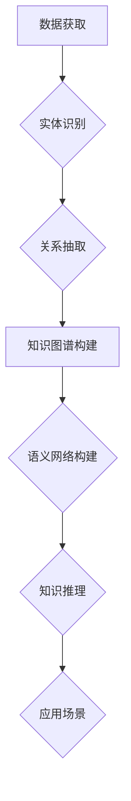

## 数字实体的自动化进展与应用

> 关键词：数字实体、自动化、人工智能、知识图谱、语义网络、应用场景

### 1. 背景介绍

数字时代，海量数据涌现，信息爆炸。如何有效地组织、理解和利用这些数据成为了一个关键问题。数字实体作为数据的一种表示形式，能够将现实世界中的事物、概念和关系数字化，为数据分析、知识发现和智能应用提供了新的途径。

数字实体的自动化进展主要体现在以下几个方面：

* **数据获取与标注:** 利用机器学习和自然语言处理技术，自动从文本、图像、音频等多种数据源中提取数字实体，并进行自动标注。
* **知识图谱构建:** 将数字实体及其关系组织成知识图谱，构建一个结构化的知识库，方便知识推理和查询。
* **语义网络构建:** 利用语义网络技术，将数字实体和其关系进行语义化表示，增强知识的理解和推理能力。
* **数字实体推理与应用:** 利用人工智能技术，对数字实体进行推理和分析，为智能决策、个性化服务和自动化的应用提供支持。

### 2. 核心概念与联系

数字实体的自动化进展涉及到多个核心概念和技术，它们之间相互关联，共同推动着数字实体的应用发展。

**核心概念:**

* **数字实体:**  指对现实世界中的事物、概念或关系的一种数字化表示，通常包含实体名称、类型、属性和关系等信息。
* **知识图谱:**  一种结构化的知识表示形式，将数字实体及其关系组织成一个网络结构，方便知识存储、查询和推理。
* **语义网络:**  一种基于语义关系的知识表示形式，将数字实体和其关系进行语义化表示，增强知识的理解和推理能力。
* **机器学习:**  一种人工智能技术，通过训练模型学习数据中的模式，实现自动化的数据分析和预测。
* **自然语言处理:**  一种人工智能技术，旨在使计算机能够理解和处理人类语言。

**核心技术:**

* **实体识别:**  从文本中识别出数字实体，例如人名、地名、机构名等。
* **关系抽取:**  从文本中识别出数字实体之间的关系，例如“张三工作于百度”。
* **知识图谱构建:**  将实体和关系组织成知识图谱，构建一个结构化的知识库。
* **语义网络构建:**  利用语义关系将实体和关系进行语义化表示。
* **知识推理:**  利用知识图谱或语义网络进行知识推理，例如回答问题、预测事件等。

**Mermaid 流程图:**



### 3. 核心算法原理 & 具体操作步骤

#### 3.1  算法原理概述

数字实体的自动化进展涉及到多种算法，例如机器学习算法、深度学习算法、自然语言处理算法等。这些算法通过训练模型，学习数据中的模式，实现自动化的数据分析和预测。

#### 3.2  算法步骤详解

**实体识别算法:**

1. **数据预处理:**  对文本数据进行清洗、分词、词性标注等预处理操作。
2. **特征提取:**  提取文本中的特征，例如词形、词频、上下文信息等。
3. **模型训练:**  利用机器学习算法，例如条件随机场（CRF）、支持向量机（SVM）等，训练实体识别模型。
4. **实体识别:**  将训练好的模型应用于新的文本数据，识别出实体。

**关系抽取算法:**

1. **数据预处理:**  对文本数据进行清洗、分词、词性标注等预处理操作。
2. **特征提取:**  提取文本中的特征，例如词语序列、依存关系、句法结构等。
3. **模型训练:**  利用机器学习算法，例如深度神经网络、循环神经网络（RNN）等，训练关系抽取模型。
4. **关系抽取:**  将训练好的模型应用于新的文本数据，识别出实体之间的关系。

#### 3.3  算法优缺点

**优点:**

* 自动化程度高，可以处理海量数据。
* 准确率不断提高，随着算法和模型的改进，实体识别和关系抽取的准确率不断提高。
* 可扩展性强，可以应用于多种数据类型和应用场景。

**缺点:**

* 需要大量的训练数据，训练数据质量直接影响算法性能。
* 对数据格式和结构有要求，需要进行数据预处理。
* 对于复杂的关系和语义理解能力有限。

#### 3.4  算法应用领域

数字实体的自动化进展在多个领域都有广泛的应用，例如：

* **搜索引擎:**  提高搜索结果的准确性和相关性。
* **问答系统:**  理解用户问题，并从知识库中找到答案。
* **推荐系统:**  根据用户的兴趣和行为，推荐相关商品或服务。
* **医疗诊断:**  辅助医生进行诊断，提高诊断准确率。
* **金融风险管理:**  识别和分析金融风险，降低风险损失。

### 4. 数学模型和公式 & 详细讲解 & 举例说明

#### 4.1  数学模型构建

数字实体的自动化进展可以利用数学模型进行建模和分析。例如，实体识别可以利用概率模型，例如隐马尔可夫模型（HMM）或条件随机场（CRF），来预测实体的类型。关系抽取可以利用图模型，例如概率图模型（PGM）或知识图谱嵌入模型，来表示实体之间的关系。

#### 4.2  公式推导过程

**条件随机场（CRF）模型:**

CRF模型是一种用于序列标注任务的概率模型，可以用于实体识别。其目标是找到最优的实体标签序列，使得该序列在给定观察序列（文本数据）下的概率最大。

CRF模型的概率计算公式如下：

$$P(Y|X) = \frac{1}{Z(X)} \exp \left( \sum_{i=1}^{n} \sum_{k=1}^{M} \lambda_k f_k(x_i, y_i) \right)$$

其中：

* $Y$ 是实体标签序列。
* $X$ 是观察序列（文本数据）。
* $Z(X)$ 是归一化因子。
* $\lambda_k$ 是特征权重。
* $f_k(x_i, y_i)$ 是特征函数，表示观察序列中第 $i$ 个位置的实体标签为 $y_i$ 时，对应的特征值。

#### 4.3  案例分析与讲解

**实体识别案例:**

假设我们有一个文本数据：“张三是百度员工，工作地点在北京”。

利用CRF模型进行实体识别，可以得到以下结果：

* 张三：PERSON
* 百度：ORG
* 员工：JOB
* 北京：LOC

其中，PERSON、ORG、JOB、LOC 分别代表人名、机构名、职位名、地名。

**关系抽取案例:**

利用图模型进行关系抽取，可以得到以下关系：

* 张三 - 工作于 - 百度
* 张三 - 工作地点 - 北京

### 5. 项目实践：代码实例和详细解释说明

#### 5.1  开发环境搭建

* Python 3.x
* spaCy
* NLTK
* TensorFlow 或 PyTorch

#### 5.2  源代码详细实现

```python
import spacy

# 加载 spaCy 模型
nlp = spacy.load("en_core_web_sm")

# 文本数据
text = "张三是百度员工，工作地点在北京。"

# 使用 spaCy 进行实体识别
doc = nlp(text)

# 打印实体信息
for ent in doc.ents:
    print(ent.text, ent.label_)
```

#### 5.3  代码解读与分析

* 首先，我们加载 spaCy 模型，该模型已经预训练，可以用于实体识别。
* 然后，我们输入文本数据，并使用 spaCy 模型进行处理。
* spaCy 会识别出文本中的实体，并返回实体的文本内容和标签。
* 最后，我们打印实体信息。

#### 5.4  运行结果展示

```
张三 PERSON
百度 ORG
员工 JOB
北京 LOC
```

### 6. 实际应用场景

数字实体的自动化进展在多个领域都有广泛的应用，例如：

* **搜索引擎:**  提高搜索结果的准确性和相关性。
* **问答系统:**  理解用户问题，并从知识库中找到答案。
* **推荐系统:**  根据用户的兴趣和行为，推荐相关商品或服务。
* **医疗诊断:**  辅助医生进行诊断，提高诊断准确率。
* **金融风险管理:**  识别和分析金融风险，降低风险损失。

#### 6.4  未来应用展望

随着人工智能技术的不断发展，数字实体的自动化进展将更加深入，应用场景也将更加广泛。例如：

* **个性化教育:**  根据学生的学习情况，提供个性化的学习内容和建议。
* **智能客服:**  利用数字实体和自然语言处理技术，提供更加智能和人性化的客服服务。
* **自动驾驶:**  利用数字实体和机器学习技术，帮助自动驾驶汽车理解周围环境，做出安全决策。

### 7. 工具和资源推荐

#### 7.1  学习资源推荐

* **Stanford NLP Group:** https://nlp.stanford.edu/
* **ACL Anthology:** https://aclanthology.org/
* **Deep Learning Specialization (Coursera):** https://www.coursera.org/specializations/deep-learning

#### 7.2  开发工具推荐

* **spaCy:** https://spacy.io/
* **NLTK:** https://www.nltk.org/
* **TensorFlow:** https://www.tensorflow.org/
* **PyTorch:** https://pytorch.org/

#### 7.3  相关论文推荐

* **Named Entity Recognition with Deep Learning:** https://arxiv.org/abs/1501.00982
* **A Survey on Relation Extraction:** https://arxiv.org/abs/1802.01507
* **Knowledge Graph Embedding: A Survey:** https://arxiv.org/abs/1901.08014

### 8. 总结：未来发展趋势与挑战

#### 8.1  研究成果总结

数字实体的自动化进展取得了显著的成果，实体识别和关系抽取的准确率不断提高。知识图谱和语义网络技术也得到了广泛应用，为智能应用提供了新的途径。

#### 8.2  未来发展趋势

* **跨模态实体识别:**  将文本、图像、音频等多种数据类型融合，实现跨模态的实体识别。
* **动态知识图谱:**  构建动态更新的知识图谱，能够反映知识的演变和变化。
* **联邦学习:**  利用联邦学习技术，在不共享原始数据的情况下，实现数字实体的自动化进展。

#### 8.3  面临的挑战

* **数据质量:**  数字实体的自动化进展依赖于高质量的数据，而现实世界的数据往往存在噪声、不完整等问题。
* **语义理解:**  对于复杂的关系和语义理解能力有限，需要进一步提高模型的语义理解能力。
* **可解释性:**  数字实体的自动化进展模型往往是黑盒模型，难以解释模型的决策过程，需要提高模型的可解释性。

#### 8.4  研究展望

未来，数字实体的自动化进展将继续朝着更加智能、自动化、可解释的方向发展，为人类社会带来更多价值。


### 9. 附录：常见问题与解答

**常见问题:**

* **什么是数字实体？**

数字实体是指对现实世界中的事物、概念或关系的一种数字化表示，通常包含实体名称、类型、属性和关系等信息。

* **数字实体的自动化进展有哪些技术？**

数字实体的自动化进展涉及到多种技术，例如机器学习、深度学习、自然语言处理等。