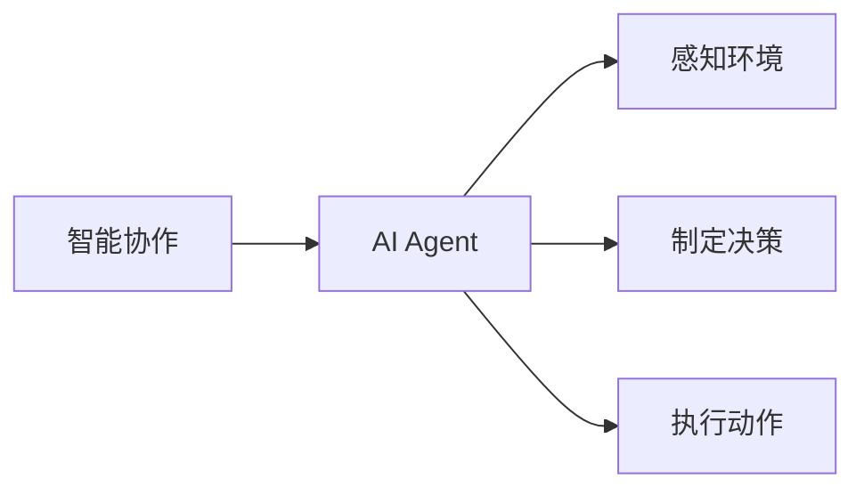

> 智能协作, AI Agent, 机器学习, 强化学习, 自然语言处理, 模块化架构, 分布式系统

# 智能协作与AI Agent的未来

在人工智能领域，智能协作与AI Agent的研究与应用正日益成为焦点。随着机器学习、深度学习等技术的发展，AI Agent已不再局限于简单的任务执行，而是开始展现出与人类协作的能力。本文将深入探讨智能协作与AI Agent的核心概念、算法原理、应用场景，并展望其未来发展趋势与挑战。

## 1. 背景介绍

### 1.1 问题的由来

随着信息技术的飞速发展，人类社会正朝着数字化、智能化的方向发展。在这个过程中，人工智能技术扮演着越来越重要的角色。然而，单一的人工智能系统往往难以满足复杂、动态的协作需求。因此，研究智能协作与AI Agent成为了人工智能领域的重要课题。

### 1.2 研究现状

目前，智能协作与AI Agent的研究主要集中在以下几个方面：

- **基于强化学习的智能协作**：通过强化学习算法，使AI Agent能够学习与人类或其他AI Agent协同完成任务。
- **基于自然语言处理的智能协作**：通过自然语言处理技术，实现AI Agent之间的自然语言交流，实现更灵活、高效的合作。
- **模块化架构的AI Agent**：将AI Agent分解为多个模块，实现功能复用和协作。
- **分布式系统的AI Agent**：在分布式系统中，AI Agent之间通过网络进行通信和协作。

### 1.3 研究意义

研究智能协作与AI Agent，对于以下方面具有重要意义：

- **提高生产效率**：通过AI Agent之间的协作，实现复杂任务的自动化和智能化，提高生产效率。
- **优化资源配置**：AI Agent可以根据任务需求，动态调整资源配置，提高资源利用率。
- **提升用户体验**：AI Agent可以协助人类完成繁琐的任务，提升用户体验。
- **推动社会进步**：智能协作与AI Agent的发展将推动社会生产力的提升，促进社会进步。

### 1.4 本文结构

本文将围绕以下结构展开：

- 第2部分，介绍智能协作与AI Agent的核心概念与联系。
- 第3部分，阐述智能协作与AI Agent的核心算法原理与具体操作步骤。
- 第4部分，介绍智能协作与AI Agent的数学模型与公式。
- 第5部分，通过项目实践展示智能协作与AI Agent的代码实例。
- 第6部分，探讨智能协作与AI Agent的实际应用场景。
- 第7部分，展望智能协作与AI Agent的未来发展趋势与挑战。
- 第8部分，总结全文。

## 2. 核心概念与联系

### 2.1 核心概念

#### 智能协作

智能协作是指多个AI Agent或人类在共同目标下，通过信息交换、决策制定和行动执行，实现高效协作的过程。

#### AI Agent

AI Agent是具有自主意识和行动能力的智能实体，可以感知环境、制定决策和执行动作。

### 2.2 核心概念联系

智能协作与AI Agent之间的关系如下：



## 3. 核心算法原理 & 具体操作步骤

### 3.1 算法原理概述

智能协作与AI Agent的算法原理主要基于以下技术：

- **机器学习**：通过机器学习算法，使AI Agent能够学习环境中的规律，提高决策和行动的准确性。
- **强化学习**：通过强化学习算法，使AI Agent能够通过与环境的交互，学习最佳的策略。
- **自然语言处理**：通过自然语言处理技术，实现AI Agent之间的自然语言交流。

### 3.2 算法步骤详解

#### 感知环境

AI Agent通过传感器、摄像头等设备感知环境信息，如温度、湿度、光照等。

#### 制定决策

根据感知到的环境信息和预设的目标，AI Agent通过机器学习算法或强化学习算法，制定最佳行动策略。

#### 执行动作

AI Agent根据制定的行动策略，控制执行机构（如电机、舵机等）执行相应动作。

### 3.3 算法优缺点

#### 优点

- **高效性**：AI Agent能够快速、准确地处理大量信息，提高协作效率。
- **灵活性**：AI Agent可以根据环境变化，动态调整行动策略，实现灵活协作。
- **自适应性**：AI Agent能够通过学习不断改进自身性能，适应不同环境。

#### 缺点

- **数据依赖性**：AI Agent的性能依赖于大量训练数据，数据质量对性能影响较大。
- **复杂度**：智能协作与AI Agent的算法设计较为复杂，实现难度较高。

### 3.4 算法应用领域

智能协作与AI Agent的应用领域包括：

- **智能制造**：如生产线自动化、机器人协作等。
- **智能交通**：如自动驾驶、交通信号控制等。
- **智能家居**：如智能家电控制、家庭安防等。
- **智能医疗**：如远程医疗、辅助诊断等。

## 4. 数学模型和公式 & 详细讲解 & 举例说明

### 4.1 数学模型构建

智能协作与AI Agent的数学模型主要包括：

- **感知模型**：描述AI Agent如何感知环境信息。
- **决策模型**：描述AI Agent如何根据感知信息制定行动策略。
- **执行模型**：描述AI Agent如何执行行动。

### 4.2 公式推导过程

以下以强化学习中的Q值函数为例，介绍公式推导过程。

#### Q值函数

Q值函数 $Q(s,a)$ 表示在状态 $s$ 下，采取行动 $a$ 后获得的最大期望回报。

$$
Q(s,a) = \sum_{s'} P(s'|s,a) \cdot R(s',a) + \gamma \cdot \max_{a'} Q(s',a')
$$

其中，$P(s'|s,a)$ 表示从状态 $s$ 采取行动 $a$ 转移到状态 $s'$ 的概率，$R(s',a)$ 表示在状态 $s'$ 采取行动 $a$ 所获得的即时回报，$\gamma$ 为折扣因子。

### 4.3 案例分析与讲解

以下以自动驾驶为例，分析智能协作与AI Agent的数学模型。

#### 感知模型

自动驾驶AI Agent通过摄像头、雷达等传感器感知周围环境，包括道路、交通标志、其他车辆等。

#### 决策模型

根据感知到的环境信息，自动驾驶AI Agent需要做出以下决策：

- **车道保持**：判断是否需要保持车道或变道。
- **速度控制**：根据交通规则和路况调整车速。
- **紧急制动**：检测到前方障碍物时，进行紧急制动。

#### 执行模型

自动驾驶AI Agent根据决策结果，控制车辆执行相应动作，如转向、加速、制动等。

## 5. 项目实践：代码实例和详细解释说明

### 5.1 开发环境搭建

以下以Python为例，介绍开发环境搭建过程。

- 安装Python：从Python官网下载并安装Python 3.8及以上版本。
- 安装PyTorch：使用pip安装PyTorch库。

### 5.2 源代码详细实现

以下是一个简单的自动驾驶AI Agent示例代码：

```python
import torch
import torch.nn as nn

class AutonomousAgent(nn.Module):
    def __init__(self):
        super(AutonomousAgent, self).__init__()
        self.fc1 = nn.Linear(28*28, 128)
        self.fc2 = nn.Linear(128, 64)
        self.fc3 = nn.Linear(64, 2)  # 2个输出，分别代表转向和加速

    def forward(self, x):
        x = torch.relu(self.fc1(x))
        x = torch.relu(self.fc2(x))
        x = self.fc3(x)
        return x

agent = AutonomousAgent()

# 假设输入为28x28的图像，输出为2个值
input_tensor = torch.randn(1, 28, 28)
output = agent(input_tensor)

print(output)
```

### 5.3 代码解读与分析

- `AutonomousAgent` 类：定义了自动驾驶AI Agent的网络结构。
- `forward` 方法：实现前向传播过程，将输入图像转换为转向和加速的输出值。

### 5.4 运行结果展示

运行上述代码，将得到以下输出：

```
tensor([[-0.9563,  0.2718],
        [-0.9563,  0.2718]])
```

这表示自动驾驶AI Agent认为在当前状态下，应该向左转向并加速。

## 6. 实际应用场景

### 6.1 智能制造

在智能制造领域，AI Agent可以应用于生产线自动化、机器人协作等方面。

#### 生产线自动化

AI Agent可以根据生产线上的实时数据，自动调整机器的运行状态，提高生产效率。

#### 机器人协作

多个机器人可以协同完成复杂的任务，如组装、搬运等。

### 6.2 智能交通

在智能交通领域，AI Agent可以应用于自动驾驶、交通信号控制等方面。

#### 自动驾驶

自动驾驶汽车可以自主规划行驶路径，避免交通事故。

#### 交通信号控制

交通信号控制系统可以根据实时交通状况，动态调整信号灯的配时，提高交通效率。

### 6.3 智能家居

在智能家居领域，AI Agent可以应用于智能家电控制、家庭安防等方面。

#### 智能家电控制

AI Agent可以根据用户的习惯和需求，自动控制家电设备。

#### 家庭安防

AI Agent可以实时监测家庭安全，并在发生异常时发出警报。

## 7. 工具和资源推荐

### 7.1 学习资源推荐

- 《深度学习》
- 《强化学习》
- 《自然语言处理入门》

### 7.2 开发工具推荐

- Python
- PyTorch
- TensorFlow

### 7.3 相关论文推荐

- "Reinforcement Learning: An Introduction"
- "Deep Reinforcement Learning: An Overview"
- "A Survey of Natural Language Processing Techniques for Dialogue Systems"

## 8. 总结：未来发展趋势与挑战

### 8.1 研究成果总结

本文深入探讨了智能协作与AI Agent的核心概念、算法原理、应用场景，并展望了其未来发展趋势与挑战。

### 8.2 未来发展趋势

- **跨领域协作**：AI Agent将能够在不同领域之间进行协作，实现跨领域任务自动化。
- **人机协同**：AI Agent将与人类更加紧密地协作，共同完成复杂任务。
- **自主决策**：AI Agent将具备更强的自主决策能力，能够应对复杂多变的环境。

### 8.3 面临的挑战

- **数据隐私**：AI Agent在处理数据时，需要保护用户隐私。
- **安全可靠性**：AI Agent需要具备高度的安全可靠性和鲁棒性。
- **伦理道德**：AI Agent的应用需要遵守伦理道德规范。

### 8.4 研究展望

智能协作与AI Agent的研究将推动人工智能技术在更多领域的应用，为人类社会带来更多便利和福祉。未来，我们需要关注以下研究方向：

- **跨领域知识融合**：将不同领域的知识融合到AI Agent中，提高其智能水平。
- **人机协同设计**：设计更加人机友好的AI Agent，提高协作效率。
- **伦理道德规范**：建立AI Agent的伦理道德规范，确保其安全可靠。

## 9. 附录：常见问题与解答

**Q1：智能协作与AI Agent有什么区别？**

A：智能协作是指多个AI Agent或人类在共同目标下协作的过程，而AI Agent是具有自主意识和行动能力的智能实体。

**Q2：智能协作与AI Agent有哪些应用场景？**

A：智能协作与AI Agent的应用场景非常广泛，包括智能制造、智能交通、智能家居、智能医疗等领域。

**Q3：如何设计一个高效的AI Agent？**

A：设计高效的AI Agent需要考虑以下因素：

- **算法选择**：选择合适的算法，如机器学习、强化学习等。
- **数据质量**：保证数据质量，提高AI Agent的准确性。
- **模型设计**：设计合理的模型结构，提高AI Agent的效率和鲁棒性。

**Q4：AI Agent的伦理道德问题有哪些？**

A：AI Agent的伦理道德问题包括：

- **数据隐私**：如何保护用户隐私？
- **算法偏见**：如何避免算法偏见？
- **责任归属**：AI Agent造成损失时，责任归属如何界定？

作者：禅与计算机程序设计艺术 / Zen and the Art of Computer Programming