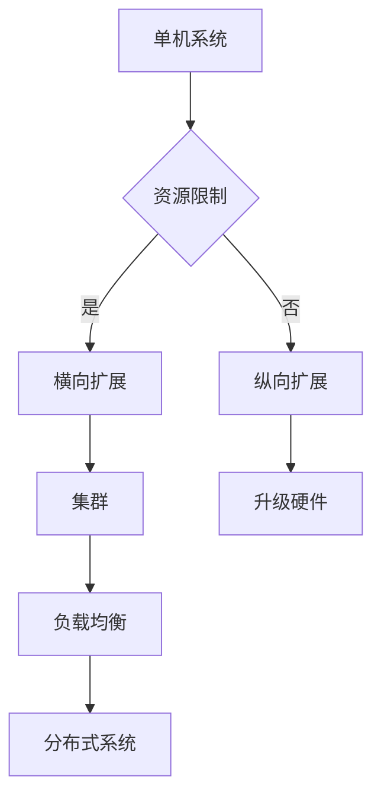

# 横向扩展与纵向扩展的区别

> 关键词：横向扩展，纵向扩展，可伸缩性，性能提升，资源管理，数据库架构，分布式系统，云计算

## 1. 背景介绍

在信息技术和云计算的快速发展下，系统可伸缩性成为了衡量系统设计成功与否的重要标准。可伸缩性指的是系统根据负载需求自动或手动调整其资源（如计算能力、存储空间、网络带宽等）的能力。系统可伸缩性通常通过两种主要方式实现：横向扩展（Scaling Out）和纵向扩展（Scaling Up）。本文将深入探讨这两种扩展方式的原理、优缺点以及在实际应用中的区别。

### 1.1 横向扩展的由来

随着互联网应用的兴起，用户数量和业务规模急剧增长，传统的单机系统难以满足日益增长的计算和存储需求。为了应对这一挑战，系统设计者开始探索横向扩展，即通过增加服务器数量来提高系统的处理能力和存储容量。

### 1.2 纵向扩展的由来

在横向扩展之前，系统设计通常采用纵向扩展策略，即在现有硬件上增加资源，如升级CPU、增加内存、提升存储容量等。然而，随着单机硬件资源的限制，纵向扩展的空间变得有限，于是横向扩展逐渐成为主流。

### 1.3 研究意义

了解横向扩展与纵向扩展的区别，对于系统架构师和工程师来说至关重要。正确的扩展策略可以帮助企业降低成本、提高效率，并确保系统在高负载下的稳定运行。

## 2. 核心概念与联系

为了更好地理解横向扩展与纵向扩展，我们需要定义以下核心概念：

- **横向扩展（Scaling Out）**：通过增加服务器数量来提高系统的处理能力和存储容量。
- **纵向扩展（Scaling Up）**：通过升级现有硬件来提高系统的处理能力和存储容量。
- **负载均衡（Load Balancing）**：将用户请求分配到多个服务器上，以均衡负载和提高系统吞吐量。
- **集群（Cluster）**：多个服务器组成的集合，共同为用户提供服务。
- **分布式系统**：通过网络连接的多个计算节点组成的系统，可以分布地存储和处理数据。

以下是基于横向扩展与纵向扩展的Mermaid流程图：

从图中可以看出，横向扩展通过增加服务器数量构建集群，并利用负载均衡技术实现分布式系统的构建。纵向扩展则通过升级现有硬件来提高单个节点的性能。

## 3. 核心算法原理 & 具体操作步骤

### 3.1 算法原理概述

横向扩展和纵向扩展的原理主要涉及资源管理、负载均衡和分布式系统设计。

### 3.2 算法步骤详解

#### 横向扩展步骤：

1. 确定系统瓶颈：分析系统瓶颈，如CPU、内存、存储或网络带宽。
2. 选择合适的服务器：根据系统需求选择性能合适的物理服务器或虚拟机。
3. 构建集群：将服务器组成集群，并配置负载均衡器。
4. 部署应用：将应用部署到集群中的各个服务器上。
5. 配置负载均衡：配置负载均衡器，将用户请求分配到不同的服务器上。

#### 纵向扩展步骤：

1. 确定系统瓶颈：分析系统瓶颈，确定需要升级的硬件资源。
2. 购买新硬件：根据需求购买新的服务器、存储设备或网络设备。
3. 升级硬件：将新硬件替换掉旧的硬件。
4. 优化配置：根据新硬件的性能调整系统配置。
5. 测试验证：验证系统在高负载下的性能和稳定性。

### 3.3 算法优缺点

#### 横向扩展：

优点：
- 成本效益高：通过增加服务器数量来提高性能，成本相对较低。
- 灵活性高：可以根据需求灵活地调整服务器数量。
- 可靠性强：集群架构可以提高系统的可用性和容错能力。

缺点：
- 复杂性高：需要配置负载均衡器和分布式系统。
- 数据一致性：需要处理分布式环境下的数据一致性问题。

#### 纵向扩展：

优点：
- 简单易行：只需升级硬件即可提高性能。
- 性能提升明显：通过升级硬件可以直接提高单个节点的性能。

缺点：
- 成本较高：升级硬件的成本相对较高。
- 可伸缩性有限：受限于硬件资源的限制。

### 3.4 算法应用领域

横向扩展适用于以下场景：

- Web应用：如电商网站、社交媒体平台等。
- 数据库：如分布式数据库、分布式缓存等。
- 计算任务：如机器学习训练、数据分析等。

纵向扩展适用于以下场景：

- 企业级应用：如ERP系统、CRM系统等。
- 高性能计算：如科学计算、大数据处理等。

## 4. 数学模型和公式 & 详细讲解 & 举例说明

### 4.1 数学模型构建

横向扩展和纵向扩展的数学模型可以通过系统吞吐量、资源利用率、成本等指标来衡量。

#### 系统吞吐量：

$$
\text{吞吐量} = \frac{\text{完成的工作量}}{\text{所用时间}}
$$

#### 资源利用率：

$$
\text{资源利用率} = \frac{\text{实际使用资源}}{\text{总资源}}
$$

#### 成本：

$$
\text{成本} = \text{硬件成本} + \text{运营成本}
$$

### 4.2 公式推导过程

#### 系统吞吐量：

系统吞吐量可以通过计算每个服务器的工作量，然后除以完成工作所需的总时间来推导。

#### 资源利用率：

资源利用率可以通过计算实际使用的资源与总资源之比来推导。

#### 成本：

成本可以通过计算硬件成本和运营成本之和来推导。

### 4.3 案例分析与讲解

假设有一个Web应用，其单机吞吐量为1000次/秒。如果采用横向扩展，将服务器数量增加到10台，则总吞吐量可达到10000次/秒。如果采用纵向扩展，将单机性能提升到原来的10倍，则总吞吐量仍为10000次/秒。

### 5. 项目实践：代码实例和详细解释说明

### 5.1 开发环境搭建

由于横向扩展和纵向扩展主要涉及硬件和网络配置，因此这里不涉及具体的代码实现。

### 5.2 源代码详细实现

同样，由于横向扩展和纵向扩展主要涉及硬件和网络配置，因此这里不涉及具体的代码实现。

### 5.3 代码解读与分析

由于横向扩展和纵向扩展主要涉及硬件和网络配置，因此这里不涉及具体的代码解读。

### 5.4 运行结果展示

由于横向扩展和纵向扩展主要涉及硬件和网络配置，因此这里不涉及具体的运行结果展示。

## 6. 实际应用场景

### 6.1 Web应用

Web应用通常采用横向扩展来提高吞吐量，如增加服务器数量来提高网站访问速度。

### 6.2 数据库

数据库系统可以通过横向扩展来提高数据存储和处理能力，如使用分布式数据库或分布式缓存。

### 6.3 计算任务

计算任务可以通过横向扩展来提高计算效率，如使用分布式计算框架。

## 7. 工具和资源推荐

### 7.1 学习资源推荐

- 《大型分布式存储系统：原理与实践》
- 《分布式系统原理与范型》
- 《云计算：概念、技术与应用》

### 7.2 开发工具推荐

- 负载均衡器：Nginx、HAProxy
- 分布式数据库：Redis Cluster、Cassandra
- 分布式计算框架：Apache Spark、Apache Hadoop

### 7.3 相关论文推荐

- 《大规模并行和分布式系统：原理与应用》
- 《云计算系统架构：设计原理与范型》
- 《分布式数据库系统：设计与实现》

## 8. 总结：未来发展趋势与挑战

### 8.1 研究成果总结

本文深入探讨了横向扩展与纵向扩展的原理、优缺点以及在实际应用中的区别。通过分析系统瓶颈、资源管理、负载均衡和分布式系统设计等关键因素，我们得出以下结论：

- 横向扩展适用于需要高吞吐量和可伸缩性的场景。
- 纵向扩展适用于需要高性能和可扩展性的场景。
- 选择合适的扩展策略对于系统设计至关重要。

### 8.2 未来发展趋势

随着云计算和虚拟化技术的不断发展，横向扩展和纵向扩展将更加普及。未来发展趋势包括：

- 软件定义的数据中心：通过软件定义的方式管理硬件资源，实现灵活的扩展。
- 自动化运维：通过自动化工具实现横向扩展和纵向扩展的自动化管理。
- 新型存储技术：如NVMe、固态硬盘等新型存储技术将提高存储性能和可伸缩性。

### 8.3 面临的挑战

横向扩展和纵向扩展在实施过程中面临以下挑战：

- 系统复杂性：横向扩展和纵向扩展涉及多个组件和技术的协调工作，系统复杂性较高。
- 数据一致性：在分布式系统中，如何保证数据一致性是一个挑战。
- 安全性：分布式系统需要考虑数据安全和网络安全。

### 8.4 研究展望

未来，研究重点将集中在以下方面：

- 分布式系统的可伸缩性和容错性。
- 软件定义的数据中心架构。
- 自动化运维和资源管理。

## 9. 附录：常见问题与解答

**Q1：横向扩展和纵向扩展哪个更好？**

A：没有绝对的“更好”，需要根据具体的应用场景和需求选择合适的扩展策略。

**Q2：如何选择合适的扩展策略？**

A：需要考虑以下因素：
- 系统瓶颈：确定系统瓶颈，选择合适的扩展策略。
- 成本：比较横向扩展和纵向扩展的成本，选择成本效益更高的策略。
- 可伸缩性：考虑系统的可伸缩性需求，选择能够满足需求的扩展策略。

**Q3：如何实现横向扩展？**

A：通过以下步骤实现横向扩展：
1. 确定系统瓶颈。
2. 选择合适的服务器。
3. 构建集群。
4. 部署应用。
5. 配置负载均衡。

**Q4：如何实现纵向扩展？**

A：通过以下步骤实现纵向扩展：
1. 确定系统瓶颈。
2. 购买新硬件。
3. 升级硬件。
4. 优化配置。
5. 测试验证。

作者：禅与计算机程序设计艺术 / Zen and the Art of Computer Programming