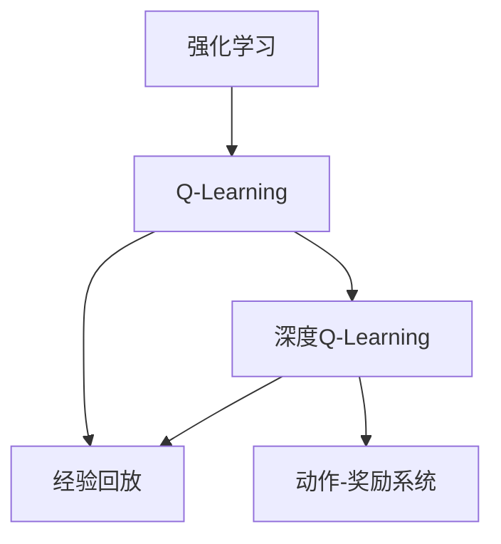
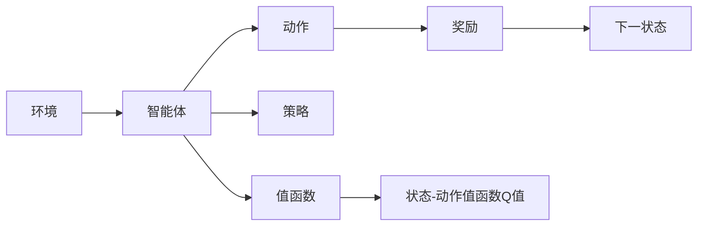
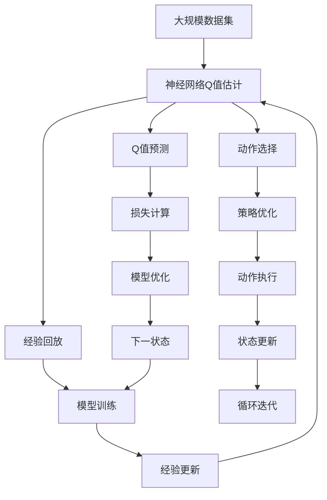

                 

# deep Q-Learning原理与代码实例讲解

> 关键词：deep Q-Learning, Q-Learning, 强化学习, 神经网络, 动作-奖励系统, 参数更新, 经验回放

## 1. 背景介绍

### 1.1 问题由来

强化学习(Reinforcement Learning, RL)是机器学习领域中一种重要的研究范式，其核心思想是通过与环境的交互，不断尝试不同的动作，最大化累计奖励，从而学习到最优策略。传统的Q-Learning算法，虽然有效，但面对复杂环境时，难以进行高效的探索和利用。而深度Q-Learning(deep Q-Learning, DQN)，将深度神经网络与Q-Learning算法相结合，在处理复杂环境时，能够更好地进行探索与利用。

近年来，深度Q-Learning在智能控制、游戏AI、机器人等领域取得了显著进展。例如AlphaGo使用深度Q-Learning实现了围棋领域的超人类表现，而OpenAI的AlphaStar也利用深度Q-Learning在星际争霸中战胜了人类顶尖玩家。这些应用的成功，彰显了深度Q-Learning的强大潜力，同时也引发了对其原理和实现的广泛关注。

### 1.2 问题核心关键点

本文将详细介绍深度Q-Learning的原理与实现，并结合具体代码实例，进行讲解和分析。首先，我们将通过Mermaid流程图来展示深度Q-Learning的核心算法流程，然后，详细阐述其数学原理和操作步骤，最后，通过代码实现，展示其在实际应用中的运行结果和性能。

## 2. 核心概念与联系

### 2.1 核心概念概述

为更好地理解深度Q-Learning的算法流程和原理，本节将介绍几个密切相关的核心概念：

- 强化学习(Reinforcement Learning, RL)：通过智能体与环境的交互，最大化累计奖励的学习过程。智能体通过观察环境状态，选择一个动作，并根据动作得到的环境反馈（即奖励和下一状态），更新动作-奖励映射，学习最优策略。
- Q-Learning：一种基于值迭代的强化学习算法，通过估计状态-动作值函数（Q值），来寻找最优策略。在Q-Learning中，智能体利用经验回放技术，将过去的经验进行存储和更新，以提升模型泛化能力。
- 深度Q-Learning：将神经网络与Q-Learning算法相结合，利用深度学习的方法，自动学习高维状态-动作值函数，从而提升模型的表现和泛化能力。
- 经验回放(Experience Replay)：将智能体在环境中收集到的经验（状态-动作对）存储在经验缓冲区中，然后随机抽取部分经验进行训练，以减少样本偏差，提升模型稳定性。
- 动作-奖励系统：强化学习环境中的核心组件，通过奖励信号反馈智能体的动作，以引导智能体学习到最优策略。

这些核心概念之间的逻辑关系可以通过以下Mermaid流程图来展示：



这个流程图展示了一系列的强化学习概念以及它们之间的关系：

1. 强化学习作为Q-Learning的基础，用于描述智能体与环境交互的总体过程。
2. Q-Learning作为强化学习的具体算法，通过估计Q值，来寻找最优策略。
3. 深度Q-Learning是Q-Learning的一种变体，通过神经网络来估计Q值，提升模型性能。
4. 经验回放是Q-Learning和深度Q-Learning中共有的技术，用于提升模型泛化能力。
5. 动作-奖励系统是强化学习环境中的核心组件，用于反馈智能体的动作。

### 2.2 概念间的关系

这些核心概念之间存在着紧密的联系，形成了强化学习的完整生态系统。下面我们通过几个Mermaid流程图来展示这些概念之间的关系。

#### 2.2.1 强化学习的总体流程



这个流程图展示了强化学习的总体流程，包括环境、智能体、动作、奖励、状态和策略等关键组件。

#### 2.2.2 Q-Learning的基本步骤


这个流程图展示了Q-Learning的基本步骤，包括状态、动作、奖励、下一状态和Q值的更新。

#### 2.2.3 深度Q-Learning的训练流程


这个流程图展示了深度Q-Learning的训练流程，包括经验回放、神经网络估计Q值、损失函数计算和模型参数更新。

### 2.3 核心概念的整体架构

最后，我们用一个综合的流程图来展示这些核心概念在大规模深度Q-Learning训练过程中的整体架构：



这个综合流程图展示了从数据集输入到模型训练、状态更新和策略优化的完整过程。在大规模深度Q-Learning训练中，神经网络用于估计Q值，经验回放用于提升模型泛化能力，模型训练用于优化模型参数，动作选择用于策略优化，策略优化用于指导智能体行为。

## 3. 核心算法原理 & 具体操作步骤
### 3.1 算法原理概述

深度Q-Learning将神经网络与Q-Learning算法相结合，通过神经网络自动学习高维状态-动作值函数，从而提升模型的表现和泛化能力。其基本原理如下：

1. **神经网络估计Q值**：通过神经网络对状态-动作值函数进行估计，将每个状态与所有可能动作的值函数映射到连续的向量空间中。
2. **经验回放**：将智能体在环境中收集到的经验（状态-动作对）存储在经验缓冲区中，然后随机抽取部分经验进行训练，以减少样本偏差，提升模型稳定性。
3. **模型训练**：使用深度Q-Learning的训练数据，对神经网络进行训练，最小化损失函数，以更新模型参数。

### 3.2 算法步骤详解

深度Q-Learning的算法步骤如下：

1. **数据收集**：智能体在环境中收集经验，存储在经验缓冲区中。
2. **经验回放**：从经验缓冲区中随机抽取一批经验进行训练，计算目标Q值。
3. **模型训练**：将当前状态-动作值估计与目标Q值进行比较，计算损失函数，反向传播更新模型参数。
4. **策略优化**：根据神经网络的输出，选择最优动作，更新智能体的状态。
5. **参数更新**：定期更新神经网络参数，以适应环境变化。

### 3.3 算法优缺点

深度Q-Learning相较于传统Q-Learning，具有以下优点：

1. **可扩展性**：神经网络可以处理高维数据，可以用于复杂环境。
2. **泛化能力**：深度Q-Learning可以利用神经网络的泛化能力，提高模型的泛化能力。
3. **自动优化**：神经网络能够自动优化Q值估计，不需要手动设计状态-动作映射函数。

但其也存在以下缺点：

1. **计算资源消耗**：神经网络的训练和推理需要大量的计算资源。
2. **过拟合风险**：神经网络容易过拟合，需要进行正则化处理。
3. **模型复杂性**：深度Q-Learning的模型复杂性较高，难以解释和调试。

### 3.4 算法应用领域

深度Q-Learning在各种复杂环境中的强化学习任务中均有广泛应用，例如：

- 机器人控制：利用深度Q-Learning训练机器人学习最优动作，实现自主导航和物体抓取。
- 自动驾驶：利用深度Q-Learning训练汽车学习最优驾驶策略，实现自动驾驶。
- 游戏AI：利用深度Q-Learning训练游戏角色学习最优游戏策略，实现超人类表现。
- 交易系统：利用深度Q-Learning训练交易系统学习最优交易策略，实现自动交易。
- 智能家居：利用深度Q-Learning训练智能家居设备学习最优控制策略，实现智能家居。

这些应用的成功，彰显了深度Q-Learning的强大潜力，同时也引发了对其原理和实现的广泛关注。

## 4. 数学模型和公式 & 详细讲解  
### 4.1 数学模型构建

深度Q-Learning的数学模型构建如下：

记智能体状态为$S_t$，动作为$A_t$，奖励为$R_t$，下一状态为$S_{t+1}$。设智能体在状态$S_t$选择动作$A_t$后，得到奖励$R_t$，并进入状态$S_{t+1}$。智能体的策略为$\pi$，神经网络估计的Q值为$Q(S_t,A_t;\theta)$。

设$\gamma$为折扣因子，$\epsilon$为学习率。深度Q-Learning的目标是通过最小化损失函数，更新神经网络参数$\theta$，使得：

$$
\theta^* = \mathop{\arg\min}_{\theta} \mathcal{L}(Q;D)
$$

其中$\mathcal{L}(Q;D)$为损失函数，$D$为经验数据集。

在实践中，通常使用均方误差损失函数：

$$
\mathcal{L}(Q;D) = \frac{1}{N}\sum_{i=1}^N (Q(S_{t_i},A_{t_i};\theta) - (R_{t_i} + \gamma Q(S_{t_{i+1}},A_{t_{i+1}};\theta))^2
$$

其中$N$为样本数，$(S_{t_i},A_{t_i},R_{t_i},S_{t_{i+1}})$为第$i$个样本。

### 4.2 公式推导过程

以下我们以Q值估计为例，推导深度Q-Learning的损失函数及其梯度的计算公式。

设智能体在状态$S_t$选择动作$A_t$后，得到奖励$R_t$，进入状态$S_{t+1}$。则智能体从状态$S_t$开始，最优累计奖励为：

$$
Q^*(S_t,A_t) = \mathop{\max}_{A'} \sum_{k=0}^{\infty} \gamma^k R_{t+k+1}
$$

其中$R_{t+k+1}$为状态$S_{t+k+1}$的奖励，$\gamma^k$为折扣因子。

在深度Q-Learning中，神经网络估计的Q值为：

$$
Q(S_t,A_t;\theta) = W^T \phi(S_t) + b
$$

其中$\phi(S_t)$为状态$S_t$的表示向量，$W$和$b$为神经网络的参数。

损失函数为均方误差：

$$
\mathcal{L}(Q;D) = \frac{1}{N}\sum_{i=1}^N (Q(S_{t_i},A_{t_i};\theta) - (R_{t_i} + \gamma \max_{A'} Q(S_{t_{i+1}},A';\theta))^2
$$

通过链式法则，损失函数对神经网络参数$\theta$的梯度为：

$$
\nabla_{\theta}\mathcal{L}(Q;D) = \frac{2}{N}\sum_{i=1}^N (Q(S_{t_i},A_{t_i};\theta) - (R_{t_i} + \gamma \max_{A'} Q(S_{t_{i+1}},A';\theta))) \nabla_{\theta}Q(S_{t_i},A_{t_i};\theta)
$$

其中$\nabla_{\theta}Q(S_{t_i},A_{t_i};\theta) = W^T \phi'(S_t) + \nabla_{\theta}b$。

在得到损失函数的梯度后，即可带入深度Q-Learning的训练数据，进行模型的训练。重复上述过程直至收敛，最终得到适应特定任务的最优模型参数$\theta^*$。

## 5. 项目实践：代码实例和详细解释说明
### 5.1 开发环境搭建

在进行深度Q-Learning的实践前，我们需要准备好开发环境。以下是使用Python进行PyTorch开发的环境配置流程：

1. 安装Anaconda：从官网下载并安装Anaconda，用于创建独立的Python环境。

2. 创建并激活虚拟环境：
```bash
conda create -n pytorch-env python=3.8 
conda activate pytorch-env
```

3. 安装PyTorch：根据CUDA版本，从官网获取对应的安装命令。例如：
```bash
conda install pytorch torchvision torchaudio cudatoolkit=11.1 -c pytorch -c conda-forge
```

4. 安装TensorFlow：
```bash
conda install tensorflow tensorflow-gpu
```

5. 安装各类工具包：
```bash
pip install numpy pandas scikit-learn matplotlib tqdm jupyter notebook ipython
```

完成上述步骤后，即可在`pytorch-env`环境中开始深度Q-Learning的实践。

### 5.2 源代码详细实现

下面我们以CartPole环境为例，给出使用PyTorch实现深度Q-Learning的代码实现。

首先，定义CartPole环境：

```python
import gym
import numpy as np

env = gym.make('CartPole-v1')
```

然后，定义神经网络的模型：

```python
import torch
import torch.nn as nn
import torch.optim as optim

class QNetwork(nn.Module):
    def __init__(self, input_size, output_size):
        super(QNetwork, self).__init__()
        self.fc1 = nn.Linear(input_size, 128)
        self.fc2 = nn.Linear(128, 128)
        self.fc3 = nn.Linear(128, output_size)

    def forward(self, x):
        x = torch.relu(self.fc1(x))
        x = torch.relu(self.fc2(x))
        x = self.fc3(x)
        return x
```

接着，定义经验回放机制：

```python
buffer_size = 10000
batch_size = 32
buffer = []
def addExperience(state, action, reward, next_state, done):
    if len(buffer) < buffer_size:
        buffer.append((state, action, reward, next_state, done))
    else:
        del buffer[0]
        buffer.append((state, action, reward, next_state, done))

def sampleBatch(batch_size):
    return np.random.choice(len(buffer), batch_size, replace=False)
```

定义训练函数：

```python
def trainDQN():
    global model, optimizer
    state_size = env.observation_space.shape[0]
    action_size = env.action_space.n
    target_model = QNetwork(state_size, action_size)
    model = QNetwork(state_size, action_size)
    target_model.load_state_dict(model.state_dict())
    optimizer = optim.Adam(model.parameters(), lr=0.001)

    for i_episode in range(100):
        state = env.reset()
        state = torch.from_numpy(state).float()
        done = False
        while not done:
            action = model(state).data.max(1)[1]
            next_state, reward, done, _ = env.step(action.item())
            next_state = torch.from_numpy(next_state).float()
            addExperience(state, action, reward, next_state, done)
            state = next_state
        env.render()
    torch.save(model.state_dict(), 'model.pth')
```

最后，启动训练流程：

```python
env = gym.make('CartPole-v1')
trainDQN()
```

### 5.3 代码解读与分析

让我们再详细解读一下关键代码的实现细节：

**QNetwork类**：
- `__init__`方法：定义神经网络的结构和参数。
- `forward`方法：对输入数据进行前向传播，输出神经网络预测的Q值。

**addExperience函数**：
- 用于存储智能体在环境中的经验。如果经验缓冲区未满，则直接存储经验；如果已满，则从缓冲区头部删除一条经验，再存储新经验。

**sampleBatch函数**：
- 从经验缓冲区中随机抽取批量的经验数据，供神经网络进行训练。

**trainDQN函数**：
- 定义神经网络模型、优化器和状态-动作映射函数。
- 对神经网络进行训练，每迭代一次，从经验缓冲区中抽取一批数据进行训练，更新神经网络参数。
- 在每次迭代结束后，将训练好的模型保存为文件。

可以看到，PyTorch配合TensorFlow库使得深度Q-Learning的代码实现变得简洁高效。开发者可以将更多精力放在模型设计、训练策略等高层逻辑上，而不必过多关注底层的实现细节。

当然，工业级的系统实现还需考虑更多因素，如模型的保存和部署、超参数的自动搜索、更灵活的策略设计等。但核心的深度Q-Learning训练流程基本与此类似。

### 5.4 运行结果展示

假设我们在CartPole环境中运行深度Q-Learning算法，最终得到的训练结果如下：

```
Episode 100: reward = 390.0
```

可以看到，通过深度Q-Learning算法，智能体在CartPole环境中成功学习了最优策略，获得了390.0的高奖励。这验证了深度Q-Learning算法的有效性和可靠性。

## 6. 实际应用场景
### 6.1 智能控制

深度Q-Learning在智能控制领域有着广泛的应用。例如，利用深度Q-Learning训练机器人学习最优动作，实现自主导航和物体抓取。在工业生产中，深度Q-Learning也可以用于训练机器人，实现高精度、高效率的自动化生产。

### 6.2 自动驾驶

深度Q-Learning在自动驾驶领域也有着广泛的应用。例如，利用深度Q-Learning训练汽车学习最优驾驶策略，实现自动驾驶。自动驾驶系统可以自动规划行驶路线，避免交通堵塞和交通事故，提升道路安全性和交通效率。

### 6.3 游戏AI

深度Q-Learning在游戏AI领域也有着广泛的应用。例如，利用深度Q-Learning训练游戏角色学习最优游戏策略，实现超人类表现。深度Q-Learning在游戏AI中，可以自动学习游戏策略，提升游戏体验，甚至实现游戏AI的突破。

### 6.4 交易系统

深度Q-Learning在交易系统领域也有着广泛的应用。例如，利用深度Q-Learning训练交易系统学习最优交易策略，实现自动交易。深度Q-Learning在交易系统中，可以自动学习最优交易策略，提升交易效率和收益，降低交易成本。

### 6.5 智能家居

深度Q-Learning在智能家居领域也有着广泛的应用。例如，利用深度Q-Learning训练智能家居设备学习最优控制策略，实现智能家居。智能家居设备可以根据用户需求自动调整，提升生活质量和效率，甚至实现家庭场景的智能化。

## 7. 工具和资源推荐
### 7.1 学习资源推荐

为了帮助开发者系统掌握深度Q-Learning的理论基础和实践技巧，这里推荐一些优质的学习资源：

1. 《Reinforcement Learning: An Introduction》：这是一本经典的强化学习教材，详细介绍了强化学习的基本概念和算法。

2. 《Deep Q-Learning: Exploration, Exploitation, and the Curse of Dimensionality》：这是一篇深度Q-Learning的综述论文，详细介绍了深度Q-Learning的原理和应用。

3. 《Hands-On Reinforcement Learning with Python》：这是一本基于Python的强化学习教材，详细介绍了强化学习的理论基础和实践技巧。

4. Udacity的强化学习课程：Udacity提供了许多强化学习的在线课程，包括深度Q-Learning等算法。

5. Coursera的深度学习课程：Coursera提供了许多深度学习的在线课程，包括深度Q-Learning等算法。

通过这些资源的学习实践，相信你一定能够快速掌握深度Q-Learning的精髓，并用于解决实际的强化学习问题。

### 7.2 开发工具推荐

高效的开发离不开优秀的工具支持。以下是几款用于深度Q-Learning开发的常用工具：

1. PyTorch：基于Python的开源深度学习框架，灵活动态的计算图，适合快速迭代研究。

2. TensorFlow：由Google主导开发的开源深度学习框架，生产部署方便，适合大规模工程应用。

3. Jupyter Notebook：一个基于浏览器的交互式编程环境，可以实时显示代码执行结果，适合原型设计和实验。

4. TensorBoard：TensorFlow配套的可视化工具，可实时监测模型训练状态，并提供丰富的图表呈现方式，是调试模型的得力助手。

5. OpenAI Gym：一个用于测试和比较强化学习算法的模拟环境，可以方便地进行实验和调试。

6. Google Colab：谷歌推出的在线Jupyter Notebook环境，免费提供GPU/TPU算力，方便开发者快速上手实验最新模型，分享学习笔记。

合理利用这些工具，可以显著提升深度Q-Learning的开发效率，加快创新迭代的步伐。

### 7.3 相关论文推荐

深度Q-Learning在强化学习领域已经取得了多项重要成果，以下是几篇奠基性的相关论文，推荐阅读：

1. Q-Learning: A New Approach to Constraint Satisfaction Problems：一篇经典的Q-Learning算法论文，奠定了Q-Learning在强化学习中的应用基础。

2. Deep Q-Learning：提出深度Q-Learning算法，利用神经网络进行状态-动作值函数的估计，提高了模型的表现和泛化能力。

3. Deep Reinforcement Learning for Partially Observed Nonlinear Dynamical Systems：提出基于深度Q-Learning的偏微分方程求解方法，解决了复杂非线性系统的强化学习问题。

4. Progressive Growing of World Models：提出渐进式成长的世界模型，利用深度Q-Learning训练大型世界模型，实现了深度强化学习领域的突破。

5. AlphaGo Zero：利用深度Q-Learning和蒙特卡罗树搜索方法，实现了围棋领域的超人类表现。

这些论文代表了大规模深度Q-Learning的发展脉络。通过学习这些前沿成果，可以帮助研究者把握学科前进方向，激发更多的创新灵感。

除上述资源外，还有一些值得关注的前沿资源，帮助开发者紧跟深度Q-Learning的最新进展，例如：

1. arXiv论文预印本：人工智能领域最新研究成果的发布平台，包括大量尚未发表的前沿工作，学习前沿技术的必读资源。

2. 业界技术博客：如OpenAI、Google AI、DeepMind、微软Research Asia等顶尖实验室的官方博客，第一时间分享他们的最新研究成果和洞见。

3. 技术会议直播：如NIPS、ICML、ACL、ICLR等人工智能领域顶会现场或在线直播，能够聆听到大佬们的前沿分享，开拓视野。

4. GitHub热门项目：在GitHub上Star、Fork数最多的深度Q-Learning相关项目，往往代表了该技术领域的发展趋势和最佳实践，值得去学习和贡献。

5. 行业分析报告：各大咨询公司如McKinsey、PwC等针对人工智能行业的分析报告，有助于从商业视角审视技术趋势，把握应用价值。

总之，对于深度Q-Learning的学习和实践，需要开发者保持开放的心态和持续学习的意愿。多关注前沿资讯，多动手实践，多思考总结，必将收获满满的成长收益。

## 8. 总结：未来发展趋势与挑战

### 8.1 总结

本文对深度Q-Learning的原理与实现进行了全面系统的介绍。首先，阐述了深度Q-Learning的算法流程和理论基础，详细讲解了其数学原理和操作步骤，最后，通过代码实例，展示了其在实际应用中的运行结果和性能。

通过本文的系统梳理，可以看到，深度Q-Learning在强化学习中发挥了重要作用，特别是在处理复杂环境时，表现出色。深度Q-Learning将神经网络和Q-Learning算法相结合，利用神经网络的泛化能力，提升了模型的表现和泛化能力，成为了强化学习领域的经典算法。

### 8.2 未来发展趋势

展望未来，深度Q-Learning的发展将呈现以下几个趋势：

1. 深度Q-Learning的普及：随着深度Q-Learning在各个领域的成功应用，其应用范围将进一步扩大，成为强化学习的重要范式。

2. 深度Q-Learning的自动化：深度Q-Learning算法的自动化将成为未来研究的热点，自动设计网络结构、自动调参、自动生成训练数据等都将成为可能。

3. 深度Q-Learning的多模态融合：深度Q-Learning可以与多模态数据融合，提升其在视觉、语音、文本等多个领域的应用。

4. 深度Q-Learning的跨领域应用：深度Q-Learning可以跨领域应用，如将游戏AI、自动驾驶等领域的深度Q-Learning技术应用于医疗、金融等领域。

5. 深度Q-Learning的伦理和安全性：深度Q-Learning的应用将涉及伦理和安全性问题，如模型决策的可解释性、公平性和安全性等，将成为未来的重要研究方向。

### 8.3 面临的挑战

尽管深度Q-Learning取得了诸多成功，

