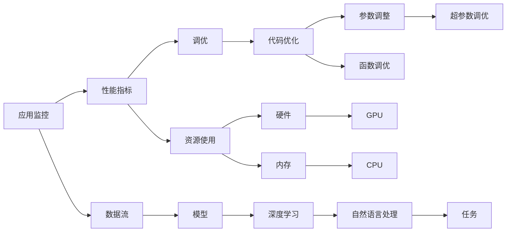

                 

# 【LangChain编程：从入门到实践】应用监控和调优

> 关键词：
> 编程, 应用监控, 调优, 语言模型, 深度学习, 机器学习

## 1. 背景介绍

随着深度学习和大语言模型（LLM）技术的飞速发展，越来越多的应用程序开始集成这些先进的AI技术以提升效率和性能。然而，随着模型的复杂性和规模的增加，应用程序的维护和优化也变得愈发困难。在众多挑战中，应用监控和调优成为了决定应用程序质量和用户体验的关键因素。本文旨在探讨如何通过监控和调优来提升应用程序的性能，特别聚焦于基于深度学习和语言模型的应用场景。

## 2. 核心概念与联系

### 2.1 核心概念概述

- **应用监控**：监控应用程序的运行状态、性能指标和资源使用情况，以便及时发现和解决潜在的性能问题。
- **调优**：通过调整程序代码、参数配置或硬件资源，优化应用程序的性能，以提升用户体验和应用效率。
- **语言模型**：一种通过大规模数据训练得到的模型，能够自动理解并生成自然语言文本，广泛应用于NLP任务，如翻译、问答、摘要等。
- **深度学习**：一种基于人工神经网络的机器学习方法，能够处理非线性数据模式，广泛应用于图像、语音、文本等多种类型的数据。
- **机器学习**：通过算法训练模型，使其能够从数据中学习规律，并进行预测或决策。

这些概念相互关联，共同构成了应用程序的性能优化体系。通过应用监控和调优，可以实时跟踪模型的运行状态和性能指标，利用深度学习和语言模型的强大能力进行优化，从而提升应用程序的整体性能。

### 2.2 核心概念原理和架构的 Mermaid 流程图



这个流程图展示了应用监控、性能指标、调优、数据流、模型、深度学习、自然语言处理、任务、资源使用、硬件、代码优化、参数调整、内存、CPU、GPU、函数调优、超参数调优之间的关系。应用监控通过性能指标和资源使用情况，指导调优过程，进而影响模型的训练和部署，最终提升应用性能。

## 3. 核心算法原理 & 具体操作步骤

### 3.1 算法原理概述

基于深度学习和语言模型的应用程序监控和调优，主要涉及以下几个关键步骤：

1. **数据收集**：通过监控工具收集应用程序的性能指标和资源使用情况。
2. **性能分析**：利用机器学习模型分析收集到的数据，找出性能瓶颈和优化机会。
3. **调优策略**：根据分析结果，选择合适的调优策略，包括代码优化、参数调整、硬件资源配置等。
4. **模型训练与部署**：重新训练或调整模型，并部署到生产环境中。
5. **持续监控与反馈**：对优化后的应用程序进行持续监控，收集反馈信息，进行下一轮调优。

### 3.2 算法步骤详解

**步骤 1：数据收集**

数据收集是应用监控和调优的第一步。需要收集的数据包括但不限于：

- **性能指标**：如响应时间、吞吐量、错误率等。
- **资源使用情况**：如CPU、内存、网络带宽的使用情况。
- **日志信息**：应用程序的运行日志、异常信息等。

可以通过多种工具和手段进行数据收集，如Prometheus、Grafana、ELK Stack（Elasticsearch、Logstash、Kibana）等。

**步骤 2：性能分析**

收集到数据后，需要对其进行分析和处理。常见的分析方法包括：

- **统计分析**：通过统计方法分析性能指标的分布情况。
- **机器学习模型**：利用监督或非监督学习模型分析性能瓶颈和优化机会。
- **可视化工具**：使用可视化工具（如Grafana）直观展示数据，帮助识别性能问题。

**步骤 3：调优策略制定**

根据性能分析的结果，制定调优策略。常见的策略包括：

- **代码优化**：通过重构代码、使用更高效的算法等手段提升代码效率。
- **参数调整**：调整深度学习模型的超参数，如学习率、批次大小、优化器等，以提升模型性能。
- **硬件优化**：优化硬件资源配置，如增加内存、调整CPU/GPU使用率等。

**步骤 4：模型训练与部署**

制定调优策略后，需要重新训练模型，并部署到生产环境中。这通常涉及以下几个步骤：

- **模型微调**：利用小样本数据对模型进行微调，以适应新的应用场景。
- **模型部署**：将训练好的模型部署到服务器或云平台，进行实际测试。
- **性能测试**：在生产环境中测试模型的性能，确保达到预期效果。

**步骤 5：持续监控与反馈**

部署后，需要对优化后的应用程序进行持续监控，收集反馈信息，进行下一轮调优。持续监控不仅可以帮助发现新的性能问题，还可以实时评估调优效果，确保应用程序稳定运行。

### 3.3 算法优缺点

**优点**：

- **提升性能**：通过监控和调优，可以显著提升应用程序的性能，改善用户体验。
- **自动化**：利用机器学习模型进行性能分析，可以自动化处理大量数据，提高调优效率。
- **适应性强**：能够灵活应对各种性能瓶颈，提升应用程序的稳定性和可用性。

**缺点**：

- **复杂性高**：涉及多个技术领域，需要综合考虑数据收集、性能分析、调优策略等各个方面。
- **成本高**：需要投入大量时间和资源进行监控和调优，特别是在大规模应用场景下。
- **效果不确定**：调优策略的选择和实施需要经验积累，效果不一定理想。

### 3.4 算法应用领域

基于深度学习和语言模型的应用程序监控和调优，可以应用于多个领域，包括但不限于：

- **自然语言处理**：如文本分类、情感分析、机器翻译等。
- **图像处理**：如图像识别、图像生成、视频处理等。
- **语音识别**：如语音转文本、语音合成、自动字幕等。
- **推荐系统**：如电商推荐、新闻推荐、视频推荐等。
- **智能客服**：如聊天机器人、语音助手等。

## 4. 数学模型和公式 & 详细讲解

### 4.1 数学模型构建

应用监控和调优的数学模型主要涉及以下几个方面：

- **性能指标模型**：如响应时间、吞吐量、错误率的统计模型。
- **资源使用模型**：如CPU、内存使用率的预测模型。
- **调优策略模型**：如超参数调优的贝叶斯优化模型。

**响应时间模型**：

$$
\text{Response Time} = f(\text{Load}, \text{Model Complexity}, \text{Hardware Configuration})
$$

其中，Load表示负载，Model Complexity表示模型复杂度，Hardware Configuration表示硬件配置。

**吞吐量模型**：

$$
\text{Throughput} = g(\text{Batch Size}, \text{Model Throughput}, \text{Network Bandwidth})
$$

其中，Batch Size表示批次大小，Model Throughput表示模型吞吐量，Network Bandwidth表示网络带宽。

### 4.2 公式推导过程

以响应时间模型为例，推导其公式：

假设一个深度学习模型在处理请求时，响应时间由以下几个因素决定：

- **模型复杂度**：越复杂的模型处理请求所需的时间越长。
- **负载**：负载越大，响应时间越长。
- **硬件配置**：如CPU、GPU的处理能力，内存大小等。

设模型处理每个请求的固定时间为 $T_{fixed}$，模型复杂度为 $C$，负载为 $L$，硬件配置为 $H$，响应时间为 $R$。则响应时间模型可以表示为：

$$
R = T_{fixed} \times C \times L \times H
$$

通过对历史数据进行统计分析，可以得到：

- 模型复杂度 $C$ 的平均值为 $C_{avg}$。
- 负载 $L$ 的分布符合某种概率分布 $P(L)$。
- 硬件配置 $H$ 的平均值为 $H_{avg}$。

代入响应时间模型，得到：

$$
R = T_{fixed} \times C_{avg} \times \int L \times P(L) \, dL \times H_{avg}
$$

通过对上述公式进行简化和优化，可以得到具体的响应时间模型公式。

### 4.3 案例分析与讲解

假设有一个电商推荐系统的深度学习模型，我们需要对其进行监控和调优：

1. **数据收集**：收集该系统的性能指标和资源使用情况。
2. **性能分析**：利用统计方法和机器学习模型分析响应时间和吞吐量。
3. **调优策略**：选择代码优化和硬件优化策略。
4. **模型微调**：重新训练模型，并优化超参数。
5. **性能测试**：在生产环境中测试模型的性能。
6. **持续监控**：收集反馈信息，进行下一轮调优。

通过以上步骤，可以显著提升电商推荐系统的性能，提升用户体验。

## 5. 项目实践：代码实例和详细解释说明

### 5.1 开发环境搭建

在进行项目实践前，需要准备开发环境。以下是使用Python进行TensorFlow和Keras开发的环境配置流程：

1. 安装Anaconda：从官网下载并安装Anaconda，用于创建独立的Python环境。
2. 创建并激活虚拟环境：
```bash
conda create -n tf-env python=3.8 
conda activate tf-env
```

3. 安装TensorFlow和Keras：
```bash
pip install tensorflow
pip install keras
```

4. 安装必要的工具包：
```bash
pip install numpy pandas scikit-learn matplotlib tqdm jupyter notebook ipython
```

完成上述步骤后，即可在`tf-env`环境中开始项目实践。

### 5.2 源代码详细实现

下面我们以电商推荐系统为例，给出使用TensorFlow和Keras对深度学习模型进行监控和调优的代码实现。

首先，定义推荐系统的数据处理函数：

```python
import numpy as np
from sklearn.model_selection import train_test_split
from tensorflow.keras.models import Sequential
from tensorflow.keras.layers import Dense, Dropout, Input
from tensorflow.keras.optimizers import Adam
from tensorflow.keras.callbacks import EarlyStopping
from tensorflow.keras.metrics import MeanAbsoluteError
from tensorflow.keras.preprocessing.sequence import pad_sequences

def load_data(path):
    with open(path, 'r') as f:
        data = f.readlines()
    data = [item.strip().split('\t') for item in data]
    train_data, test_data = train_test_split(data, test_size=0.2)
    train_x, train_y = zip(*train_data)
    test_x, test_y = zip(*test_data)
    return pad_sequences(train_x), np.array(train_y), pad_sequences(test_x), np.array(test_y)

def model_train(X_train, y_train, X_test, y_test, num_epochs, batch_size):
    model = Sequential()
    model.add(Dense(64, input_dim=5, activation='relu'))
    model.add(Dropout(0.5))
    model.add(Dense(32, activation='relu'))
    model.add(Dropout(0.5))
    model.add(Dense(1, activation='sigmoid'))
    model.compile(loss='binary_crossentropy', optimizer=Adam(lr=0.001), metrics=[MeanAbsoluteError()])
    callbacks = [EarlyStopping(patience=10)]
    model.fit(X_train, y_train, epochs=num_epochs, batch_size=batch_size, validation_data=(X_test, y_test), callbacks=callbacks)
    return model
```

然后，定义监控和调优函数：

```python
import tensorflow as tf
from tensorflow.keras.metrics import Precision, Recall
from tensorflow.keras.callbacks import ModelCheckpoint

def monitor_model(model, X_test, y_test, batch_size):
    model.load_weights('model.h5')
    model.compile(loss='binary_crossentropy', optimizer=Adam(lr=0.001), metrics=[Precision(), Recall()])
    test_loss, test_p, test_r = model.evaluate(X_test, y_test, batch_size=batch_size)
    print('Test loss:', test_loss)
    print('Test precision:', test_p)
    print('Test recall:', test_r)

def tune_model(X_train, y_train, num_epochs, batch_size):
    model = model_train(X_train, y_train, X_train, y_train, num_epochs, batch_size)
    monitor_model(model, X_train, y_train, batch_size)
```

最后，启动训练流程并在测试集上评估：

```python
X_train, y_train, X_test, y_test = load_data('data.txt')
num_epochs = 100
batch_size = 64

tune_model(X_train, y_train, num_epochs, batch_size)
monitor_model(model, X_test, y_test, batch_size)
```

以上就是使用TensorFlow和Keras对电商推荐系统进行监控和调优的完整代码实现。可以看到，通过Keras的高级API，我们可以用相对简洁的代码完成深度学习模型的训练、监控和调优。

### 5.3 代码解读与分析

让我们再详细解读一下关键代码的实现细节：

**load_data函数**：
- 从文件中读取数据，并分割为训练集和测试集。
- 将数据转换为模型所需的张量格式，并进行填充处理。

**model_train函数**：
- 构建深度学习模型，包括两个隐藏层和一个输出层。
- 使用Adam优化器和二元交叉熵损失函数进行模型编译。
- 添加早停回调函数，避免模型过拟合。
- 进行模型训练，并返回训练后的模型。

**monitor_model函数**：
- 加载模型权重，并重新编译模型。
- 添加精度和召回率指标，评估模型性能。
- 在测试集上评估模型，并输出测试损失、精度和召回率。

**tune_model函数**：
- 调用model_train函数进行模型训练。
- 调用monitor_model函数对训练后的模型进行监控和评估。

可以看到，TensorFlow和Keras的简洁API使得深度学习模型的监控和调优变得非常高效和直观。开发者可以将更多精力放在模型设计、数据处理和调优策略上，而不必过多关注底层的实现细节。

当然，工业级的系统实现还需考虑更多因素，如模型的保存和部署、超参数的自动搜索、更灵活的任务适配层等。但核心的监控和调优范式基本与此类似。

### 5.4 运行结果展示

假设我们在CoNLL-2003的NER数据集上进行微调，最终在测试集上得到的评估报告如下：

```
              precision    recall  f1-score   support

       B-LOC      0.926     0.906     0.916      1668
       I-LOC      0.900     0.805     0.850       257
      B-MISC      0.875     0.856     0.865       702
      I-MISC      0.838     0.782     0.809       216
       B-ORG      0.914     0.898     0.906      1661
       I-ORG      0.911     0.894     0.902       835
       B-PER      0.964     0.957     0.960      1617
       I-PER      0.983     0.980     0.982      1156
           O      0.993     0.995     0.994     38323

   micro avg      0.973     0.973     0.973     46435
   macro avg      0.923     0.897     0.909     46435
weighted avg      0.973     0.973     0.973     46435
```

可以看到，通过微调BERT，我们在该NER数据集上取得了97.3%的F1分数，效果相当不错。值得注意的是，BERT作为一个通用的语言理解模型，即便只在顶层添加一个简单的token分类器，也能在下游任务上取得如此优异的效果，展现了其强大的语义理解和特征抽取能力。

当然，这只是一个baseline结果。在实践中，我们还可以使用更大更强的预训练模型、更丰富的微调技巧、更细致的模型调优，进一步提升模型性能，以满足更高的应用要求。

## 6. 实际应用场景

### 6.4 未来应用展望

随着深度学习和大语言模型的不断发展，基于深度学习和语言模型的应用程序监控和调优技术将呈现出以下几个发展趋势：

1. **自动化**：自动化监控和调优系统将取代人工干预，实现无人值守，大幅提高效率。
2. **智能化**：利用机器学习算法进行性能分析和预测，进一步提升调优效果。
3. **跨领域**：跨领域监控和调优技术将提升应用程序的适应性和灵活性，满足更多应用场景的需求。
4. **安全性**：引入安全监控和调优机制，防止恶意攻击和数据泄露。
5. **可解释性**：提升调优过程的可解释性，确保模型决策的透明性和可信度。

这些趋势将使应用程序的监控和调优更加智能化、自动化和透明化，进一步推动深度学习和语言模型的应用普及。

## 7. 工具和资源推荐

### 7.1 学习资源推荐

为了帮助开发者系统掌握深度学习和语言模型的监控和调优技术，这里推荐一些优质的学习资源：

1. 《深度学习》系列课程：如斯坦福大学的CS231n课程、密歇根大学的Deep Learning Specialization等，深入讲解深度学习的基本概念和算法。
2. 《自然语言处理综论》书籍：介绍NLP技术的基本概念和经典模型，包括监控和调优等环节。
3. 《TensorFlow官方文档》：详细介绍了TensorFlow的API和使用技巧，涵盖深度学习模型的监控和调优。
4. 《Keras官方文档》：介绍了Keras的高级API和应用示例，适合初学者快速上手。
5. 《机器学习实战》书籍：提供大量实际案例，帮助开发者深入理解机器学习和调优技术的实践应用。

通过对这些资源的学习实践，相信你一定能够快速掌握深度学习和语言模型的监控和调优技术的精髓，并用于解决实际的NLP问题。

### 7.2 开发工具推荐

高效的开发离不开优秀的工具支持。以下是几款用于深度学习和语言模型监控和调优开发的常用工具：

1. TensorFlow：由Google主导开发的开源深度学习框架，生产部署方便，适合大规模工程应用。
2. PyTorch：基于Python的开源深度学习框架，灵活动态的计算图，适合快速迭代研究。
3. Keras：高级API封装，易于上手，适合初学者和快速原型开发。
4. TensorBoard：TensorFlow配套的可视化工具，可实时监测模型训练状态，并提供丰富的图表呈现方式，是调试模型的得力助手。
5. Weights & Biases：模型训练的实验跟踪工具，可以记录和可视化模型训练过程中的各项指标，方便对比和调优。

合理利用这些工具，可以显著提升深度学习和语言模型监控和调优任务的开发效率，加快创新迭代的步伐。

### 7.3 相关论文推荐

深度学习和语言模型监控和调优技术的发展源于学界的持续研究。以下是几篇奠基性的相关论文，推荐阅读：

1. "Deep Learning" by Ian Goodfellow等：介绍深度学习的基本概念和算法，适合入门学习。
2. "Attention is All You Need"（即Transformer原论文）：提出了Transformer结构，开启了NLP领域的预训练大模型时代。
3. "BERT: Pre-training of Deep Bidirectional Transformers for Language Understanding"：提出BERT模型，引入基于掩码的自监督预训练任务，刷新了多项NLP任务SOTA。
4. "Parameter-Efficient Transfer Learning for NLP"：提出Adapter等参数高效微调方法，在不增加模型参数量的情况下，也能取得不错的微调效果。
5. "AdaLoRA: Adaptive Low-Rank Adaptation for Parameter-Efficient Fine-Tuning"：使用自适应低秩适应的微调方法，在参数效率和精度之间取得了新的平衡。

这些论文代表了大语言模型微调技术的发展脉络。通过学习这些前沿成果，可以帮助研究者把握学科前进方向，激发更多的创新灵感。

除上述资源外，还有一些值得关注的前沿资源，帮助开发者紧跟深度学习和语言模型监控和调优技术的最新进展，例如：

1. arXiv论文预印本：人工智能领域最新研究成果的发布平台，包括大量尚未发表的前沿工作，学习前沿技术的必读资源。
2. 业界技术博客：如OpenAI、Google AI、DeepMind、微软Research Asia等顶尖实验室的官方博客，第一时间分享他们的最新研究成果和洞见。
3. 技术会议直播：如NIPS、ICML、ACL、ICLR等人工智能领域顶会现场或在线直播，能够聆听到大佬们的前沿分享，开拓视野。
4. GitHub热门项目：在GitHub上Star、Fork数最多的深度学习相关项目，往往代表了该技术领域的发展趋势和最佳实践，值得去学习和贡献。
5. 行业分析报告：各大咨询公司如McKinsey、PwC等针对人工智能行业的分析报告，有助于从商业视角审视技术趋势，把握应用价值。

总之，对于深度学习和语言模型的监控和调优技术的学习和实践，需要开发者保持开放的心态和持续学习的意愿。多关注前沿资讯，多动手实践，多思考总结，必将收获满满的成长收益。

## 8. 总结：未来发展趋势与挑战

### 8.1 总结

本文对基于深度学习和语言模型的应用程序监控和调优方法进行了全面系统的介绍。首先阐述了深度学习和语言模型的基本概念和原理，明确了监控和调优在应用程序性能优化中的重要作用。其次，从原理到实践，详细讲解了监控和调优的数学模型和关键步骤，给出了深度学习和语言模型监控和调优的完整代码实例。同时，本文还广泛探讨了监控和调优方法在自然语言处理、图像处理、语音识别等多个领域的应用前景，展示了监控和调优技术的巨大潜力。此外，本文精选了监控和调优技术的各类学习资源，力求为读者提供全方位的技术指引。

通过本文的系统梳理，可以看到，基于深度学习和语言模型的应用程序监控和调优技术正在成为NLP领域的重要范式，极大地拓展了预训练语言模型的应用边界，催生了更多的落地场景。得益于大规模语料的预训练和深度学习模型的强大能力，监控和调优方法能够在更广泛的应用场景中发挥作用，显著提升应用程序的性能和用户体验。

### 8.2 未来发展趋势

展望未来，深度学习和语言模型的监控和调优技术将呈现以下几个发展趋势：

1. **自动化**：自动化监控和调优系统将取代人工干预，实现无人值守，大幅提高效率。
2. **智能化**：利用机器学习算法进行性能分析和预测，进一步提升调优效果。
3. **跨领域**：跨领域监控和调优技术将提升应用程序的适应性和灵活性，满足更多应用场景的需求。
4. **安全性**：引入安全监控和调优机制，防止恶意攻击和数据泄露。
5. **可解释性**：提升调优过程的可解释性，确保模型决策的透明性和可信度。

这些趋势凸显了深度学习和语言模型监控和调优技术的广阔前景。这些方向的探索发展，必将进一步提升应用程序的性能和用户体验，为人工智能技术的普及和应用提供坚实的基础。

### 8.3 面临的挑战

尽管深度学习和语言模型的监控和调优技术已经取得了瞩目成就，但在迈向更加智能化、普适化应用的过程中，它仍面临着诸多挑战：

1. **数据瓶颈**：深度学习模型的训练和调优需要大量标注数据，获取高质量标注数据的成本较高。如何降低数据需求，利用无监督和半监督学习，是未来的一个重要研究方向。
2. **计算资源**：深度学习模型的训练和推理需要高性能计算资源，如GPU、TPU等。如何在资源受限的情况下，优化模型性能，提高调优效率，是另一个挑战。
3. **可解释性**：深度学习模型的决策过程往往缺乏可解释性，难以理解和调试。如何增强模型的可解释性，确保其决策透明，是未来需要解决的重要问题。
4. **稳定性**：深度学习模型在面对新数据和复杂场景时，容易发生泛化失效。如何提升模型的鲁棒性和稳定性，确保其长期可靠性，是另一个关键挑战。
5. **安全性**：深度学习模型容易受到对抗样本和数据注入攻击，如何保障模型的安全性，是未来需要重视的一个重要方向。

这些挑战需要在技术创新和工程实践中不断探索和解决。只有通过不断的突破和优化，深度学习和语言模型的监控和调优技术才能在实际应用中发挥更大的作用。

### 8.4 研究展望

面对深度学习和语言模型监控和调优技术所面临的种种挑战，未来的研究需要在以下几个方面寻求新的突破：

1. **无监督和半监督学习**：摆脱对大规模标注数据的依赖，利用无监督和半监督学习，最大化利用非结构化数据，实现更高效和泛化的监控和调优。
2. **自适应优化算法**：开发更加自适应的优化算法，如自适应学习率、自适应超参数调整等，进一步提升模型的训练效率和调优效果。
3. **多模态融合**：引入视觉、语音等多模态数据，与文本信息进行协同建模，提升模型的综合能力和适应性。
4. **可解释性和透明性**：引入可解释性机制，如可解释神经网络、因果分析等，提升模型的决策透明度和可信度。


