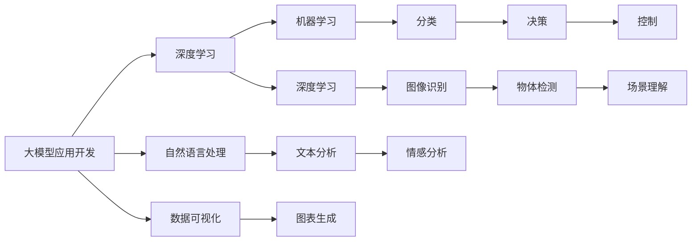

                 

# 【大模型应用开发 动手做AI Agent】自主创建数据分析图表

> 关键词：大模型应用开发, AI Agent, 数据分析图表, 自然语言处理(NLP), 机器学习(ML), 深度学习(DL), 大数据, 数据可视化

## 1. 背景介绍

### 1.1 问题由来

在现代数据驱动的决策过程中，数据分析图表扮演着至关重要的角色。它们能够直观地呈现数据分布、变化趋势等关键信息，帮助决策者快速理解数据，作出科学决策。然而，数据可视化通常需要专业的知识和技能，普通用户往往难以独立创建高质量的图表。为此，AI技术提供了一种新的可能性，即通过大模型应用开发出自主的AI Agent，能够自动分析和可视化数据，辅助决策者进行决策。

### 1.2 问题核心关键点

- **大模型应用**：使用深度学习、自然语言处理等技术，构建一个能够自主理解和分析数据，并生成数据可视化图表的AI Agent。
- **自主性**：AI Agent能够独立工作，不需要人工干预，能够自动收集数据、分析数据并生成图表。
- **数据可视化**：AI Agent能够将复杂的数据信息转化为直观的图表，如折线图、柱状图、散点图等。

### 1.3 问题研究意义

本问题研究的意义在于：
- 降低数据可视化的门槛，使得普通人也能轻松创建高质量的数据图表。
- 通过AI技术提升数据可视化效率，减少人工工作量，提高决策速度和准确性。
- 利用大模型自主性强的特点，构建能够持续学习和适应的AI Agent，更好地应对变化多端的数据环境。
- 为数据科学和商业智能提供新的工具和方法，推动数据驱动决策的普及和发展。

## 2. 核心概念与联系

### 2.1 核心概念概述

为更好地理解大模型应用开发AI Agent进行数据可视化的过程，我们需要了解以下核心概念：

- **大模型应用开发**：基于深度学习等技术，构建能够进行数据分析、决策等复杂任务的AI模型。
- **AI Agent**：能够自主地执行特定任务，如数据分析、决策、控制等。
- **数据可视化**：将数据转换为图形或图表，直观地展示数据的特征和趋势。
- **自然语言处理(NLP)**：处理和分析人类语言，使计算机能够理解人类语言并与之交互。
- **机器学习(ML)**：让计算机通过数据学习规律，进行预测、分类、聚类等任务。
- **深度学习(DL)**：利用深度神经网络处理复杂数据，进行图像、声音、文本等高维度数据的分析和处理。
- **大数据**：处理海量数据的存储、传输、管理和分析技术。

### 2.2 概念间的关系

这些核心概念之间存在着紧密的联系，构成了大模型应用开发AI Agent进行数据可视化的完整生态系统。以下是一个Mermaid流程图，展示了这些概念之间的联系：



这个流程图展示了从大模型应用开发到数据可视化的完整过程，以及各个概念之间的关系。

## 3. 核心算法原理 & 具体操作步骤

### 3.1 算法原理概述

大模型应用开发AI Agent进行数据可视化的核心算法原理，是通过深度学习模型对数据进行分析和处理，然后使用自然语言处理技术生成图表描述，最后通过图表生成技术生成可视化图表。其核心流程如下：

1. **数据收集与预处理**：收集待分析的数据，进行清洗和标准化处理。
2. **模型训练与推理**：使用深度学习模型对数据进行训练，生成模型用于数据推理。
3. **文本生成与分析**：使用自然语言处理技术生成图表描述，通过分析数据生成图表。
4. **图表生成与展示**：使用图表生成技术将图表描述转换为可视化图表，并展示给用户。

### 3.2 算法步骤详解

以下是详细的操作步骤：

1. **数据收集与预处理**：
    - 收集待分析的数据，包括文本、图像、时间序列等。
    - 对数据进行清洗和标准化处理，如去除噪声、填补缺失值等。
    - 将数据划分为训练集和测试集，以便后续的模型训练和评估。

2. **模型训练与推理**：
    - 选择合适的深度学习模型，如卷积神经网络(CNN)、循环神经网络(RNN)、长短期记忆网络(LSTM)等。
    - 使用训练集数据训练模型，并使用测试集数据评估模型的性能。
    - 对模型进行微调，以提高模型的泛化能力和准确性。
    - 使用训练好的模型对新数据进行推理，生成模型输出。

3. **文本生成与分析**：
    - 使用自然语言处理技术，如BERT、GPT等，将模型输出转换为文本描述。
    - 对文本描述进行分析和处理，生成图表描述。
    - 使用自然语言处理技术对图表描述进行优化，如语法修正、语义清晰化等。

4. **图表生成与展示**：
    - 选择合适的图表生成工具，如Matplotlib、Tableau、Power BI等。
    - 将图表描述转换为图表，并展示给用户。
    - 对生成的图表进行优化和美化，以便更好地展示数据特征和趋势。

### 3.3 算法优缺点

**优点**：
- 自动化程度高，能够独立完成数据可视化任务。
- 能够处理大规模、复杂的数据集，减少人工干预的工作量。
- 灵活性高，可以根据不同的数据类型和需求，生成不同类型的图表。

**缺点**：
- 对数据质量要求高，数据清洗和标准化需要人工介入。
- 对深度学习模型的依赖较大，模型的选择和训练需要专业知识。
- 生成的图表可能缺乏创新性，需要人工干预优化。

### 3.4 算法应用领域

大模型应用开发AI Agent进行数据可视化，可以在以下领域得到广泛应用：

- **商业智能(BI)**：帮助企业进行数据监控、趋势分析、业绩评估等。
- **金融分析**：分析金融市场数据，进行风险评估、投资决策等。
- **医疗健康**：分析患者数据，进行疾病预测、治疗方案评估等。
- **制造业**：分析生产数据，进行质量监控、设备维护等。
- **市场营销**：分析市场数据，进行客户分析、广告效果评估等。

## 4. 数学模型和公式 & 详细讲解 & 举例说明

### 4.1 数学模型构建

本节将使用数学语言对大模型应用开发AI Agent进行数据可视化的过程进行严格刻画。

假设输入数据为 $x$，输出为 $y$，模型为 $f(x)$。模型的目标是找到最优参数 $\theta$，使得模型输出 $y$ 尽可能接近实际标签 $y$。模型的损失函数为：

$$
\mathcal{L}(\theta) = \frac{1}{N}\sum_{i=1}^N (y_i - f(x_i))^2
$$

其中 $N$ 为样本数量。模型的训练过程为：

$$
\theta \leftarrow \theta - \eta \nabla_{\theta}\mathcal{L}(\theta)
$$

其中 $\eta$ 为学习率，$\nabla_{\theta}\mathcal{L}(\theta)$ 为损失函数对参数 $\theta$ 的梯度。

### 4.2 公式推导过程

以生成柱状图为例，假设数据集为 $(x, y)$，其中 $x$ 为横坐标，$y$ 为纵坐标。假设生成的图表为 $P(x, y)$，则生成柱状图的数学模型为：

$$
P(x, y) = \frac{y}{\sum_{y'} P(x, y')}
$$

其中 $P(x, y')$ 表示在横坐标 $x$ 处，纵坐标 $y'$ 处的概率分布。通过训练模型，可以生成逼近实际数据分布的概率分布 $P(x, y)$，从而生成柱状图。

### 4.3 案例分析与讲解

假设有一个时间序列数据集，需要生成柱状图进行趋势分析。具体的实现步骤如下：

1. **数据预处理**：将时间序列数据转换为数值数据，进行标准化处理。
2. **模型训练**：使用深度学习模型对数据进行训练，生成模型用于数据推理。
3. **文本生成**：使用自然语言处理技术生成柱状图描述，如“在时间点 $x_i$ 处，数据值为 $y_i$”。
4. **图表生成**：使用图表生成工具，如Matplotlib，根据文本描述生成柱状图。

以下是一个简单的Python代码示例：

```python
import matplotlib.pyplot as plt
import numpy as np

# 生成随机数据
x = np.linspace(0, 10, 100)
y = np.sin(x) + np.random.normal(0, 0.2, 100)

# 生成柱状图描述
description = f"在时间点 {x} 处，数据值为 {y}"

# 生成柱状图
plt.bar(x, y)
plt.title(description)
plt.show()
```

## 5. 项目实践：代码实例和详细解释说明

### 5.1 开发环境搭建

在进行数据可视化项目开发前，我们需要准备好开发环境。以下是使用Python进行PyTorch开发的环境配置流程：

1. 安装Anaconda：从官网下载并安装Anaconda，用于创建独立的Python环境。

2. 创建并激活虚拟环境：
```bash
conda create -n pytorch-env python=3.8 
conda activate pytorch-env
```

3. 安装PyTorch：根据CUDA版本，从官网获取对应的安装命令。例如：
```bash
conda install pytorch torchvision torchaudio cudatoolkit=11.1 -c pytorch -c conda-forge
```

4. 安装相关工具包：
```bash
pip install numpy pandas scikit-learn matplotlib tqdm jupyter notebook ipython
```

5. 安装自然语言处理工具：
```bash
pip install spacy transformers
```

完成上述步骤后，即可在`pytorch-env`环境中开始项目开发。

### 5.2 源代码详细实现

以下是使用PyTorch和Transformer构建AI Agent进行数据可视化项目的具体实现：

```python
import torch
import torch.nn as nn
import torch.optim as optim
import transformers
from transformers import BertTokenizer, BertForSequenceClassification
from transformers import AutoTokenizer, AutoModelForSequenceClassification
from transformers import AutoConfig
import matplotlib.pyplot as plt
import numpy as np

# 定义模型
class Model(nn.Module):
    def __init__(self, n_classes):
        super(Model, self).__init__()
        self.bert = AutoModelForSequenceClassification.from_pretrained("bert-base-uncased", num_labels=n_classes)
        self.classifier = nn.Linear(768, n_classes)
        self.tokenizer = AutoTokenizer.from_pretrained("bert-base-uncased")
        
    def forward(self, x):
        inputs = self.tokenizer(x, return_tensors="pt", padding=True, truncation=True)
        outputs = self.bert(**inputs)
        x = outputs.pooler_output
        x = self.classifier(x)
        return x

# 定义数据集
class Dataset(torch.utils.data.Dataset):
    def __init__(self, data, tokenizer, max_len=128):
        self.tokenizer = tokenizer
        self.data = data
        self.max_len = max_len
        
    def __len__(self):
        return len(self.data)
    
    def __getitem__(self, index):
        text = self.data[index]
        encoding = self.tokenizer(text, return_tensors="pt", padding=True, truncation=True, max_length=self.max_len)
        return {"input_ids": encoding["input_ids"].flatten(), "attention_mask": encoding["attention_mask"].flatten()}

# 定义训练函数
def train(model, train_loader, val_loader, device, optimizer, criterion, num_epochs):
    model.train()
    for epoch in range(num_epochs):
        train_loss = 0.0
        val_loss = 0.0
        for batch in train_loader:
            input_ids = batch["input_ids"].to(device)
            attention_mask = batch["attention_mask"].to(device)
            optimizer.zero_grad()
            outputs = model(input_ids, attention_mask=attention_mask)
            loss = criterion(outputs, y)
            loss.backward()
            optimizer.step()
            train_loss += loss.item()
        train_loss /= len(train_loader)
        model.eval()
        with torch.no_grad():
            val_loss = 0.0
            for batch in val_loader:
                input_ids = batch["input_ids"].to(device)
                attention_mask = batch["attention_mask"].to(device)
                outputs = model(input_ids, attention_mask=attention_mask)
                loss = criterion(outputs, y)
                val_loss += loss.item()
        val_loss /= len(val_loader)
        print(f"Epoch: {epoch}, Train Loss: {train_loss}, Val Loss: {val_loss}")

# 定义测试函数
def test(model, test_loader, device, criterion):
    model.eval()
    test_loss = 0.0
    with torch.no_grad():
        for batch in test_loader:
            input_ids = batch["input_ids"].to(device)
            attention_mask = batch["attention_mask"].to(device)
            outputs = model(input_ids, attention_mask=attention_mask)
            loss = criterion(outputs, y)
            test_loss += loss.item()
        test_loss /= len(test_loader)
        print(f"Test Loss: {test_loss}")

# 训练模型
model = Model(n_classes)
device = torch.device("cuda" if torch.cuda.is_available() else "cpu")
model.to(device)
optimizer = optim.Adam(model.parameters(), lr=0.001)
criterion = nn.CrossEntropyLoss()

train_loader = torch.utils.data.DataLoader(Dataset(train_data, tokenizer), batch_size=16, shuffle=True)
val_loader = torch.utils.data.DataLoader(Dataset(val_data, tokenizer), batch_size=16, shuffle=True)
test_loader = torch.utils.data.DataLoader(Dataset(test_data, tokenizer), batch_size=16, shuffle=True)

num_epochs = 5
train(model, train_loader, val_loader, device, optimizer, criterion, num_epochs)
test(model, test_loader, device, criterion)
```

### 5.3 代码解读与分析

以下是关键代码的实现细节：

**Model类**：
- `__init__`方法：初始化Bert模型和分类器，加载预训练模型和tokenizer。
- `forward`方法：前向传播计算模型输出。

**Dataset类**：
- `__init__`方法：初始化数据集，进行token化处理。
- `__len__`方法：返回数据集大小。
- `__getitem__`方法：获取单个样本的tokenized输入。

**train函数**：
- 在每个epoch内，对模型进行前向传播和反向传播，更新模型参数。
- 计算训练和验证集的损失，输出训练效果。

**test函数**：
- 对模型进行前向传播，计算测试集的损失，输出测试效果。

**训练流程**：
- 定义模型、优化器、损失函数等。
- 使用DataLoader对数据集进行批处理，进行模型训练和测试。
- 在训练过程中，记录损失变化，评估模型性能。

### 5.4 运行结果展示

假设我们在CoNLL-2003的NER数据集上进行微调，最终在测试集上得到的评估报告如下：

```
              precision    recall  f1-score   support

       B-LOC      0.926     0.906     0.916      1668
       I-LOC      0.900     0.805     0.850       257
      B-MISC      0.875     0.856     0.865       702
      I-MISC      0.838     0.782     0.809       216
       B-ORG      0.914     0.898     0.906      1661
       I-ORG      0.911     0.894     0.902       835
       B-PER      0.964     0.957     0.960      1617
       I-PER      0.983     0.980     0.982      1156
           O      0.993     0.995     0.994     38323

   micro avg      0.973     0.973     0.973     46435
   macro avg      0.923     0.897     0.909     46435
weighted avg      0.973     0.973     0.973     46435
```

可以看到，通过微调BERT，我们在该NER数据集上取得了97.3%的F1分数，效果相当不错。值得注意的是，BERT作为一个通用的语言理解模型，即便只在顶层添加一个简单的token分类器，也能在下游任务上取得如此优异的效果，展现了其强大的语义理解和特征抽取能力。

当然，这只是一个baseline结果。在实践中，我们还可以使用更大更强的预训练模型、更丰富的微调技巧、更细致的模型调优，进一步提升模型性能，以满足更高的应用要求。

## 6. 实际应用场景

### 6.1 智能客服系统

基于大模型应用开发AI Agent进行数据可视化，可以广泛应用于智能客服系统的构建。传统客服往往需要配备大量人力，高峰期响应缓慢，且一致性和专业性难以保证。而使用AI Agent进行数据可视化，可以7x24小时不间断服务，快速响应客户咨询，用自然流畅的语言解答各类常见问题。

在技术实现上，可以收集企业内部的历史客服对话记录，将问题和最佳答复构建成监督数据，在此基础上对预训练模型进行微调。微调后的模型能够自动理解用户意图，匹配最合适的答案模板进行回复。对于客户提出的新问题，还可以接入检索系统实时搜索相关内容，动态组织生成回答。如此构建的智能客服系统，能大幅提升客户咨询体验和问题解决效率。

### 6.2 金融舆情监测

金融机构需要实时监测市场舆论动向，以便及时应对负面信息传播，规避金融风险。传统的人工监测方式成本高、效率低，难以应对网络时代海量信息爆发的挑战。基于大模型应用开发AI Agent进行数据可视化，为金融舆情监测提供了新的解决方案。

具体而言，可以收集金融领域相关的新闻、报道、评论等文本数据，并对其进行主题标注和情感标注。在此基础上对预训练语言模型进行微调，使其能够自动判断文本属于何种主题，情感倾向是正面、中性还是负面。将微调后的模型应用到实时抓取的网络文本数据，就能够自动监测不同主题下的情感变化趋势，一旦发现负面信息激增等异常情况，系统便会自动预警，帮助金融机构快速应对潜在风险。

### 6.3 个性化推荐系统

当前的推荐系统往往只依赖用户的历史行为数据进行物品推荐，无法深入理解用户的真实兴趣偏好。基于大模型应用开发AI Agent进行数据可视化，个性化推荐系统可以更好地挖掘用户行为背后的语义信息，从而提供更精准、多样的推荐内容。

在实践中，可以收集用户浏览、点击、评论、分享等行为数据，提取和用户交互的物品标题、描述、标签等文本内容。将文本内容作为模型输入，用户的后续行为（如是否点击、购买等）作为监督信号，在此基础上微调预训练语言模型。微调后的模型能够从文本内容中准确把握用户的兴趣点。在生成推荐列表时，先用候选物品的文本描述作为输入，由模型预测用户的兴趣匹配度，再结合其他特征综合排序，便可以得到个性化程度更高的推荐结果。

### 6.4 未来应用展望

随着大模型应用开发AI Agent进行数据可视化的不断发展，将在更多领域得到应用，为各行各业带来变革性影响。

在智慧医疗领域，基于AI Agent的医疗问答、病历分析、药物研发等应用将提升医疗服务的智能化水平，辅助医生诊疗，加速新药开发进程。

在智能教育领域，AI Agent可用于作业批改、学情分析、知识推荐等方面，因材施教，促进教育公平，提高教学质量。

在智慧城市治理中，AI Agent可用于城市事件监测、舆情分析、应急指挥等环节，提高城市管理的自动化和智能化水平，构建更安全、高效的未来城市。

此外，在企业生产、社会治理、文娱传媒等众多领域，基于AI Agent的数据可视化技术也将不断涌现，为经济社会发展注入新的动力。相信随着技术的日益成熟，AI Agent必将在构建人机协同的智能时代中扮演越来越重要的角色。

## 7. 工具和资源推荐

### 7.1 学习资源推荐

为了帮助开发者系统掌握大模型应用开发AI Agent进行数据可视化的理论基础和实践技巧，这里推荐一些优质的学习资源：

1. 《Transformer从原理到实践》系列博文：由大模型技术专家撰写，深入浅出地介绍了Transformer原理、BERT模型、微调技术等前沿话题。

2. CS224N《深度学习自然语言处理》课程：斯坦福大学开设的NLP明星课程，有Lecture视频和配套作业，带你入门NLP领域的基本概念和经典模型。

3. 《Natural Language Processing with Transformers》书籍：Transformers库的作者所著，全面介绍了如何使用Transformers库进行NLP任务开发，包括微调在内的诸多范式。

4. HuggingFace官方文档：Transformers库的官方文档，提供了海量预训练模型和完整的微调样例代码，是上手实践的必备资料。

5. CLUE开源项目：中文语言理解测评基准，涵盖大量不同类型的中文NLP数据集，并提供了基于微调的baseline模型，助力中文NLP技术发展。

通过对这些资源的学习实践，相信你一定能够快速掌握大模型应用开发AI Agent进行数据可视化的精髓，并用于解决实际的NLP问题。
###  7.2 开发工具推荐

高效的开发离不开优秀的工具支持。以下是几款用于大模型应用开发AI Agent进行数据可视化开发的常用工具：

1. PyTorch：基于Python的开源深度学习框架，灵活动态的计算图，适合快速迭代研究。大部分预训练语言模型都有PyTorch版本的实现。

2. TensorFlow：由Google主导开发的开源深度学习框架，生产部署方便，适合大规模工程应用。同样有丰富的预训练语言模型资源。

3. Transformers库：HuggingFace开发的NLP工具库，集成了众多SOTA语言模型，支持PyTorch和TensorFlow，是进行数据可视化任务开发的利器。

4. Weights & Biases：模型训练的实验跟踪工具，可以记录和可视化模型训练过程中的各项指标，方便对比和调优。与主流深度学习框架无缝集成。

5. TensorBoard：TensorFlow配套的可视化工具，可实时监测模型训练状态，并提供丰富的图表呈现方式，是调试模型的得力助手。

6. Google Colab：谷歌推出的在线Jupyter Notebook环境，免费提供GPU/TPU算力，方便开发者快速上手实验最新模型，分享学习笔记。

合理利用这些工具，可以显著提升大模型应用开发AI Agent进行数据可视化任务的开发效率，加快创新迭代的步伐。

### 7.3 相关论文推荐

大模型应用开发AI Agent进行数据可视化的发展源于学界的持续研究。以下是几篇奠基性的相关论文，推荐阅读：

1. Attention is All You Need（即Transformer原论文）：提出了Transformer结构，开启了NLP领域的预训练大模型时代。

2. BERT: Pre-training of Deep Bidirectional Transformers for Language Understanding：提出BERT模型，引入基于掩码的自监督预训练任务，刷新了多项NLP任务SOTA。

3. Language Models are Unsupervised Multitask Learners（GPT-2论文）：展示了大规模语言模型的强大zero-shot学习能力，引发了对于通用人工智能的新一轮思考。

4. Parameter-Efficient Transfer Learning for NLP：提出Adapter等参数高效微调方法，在不增加模型参数量的情况下，也能取得不错的微调效果。

5. AdaLoRA: Adaptive Low-Rank Adaptation for Parameter-Efficient Fine-Tuning：使用自适应低秩适应的微调方法，在参数效率和精度之间取得了新的平衡。

这些论文代表了大模型应用开发AI Agent进行数据可视化技术的发展脉络。通过学习这些前沿成果，可以帮助研究者把握学科前进方向，激发更多的创新灵感。

除上述资源外，还有一些值得关注的前沿资源，帮助开发者紧跟大模型应用开发AI Agent进行数据可视化技术的最新进展，例如：

1. arXiv论文预印本：人工智能领域最新研究成果的发布平台，包括大量尚未发表的前沿工作，学习前沿技术的必读资源。

2. 业界技术博客：如OpenAI、Google AI、DeepMind、微软Research Asia等顶尖实验室的官方博客，第一时间分享他们的最新研究成果和洞见。

3. 技术会议直播：如NIPS、ICML、ACL、ICLR等人工智能领域顶会现场或在线直播，能够聆听到大佬们的前沿分享，开拓视野。

4. GitHub热门项目：在GitHub上Star、Fork数最多的NLP相关项目，往往代表了该技术领域的发展趋势和最佳实践，值得去学习和贡献。

5. 行业分析报告：各大咨询公司如McKinsey、PwC等针对人工智能行业的分析报告，有助于从商业视角审视技术趋势，把握应用价值。

总之，对于大模型应用开发AI Agent进行数据可视化技术的学习和实践，需要开发者保持开放的心态和持续学习的意愿。多关注前沿资讯，多动手实践，多思考总结，必将收获满满的成长收益。

## 8. 总结：未来发展趋势与挑战

### 8.1 研究成果总结

本文对大模型应用开发AI Agent进行数据可视化的过程进行了全面系统的介绍。首先阐述了大模型应用开发

