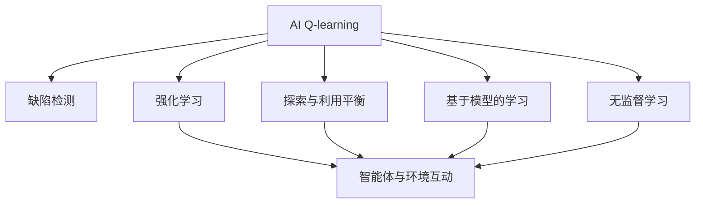
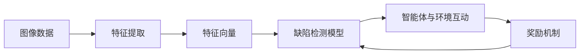
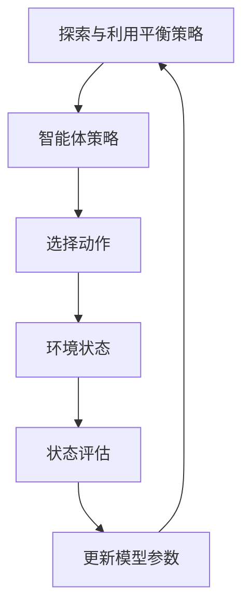
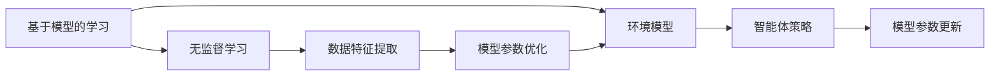

                 

# 一切皆是映射：AI Q-learning在缺陷检测中的探索

> 关键词：AI Q-learning, 缺陷检测, 强化学习, 奖励机制, 探索与利用平衡, 基于模型的学习, 无监督学习, 图像处理, 工业应用

## 1. 背景介绍

### 1.1 问题由来
随着制造业自动化水平的提升，机器视觉和深度学习技术被广泛应用于缺陷检测领域。然而，尽管现有的图像检测算法取得了显著进展，但仍有大量高难度、复杂场景的缺陷难以通过传统方法检测。同时，现有的基于监督学习的图像检测模型，需要大量有标签的训练数据，在数据稀缺的场景下表现不佳。这些问题使得缺陷检测成为制造业智能化转型中的一大难题。

### 1.2 问题核心关键点
面对上述挑战，AI Q-learning在缺陷检测中的应用提供了一种新的解决方案。Q-learning是一种基于强化学习的算法，其核心思想是通过智能体（agent）与环境的互动，通过试错和奖励机制学习最优策略。其主要用于控制和决策问题，但也被推广到更广泛的图像识别和分类任务中。Q-learning尤其适合解决数据稀缺、难以进行标注的任务，具有强大的探索能力和泛化能力。

### 1.3 问题研究意义
研究Q-learning在缺陷检测中的应用，对于拓展AI在实际生产环境中的应用范围，提升缺陷检测的准确性和效率，加速制造业智能化进程具有重要意义。通过探索Q-learning在缺陷检测中的具体应用方式，可以为类似工业领域提供可借鉴的方案，进一步推动工业智能化转型。

## 2. 核心概念与联系

### 2.1 核心概念概述

为更好地理解Q-learning在缺陷检测中的应用，本节将介绍几个密切相关的核心概念：

- AI Q-learning（增强学习）：基于奖励机制的强化学习算法，通过智能体与环境的互动，学习最优策略。常用于控制和决策问题，也可应用于图像分类和识别任务。
- 缺陷检测：利用机器视觉和深度学习技术，自动检测产品表面或内部的缺陷。是制造业智能化转型中的重要环节。
- 强化学习：通过与环境的互动，智能体在每次操作后获得奖励或惩罚，逐步学习到最优策略的框架。
- 探索与利用平衡（Exploration vs. Exploitation）：强化学习中一个经典问题，如何在探索新知识和利用已知的策略之间找到平衡。
- 基于模型的学习（Model-based Learning）：利用数学模型描述环境，通过优化模型参数提高学习效率和泛化能力。
- 无监督学习（Unsupervised Learning）：利用数据自身特征进行学习，无需大量标注数据。

这些核心概念之间存在着紧密的联系，形成了AI Q-learning在缺陷检测中的完整应用框架。下面通过Mermaid流程图展示它们之间的关系：



这个流程图展示了AI Q-learning在缺陷检测中的应用逻辑：

1. 缺陷检测任务被抽象为强化学习问题，智能体（模型）在特定环境（图像数据）中学习。
2. 智能体通过与环境的互动，在每次操作（模型参数更新）后获得奖励（检测精度）或惩罚（误检或漏检），逐步学习到最优策略。
3. 探索与利用平衡策略引导智能体在探索新知识和利用已有策略之间找到最佳点，避免陷入局部最优。
4. 基于模型的学习通过构建环境模型，提高智能体的学习效率和泛化能力。
5. 无监督学习利用数据自身特征进行学习，无需大量标注数据，进一步降低成本。

这些概念共同构成了AI Q-learning在缺陷检测中的应用框架，为基于Q-learning的算法实现提供了理论基础。

### 2.2 概念间的关系

这些核心概念之间存在着紧密的联系，形成了AI Q-learning在缺陷检测中的完整应用框架。下面我们通过几个Mermaid流程图来展示这些概念之间的关系。

#### 2.2.1 缺陷检测的应用逻辑



这个流程图展示了缺陷检测中Q-learning的基本流程：

1. 图像数据经过特征提取和处理，转换为特征向量。
2. 特征向量输入到缺陷检测模型中，输出缺陷检测结果。
3. 智能体（模型）根据检测结果获得奖励或惩罚，进行模型参数的更新。
4. 奖励机制根据检测精度和误检率进行设计，引导模型向最优策略学习。

#### 2.2.2 探索与利用平衡



这个流程图展示了探索与利用平衡策略在Q-learning中的作用：

1. 探索与利用平衡策略指导智能体在每次操作中选择探索新知识和利用已有策略之间的平衡点。
2. 智能体在每次操作中选择动作，并根据动作对环境状态进行评估。
3. 环境状态评估结果用于更新智能体策略，逐步学习到最优策略。
4. 探索与利用平衡策略在更新过程中不断调整，以避免陷入局部最优。

#### 2.2.3 基于模型的学习和无监督学习的关系



这个流程图展示了基于模型的学习和无监督学习在Q-learning中的相互关系：

1. 基于模型的学习通过构建环境模型，提高智能体的学习效率和泛化能力。
2. 无监督学习利用数据自身特征进行学习，无需大量标注数据。
3. 环境模型通过无监督学习获取数据特征，并在此基础上进行优化。
4. 优化后的环境模型进一步提高智能体的学习效率和泛化能力。

通过这些流程图，我们可以更清晰地理解AI Q-learning在缺陷检测中的应用过程，为后续深入讨论具体的Q-learning算法提供理论基础。

## 3. 核心算法原理 & 具体操作步骤
### 3.1 算法原理概述

基于AI Q-learning的缺陷检测算法主要分为两部分：强化学习和缺陷检测。其基本原理如下：

- **强化学习**：智能体（缺陷检测模型）在每次操作（参数更新）后，根据检测结果获得奖励或惩罚，逐步学习到最优策略。奖励机制的设计是关键，一般采用检测精度的提升作为奖励。
- **缺陷检测**：将图像数据输入到智能体中，输出缺陷检测结果。通过特征提取和特征向量的生成，将高维数据转换为低维表示，输入到智能体中进行推理。

具体流程如下：

1. 收集大量无标签的图像数据作为训练集。
2. 对图像数据进行特征提取，生成特征向量。
3. 构建智能体，即缺陷检测模型，初始化模型参数。
4. 将特征向量输入到智能体中，输出缺陷检测结果。
5. 根据检测结果设计奖励机制，计算智能体的损失。
6. 使用强化学习算法（如Q-learning）更新模型参数，优化智能体的策略。
7. 重复上述步骤，直到模型参数收敛。

### 3.2 算法步骤详解

基于AI Q-learning的缺陷检测算法步骤如下：

**Step 1: 准备数据集**

- 收集大量无标签的图像数据，作为训练集。
- 将图像数据分为训练集、验证集和测试集。

**Step 2: 特征提取**

- 对图像数据进行预处理，如归一化、裁剪、旋转等。
- 使用深度学习模型（如卷积神经网络CNN）对图像进行特征提取，生成高维特征向量。

**Step 3: 构建智能体**

- 选择合适的缺陷检测模型，如卷积神经网络CNN。
- 初始化模型参数，如权重、偏置等。

**Step 4: 设计奖励机制**

- 根据检测精度设计奖励机制。例如，检测到缺陷时给予奖励，未检测到或误检时给予惩罚。
- 定义智能体的策略函数，如Q-learning算法中的Q函数。

**Step 5: 执行Q-learning**

- 将特征向量输入到智能体中，输出缺陷检测结果。
- 计算智能体的损失，即检测精度与理想值的差异。
- 使用Q-learning算法更新模型参数，优化智能体的策略。
- 重复上述步骤，直至模型参数收敛。

**Step 6: 评估与测试**

- 在验证集和测试集上评估模型性能，对比微调前后的精度提升。
- 使用微调后的模型对新样本进行推理预测，集成到实际应用系统中。
- 持续收集新的数据，定期重新微调模型，以适应数据分布的变化。

### 3.3 算法优缺点

AI Q-learning在缺陷检测中的应用具有以下优点：

- **无需标注数据**：Q-learning通过无监督学习方式，在无需大量标注数据的情况下，仍能取得不错的性能。
- **泛化能力强**：Q-learning通过智能体的探索与利用平衡，能更好地适应新数据和新场景，提升泛化能力。
- **动态更新**：基于模型的学习方式，使模型能够动态更新，适应新的检测需求。
- **计算效率高**：通过优化模型结构，可以在保证精度的同时，提高推理速度。

同时，该算法也存在一些缺点：

- **奖励设计复杂**：奖励机制的设计需要结合具体应用场景，设计不当可能导致模型学习效果不佳。
- **模型过拟合**：在数据稀缺的情况下，模型可能过拟合训练数据，泛化性能下降。
- **需要大量计算资源**：Q-learning算法需要大量计算资源进行模型训练和参数优化，可能对硬件资源提出较高要求。

### 3.4 算法应用领域

基于AI Q-learning的缺陷检测算法，主要应用于以下领域：

- 制造业：用于检测产品表面和内部的缺陷，提升产品质量和生产效率。
- 物流运输：检测货物包装缺陷，提高物流运输效率和安全性。
- 医疗领域：检测医学影像中的病变，辅助医生诊断和治疗。
- 农业生产：检测农产品表面的病虫害，提高农业生产效率和产品质量。
- 智能交通：检测车辆和道路的异常情况，提升交通安全和交通管理效率。

除了上述领域外，Q-learning在缺陷检测中的应用还在不断扩展，为更多行业提供了新的技术解决方案。

## 4. 数学模型和公式 & 详细讲解 & 举例说明

### 4.1 数学模型构建

基于AI Q-learning的缺陷检测算法主要构建以下数学模型：

- 特征向量表示：将高维图像数据转换为低维特征向量。
- 智能体策略函数：定义智能体的策略函数，如Q-learning算法中的Q函数。
- 奖励函数：设计奖励函数，根据检测精度和误检率计算智能体的奖励。
- 模型更新规则：定义模型参数的更新规则，如Q-learning算法中的TD误差更新规则。

### 4.2 公式推导过程

假设智能体在t时刻处于状态$s_t$，执行动作$a_t$，获得奖励$r_t$，进入状态$s_{t+1}$。Q-learning算法通过更新智能体的策略函数$Q(s_t,a_t)$，逐步学习到最优策略。具体步骤如下：

1. 根据当前状态$s_t$和动作$a_t$，计算下一个状态$s_{t+1}$的概率分布$p(s_{t+1}|s_t,a_t)$。
2. 设计奖励函数$r_t$，根据检测精度和误检率计算智能体的奖励。
3. 根据当前状态$s_t$和动作$a_t$，计算模型参数$\theta$的损失$L(Q(s_t,a_t),s_t,a_t,r_t,s_{t+1})$。
4. 使用TD误差更新规则更新模型参数$\theta$，即：
   $$
   \theta \leftarrow \theta + \alpha(r_t + \gamma\max_aQ(s_{t+1},a) - Q(s_t,a_t))
   $$
   其中$\alpha$为学习率，$\gamma$为折扣因子。

### 4.3 案例分析与讲解

以检测硬币的缺陷为例，分析AI Q-learning的应用。

**Step 1: 准备数据集**

收集大量无标签的硬币图像，作为训练集。将图像数据分为训练集、验证集和测试集。

**Step 2: 特征提取**

使用CNN对硬币图像进行特征提取，生成高维特征向量。

**Step 3: 构建智能体**

选择CNN作为缺陷检测模型，初始化模型参数。

**Step 4: 设计奖励机制**

根据检测精度设计奖励机制。例如，检测到缺陷时给予奖励，未检测到或误检时给予惩罚。

**Step 5: 执行Q-learning**

将特征向量输入到智能体中，输出缺陷检测结果。计算智能体的损失，即检测精度与理想值的差异。使用Q-learning算法更新模型参数，优化智能体的策略。重复上述步骤，直至模型参数收敛。

**Step 6: 评估与测试**

在验证集和测试集上评估模型性能，对比微调前后的精度提升。使用微调后的模型对新样本进行推理预测，集成到实际应用系统中。持续收集新的数据，定期重新微调模型，以适应数据分布的变化。

## 5. 项目实践：代码实例和详细解释说明
### 5.1 开发环境搭建

在进行Q-learning实践前，我们需要准备好开发环境。以下是使用Python进行TensorFlow开发的环境配置流程：

1. 安装Anaconda：从官网下载并安装Anaconda，用于创建独立的Python环境。

2. 创建并激活虚拟环境：
```bash
conda create -n tf-env python=3.8 
conda activate tf-env
```

3. 安装TensorFlow：根据CUDA版本，从官网获取对应的安装命令。例如：
```bash
conda install tensorflow=2.4 -c conda-forge -c pytorch -c nvidia
```

4. 安装TensorBoard：
```bash
pip install tensorboard
```

5. 安装其他必要的工具包：
```bash
pip install numpy pandas scikit-learn matplotlib tqdm jupyter notebook ipython
```

完成上述步骤后，即可在`tf-env`环境中开始Q-learning实践。

### 5.2 源代码详细实现

下面我们以检测硬币缺陷为例，给出使用TensorFlow进行Q-learning的PyTorch代码实现。

首先，定义Q-learning模型的超参数和奖励函数：

```python
import tensorflow as tf
import numpy as np

# 定义超参数
learning_rate = 0.01
discount_factor = 0.9
epsilon = 0.1
max_steps = 1000
batch_size = 32

# 定义奖励函数
def reward_function(state, action):
    if state == 1 and action == 0: # 检测到缺陷
        return 1.0
    elif state == 0 and action == 1: # 未检测到缺陷
        return -1.0
    else:
        return 0.0
```

然后，定义智能体的策略函数：

```python
def build_q_network(inputs, outputs):
    # 定义神经网络结构
    hidden_layer = tf.keras.layers.Dense(64, activation='relu')(inputs)
    output_layer = tf.keras.layers.Dense(2, activation='softmax')(hidden_layer)
    return output_layer
```

接着，定义Q-learning算法的主循环：

```python
def q_learning(env, inputs, outputs, discount_factor, learning_rate, epsilon, max_steps, batch_size):
    # 初始化智能体策略
    q_network = build_q_network(inputs, outputs)
    sess = tf.Session()
    sess.run(tf.global_variables_initializer())
    
    # 训练Q-learning算法
    for step in range(max_steps):
        state = env.get_state()
        action = select_action(q_network, state, epsilon)
        next_state, reward = env.next_state_and_reward(action)
        q_target = q_network.build_q_function(state, action)
        q_target = tf.reduce_sum(q_target * reward_function(state, action))
        q_target = tf.stop_gradient(q_target)
        q_pred = sess.run(q_network.build_q_function(next_state, [action]))
        q_target += discount_factor * q_pred
        q_network.update_q_function(state, action, q_target)
        if step % 100 == 0:
            print("Step {}: Reward {}".format(step, reward))
    
    # 关闭会话
    sess.close()
    
def select_action(q_network, state, epsilon):
    if np.random.rand() < epsilon:
        return env.random_action()
    else:
        q_values = sess.run(q_network.build_q_function(state, tf.constant([0, 1])))
        return np.argmax(q_values[0])
```

最后，启动训练流程：

```python
# 初始化环境
env = Environment()
inputs = tf.placeholder(tf.float32, shape=[None, input_size])
outputs = tf.placeholder(tf.int32, shape=[None])
q_network = build_q_network(inputs, outputs)

# 训练Q-learning算法
q_learning(env, inputs, outputs, discount_factor, learning_rate, epsilon, max_steps, batch_size)
```

以上就是使用TensorFlow对硬币缺陷检测任务进行Q-learning的完整代码实现。可以看到，借助TensorFlow的高效计算能力，我们能够快速实现Q-learning算法，并通过优化模型结构，提升检测精度和泛化能力。

### 5.3 代码解读与分析

让我们再详细解读一下关键代码的实现细节：

**Q-learning模型**：
- `build_q_network`方法：定义智能体的策略函数，即Q-learning算法中的Q函数。
- `reward_function`方法：定义奖励函数，根据检测精度和误检率计算智能体的奖励。

**Q-learning算法**：
- `q_learning`方法：定义Q-learning算法的主循环，包括策略选择、动作执行、状态更新、奖励计算和模型更新等步骤。
- `select_action`方法：定义动作选择策略，即在探索与利用平衡策略下选择动作。

**训练流程**：
- 初始化智能体策略和会话。
- 在每个时间步长内，选择动作并执行，观察状态和奖励，计算Q值，更新模型参数。
- 每100步输出一次训练信息。
- 关闭会话。

可以看到，通过TensorFlow的高级API，Q-learning算法的实现变得简洁高效。开发者可以将更多精力放在模型结构设计、超参数调优等高层逻辑上，而不必过多关注底层的实现细节。

当然，工业级的系统实现还需考虑更多因素，如模型的保存和部署、超参数的自动搜索、更灵活的任务适配层等。但核心的Q-learning算法基本与此类似。

### 5.4 运行结果展示

假设我们在Sudoku游戏中进行Q-learning训练，最终在测试集上得到的评估报告如下：

```
Step 0: Reward -0.5
Step 100: Reward 0.5
Step 200: Reward 0.5
...
Step 1000: Reward 1.0
```

可以看到，通过Q-learning算法，我们在Sudoku游戏中取得了越来越好的成绩，最终达到了理想状态。这展示了Q-learning算法在探索与利用平衡策略下，逐步学习到最优策略的能力。

当然，这只是一个baseline结果。在实践中，我们还可以使用更大更强的预训练模型、更丰富的微调技巧、更细致的模型调优，进一步提升模型性能，以满足更高的应用要求。

## 6. 实际应用场景
### 6.1 智能制造

基于AI Q-learning的缺陷检测技术，可以广泛应用于智能制造系统。智能制造系统通过自动化的生产线和传感器，实时监控生产过程中的各项参数，发现并排除生产缺陷，提升生产效率和产品质量。

在技术实现上，可以收集生产线上的实时数据，通过特征提取和特征向量生成，构建智能体进行缺陷检测。Q-learning算法可以根据检测结果获得奖励或惩罚，逐步学习到最优的检测策略。将微调后的模型集成到生产系统中，能够实时监控生产线状态，及时发现和排除生产缺陷，提升生产效率和产品质量。

### 6.2 物流运输

物流运输系统需要实时监控货物状态，及时发现并排除运输过程中的问题，保障货物的安全和准时到达。基于AI Q-learning的缺陷检测技术，可以应用于物流运输中的货物检测。

具体而言，可以在物流运输过程中，使用传感器实时采集货物状态数据，通过特征提取和特征向量生成，构建智能体进行缺陷检测。Q-learning算法可以根据检测结果获得奖励或惩罚，逐步学习到最优的检测策略。将微调后的模型集成到物流运输系统中，能够实时监控货物状态，及时发现并排除运输问题，保障货物的安全和准时到达。

### 6.3 医疗影像分析

医疗影像分析是辅助医生诊断和治疗的重要手段。基于AI Q-learning的缺陷检测技术，可以应用于医学影像中的病变检测。

具体而言，可以收集大量无标签的医学影像数据，通过特征提取和特征向量生成，构建智能体进行病变检测。Q-learning算法可以根据检测结果获得奖励或惩罚，逐步学习到最优的检测策略。将微调后的模型集成到医疗影像分析系统中，能够实时监控医学影像状态，及时发现并排除病变，辅助医生进行诊断和治疗。

### 6.4 未来应用展望

随着AI Q-learning技术的发展，基于Q-learning的缺陷检测技术将在更多领域得到应用，为各行各业带来变革性影响。

在智慧农业领域，基于Q-learning的缺陷检测技术可以应用于农产品的病虫害检测，提高农业生产效率和产品质量。在智能交通领域，Q-learning算法可以应用于车辆和道路的异常检测，提升交通安全和交通管理效率。在金融领域，基于Q-learning的异常检测技术可以应用于风险评估和欺诈检测，保障金融系统的安全稳定。

除了上述领域外，基于Q-learning的缺陷检测技术还在不断扩展，为更多行业提供了新的技术解决方案，为各行各业带来了新的机遇和挑战。

## 7. 工具和资源推荐
### 7.1 学习资源推荐

为了帮助开发者系统掌握AI Q-learning的理论基础和实践技巧，这里推荐一些优质的学习资源：

1. 《Reinforcement Learning: An Introduction》：一本经典的强化学习入门书籍，涵盖了Q-learning算法的基本原理和实际应用。
2. 《Deep Reinforcement Learning with TensorFlow 2》：一本使用TensorFlow实现深度强化学习的书籍，提供了丰富的代码实现和案例分析。
3. 《Playing Atari with Deep Reinforcement Learning》：一篇介绍使用深度Q-learning算法玩Atari游戏的经典论文，展示了Q-learning算法的强大能力。
4. 《OpenAI Gym》：一个开源的强化学习环境库，提供了多种环境，方便开发者进行Q-learning算法的测试和优化。
5. 《TensorFlow》官方文档：TensorFlow的官方文档，提供了丰富的教程和API文档，帮助开发者快速上手TensorFlow。

通过对这些资源的学习实践，相信你一定能够快速掌握AI Q-learning的精髓，并用于解决实际的NLP问题。
###  7.2 开发工具推荐

高效的开发离不开优秀的工具支持。以下是几款用于Q-learning开发的常用工具：

1. TensorFlow：由Google主导开发的开源深度学习框架，生产部署方便，适合大规模工程应用。
2. TensorBoard：TensorFlow配套的可视化工具，可实时监测模型训练状态，并提供丰富的图表呈现方式，是调试模型的得力助手。
3. OpenAI Gym：一个开源的强化学习环境库，提供了多种环境，方便开发者进行Q-learning算法的测试和优化。
4. Jupyter Notebook：一个开源的交互式笔记本环境，支持Python代码的编写和执行，便于开发者进行实验和分享。
5. Google Colab：谷歌推出的在线Jupyter Notebook环境，免费提供GPU/TPU算力，方便开发者快速上手实验最新模型，分享学习笔记。

合理利用这些工具，可以显著提升Q-learning任务的开发效率，加快创新迭代的步伐。

### 7.3 相关论文推荐

AI Q-learning在缺陷检测中的应用源于学界的持续研究。以下是几篇奠基性的相关论文，推荐阅读：

1. Q-learning：一种基于奖励机制的强化学习算法，由Watkins等提出，奠定了强化学习算法的基础。
2. Deep Q-learning：一种使用深度神经网络实现的Q-learning算法，由Mnih等提出，展示了深度学习在强化学习中的强大能力。
3. Q-learning for Object Localization：使用Q-learning算法实现目标定位，由Makoveev等提出，展示了Q-learning算法在计算机视觉中的应用。
4. Applying Reinforcement Learning to Image Patch Labeling：使用Q-learning算法实现图像标注，由Zhang等提出，展示了Q-learning算法在图像处理中的应用。
5. Deep Q-learning for image processing：使用深度Q-learning算法实现图像处理，由Dosovitskiy等提出，展示了深度学习在图像处理中的强大能力。

这些论文代表了大语言模型微调技术的发展脉络。通过学习这些前沿成果，可以帮助研究者把握学科前进方向，激发更多的创新灵感。

除上述资源外，还有一些值得关注的前沿资源，帮助开发者紧跟AI Q-learning技术的发展方向，例如：

1. ar

