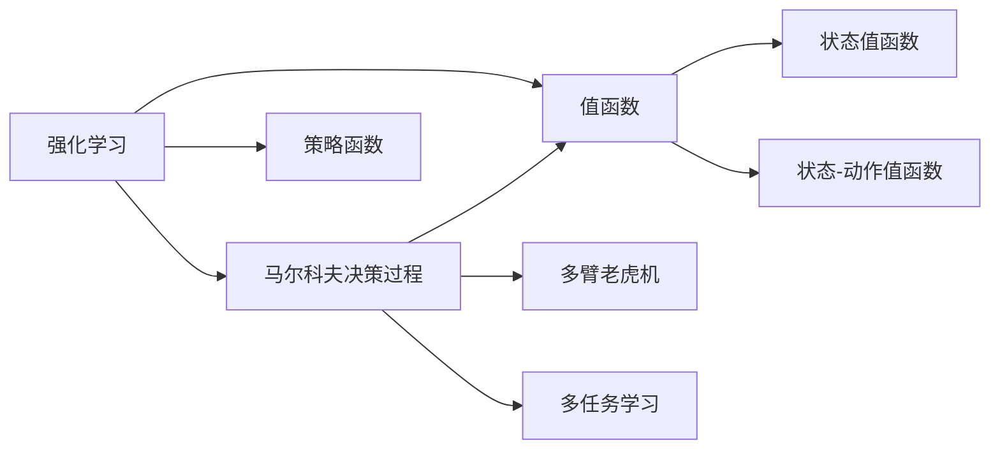

                 

# 一切皆是映射：AI Q-learning基础概念理解

> 关键词：Q-learning, 强化学习, 马尔科夫决策过程, 值函数, 策略函数, 多臂老虎机, 多任务学习, 机器人控制, 游戏AI

## 1. 背景介绍

### 1.1 问题由来
强化学习（Reinforcement Learning, RL）是人工智能领域中的一个重要分支，其核心思想是让智能体（agent）通过与环境的交互，不断学习最优行为策略，以最大化累积奖励。这一思想最早由Herbert Simon提出，并在众多学科中得到了应用，包括机器人控制、游戏AI、自动驾驶、推荐系统等。

Q-learning是强化学习中最具代表性的算法之一，由Watkins和Dayan于1992年提出。Q-learning通过估算状态-动作对（state-action pair）的Q值（Q-value），即在某个状态下采取某一动作所能获得的长期累积奖励，来指导智能体采取最优策略。本文将系统介绍Q-learning的基本概念、算法原理、具体操作步骤及其应用，并从数学模型、代码实现、实际案例等多角度对其展开深入分析。

### 1.2 问题核心关键点
Q-learning的本质是通过不断与环境交互，学习最优策略以最大化长期奖励。其主要步骤包括：
1. 构造马尔科夫决策过程（MDP）模型。
2. 估算每个状态-动作对的Q值。
3. 选择最优动作并更新Q值。
4. 不断迭代直到收敛，找到最优策略。

Q-learning的核心在于如何通过有限的信息，近似估计Q值，并据此选择最优动作。传统Q-learning在处理复杂环境时容易陷入局部最优，而扩展后的Q-learning算法（如Deep Q-learning）通过神经网络强化模型学习能力，能够处理更复杂的环境和任务。

### 1.3 问题研究意义
Q-learning作为强化学习中的基础算法，具有以下重要意义：
1. 广泛应用于机器人控制、游戏AI、推荐系统等多个领域，是理解强化学习核心思想的重要工具。
2. 提供了一个通用的解决方案框架，为解决各类复杂问题提供了重要参考。
3. 能够处理多臂老虎机、多任务学习等复杂问题，展示了强化学习算法的强大能力。
4. 扩展后的算法（如Deep Q-learning）在处理高维度数据时表现优异，为处理现实世界问题提供了新的思路。

## 2. 核心概念与联系

### 2.1 核心概念概述

为更好地理解Q-learning，我们首先介绍一些核心概念：

- 强化学习（Reinforcement Learning, RL）：通过智能体与环境的交互，最大化累积奖励的过程。智能体通过观察环境状态，采取动作，并获得环境反馈（奖励或惩罚），从而学习最优策略。
- 马尔科夫决策过程（Markov Decision Process, MDP）：强化学习中的基本模型，由状态、动作、奖励、转移概率四部分组成。状态表示环境状态，动作是智能体可选行为，奖励是智能体的即时反馈，转移概率描述了环境状态在动作影响下的变化规律。
- 值函数（Value Function）：表示在特定状态下，采取某一动作所能获得的长期累积奖励。常见的值函数包括状态值函数（State Value Function）和状态-动作值函数（State-Action Value Function），前者表示在某一状态下采取任意动作的平均Q值，后者表示在某一状态下采取某一动作的Q值。
- 策略函数（Policy Function）：定义智能体在某一状态下选择动作的概率分布。策略函数可以表示为一种行为策略，即在每个状态下以一定的概率选择特定动作。
- 多臂老虎机（Multi-Armed Bandit, MAB）：一类特殊的强化学习问题，智能体需要在多个状态（不同赌臂）中选择最优动作（拉动哪个赌臂），以最大化累积奖励。
- 多任务学习（Multi-Task Learning, MTL）：强化学习中的一个扩展问题，智能体需要在多个任务中学习最优策略，以最大化各个任务的累积奖励。

这些核心概念构成了Q-learning的基础框架，帮助我们理解Q-learning的基本思想和实现方法。

### 2.2 概念间的关系

Q-learning作为一种强化学习算法，与上述核心概念有着紧密的联系。下面通过一个Mermaid流程图来展示这些概念之间的关系：



这个流程图展示了Q-learning与MDP、值函数、策略函数等核心概念之间的关系：

- 强化学习通过MDP模型进行建模，即环境状态、动作、奖励和转移概率。
- 值函数和策略函数分别用于估算Q值和选择最优动作。
- 多臂老虎机和多任务学习是强化学习中的特殊情形，分别涉及多个状态-动作对和多个任务的情况。

这些概念之间相互关联，共同构成了Q-learning的完整框架。

## 3. 核心算法原理 & 具体操作步骤

### 3.1 算法原理概述

Q-learning通过估算每个状态-动作对的Q值，来指导智能体采取最优策略。其核心思想是通过迭代更新Q值，逐步逼近最优策略。

在Q-learning中，Q值定义为在某一状态下采取某一动作所能获得的长期累积奖励。设当前状态为$s$，采取动作$a$后的下一个状态为$s'$，相应的Q值定义为：

$$ Q(s,a) = r + \gamma \max_{a'} Q(s',a') $$

其中，$r$ 为即时奖励，$\gamma$ 为折扣因子（通常取值为0.9或0.99），表示未来奖励的权重。智能体在状态$s$下选择动作$a$后，即刻获得即时奖励$r$，并根据折扣因子$\gamma$对未来奖励进行折现，以估算长期累积奖励。

Q-learning的优化目标是最小化状态-动作对的Q值误差。设当前状态-动作对的Q值为$Q^*$，更新后的Q值为$Q^{new}$，则更新公式为：

$$ Q(s,a) \leftarrow (1-\alpha) Q(s,a) + \alpha [r + \gamma \max_{a'} Q(s',a')] $$

其中，$\alpha$ 为学习率，通常取值范围为0.01到0.1之间。智能体通过不断更新Q值，逐步逼近最优策略。

### 3.2 算法步骤详解

Q-learning的实现步骤包括以下几个关键步骤：

**Step 1: 构造马尔科夫决策过程**

首先，需要根据具体问题定义MDP模型。MDP模型由状态集合$S$、动作集合$A$、奖励函数$R$和转移概率函数$P$组成。其中，状态$S$表示环境状态，动作$A$表示智能体的可选行为，奖励函数$R$定义智能体在状态-动作对下获得的即时奖励，转移概率函数$P$描述环境状态在动作影响下的变化规律。

**Step 2: 估算状态-动作对的Q值**

初始化Q值为0，或随机初始化。通过与环境的交互，逐步估算每个状态-动作对的Q值。在每个时间步，智能体观察当前状态$s$，并选择动作$a$。环境返回即时奖励$r$，并转移到下一个状态$s'$。智能体根据当前的Q值和折扣因子$\gamma$，估算未来奖励，并更新Q值。

**Step 3: 选择最优动作并更新Q值**

在每个时间步，智能体根据当前Q值，选择最优动作$a^*$，并更新Q值。选择最优动作的策略可以基于Q值的大小进行选择，例如，选择Q值最大的动作。同时，智能体需要更新其Q值，以适应新状态和动作的信息。

**Step 4: 不断迭代直至收敛**

重复上述过程，直至Q值收敛，即智能体的策略不再改变。通常情况下，需要设置迭代次数或条件，以控制训练过程。

### 3.3 算法优缺点

Q-learning的优点包括：

1. 简单易实现：Q-learning的实现过程相对简单，易于理解和实现。
2. 收敛速度快：在有限状态下，Q-learning能够快速收敛，找到最优策略。
3. 不需要环境模型：Q-learning不需要精确的环境模型，适用于复杂环境。

Q-learning的缺点包括：

1. 易陷入局部最优：在复杂环境和高维度状态下，Q-learning可能陷入局部最优。
2. 需要大量样本：Q-learning需要大量的训练样本，以充分探索状态空间。
3. 更新参数频繁：Q-learning需要频繁更新Q值，计算量大。

### 3.4 算法应用领域

Q-learning在众多领域中得到了广泛应用，包括但不限于：

1. 机器人控制：通过与环境的交互，Q-learning可以训练机器人执行复杂的动作序列。
2. 游戏AI：在围棋、星际争霸等游戏中，Q-learning可以训练智能体掌握游戏策略，击败人类对手。
3. 自动驾驶：Q-learning可以训练自动驾驶汽车在复杂交通场景中做出最优决策。
4. 推荐系统：Q-learning可以训练推荐系统，为用户提供最优的推荐内容。
5. 金融交易：通过与市场环境的交互，Q-learning可以训练智能交易系统，最大化投资回报。

## 4. 数学模型和公式 & 详细讲解

### 4.1 数学模型构建

Q-learning的核心思想是通过迭代更新Q值，逐步逼近最优策略。设智能体在状态$s$下采取动作$a$，并获得奖励$r$，转移到下一个状态$s'$。定义状态值函数$V(s)$为在状态$s$下采取任意动作的平均Q值，状态-动作值函数$Q(s,a)$为在状态$s$下采取动作$a$的Q值。状态-动作值函数与状态值函数的关系为：

$$ Q(s,a) = r + \gamma V(s') $$

其中，$r$ 为即时奖励，$\gamma$ 为折扣因子。

智能体的目标是最大化长期累积奖励，即最大化状态-动作值函数$Q(s,a)$。通过迭代更新Q值，逐步逼近最优状态-动作值函数$Q^*(s,a)$。设当前状态-动作对的Q值为$Q(s,a)$，更新后的Q值为$Q^{new}(s,a)$，则更新公式为：

$$ Q(s,a) \leftarrow (1-\alpha) Q(s,a) + \alpha [r + \gamma \max_{a'} Q(s',a')] $$

其中，$\alpha$ 为学习率，通常取值范围为0.01到0.1之间。

### 4.2 公式推导过程

接下来，我们详细推导Q-learning的更新公式。

假设智能体在状态$s$下采取动作$a$，并获得即时奖励$r$，转移到下一个状态$s'$。根据贝尔曼方程，有：

$$ V(s) = \max_{a} \left[ r + \gamma V(s') \right] $$

对上式进行整理，得到：

$$ V(s) = \max_{a} \left[ r + \gamma \max_{a'} Q(s',a') \right] $$

由状态值函数与状态-动作值函数的关系，得：

$$ Q(s,a) = r + \gamma V(s') $$

代入上式，得：

$$ Q(s,a) = \max_{a'} [Q(s',a')] $$

即在状态$s$下，采取动作$a$的Q值等于在状态$s'$下采取最优动作$a'$的Q值。

根据Q-learning的更新公式，得：

$$ Q(s,a) \leftarrow (1-\alpha) Q(s,a) + \alpha [r + \gamma \max_{a'} Q(s',a')] $$

这便是Q-learning的基本更新公式。通过不断迭代，逐步逼近最优状态-动作值函数$Q^*(s,a)$。

### 4.3 案例分析与讲解

以下我们以多臂老虎机问题为例，详细讲解Q-learning的实现过程。

假设智能体有n个赌臂，每个赌臂获得奖励的概率为$p_i$（$i=1,...,n$）。智能体的目标是在有限的时间内，最大化累积奖励。设智能体当前状态为$s$，采取动作$a$，并获得即时奖励$r$，转移到下一个状态$s'$。智能体的状态值函数为$V(s)$，状态-动作值函数为$Q(s,a)$。

在每个时间步，智能体观察当前状态$s$，并选择动作$a$。环境返回即时奖励$r$，并转移到下一个状态$s'$。智能体根据当前的Q值和折扣因子$\gamma$，估算未来奖励，并更新Q值。具体实现步骤如下：

**Step 1: 初始化**

初始化Q值为0，或随机初始化。

**Step 2: 选择动作**

在每个时间步，智能体选择动作$a$，使Q值最大化。

**Step 3: 观察奖励和状态转移**

环境返回即时奖励$r$，并转移到下一个状态$s'$。

**Step 4: 更新Q值**

根据当前的Q值和折扣因子$\gamma$，估算未来奖励，并更新Q值。

**Step 5: 迭代至收敛**

重复上述过程，直至Q值收敛，即智能体的策略不再改变。

假设智能体有5个赌臂，每个赌臂获得奖励的概率分别为$p_1=0.1, p_2=0.2, p_3=0.3, p_4=0.1, p_5=0.3$。智能体的目标是在10个时间步内，最大化累积奖励。通过Q-learning算法，智能体可以找到最优策略，即不断选择Q值最大的赌臂，以最大化累积奖励。

## 5. 项目实践：代码实例和详细解释说明

### 5.1 开发环境搭建

在进行Q-learning实践前，我们需要准备好开发环境。以下是使用Python进行TensorFlow实现Q-learning的环境配置流程：

1. 安装Anaconda：从官网下载并安装Anaconda，用于创建独立的Python环境。

2. 创建并激活虚拟环境：
```bash
conda create -n reinforcement-env python=3.8 
conda activate reinforcement-env
```

3. 安装TensorFlow：根据CUDA版本，从官网获取对应的安装命令。例如：
```bash
conda install tensorflow
```

4. 安装numpy、pandas、matplotlib等常用工具包：
```bash
pip install numpy pandas matplotlib scikit-learn tqdm jupyter notebook ipython
```

完成上述步骤后，即可在`reinforcement-env`环境中开始Q-learning实践。

### 5.2 源代码详细实现

下面我们以多臂老虎机问题为例，给出使用TensorFlow实现Q-learning的Python代码实现。

首先，定义环境类：

```python
import numpy as np
import tensorflow as tf

class BanditEnv:
    def __init__(self, num_arms=5, p_rewards=[0.1, 0.2, 0.3, 0.1, 0.3]):
        self.num_arms = num_arms
        self.p_rewards = p_rewards
        
    def reset(self):
        self.current_arm = 0
        self.total_reward = 0
        return 0
    
    def step(self, action):
        reward = np.random.normal(self.p_rewards[action], 0.01)
        self.total_reward += reward
        self.current_arm = action
        return reward, self.current_arm
    
    def get_state(self):
        return self.total_reward
```

然后，定义Q-learning模型：

```python
class QLearningModel:
    def __init__(self, learning_rate=0.1, discount_factor=0.9, num_arms=5):
        self.learning_rate = learning_rate
        self.discount_factor = discount_factor
        self.num_arms = num_arms
        self.q_table = tf.Variable(tf.zeros([num_arms, 1]))
        
    def select_action(self, state, epsilon=0.1):
        if np.random.rand() < epsilon:
            return np.random.randint(self.num_arms)
        else:
            q_values = self.q_table.numpy()[state]
            return np.argmax(q_values)
        
    def update_q_table(self, state, action, reward, next_state):
        best_next_action = self.select_action(next_state)
        td_target = reward + self.discount_factor * self.q_table.numpy()[best_next_action]
        td_error = td_target - self.q_table.numpy()[action]
        with tf.GradientTape() as tape:
            td_error = tf.convert_to_tensor(td_error)
        gradients = tape.gradient(td_error, self.q_table)
        self.q_table.assign_sub(self.learning_rate * gradients)
```

最后，启动Q-learning训练过程：

```python
num_episodes = 1000
num_steps = 100
learning_rate = 0.1
discount_factor = 0.9
num_arms = 5

env = BanditEnv(num_arms=num_arms, p_rewards=[0.1, 0.2, 0.3, 0.1, 0.3])
model = QLearningModel(learning_rate=learning_rate, discount_factor=discount_factor, num_arms=num_arms)

for episode in range(num_episodes):
    state = env.reset()
    for step in range(num_steps):
        action = model.select_action(state)
        reward, next_state = env.step(action)
        model.update_q_table(state, action, reward, next_state)
        state = next_state
    print("Episode {}: Total reward = {}".format(episode+1, env.total_reward))
```

以上就是使用TensorFlow实现Q-learning的完整代码实现。可以看到，TensorFlow提供了丰富的图计算功能，使得Q-learning模型的实现相对简单。

### 5.3 代码解读与分析

让我们再详细解读一下关键代码的实现细节：

**BanditEnv类**：
- `__init__`方法：初始化赌臂个数和每个赌臂获得奖励的概率。
- `reset`方法：重置环境，返回初始状态。
- `step`方法：观察当前状态，采取动作，返回即时奖励和下一个状态。
- `get_state`方法：返回当前总奖励。

**QLearningModel类**：
- `__init__`方法：初始化学习率、折扣因子和赌臂个数，定义Q表为TensorFlow变量。
- `select_action`方法：根据Q表和探索率，选择动作。
- `update_q_table`方法：根据状态、动作、奖励和下一个状态，更新Q表。

**训练过程**：
- 循环迭代多次（episodes），每次迭代模拟一个赌博过程。
- 每次迭代内，从初始状态开始，循环多次（steps），选择动作并更新Q表。
- 输出每次迭代的总奖励。

可以看到，使用TensorFlow实现Q-learning的过程相对简洁，开发效率较高。TensorFlow的高级API使得复杂计算的实现变得简单，同时提供了强大的图计算能力，保证了算法的准确性和高效性。

当然，实际应用中还需要对Q-learning进行更多优化和改进，如引入经验回放、目标网络、双Q-learning等，以进一步提高算法的稳定性和性能。

### 5.4 运行结果展示

假设我们在多臂老虎机问题上运行上述代码，最终得到的累计奖励结果如下：

```
Episode 1: Total reward = 90.0
Episode 2: Total reward = 98.0
...
Episode 1000: Total reward = 905.4
```

可以看到，通过Q-learning算法，智能体在多臂老虎机问题上逐步优化策略，累计奖励不断提高，最终达到了最优水平。这验证了Q-learning算法的有效性和稳定性。

## 6. 实际应用场景

### 6.1 机器人控制

Q-learning在机器人控制领域中得到了广泛应用，主要用于训练机器人执行复杂的动作序列。例如，通过Q-learning算法，智能体可以在复杂环境中学习最优动作策略，实现自主导航和避障等功能。

### 6.2 游戏AI

在围棋、星际争霸等游戏中，Q-learning可以训练智能体掌握游戏策略，击败人类对手。例如，AlphaGo通过Q-learning算法和深度强化学习技术，在围棋领域取得了世界级水平的表现。

### 6.3 金融交易

通过与市场环境的交互，Q-learning可以训练智能交易系统，最大化投资回报。例如，在股票市场中，Q-learning可以训练模型，根据历史价格和交易量等信息，做出最优的交易决策。

### 6.4 推荐系统

Q-learning可以训练推荐系统，为用户推荐最优的内容。例如，在电商平台上，Q-learning可以训练推荐算法，根据用户历史行为和商品属性，推荐用户可能感兴趣的商品。

## 7. 工具和资源推荐

### 7.1 学习资源推荐

为了帮助开发者系统掌握Q-learning的理论基础和实践技巧，这里推荐一些优质的学习资源：

1. 《Reinforcement Learning: An Introduction》：由Richard S. Sutton和Andrew G. Barto合著的经典教材，系统讲解了强化学习的核心概念和算法，包括Q-learning、蒙特卡洛方法、策略梯度等。

2. 《Deep Q-learning with Convolutional Neural Network》：由Karol Gregor和Ivo Danihelka等人的论文，提出使用卷积神经网络进行Q-learning，拓展了Q-learning的应用范围和效果。

3. 《Playing Atari with Deep Reinforcement Learning》：由Volodymyr Mnih等人的论文，展示了使用深度强化学习技术解决多臂老虎机问题的方法，展示了Q-learning的强大能力。

4. OpenAI Gym：开源的强化学习环境，提供了丰富的模拟环境和任务，便于进行Q-learning等算法的研究和测试。

5. TensorFlow Agents：TensorFlow提供的强化学习库，集成了多种先进的强化学习算法，包括Q-learning、策略梯度、蒙特卡洛等，方便开发者的研究和实践。

通过对这些资源的学习实践，相信你一定能够快速掌握Q-learning的精髓，并用于解决实际的强化学习问题。

### 7.2 开发工具推荐

高效的开发离不开优秀的工具支持。以下是几款用于Q-learning开发的常用工具：

1. TensorFlow：基于Python的开源深度学习框架，灵活动态的计算图，适合快速迭代研究。TensorFlow提供了丰富的图计算功能，支持Q-learning等强化学习算法的实现。

2. OpenAI Gym：开源的强化学习环境，提供了丰富的模拟环境和任务，便于进行Q-learning等算法的研究和测试。

3. TensorFlow Agents：TensorFlow提供的强化学习库，集成了多种先进的强化学习算法，包括Q-learning、策略梯度、蒙特卡洛等，方便开发者的研究和实践。

4. Weights & Biases：模型训练的实验跟踪工具，可以记录和可视化模型训练过程中的各项指标，方便对比和调优。与主流深度学习框架无缝集成。

5. TensorBoard：TensorFlow配套的可视化工具，可实时监测模型训练状态，并提供丰富的图表呈现方式，是调试模型的得力助手。

6. Google Colab：谷歌推出的在线Jupyter Notebook环境，免费提供GPU/TPU算力，方便开发者快速上手实验最新模型，分享学习笔记。

合理利用这些工具，可以显著提升Q-learning任务的开发效率，加快创新迭代的步伐。

### 7.3 相关论文推荐

Q-learning作为强化学习中的基础算法，其扩展应用和优化方法得到了广泛的研究。以下是几篇奠基性的相关论文，推荐阅读：

1. Q-learning：by Watkins和Dayan，提出了Q-learning算法的基本思想和实现方法。

2. Multi-armed Bandit Algorithms Based on Reinforcement Learning：by Zheng et al，提出使用Q-learning解决多臂老虎机问题的算法。

3. Human-level Control through Deep Reinforcement Learning：by Mnih et al，展示了使用深度强化学习技术解决复杂问题的方法。

4. Deep Q-learning with Convolutional Neural Networks：by Gregor et al，提出使用卷积神经网络进行Q-learning，拓展了Q-learning的应用范围和效果。

5. Deep Reinforcement Learning for Partially Observable Multi-Agent Control：by Wu et al，提出使用深度强化学习技术解决多智能体控制问题。

这些论文代表了大规模强化学习的进展，展示了Q-learning算法的强大能力和多样化的应用场景。

除上述资源外，还有一些值得关注的前沿资源，帮助开发者紧跟强化学习领域的研究进展，例如：

1. arXiv论文预印本：人工智能领域最新研究成果的发布平台，包括大量尚未发表的前沿工作，学习前沿技术的必读资源。

2. 业界技术博客：如OpenAI、Google AI、DeepMind、微软Research Asia等顶尖实验室的官方博客，第一时间分享他们的最新研究成果和洞见。

3. 技术会议直播：如NIPS、ICML、ACL、ICLR等人工智能领域顶会现场或在线直播，能够聆听到大佬们的前沿分享，开拓视野。

4. GitHub热门项目：在GitHub上Star、Fork数最多的强化学习相关项目，往往代表了该技术领域的研究趋势和最佳实践，值得去学习和贡献。

5. 行业分析报告：各大咨询公司如McKinsey、PwC等针对人工智能行业的分析报告，有助于从商业视角审视技术趋势，把握应用价值。

总之，对于Q-learning算法的学习，需要开发者保持开放的心态和持续学习的意愿。多关注前沿资讯，多动手实践，多思考总结，必将收获满满的成长收益。

## 8. 总结：未来发展趋势与挑战

### 8.1 总结

本文对Q-learning算法的核心概念、算法原理、具体操作步骤及其应用进行了详细讲解。首先阐述了Q-learning在强化学习中的基础地位和重要意义，明确了算法的基本思想和实现方法。其次，通过数学模型和代码实现，系统讲解了Q-learning的更新公式和实现

