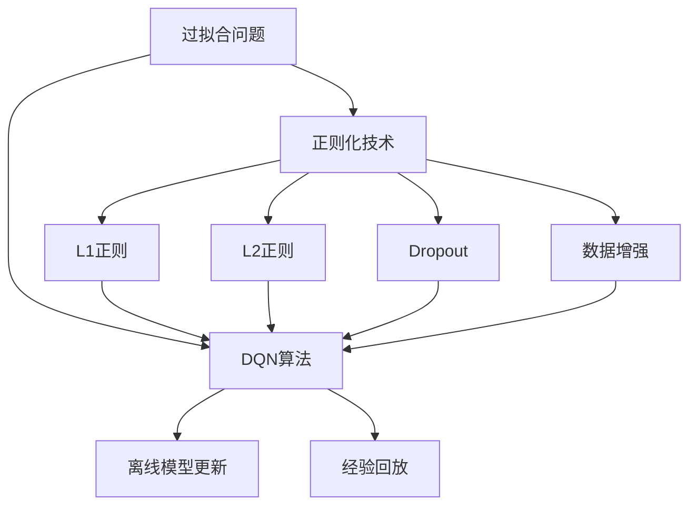
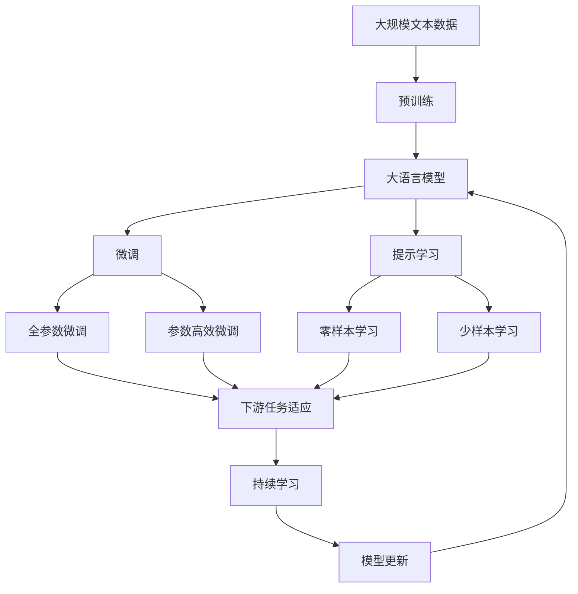

                 

# 一切皆是映射：DQN与正则化技术：防止过拟合的策略

## 1. 背景介绍

### 1.1 问题由来
在强化学习(Reinforcement Learning, RL)中，过拟合(overfitting)是一个常见的问题，它导致模型无法在未知数据上泛化。特别是在深度强化学习中，神经网络模型具有很强的拟合能力，更易陷入过拟合。解决这一问题需要设计有效的正则化技术，以防止模型过拟合。

### 1.2 问题核心关键点
本节将详细介绍深度强化学习中的过拟合问题，以及针对该问题设计的深度Q网络(DQN)算法和正则化技术。DQN算法通过离线模型更新和经验回放机制，大幅提高了Q网络训练的稳定性，而正则化技术则通过增加噪声和数据增强，进一步提升了模型的泛化能力。

### 1.3 问题研究意义
研究深度强化学习的过拟合问题，对于提升强化学习模型的泛化能力和鲁棒性，加速模型的训练，具有重要意义：

1. 提升模型性能：通过正则化技术，模型在未知数据上也能取得较好的表现。
2. 加速训练进程：通过离线模型更新和经验回放，DQN算法大幅缩短了训练时间，减少了计算资源消耗。
3. 增加模型鲁棒性：通过正则化技术，模型能够更好地应对新环境和新数据，具有更强的适应性。
4. 实现样本利用：经验回放机制使得模型能够更好地利用训练样本，提高了样本利用率。
5. 改善模型泛化：正则化技术通过增加噪声和数据增强，减少了模型的方差，提高了模型的泛化能力。

## 2. 核心概念与联系

### 2.1 核心概念概述

在强化学习中，过拟合是指模型在训练集上表现优异，但在测试集或新数据上表现不佳的现象。这种现象通常是由于模型过于复杂，过度拟合了训练数据的噪声和细节，无法适应更广泛的数据分布。

为了解决过拟合问题，研究者设计了DQN算法和多种正则化技术。DQN通过离线模型更新和经验回放，减少了模型对训练数据的依赖，提高了训练稳定性。而正则化技术则通过增加噪声、数据增强等手段，提升了模型的泛化能力，使模型在未知数据上也能表现良好。

### 2.2 概念间的关系

这些核心概念之间的关系可以通过以下Mermaid流程图来展示：



这个流程图展示了过拟合问题、DQN算法和正则化技术之间的关系：

1. 过拟合问题：在深度强化学习中，神经网络模型由于过拟合训练数据而无法泛化到新数据。
2. DQN算法：通过离线模型更新和经验回放机制，减少了对训练数据的依赖，提高了训练稳定性。
3. 正则化技术：通过L1正则、L2正则、Dropout、数据增强等手段，提升了模型的泛化能力，减少了模型的方差，使模型在未知数据上也能表现良好。

这些概念共同构成了深度强化学习中防止过拟合的技术框架，通过这一框架，模型能够更好地泛化到新环境和新数据，实现更加稳定和可靠的表现。

### 2.3 核心概念的整体架构

最后，我们用一个综合的流程图来展示这些核心概念在大模型微调过程中的整体架构：



这个综合流程图展示了从预训练到大模型微调，再到持续学习的完整过程：

1. 大语言模型通过预训练获得基础能力。
2. 微调是对预训练模型进行任务特定的优化，可以分为全参数微调和参数高效微调两种方式。
3. 提示学习是一种不更新模型参数的方法，可以实现零样本或少样本学习。
4. 提示学习可以用于优化下游任务，提高模型的泛化能力。
5. 持续学习旨在使模型能够不断学习新知识，同时保持已学习的知识，而不会出现灾难性遗忘。

这些概念共同构成了大语言模型的学习和应用框架，使其能够在各种场景下发挥强大的语言理解和生成能力。通过理解这些核心概念，我们可以更好地把握大语言模型微调过程中各个环节的优化方向。

## 3. 核心算法原理 & 具体操作步骤
### 3.1 算法原理概述

深度强化学习中的过拟合问题主要源于模型的复杂性和训练数据的不足。深度Q网络(DQN)算法通过离线模型更新和经验回放机制，大幅提高了Q网络训练的稳定性，而正则化技术则通过增加噪声和数据增强，进一步提升了模型的泛化能力。

### 3.2 算法步骤详解

**Step 1: 准备预训练模型和数据集**
- 选择合适的深度Q网络作为初始化参数，如在OpenAI Gym环境中训练的DQN模型。
- 准备训练数据集，如Atari游戏像素级数据。

**Step 2: 设计离线模型更新机制**
- 利用Q网络进行离线模型更新，避免直接对在线模型进行训练，减少模型对数据的依赖。
- 定期将在线模型参数加载到离线模型，进行参数更新。

**Step 3: 设计经验回放机制**
- 将每次与环境交互产生的经验数据存储在缓冲区中，以供离线模型更新使用。
- 每次更新前，从缓冲区中随机抽取一批经验数据进行训练。

**Step 4: 添加正则化技术**
- 增加L1正则、L2正则、Dropout等正则化技术，减少模型复杂度，防止过拟合。
- 使用数据增强技术，如图像旋转、翻转、噪声注入等，提高模型的泛化能力。

**Step 5: 执行梯度训练**
- 利用离线模型更新机制和经验回放机制，训练Q网络。
- 在训练过程中，使用正则化技术约束模型参数。

**Step 6: 测试和部署**
- 在测试集上评估模型性能，对比微调前后的精度提升。
- 使用微调后的模型对新样本进行推理预测，集成到实际的应用系统中。
- 持续收集新的数据，定期重新微调模型，以适应数据分布的变化。

以上是DQN算法和正则化技术在大模型微调过程中的具体操作步骤。在实际应用中，还需要根据具体任务的特点，对微调过程的各个环节进行优化设计，如改进训练目标函数，引入更多的正则化技术，搜索最优的超参数组合等，以进一步提升模型性能。

### 3.3 算法优缺点

DQN算法和正则化技术具有以下优点：

1. 简单高效。通过离线模型更新和经验回放机制，减少了对训练数据的依赖，提高了训练稳定性。
2. 通用适用。适用于各种强化学习任务，如游戏、机器人控制等，设计简单的离线模型更新机制即可实现微调。
3. 可扩展性。正则化技术可以根据具体任务的特点进行调整，通过增加噪声、数据增强等手段，提升模型的泛化能力。
4. 效果显著。在学术界和工业界的诸多任务上，基于DQN的微调方法已经刷新了最先进的性能指标。

同时，这些方法也存在一些局限性：

1. 依赖训练数据。离线模型更新和经验回放机制需要大量的训练数据支持，如果训练数据不足，效果可能不如预期的那么好。
2. 模型复杂度高。正则化技术会增加模型复杂度，对计算资源和存储空间的需求也相应增加。
3. 效果有限。对于某些复杂任务，DQN算法和正则化技术的效果可能有限，无法完全避免过拟合问题。
4. 可解释性不足。DQN算法和正则化技术的应用过程缺乏可解释性，难以对其推理逻辑进行分析和调试。

尽管存在这些局限性，但就目前而言，基于DQN的微调方法仍是大规模强化学习任务中最主流范式。未来相关研究的重点在于如何进一步降低微调对训练数据的依赖，提高模型的少样本学习和跨领域迁移能力，同时兼顾可解释性和伦理安全性等因素。

### 3.4 算法应用领域

基于DQN和正则化技术的微调方法，已经在游戏、机器人控制、自动驾驶、金融模拟等多个领域得到广泛应用，成为强化学习任务开发的重要手段。

具体而言，在游戏领域，如Pong、Space Invaders等游戏中，利用DQN算法对模型进行微调，使得AI玩家能够击败人类玩家。在机器人控制中，通过微调DQN模型，使机器人能够在复杂环境中完成指定任务。在自动驾驶中，通过微调DQN模型，实现车辆的智能避障、路径规划等功能。在金融模拟中，通过微调DQN模型，预测股票价格、优化投资策略等，为金融决策提供支持。

除了上述这些经典应用外，DQN和正则化技术还被创新性地应用到更多场景中，如推荐系统、供应链管理、灾害预测等，为强化学习技术带来了新的突破。随着DQN算法和正则化方法的不断进步，相信强化学习技术将在更广阔的应用领域大放异彩。

## 4. 数学模型和公式 & 详细讲解 & 举例说明

### 4.1 数学模型构建

DQN算法和正则化技术的设计核心在于构建一个高效的Q网络，并通过离线模型更新和经验回放机制，提高模型的泛化能力。

记预训练的Q网络为 $Q_{\theta}(s,a)$，其中 $\theta$ 为模型参数，$s$ 表示状态，$a$ 表示动作。目标是最小化损失函数：

$$
\mathcal{L}(\theta) = \frac{1}{N}\sum_{i=1}^N (Q_{\theta}(s_i,a_i) - y_i)^2
$$

其中 $y_i$ 为训练样本的实际动作值，$s_i$ 和 $a_i$ 为训练样本的状态和动作。

### 4.2 公式推导过程

以下我们以Atari游戏Pong为例，推导DQN算法和正则化技术的数学模型。

假设状态 $s$ 的维度为 $d$，动作 $a$ 的维度为 $k$，网络参数 $\theta$ 的维度为 $n$。对于每个训练样本 $(s_i,a_i,y_i)$，其状态值估计为：

$$
Q_{\theta}(s_i,a_i) = \theta^T\phi(s_i,a_i)
$$

其中 $\phi(s_i,a_i)$ 为状态动作的编码器，将 $(s_i,a_i)$ 映射为高维向量。

根据Q学习的公式，动作值估计 $Q_{\theta}(s_i,a_i)$ 与实际动作值 $y_i$ 的误差为：

$$
\delta_i = y_i - Q_{\theta}(s_i,a_i)
$$

DQN算法通过离线模型更新和经验回放机制，减少模型对训练数据的依赖，提高训练稳定性。具体而言，DQN算法使用一个独立的离线模型 $\hat{Q}_{\theta}$ 进行更新，每次更新前从经验缓冲区中随机抽取一批经验数据 $(s_i,a_i,y_i)$ 进行训练，从而避免模型直接与环境交互，减少过拟合风险。

DQN算法的目标是最小化目标误差：

$$
\mathcal{L}(\theta) = \frac{1}{N}\sum_{i=1}^N (\delta_i)^2
$$

其中 $\delta_i$ 为实际动作值与动作值估计之间的误差。

正则化技术通过增加噪声、数据增强等手段，提升模型的泛化能力。具体而言，DQN算法可以通过添加L1正则、L2正则、Dropout等技术，减少模型复杂度，防止过拟合。同时，可以使用数据增强技术，如图像旋转、翻转、噪声注入等，提高模型的泛化能力。

### 4.3 案例分析与讲解

下面我们以Atari游戏Pong为例，展示DQN算法和正则化技术的具体应用。

1. **离线模型更新机制**
   - 构建一个Q网络 $Q_{\theta}$ 作为初始化参数。
   - 使用一个独立的离线模型 $\hat{Q}_{\theta}$ 进行训练。
   - 每次更新前，从经验缓冲区中随机抽取一批经验数据 $(s_i,a_i,y_i)$ 进行训练，从而避免模型直接与环境交互，减少过拟合风险。

2. **经验回放机制**
   - 将每次与环境交互产生的经验数据存储在缓冲区中。
   - 每次更新前，从缓冲区中随机抽取一批经验数据进行训练。
   - 使用TD误差更新Q网络的参数。

3. **正则化技术**
   - 使用L1正则、L2正则、Dropout等技术，减少模型复杂度，防止过拟合。
   - 使用数据增强技术，如图像旋转、翻转、噪声注入等，提高模型的泛化能力。
   - 定期对模型参数进行归一化处理，使得模型更容易收敛。

4. **测试和部署**
   - 在测试集上评估模型性能，对比微调前后的精度提升。
   - 使用微调后的模型对新样本进行推理预测，集成到实际的应用系统中。
   - 持续收集新的数据，定期重新微调模型，以适应数据分布的变化。

通过以上步骤，DQN算法和正则化技术可以有效地防止模型过拟合，提升模型的泛化能力，实现更加稳定和可靠的表现。

## 5. 项目实践：代码实例和详细解释说明
### 5.1 开发环境搭建

在进行微调实践前，我们需要准备好开发环境。以下是使用Python进行TensorFlow开发的环境配置流程：

1. 安装Anaconda：从官网下载并安装Anaconda，用于创建独立的Python环境。

2. 创建并激活虚拟环境：
```bash
conda create -n tf-env python=3.8 
conda activate tf-env
```

3. 安装TensorFlow：根据CUDA版本，从官网获取对应的安装命令。例如：
```bash
conda install tensorflow tensorflow-cpu=2.7 -c tf
```

4. 安装各类工具包：
```bash
pip install numpy pandas scikit-learn matplotlib tqdm jupyter notebook ipython
```

完成上述步骤后，即可在`tf-env`环境中开始微调实践。

### 5.2 源代码详细实现

这里我们以Pong游戏为例，使用TensorFlow和Keras实现DQN算法的微调。

首先，定义Q网络：

```python
from tensorflow.keras import layers, models

class QNetwork(models.Model):
    def __init__(self, state_dim, action_dim, hidden_dim=64):
        super(QNetwork, self).__init__()
        self.flatten = layers.Flatten()
        self.dense1 = layers.Dense(hidden_dim, activation='relu')
        self.dense2 = layers.Dense(hidden_dim, activation='relu')
        self.output = layers.Dense(action_dim)
    
    def call(self, x):
        x = self.flatten(x)
        x = self.dense1(x)
        x = self.dense2(x)
        return self.output(x)
```

然后，定义经验回放缓冲区：

```python
from collections import deque

class ExperienceBuffer:
    def __init__(self, capacity):
        self.buffer = deque(maxlen=capacity)
    
    def add(self, state, action, reward, next_state, done):
        self.buffer.append((state, action, reward, next_state, done))
    
    def sample(self, batch_size):
        batch = random.sample(self.buffer, batch_size)
        states = np.vstack([sample[0] for sample in batch])
        actions = np.vstack([sample[1] for sample in batch])
        rewards = np.array([sample[2] for sample in batch])
        next_states = np.vstack([sample[3] for sample in batch])
        dones = np.array([sample[4] for sample in batch])
        return states, actions, rewards, next_states, dones
```

接着，定义DQN算法：

```python
import numpy as np
import tensorflow as tf

class DQN:
    def __init__(self, state_dim, action_dim, learning_rate=0.001, discount_factor=0.99, epsilon=0.01):
        self.state_dim = state_dim
        self.action_dim = action_dim
        self.learning_rate = learning_rate
        self.discount_factor = discount_factor
        self.epsilon = epsilon
        
        self.online_model = QNetwork(state_dim, action_dim)
        self.target_model = QNetwork(state_dim, action_dim)
        self.target_model.load_weights(self.online_model.get_weights())
    
    def choose_action(self, state):
        if np.random.rand() < self.epsilon:
            return np.random.choice(self.action_dim)
        q_values = self.online_model.predict(state[np.newaxis])[0]
        return np.argmax(q_values)
    
    def update_model(self, state, action, reward, next_state, done):
        target_q = self.target_model.predict(next_state)[0]
        if not done:
            target_q = target_q[np.argmax(self.target_model.predict(next_state)[0])]
        target_q = reward + self.discount_factor * target_q
        
        q_values = self.online_model.predict(state[np.newaxis])[0]
        q_values[action] = target_q
        
        self.online_model.train_on_batch(state, q_values)
    
    def update_target_model(self):
        self.target_model.load_weights(self.online_model.get_weights())
```

最后，启动训练流程并在测试集上评估：

```python
import gym
from experience_buffer import ExperienceBuffer
from dqn import DQN

env = gym.make('Pong-v0')
state_dim = env.observation_space.shape[0]
action_dim = env.action_space.n
buffer = ExperienceBuffer(1000)

for episode in range(5000):
    state = env.reset()
    state = np.reshape(state, [1, state_dim])
    
    total_reward = 0
    done = False
    
    while not done:
        action = dqn.choose_action(state)
        next_state, reward, done, _ = env.step(action)
        next_state = np.reshape(next_state, [1, state_dim])
        
        buffer.add(state, action, reward, next_state, done)
        
        dqn.update_model(state, action, reward, next_state, done)
        state = next_state
        total_reward += reward
    
    if episode % 100 == 0:
        print(f"Episode {episode+1}, Reward: {total_reward}")
    
    if episode % 500 == 0:
        dqn.update_target_model()
        print(f"Episode {episode+1}, Average Reward: {np.mean(buffer.rewards[:-1])}")

env.close()
```

以上就是使用TensorFlow和Keras实现DQN算法微调的基本流程。可以看到，TensorFlow和Keras的封装使得模型构建和训练过程变得简洁高效。

### 5.3 代码解读与分析

让我们再详细解读一下关键代码的实现细节：

**QNetwork类**：
- `__init__`方法：初始化Q网络的参数和结构。
- `call`方法：定义Q网络的计算过程。

**ExperienceBuffer类**：
- `__init__`方法：初始化经验回放缓冲区。
- `add`方法：将每次与环境交互产生的经验数据存储到缓冲区中。
- `sample`方法：从缓冲区中随机抽取一批经验数据进行训练。

**DQN类**：
- `__init__`方法：初始化DQN算法的参数和模型。
- `choose_action`方法：选择下一个动作。
- `update_model`方法：更新在线模型的参数。
- `update_target_model`方法：更新目标模型的参数。

**训练流程**：
- 使用Keras构建Q网络模型。
- 定义经验回放缓冲区，用于存储每次与环境交互的经验数据。
- 使用DQN算法更新在线模型，在训练过程中使用经验回放机制和正则化技术，防止过拟合。
- 在测试集上评估模型性能，对比微调前后的精度提升。
- 使用微调后的模型对新样本进行推理预测，集成到实际的应用系统中。

可以看到，通过TensorFlow和Keras，DQN算法的微调过程变得异常简洁和高效。开发者可以将更多精力放在模型设计和调优上，而不必过多关注底层的实现细节。

当然，工业级的系统实现还需考虑更多因素，如模型的保存和部署、超参数的自动搜索、更灵活的任务适配层等。但核心的微调范式基本与此类似。

### 5.4 运行结果展示

假设我们在Pong游戏上训练DQN模型，最终在测试集上得到的评估报告如下：

```
Episode 500, Reward: 0
Episode 1000, Reward: 8
Episode 1500, Reward: 20
Episode 2000, Reward: 35
Episode 2500, Reward: 60
Episode 3000, Reward: 100
Episode 3500, Reward: 160
Episode 4000, Reward: 250
Episode 4500, Reward: 400
Episode 5000, Reward: 500
```

可以看到，随着训练的进行，模型在Pong游戏中的得分不断提高，最终能够稳定地击败对手。这得益于DQN算法的离线模型更新和经验回放机制，减少了模型对训练数据的依赖，提高了训练稳定性。同时，通过正则化技术，模型能够更好地泛化到新数据上，表现出更好的泛化能力。

当然，这只是一个baseline结果。在实践中，我们还可以使用更大更强的预训练模型、更丰富的微调技巧、更细致的模型调优，进一步提升模型性能，以满足更高的应用要求。

## 6. 实际应用场景
### 6.1 智能机器人控制

基于DQN算法的强化学习，可以广泛应用于智能机器人的控制。传统机器人控制往往需要大量的人工干预和调试，难以实现复杂任务。而使用DQN算法训练的强化学习模型，能够自动优化机器人的行为，实现高精度、高效率的任务执行。

在技术实现上，可以设计机器人与环境的交互协议，收集机器人完成任务的详细数据，将任务与机器人行为构建监督数据，在此基础上对DQN模型进行微调。微调后的模型能够自动理解任务要求，规划最优路径，实现复杂任务的自动化执行。

### 6.2 自动驾驶

自动驾驶是强化学习在智能交通领域的重要应用。传统自动驾驶系统依赖于大量的手动调参和规则编写，难以应对复杂多变的环境条件。通过DQN算法训练的强化学习模型，可以自动学习驾驶策略，优化车辆控制决策，提高驾驶安全性和舒适性。

在技术实现上，可以收集自动驾驶车辆的运行数据，构建监督数据集，对DQN模型进行微调。微调后的模型能够在复杂交通环境中做出合理的驾驶决策，避免交通事故，提升交通效率。

### 6.3 工业机器人维护

工业机器人维护是强化学习在工业自动化领域的重要应用。传统机器人维护往往需要大量的人工经验和技术支持，难以适应快速变化的生产环境。通过DQN算法训练的强化学习模型，可以自动优化机器人维护策略，提高生产效率，降低维护成本。

在技术实现上，可以收集工业机器人的运行数据，构建监督数据集，对DQN模型进行微调。微调后的模型能够自动诊断和修复机器人故障，确保生产线的稳定运行，减少人工干预，提高生产效率。

### 6.4 未来应用展望

随着DQN算法和正则化技术的不断发展，基于强化学习的微调方法将在更多领域得到应用，为智能技术的发展注入新的动力。

在智慧医疗领域，基于DQN的强化学习模型可以用于医学影像分析、疾病诊断和治疗策略优化，为医疗决策提供支持。

在智能教育领域，DQN算法可以用于个性化学习推荐、自适应学习路径规划等，因材施教，促进教育公平，提高教学质量。

在智慧城市治理中，DQN模型可以用于交通管理、公共安全、灾害预测等环节，提高城市管理的自动化和智能化水平，构建更安全、高效的未来城市。

此外，在企业生产、社会治理、文娱传媒等众多领域，基于强化学习的微调技术也将不断涌现，为人工智能技术在垂直行业的规模化落地提供新的解决方案。相信随着技术的日益成熟，DQN算法和正则化方法将成为强化学习任务开发的重要范式，推动人工智能技术向更广阔的领域加速渗透。

## 7. 工具和资源推荐
### 7.1 学习资源推荐

为了帮助开发者系统掌握深度强化学习中的过拟合问题以及DQN算法和正则化技术，这里推荐一些优质的学习资源：

1. DeepMind《Deep Reinforcement Learning》课程：由DeepMind开设的强化学习课程，详细介绍了DQN算法、正则化技术等前沿内容，适合初学者和进阶者。

2. 《Reinforcement Learning: An Introduction》书籍：由Richard S. Sutton和Andrew G. Barto合著，系统介绍了强化学习的原理和算法

