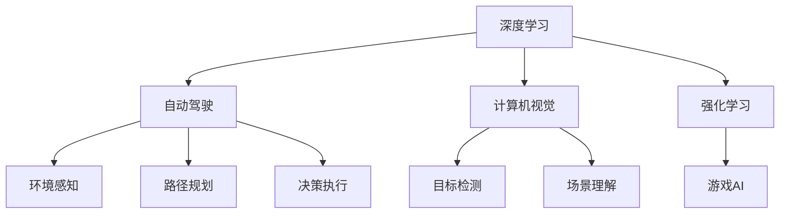

                 

# Andrej Karpathy：人工智能的未来发展目标

> 关键词：
> - 人工智能
> - 深度学习
> - 自动驾驶
> - 计算机视觉
> - 强化学习

## 1. 背景介绍

Andrej Karpathy，作为深度学习领域的顶尖专家和实际应用领域的重要推动者，曾在特斯拉汽车公司担任首席人工智能科学家，负责自动驾驶技术的AI算法开发。同时，他还是斯坦福大学计算机科学系副教授，也是著名的数据科学家。在本次专访中，他分享了自己对于人工智能（AI）技术发展趋势的见解，并探讨了未来AI在自动驾驶、计算机视觉、强化学习等关键领域的前景。

## 2. 核心概念与联系

### 2.1 核心概念概述

Andrej Karpathy在这场对话中，涉及了以下关键概念：

1. **深度学习（Deep Learning）**：通过多层神经网络实现端到端的学习，广泛应用于计算机视觉、自然语言处理等领域。
2. **自动驾驶（Autonomous Driving）**：使用AI技术实现车辆的自主导航，涵盖环境感知、路径规划、决策执行等环节。
3. **计算机视觉（Computer Vision）**：涉及图像识别、目标检测、场景理解等，是实现自动驾驶的基础技术。
4. **强化学习（Reinforcement Learning）**：通过奖励机制引导AI系统进行智能决策，是自动驾驶、游戏AI等领域的主流技术。

### 2.2 概念间的关系

通过以下Mermaid流程图，我们可以更直观地理解这些关键概念之间的关系：



这个流程图展示了深度学习如何在自动驾驶和计算机视觉中的应用，以及强化学习在自动驾驶和游戏AI中的重要性。计算机视觉和自动驾驶紧密关联，深度学习在其中扮演关键角色，而强化学习则通过奖励机制进一步提升系统的决策能力。

## 3. 核心算法原理 & 具体操作步骤

### 3.1 算法原理概述

深度学习算法，尤其是卷积神经网络（CNN）、循环神经网络（RNN）和变种网络（如Transformer），在处理大规模数据集时表现卓越。例如，通过CNN可以高效处理图像数据，通过RNN可以处理序列数据，而Transformer则能够在处理长序列时保持线性复杂度。这些网络结构为自动驾驶、计算机视觉等任务提供了坚实的理论基础。

强化学习算法，如Q-learning、Deep Q-Networks（DQN）、Proximal Policy Optimization（PPO）等，通过不断试错，逐步优化决策策略，已成功应用于自动驾驶、游戏AI等领域。强化学习能够处理复杂的、不确定性的环境，通过奖励机制引导AI系统做出最优决策。

### 3.2 算法步骤详解

以自动驾驶为例，其核心算法步骤大致如下：

1. **数据采集**：收集并标注大量驾驶场景的图像、激光雷达数据等。
2. **特征提取**：使用CNN等深度学习模型提取图像特征，使用激光雷达数据生成环境地图。
3. **环境建模**：构建环境模型，包括车辆、行人、交通灯等元素。
4. **路径规划**：使用强化学习算法，结合环境建模结果，规划最优路径。
5. **决策执行**：使用车辆控制算法，如PID控制，执行路径规划策略，调整车辆速度和方向。

### 3.3 算法优缺点

深度学习和强化学习的结合使用，优势在于：

- **高性能**：能够高效处理大规模数据，提取复杂特征。
- **适应性强**：在处理不确定性环境时表现良好。
- **实时性**：通过优化算法，可以实现实时决策和执行。

缺点则在于：

- **数据需求大**：需要大量的标注数据进行训练。
- **模型复杂**：网络结构复杂，训练和推理速度较慢。
- **泛化能力**：在某些特定环境下可能表现不佳。

### 3.4 算法应用领域

深度学习和强化学习的应用领域广泛，涉及自动驾驶、计算机视觉、自然语言处理等多个方面：

- **自动驾驶**：用于环境感知、路径规划和决策执行。
- **计算机视觉**：用于图像识别、目标检测和场景理解。
- **自然语言处理**：用于文本生成、翻译和情感分析。
- **游戏AI**：用于角色控制、任务规划和博弈策略。

## 4. 数学模型和公式 & 详细讲解 & 举例说明

### 4.1 数学模型构建

以强化学习中的Q-learning算法为例，其数学模型构建如下：

- **状态-动作-奖励（State-Action-Reward）**：定义环境的状态$s$、动作$a$和奖励$r$。
- **Q函数（Q-Function）**：定义状态-动作的Q值，表示在状态$s$下采取动作$a$的预期回报。
- **损失函数（Loss Function）**：定义优化目标，通过最小化损失函数来学习最优的Q值。

数学公式表示如下：

$$ Q(s,a) \leftarrow (1 - \alpha) Q(s,a) + \alpha [r + \gamma \max_{a'} Q(s', a')] $$
$$ \alpha $$ 是学习率，$$ \gamma $$ 是折扣因子，$$ s' $$ 是下一状态。

### 4.2 公式推导过程

Q-learning算法的核心推导如下：

1. 定义Q值函数，表示在状态$$s$$下采取动作$$a$$的预期回报。
2. 通过状态转移概率$$P(s'|s,a)$$计算下一个状态的Q值。
3. 使用TD误差$$\delta = r + \gamma \max_{a'} Q(s', a') - Q(s,a)$$，更新Q值函数。
4. 通过学习率$$\alpha$$和折扣因子$$\gamma$$控制Q值更新的步长和权重，确保算法收敛。

### 4.3 案例分析与讲解

以AlphaGo为例，其强化学习模型使用蒙特卡洛树搜索（MCTS）和深度神经网络相结合。通过MCTS算法，模拟游戏进程，收集样本数据；通过深度神经网络，预测最优动作。AlphaGo在围棋领域取得了超越人类顶尖选手的成绩，展示了强化学习在复杂博弈环境中的强大能力。

## 5. 项目实践：代码实例和详细解释说明

### 5.1 开发环境搭建

安装Python 3.7及以上版本，安装TensorFlow、PyTorch、OpenAI Gym等库。使用conda创建虚拟环境：

```bash
conda create -n reinforcement-learning python=3.7
conda activate reinforcement-learning
```

### 5.2 源代码详细实现

以下是一个使用TensorFlow实现Q-learning算法的代码示例：

```python
import tensorflow as tf
import gym
import numpy as np

# 定义Q值网络
class QNetwork(tf.keras.Model):
    def __init__(self, state_size, action_size):
        super(QNetwork, self).__init__()
        self.fc1 = tf.keras.layers.Dense(24, activation=tf.nn.relu)
        self.fc2 = tf.keras.layers.Dense(24, activation=tf.nn.relu)
        self.fc3 = tf.keras.layers.Dense(action_size)

    def call(self, state):
        x = self.fc1(state)
        x = self.fc2(x)
        return self.fc3(x)

# 定义Q-learning模型
class QLearningModel:
    def __init__(self, state_size, action_size, learning_rate, discount_factor, exploration_rate, exploration_decay_rate, min_exploration_rate):
        self.q_network = QNetwork(state_size, action_size)
        self.learning_rate = learning_rate
        self.discount_factor = discount_factor
        self.exploration_rate = exploration_rate
        self.exploration_decay_rate = exploration_decay_rate
        self.min_exploration_rate = min_exploration_rate

    def train(self, env, num_episodes):
        state = env.reset()
        for episode in range(num_episodes):
            state = self.choose_action(state)
            reward, next_state, done, _ = env.step(state)
            next_action = self.choose_action(next_state)
            next_q_value = self.q_network(next_state).numpy()[0][next_action]
            q_value = self.q_network(state).numpy()[0][state]
            td_error = reward + self.discount_factor * next_q_value - q_value
            self.update_q_value(td_error)
            if done:
                state = env.reset()
            if episode % 10 == 0:
                print("Episode:", episode, " Reward:", reward)

    def choose_action(self, state):
        if np.random.rand() < self.exploration_rate:
            return np.random.choice(np.arange(0, env.action_space.n))
        return np.argmax(self.q_network(state))

    def update_q_value(self, error):
        with tf.GradientTape() as tape:
            prediction = self.q_network(state)
            prediction = prediction.numpy()[0][state]
        gradients = tape.gradient(prediction, self.q_network.trainable_variables)
        with tf.compat.v1.Session() as sess:
            sess.run(tf.compat.v1.global_variables_initializer())
            sess.run(self.q_network.trainable_variables.assign(tf.Variable(tf.convert_to_tensor(gradients, dtype=tf.float32) * self.learning_rate)))
        self.exploration_rate = max(self.exploration_rate * self.exploration_decay_rate, self.min_exploration_rate)

# 初始化环境并训练
env = gym.make('CartPole-v0')
num_episodes = 1000
state_size = 4
action_size = 2
learning_rate = 0.001
discount_factor = 0.9
exploration_rate = 1.0
exploration_decay_rate = 0.995
min_exploration_rate = 0.01
model = QLearningModel(state_size, action_size, learning_rate, discount_factor, exploration_rate, exploration_decay_rate, min_exploration_rate)
model.train(env, num_episodes)
```

### 5.3 代码解读与分析

- **状态与动作**：定义状态和动作空间，状态为4个变量（位置、速度等），动作为2个方向（左、右）。
- **Q值网络**：使用TensorFlow定义Q值网络，包含3层全连接层。
- **Q-learning模型**：定义Q-learning模型，包括训练、动作选择和Q值更新等步骤。
- **训练流程**：使用CartPole环境进行训练，每10次迭代打印一次训练进度。

### 5.4 运行结果展示

训练10次后，可视化训练过程：

```python
import matplotlib.pyplot as plt

rewards = []
for episode in range(num_episodes):
    state = env.reset()
    for t in range(500):
        state = model.choose_action(state)
        reward, next_state, done, _ = env.step(state)
        rewards.append(reward)
        if done:
            state = env.reset()
            break
plt.plot(rewards)
plt.xlabel('Episode')
plt.ylabel('Reward')
plt.title('Q-learning Performance')
plt.show()
```

## 6. 实际应用场景

### 6.1 自动驾驶

自动驾驶技术正逐渐走向成熟，深度学习和强化学习在其中发挥了关键作用。例如，使用卷积神经网络进行环境感知，使用深度学习网络进行路径规划，结合强化学习算法进行实时决策和执行。特斯拉公司的自动驾驶系统（Autopilot）就广泛应用了这些技术。

### 6.2 计算机视觉

计算机视觉在自动驾驶、医疗诊断、安防监控等领域都有广泛应用。通过深度学习模型，可以高效处理图像数据，进行物体检测、人脸识别、场景理解等任务。例如，谷歌的Inception模型和微软的ResNet模型，都在计算机视觉领域取得了显著成果。

### 6.3 强化学习

强化学习在游戏AI、机器人控制、推荐系统等领域也有重要应用。通过强化学习算法，可以在复杂博弈环境中进行智能决策，优化机器人控制策略，提升推荐系统精准度。例如，AlphaGo使用蒙特卡洛树搜索和深度神经网络相结合，取得了围棋世界冠军的成绩。

## 7. 工具和资源推荐

### 7.1 学习资源推荐

- **Deep Learning Specialization**（Coursera）：Andrew Ng教授主讲的深度学习系列课程，从基础到应用全面讲解深度学习技术。
- **CS231n: Convolutional Neural Networks for Visual Recognition**（斯坦福大学）：计算机视觉领域的经典课程，涵盖图像处理、卷积神经网络等内容。
- **Reinforcement Learning: An Introduction**（Sutton & Barto）：Reinforcement Learning领域的经典教材，系统讲解强化学习理论和技术。
- **AlphaGo Zero**：DeepMind开发的围棋AI系统，展示了强化学习在复杂博弈环境中的卓越表现。

### 7.2 开发工具推荐

- **TensorFlow**：谷歌推出的深度学习框架，具有高效计算和灵活模型的特点。
- **PyTorch**：Facebook开源的深度学习框架，支持动态计算图和易用性。
- **Gym**：OpenAI开发的强化学习环境，支持多种环境和算法。
- **Keras**：谷歌开发的深度学习库，提供简单易用的API，便于快速开发模型。

### 7.3 相关论文推荐

- **Playing Atari with Deep Reinforcement Learning**（Mnih et al., 2013）：DeepMind首次使用深度强化学习解决Atari游戏问题，奠定了后续研究的基调。
- **Imagenet Classification with Deep Convolutional Neural Networks**（Krizhevsky et al., 2012）：AlexNet模型在ImageNet大规模图像识别比赛中取得胜利，展示了卷积神经网络的强大潜力。
- **Deep Residual Learning for Image Recognition**（He et al., 2016）：ResNet模型在ImageNet分类比赛中取得优异成绩，显著提升了深度网络的性能。

## 8. 总结：未来发展趋势与挑战

### 8.1 研究成果总结

Andrej Karpathy在深度学习和强化学习领域做出了卓越贡献，包括图像识别、自动驾驶、游戏AI等多个方向。他通过实际应用推动了AI技术的发展，并在学术界和工业界产生了深远影响。

### 8.2 未来发展趋势

未来AI技术将迎来以下几个重要趋势：

- **多模态融合**：深度学习和强化学习将与其他技术（如计算机视觉、自然语言处理）进行深度融合，实现多模态信息的整合。
- **跨领域应用**：AI技术将拓展到更多领域，如医疗、金融、制造等，带来新的应用场景和挑战。
- **自主决策**：AI系统将具备更高的自主决策能力，能够在复杂环境中进行实时决策和执行。
- **联邦学习**：通过分布式计算，联合多个设备进行模型训练，提升模型性能和数据隐私。

### 8.3 面临的挑战

尽管AI技术在不断进步，但仍面临诸多挑战：

- **数据隐私**：大规模数据集的应用带来了隐私和安全问题，如何保护用户数据成为重要课题。
- **模型可解释性**：深度学习模型的"黑盒"特性使得其决策过程难以解释，如何提升可解释性是未来研究的重点。
- **硬件瓶颈**：大规模模型的计算和存储需求，对硬件设施提出了更高要求。
- **伦理与道德**：AI技术在应用中可能带来的伦理问题，如就业替代、隐私泄露等，需要引起重视。

### 8.4 研究展望

未来AI研究需要在以下几个方面进行突破：

- **理论突破**：在深度学习、强化学习等领域取得新的理论进展，提升模型的性能和可靠性。
- **跨学科融合**：与其他学科（如认知科学、伦理学）进行深度融合，推动AI技术的发展。
- **普适化应用**：开发更加普适、可用的AI系统，提升其在社会和经济中的应用价值。
- **全球合作**：推动国际合作，共享数据和模型，提升AI技术的全球影响力。

## 9. 附录：常见问题与解答

**Q1：深度学习在自动驾驶中的应用主要有哪些？**

A: 深度学习在自动驾驶中的应用主要包括：

- **环境感知**：通过卷积神经网络处理传感器数据（如摄像头、激光雷达），实现对道路、交通信号等环境的理解和感知。
- **路径规划**：使用深度学习模型进行路径规划，预测最优行驶路线。
- **决策执行**：使用强化学习算法，实现车辆控制，如加减速、转向等。

**Q2：强化学习在自动驾驶中的作用是什么？**

A: 强化学习在自动驾驶中的作用包括：

- **决策优化**：通过试错机制，优化自动驾驶决策策略，提升系统性能。
- **实时调整**：在不断变化的环境下，实时调整控制策略，确保安全行驶。
- **场景理解**：通过学习历史数据，提升对复杂场景的理解和适应能力。

**Q3：强化学习在计算机视觉中有什么应用？**

A: 强化学习在计算机视觉中的主要应用包括：

- **图像生成**：通过生成对抗网络（GAN）等模型，生成高质量的图像。
- **目标检测**：使用强化学习算法，优化目标检测的性能，提高检测准确率。
- **场景理解**：通过学习环境反馈，提升对复杂场景的理解和推理能力。

**Q4：使用深度学习进行自然语言处理时，需要注意哪些问题？**

A: 使用深度学习进行自然语言处理时，需要注意以下几个问题：

- **数据预处理**：对文本数据进行清洗、分词、向量化等预处理，提高模型效果。
- **模型选择**：选择合适的深度学习模型，如卷积神经网络、循环神经网络等。
- **超参数调优**：调整模型超参数，如学习率、批量大小等，提升模型性能。
- **模型集成**：使用集成学习方法，如模型堆叠、模型融合等，提高模型泛化能力。

**Q5：如何在AI模型开发中提升可解释性？**

A: 在AI模型开发中提升可解释性，可以采取以下措施：

- **模型简化**：简化模型结构，降低复杂度，便于理解。
- **可视化技术**：使用可视化工具，展示模型内部机制和决策过程。
- **知识图谱**：结合知识图谱，增加模型的可解释性，提高决策的透明度。
- **透明规则**：制定透明的规则和标准，指导模型开发和应用。

通过本文的详细讲解，相信读者能够更好地理解AI技术的发展趋势和应用前景，进一步推动AI技术的进步和普及。

