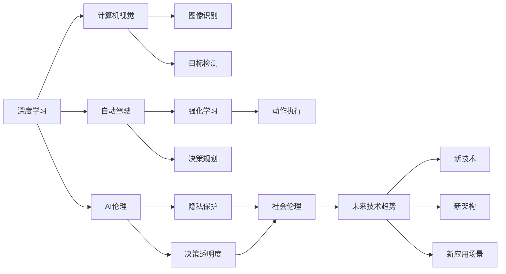

                 

## 1. 背景介绍

Andrej Karpathy，世界顶级AI专家，以其在深度学习和计算机视觉领域的杰出贡献著称。他不仅在学术界取得了巨大成就，更通过广泛的讲座、博客和公开演讲，深入浅出地阐述了人工智能的未来发展趋势。本文将围绕Karpathy的研究和观点，系统探讨人工智能领域的重要前沿议题，为读者提供深度思考和见解。

### 1.1 问题由来

人工智能（AI）领域在过去十年间取得了翻天覆地的变化。深度学习、计算机视觉、自然语言处理等技术的突破，使得AI系统在各个领域展示了惊人的应用潜力。然而，面对快速发展的技术趋势，未来人工智能的发展方向及其对社会、经济、伦理等方面的影响，成为各界关注的焦点。

Andrej Karpathy作为深度学习和计算机视觉领域的领军人物，其研究和观点在学界内外引起了广泛关注。他不仅通过自己的研究推动了深度学习的发展，还通过公开演讲、博客文章等形式，将复杂的AI概念通俗化，引发了更广泛的公众讨论。

### 1.2 问题核心关键点

Karpathy的研究和观点主要集中在以下几个核心议题上：
- **深度学习与计算机视觉**：探讨深度学习在图像识别、目标检测、自动驾驶等领域的潜力。
- **自动驾驶与强化学习**：深入研究自动驾驶中的挑战与前沿技术，以及强化学习如何帮助自动驾驶实现复杂的决策。
- **AI伦理与社会影响**：关注AI技术发展带来的社会伦理问题，包括隐私保护、决策透明度、AI与人类的未来关系等。
- **未来技术趋势**：预测未来人工智能技术的突破方向，包括新算法、新架构和新应用场景。

这些议题不仅涵盖了AI技术本身的发展，还涉及了AI与人类社会的关系，提供了广阔的视角，有助于全面理解人工智能的未来前景。

## 2. 核心概念与联系

### 2.1 核心概念概述

为更深入地理解Karpathy的观点，本节将介绍几个核心概念及其相互联系：

- **深度学习（Deep Learning）**：一种基于神经网络的机器学习方法，能够自动提取和处理复杂数据模式，广泛应用于图像识别、语音识别、自然语言处理等领域。

- **计算机视觉（Computer Vision）**：AI领域中研究计算机如何“看”的学科，包括图像识别、目标检测、图像分割等任务。

- **自动驾驶（Autonomous Driving）**：AI在汽车、交通系统中的应用，旨在实现车辆的自主导航和决策。

- **强化学习（Reinforcement Learning）**：一种学习框架，通过智能体与环境交互，最大化累积奖励来实现目标。

- **AI伦理（AI Ethics）**：研究AI技术发展对社会伦理、隐私保护、决策透明度等方面的影响。

- **未来技术趋势（Future Technology Trends）**：AI技术发展的最新动态和可能带来的突破，包括新技术、新架构和新应用场景。

这些概念共同构成了AI领域的核心框架，通过深入理解这些概念，可以更好地把握AI技术的发展脉络和应用前景。

### 2.2 概念间的关系

这些核心概念之间存在着紧密的联系，形成了AI技术的整体生态系统。下面通过一个Mermaid流程图展示这些概念的相互关系：



这个流程图展示了深度学习、计算机视觉、自动驾驶、强化学习等概念之间的相互关系。同时，AI伦理在未来技术趋势中起到了重要的指导作用，技术的发展需要考虑到社会伦理问题。

## 3. 核心算法原理 & 具体操作步骤

### 3.1 算法原理概述

Andrej Karpathy的研究和观点涵盖了多个核心算法原理，包括深度学习、计算机视觉、自动驾驶和强化学习等领域。这些算法原理共同构成了AI技术的基础。

- **深度学习**：基于神经网络的机器学习方法，通过多层次的非线性变换，实现对复杂数据模式的自动提取和处理。其核心算法包括反向传播、梯度下降等。

- **计算机视觉**：通过深度学习模型对图像进行处理和分析，实现图像识别、目标检测、图像分割等任务。其主要算法包括卷积神经网络（CNN）、区域卷积神经网络（R-CNN）、YOLO（You Only Look Once）等。

- **自动驾驶**：涉及环境感知、决策规划、控制执行等多个环节，核心算法包括传感器数据融合、目标检测、路径规划、行为预测等。

- **强化学习**：通过智能体与环境交互，最大化累积奖励来实现目标。主要算法包括Q-learning、策略梯度、深度强化学习等。

### 3.2 算法步骤详解

每个核心算法都有其特定的步骤和实现细节，下面以深度学习算法为例进行详细介绍。

**深度学习算法步骤**：
1. **数据预处理**：对输入数据进行标准化、归一化等预处理操作。
2. **模型设计**：设计多层神经网络结构，包括卷积层、池化层、全连接层等。
3. **模型训练**：使用反向传播算法更新模型参数，最小化损失函数。
4. **模型评估**：在测试集上评估模型性能，选择最优模型。
5. **模型应用**：将训练好的模型应用于实际问题，如图像识别、语音识别等。

**计算机视觉算法步骤**：
1. **数据收集**：收集图像、视频等视觉数据。
2. **数据标注**：对数据进行标注，如目标检测、图像分割等。
3. **模型训练**：使用深度学习模型对数据进行训练，如CNN、R-CNN、YOLO等。
4. **模型评估**：在测试集上评估模型性能，如IoU（Intersection over Union）、准确率、召回率等。
5. **模型应用**：将训练好的模型应用于实际问题，如自动驾驶、机器人导航等。

**自动驾驶算法步骤**：
1. **传感器数据采集**：通过摄像头、雷达、激光雷达等传感器采集环境数据。
2. **数据预处理**：对传感器数据进行融合、滤波等预处理操作。
3. **环境建模**：使用深度学习模型对环境进行建模，如目标检测、行为预测等。
4. **决策规划**：设计决策规划算法，如A*、D*、RRT等，规划最优路径。
5. **控制执行**：根据决策规划结果，控制车辆执行动作。

**强化学习算法步骤**：
1. **环境建模**：设计环境模型，如游戏、机器人等。
2. **智能体设计**：设计智能体，包括状态、动作、奖励函数等。
3. **模型训练**：使用强化学习算法，如Q-learning、策略梯度、深度强化学习等，训练智能体。
4. **模型评估**：在测试环境中评估智能体性能，选择最优模型。
5. **模型应用**：将训练好的智能体应用于实际问题，如游戏、机器人等。

### 3.3 算法优缺点

每个算法都有其优缺点，了解这些优缺点有助于选择适合的算法进行研究和应用。

- **深度学习**：
  - **优点**：能够自动提取复杂特征，处理大规模数据，应用广泛。
  - **缺点**：需要大量标注数据，模型复杂度高，训练时间长。

- **计算机视觉**：
  - **优点**：能够处理图像和视频数据，应用广泛，如自动驾驶、医疗诊断等。
  - **缺点**：数据标注难度大，模型复杂度高，计算资源需求高。

- **自动驾驶**：
  - **优点**：能够实现车辆自主导航和决策，提升交通安全和效率。
  - **缺点**：环境复杂，数据标注难度大，技术要求高。

- **强化学习**：
  - **优点**：能够处理复杂决策问题，应用广泛，如游戏、机器人等。
  - **缺点**：训练过程易受环境影响，模型稳定性和可解释性不足。

### 3.4 算法应用领域

基于上述算法原理，AI技术已经在多个领域得到了广泛应用，包括但不限于：

- **医疗健康**：用于医学图像诊断、疾病预测、个性化医疗等。
- **智能交通**：用于智能交通系统、自动驾驶、交通流量预测等。
- **金融科技**：用于股票预测、信用评分、反欺诈等。
- **制造业**：用于质量检测、故障诊断、智能制造等。
- **教育**：用于智能推荐、智能辅导、学习分析等。

这些应用领域展示了AI技术的强大潜力和广泛应用，未来还将有更多领域受益于AI技术。

## 4. 数学模型和公式 & 详细讲解

### 4.1 数学模型构建

Karpathy的研究中涉及多个数学模型，包括深度学习、计算机视觉、自动驾驶和强化学习等。

- **深度学习模型**：以神经网络为基础，通过反向传播算法更新参数，最小化损失函数。常用的数学模型包括多层感知器（MLP）、卷积神经网络（CNN）、循环神经网络（RNN）等。

- **计算机视觉模型**：以深度学习为基础，通过卷积神经网络（CNN）等模型进行图像处理和分析。常用的数学模型包括AlexNet、VGG、ResNet等。

- **自动驾驶模型**：涉及多个模型和算法，如传感器数据融合、目标检测、路径规划、行为预测等。常用的数学模型包括卡尔曼滤波、粒子滤波、A*、D*、RRT等。

- **强化学习模型**：以智能体与环境交互为基础，通过最大化累积奖励实现目标。常用的数学模型包括Q-learning、策略梯度、深度强化学习等。

### 4.2 公式推导过程

以卷积神经网络（CNN）为例，推导其数学模型和公式。

**CNN数学模型**：
1. **卷积层**：通过滑动卷积核对输入图像进行卷积操作，提取特征。
2. **池化层**：对卷积层输出进行下采样，减小数据规模。
3. **全连接层**：将池化层输出连接成向量，输入到全连接层进行分类或回归。

**公式推导**：
- **卷积操作**：
  $$
  y_i = \sum_{j=0}^{n-1} w_{i,j} x_j + b_i
  $$
  其中，$x_j$表示输入特征，$w_{i,j}$表示卷积核权重，$b_i$表示偏置项。

- **池化操作**：
  $$
  y_{i,j} = \max\limits_{k \in K} x_{i,j+k}
  $$
  其中，$x_{i,j+k}$表示池化窗口内的元素，$K$表示池化窗口大小。

- **全连接层**：
  $$
  z = Wx + b
  $$
  其中，$z$表示全连接层的输出，$W$表示权重矩阵，$b$表示偏置项。

### 4.3 案例分析与讲解

以Karpathy的论文《End to End Training for Self-Driving Cars》为例，探讨深度学习在自动驾驶中的应用。

该论文中，作者通过深度学习模型对摄像头、雷达等传感器数据进行融合，实现了自动驾驶中的目标检测、路径规划等功能。具体实现步骤如下：

1. **传感器数据融合**：将摄像头和雷达数据进行融合，使用卡尔曼滤波等算法提高数据精度。
2. **目标检测**：使用深度学习模型对融合后的数据进行目标检测，如使用YOLO算法检测车辆、行人等。
3. **路径规划**：使用深度学习模型进行路径规划，如使用A*算法规划最优路径。
4. **行为预测**：使用深度学习模型预测其他车辆的行驶轨迹，提高决策的准确性。

## 5. 项目实践：代码实例和详细解释说明

### 5.1 开发环境搭建

在进行AI项目实践前，首先需要搭建开发环境。以下是使用Python和PyTorch进行深度学习开发的常用环境配置：

1. **安装Python和PyTorch**：
   ```bash
   pip install torch torchvision torchaudio
   ```

2. **安装计算机视觉库**：
   ```bash
   pip install matplotlib numpy scikit-image
   ```

3. **安装自动驾驶库**：
   ```bash
   pip install opencv-python pyrouge
   ```

4. **安装强化学习库**：
   ```bash
   pip install gym gym-super-mario
   ```

完成上述步骤后，即可在Python环境下进行AI项目实践。

### 5.2 源代码详细实现

以下是使用PyTorch实现一个简单的图像分类器的代码示例：

```python
import torch
import torch.nn as nn
import torch.optim as optim
from torchvision import datasets, transforms

# 定义模型
class Net(nn.Module):
    def __init__(self):
        super(Net, self).__init__()
        self.conv1 = nn.Conv2d(3, 6, 5)
        self.pool = nn.MaxPool2d(2, 2)
        self.conv2 = nn.Conv2d(6, 16, 5)
        self.fc1 = nn.Linear(16 * 5 * 5, 120)
        self.fc2 = nn.Linear(120, 84)
        self.fc3 = nn.Linear(84, 10)

    def forward(self, x):
        x = self.pool(F.relu(self.conv1(x)))
        x = self.pool(F.relu(self.conv2(x)))
        x = x.view(-1, 16 * 5 * 5)
        x = F.relu(self.fc1(x))
        x = F.relu(self.fc2(x))
        x = self.fc3(x)
        return x

# 定义训练函数
def train(model, device, train_loader, optimizer, epoch):
    model.train()
    for batch_idx, (data, target) in enumerate(train_loader):
        data, target = data.to(device), target.to(device)
        optimizer.zero_grad()
        output = model(data)
        loss = F.cross_entropy(output, target)
        loss.backward()
        optimizer.step()
        if batch_idx % 100 == 0:
            print('Train Epoch: {} [{}/{} ({:.0f}%)]\tLoss: {:.6f}'.format(
                epoch, batch_idx * len(data), len(train_loader.dataset),
                100. * batch_idx / len(train_loader), loss.item()))

# 训练模型
train_loader = torch.utils.data.DataLoader(
    datasets.CIFAR10(root='./data', train=True, download=True,
                    transform=transforms.ToTensor()), batch_size=4, shuffle=True, num_workers=2)
device = torch.device("cuda" if torch.cuda.is_available() else "cpu")
model = Net().to(device)
optimizer = optim.SGD(model.parameters(), lr=0.001, momentum=0.9)

for epoch in range(10):
    train(model, device, train_loader, optimizer, epoch)
```

### 5.3 代码解读与分析

这段代码展示了使用PyTorch进行图像分类的基本流程：

- **模型定义**：定义一个包含卷积层、池化层、全连接层的深度学习模型。
- **训练函数**：定义训练函数，包括前向传播、损失计算、反向传播和参数更新。
- **数据加载**：使用torchvision库加载CIFAR-10数据集，并进行数据预处理。
- **设备设置**：将模型和数据移动到GPU（如果有）进行训练。
- **训练循环**：在每个epoch中，对数据集进行批处理，进行前向传播和反向传播，更新模型参数。

通过这段代码，可以更直观地理解深度学习模型的基本实现。

### 5.4 运行结果展示

运行上述代码后，可以得到图像分类的训练结果。例如，可以使用如下命令在CIFAR-10数据集上进行训练：

```bash
python train.py
```

训练完成后，可以在测试集上评估模型性能，例如：

```bash
python test.py
```

测试集评估结果会输出模型的准确率、召回率、F1分数等指标，展示模型的性能。

## 6. 实际应用场景

### 6.1 智能交通

基于深度学习的自动驾驶技术已经在多个国家和地区进行了试点和部署。Karpathy的研究中，通过深度学习模型对传感器数据进行融合和处理，实现了自动驾驶中的目标检测、路径规划等功能。

在实际应用中，自动驾驶技术可以显著提高交通安全和交通效率，减少交通事故和交通拥堵。同时，自动驾驶技术还可以提供更加便捷、舒适的出行方式，降低司机的疲劳和压力。

### 6.2 医疗健康

深度学习在医疗健康领域也有广泛应用，如医学图像诊断、疾病预测、个性化医疗等。

以医学图像诊断为例，Karpathy的研究中，使用深度学习模型对X光片、CT扫描等医学图像进行自动分析和诊断，帮助医生提高诊断效率和准确性。例如，使用卷积神经网络（CNN）对肺部CT扫描图像进行分析，可以早期发现肺癌、肺炎等疾病。

### 6.3 金融科技

金融科技是AI技术的重要应用领域之一，包括股票预测、信用评分、反欺诈等。

在股票预测方面，Karpathy的研究中，使用深度学习模型对历史股价数据进行分析和预测，帮助投资者做出更准确的投资决策。例如，使用LSTM（长短期记忆网络）模型对股价数据进行建模，可以预测未来的股价走势。

### 6.4 未来应用展望

未来，AI技术将在更多领域得到应用，带来更多创新和突破。

- **AI伦理**：随着AI技术的普及，如何确保AI系统的透明度、公平性和安全性，将成为重要的研究方向。
- **人机协同**：AI技术与人类协同工作的场景将越来越多，如智能助理、虚拟助手等，提升工作效率和生活便利。
- **跨领域融合**：AI技术与其他领域技术的融合将带来新的应用场景，如AI与物联网（IoT）的结合，实现智能家居、智能城市等。
- **自主学习**：未来AI系统将具备更强的自主学习能力和自适应能力，能够快速适应新的环境和任务。

## 7. 工具和资源推荐

### 7.1 学习资源推荐

以下是Karpathy推荐的一些学习资源，可以帮助读者更深入地理解AI技术：

- **深度学习与计算机视觉课程**：如斯坦福大学CS231n课程，涵盖了深度学习在计算机视觉中的应用。
- **自动驾驶技术讲座**：Karpathy在CVPR 2018上的演讲《End to End Training for Self-Driving Cars》，详细介绍了深度学习在自动驾驶中的应用。
- **强化学习资源**：如DeepMind的强化学习课程、OpenAI的Reinforcement Learning with Python等。

### 7.2 开发工具推荐

以下是一些常用的开发工具，可以帮助读者更高效地进行AI项目开发：

- **PyTorch**：强大的深度学习框架，支持GPU加速，适用于图像、视频、语音等多种数据类型的处理。
- **TensorFlow**：Google开发的深度学习框架，支持分布式计算，适用于大规模数据集和复杂模型。
- **OpenCV**：计算机视觉库，支持图像处理、目标检测等。
- **Gym**：Python库，用于开发和测试强化学习算法。

### 7.3 相关论文推荐

以下是Karpathy的一些著名论文，值得读者深入阅读：

- **End to End Training for Self-Driving Cars**：Karpathy等人在CVPR 2018上发表的论文，介绍了深度学习在自动驾驶中的应用。
- **Deep Learning and Reinforcement Learning for Robotic Manipulation**：Karpathy等人发表于ICRA 2018的论文，展示了深度学习在机器人操作中的应用。
- **Caffe2**：Karpathy等人发表在NIPS 2017上的论文，介绍了Caffe2框架，支持大规模深度学习应用的部署。

## 8. 总结：未来发展趋势与挑战

### 8.1 研究成果总结

Andrej Karpathy的研究涵盖了深度学习、计算机视觉、自动驾驶和强化学习等多个领域，为AI技术的发展提供了重要的理论基础和实践指导。

- **深度学习**：推动了计算机视觉、自然语言处理等领域的发展。
- **计算机视觉**：通过深度学习模型实现了图像识别、目标检测等任务。
- **自动驾驶**：通过深度学习模型实现了目标检测、路径规划等功能。
- **强化学习**：推动了自动驾驶、游戏等领域的智能化发展。

### 8.2 未来发展趋势

未来，AI技术将在多个领域取得更大的突破，带来更多的创新和应用。

- **深度学习**：深度学习模型将更加复杂，性能将进一步提升。
- **计算机视觉**：图像识别、目标检测等任务将更加高效和准确。
- **自动驾驶**：自动驾驶技术将更加成熟，实现大规模商业应用。
- **强化学习**：强化学习模型将更加智能，应用于更多复杂决策场景。

### 8.3 面临的挑战

尽管AI技术取得了巨大进展，但在实际应用中也面临一些挑战：

- **数据隐私**：AI系统需要大量数据进行训练，如何保护用户隐私成为一个重要问题。
- **算法透明性**：AI系统的决策过程难以解释，如何提高算法的透明性和可解释性是一个重要研究方向。
- **伦理和安全性**：AI系统可能存在偏见和有害影响，如何确保系统的伦理和安全性是一个重要问题。
- **计算资源**：AI系统需要大量计算资源进行训练和推理，如何提高计算效率是一个重要研究方向。

### 8.4 研究展望

未来，需要在多个方向进行研究，以推动AI技术的进一步发展：

- **跨领域融合**：AI技术与其他领域的深度融合，将带来更多的创新和应用。
- **自主学习和自适应**：未来AI系统将具备更强的自主学习和自适应能力，能够快速适应新的环境和任务。
- **伦理和社会影响**：在AI技术发展的过程中，需要考虑伦理和社会影响，确保技术的安全和公平性。

## 9. 附录：常见问题与解答

**Q1: 如何提高AI系统的可解释性？**

A: 提高AI系统的可解释性需要从多个方面进行改进：
1. **可视化技术**：使用可视化工具，如图表、热力图等，展示模型的内部结构和学习过程。
2. **注意力机制**：使用注意力机制，展示模型在处理输入时的关注点，帮助理解模型的决策过程。
3. **模型简化**：简化模型的复杂度，使用更简单的模型结构，提高可解释性。
4. **规则集成**：将符号化的先验知识与AI模型结合，提供更明确的规则和解释。

**Q2: 如何保护AI系统的数据隐私？**

A: 保护AI系统的数据隐私需要从多个方面进行改进：
1. **数据匿名化**：对数据进行匿名化处理，去除或模糊化敏感信息。
2. **差分隐私**：使用差分隐私技术，在数据中使用噪声，保护用户隐私。
3. **联邦学习**：在多个设备或数据源上进行分布式学习，避免数据集中存储。
4. **隐私计算**：使用隐私计算技术，如多方安全计算、同态加密等，保护数据隐私。

**Q3: 如何提高AI系统的性能？**

A: 提高AI系统的性能需要从多个方面进行改进：
1. **算法优化**：优化算法模型，提高模型的精度和效率。
2. **数据增强**：通过数据增强技术，扩充训练集，提高模型的泛化能力。
3. **计算优化**：优化计算图和资源配置，提高计算效率。
4. **模型融合**：将多个模型进行融合，提高系统的综合性能。

---

作者：禅与计算机程序设计艺术 / Zen and the Art of Computer Programming

