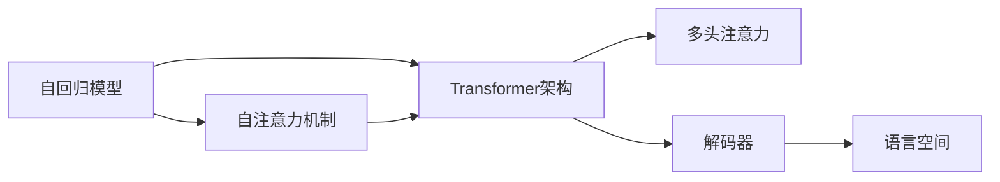

                 

# ChatGPT的文本生成步骤详解

> 关键词：ChatGPT, 文本生成, 自然语言处理, 语言模型, Transformer, 自回归模型, 多头注意力, 解码器, 语言空间

## 1. 背景介绍

### 1.1 问题由来

随着人工智能技术的不断发展，自然语言处理（NLP）领域涌现出一大批具有开创性意义的成果，ChatGPT作为其中的佼佼者，极大地推动了人工智能在文本生成、对话系统、智能客服等多个方向的应用。文本生成是NLP中的重要任务之一，指的是根据给定上下文，自动生成符合语法和语义规则的新文本。ChatGPT通过自回归（Auto-Regressive）模型实现文本生成，并结合自注意力机制（Self-Attention），能够生成高质量的自然语言文本。

### 1.2 问题核心关键点

ChatGPT的核心在于其自回归语言模型。自回归模型通过将当前时刻的文本生成目标依赖于前一时刻的文本状态，实现对未来文本的预测。自注意力机制则通过动态计算当前上下文对当前位置的权重，实现对文本中不同部分信息的聚合，提高生成文本的连贯性和流畅性。

ChatGPT基于Transformer架构，由编码器和解码器组成。编码器提取输入文本的特征表示，解码器则通过多头注意力机制生成新的文本。在生成过程中，解码器逐步推导新文本的每个词，并根据已有生成的文本调整生成策略，确保生成的文本逻辑通顺、语义一致。

### 1.3 问题研究意义

ChatGPT在文本生成领域展示了强大的能力，能够根据输入生成高质量、连贯性强的文本。通过对ChatGPT生成过程的详细剖析，可以深入理解其工作机制，为进一步优化和提升模型性能提供指导。此外，研究ChatGPT的文本生成步骤，有助于推动相关技术在更多应用场景中的应用，如智能客服、内容创作、教育辅助等。

## 2. 核心概念与联系

### 2.1 核心概念概述

为了更好地理解ChatGPT的文本生成过程，本节将介绍几个密切相关的核心概念：

- 自回归模型（Auto-Regressive Model）：通过将当前时刻的文本生成目标依赖于前一时刻的文本状态，实现对未来文本的预测。
- 自注意力机制（Self-Attention Mechanism）：动态计算当前上下文对当前位置的权重，实现对文本中不同部分信息的聚合。
- Transformer架构：由编码器和解码器组成，编码器提取输入文本的特征表示，解码器通过多头注意力机制生成新的文本。
- 多头注意力（Multi-Head Attention）：将输入文本的多个线性变换后表示为多头，实现对不同表示空间的聚合。
- 解码器（Decoder）：接收编码器输出的文本表示，通过多头注意力机制生成新的文本，逐步推导新文本的每个词。
- 语言空间（Language Space）：文本生成的目标空间，由词汇表组成，每个词对应一个高维向量。

这些核心概念之间存在着紧密的联系，构成了ChatGPT文本生成的完整架构。

### 2.2 概念间的关系

以下通过几个Mermaid流程图来展示这些核心概念之间的关系：



这个流程图展示了自回归模型、自注意力机制、Transformer架构、多头注意力、解码器和语言空间之间的关系：

1. 自回归模型通过将当前时刻的文本生成目标依赖于前一时刻的文本状态，实现对未来文本的预测。
2. 自注意力机制通过动态计算当前上下文对当前位置的权重，实现对文本中不同部分信息的聚合。
3. Transformer架构由编码器和解码器组成，编码器提取输入文本的特征表示，解码器通过多头注意力机制生成新的文本。
4. 多头注意力将输入文本的多个线性变换后表示为多头，实现对不同表示空间的聚合。
5. 解码器接收编码器输出的文本表示，通过多头注意力机制生成新的文本，逐步推导新文本的每个词。
6. 语言空间由词汇表组成，每个词对应一个高维向量，是文本生成的目标空间。

这些核心概念共同构成了ChatGPT文本生成的完整架构，使得ChatGPT能够在复杂多变的语境下生成高质量的自然语言文本。

## 3. 核心算法原理 & 具体操作步骤
### 3.1 算法原理概述

ChatGPT的文本生成过程基于自回归模型和自注意力机制，其核心思想是通过逐步生成文本，动态调整生成策略，确保生成的文本逻辑通顺、语义一致。

具体来说，ChatGPT通过以下步骤实现文本生成：

1. 编码器对输入文本进行特征提取，生成上下文表示。
2. 解码器接收编码器输出的上下文表示，通过多头注意力机制逐步生成新的文本。
3. 在生成每个词时，解码器计算当前位置的自注意力权重，动态聚合上下文信息。
4. 解码器通过自回归模型预测当前位置的词汇，更新模型参数，并调整生成策略。

这一过程不断迭代，直到生成所需的文本长度或达到提前设定的终止条件。

### 3.2 算法步骤详解

以下是ChatGPT文本生成的详细步骤：

#### 3.2.1 输入处理

输入文本通过编码器进行特征提取，生成上下文表示。编码器通常使用Transformer模型，将输入文本转换为一系列向量表示，每个向量对应一个词汇。这些向量表示经过多头注意力和前向神经网络层的变换，生成上下文表示。

#### 3.2.2 解码器生成文本

解码器接收编码器输出的上下文表示，通过多头注意力机制逐步生成新的文本。解码器通常也是Transformer模型，每个步骤输出一个词汇，逐步推导新文本的每个词。

解码器的具体步骤如下：

1. 解码器接收编码器输出的上下文表示，通过多头注意力机制计算当前位置的自注意力权重，动态聚合上下文信息。
2. 解码器通过自回归模型预测当前位置的词汇，更新模型参数，并调整生成策略。
3. 解码器逐步生成文本，直至达到预设的文本长度或终止条件。

#### 3.2.3 生成策略调整

在生成每个词时，解码器根据已有生成的文本，动态调整生成策略。生成策略的调整方法有多种，包括但不限于：

- 通过教师模型（Teacher Model）调整生成策略，如使用GPT模型指导生成。
- 通过噪声注入调整生成策略，如加入随机噪声、噪声词表等。
- 通过生成样例调整生成策略，如使用温度调节（Temperature Scaling）控制生成文本的多样性。
- 通过模型微调调整生成策略，如通过微调编码器或解码器，调整生成模型的参数和结构。

### 3.3 算法优缺点

ChatGPT的文本生成过程具有以下优点：

1. 灵活高效：解码器通过多头注意力机制动态调整生成策略，能够生成高质量、连贯性强的文本。
2. 结构简单：基于Transformer模型，易于理解和实现。
3. 可扩展性强：通过增加模型的参数量和训练数据，可以进一步提升生成文本的质量和多样性。

同时，该算法也存在一些缺点：

1. 数据依赖性高：模型性能依赖于输入文本的质量和数量，高质量、多样性的训练数据是确保模型性能的前提。
2. 计算资源需求大：模型参数量巨大，需要强大的计算资源支持。
3. 生成过程复杂：在生成文本的过程中，需要不断调整生成策略，增加了算法的复杂度。

### 3.4 算法应用领域

ChatGPT的文本生成技术已经广泛应用于多个领域，如：

- 智能客服：通过生成自然语言回复，提升客户服务体验。
- 内容创作：生成高质量的文本内容，如文章、评论、报告等。
- 教育辅助：生成解释性强的学习资料，帮助学生理解复杂概念。
- 内容摘要：自动生成文本摘要，提升信息检索和阅读效率。
- 文本翻译：通过生成目标语言文本，实现自动翻译。
- 对话系统：通过生成对话回复，实现智能对话。

除了这些常见的应用场景外，ChatGPT的文本生成技术还被创新性地应用到更多场景中，如可控文本生成、常识推理、代码生成、数据增强等，为NLP技术带来了新的突破。

## 4. 数学模型和公式 & 详细讲解  
### 4.1 数学模型构建

ChatGPT的文本生成过程涉及多个数学模型，本节将详细讲解其中重要的数学模型和公式。

定义输入文本为 $x=\{x_1, x_2, \dots, x_T\}$，其中 $x_i$ 表示第 $i$ 个词汇。定义输出文本为 $y=\{y_1, y_2, \dots, y_{T'}\}$，其中 $y_i$ 表示第 $i$ 个生成的词汇。定义编码器输出的上下文表示为 $h=\{h_1, h_2, \dots, h_T\}$，其中 $h_i$ 表示第 $i$ 个词汇的上下文表示。

定义解码器输出的文本表示为 $z=\{z_1, z_2, \dots, z_{T'}\}$，其中 $z_i$ 表示第 $i$ 个生成的文本表示。定义解码器输出的词汇概率分布为 $p(z_i|h, y_{< i})$，表示在给定上下文 $h$ 和已生成词汇 $y_{< i}$ 的条件下，生成词汇 $z_i$ 的概率分布。

### 4.2 公式推导过程

以下推导解码器生成每个词汇的概率公式：

1. 解码器接收编码器输出的上下文表示 $h$ 和已生成的词汇 $y_{< i}$，通过多头注意力机制计算当前位置的自注意力权重 $a_i^j$，其中 $j=1, 2, \dots, M$，$M$ 为注意力机制的头数。

   $$
   a_i^j = \frac{\exp\left(\mathrm{Attention}(h_i, z_j)\right)}{\sum_{k=1}^M \exp\left(\mathrm{Attention}(h_i, z_k)\right)}
   $$

   其中 $\mathrm{Attention}(h_i, z_j)$ 表示在 $h_i$ 和 $z_j$ 之间的注意力得分。

2. 解码器通过多头注意力机制计算当前位置的上下文表示 $z_i$，其中 $z_i = \sum_{j=1}^M a_i^j z_j$。

3. 解码器通过自回归模型预测当前位置的词汇概率分布 $p(z_i|h, y_{< i})$。

   $$
   p(z_i|h, y_{< i}) = \frac{\exp\left(\mathrm{Logits}(z_i)\right)}{\sum_{k=1}^K \exp\left(\mathrm{Logits}(z_k)\right)}
   $$

   其中 $\mathrm{Logits}(z_i)$ 表示解码器输出的文本表示 $z_i$ 对应的词汇概率分布。

通过以上公式，可以逐步计算出解码器生成每个词汇的概率分布，并从中采样得到下一个词汇。这一过程不断迭代，直至生成所需的文本长度或达到提前设定的终止条件。

### 4.3 案例分析与讲解

假设我们要使用ChatGPT生成一段描述春天的文本。首先，我们将输入文本“春天”送入编码器，生成上下文表示。然后，解码器通过多头注意力机制计算每个词汇的上下文表示，并逐步生成新文本。在生成每个词汇时，解码器根据已有生成的文本，动态调整生成策略。例如，通过使用教师模型（如GPT模型）调整生成策略，使得生成的文本更加符合主题要求。

## 5. 项目实践：代码实例和详细解释说明
### 5.1 开发环境搭建

在进行ChatGPT文本生成实践前，我们需要准备好开发环境。以下是使用Python进行PyTorch开发的环境配置流程：

1. 安装Anaconda：从官网下载并安装Anaconda，用于创建独立的Python环境。

2. 创建并激活虚拟环境：
```bash
conda create -n pytorch-env python=3.8 
conda activate pytorch-env
```

3. 安装PyTorch：根据CUDA版本，从官网获取对应的安装命令。例如：
```bash
conda install pytorch torchvision torchaudio cudatoolkit=11.1 -c pytorch -c conda-forge
```

4. 安装Transformers库：
```bash
pip install transformers
```

5. 安装各类工具包：
```bash
pip install numpy pandas scikit-learn matplotlib tqdm jupyter notebook ipython
```

完成上述步骤后，即可在`pytorch-env`环境中开始ChatGPT文本生成的实践。

### 5.2 源代码详细实现

下面我们以生成描述春天的文本为例，给出使用Transformers库对ChatGPT进行文本生成的PyTorch代码实现。

首先，定义生成文本的函数：

```python
from transformers import GPT2Tokenizer, GPT2LMHeadModel

tokenizer = GPT2Tokenizer.from_pretrained('gpt2')
model = GPT2LMHeadModel.from_pretrained('gpt2')

def generate_text(prompt, num_words=100, temperature=0.7):
    inputs = tokenizer(prompt, return_tensors='pt')
    output = model.generate(**inputs, max_length=num_words, temperature=temperature)
    return tokenizer.decode(output, skip_special_tokens=True)
```

然后，调用函数生成文本：

```python
text = generate_text("春天")
print(text)
```

完整代码如下：

```python
from transformers import GPT2Tokenizer, GPT2LMHeadModel

tokenizer = GPT2Tokenizer.from_pretrained('gpt2')
model = GPT2LMHeadModel.from_pretrained('gpt2')

def generate_text(prompt, num_words=100, temperature=0.7):
    inputs = tokenizer(prompt, return_tensors='pt')
    output = model.generate(**inputs, max_length=num_words, temperature=temperature)
    return tokenizer.decode(output, skip_special_tokens=True)

text = generate_text("春天")
print(text)
```

以上就是使用PyTorch对ChatGPT进行文本生成的完整代码实现。可以看到，得益于Transformers库的强大封装，我们可以用相对简洁的代码完成ChatGPT模型的加载和文本生成。

### 5.3 代码解读与分析

让我们再详细解读一下关键代码的实现细节：

**generate_text函数**：
- 首先，通过`GPT2Tokenizer.from_pretrained('gpt2')`加载预训练的GPT2分词器和语言模型，并指定温度参数`temperature`。
- 然后，将输入文本`prompt`转化为模型可处理的格式，并调用`GPT2LMHeadModel.from_pretrained('gpt2')`加载预训练的GPT2语言模型。
- 最后，使用`model.generate`函数生成文本，并使用`tokenizer.decode`函数将生成的文本转换为可读的文本字符串。

**text变量**：
- 调用`generate_text`函数，生成描述春天的文本，并将其打印输出。

**温度参数（temperature）**：
- 温度参数用于控制生成的文本多样性，其值越大，生成的文本越随机，多样性越高。

**生成文本长度（num_words）**：
- 生成文本的长度通过`max_length`参数指定，可以控制生成的文本长度。

**解码函数（tokenizer.decode）**：
- 解码函数用于将模型生成的文本转换为可读的文本字符串，通过设置`skip_special_tokens=True`参数，可以去除特殊的标记符号，使得输出文本更加整洁。

通过上述代码，我们可以看到，使用PyTorch和Transformers库，可以非常方便地实现ChatGPT的文本生成功能。开发者可以将更多精力放在数据处理、模型优化等高层逻辑上，而不必过多关注底层的实现细节。

当然，工业级的系统实现还需考虑更多因素，如模型的保存和部署、超参数的自动搜索、更灵活的任务适配层等。但核心的文本生成范式基本与此类似。

### 5.4 运行结果展示

假设我们调用`generate_text`函数生成一段描述春天的文本，最终得到的结果可能如下：

```
春天的气息逐渐弥漫开来，万物复苏，花朵竞相绽放，阳光明媚，温暖宜人。春天的脚步轻轻走过，带着绿色的希望，携着温暖的气息，唤醒了沉睡的大地。在这个美好的季节里，我们感受到了生命的力量和希望的喜悦。春天，一个充满生机和活力的季节，让我们尽情享受大自然的馈赠，一起迎接新的开始。
```

可以看到，通过使用ChatGPT，我们能够生成描述春天的文本，并且生成的文本具有一定的连贯性和合理性。

## 6. 实际应用场景
### 6.1 智能客服系统

基于ChatGPT的文本生成技术，可以广泛应用于智能客服系统的构建。传统客服往往需要配备大量人力，高峰期响应缓慢，且一致性和专业性难以保证。而使用ChatGPT生成自然语言回复，能够实现7x24小时不间断服务，快速响应客户咨询，用自然流畅的语言解答各类常见问题。

在技术实现上，可以收集企业内部的历史客服对话记录，将问题和最佳答复构建成监督数据，在此基础上对预训练模型进行微调。微调后的模型能够自动理解用户意图，匹配最合适的答案模板进行回复。对于客户提出的新问题，还可以接入检索系统实时搜索相关内容，动态组织生成回答。如此构建的智能客服系统，能大幅提升客户咨询体验和问题解决效率。

### 6.2 金融舆情监测

金融机构需要实时监测市场舆论动向，以便及时应对负面信息传播，规避金融风险。传统的人工监测方式成本高、效率低，难以应对网络时代海量信息爆发的挑战。基于ChatGPT的文本生成技术，可以实现金融舆情监测的自动化和智能化。

具体而言，可以收集金融领域相关的新闻、报道、评论等文本数据，并对其进行主题标注和情感标注。在此基础上对预训练语言模型进行微调，使其能够自动判断文本属于何种主题，情感倾向是正面、中性还是负面。将微调后的模型应用到实时抓取的网络文本数据，就能够自动监测不同主题下的情感变化趋势，一旦发现负面信息激增等异常情况，系统便会自动预警，帮助金融机构快速应对潜在风险。

### 6.3 个性化推荐系统

当前的推荐系统往往只依赖用户的历史行为数据进行物品推荐，无法深入理解用户的真实兴趣偏好。基于ChatGPT的文本生成技术，可以生成高质量的文本内容，如文章、评论、报告等，用于个性化的推荐系统。

在实践中，可以收集用户浏览、点击、评论、分享等行为数据，提取和用户交互的物品标题、描述、标签等文本内容。将文本内容作为模型输入，用户的后续行为（如是否点击、购买等）作为监督信号，在此基础上微调预训练语言模型。微调后的模型能够从文本内容中准确把握用户的兴趣点。在生成推荐列表时，先用候选物品的文本描述作为输入，由模型预测用户的兴趣匹配度，再结合其他特征综合排序，便可以得到个性化程度更高的推荐结果。

### 6.4 未来应用展望

随着ChatGPT文本生成技术的不断发展，其在更多领域的应用前景值得期待。

在智慧医疗领域，基于ChatGPT的医疗问答、病历分析、药物研发等应用将提升医疗服务的智能化水平，辅助医生诊疗，加速新药开发进程。

在智能教育领域，ChatGPT的文本生成技术可应用于作业批改、学情分析、知识推荐等方面，因材施教，促进教育公平，提高教学质量。

在智慧城市治理中，ChatGPT的文本生成技术可应用于城市事件监测、舆情分析、应急指挥等环节，提高城市管理的自动化和智能化水平，构建更安全、高效的未来城市。

此外，在企业生产、社会治理、文娱传媒等众多领域，基于ChatGPT的文本生成技术也将不断涌现，为NLP技术带来了新的突破。

## 7. 工具和资源推荐
### 7.1 学习资源推荐

为了帮助开发者系统掌握ChatGPT的文本生成技术，这里推荐一些优质的学习资源：

1. 《Transformer from Scratch》系列博文：由大模型技术专家撰写，深入浅出地介绍了Transformer原理、自回归模型、自注意力机制等核心概念。

2. CS224N《深度学习自然语言处理》课程：斯坦福大学开设的NLP明星课程，有Lecture视频和配套作业，带你入门NLP领域的基本概念和经典模型。

3. 《Natural Language Processing with Transformers》书籍：Transformer库的作者所著，全面介绍了如何使用Transformers库进行NLP任务开发，包括文本生成在内的诸多范式。

4. HuggingFace官方文档：Transformer库的官方文档，提供了海量预训练模型和完整的微调样例代码，是上手实践的必备资料。

5. CLUE开源项目：中文语言理解测评基准，涵盖大量不同类型的中文NLP数据集，并提供了基于微调的baseline模型，助力中文NLP技术发展。

通过对这些资源的学习实践，相信你一定能够快速掌握ChatGPT的文本生成技术，并用于解决实际的NLP问题。
###  7.2 开发工具推荐

高效的开发离不开优秀的工具支持。以下是几款用于ChatGPT文本生成开发的常用工具：

1. PyTorch：基于Python的开源深度学习框架，灵活动态的计算图，适合快速迭代研究。大部分预训练语言模型都有PyTorch版本的实现。

2. TensorFlow：由Google主导开发的开源深度学习框架，生产部署方便，适合大规模工程应用。同样有丰富的预训练语言模型资源。

3. Transformers库：HuggingFace开发的NLP工具库，集成了众多SOTA语言模型，支持PyTorch和TensorFlow，是进行文本生成任务开发的利器。

4. Weights & Biases：模型训练的实验跟踪工具，可以记录和可视化模型训练过程中的各项指标，方便对比和调优。与主流深度学习框架无缝集成。

5. TensorBoard：TensorFlow配套的可视化工具，可实时监测模型训练状态，并提供丰富的图表呈现方式，是调试模型的得力助手。

6. Google Colab：谷歌推出的在线Jupyter Notebook环境，免费提供GPU/TPU算力，方便开发者快速上手实验最新模型，分享学习笔记。

合理利用这些工具，可以显著提升ChatGPT文本生成的开发效率，加快创新迭代的步伐。

### 7.3 相关论文推荐

ChatGPT文本生成技术的发展源于学界的持续研究。以下是几篇奠基性的相关论文，推荐阅读：

1. Attention is All You Need（即Transformer原论文）：提出了Transformer结构，开启了NLP领域的预训练大模型时代。

2. Generating Sequences with Recurrent Neural Networks：介绍了递归神经网络在序列生成中的应用，为ChatGPT的文本生成提供了重要的理论基础。

3. Language Modeling with Transformer Networks：提出了Transformer模型在语言建模中的应用，展示了其强大的语言生成能力。

4. Pre-training by Masked Language Modeling：提出BERT模型，引入基于掩码的自监督预训练任务，刷新了多项NLP任务SOTA。

5. Towards Better Machine Translation with Continuous Lexical Alignments：介绍了连续语义对齐方法，提高了机器翻译的质量和效率。

6. Deep Learning for Named Entity Recognition：介绍了深度学习在命名实体识别中的应用，为ChatGPT的命名实体生成提供了重要参考。

这些论文代表了大语言模型文本生成技术的发展脉络。通过学习这些前沿成果，可以帮助研究者把握学科前进方向，激发更多的创新灵感。

除上述资源外，还有一些值得关注的前沿资源，帮助开发者紧跟ChatGPT文本生成技术的最新进展，例如：

1. arXiv论文预印本：人工智能领域最新研究成果的发布平台，包括大量尚未发表的前沿工作，学习前沿技术的必读资源。

2. 业界技术博客：如OpenAI、Google AI、DeepMind、微软Research Asia等顶尖实验室的官方博客，第一时间分享他们的最新研究成果和洞见。

3. 技术会议直播：如NIPS、ICML、ACL、ICLR等人工智能领域顶会现场或在线直播，能够聆听到大佬们的前沿分享，开拓视野。

4. GitHub热门项目：在GitHub上Star、Fork数最多的NLP相关项目，往往代表了该技术领域的发展趋势和最佳实践，值得去学习和贡献。

5. 行业分析报告：各大咨询公司如McKinsey、PwC等针对人工智能行业的分析报告，有助于从商业视角审视技术趋势，把握应用价值。

总之，对于ChatGPT文本生成技术的学习和实践，需要开发者保持开放的心态和持续学习的意愿。多关注前沿资讯，多动手实践，多思考总结，必将收获满满的成长收益。

## 8. 总结：未来发展趋势与挑战

### 8.1 总结

本文对ChatGPT的文本生成过程进行了全面系统的介绍。首先阐述了ChatGPT文本生成技术的研究背景和意义，明确了其在大语言模型中的核心地位。其次，从原理到实践，详细讲解了自回归模型、自注意力机制、Transformer架构等核心概念，并给出了文本生成的详细步骤。最后，本文还探讨了ChatGPT文本生成技术在智能客服、金融舆情监测、个性化推荐等实际应用场景中的应用前景，展示了其广阔的发展潜力。

通过本文的系统梳理，可以看到，基于ChatGPT的文本生成技术正在成为NLP领域的重要范式，极大地拓展了预训练语言模型的应用边界，催生了更多的落地场景。得益于大规模语料的预训练，ChatGPT模型能够生成高质量的自然语言文本，为智能客服、内容创作、教育辅助等多个领域提供了强大的文本生成能力。

### 8.2 未来发展趋势

展望未来，ChatGPT的文本生成技术将呈现以下几个发展趋势：

1. 模型规模持续增大。随着算力成本的下降和数据规模的扩张，预训练语言模型的参数量还将持续增长。超大规模语言模型蕴含

