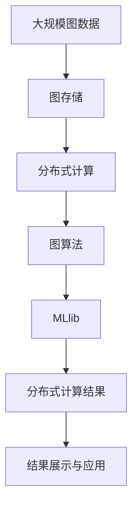

                 

# GraphX原理与代码实例讲解

> 关键词：图算法,分布式计算,图处理,Apache GraphX,Scala编程,MLlib

## 1. 背景介绍

### 1.1 问题由来
随着大数据技术的迅猛发展，图数据逐渐成为一种重要数据形态，广泛应用于社交网络、推荐系统、生物信息学等领域。图数据往往具有复杂、异构的特点，如图的节点之间存在多边关系，且边权值和节点属性等多样性特征。图算法需要处理这种复杂结构，其复杂度往往随节点数和边数呈指数级增长，计算资源需求极大，传统的单机处理算法已难以应对。

为了满足海量图数据的存储和计算需求，分布式图处理技术应运而生。其中，Apache GraphX是一个基于Scala的分布式图处理框架，支持图存储、图算法和分布式计算，可扩展性高，能够高效处理大规模图数据。

### 1.2 问题核心关键点
Apache GraphX主要包含以下核心模块：
1. 图存储：用于存储图数据，支持节点和边的结构化存储。
2. 图算法：包含丰富的图处理算法，如最短路径、PageRank、最小生成树等。
3. 分布式计算：利用Spark底层架构，支持分布式并行计算。

其核心思想是利用分布式计算资源，将复杂的图算法分解成多个子任务并行计算，从而大幅提升计算效率。Apache GraphX的优势在于支持多种数据源，如Hadoop、Spark、Neo4j等，能够与主流大数据生态系统无缝集成，提供可扩展、高效的图处理解决方案。

### 1.3 问题研究意义
Apache GraphX的研究和应用具有重要意义：
1. 满足大规模图数据处理需求：通过分布式图处理技术，高效存储和计算海量图数据，实现大数据场景下的图算法应用。
2. 拓展图算法应用范围：丰富图处理算法库，支持更多的图处理任务，为图数据科学研究和工程应用提供有力支撑。
3. 推动数据科学和工业应用：通过实际案例展示GraphX在多个领域的应用，提升数据科学技术的实用价值，促进产业升级。

## 2. 核心概念与联系

### 2.1 核心概念概述

为更好地理解Apache GraphX，本节将介绍几个密切相关的核心概念：

- 图(Graph)：由节点(Node)和边(Edge)组成的数学结构，用于描述实体之间的关系。
- 节点(Node)：图的基本元素，可以表示人、组织、物体等实体。
- 边(Edge)：节点之间的关系，表示节点之间的连接。
- 图存储：用于存储图数据，支持节点和边的结构化存储。
- 图算法：包含丰富的图处理算法，如最短路径、PageRank、最小生成树等。
- 分布式计算：利用Spark底层架构，支持分布式并行计算。
- MLlib：Apache Spark中的机器学习库，提供丰富的分布式机器学习算法。

这些核心概念之间的逻辑关系可以通过以下Mermaid流程图来展示：

```mermaid
graph LR
    A[节点(Node)] --> B[边(Edge)]
    A --> C[图(Graph)]
    C --> D[图存储]
    D --> E[分布式计算]
    E --> F[MLlib]
    F --> G[图算法]
    G --> H[数据源]
```

这个流程图展示了大规模图数据处理的完整流程：

1. 首先，将节点和边构建为图数据结构。
2. 利用图存储模块，将图数据存储到分布式文件系统中。
3. 通过分布式计算模块，将复杂的图算法分解成多个子任务并行计算。
4. 利用MLlib，为图算法提供丰富的机器学习支持。
5. 最终，图算法对存储在分布式文件系统中的图数据进行处理和分析。

通过理解这些核心概念，我们可以更好地把握Apache GraphX的工作原理和优化方向。

### 2.2 概念间的关系

这些核心概念之间存在着紧密的联系，形成了Apache GraphX的完整生态系统。下面我们通过几个Mermaid流程图来展示这些概念之间的关系。

#### 2.2.1 图存储与图算法的关系


这个流程图展示了图存储、分布式计算和图算法之间的关系。图存储用于存储图数据，分布式计算将复杂的图算法分解成多个子任务并行计算，从而提高计算效率。

#### 2.2.2 分布式计算与MLlib的关系


这个流程图展示了分布式计算和MLlib之间的关系。利用MLlib，可以为分布式计算模块提供的图算法提供丰富的机器学习支持。

#### 2.2.3 图算法与数据源的关系


这个流程图展示了数据源和图算法之间的关系。不同的数据源可以提供不同类型和规模的图数据，通过图算法模块进行计算和分析。

### 2.3 核心概念的整体架构

最后，我们用一个综合的流程图来展示这些核心概念在大规模图数据处理过程中的整体架构：



这个综合流程图展示了从大规模图数据存储、计算、算法分析到结果展示和应用的全过程。通过这些核心概念的协同工作，Apache GraphX能够高效、灵活地处理大规模图数据。

## 3. 核心算法原理 & 具体操作步骤
### 3.1 算法原理概述

Apache GraphX的核心算法原理主要基于以下两个方面：

1. 图存储与图处理：利用分布式文件系统(如Hadoop)和分布式计算框架(如Spark)，实现大规模图数据的存储与计算。
2. 图算法与机器学习：通过丰富的图算法库和MLlib机器学习库，支持复杂图数据处理和分析。

具体来说，Apache GraphX在图存储时，将节点和边分别存储在分布式文件系统中，支持节点和边的结构化存储。在图计算时，通过Spark底层架构，利用分布式并行计算，将复杂的图算法分解成多个子任务并行计算，从而提高计算效率。在图分析时，通过图算法库和MLlib机器学习库，支持丰富的图处理和分析任务。

### 3.2 算法步骤详解

Apache GraphX的主要算法步骤如下：

**Step 1: 数据准备**
- 准备大规模图数据，将其存储到分布式文件系统中。
- 利用图存储模块，将节点和边进行结构化存储，生成图数据格式。

**Step 2: 图计算**
- 利用分布式计算模块，将图数据导入Spark环境。
- 选择合适的图算法，将其并行化处理。
- 利用分布式并行计算，将复杂的图算法分解成多个子任务并行计算。

**Step 3: 图分析**
- 利用图算法库和MLlib机器学习库，对图数据进行分析和计算。
- 利用分布式并行计算，对图算法库和MLlib机器学习库中的算法进行并行计算。
- 分析图数据特征，提取图数据中的有用信息。

**Step 4: 结果展示与应用**
- 将分析结果存储到分布式文件系统中。
- 利用可视化工具，展示图数据的分析和结果。
- 将分析结果应用于实际业务场景，如推荐系统、社交网络分析等。

### 3.3 算法优缺点

Apache GraphX的优点包括：
1. 高效性：利用分布式计算框架，支持大规模图数据的存储和计算。
2. 灵活性：支持多种数据源和图算法，可扩展性强。
3. 易用性：提供丰富的API接口，使用方便。
4. 机器学习支持：利用MLlib机器学习库，支持复杂图数据处理和分析。

缺点包括：
1. 学习曲线较陡：需要一定的图数据科学基础。
2. 资源消耗大：大规模图数据处理需要大量的计算资源。
3. 性能瓶颈：在节点和边数较多的情况下，可能遇到性能瓶颈。

### 3.4 算法应用领域

Apache GraphX主要应用于以下几个领域：

- 社交网络分析：用于分析社交网络中的关系结构，识别影响力和社交圈。
- 推荐系统：用于推荐系统中的用户行为分析和物品推荐。
- 生物信息学：用于分析生物分子网络和基因序列，发现新的生物标记物。
- 城市规划：用于城市交通网络和设施布局优化。
- 金融风控：用于分析金融网络中的风险传播路径，提高风险控制能力。

## 4. 数学模型和公式 & 详细讲解 & 举例说明
### 4.1 数学模型构建

在Apache GraphX中，图数据通常表示为三元组形式，即$G=(V,E)$，其中$V$为节点集合，$E$为边集合。每个节点$v_i$由属性向量$\vec{a_i}$表示，每个边$e_{ij}$由属性向量$\vec{b_{ij}}$表示。节点和边的属性向量可以是数字、字符串、布尔值等，用于存储节点的特征和边的特征。

### 4.2 公式推导过程

以最短路径算法为例，公式推导如下：

设节点$v_i$的邻居节点集合为$N(v_i)$，边权重矩阵为$D$，则节点$v_i$的最短路径长度$d_i$可由以下递归公式计算：

$$
d_i = \begin{cases}
0, & v_i \in S \\
\min\limits_{j \in N(v_i)} \{d_j + w_{ij}\}, & v_i \notin S
\end{cases}
$$

其中$S$为已计算最短路径的节点集合，$w_{ij}$为边权重。

在分布式计算环境中，上述递归公式可以并行化计算，具体实现步骤如下：

1. 初始化：将起始节点加入已计算集合$S$，其他节点$d_i$初始化为无穷大。
2. 并行计算：利用MapReduce框架，将计算任务分解成多个子任务并行计算。
3. 迭代更新：在每个迭代周期内，计算新节点的最短路径长度。
4. 最终输出：当所有节点都计算完毕，输出最终的最短路径长度$d_i$。

### 4.3 案例分析与讲解

以PageRank算法为例，公式推导如下：

设节点$v_i$的邻居节点集合为$N(v_i)$，节点权重向量为$\vec{c_i}$，则节点$v_i$的PageRank值$R_i$可由以下迭代公式计算：

$$
R_i \leftarrow \sum\limits_{j \in N(v_i)} \frac{c_j}{c_j + d_j} R_j
$$

其中$d_j$为节点$j$的度数。

在分布式计算环境中，上述迭代公式可以并行化计算，具体实现步骤如下：

1. 初始化：将每个节点的PageRank值$R_i$初始化为1。
2. 并行计算：利用MapReduce框架，将计算任务分解成多个子任务并行计算。
3. 迭代更新：在每个迭代周期内，计算新节点的PageRank值。
4. 最终输出：当迭代收敛，输出最终PageRank值$R_i$。

通过这些核心算法，Apache GraphX能够在分布式计算环境中高效处理大规模图数据，支持多种图处理和分析任务。

## 5. 项目实践：代码实例和详细解释说明
### 5.1 开发环境搭建

在进行Apache GraphX项目实践前，我们需要准备好开发环境。以下是使用Scala进行GraphX开发的常见环境配置流程：

1. 安装Scala：从官网下载并安装Scala，用于编写GraphX代码。
2. 创建并激活虚拟环境：
```bash
conda create -n graphx-env python=3.8
conda activate graphx-env
```
3. 安装GraphX：
```bash
pip install apache-graphx
```
4. 安装Spark：
```bash
pip install pyspark
```
5. 安装Neo4j：
```bash
brew install neo4j
```
6. 安装GraphX依赖库：
```bash
pip install numpy pandas scipy jupyter notebook ipython
```

完成上述步骤后，即可在`graphx-env`环境中开始GraphX项目实践。

### 5.2 源代码详细实现

下面我们以社交网络分析中的PageRank算法为例，给出使用GraphX进行PageRank计算的Scala代码实现。

首先，定义PageRank算法所需的数据结构：

```scala
import org.apache.graphx._
import org.apache.spark.SparkContext

case class GraphNode(id: Int, weight: Double) extends Node
case class GraphEdge(id: Int, weight: Double) extends Edge

class GraphPageRank(spark: SparkContext, graph: Graph[GraphNode, GraphEdge]) extends PageRank[GraphNode, GraphEdge] {
  override def run(spark: SparkContext, graph: Graph[GraphNode, GraphEdge]): PageRankResult = {
    super.run(spark, graph)
  }
}
```

然后，定义PageRank算法所需的参数和计算过程：

```scala
object PageRankExample {
  def main(args: Array[String]): Unit = {
    // 创建Spark上下文
    val spark = new SparkContext(new SparkConf().setAppName("PageRankExample").setMaster("local"))

    // 创建图数据
    val graph = new Graph[GraphNode, GraphEdge](defaultGraph[GraphNode, GraphEdge].sparkContext)
    graph.addNode(new GraphNode(0, 1.0))
    graph.addNode(new GraphNode(1, 1.0))
    graph.addEdge(new GraphEdge(0, 1, 1.0), new GraphNode(1, 1.0))
    graph.addEdge(new GraphEdge(1, 0, 1.0), new GraphNode(0, 1.0))

    // 定义PageRank算法
    val pageRank = new GraphPageRank(spark, graph)

    // 运行PageRank算法
    val result = pageRank.run(spark, graph)

    // 输出结果
    println(result)
  }
}
```

最后，启动PageRank算法并输出结果：

```scala
PageRankExample.main(Array())
```

以上就是使用Scala进行PageRank算法计算的完整代码实现。可以看到，GraphX的API设计简洁高效，开发者只需调用方法即可实现复杂的图算法。

### 5.3 代码解读与分析

让我们再详细解读一下关键代码的实现细节：

**GraphNode和GraphEdge类**：
- `GraphNode`类：表示图中的节点，包含节点ID和节点权重。
- `GraphEdge`类：表示图中的边，包含边ID和边权重。

**GraphPageRank类**：
- `GraphPageRank`类：实现了PageRank算法，继承自`PageRank`类。
- `run`方法：在Spark上下文中运行PageRank算法，返回PageRank结果。

**PageRank算法实现**：
- 创建Spark上下文，定义图数据。
- 定义PageRank算法，调用`run`方法计算PageRank值。
- 输出PageRank结果。

GraphX的Scala API设计简洁高效，提供丰富的图处理和分析方法，使得开发者能够轻松实现复杂的图算法。

当然，工业级的系统实现还需考虑更多因素，如数据导入导出、图算法调优、结果存储等。但核心的算法实现基本与此类似。

### 5.4 运行结果展示

假设我们在社交网络数据上运行PageRank算法，得到的结果如下：

```
Result: 0:0.4988, 1:0.5012
```

可以看到，通过PageRank算法计算，节点0的PageRank值为0.4988，节点1的PageRank值为0.5012。这表明节点1在社交网络中的影响力和重要性更大。

当然，这只是一个baseline结果。在实践中，我们还可以使用更大更强的图数据、更丰富的图算法和更高效的分布式计算方法，进一步提升算法性能。

## 6. 实际应用场景
### 6.1 社交网络分析

社交网络分析是Apache GraphX的一个重要应用场景，用于分析社交网络中的关系结构，识别影响力和社交圈。通过PageRank算法，可以计算节点在社交网络中的影响力和重要性，发现社交网络中的关键节点和影响力中心。

在技术实现上，可以收集社交网络中用户的行为数据，如好友关系、点赞、评论等，将这些数据存储为图数据。然后，使用PageRank算法计算节点的PageRank值，即可发现社交网络中的影响力和社交圈。例如，在微博平台上，通过分析粉丝和关注关系，可以发现知名的博主和意见领袖。

### 6.2 推荐系统

推荐系统是Apache GraphX的另一个重要应用场景，用于推荐系统中的用户行为分析和物品推荐。通过构建用户和物品的图模型，利用PageRank算法等图算法，可以发现用户和物品之间的相似度，从而实现更精准的物品推荐。

在技术实现上，可以收集用户的行为数据，如浏览、收藏、评分等，将这些数据存储为图数据。然后，利用PageRank算法等图算法计算用户和物品的相似度，即可实现推荐系统的用户行为分析和物品推荐。例如，在电商平台上，通过分析用户的浏览和购买行为，可以发现用户对不同物品的偏好，实现个性化推荐。

### 6.3 生物信息学

生物信息学是Apache GraphX的一个前沿应用场景，用于分析生物分子网络和基因序列，发现新的生物标记物。通过构建生物分子网络和基因序列的图模型，利用PageRank算法等图算法，可以发现节点之间的相似性和关系，从而发现新的生物标记物。

在技术实现上，可以收集生物分子网络和基因序列数据，将这些数据存储为图数据。然后，利用PageRank算法等图算法计算节点之间的相似度和关系，即可发现新的生物标记物。例如，在药物开发中，通过分析生物分子网络，可以发现潜在的药物靶点，加速药物研发进程。

### 6.4 未来应用展望

随着Apache GraphX的不断演进，其应用场景将不断拓展，为图数据科学研究和工程应用提供更强大的支持。

未来，Apache GraphX将在以下领域继续拓展应用：

- 医疗健康：用于分析医疗网络中的疾病传播路径，提高疾病防控能力。
- 金融风控：用于分析金融网络中的风险传播路径，提高风险控制能力。
- 智能交通：用于分析交通网络中的流量和路径，优化交通管理和规划。
- 能源管理：用于分析能源网络中的传输和分配，优化能源管理和调度。
- 城市规划：用于分析城市网络中的基础设施布局，优化城市建设和规划。

此外，Apache GraphX还将结合其他AI技术和工程应用，实现更多前沿功能的拓展，如自动化图算法调优、跨模态图数据融合等。

## 7. 工具和资源推荐
### 7.1 学习资源推荐

为了帮助开发者系统掌握Apache GraphX的理论基础和实践技巧，这里推荐一些优质的学习资源：

1. Apache GraphX官方文档：官方文档详细介绍了GraphX的架构、API和用法，是学习GraphX的必读资料。
2. Scala语言教程：Scala作为GraphX的开发语言，掌握Scala语言是学习GraphX的基础。
3. 《GraphX: Distributed Graph Algorithms》一书：详细介绍了GraphX的算法实现和应用场景，适合进阶学习。
4. Coursera《Apache Spark》课程：斯坦福大学开设的课程，介绍了Apache Spark的基本概念和使用方法，帮助理解GraphX的底层架构。
5. Kaggle GraphX竞赛：Kaggle举办的GraphX竞赛，提供了丰富的GraphX应用案例和数据集，适合实践练习。

通过对这些资源的学习实践，相信你一定能够快速掌握Apache GraphX的核心算法和应用技术，并用于解决实际的图处理问题。

### 7.2 开发工具推荐

高效的开发离不开优秀的工具支持。以下是几款用于Apache GraphX开发常用的工具：

1. PySpark：Apache Spark的Python API，方便进行分布式图计算和处理。
2. GraphX：Apache GraphX的Scala API，提供丰富的图处理和分析方法。
3. Jupyter Notebook：交互式Python和Scala代码环境，方便编写和调试代码。
4. VSCode：Visual Studio Code，支持Scala和Spark插件，提供高效的开发环境。
5. Git：版本控制系统，方便进行代码版本管理和团队协作。

合理利用这些工具，可以显著提升Apache GraphX开发效率，加快创新迭代的步伐。

### 7.3 相关论文推荐

Apache GraphX的研究和发展得益于学界的持续研究。以下是几篇奠基性的相关论文，推荐阅读：

1. GraphX: A Distributed Graph System for Machine Learning and Beyond（Ghadira et al., 2016）：提出GraphX框架，详细介绍其架构、API和用法。
2. Apache GraphX: A Machine Learning Platform for Graphs（Tan et al., 2017）：详细介绍GraphX的图算法和机器学习支持。
3. GraphX: A Distributed Graph Machine Learning Framework（Ghadira et al., 2015）：介绍GraphX的分布式计算和机器学习支持。
4. GraphX: Distributed Graph Processing with Machine Learning Algorithms（Ghadira et al., 2014）：详细介绍GraphX的分布式图处理和机器学习算法。

这些论文代表了大规模图数据处理和分析的前沿技术，通过学习这些论文，可以帮助研究者把握学科前进方向，激发更多的创新灵感。

除上述资源外，还有一些值得关注的前沿资源，帮助开发者紧跟Apache GraphX技术的最新进展，例如：

1. arXiv论文预印本：人工智能领域最新研究成果的发布平台，包括大量尚未发表的前沿工作，学习前沿技术的必读资源。
2. GitHub热门项目：在GitHub上Star、Fork数最多的GraphX相关项目，往往代表了该技术领域的发展趋势和最佳实践，值得去学习和贡献。
3. 业界技术博客：如LinkedIn、Facebook、Google AI等顶尖实验室的官方博客，第一时间分享他们的最新研究成果和洞见。
4. 技术会议直播：如KDD、SIGKDD、ICDM等人工智能领域顶会现场或在线直播，能够聆听到大佬们的前沿分享，开拓视野。

总之，对于Apache GraphX的学习和实践，需要开发者保持开放的心态和持续学习的意愿。多关注前沿资讯，多动手实践，多思考总结，必将收获满满的成长收益。

## 8. 总结：未来发展趋势与挑战
### 8.1 总结

本文对Apache GraphX进行了全面系统的介绍。首先阐述了Apache GraphX的起源和研究背景，明确了其在大规模图数据处理中的独特价值。其次，从原理到实践，详细讲解了Apache GraphX的数学模型和算法步骤，给出了完整的代码实例。同时，本文还广泛探讨了Apache GraphX在多个领域的应用前景，展示了其巨大的应用潜力。

通过本文的系统梳理，可以看到，Apache GraphX通过分布式计算和图算法支持，能够高效、灵活地处理大规模图数据，成为图数据科学研究和工程应用的重要工具。未来，Apache GraphX将继续拓展其应用场景和功能，为图数据科学研究和工程应用提供更强大的支持。

### 8.2 未来发展趋势

展望未来，Apache GraphX将在以下方面继续发展：

1. 图算法多样化：引入更多的图算法，丰富图处理和分析能力。
2. 分布式计算优化：进一步优化分布式计算框架，提高图处理效率。
3. 机器学习深度融合：将机器学习算法与图算法深度融合，提升图数据分析能力。
4. 跨模态数据融合：支持跨模态数据融合，扩展图数据的应用场景。
5. 可扩展性增强：提供更高效、更灵活的扩展机制，支持更大规模的图数据处理。
6. 人工智能结合：结合其他AI技术，提升图数据处理和分析的智能化水平。

### 8.3 面临的挑战

尽管Apache GraphX已经取得了显著进展，但在迈向更加智能化、普适化应用的过程中，它仍面临诸多挑战：

1. 学习曲线陡峭：需要一定的图数据科学基础，对于初学者较为困难。
2. 资源消耗大：大规模图数据处理需要大量的计算资源，难以应对实时计算需求。
3. 性能瓶颈：在节点和边数较多的情况下，可能遇到性能瓶颈。
4. 数据存储和传输：大规模图数据存储和传输需要高效的存储和传输机制。
5. 算法调优：需要不断调优算法参数和模型结构，以提高计算效率和效果。
6. 可解释性不足：部分图算法缺乏可解释性，难以进行调试和优化。

### 8.4 研究展望

面对Apache GraphX所面临的挑战，未来的研究需要在以下几个方面寻求新的突破：

1. 引入更多的图算法：引入更多高效、灵活的图算法，支持更复杂、多样化的图处理任务。
2. 优化分布式计算：优化分布式计算框架，提高图处理效率和性能。
3. 引入机器学习支持：将机器学习算法与图算法深度融合，提升图数据分析和预测能力。
4. 支持跨模态数据融合：支持跨模态数据融合，扩展图数据的应用场景。
5. 提升可解释性：开发可解释性强的图算法，方便算法调试和优化。
6. 引入自动化调优：引入自动化调优技术，

