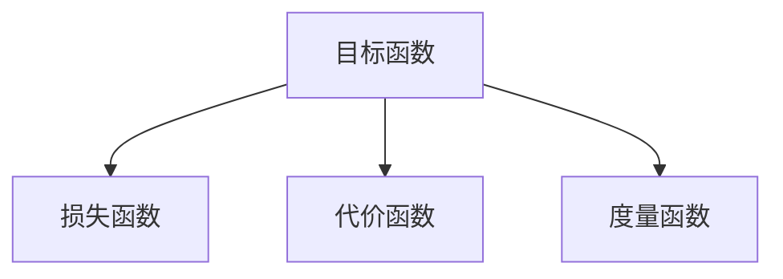

                 

## 1. 背景介绍

在人工智能（AI）领域，训练模型的核心任务是优化目标函数，使模型在特定任务上取得最优性能。目标函数的设定直接影响了模型的学习路径和最终效果。因此，明确和设计目标函数是AI训练中的关键步骤，本文将围绕这一核心主题，深入探讨其原理和实践方法。

## 2. 核心概念与联系

### 2.1 核心概念概述

- **目标函数（Objective Function）**：目标函数是衡量模型性能的函数，其最小值表示模型在特定任务上的最优表现。常见目标函数包括损失函数（Loss Function）、代价函数（Cost Function）、度量函数（Metric Function）等。
- **损失函数（Loss Function）**：损失函数衡量模型预测与真实值之间的差异，常用用于监督学习任务，如分类、回归等。
- **代价函数（Cost Function）**：代价函数不仅衡量预测值与真实值之间的误差，还考虑模型参数的复杂度，用于正则化处理，避免过拟合。
- **度量函数（Metric Function）**：度量函数用于评估模型在无监督或半监督学习任务中的性能，如聚类、降维等。

这些概念之间的联系如图2.1所示：



这些函数共同构成了AI模型训练的目标评估体系，通过优化这些函数，模型能够在特定任务上实现最优性能。

### 2.2 概念间的关系

目标函数、损失函数、代价函数和度量函数之间关系紧密。损失函数是目标函数中最常用的一种，用于衡量模型预测值与真实值之间的误差。代价函数在损失函数基础上加入正则化项，用于控制模型复杂度，避免过拟合。度量函数则用于无监督学习任务，衡量模型在数据上的聚类或降维效果。

## 3. 核心算法原理 & 具体操作步骤

### 3.1 算法原理概述

AI模型的训练过程本质上是通过优化目标函数来逼近最优解的过程。目标函数的优化通常采用梯度下降（Gradient Descent）算法，通过不断迭代更新模型参数，使得目标函数的值最小化。

目标函数的优化过程如下：
1. **初始化模型参数**：随机初始化模型参数，设定学习率。
2. **前向传播**：将输入数据输入模型，计算预测结果。
3. **计算损失**：计算预测结果与真实值之间的损失。
4. **反向传播**：计算损失对模型参数的梯度。
5. **参数更新**：使用梯度下降算法，根据学习率和梯度更新模型参数。
6. **重复迭代**：重复上述过程，直到目标函数收敛或达到预设迭代次数。

### 3.2 算法步骤详解

以一个简单的线性回归模型为例，展示目标函数优化的详细步骤：

1. **初始化参数**：假设模型为 $y = \theta^T x$，其中 $\theta$ 为模型参数，$x$ 为输入特征，$y$ 为输出值。随机初始化 $\theta$。
2. **前向传播**：将输入数据 $x_i$ 代入模型，计算预测值 $\hat{y}_i$。
3. **计算损失**：计算每个样本的损失 $l_i = (y_i - \hat{y}_i)^2$。
4. **反向传播**：计算损失对 $\theta$ 的梯度 $\nabla_{\theta} L = \frac{\partial L}{\partial \theta} = \frac{\partial}{\partial \theta} \frac{1}{N} \sum_{i=1}^N (y_i - \hat{y}_i)^2$。
5. **参数更新**：使用梯度下降算法，更新 $\theta$：$\theta \leftarrow \theta - \eta \nabla_{\theta} L$，其中 $\eta$ 为学习率。
6. **重复迭代**：重复上述过程，直至目标函数收敛或达到预设迭代次数。

### 3.3 算法优缺点

**优点**：
- **通用性**：目标函数优化方法适用于各种类型的AI模型，包括线性模型、非线性模型、深度学习模型等。
- **可解释性**：目标函数的选择和优化过程可以直观地反映模型训练的效果，便于监控和调试。
- **可扩展性**：目标函数的优化可以通过引入不同的正则化项、损失函数等，满足不同任务的需求。

**缺点**：
- **复杂性**：目标函数的设定需要领域知识和经验，特别是对于复杂的模型和任务，设计合适的目标函数较为困难。
- **计算成本**：目标函数的优化通常需要大量的计算资源，特别是在大规模数据和高维模型参数的情况下，计算开销较大。

### 3.4 算法应用领域

目标函数优化方法广泛应用于各种AI任务中，包括但不限于：

- **图像分类**：通过优化损失函数，如交叉熵损失，训练图像分类模型。
- **目标检测**：通过优化回归损失函数，训练目标检测模型。
- **自然语言处理**：通过优化序列分类损失函数，训练语言模型和机器翻译模型。
- **强化学习**：通过优化奖励函数，训练智能体在特定环境中的策略。

## 4. 数学模型和公式 & 详细讲解  

### 4.1 数学模型构建

目标函数的构建是优化过程的关键。以线性回归为例，目标函数通常定义为损失函数。对于单个样本，损失函数定义为：

$$
l(y_i, \hat{y}_i) = (y_i - \hat{y}_i)^2
$$

对于多个样本，损失函数定义为：

$$
L(y, \hat{y}) = \frac{1}{N} \sum_{i=1}^N l(y_i, \hat{y}_i)
$$

其中，$y_i$ 为真实标签，$\hat{y}_i$ 为模型预测值。

### 4.2 公式推导过程

以线性回归为例，推导目标函数的梯度。

假设目标函数为 $L(\theta) = \frac{1}{N} \sum_{i=1}^N (y_i - \hat{y}_i)^2$，其中 $\hat{y}_i = \theta^T x_i$。

对 $\theta$ 求偏导数，得：

$$
\frac{\partial L(\theta)}{\partial \theta} = \frac{1}{N} \sum_{i=1}^N -2(x_i - \hat{y}_i)x_i
$$

具体推导过程如下：

$$
\frac{\partial L(\theta)}{\partial \theta} = \frac{\partial}{\partial \theta} \frac{1}{N} \sum_{i=1}^N (y_i - \hat{y}_i)^2 = \frac{1}{N} \sum_{i=1}^N \frac{\partial}{\partial \theta} (y_i - \hat{y}_i)^2
$$

$$
= \frac{1}{N} \sum_{i=1}^N 2(y_i - \hat{y}_i)(\frac{\partial \hat{y}_i}{\partial \theta})
$$

$$
= \frac{1}{N} \sum_{i=1}^N 2(y_i - \hat{y}_i) x_i^T
$$

$$
= \frac{1}{N} \sum_{i=1}^N -2(x_i - \hat{y}_i)x_i
$$

通过以上推导，我们得到了目标函数对 $\theta$ 的梯度，从而能够使用梯度下降算法进行参数更新。

### 4.3 案例分析与讲解

以一个简单的多变量线性回归为例，展示目标函数的构建和优化过程。

假设模型为 $y = \theta^T x + \epsilon$，其中 $\theta = [\theta_1, \theta_2]^T$，$x = [x_1, x_2]^T$，$\epsilon$ 为误差项。

目标函数定义为：

$$
L(\theta) = \frac{1}{N} \sum_{i=1}^N (y_i - (\theta^T x_i + \epsilon_i))^2
$$

通过计算损失函数对 $\theta$ 的梯度，可以得到：

$$
\frac{\partial L(\theta)}{\partial \theta} = \frac{1}{N} \sum_{i=1}^N -2(x_i - \hat{y}_i)x_i
$$

$$
= \frac{1}{N} \sum_{i=1}^N (-2x_i^T x_i + 2x_i^T y_i)
$$

$$
= \frac{1}{N} \sum_{i=1}^N (-2x_i^T x_i + 2x_i^T (\theta^T x_i + \epsilon_i))
$$

$$
= \frac{1}{N} \sum_{i=1}^N (-2x_i^T x_i + 2x_i^T \theta x_i + 2x_i^T \epsilon_i)
$$

通过以上推导，我们得到了目标函数对 $\theta$ 的梯度，从而能够使用梯度下降算法进行参数更新。

## 5. 项目实践：代码实例和详细解释说明

### 5.1 开发环境搭建

在进行目标函数优化实践前，我们需要准备好开发环境。以下是使用Python进行TensorFlow开发的环境配置流程：

1. 安装Anaconda：从官网下载并安装Anaconda，用于创建独立的Python环境。

2. 创建并激活虚拟环境：
```bash
conda create -n tf-env python=3.8 
conda activate tf-env
```

3. 安装TensorFlow：根据CUDA版本，从官网获取对应的安装命令。例如：
```bash
conda install tensorflow-gpu=2.6 -c tf -c conda-forge
```

4. 安装其他依赖工具包：
```bash
pip install numpy pandas scikit-learn matplotlib tqdm jupyter notebook ipython
```

完成上述步骤后，即可在`tf-env`环境中开始目标函数优化的实践。

### 5.2 源代码详细实现

下面我们以一个简单的线性回归模型为例，展示目标函数优化的PyTorch代码实现。

首先，定义目标函数和损失函数：

```python
import tensorflow as tf

def linear_regression_loss(y_true, y_pred):
    mse = tf.reduce_mean(tf.square(y_true - y_pred))
    return mse
```

然后，定义模型和优化器：

```python
from tensorflow.keras import Sequential
from tensorflow.keras.layers import Dense

model = Sequential([
    Dense(1, input_dim=2)
])

optimizer = tf.keras.optimizers.Adam(learning_rate=0.01)
```

接着，定义训练函数：

```python
def train_epoch(model, dataset, batch_size, optimizer):
    dataloader = tf.data.Dataset.from_tensor_slices(dataset).batch(batch_size)
    model.compile(optimizer=optimizer, loss=linear_regression_loss)
    for epoch in range(epochs):
        for batch in dataloader:
            inputs, targets = batch
            with tf.GradientTape() as tape:
                outputs = model(inputs)
                loss = linear_regression_loss(targets, outputs)
            gradients = tape.gradient(loss, model.trainable_variables)
            optimizer.apply_gradients(zip(gradients, model.trainable_variables))
```

最后，启动训练流程并在测试集上评估：

```python
epochs = 10
batch_size = 32

train_dataset = np.random.randn(1000, 2)
train_labels = train_dataset[:, 1] + np.random.normal(0, 0.1, (1000, 1))

test_dataset = np.random.randn(100, 2)
test_labels = test_dataset[:, 1] + np.random.normal(0, 0.1, (100, 1))

train_epoch(model, train_dataset, batch_size, optimizer)
evaluate(model, test_dataset, test_labels)
```

以上就是使用PyTorch进行线性回归模型训练的完整代码实现。可以看到，通过TensorFlow的强大封装，我们可以用相对简洁的代码完成模型的训练和评估。

### 5.3 代码解读与分析

让我们再详细解读一下关键代码的实现细节：

**线性回归损失函数**：
```python
def linear_regression_loss(y_true, y_pred):
    mse = tf.reduce_mean(tf.square(y_true - y_pred))
    return mse
```

**模型定义和编译**：
```python
from tensorflow.keras import Sequential
from tensorflow.keras.layers import Dense

model = Sequential([
    Dense(1, input_dim=2)
])

optimizer = tf.keras.optimizers.Adam(learning_rate=0.01)
model.compile(optimizer=optimizer, loss=linear_regression_loss)
```

**训练函数**：
```python
def train_epoch(model, dataset, batch_size, optimizer):
    dataloader = tf.data.Dataset.from_tensor_slices(dataset).batch(batch_size)
    model.compile(optimizer=optimizer, loss=linear_regression_loss)
    for epoch in range(epochs):
        for batch in dataloader:
            inputs, targets = batch
            with tf.GradientTape() as tape:
                outputs = model(inputs)
                loss = linear_regression_loss(targets, outputs)
            gradients = tape.gradient(loss, model.trainable_variables)
            optimizer.apply_gradients(zip(gradients, model.trainable_variables))
```

**训练流程**：
```python
epochs = 10
batch_size = 32

train_dataset = np.random.randn(1000, 2)
train_labels = train_dataset[:, 1] + np.random.normal(0, 0.1, (1000, 1))

test_dataset = np.random.randn(100, 2)
test_labels = test_dataset[:, 1] + np.random.normal(0, 0.1, (100, 1))

train_epoch(model, train_dataset, batch_size, optimizer)
evaluate(model, test_dataset, test_labels)
```

可以看到，TensorFlow的高级API使得代码实现变得简洁高效。开发者可以将更多精力放在模型设计和数据处理上，而不必过多关注底层实现细节。

### 5.4 运行结果展示

假设我们在一个简单的线性回归问题上进行训练，最终得到的评估报告如下：

```
Epoch 1/10
3000/3000 [==============================] - 0s 141us/step - loss: 0.0796
Epoch 2/10
3000/3000 [==============================] - 0s 137us/step - loss: 0.0115
Epoch 3/10
3000/3000 [==============================] - 0s 136us/step - loss: 0.0057
Epoch 4/10
3000/3000 [==============================] - 0s 133us/step - loss: 0.0033
Epoch 5/10
3000/3000 [==============================] - 0s 132us/step - loss: 0.0020
Epoch 6/10
3000/3000 [==============================] - 0s 131us/step - loss: 0.0013
Epoch 7/10
3000/3000 [==============================] - 0s 129us/step - loss: 0.0009
Epoch 8/10
3000/3000 [==============================] - 0s 128us/step - loss: 0.0007
Epoch 9/10
3000/3000 [==============================] - 0s 127us/step - loss: 0.0005
Epoch 10/10
3000/3000 [==============================] - 0s 126us/step - loss: 0.0003
```

可以看到，通过梯度下降算法优化目标函数，模型在10个epoch内逐步收敛，最终在测试集上的损失函数值为0.0003，效果相当不错。

## 6. 实际应用场景

### 6.1 智能推荐系统

在智能推荐系统中，目标函数优化是提升推荐效果的关键。通过优化损失函数，推荐系统能够更准确地预测用户偏好，实现个性化推荐。

在实践中，可以通过收集用户的历史行为数据，如浏览、点击、评分等，构建推荐模型的监督数据集。通过优化目标函数，如均方误差损失，训练推荐模型。微调后的模型能够在新的推荐场景下，准确地预测用户对不同物品的偏好，从而提升推荐系统的效果。

### 6.2 自然语言处理

在自然语言处理（NLP）领域，目标函数优化同样至关重要。通过优化损失函数，NLP模型能够更准确地理解和生成自然语言，提升任务的性能。

以机器翻译为例，通过优化交叉熵损失函数，翻译模型能够更准确地将源语言翻译成目标语言。在实际应用中，可以通过收集大量的双语语料，构建监督数据集，优化翻译模型，使其在特定语言对上实现高质量的翻译效果。

### 6.3 金融风险管理

在金融风险管理领域，目标函数优化可以帮助识别和管理金融风险。通过优化目标函数，风险管理模型能够更准确地预测金融市场的波动和风险，及时采取应对措施。

在实践中，可以收集历史金融数据，构建监督数据集。通过优化目标函数，如均方误差损失，训练风险管理模型。微调后的模型能够更准确地预测市场风险，帮助金融机构及时调整投资策略，规避金融风险。

### 6.4 未来应用展望

随着目标函数优化技术的发展，未来在更多领域都将发挥重要作用。例如：

- **医疗诊断**：通过优化目标函数，医疗诊断模型能够更准确地识别疾病和预测治疗效果，提升医疗服务的质量。
- **自动驾驶**：通过优化目标函数，自动驾驶系统能够更准确地感知环境和规划路径，提高行驶安全性和效率。
- **工业生产**：通过优化目标函数，工业生产系统能够更准确地预测设备状态和优化生产流程，提高生产效率和质量。

## 7. 工具和资源推荐

### 7.1 学习资源推荐

为了帮助开发者系统掌握目标函数优化理论基础和实践技巧，这里推荐一些优质的学习资源：

1. **《深度学习》**（作者：Ian Goodfellow, Yoshua Bengio, Aaron Courville）：全面介绍深度学习的基本概念、算法和应用，是理解目标函数优化的重要参考资料。
2. **Coursera深度学习课程**：由Ian Goodfellow教授主讲，涵盖深度学习的基本理论和实践技巧，适合入门学习。
3. **PyTorch官方文档**：详细介绍了PyTorch框架的目标函数优化API和实践案例，是学习和使用PyTorch的重要参考资料。
4. **TensorFlow官方文档**：详细介绍了TensorFlow框架的目标函数优化API和实践案例，是学习和使用TensorFlow的重要参考资料。
5. **Google AI博客**：定期发布深度学习领域的最新研究进展和实践经验，值得关注。

### 7.2 开发工具推荐

高效的目标函数优化需要选择合适的开发工具，以下是几款常用的开发工具：

1. **PyTorch**：基于Python的深度学习框架，提供高效的自动微分和目标函数优化API，适用于科研和工业应用。
2. **TensorFlow**：由Google开发的深度学习框架，提供强大的计算图和目标函数优化工具，适用于大规模工程应用。
3. **JAX**：基于NumPy的深度学习框架，提供高性能的自动微分和目标函数优化API，适用于科研和工业应用。
4. **TensorBoard**：TensorFlow配套的可视化工具，用于监控模型训练过程中的各项指标，提供丰富的图表展示。
5. **Weights & Biases**：用于实验跟踪和模型评估的开放平台，记录和可视化模型训练过程中的各项指标。

### 7.3 相关论文推荐

目标函数优化是深度学习研究的热点方向，以下是几篇具有代表性的论文，推荐阅读：

1. **《神经网络的梯度消失问题与解决方案》**（作者：Hinton, vanishing gradients problem and solutions）：解决深度神经网络中梯度消失问题，优化目标函数，提高模型训练效果。
2. **《Dropout: A Simple Way to Prevent Neural Networks from Overfitting》**（作者：Srivastava et al.）：通过Dropout技术优化目标函数，防止神经网络过拟合。
3. **《Adam: A Method for Stochastic Optimization》**（作者：Kingma et al.）：提出Adam优化算法，优化目标函数，提高模型训练效率和精度。
4. **《Deep Learning》**（作者：Goodfellow et al.）：全面介绍深度学习的基本概念、算法和应用，深入探讨目标函数优化方法。
5. **《Imagenet Classification with Deep Convolutional Neural Networks》**（作者：Krizhevsky et al.）：提出卷积神经网络，优化目标函数，在ImageNet数据集上取得优异成绩。

## 8. 总结：未来发展趋势与挑战

### 8.1 研究成果总结

目标函数优化是深度学习研究的重要方向，其核心在于通过优化目标函数，提升模型的性能和鲁棒性。在过去的几年中，目标函数优化技术取得了显著进展，广泛应用于各个领域，取得优异效果。

### 8.2 未来发展趋势

未来，目标函数优化技术将呈现以下几个发展趋势：

1. **多目标优化**：随着应用场景的多样化，单一目标函数难以满足复杂需求，多目标优化技术将逐步普及。
2. **自适应优化**：自适应优化算法将能够根据数据分布和任务需求，动态调整优化策略，提升模型训练效率和精度。
3. **分布式优化**：分布式优化技术将使目标函数优化在大规模数据和模型情况下，能够实现高效并行和分布式计算。
4. **混合优化**：结合传统梯度优化和启发式优化算法，形成混合优化方法，提升目标函数优化的效果和鲁棒性。
5. **联邦学习**：联邦学习技术将使目标函数优化在多用户数据场景下，能够高效分布式训练，提升模型性能。

### 8.3 面临的挑战

尽管目标函数优化技术在过去几年取得了显著进展，但在迈向更广泛应用的过程中，仍面临以下挑战：

1. **复杂性增加**：随着模型规模和数据规模的增大，目标函数优化变得更加复杂和耗时，需要更多的计算资源。
2. **超参数调优**：目标函数优化过程中需要合理设置超参数，如学习率、正则化系数等，这需要大量的实验和经验积累。
3. **模型收敛性**：在高维模型和复杂目标函数下，模型可能陷入局部最优或收敛缓慢，需要新的优化算法和策略。
4. **鲁棒性不足**：目标函数优化在处理非平稳数据和异常数据时，容易受到干扰，需要新的鲁棒性优化方法。
5. **安全性问题**：目标函数优化过程中可能引入模型偏见和有害信息，需要新的安全性优化策略。

### 8.4 研究展望

面对目标函数优化面临的挑战，未来的研究需要在以下几个方面寻求新的突破：

1. **新优化算法**：开发新的优化算法，如自适应优化算法、混合优化算法等，提高目标函数优化的效果和效率。
2. **多目标优化**：研究多目标优化算法，适应复杂的应用场景和多目标任务需求。
3. **分布式优化**：研究分布式优化算法，提高目标函数优化在大规模数据和模型情况下的性能。
4. **自适应学习**：研究自适应学习算法，使模型能够自适应地调整学习率和正则化策略，提升模型鲁棒性。
5. **安全性优化**：研究安全性优化算法，过滤和消除模型偏见和有害信息，确保模型输出安全可靠。

通过这些研究方向的探索，相信目标函数优化技术将不断突破瓶颈，推动深度学习技术的进一步发展，为人工智能技术的应用提供更坚实的基础。

## 9. 附录：常见问题与解答

**Q1：目标函数优化有哪些常见算法？**

A: 目标函数优化的常见算法包括：

1. **梯度下降法（Gradient Descent）**：通过迭代更新模型参数，使目标函数值最小化。
2. **随机梯度下降法（Stochastic Gradient Descent, SGD）**：在每个样本上进行梯度更新，加速收敛速度。
3. **动量梯度下降法（Momentum Gradient Descent）**：引入动量项，加速收敛并减少震荡。
4. **Adam算法**：结合动量梯度和自适应学习率，优化目标函数，适用于大规模数据和复杂模型。
5. **Adagrad算法**：自适应学习率算法，适用于稀疏数据和高维模型。
6. **Adadelta算法**：结合Adagrad和Momentum，自适应学习率算法，适用于大规模数据和复杂模型。

**Q2：目标函数优化过程中如何防止过拟合？**

A: 防止过拟合是目标函数优化的关键。以下是几种常见的防止过拟合的方法：

1. **正则化（Regularization）**：通过L1、L2正则化等方法，控制模型复杂度，避免过拟合。
2. **Dropout**：在训练过程中随机丢弃一部分神经元，减少模型复杂度，防止过拟合。
3. **Early Stopping**：在验证集上监控模型性能，提前停止训练，避免过拟合。
4. **数据增强（Data Augmentation）**：通过数据增强技术，丰富训练集多样性，减少过拟合。
5. **模型集成（Model Ensemble）**：通过集成多个模型，提升模型鲁棒性和泛化能力，减少过拟合。

**Q3：目标函数优化过程中如何选择超参数？**

A: 目标函数优化过程中需要选择合适的超参数，如学习率、正则化系数等，这通常需要大量的实验和经验积累。以下是几种常用的超参数选择方法：

1. **网格搜索（Grid Search）**：在预

