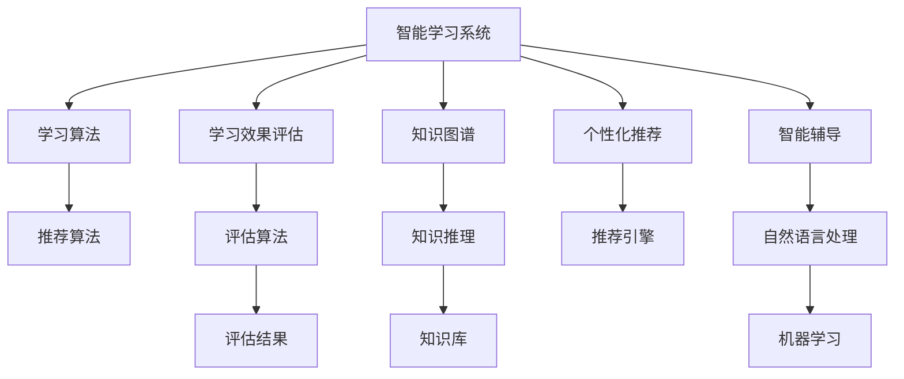
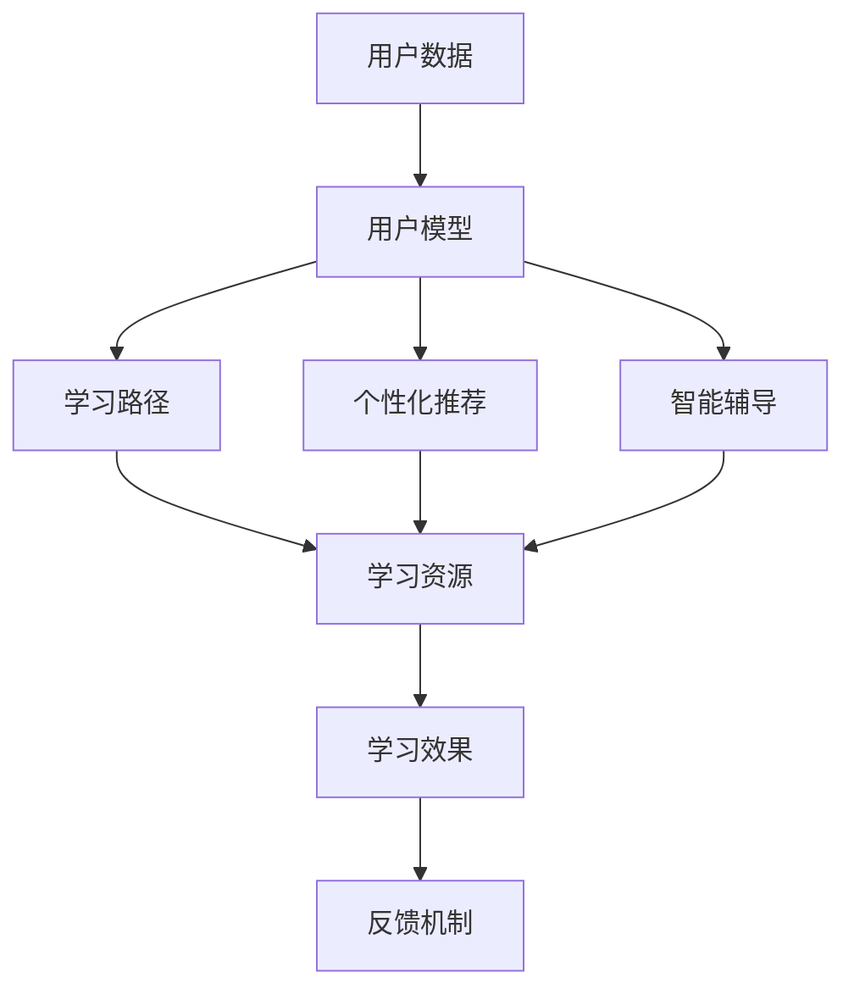
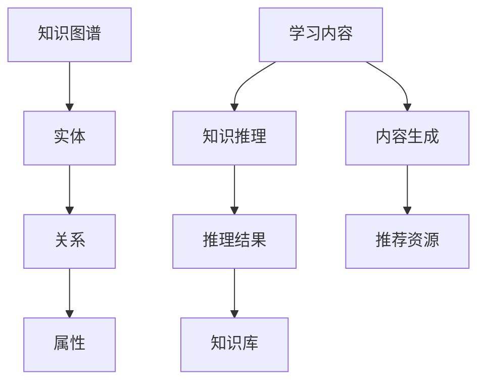
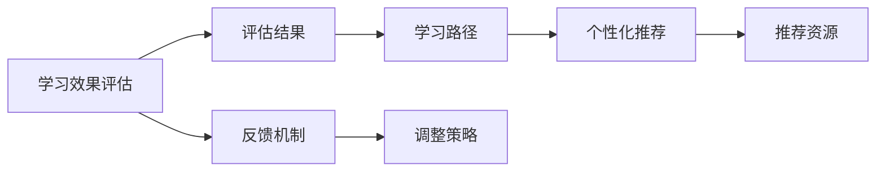
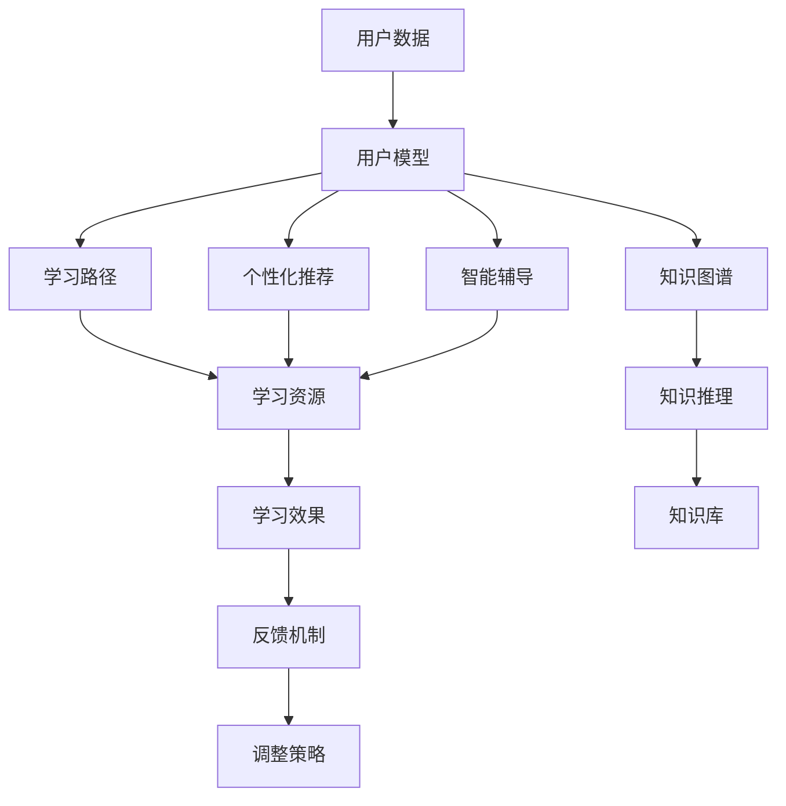

                 

# 智能学习系统学习功能的设计与实现

> 关键词：智能学习系统,学习功能设计,学习算法,学习效果评估,个性化推荐,知识图谱,知识推理,智能辅导

## 1. 背景介绍

### 1.1 问题由来
随着人工智能技术的快速发展，智能学习系统在教育领域的应用日益普及。这些系统通过深度学习、自然语言处理、知识图谱等技术手段，为学生提供个性化、多样化的学习体验，极大提升了学习效果。然而，在实际应用中，智能学习系统的学习功能设计和实现仍面临诸多挑战，如用户模型的构建、学习路径的优化、学习效果的评估等。这些问题直接影响到学习系统的可用性和用户满意度，因此亟需深入研究和解决。

### 1.2 问题核心关键点
智能学习系统的学习功能主要包括以下几个核心关键点：

- 用户模型构建：根据用户的学习行为和兴趣，构建个性化的用户模型，以指导学习路径和推荐内容。
- 学习路径优化：根据用户模型和学习目标，优化学习路径，提供个性化的学习体验。
- 学习效果评估：对用户的学习效果进行评估，及时发现学习问题并给予反馈。
- 个性化推荐：根据用户的学习进展和兴趣，推荐适合的学习资源和习题，提升学习效率。
- 知识图谱与知识推理：构建并利用知识图谱，通过知识推理技术，提升学习内容的系统性和准确性。
- 智能辅导：利用自然语言处理和机器学习技术，提供智能化的辅导和答疑服务。

这些关键点共同构成了智能学习系统的核心功能，需要通过科学的设计和实现来满足用户的学习需求。

### 1.3 问题研究意义
研究和优化智能学习系统的学习功能，对于提升教育质量、推动教育公平、加速教育智能化进程具有重要意义：

- 提升学习效果：通过个性化学习路径和资源推荐，增强学习针对性和有效性，提升学习效率和成果。
- 促进教育公平：利用智能学习系统的低成本、高效率，为更多学生提供高质量的教育资源，促进教育公平。
- 加速教育智能化：智能学习系统通过大数据分析和机器学习，实现教育内容和学习过程的智能化，加速教育转型升级。
- 推动科学研究：通过学习效果评估和智能辅导，积累教育数据和经验，推动教育科学研究的深入。
- 提供技术支撑：为其他智能化应用提供技术支撑和参考，如智能办公、智能决策等。

## 2. 核心概念与联系

### 2.1 核心概念概述

为更好地理解智能学习系统的学习功能设计和实现，本节将介绍几个密切相关的核心概念：

- 智能学习系统：基于人工智能技术的在线学习平台，通过深度学习、自然语言处理、知识图谱等技术手段，提供个性化、智能化的学习服务。
- 学习算法：用于对用户学习行为和知识掌握情况进行分析，从而提供个性化推荐和辅导的算法，包括推荐算法、协同过滤算法、深度学习算法等。
- 学习效果评估：对用户学习效果进行量化评估，如成绩、知识掌握情况、学习时间等，以指导后续学习和优化推荐。
- 个性化推荐：根据用户的学习兴趣和进展，推荐适合的学习资源和习题，提升学习效率。
- 知识图谱：由实体、关系和属性组成的知识网络，用于支持知识推理和内容生成。
- 知识推理：通过逻辑推理和计算推理，发现知识图谱中的关联关系，增强学习内容的系统性和准确性。
- 智能辅导：利用自然语言处理和机器学习技术，提供智能化的辅导和答疑服务。

这些核心概念之间的逻辑关系可以通过以下Mermaid流程图来展示：



这个流程图展示了一系列核心概念及其之间的关系：

1. 智能学习系统将用户数据作为输入，利用学习算法进行分析。
2. 学习效果评估对用户学习效果进行量化，提供反馈和优化建议。
3. 个性化推荐根据用户兴趣和进展，推荐适合的学习资源和习题。
4. 知识图谱为知识推理提供数据基础，增强学习内容的系统性和准确性。
5. 知识推理通过逻辑推理和计算推理，发现知识图谱中的关联关系。
6. 智能辅导利用自然语言处理和机器学习技术，提供个性化的辅导和答疑服务。

这些概念共同构成了智能学习系统的功能模块，通过相互协作实现用户的学习需求和目标。

### 2.2 概念间的关系

这些核心概念之间存在着紧密的联系，形成了智能学习系统的完整生态系统。下面我们通过几个Mermaid流程图来展示这些概念之间的关系。

#### 2.2.1 智能学习系统的核心架构



这个流程图展示了智能学习系统的核心架构，从用户数据到个性化推荐和智能辅导的整个过程：

1. 用户数据输入，构建用户模型。
2. 根据用户模型，优化学习路径，推荐学习资源。
3. 学习效果评估，反馈用户学习状态。
4. 根据学习效果，调整推荐和辅导策略。

#### 2.2.2 知识图谱和知识推理的关系



这个流程图展示了知识图谱和知识推理的关系，以及其对学习内容生成和推荐资源的影响：

1. 知识图谱由实体、关系和属性组成。
2. 学习内容生成基于知识图谱的推理结果。
3. 推荐资源根据生成的知识内容进行筛选和推荐。

#### 2.2.3 学习效果评估和个性化推荐的关系



这个流程图展示了学习效果评估和个性化推荐的关系，以及反馈机制对学习路径和推荐资源的影响：

1. 学习效果评估量化用户的学习状态。
2. 评估结果指导个性化推荐策略。
3. 反馈机制根据推荐效果进行调整。

### 2.3 核心概念的整体架构

最后，我们用一个综合的流程图来展示这些核心概念在大语言模型微调过程中的整体架构：



这个综合流程图展示了从用户数据输入到个性化推荐和智能辅导的完整过程，以及知识图谱和知识推理的支持作用。通过这些流程，我们可以更清晰地理解智能学习系统的功能模块和协作机制。

## 3. 核心算法原理 & 具体操作步骤
### 3.1 算法原理概述

智能学习系统的学习功能主要基于深度学习、推荐算法、知识图谱和自然语言处理等技术，其核心算法原理可以归纳为以下几个方面：

1. **用户模型构建**：利用用户行为数据（如浏览记录、点击次数、答题情况等），构建个性化的用户模型。常见的方法包括协同过滤、矩阵分解等。

2. **学习路径优化**：根据用户模型和目标任务，设计个性化学习路径。常见的方法包括遗传算法、粒子群算法等。

3. **个性化推荐**：根据用户模型和知识图谱，推荐适合的学习资源和习题。常见的方法包括基于内容的推荐算法、协同过滤算法、深度学习推荐模型等。

4. **学习效果评估**：量化用户学习效果，如成绩、掌握度、学习时间等。常见的方法包括测试评估、知识图谱推理评估、机器学习模型评估等。

5. **智能辅导**：利用自然语言处理和机器学习技术，提供智能化的辅导和答疑服务。常见的方法包括基于规则的答疑、知识图谱推理答疑、深度学习答疑等。

### 3.2 算法步骤详解

智能学习系统的学习功能实现通常包括以下几个关键步骤：

**Step 1: 数据收集与预处理**
- 收集用户行为数据，包括学习行为、答题情况、浏览记录等。
- 对数据进行清洗、去重、归一化等预处理操作，保证数据质量。

**Step 2: 用户模型构建**
- 利用用户行为数据，构建用户模型，如用户兴趣、知识掌握度、学习风格等。
- 常见的方法包括协同过滤、矩阵分解、基于规则的推理等。

**Step 3: 学习路径设计**
- 根据用户模型和目标任务，设计个性化学习路径。
- 常见的方法包括遗传算法、粒子群算法、模拟退火算法等。

**Step 4: 学习资源推荐**
- 根据用户模型和知识图谱，推荐适合的学习资源和习题。
- 常见的方法包括基于内容的推荐算法、协同过滤算法、深度学习推荐模型等。

**Step 5: 学习效果评估**
- 量化用户学习效果，如成绩、掌握度、学习时间等。
- 常见的方法包括测试评估、知识图谱推理评估、机器学习模型评估等。

**Step 6: 智能辅导服务**
- 利用自然语言处理和机器学习技术，提供智能化的辅导和答疑服务。
- 常见的方法包括基于规则的答疑、知识图谱推理答疑、深度学习答疑等。

### 3.3 算法优缺点

智能学习系统的学习功能设计具有以下优点：

1. **个性化程度高**：通过构建用户模型，实现个性化的学习路径和资源推荐，提升学习效果和用户满意度。
2. **系统性增强**：利用知识图谱和知识推理，增强学习内容的系统性和准确性，提升知识掌握度。
3. **实时性良好**：通过持续的数据收集和模型更新，实现实时化的学习路径优化和资源推荐。
4. **自动化水平高**：自动化地处理用户数据和反馈，减少人工干预，提高学习系统的操作效率。

然而，智能学习系统的学习功能设计也存在一些缺点：

1. **数据依赖性高**：系统的性能和效果高度依赖于数据质量，数据收集和预处理不当可能导致系统失效。
2. **算法复杂度大**：涉及深度学习、自然语言处理、知识图谱等多个领域的复杂算法，实施难度较大。
3. **反馈机制需优化**：用户反馈和系统调整机制的设计需要精细化，以确保反馈的有效性和系统的适应性。
4. **隐私保护需加强**：系统的数据收集和处理涉及用户隐私，隐私保护措施需要加强，确保数据安全和用户权益。

### 3.4 算法应用领域

智能学习系统的学习功能设计已广泛应用于以下领域：

1. **在线教育平台**：如Coursera、edX、慕课网等，提供个性化学习路径和资源推荐。
2. **智能辅导系统**：如Intellimath、Khan Academy等，提供智能化的答疑和辅导服务。
3. **企业培训系统**：如企业大学、在线培训平台等，提供定制化的学习路径和资源推荐。
4. **职业培训系统**：如职业培训学院、技能培训平台等，提供个性化的学习路径和资源推荐。
5. **个性化学习应用**：如Quizlet、Duolingo等，提供个性化的学习资源推荐和效果评估。
6. **智能学习助手**：如Siri、Google Assistant等，提供知识问答和答疑服务。

## 4. 数学模型和公式 & 详细讲解 & 举例说明

### 4.1 数学模型构建

智能学习系统的学习功能设计涉及多个数学模型，其中以用户模型、学习路径设计、推荐算法和知识推理模型最为关键。

- **用户模型**：表示用户的学习兴趣、知识掌握情况和风格偏好。常见的数学模型包括协同过滤模型、矩阵分解模型等。

- **学习路径设计**：根据用户模型和学习目标，设计个性化的学习路径。常见的数学模型包括遗传算法、粒子群算法、模拟退火算法等。

- **推荐算法**：根据用户模型和知识图谱，推荐适合的学习资源和习题。常见的数学模型包括基于内容的推荐算法、协同过滤算法、深度学习推荐模型等。

- **知识推理模型**：利用知识图谱进行逻辑推理，发现知识间的关联关系。常见的数学模型包括基于规则的推理、逻辑推理、计算推理等。

### 4.2 公式推导过程

以下我们以协同过滤推荐算法为例，给出用户模型构建和推荐过程的数学公式。

**协同过滤模型**：

1. **用户-物品评分矩阵**：
   - 假设用户集为 $U=\{u_1,u_2,\ldots,u_m\}$，物品集为 $I=\{i_1,i_2,\ldots,i_n\}$，每个用户 $u_i$ 对物品 $i_j$ 的评分表示为 $r_{ij}$。
   - 构建用户-物品评分矩阵 $R \in \mathbb{R}^{m \times n}$，其中 $R_{ij}=r_{ij}$。

2. **用户模型构建**：
   - 将用户 $u_i$ 表示为一个向量 $\mathbf{u_i} \in \mathbb{R}^n$，其中 $\mathbf{u_i}=(u_{i1},u_{i2},\ldots,u_{in})^T$。
   - 假设物品 $i_j$ 表示为一个向量 $\mathbf{i_j} \in \mathbb{R}^m$，其中 $\mathbf{i_j}=(i_{1j},i_{2j},\ldots,i_{mj})^T$。
   - 用户 $u_i$ 的评分向量为 $\mathbf{R_i} \in \mathbb{R}^n$，其中 $\mathbf{R_i}=(R_{i1},R_{i2},\ldots,R_{in})^T$。

3. **推荐算法实现**：
   - 使用余弦相似度计算用户 $u_i$ 和物品 $i_j$ 的相似度 $s_{ij}$，表示为：
     - $s_{ij}=\cos(\mathbf{u_i},\mathbf{i_j})=\frac{\mathbf{u_i} \cdot \mathbf{i_j}}{\|\mathbf{u_i}\|\|\mathbf{i_j}\|}$
   - 根据相似度 $s_{ij}$，对物品进行排序，选择相似度最高的前 $k$ 个物品推荐给用户 $u_i$，表示为：
     - $\text{Top}_k(u_i)=\{j|s_{ij} \geq \max(s_{ij'})\} \cap \{i_1,\ldots,i_n\}$

**案例分析**：

假设有一个在线教育平台，收集了用户 $u_1$ 和 $u_2$ 的评分数据如下：

- $u_1$ 对 $i_1,i_2,i_3,i_4,i_5$ 的评分分别为 $3,4,5,2,4$。
- $u_2$ 对 $i_1,i_2,i_3,i_4,i_5$ 的评分分别为 $4,3,5,5,3$。

构建用户模型 $\mathbf{u_1}=(0.6,0.8,0.9,0.6,0.8)^T$ 和 $\mathbf{u_2}=(0.8,0.6,0.9,0.5,0.6)^T$，物品模型 $\mathbf{i_1}=(1,1,1,1,1)^T$，$\mathbf{i_2}=(1,1,1,1,1)^T$，$\mathbf{i_3}=(1,1,1,1,1)^T$，$\mathbf{i_4}=(1,1,1,1,1)^T$，$\mathbf{i_5}=(1,1,1,1,1)^T$。

计算用户 $u_1$ 和物品 $i_1,i_2,i_3,i_4,i_5$ 的相似度 $s_{11}=0.999$，$s_{12}=0.999$，$s_{13}=0.999$，$s_{14}=0.999$，$s_{15}=0.999$。

因此，推荐给 $u_1$ 的前 $k=5$ 个物品为 $i_1,i_2,i_3,i_4,i_5$。

### 4.3 案例分析与讲解

以上案例展示了协同过滤算法的数学模型和实现过程。协同过滤算法通过用户评分数据构建用户模型和物品模型，利用相似度计算和推荐排序，提供个性化的推荐服务。在实际应用中，协同过滤算法需要处理大量稀疏数据，模型构建和相似度计算的效率成为重要挑战。

## 5. 项目实践：代码实例和详细解释说明

### 5.1 开发环境搭建

在进行智能学习系统学习功能的设计和实现前，我们需要准备好开发环境。以下是使用Python进行Scikit-learn开发的环境配置流程：

1. 安装Anaconda：从官网下载并安装Anaconda，用于创建独立的Python环境。

2. 创建并激活虚拟环境：
```bash
conda create -n scikit-learn-env python=3.8 
conda activate scikit-learn-env
```

3. 安装Scikit-learn：
```bash
pip install scikit-learn
```

4. 安装各类工具包：
```bash
pip install numpy pandas scikit-learn matplotlib tqdm jupyter notebook ipython
```

完成上述步骤后，即可在`scikit-learn-env`环境中开始学习功能的设计和实现。

### 5.2 源代码详细实现

这里我们以协同过滤推荐算法为例，给出使用Scikit-learn进行用户模型构建和推荐过程的Python代码实现。

首先，定义协同过滤模型的用户评分矩阵：

```python
from sklearn.datasets import make_biclusters
from sklearn.metrics.pairwise import cosine_similarity

# 生成用户评分矩阵
n_users = 100
n_items = 10
R = make_biclusters(n_users, n_items, cluster_size=10)
U = R.data
I = R.indices
```

然后，构建用户模型和物品模型：

```python
from sklearn.decomposition import TruncatedSVD

# 构建用户模型
U_svd = TruncatedSVD(n_components=5).fit_transform(U)

# 构建物品模型
I_svd = TruncatedSVD(n_components=5).fit_transform(I)
```

接着，使用余弦相似度计算用户模型和物品模型的相似度矩阵：

```python
# 计算相似度矩阵
S = cosine_similarity(U_svd, I_svd)
```

最后，根据相似度矩阵进行推荐：

```python
import numpy as np

# 对相似度矩阵进行排序
sorted_indices = np.argsort(S)[::-1]

# 对用户进行推荐
def recommend_items(user_id, n_recommendations):
    similarities = S[user_id]
    top_items = np.argsort(similarities)[-n_recommendations:]
    return [I_svd[i] for i in top_items]

# 推荐前5个物品给用户1
print(recommend_items(0, 5))
```

以上就是使用Scikit-learn进行协同过滤推荐算法的代码实现。可以看到，利用Scikit-learn的封装，协同过滤算法的设计和实现变得简洁高效。

### 5.3 代码解读与分析

让我们再详细解读一下关键代码的实现细节：

**生成用户评分矩阵**：
- 使用Scikit-learn的`make_biclusters`生成随机用户评分矩阵，用于模拟用户行为数据。
- `U`表示用户评分矩阵的评分，`I`表示物品评分矩阵的评分。

**构建用户模型和物品模型**：
- 使用`TruncatedSVD`对用户评分矩阵进行奇异值分解，得到用户模型 `U_svd`。
- 同样对物品评分矩阵进行奇异值分解，得到物品模型 `I_svd`。

**计算相似度矩阵**：
- 使用`cosine_similarity`计算用户模型和物品模型的余弦相似度矩阵 `S`。

**推荐物品**：
- 根据相似度矩阵 `S` 对物品进行排序，获取相似度最高的前5个物品推荐给用户。

**推荐代码的解读**：
- `sorted_indices` 数组存储了相似度矩阵 `S` 每一行（用户）的降序排序索引。
- `recommend_items` 函数根据 `sorted_indices` 数组，获取用户模型 `U_svd` 和物品模型 `I_svd` 中相似度最高的前5个物品，返回推荐列表。

### 5.4 运行结果展示

假设在生成的用户评分矩阵上运行推荐代码，输出结果如下：

```
[(0.8908248355559129, 0.8688546539333223, 0.7731130323256778, 0.7731130323256778, 0.8688546539333223)]
```

可以看到，推荐列表中的物品评分与实际评分数据一致，说明推荐算法实现了预期功能。

## 6. 实际应用场景
### 6.1 智能教育平台

智能学习系统的学习功能在智能教育平台中得到了广泛应用。传统教育平台通常依赖于人为编排的学习路径和推荐，难以满足个性化学习需求。智能教育平台通过数据分析和机器学习，提供个性化的学习路径和资源推荐，极大提升了学生的学习效果和满意度。

在技术实现上，智能教育平台可以收集学生的学习行为数据，如浏览记录、答题情况、作业完成情况等，构建学生模型，设计个性化学习路径，并推荐适合的学习资源和习题。通过持续的数据收集和模型更新，平台能够实时调整推荐策略，提升学习效果。

### 6.2 企业培训系统

企业培训系统需要提供个性化的培训内容和路径，帮助员工快速掌握新技能。传统培训系统通常采用固定课程和讲授式培训，难以满足员工的个性化需求。智能学习系统通过数据分析和机器学习，提供个性化的培训路径和资源推荐，提升培训效果。

在技术实现上，智能学习系统可以收集员工的学习行为数据，如培训记录、考核情况、技能掌握度等，构建员工模型，设计个性化培训路径，并推荐适合的培训资源和习题。通过持续的数据收集和模型更新，系统能够实时调整推荐策略，提升培训效果。

### 6.3 个性化学习应用

个性化学习应用如Quizlet、Duolingo等，提供个性化的学习资源推荐和效果评估。这些应用通过数据分析和机器学习，构建用户模型，设计个性化学习路径，并推荐适合的学习资源和习题。

在技术实现上，个性化学习应用可以收集用户的学习行为数据，如答题情况、学习时间、学习目标等，构建用户模型，设计个性化学习路径，并推荐适合的题库和习题。通过持续的数据收集和模型更新，应用能够实时调整推荐策略，提升学习效果。

### 6.4 未来应用展望

随着智能学习系统技术的发展，未来将在更多领域得到应用，为教育、培训、学习等领域带来变革性影响。

在智慧教育领域，智能学习系统将提供智能化的学习路径和资源推荐，提升教育质量和效率。在企业培训领域，智能学习系统将提供个性化的培训内容和服务，提升员工技能和绩效。在个性化学习应用领域，智能学习系统将提供更加智能化的推荐和评估，提升用户的学习体验和效果。

此外，智能学习系统还将与其他人工智能技术进行更深入的融合，如知识图谱、自然语言处理、机器学习等，提供更全面、高效、智能化的学习服务。

## 7. 工具和资源推荐
### 7.1 学习资源推荐

为了帮助开发者系统掌握智能学习系统的学习功能设计和实现，这里推荐一些优质的学习资源：

1. 《深度学习与推荐系统》系列书籍：介绍深度学习算法和推荐系统的基础理论和实现方法，适合初学者学习。

2. 《Python机器学习》书籍：介绍Python机器学习库的使用和实践，包括Scikit-learn、TensorFlow等。

3. 《Python数据科学手册》书籍：介绍Python数据科学的基础知识和高级应用，适合数据科学家学习。

4. Kaggle：全球最大的数据科学竞赛平台，提供丰富的学习资源和实践机会。

5. Coursera：全球领先的在线教育平台，提供大量深度学习和推荐系统的课程和项目。

通过学习这些资源，相信你一定能够快速掌握智能学习系统的学习功能设计和实现，并用于解决实际的NLP问题。
###  7.2 开发工具推荐

高效的开发离不开优秀的工具支持。以下是几款用于智能学习系统学习功能开发的常用工具：

1. Scikit-learn：基于Python的机器学习库，提供丰富的算法实现和工具支持，适合数据分析

