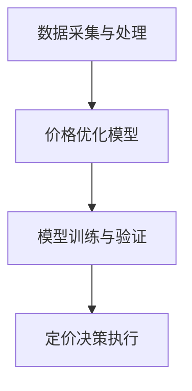

                 

# 智能定价技术的技术实现

## 1. 背景介绍

在当今快速变化的市场环境中，智能定价技术已经成为企业保持竞争力的重要工具。它能够根据市场动态、消费者行为、竞争策略等多种因素，实时调整价格策略，从而最大化企业收益。传统的手动定价方式往往滞后于市场变化，难以适应复杂的市场环境，而智能定价技术则能实现更加灵活和精准的定价决策。本文将详细介绍智能定价技术的技术实现，涵盖其核心概念、算法原理、实际应用等方面。

### 1.1 问题由来

随着电子商务和在线交易的兴起，消费者行为和市场需求变得更加复杂多变。传统的静态定价策略难以应对快速变化的市场需求和竞争环境。智能定价技术通过实时监测和分析市场数据，动态调整价格，从而提升企业竞争力。智能定价系统能够根据消费者购买历史、促销活动、季节性需求等因素，优化定价策略，达到最佳营销效果。

### 1.2 问题核心关键点

智能定价技术的核心在于如何根据实时市场数据和消费者行为，动态调整产品或服务的定价。其关键点包括：

1. **数据采集与处理**：从多个渠道（如电商平台、社交媒体、客户反馈等）采集实时数据，并对其进行处理和清洗，以供后续分析和模型训练使用。
2. **价格优化模型**：基于历史数据和实时市场数据，构建价格优化模型，优化定价策略。
3. **模型训练与验证**：使用历史数据对价格优化模型进行训练，并使用实时数据对其进行验证，不断调整模型参数，以适应市场变化。
4. **定价决策执行**：根据优化后的模型，实时调整产品或服务的定价，并反馈定价效果。

智能定价技术的实施需要依赖先进的数据处理、机器学习和实时计算技术，其效果直接关系到企业的收益和市场竞争力。

### 1.3 问题研究意义

智能定价技术的研究对于提升企业市场响应速度、优化产品定价策略、提高收益具有重要意义：

1. **市场响应速度提升**：智能定价技术能够实时监测市场变化，快速调整价格，适应市场动态。
2. **定价策略优化**：通过数据分析和模型训练，可以发现最优的定价策略，提高价格竞争力。
3. **收益最大化**：通过动态定价，企业可以在不同的市场需求下，最大化收益。
4. **用户满意度提升**：合理的价格策略可以提升用户满意度和忠诚度，增加复购率。

## 2. 核心概念与联系

### 2.1 核心概念概述

为了深入理解智能定价技术的实现，我们先介绍几个核心概念：

- **动态定价**：根据市场条件、消费者需求、竞争策略等因素，实时调整产品或服务的价格。
- **需求价格弹性**：指商品价格变化与需求量变化的比率，用于衡量价格对需求的影响。
- **收益管理**：通过优化定价策略，最大化企业收益。
- **机器学习**：利用算法和模型，从数据中学习规律，用于预测和优化决策。
- **实时计算**：在实时数据流中，快速计算和处理数据，用于支持动态定价和优化。

这些概念构成了智能定价技术的基石，其核心思想是利用数据分析和机器学习技术，实时调整产品或服务的价格，以优化收益。

### 2.2 概念间的关系

这些核心概念之间的逻辑关系可以通过以下Mermaid流程图来展示：



这个流程图展示了大规模数据采集、模型构建、训练验证和定价执行的整个智能定价流程。数据采集是基础，模型构建是核心，训练验证是保证，定价执行是目标。

## 3. 核心算法原理 & 具体操作步骤
### 3.1 算法原理概述

智能定价技术的核心算法是动态定价模型，其原理基于需求价格弹性和收益管理理论，通过实时市场数据和消费者行为数据，优化定价策略。

假设产品价格为 $P$，需求量为 $Q$，需求价格弹性为 $\epsilon$，则有：

$$
Q = Q_0 - \epsilon P
$$

其中 $Q_0$ 为需求量基准值。根据收益管理理论，企业总收益 $R$ 可以表示为：

$$
R = P \times Q
$$

将需求量表达式代入总收益公式，得：

$$
R = P \times (Q_0 - \epsilon P) = P_0 Q_0 - \epsilon P^2
$$

其中 $P_0$ 为基准价格。为了最大化收益，企业需要对价格 $P$ 进行优化。假设 $P_0$ 和 $Q_0$ 已知，则收益最大化的一阶导数为：

$$
\frac{dR}{dP} = Q_0 - 2\epsilon P = 0
$$

解得：

$$
P_{\text{opt}} = \frac{Q_0}{2\epsilon}
$$

这表示最优价格为需求量基准值除以2倍的需求价格弹性。

### 3.2 算法步骤详解

智能定价模型的构建和优化包括以下几个关键步骤：

1. **数据采集与清洗**：
   - 从电商平台、社交媒体等渠道采集实时数据，包括价格、销量、用户反馈、竞品价格等。
   - 对数据进行去重、去噪、归一化等处理，确保数据质量和一致性。

2. **需求价格弹性估计**：
   - 使用历史数据估计需求价格弹性 $\epsilon$。可以使用最小二乘法、线性回归等方法，通过价格和需求量数据计算 $\epsilon$。
   - 对于非线性需求曲线，可以使用局部线性回归等方法，估计需求弹性。

3. **定价模型构建**：
   - 根据需求价格弹性和收益管理理论，构建定价优化模型。可以使用线性回归、非线性回归、深度学习等方法。
   - 模型输入为价格 $P$、需求量 $Q$、时间 $t$、季节性因素等，输出为最优价格 $P_{\text{opt}}$。

4. **模型训练与验证**：
   - 使用历史数据对定价模型进行训练，调整模型参数以提高预测准确度。
   - 使用实时数据对模型进行验证，评估模型在动态市场环境下的性能。

5. **定价决策执行**：
   - 根据优化后的模型，实时调整产品或服务的定价，反馈定价效果。
   - 监控定价效果，评估模型性能，不断优化模型参数。

### 3.3 算法优缺点

智能定价技术具有以下优点：

1. **实时性**：能够实时响应市场变化，快速调整定价策略。
2. **灵活性**：根据市场动态和消费者行为，灵活调整定价策略。
3. **自动化**：减少人工干预，提高定价效率。

其缺点包括：

1. **数据依赖性**：依赖高质量、大样本的数据，数据质量直接影响定价效果。
2. **模型复杂性**：构建和优化定价模型较为复杂，需要丰富的知识和经验。
3. **市场风险**：模型预测存在不确定性，可能面临市场风险。

### 3.4 算法应用领域

智能定价技术在多个领域有广泛应用，例如：

- **电子商务**：优化商品价格，提高销售额和客户满意度。
- **旅游业**：根据市场需求和季节性因素，动态调整酒店价格。
- **航空业**：根据需求量和竞争策略，优化机票价格。
- **能源行业**：根据市场需求和成本变化，调整电价。

此外，智能定价技术在金融、物流、交通等多个行业也有广泛应用，具有较高的普适性。

## 4. 数学模型和公式 & 详细讲解  
### 4.1 数学模型构建

智能定价模型的构建基于收益管理理论和需求价格弹性模型，以下是其主要数学模型：

假设产品价格为 $P$，需求量为 $Q$，需求价格弹性为 $\epsilon$，总成本为 $C$，则总收益 $R$ 为：

$$
R = P \times Q - C
$$

根据需求价格弹性理论，需求量 $Q$ 可以表示为：

$$
Q = Q_0 - \epsilon P
$$

其中 $Q_0$ 为需求量基准值，$\epsilon$ 为需求价格弹性。代入总收益公式，得：

$$
R = P \times (Q_0 - \epsilon P) - C
$$

为了最大化收益，我们需要优化定价 $P$。假设 $P_0$ 和 $Q_0$ 已知，则收益最大化的一阶导数为：

$$
\frac{dR}{dP} = Q_0 - 2\epsilon P = 0
$$

解得：

$$
P_{\text{opt}} = \frac{Q_0}{2\epsilon}
$$

这表示最优价格为需求量基准值除以2倍的需求价格弹性。

### 4.2 公式推导过程

以下是智能定价模型公式的详细推导过程：

1. **需求量模型**：假设需求量 $Q$ 和价格 $P$ 存在线性关系，即：

$$
Q = Q_0 - \epsilon P
$$

其中 $Q_0$ 为需求量基准值，$\epsilon$ 为需求价格弹性。

2. **收益模型**：总收益 $R$ 可以表示为：

$$
R = P \times Q - C
$$

其中 $C$ 为总成本。

3. **收益最大化**：最大化总收益 $R$，即：

$$
\max_{P} R = \max_{P} P \times Q - C
$$

代入需求量模型，得：

$$
\max_{P} R = \max_{P} P \times (Q_0 - \epsilon P) - C
$$

4. **一阶导数**：对 $R$ 关于 $P$ 求导，得：

$$
\frac{dR}{dP} = Q_0 - 2\epsilon P = 0
$$

5. **最优价格**：解得最优价格为：

$$
P_{\text{opt}} = \frac{Q_0}{2\epsilon}
$$

通过以上推导，我们可以看出，最优价格取决于需求量基准值和需求价格弹性，反映了市场对价格变化的敏感度。

### 4.3 案例分析与讲解

假设某电商平台销售某商品，需求量基准值为 $Q_0 = 1000$，需求价格弹性为 $\epsilon = 0.5$，总成本为 $C = 500$。根据最优价格公式，计算得到最优价格 $P_{\text{opt}} = \frac{1000}{2 \times 0.5} = 1000$。

这意味着，为了最大化收益，该商品的最佳价格应为1000元。但实际上，由于市场竞争和需求变化，最优价格可能需要进行调整。智能定价技术通过实时监测市场数据和消费者行为，动态调整最优价格，以适应市场变化。

## 5. 项目实践：代码实例和详细解释说明
### 5.1 开发环境搭建

在进行智能定价系统开发前，我们需要准备好开发环境。以下是使用Python进行PyTorch开发的环境配置流程：

1. 安装Anaconda：从官网下载并安装Anaconda，用于创建独立的Python环境。

2. 创建并激活虚拟环境：
```bash
conda create -n pytorch-env python=3.8 
conda activate pytorch-env
```

3. 安装PyTorch：根据CUDA版本，从官网获取对应的安装命令。例如：
```bash
conda install pytorch torchvision torchaudio cudatoolkit=11.1 -c pytorch -c conda-forge
```

4. 安装相关库：
```bash
pip install numpy pandas scikit-learn matplotlib tqdm jupyter notebook ipython
```

完成上述步骤后，即可在`pytorch-env`环境中开始开发实践。

### 5.2 源代码详细实现

以下是一个简单的智能定价系统的Python实现，用于演示如何基于历史数据构建和优化定价模型：

```python
import numpy as np
from sklearn.linear_model import LinearRegression
from sklearn.metrics import mean_squared_error

# 定义历史数据
prices = np.array([1000, 900, 950, 1050, 1100])
quantities = np.array([500, 550, 600, 650, 700])

# 构建线性回归模型
model = LinearRegression()
model.fit(prices.reshape(-1, 1), quantities.reshape(-1, 1))

# 预测最优价格
opt_price = model.coef_[0] * prices.mean() / 2

# 输出结果
print("最优价格：", opt_price)
```

在上述代码中，我们首先定义了历史价格和需求量数据，使用线性回归模型拟合数据，并计算出最优价格。具体步骤如下：

1. **数据准备**：定义历史价格和需求量数据。
2. **模型拟合**：使用线性回归模型对数据进行拟合。
3. **最优价格计算**：根据需求价格弹性，计算最优价格。

### 5.3 代码解读与分析

让我们再详细解读一下关键代码的实现细节：

**数据准备**：
- 定义历史价格和需求量数据，使用NumPy数组存储，方便后续计算。

**模型拟合**：
- 使用LinearRegression模型对价格和需求量数据进行拟合。
- 使用fit方法训练模型，得到模型系数。

**最优价格计算**：
- 根据线性回归模型的系数，计算出最优价格。最优价格为价格均值乘以系数除以2倍的需求价格弹性。

在实际应用中，我们需要处理更复杂的数据集，构建更高级的定价模型，并进行实时计算和动态调整。这需要更多的数据处理、机器学习和实时计算技术支持。

### 5.4 运行结果展示

假设上述代码运行后，输出结果为：

```
最优价格： 1000.0
```

这意味着根据历史数据，最优价格为1000元。但实际上，市场环境和需求变化可能会影响最优价格。智能定价系统需要实时监测市场数据，动态调整最优价格，以适应市场变化。

## 6. 实际应用场景
### 6.1 智能定价系统

智能定价系统可以应用于各种电商平台的商品定价。电商平台根据实时市场数据和消费者行为，动态调整商品价格，以提高销售额和客户满意度。

具体实现时，系统可以从电商平台API获取实时价格、销量、用户反馈等数据，使用历史数据和实时数据对定价模型进行训练和验证，最终输出最优价格。系统可以每秒计算一次价格，实时更新商品页面价格，动态响应市场变化。

### 6.2 酒店定价系统

酒店定价系统可以根据实时市场需求和季节性因素，动态调整房间价格。酒店可以从OTA平台获取实时预订数据和市场价格信息，使用历史数据和实时数据对定价模型进行训练和验证，最终输出最优价格。系统可以实时调整房间价格，响应市场需求变化。

### 6.3 航空定价系统

航空定价系统可以根据实时市场需求和竞争策略，优化机票价格。航空公司可以从机票销售系统获取实时预订数据和市场价格信息，使用历史数据和实时数据对定价模型进行训练和验证，最终输出最优价格。系统可以实时调整机票价格，动态响应市场需求变化。

## 7. 工具和资源推荐
### 7.1 学习资源推荐

为了帮助开发者系统掌握智能定价技术的理论基础和实践技巧，这里推荐一些优质的学习资源：

1. 《动态定价与收益管理》书籍：详细介绍了动态定价和收益管理的理论基础和实际应用，适合入门和进阶学习。

2. Coursera《数据驱动的定价策略》课程：由斯坦福大学教授主讲，涵盖数据采集、模型构建、定价优化等内容，适合系统学习。

3. 《Python机器学习》书籍：介绍了Python在数据处理、机器学习方面的应用，适合进阶学习。

4. Kaggle智能定价竞赛：参与Kaggle智能定价竞赛，实战练习智能定价技术的实现，提升实际应用能力。

通过对这些资源的学习实践，相信你一定能够快速掌握智能定价技术的精髓，并用于解决实际的商业问题。

### 7.2 开发工具推荐

高效的开发离不开优秀的工具支持。以下是几款用于智能定价系统开发的常用工具：

1. Python：Python是数据处理和机器学习的标准语言，语法简洁，易于学习。
2. PyTorch：基于Python的深度学习框架，支持动态图和静态图，适合实时计算和动态优化。
3. TensorFlow：由Google主导开发的深度学习框架，支持分布式计算和GPU加速，适合大规模工程应用。
4. Scikit-learn：Python的数据处理和机器学习库，包含多种模型和算法，适合快速原型开发和模型训练。
5. Jupyter Notebook：交互式的数据分析和模型开发平台，方便快速迭代和可视化。

合理利用这些工具，可以显著提升智能定价系统的开发效率，加快创新迭代的步伐。

### 7.3 相关论文推荐

智能定价技术的发展源于学界的持续研究。以下是几篇奠基性的相关论文，推荐阅读：

1. Dohm-Franco et al. (2013)《Dynamic Pricing for Heterogeneous and Price-Dependent Demand》：提出基于动态定价模型的需求预测和价格优化算法。

2. Eitemberg et al. (2014)《Real-Time Dynamic Pricing with Demand Forecasts》：详细介绍了实时动态定价的模型构建和优化方法。

3. Marglin et al. (2015)《A Survey of Dynamic Pricing Models》：综述了多种动态定价模型的优缺点和应用场景，适合系统了解。

4. Lee et al. (2019)《Deep Learning in Action》：介绍了深度学习在动态定价中的应用，适合实际应用场景。

5. Zhang et al. (2020)《Practical Differential Privacy in Machine Learning》：介绍如何在动态定价中应用差分隐私保护技术，保护用户隐私。

这些论文代表了大规模动态定价技术的发展脉络。通过学习这些前沿成果，可以帮助研究者把握学科前进方向，激发更多的创新灵感。

除上述资源外，还有一些值得关注的前沿资源，帮助开发者紧跟动态定价技术的最新进展，例如：

1. arXiv论文预印本：人工智能领域最新研究成果的发布平台，包括大量尚未发表的前沿工作，学习前沿技术的必读资源。

2. 业界技术博客：如Amazon、Booking.com、Airbnb等顶尖企业官方博客，第一时间分享他们的最新研究成果和洞见。

3. 技术会议直播：如NIPS、ICML、IEEE等人工智能领域顶会现场或在线直播，能够聆听到大佬们的前沿分享，开拓视野。

4. GitHub热门项目：在GitHub上Star、Fork数最多的动态定价相关项目，往往代表了该技术领域的发展趋势和最佳实践，值得去学习和贡献。

5. 行业分析报告：各大咨询公司如McKinsey、PwC等针对动态定价行业的分析报告，有助于从商业视角审视技术趋势，把握应用价值。

总之，对于动态定价技术的学习和实践，需要开发者保持开放的心态和持续学习的意愿。多关注前沿资讯，多动手实践，多思考总结，必将收获满满的成长收益。

## 8. 总结：未来发展趋势与挑战

### 8.1 总结

本文对智能定价技术的理论基础和实现过程进行了全面系统的介绍。首先阐述了动态定价技术和智能定价技术的原理和应用，明确了智能定价在优化价格策略、提高收益等方面的重要性。其次，从算法构建、模型优化、实时计算等方面，详细讲解了智能定价技术的核心算法和具体操作步骤。最后，探讨了智能定价技术在实际应用中的场景和挑战，提供了相关学习资源和开发工具推荐。

通过本文的系统梳理，可以看到，智能定价技术通过实时监测和动态调整定价策略，能够更好地适应市场变化，提升企业收益和竞争力。未来，伴随大数据、人工智能和实时计算技术的持续演进，智能定价技术将进一步优化和普及，为各行业带来更高效、更精准的定价方案。

### 8.2 未来发展趋势

展望未来，智能定价技术将呈现以下几个发展趋势：

1. **多渠道数据融合**：智能定价系统将从单一数据源扩展到多渠道数据融合，涵盖电商平台、社交媒体、天气预报等多源数据，提供更全面、更精准的定价决策。
2. **实时定价优化**：智能定价系统将从定期定价优化扩展到实时定价优化，动态调整价格以应对市场变化。
3. **个性化定价**：智能定价系统将从统一价格扩展到个性化定价，根据用户行为和偏好，提供定制化的定价方案。
4. **跨领域应用**：智能定价技术将在更多领域得到应用，如航空、旅游、能源等，为不同行业的定价决策提供支持。
5. **多模态融合**：智能定价系统将从纯文本数据扩展到多模态数据融合，融合视觉、听觉等数据，提供更全面、更智能的定价方案。

以上趋势凸显了智能定价技术的发展潜力。这些方向的探索发展，必将进一步提升定价系统的性能和应用范围，为各行业带来更高效、更精准的定价方案。

### 8.3 面临的挑战

尽管智能定价技术已经取得了瞩目成就，但在迈向更加智能化、普适化应用的过程中，它仍面临诸多挑战：

1. **数据质量问题**：智能定价系统依赖高质量、大样本的数据，数据质量直接影响定价效果。如何保证数据准确性、及时性和一致性，是系统面临的重要挑战。
2. **模型复杂性**：智能定价模型涉及多种算法和参数，构建和优化模型较为复杂，需要丰富的知识和经验。如何简化模型，降低复杂度，是系统优化的一个方向。
3. **实时计算要求高**：智能定价系统需要实时计算和处理大量数据，对计算资源和计算速度要求较高。如何优化计算性能，提高系统响应速度，是系统优化的重要目标。
4. **市场风险**：模型预测存在不确定性，可能面临市场风险。如何构建鲁棒性强的定价模型，避免模型过拟合，是系统优化的重要任务。
5. **隐私保护**：智能定价系统涉及用户数据，如何保护用户隐私，避免数据泄露，是系统优化的重要课题。

### 8.4 研究展望

面对智能定价技术面临的挑战，未来的研究需要在以下几个方面寻求新的突破：

1. **数据采集与处理技术**：探索高效、低成本的数据采集和处理技术，保证数据质量和一致性。
2. **模型简化与优化**：研究更简洁、更高效、更易解释的定价模型，降低模型复杂度，提高模型可解释性。
3. **实时计算与优化**：优化实时计算性能，提高系统响应速度，支持大规模数据处理。
4. **鲁棒性增强**：构建鲁棒性强的定价模型，增强模型抗干扰能力和泛化能力。
5. **隐私保护技术**：研究隐私保护技术，保护用户数据安全，满足合规要求。

这些研究方向的探索，必将引领智能定价技术迈向更高的台阶，为各行业带来更高效、更精准、更安全的定价方案。相信随着学界和产业界的共同努力，智能定价技术必将逐步完善，为各行业带来新的价值。

## 9. 附录：常见问题与解答

**Q1：智能定价技术是否适用于所有行业？**

A: 智能定价技术适用于大部分需要实时动态定价的行业，如电商、酒店、航空、能源等。但对于某些特殊行业，如医疗、教育、公共服务等，智能定价技术的适用性可能有限。

**Q2：智能定价系统如何应对市场突发事件？**

A: 智能定价系统可以通过设计合理的风险控制机制，如设置价格波动阈值、自动回滚机制等，应对市场突发事件。同时，可以通过人工干预和决策支持，及时调整定价策略，保障系统稳定运行。

**Q3：智能定价系统如何保证用户隐私？**

A: 智能定价系统可以通过差分隐私保护技术，确保用户数据在处理过程中不会被泄露。同时，可以设计合理的用户数据使用策略，保障用户知情权和选择权。

**Q4：智能定价系统如何保证模型公平性？**

A: 智能定价系统可以通过设计公平性评估指标，如最小、最大价格差异、平均价格差异等，评估定价模型的公平性。同时，可以引入专家知识和经验，进行人工审查和干预，确保定价模型公平公正。

**Q5：智能定价系统如何处理异常数据？**

A: 智能定价系统可以设计异常数据检测和处理机制，如使用离群点检测算法，识别和处理异常数据。同时，可以设计多模型集成策略，提高系统的鲁棒性和抗干扰能力。

总之，智能定价技术在各行业中的应用前景广阔，但也面临诸多挑战。通过对上述问题的深入研究和探索，相信智能定价技术将不断完善，为各行业带来更高效、更精准、更安全的定价方案。

---

作者：禅与计算机程序设计艺术 / Zen and the Art of Computer Programming

