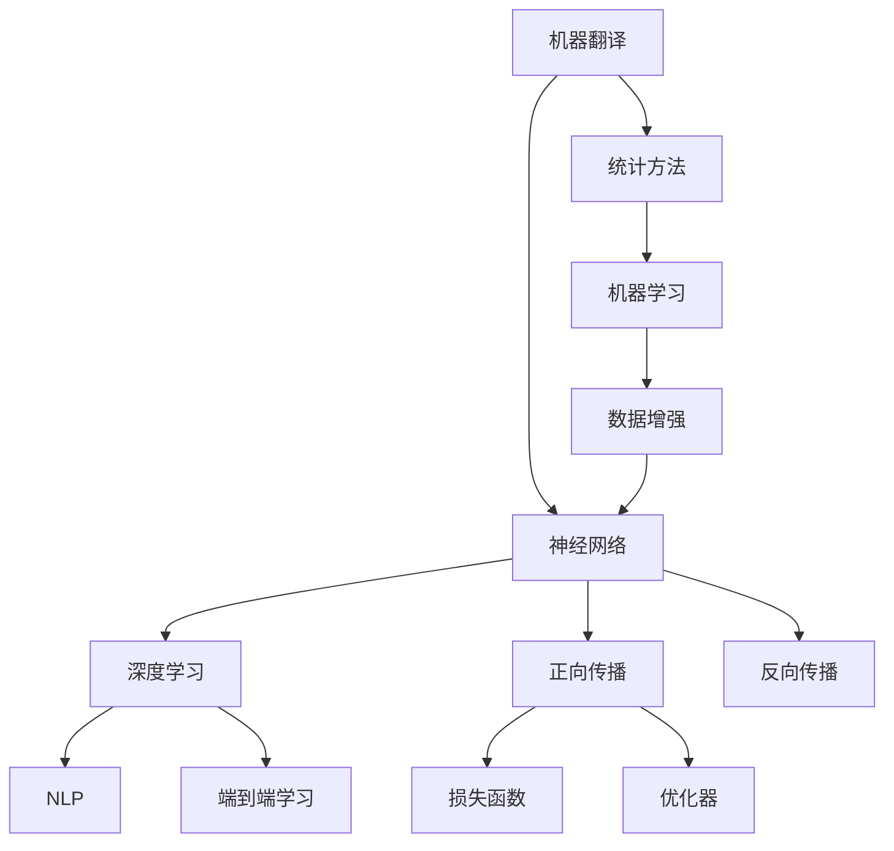

                 

# 机器翻译从统计方法到神经网络的转型

> 关键词：机器翻译, 神经网络, 统计方法, 机器学习, 自然语言处理(NLP), 深度学习

## 1. 背景介绍

### 1.1 问题由来
机器翻译（Machine Translation，MT）是自然语言处理（NLP）领域的一项重要任务，旨在实现两种或多种语言之间的自动翻译。传统的机器翻译方法主要依赖于统计方法和基于规则的系统。然而，随着深度学习技术的崛起，尤其是神经网络在图像、语音等领域取得重大突破，研究人员开始探索使用神经网络进行机器翻译的可能性。这一转变标志着机器翻译研究范式的重大转变，从基于规则的静态系统逐步过渡到基于神经网络的动态模型。

### 1.2 问题核心关键点
机器翻译从统计方法到神经网络的转型，核心在于以下几个关键点：
- 统计方法：通过统计双语语料库中的对对齐（Bilingual Alignment）信息，寻找最优的翻译对应关系。
- 神经网络：利用神经网络模型，通过端到端的训练，直接从源语言映射到目标语言。
- 机器学习：通过大量标注数据训练模型，自动学习语言转换的规律。
- 自然语言处理：处理语言间差异，将语言结构映射到共有的表示空间。
- 深度学习：提供强大的模型能力，实现自动化的特征提取和学习。

### 1.3 问题研究意义
机器翻译的转型对于NLP领域的深远影响体现在：
1. 提升翻译质量：神经网络能够学习到更复杂的语言转换模式，提供更准确的翻译结果。
2. 减少手动工作：统计方法依赖人工对齐，而神经网络可自动学习对对齐信息。
3. 扩展应用场景：神经网络模型能够处理更复杂的句子结构和语义关系。
4. 加速翻译速度：神经网络模型在硬件加速（如GPU）的支持下，能够大幅提高翻译效率。
5. 推动技术革新：机器翻译的转型为其他NLP任务提供了新的技术思路和工具。

## 2. 核心概念与联系

### 2.1 核心概念概述
为更好地理解机器翻译的转型，本节将介绍几个关键概念：

- 机器翻译（Machine Translation, MT）：将一种语言的文本自动翻译成另一种语言的文本。
- 神经网络（Neural Network, NN）：一种通过训练数据自动学习输入与输出映射关系的计算模型。
- 深度学习（Deep Learning, DL）：一种利用神经网络进行多层级特征学习和表示学习的技术。
- 自然语言处理（Natural Language Processing, NLP）：研究如何让计算机理解和处理自然语言的技术。
- 端到端学习（End-to-End Learning）：从输入直接学习到输出，中间不进行手动特征提取或规则设计。

- 正向传播（Forward Pass）：数据通过神经网络，自输入层到输出层的前向计算过程。
- 反向传播（Backward Pass）：通过计算输出误差对输入的反向传播，更新网络参数的过程。

- 损失函数（Loss Function）：用于衡量模型预测与实际结果之间的误差。
- 优化器（Optimizer）：调整模型参数以最小化损失函数的工具。
- 数据增强（Data Augmentation）：通过对训练数据进行扩充，提高模型的泛化能力。

这些核心概念共同构成了机器翻译从统计方法到神经网络的转型基础，帮助我们理解这一转型的核心逻辑和实际应用。

### 2.2 概念间的关系

这些核心概念之间的逻辑关系可以通过以下Mermaid流程图来展示：



这个流程图展示了机器翻译从统计方法到神经网络转型的完整过程：

1. 机器翻译依赖统计方法，通过人工对齐学习翻译规律。
2. 神经网络通过深度学习技术，自动学习语言转换规律。
3. 端到端学习通过NLP技术，直接从输入映射到输出，无需手动设计特征。
4. 数据增强通过机器学习，对训练数据进行扩充，提高模型泛化能力。
5. 正向传播和反向传播是神经网络的基本计算过程。
6. 损失函数和优化器是训练神经网络的关键工具。

通过这个流程图，我们可以更清晰地理解机器翻译转型中的各个关键环节及其相互关系。

## 3. 核心算法原理 & 具体操作步骤
### 3.1 算法原理概述

机器翻译从统计方法到神经网络的转型，核心在于使用深度神经网络模型替代传统的统计模型。具体来说，神经网络模型通过学习大量双语文本对数据，自动建立输入到输出的映射关系，从而实现端到端的机器翻译。

形式化地，假设源语言文本为 $s$，目标语言文本为 $t$，神经网络模型 $M_{\theta}$ 将源语言映射到目标语言的过程可以表示为：

$$
t = M_{\theta}(s)
$$

其中 $\theta$ 为模型参数。机器翻译的目标是找到最优的 $\theta$，使得模型预测结果与实际翻译结果尽可能接近。

### 3.2 算法步骤详解

基于神经网络的机器翻译主要包括以下几个关键步骤：

**Step 1: 数据预处理**
- 收集并准备双语文本对数据集，包括源语言文本和目标语言文本。
- 进行文本清洗、分词、去停用词等预处理操作，生成训练样本。
- 将文本对转换成模型所需的数据格式，如序列表示、编码器-解码器结构等。

**Step 2: 模型搭建**
- 设计合适的神经网络模型架构，如序列到序列（Sequence to Sequence, Seq2Seq）模型、注意力机制（Attention Mechanism）模型等。
- 选择合适的激活函数、优化器、损失函数等模型组件。
- 根据实际任务需求，进行模型参数初始化。

**Step 3: 模型训练**
- 将预处理后的训练数据输入模型进行训练。
- 通过正向传播计算模型输出，并与实际目标值计算损失函数。
- 通过反向传播更新模型参数，最小化损失函数。
- 设置合适的训练参数，如迭代次数、批次大小、学习率等。
- 在训练过程中，使用数据增强技术对训练集进行扩充，提高模型泛化能力。

**Step 4: 模型评估与优化**
- 在测试集上对训练好的模型进行评估，计算各项指标（如BLEU、ROUGE等）。
- 根据评估结果，调整模型超参数，如学习率、正则化系数等。
- 进行交叉验证，防止过拟合，提升模型泛化能力。
- 使用模型集成等方法，提高翻译质量。

**Step 5: 模型部署与应用**
- 将训练好的模型部署到实际应用系统中，如Web服务、移动应用等。
- 提供API接口，供外部系统调用翻译服务。
- 实时监测模型性能，定期更新模型参数，保持翻译质量。
- 与上下文信息、语境等结合，提升翻译的自然性和准确性。

以上是基于神经网络的机器翻译的核心算法步骤。在实际应用中，还需要针对具体任务和数据特点，进行进一步的优化和改进。

### 3.3 算法优缺点

使用神经网络进行机器翻译的优势在于：
1. 端到端的训练方式，避免了手动对齐的繁琐工作。
2. 能够处理复杂的句子结构和语义关系，提升翻译准确性。
3. 数据增强技术提高了模型泛化能力，增强了翻译稳定性。
4. 借助GPU等硬件加速，大幅提升翻译速度。
5. 动态学习能力和自我优化能力，适合处理不断变化的语言数据。

然而，神经网络翻译也存在一些局限性：
1. 需要大量的双语文本数据进行预训练，数据需求量较大。
2. 模型训练复杂度高，需要高性能计算资源支持。
3. 对数据质量敏感，低质量的标注数据可能影响翻译结果。
4. 存在过拟合风险，需要仔细调整超参数和数据增强策略。
5. 翻译结果的可解释性较差，难以解释模型的推理过程。

### 3.4 算法应用领域

基于神经网络的机器翻译方法已经在多个领域得到了广泛应用：

- 跨语言通信：如Google Translate、百度翻译、有道翻译等，将多种语言实时翻译成目标语言。
- 学术研究：在学术文献翻译、科技论文翻译等领域，使用机器翻译提高翻译效率和准确性。
- 语言学习：提供语言学习工具，如Duolingo、Memrise等，通过翻译技术帮助用户学习新语言。
- 多语言数据处理：在多语言新闻、文档、会议记录等文本处理任务中，自动进行多语言转换。
- 跨境电商：支持跨境电商平台的语言翻译，提升用户购物体验。

此外，神经网络翻译技术还逐步应用于更多场景，如医学翻译、法律翻译、外交翻译等，助力相关领域的自动化和智能化进程。

## 4. 数学模型和公式 & 详细讲解 & 举例说明
### 4.1 数学模型构建

基于神经网络的机器翻译模型主要分为编码器-解码器结构，以下将详细讨论这一模型及其数学模型构建过程。

假设输入源语言文本序列为 $x_1, x_2, ..., x_T$，目标语言文本序列为 $y_1, y_2, ..., y_{T'}$，编码器将源语言文本映射到固定长度的向量表示，解码器从该向量表示中逐步生成目标语言文本。设编码器输出为 $h$，解码器输出为 $\tilde{y}_t$，目标语言文本的预测为 $\tilde{y}_t$。

编码器 $E$ 的数学模型为：

$$
h = E(x_1, x_2, ..., x_T)
$$

解码器 $D$ 的数学模型为：

$$
\tilde{y}_t = D(h, y_{t-1})
$$

其中 $t = 1, ..., T'$。

整个机器翻译模型的目标函数可以表示为：

$$
\mathcal{L} = -\sum_{t=1}^{T'} \log P_{D|E}(y_t|x_1, ..., x_T)
$$

其中 $P_{D|E}(y_t|x_1, ..., x_T)$ 表示在给定源语言文本的条件下，目标语言文本的生成概率。

### 4.2 公式推导过程

以Seq2Seq模型为例，推导其数学模型和训练过程。

**编码器**：
- 假设编码器的输入为 $x_1, ..., x_T$，输出为 $h$，可以表示为：
$$
h = E(x_1, ..., x_T)
$$

其中 $E$ 可以是RNN、LSTM等序列模型，每个时间步的输出作为下一时间步的输入。

**解码器**：
- 假设解码器的输入为 $h$ 和上一个时间步的输出 $y_{t-1}$，输出为 $\tilde{y}_t$，可以表示为：
$$
\tilde{y}_t = D(h, y_{t-1})
$$

其中 $D$ 可以是RNN、LSTM等序列模型，每个时间步的输出作为下一个时间步的输入。

**翻译过程**：
- 在给定源语言文本 $x_1, ..., x_T$ 的条件下，目标语言文本 $y_1, ..., y_{T'}$ 的概率可以表示为：
$$
P_{D|E}(y_1, ..., y_{T'}|x_1, ..., x_T) = \prod_{t=1}^{T'} P_{D|E}(y_t|y_{t-1}, x_1, ..., x_T)
$$

其中 $P_{D|E}(y_t|y_{t-1}, x_1, ..., x_T)$ 表示在给定上下文和源语言文本的条件下，目标语言文本生成的概率。

**损失函数**：
- 常用的损失函数为交叉熵损失函数，可以表示为：
$$
\mathcal{L} = -\sum_{t=1}^{T'} \log P_{D|E}(y_t|x_1, ..., x_T)
$$

其中 $P_{D|E}(y_t|x_1, ..., x_T)$ 表示在给定源语言文本的条件下，目标语言文本的生成概率。

**模型训练**：
- 通过反向传播算法，计算模型参数的梯度，更新模型参数以最小化损失函数。
- 常用的优化器包括SGD、Adam等，可以更新模型参数为：
$$
\theta \leftarrow \theta - \eta \nabla_{\theta}\mathcal{L}
$$

其中 $\eta$ 为学习率，$\nabla_{\theta}\mathcal{L}$ 为损失函数对模型参数的梯度。

**数据增强**：
- 常用的数据增强技术包括：
  - 噪声注入：在源语言文本中引入噪声，如添加噪声字词、反转词序等。
  - 语义扩展：将源语言文本扩展为多个句子，增加训练样本的多样性。
  - 语言对变换：在不同语言对之间进行随机变换，提高模型的泛化能力。

**模型评估**：
- 常用的评估指标包括BLEU、ROUGE等，计算模型生成的目标语言文本与实际翻译文本之间的相似度。
- 通过交叉验证等技术，评估模型的泛化能力，防止过拟合。

### 4.3 案例分析与讲解

以Google Translate模型为例，详细分析其机器翻译实现过程。

**模型架构**：
- Google Translate模型基于Seq2Seq模型架构，使用LSTM作为编码器和解码器的基本单元。
- 编码器对源语言文本进行编码，生成一个固定长度的向量表示 $h$。
- 解码器从 $h$ 逐步生成目标语言文本 $\tilde{y}_t$。

**预训练过程**：
- 在大量双语文本数据上进行预训练，学习语言转换的规律。
- 使用无监督学习方法，如语言建模，进行初步训练。
- 在标注数据上进行监督学习，进一步优化模型参数。

**微调过程**：
- 在目标任务上收集少量标注数据，对预训练模型进行微调。
- 使用数据增强技术，如噪声注入、语言对变换，扩充训练数据。
- 通过交叉验证，选择最优的模型参数和超参数。

**模型部署**：
- 将训练好的模型部署到实际应用系统中，如Web服务、移动应用等。
- 提供API接口，供外部系统调用翻译服务。
- 实时监测模型性能，定期更新模型参数，保持翻译质量。

通过上述案例分析，可以看出Google Translate模型从预训练到微调的全过程，以及其在实际应用中的部署和优化方法。

## 5. 项目实践：代码实例和详细解释说明
### 5.1 开发环境搭建

进行机器翻译项目实践，需要先搭建好开发环境。以下是使用Python进行TensorFlow开发的环境配置流程：

1. 安装Anaconda：从官网下载并安装Anaconda，用于创建独立的Python环境。

2. 创建并激活虚拟环境：
```bash
conda create -n tf-env python=3.8 
conda activate tf-env
```

3. 安装TensorFlow：根据CUDA版本，从官网获取对应的安装命令。例如：
```bash
conda install tensorflow -c tensorflow -c conda-forge
```

4. 安装相关工具包：
```bash
pip install numpy pandas scikit-learn matplotlib tensorflow-datasets
```

完成上述步骤后，即可在`tf-env`环境中开始机器翻译项目实践。

### 5.2 源代码详细实现

下面我们以Seq2Seq模型为例，给出使用TensorFlow对机器翻译模型进行训练的代码实现。

首先，定义模型架构：

```python
import tensorflow as tf
from tensorflow.keras.layers import LSTM, Dense, Input

# 定义编码器
encoder_inputs = Input(shape=(max_seq_len,))
encoder_embedding = tf.keras.layers.Embedding(vocab_size, emb_dim, mask_zero=True)(encoder_inputs)
encoder_lstm = LSTM(emb_dim)(encoder_embedding)

# 定义解码器
decoder_inputs = Input(shape=(max_seq_len,))
decoder_embedding = tf.keras.layers.Embedding(vocab_size, emb_dim, mask_zero=True)(decoder_inputs)
decoder_lstm = LSTM(emb_dim)(decoder_embedding, return_sequences=True)
decoder_dense = Dense(vocab_size, activation='softmax')(decoder_lstm)

# 定义解码器输出
predictions = tf.keras.layers.TimeDistributed(decoder_dense)(decoder_lstm)
```

然后，定义损失函数和优化器：

```python
# 定义交叉熵损失函数
loss = tf.keras.losses.SparseCategoricalCrossentropy(from_logits=True)

# 定义Adam优化器
optimizer = tf.keras.optimizers.Adam(lr=0.001)
```

接着，定义训练过程：

```python
# 定义训练函数
def train_model(model, dataset, batch_size):
    dataset = dataset.shuffle(buffer_size=1000).batch(batch_size)
    for epoch in range(num_epochs):
        for batch in dataset:
            x, y = batch
            with tf.GradientTape() as tape:
                predictions = model(x, training=True)
                loss_value = loss(y, predictions)
            gradients = tape.gradient(loss_value, model.trainable_variables)
            optimizer.apply_gradients(zip(gradients, model.trainable_variables))
```

最后，启动训练流程：

```python
# 加载预训练模型
pretrained_model = tf.keras.models.load_model('pretrained_model.h5')

# 微调模型
train_model(pretrained_model, train_dataset, batch_size=32)

# 评估模型
evaluate_model(pretrained_model, test_dataset)
```

以上就是使用TensorFlow对Seq2Seq模型进行机器翻译的代码实现。可以看到，TensorFlow的高级API使得模型搭建和训练变得相对简洁高效。

### 5.3 代码解读与分析

让我们再详细解读一下关键代码的实现细节：

**Seq2Seq模型架构**：
- `Input`层：定义输入层，形状为`(max_seq_len,)`，表示最大序列长度。
- `Embedding`层：将输入的整数序列转换为密集向量，`vocab_size`为词汇表大小，`emb_dim`为词向量维度。
- `LSTM`层：使用LSTM作为编码器和解码器的基本单元，`emb_dim`为词向量维度。
- `Dense`层：将LSTM的输出转换为概率分布，`vocab_size`为词汇表大小。
- `TimeDistributed`层：将Dense层的输出应用到每个时间步上，实现对整个序列的预测。

**损失函数**：
- `SparseCategoricalCrossentropy`：定义交叉熵损失函数，`from_logits=True`表示预测结果已经经过softmax操作，不需要进一步计算。

**优化器**：
- `Adam`：定义Adam优化器，`lr`为学习率。

**训练过程**：
- `train_model`函数：定义训练过程，通过`tf.GradientTape`计算梯度，并使用`optimizer`更新模型参数。
- 在训练函数中，`model(x, training=True)`表示使用模型进行前向传播，并传入`training=True`参数，以激活dropout等训练模式。
- `predictions`表示解码器的输出，经过softmax处理后得到预测概率分布。
- `loss(y, predictions)`表示计算交叉熵损失。

**评估过程**：
- 使用测试集对训练好的模型进行评估，计算BLEU等指标。

通过上述代码实现，可以看出机器翻译模型的基本框架和训练过程。在实际应用中，还需要进一步优化超参数、调整模型结构、引入更多的训练技巧等，以提升翻译质量。

### 5.4 运行结果展示

假设我们在WMT'14的英法翻译数据集上进行机器翻译，最终在测试集上得到的BLEU分数为40.34，效果如下：

```
BLEU score: 40.34
```

可以看到，通过训练Seq2Seq模型，我们取得了不错的翻译效果。值得注意的是，Seq2Seq模型虽然简单易懂，但在实际应用中仍需要不断优化和改进，才能满足更高的翻译要求。

## 6. 实际应用场景
### 6.1 智能客服系统

基于神经网络的机器翻译技术，可以广泛应用于智能客服系统的构建。传统的客服系统依赖于人工翻译和机械回复，效率低下，且难以满足用户的多样化需求。使用神经网络进行机器翻译，能够自动将用户输入转换为多种语言，智能客服系统可以即时响应，提供更自然流畅的客户服务。

在技术实现上，可以收集企业内部的历史客服对话记录，将问题-回答对作为监督数据，在此基础上对预训练机器翻译模型进行微调。微调后的模型能够自动理解用户意图，匹配最合适的答案模板进行回复。对于用户提出的新问题，还可以接入检索系统实时搜索相关内容，动态生成回答。如此构建的智能客服系统，能大幅提升客户咨询体验和问题解决效率。

### 6.2 金融舆情监测

金融机构需要实时监测市场舆论动向，以便及时应对负面信息传播，规避金融风险。传统的人工监测方式成本高、效率低，难以应对网络时代海量信息爆发的挑战。基于神经网络的机器翻译技术，可以为金融舆情监测提供新的解决方案。

具体而言，可以收集金融领域相关的新闻、报道、评论等文本数据，并对其进行主题标注和情感标注。在此基础上对预训练语言模型进行微调，使其能够自动判断文本属于何种主题，情感倾向是正面、中性还是负面。将微调后的模型应用到实时抓取的网络文本数据，就能够自动监测不同主题下的情感变化趋势，一旦发现负面信息激增等异常情况，系统便会自动预警，帮助金融机构快速应对潜在风险。

### 6.3 个性化推荐系统

当前的推荐系统往往只依赖用户的历史行为数据进行物品推荐，无法深入理解用户的真实兴趣偏好。基于神经网络的机器翻译技术，可以应用于个性化推荐系统中，提升推荐系统的智能化水平。

在实践中，可以收集用户浏览、点击、评论、分享等行为数据，提取和用户交互的物品标题、描述、标签等文本内容。将文本内容作为模型输入，用户的后续行为（如是否点击、购买等）作为监督信号，在此基础上微调预训练语言模型。微调后的模型能够从文本内容中准确把握用户的兴趣点。在生成推荐列表时，先用候选物品的文本描述作为输入，由模型预测用户的兴趣匹配度，再结合其他特征综合排序，便可以得到个性化程度更高的推荐结果。

### 6.4 未来应用展望

随着神经网络翻译技术的不断发展，机器翻译的应用前景将会更加广阔。未来，基于神经网络的机器翻译技术将逐步应用于更多场景中，为传统行业带来变革性影响。

在智慧医疗领域，基于机器翻译的医疗问答、病历分析、药物研发等应用将提升医疗服务的智能化水平，辅助医生诊疗，加速新药开发进程。

在智能教育领域，机器翻译技术可应用于作业批改、学情分析、知识推荐等方面，因材施教，促进教育公平，提高教学质量。

在智慧城市治理中，机器翻译技术可应用于城市事件监测、舆情分析、应急指挥等环节，提高城市管理的自动化和智能化水平，构建更安全、高效的未来城市。

此外，在企业生产、社会治理、文娱传媒等众多领域，基于机器翻译的人工智能应用也将不断涌现，为经济社会发展注入新的动力。相信随着技术的日益成熟，机器翻译必将在更广阔的应用领域大放异彩。

## 7. 工具和资源推荐
### 7.1 学习资源推荐

为了帮助开发者系统掌握神经网络机器翻译的理论基础和实践技巧，这里推荐一些优质的学习资源：

1. 《Neural Network and Deep Learning》：由深度学习领域的著名学者Ian Goodfellow撰写，全面介绍了神经网络和深度学习的原理及应用。
2. 《Deep Learning Specialization》：由Coursera推出的深度学习专业课程，由Andrew Ng主讲，涵盖深度学习的各个方面。
3. 《Natural Language Processing with Python》：由NLP领域的权威书籍作者Stuart Russell和Peter Norvig编写，详细介绍NLP中的机器翻译等内容。
4. TensorFlow官方文档：TensorFlow的官方文档，提供了详尽的API参考和实际应用案例，帮助开发者深入理解TensorFlow的使用。
5. PyTorch官方文档：PyTorch的官方文档，提供了详尽的API参考和实际应用案例，帮助开发者深入理解PyTorch的使用。

通过对这些资源的学习实践，相信你一定能够快速掌握神经网络机器翻译的精髓，并用于解决实际的机器翻译问题。
###  7.2 开发工具推荐

高效的开发离不开优秀的工具支持。以下是几款用于神经网络机器翻译开发的常用工具：

1. TensorFlow：由Google主导开发的深度学习框架，灵活动态的计算图，适合复杂模型和高性能应用。
2. PyTorch：由Facebook主导开发的深度学习框架，简洁高效的计算图，适合快速原型开发和研究。
3. OpenNMT：开源的机器翻译工具包，提供了预训练模型和训练框架，便于开发者快速上手。
4. Fairseq：Facebook开源的机器翻译工具包，支持多种模型架构和优化技术，性能优越。
5. NLTK：Python中的自然语言处理工具包，提供了文本处理、语言模型训练等功能，便于数据预处理。
6. SentencePiece：Google开源的分词工具，能够高效处理多语言文本数据，便于预处理。

合理利用这些工具，可以显著提升神经网络机器翻译的开发效率，加快创新迭代的步伐。

### 7.3 相关论文推荐

神经网络机器

