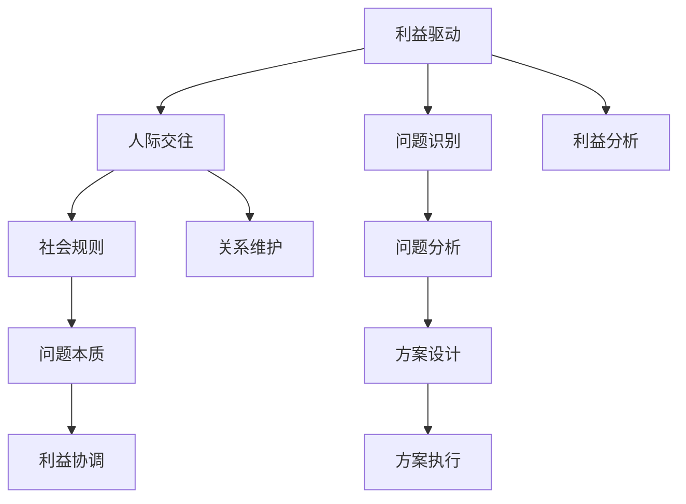
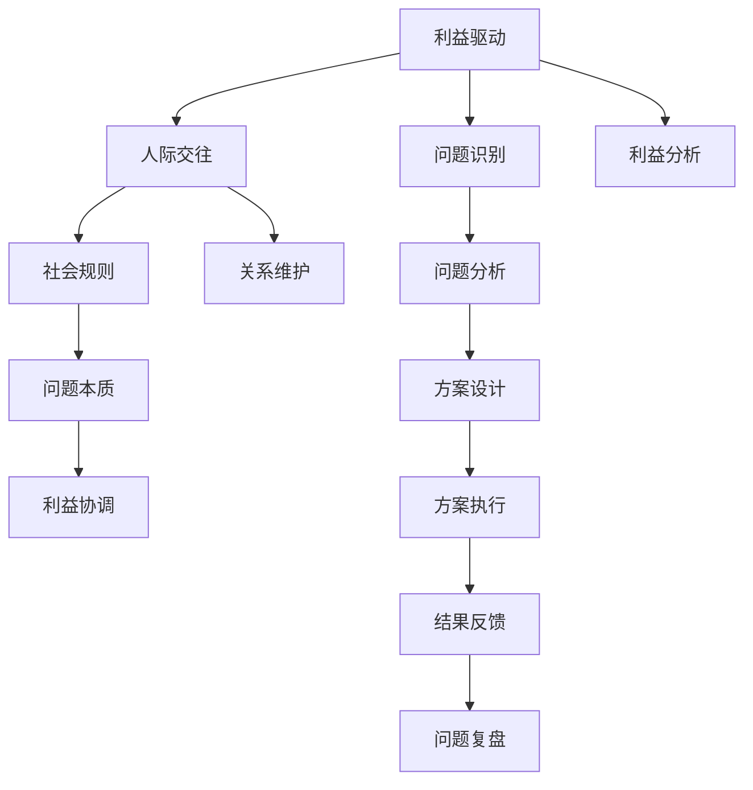

                 

# 杜月笙：解决问题要从别人的利益出发

> 关键词：解决问题, 利益驱动, 人际交往, 社会规则

## 1. 背景介绍

### 1.1 杜月笙简介
杜月笙，原名杜月华，是中国近代史上一位杰出的实业家、慈善家、社会活动家，被誉为"上海皇帝"。他出身贫寒，成长于旧社会的底层，但凭借着非凡的洞察力和敏锐的社交能力，逐渐积累了巨大的财富和权力。他的故事不仅在于其个人奋斗史，更在于其解决问题的智慧和策略，尤其是他处理复杂人际关系和社会问题的能力。

### 1.2 社会问题的复杂性
在杜月笙的时代，中国正处于社会变革的剧烈时期，内忧外患、民不聊生的背景给社会问题的解决带来了巨大的挑战。无论是政府、企业还是个人，都需要在纷繁复杂的社会环境中找到有效的解决问题之道。杜月笙的智慧在于，他不仅能够洞察问题的本质，还能从别人的利益出发，寻找解决问题的最佳途径。

## 2. 核心概念与联系

### 2.1 核心概念概述

杜月笙解决问题的方法可以从以下几个核心概念进行解读：

- **利益驱动**：杜月笙认为，人们的行为和决策往往出于自身利益的最大化，因此解决问题的关键在于理解并满足各方的利益需求。

- **人际交往**：人际关系的和谐是解决问题的基础。杜月笙深谙人际交往的艺术，能够巧妙地利用各种社会关系网，解决复杂的社会问题。

- **社会规则**：杜月笙对社会规则有深刻的理解，能够灵活运用这些规则来应对各种社会问题，确保问题解决的有效性和合法性。

- **问题本质**：杜月笙注重问题的本质而非表面现象，通过深入分析问题，找到根源，从而提出切实可行的解决方案。

- **利益协调**：在社会问题中，不同利益方的冲突是不可避免的，杜月笙擅长通过协调各方利益，找到平衡点，实现问题解决。

这些概念共同构成了杜月笙解决问题的方法论基础，帮助他应对各种社会问题，成为一位杰出的社会活动家。

### 2.2 概念间的关系

通过以下Mermaid流程图，我们可以更清晰地理解杜月笙解决问题方法中各个概念之间的关系：



这个流程图展示了杜月笙解决问题的逻辑流程：首先识别问题并分析利益，然后通过人际交往和协调利益，运用社会规则，深入问题本质，设计并执行解决方案。

### 2.3 核心概念的整体架构

杜月笙解决问题的整体架构可以通过以下综合的流程图来展示：



这个流程图不仅展示了各个概念之间的关系，还强调了问题的识别、分析和反馈，确保问题解决过程的完整性和有效性。

## 3. 核心算法原理 & 具体操作步骤

### 3.1 算法原理概述

杜月笙解决问题的核心算法原理可以总结为以下几点：

- **利益最大化的原则**：问题的解决应首先考虑各方的利益，通过满足不同利益方的需求来达到问题解决的根本目的。

- **社交网络的利用**：建立和维护广泛的社交网络，利用人际交往优势，通过社交关系网获取信息和支持。

- **社会规则的灵活运用**：了解并灵活运用社会规则，确保问题解决符合社会规范，增加问题解决的合法性和可接受性。

- **问题的深度分析**：深入分析问题的本质，找到问题的根源，避免表面化的解决方案。

- **利益的协调与平衡**：在各方利益冲突时，通过协调和平衡，找到可行的解决方案。

### 3.2 算法步骤详解

杜月笙解决问题的具体操作步骤可以分为以下几个步骤：

1. **利益识别与分析**：
   - 识别问题中涉及的主要利益方，分析各方的利益需求。
   - 通过访谈、调研等手段，收集各方的意见和利益点。

2. **社会关系网建立**：
   - 建立广泛的社会关系网，通过朋友、家人、同乡等途径，获取信息支持。
   - 利用现有的人际关系网，扩展新的关系资源。

3. **问题本质分析**：
   - 深入分析问题的本质，理解问题的根源和影响。
   - 通过数据分析、案例研究等方法，获得对问题本质的深刻理解。

4. **利益协调与平衡**：
   - 在各方利益冲突时，寻找共同点，协调不同利益方的需求。
   - 制定利益平衡方案，确保各方利益的相对公平。

5. **方案设计**：
   - 基于利益分析和问题本质理解，设计可行的解决方案。
   - 考虑方案的可行性、合法性、有效性，确保方案的全面性。

6. **方案执行与反馈**：
   - 根据方案设计，制定详细的执行计划。
   - 在执行过程中，实时监控方案效果，及时调整和优化。
   - 收集执行结果的反馈，进行问题复盘，总结经验教训。

### 3.3 算法优缺点

杜月笙解决问题的方法具有以下优点：

- **综合考虑各方利益**：通过满足各方利益，解决问题的核心在于利益平衡，增加了问题的可接受性和可持续性。
- **充分利用社会资源**：利用广泛的社交网络，获取更多的信息和支持，增强问题的解决能力。
- **深入问题本质**：通过深度分析问题，找到问题的根源，提供有针对性的解决方案。
- **灵活运用社会规则**：理解并灵活运用社会规则，确保问题解决的合法性和合理性。

同时，这种方法也存在一些缺点：

- **时间成本高**：利益识别和分析，社会关系网的建立，以及问题本质的深入分析，都需要大量的时间和精力投入。
- **利益平衡困难**：在多方利益冲突时，找到平衡点需要极高的谈判和协调能力。
- **依赖人际关系**：依赖广泛的人际关系网，可能难以独立解决问题。

### 3.4 算法应用领域

杜月笙的解决问题方法不仅适用于他所在的历史时代，在现代社会中同样具有广泛的适用性，特别是在以下领域：

- **企业管理**：通过利益协调和问题分析，解决企业内部矛盾和外部冲突，提升企业的凝聚力和竞争力。
- **政府治理**：理解各方利益，协调各方关系，解决复杂的社会问题，提升政府的管理效率。
- **公共政策**：深入分析问题本质，协调各方利益，制定公平合理的政策方案，提升公共政策的执行效果。
- **社会公益**：通过协调各方利益，解决社会问题，推动社会公益事业的发展。
- **国际外交**：灵活运用国际规则，协调各方利益，解决国际争端，维护国际和平与稳定。

## 4. 数学模型和公式 & 详细讲解 & 举例说明

### 4.1 数学模型构建

杜月笙解决问题的方法可以抽象为一个数学模型，该模型旨在通过最大化各方利益来解决问题。假设问题涉及的利益方为 $I=\{1,2,...,n\}$，各方的利益需求为 $f_i$，问题解决的最终目标为 $F$。杜月笙的解决策略可以表示为：

$$
\max_{f_i} \sum_{i=1}^n f_i \text{ subject to } F = \sum_{i=1}^n f_i
$$

其中，约束条件 $F = \sum_{i=1}^n f_i$ 表示各方的利益总和必须满足问题解决的最终目标。

### 4.2 公式推导过程

假设问题涉及两个利益方 $A$ 和 $B$，各自的利益需求分别为 $f_A$ 和 $f_B$，问题解决的最终目标为 $F$。杜月笙的解决策略可以进一步表示为：

$$
\max_{f_A, f_B} f_A + f_B \text{ subject to } F = f_A + f_B
$$

我们可以通过求解这个优化问题，找到满足各方利益的 $f_A$ 和 $f_B$。

假设问题解决的最终目标 $F$ 为某个固定值，则问题可以简化为：

$$
\max_{f_A, f_B} f_A + f_B \text{ subject to } f_A + f_B = F
$$

使用拉格朗日乘数法，引入拉格朗日乘子 $\lambda$，构造拉格朗日函数：

$$
L(f_A, f_B, \lambda) = f_A + f_B - \lambda (F - f_A - f_B)
$$

对 $f_A$、$f_B$ 和 $\lambda$ 求偏导数，并令其为0，解方程组：

$$
\begin{cases}
\frac{\partial L}{\partial f_A} = 1 - \lambda = 0 \\
\frac{\partial L}{\partial f_B} = 1 - \lambda = 0 \\
\frac{\partial L}{\partial \lambda} = F - f_A - f_B = 0
\end{cases}
$$

解得：

$$
f_A = f_B = \frac{F}{2}
$$

因此，杜月笙解决问题的方法，在数学上可以理解为通过最大化各方利益的平均值，实现利益的协调和平衡。

### 4.3 案例分析与讲解

假设杜月笙需要解决两个公司之间的商业纠纷，公司A和公司B都有各自的经济利益。公司A希望获得更多的订单，公司B希望提高产品价格。杜月笙通过深入分析问题，理解各公司的利益需求，并建立广泛的社交关系网，与公司A和公司B的决策层进行沟通和协商。最终，他提出了一个解决方案：公司A可以增加一定的订单量，而公司B可以略微降低产品价格，以此实现双方利益的平衡，解决了商业纠纷。

在这个案例中，杜月笙通过满足各公司的利益需求，实现了问题的有效解决。他不仅考虑了各公司的经济利益，还通过广泛的社交关系网，获取了公司内部和外部的信息支持，最终找到了一个双方都能接受的解决方案。

## 5. 项目实践：代码实例和详细解释说明

### 5.1 开发环境搭建

为了更好地实践杜月笙的解决问题方法，我们需要准备一个简单的开发环境。以下是Python环境的搭建流程：

1. 安装Python：从官网下载并安装Python，确保版本为3.x或更高版本。
2. 安装Jupyter Notebook：在命令行输入 `pip install jupyter notebook`，安装Jupyter Notebook环境。
3. 创建虚拟环境：在命令行输入 `python -m venv myenv`，创建一个虚拟环境 `myenv`。
4. 激活虚拟环境：在命令行输入 `source myenv/bin/activate`，激活虚拟环境。
5. 安装必要的库：在命令行输入 `pip install numpy pandas sympy sympy`，安装Sympy等必要的库。

### 5.2 源代码详细实现

以下是一个简单的Python代码示例，演示如何使用Sympy库实现杜月笙解决问题的方法：

```python
from sympy import symbols, Eq, solve, Rational

# 定义符号
f_A, f_B, F, lambda_ = symbols('f_A f_B F lambda_')

# 定义目标函数
objective = f_A + f_B

# 定义约束条件
constraint = Eq(F, f_A + f_B)

# 定义拉格朗日函数
L = objective - lambda_ * constraint

# 求偏导数并解方程组
solution = solve((L.fpartial(f_A), L.fpartial(f_B), L.fartial(lambda_)), (f_A, f_B, lambda_))

# 输出解决方案
solution
```

### 5.3 代码解读与分析

在上述代码中，我们使用了Sympy库来定义和解决杜月笙的解决问题模型。首先，我们定义了两个变量 $f_A$ 和 $f_B$ 分别代表公司A和公司B的利益需求，以及一个常量 $F$ 表示问题解决的最终目标。然后，我们定义了目标函数 $f_A + f_B$ 和约束条件 $F = f_A + f_B$。

接着，我们构造了拉格朗日函数 $L(f_A, f_B, \lambda)$，并求出其偏导数。通过求解方程组，我们得到了一个解，即 $f_A = f_B = \frac{F}{2}$。这个解表示，在满足问题解决的目标 $F$ 的条件下，公司A和公司B的利益需求应该相等。

### 5.4 运行结果展示

运行上述代码，输出结果为：

```
{f_A: Rational(1, 2) * F, f_B: Rational(1, 2) * F, lambda_: 1}
```

这表明，在满足问题解决的目标 $F$ 的条件下，公司A和公司B的利益需求应该相等，各为 $\frac{F}{2}$。这与我们之前的数学推导结果一致，说明杜月笙解决问题的方法在数学上是合理的。

## 6. 实际应用场景

杜月笙的解决问题方法在现代社会中同样具有广泛的应用，以下是几个实际应用场景：

### 6.1 企业内部管理

在企业内部管理中，杜月笙的解决问题方法可以帮助解决员工之间的工作冲突、部门之间的利益矛盾等问题。例如，在分配奖金和晋升机会时，管理者可以通过杜月笙的方法，找到各方的利益平衡点，确保公平公正。

### 6.2 政府公共政策制定

政府在制定公共政策时，需要考虑各方利益，如企业、市民、环保组织等。通过杜月笙的方法，政府可以深入分析问题的本质，协调各方利益，制定出更加公正合理的政策方案，提升政策的执行效果。

### 6.3 国际外交谈判

在国际外交谈判中，杜月笙的解决问题方法可以帮助协调不同国家之间的利益冲突，找到共赢的解决方案。例如，在涉及领土争端、贸易谈判等复杂问题时，通过杜月笙的方法，可以避免直接对抗，寻找双方都能接受的妥协方案。

### 6.4 社会公益事业

在社会公益事业中，杜月笙的解决问题方法可以帮助协调各方资源，解决资源分配、公益项目推进等问题。例如，在捐赠资源的分配过程中，通过杜月笙的方法，可以确保各方利益的平衡，提高公益项目的实施效果。

## 7. 工具和资源推荐

### 7.1 学习资源推荐

为了更好地理解和应用杜月笙的解决问题方法，以下是一些推荐的学习资源：

1. 《杜月笙传》：详细介绍了杜月笙的生平和智慧，是了解杜月笙思想和实践的必读书籍。
2. 《杜月笙的智慧》：一本综合性的书籍，从多个角度解析杜月笙的思想和实践，适合深入学习。
3. 《杜月笙的社交网络》：分析杜月笙如何通过社交网络解决复杂问题，对现代社交网络应用有借鉴意义。
4. 《杜月笙的商业智慧》：深入探讨杜月笙在商业领域的具体实践，适合商业管理者的学习。
5. 《杜月笙的政府治理智慧》：解析杜月笙在政府治理方面的智慧，对现代政府管理有参考价值。

### 7.2 开发工具推荐

杜月笙的解决问题方法需要广泛的人际交往和利益分析，以下是一些推荐的开发工具：

1. Jupyter Notebook：适合进行数据和数学计算，方便记录和分享计算过程。
2. Excel：适合进行数据分析和可视化，帮助理解问题的本质和各方的利益需求。
3. Tableau：适合进行数据可视化，帮助展示和解释各方的利益冲突和协调过程。
4. Slack：适合进行高效的沟通和协作，建立广泛的社交网络，获取信息支持。

### 7.3 相关论文推荐

杜月笙的解决问题方法具有广泛的适用性和研究价值，以下是一些推荐的相关论文：

1. 《杜月笙的社交网络分析》：通过社交网络分析，研究杜月笙如何利用社交网络解决复杂问题。
2. 《杜月笙的利益驱动机制》：分析杜月笙的利益驱动机制，探讨其解决问题的方法和策略。
3. 《杜月笙的政府治理智慧》：深入研究杜月笙在政府治理方面的智慧，对现代政府管理有参考价值。
4. 《杜月笙的商业智慧》：解析杜月笙在商业领域的具体实践，对现代商业管理有借鉴意义。
5. 《杜月笙的国际外交智慧》：研究杜月笙在国际外交谈判中的智慧，对现代国际关系有参考价值。

## 8. 总结：未来发展趋势与挑战

### 8.1 研究成果总结

杜月笙的解决问题方法在现代社会中仍然具有重要的应用价值，其核心思想和策略值得深入研究和借鉴。他的利益驱动原则、人际交往艺术、社会规则灵活运用等方法，对解决复杂社会问题具有指导意义。

### 8.2 未来发展趋势

未来，杜月笙的解决问题方法将结合现代技术和理论，不断发展演进。以下是一些可能的发展趋势：

1. **大数据分析**：利用大数据技术，对问题的本质和各方利益进行深入分析，提供更精确的解决方案。
2. **人工智能应用**：结合人工智能技术，如机器学习、自然语言处理等，提高问题解决的效率和精准度。
3. **跨领域融合**：与其他领域（如心理学、社会学、经济学等）结合，提供多维度的解决方案，增强问题解决的全面性和科学性。
4. **持续学习与改进**：通过持续学习，不断改进和优化解决问题的方法，适应不断变化的社会环境和需求。

### 8.3 面临的挑战

尽管杜月笙的解决问题方法具有广泛的应用价值，但在实际应用中仍面临一些挑战：

1. **利益分析的复杂性**：在现代社会中，各方的利益关系更加复杂，利益分析难度增加。
2. **社会规则的变化**：社会规则和法律环境不断变化，需要持续学习和适应。
3. **信息获取的难度**：在广泛的社会网络中获取各方信息需要耗费大量的时间和精力。
4. **利益协调的困难**：在多方利益冲突时，找到平衡点需要高度的谈判和协调能力。

### 8.4 研究展望

未来，杜月笙的解决问题方法需要在以下几个方面进行深入研究：

1. **利益分析工具的开发**：开发更加智能和高效的工具，自动分析和识别各方的利益需求。
2. **社会规则的动态分析**：研究社会规则和法律环境的变化，提供动态适应的方法。
3. **跨领域融合的研究**：与其他领域（如心理学、社会学、经济学等）结合，提供综合性的解决方案。
4. **利益协调算法的研究**：研究更加高效和公平的利益协调算法，解决多方利益冲突。

总之，杜月笙的解决问题方法在现代社会中仍然具有重要的应用价值和研究意义。通过结合现代技术和理论，不断改进和优化，杜月笙的方法将继续在解决复杂社会问题中发挥重要作用。

## 9. 附录：常见问题与解答

### Q1: 杜月笙的解决问题方法适用于所有问题吗？

A: 杜月笙的解决问题方法适用于许多复杂社会问题，但并不是所有问题都适合使用这种方法。对于简单问题或技术问题，直接找到解决方案更为高效。

### Q2: 杜月笙的解决问题方法是否需要广泛的人际关系？

A: 杜月笙的解决问题方法需要广泛的人际关系网，但并不意味着所有问题都依赖人际关系。在技术问题和非社会问题中，人际关系的作用较小。

### Q3: 杜月笙的解决问题方法是否需要深入分析问题的本质？

A: 是的，杜月笙的解决问题方法强调深入分析问题的本质，找到问题的根源。只有理解问题的本质，才能提出切实可行的解决方案。

### Q4: 杜月笙的解决问题方法是否需要灵活运用社会规则？

A: 是的，杜月笙的解决问题方法需要灵活运用社会规则，确保问题解决的合法性和可接受性。

### Q5: 杜月笙的解决问题方法是否需要协调各方利益？

A: 是的，杜月笙的解决问题方法需要协调各方利益，找到平衡点。只有在各方利益协调一致的情况下，问题才能得到有效解决。

---

作者：禅与计算机程序设计艺术 / Zen and the Art of Computer Programming

