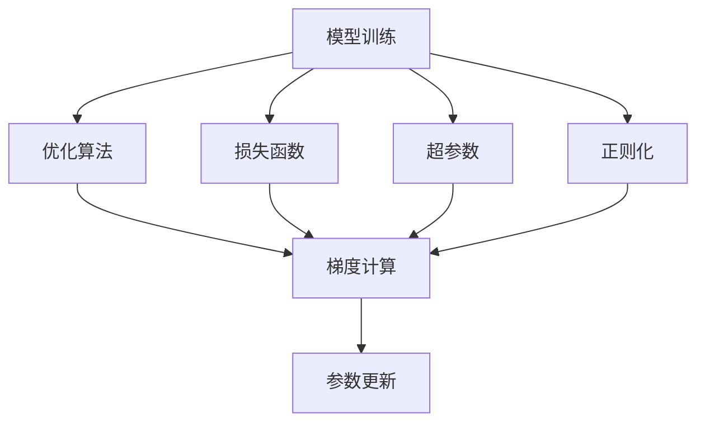

                 

# 模型训练与优化技术原理与代码实战案例讲解

## 1. 背景介绍

### 1.1 问题由来
随着深度学习技术的发展，模型训练和优化成为了人工智能研究的重要组成部分。模型训练涉及选择合适的损失函数、优化算法和超参数，以最小化损失函数并优化模型参数。优化算法如梯度下降、Adam等，通过迭代更新模型参数来逼近最优解。然而，模型训练的复杂度不断增加，模型规模扩大，优化问题变得尤为困难。

### 1.2 问题核心关键点
模型训练和优化技术是人工智能应用的核心，通过合理选择模型架构和优化算法，可以显著提升模型的性能和训练速度。优化算法的有效性直接影响模型的收敛速度和稳定性和泛化能力。常见的优化算法有梯度下降、Adam、RMSprop、Adagrad等。选择合适的超参数如学习率、批量大小、迭代次数等，对模型的最终性能也有重要影响。

### 1.3 问题研究意义
研究模型训练与优化技术，有助于提高模型的性能和训练效率，加速人工智能应用的开发和落地。同时，优化的模型能够更好地适应不同的数据分布和应用场景，提升系统的可靠性和鲁棒性。

## 2. 核心概念与联系

### 2.1 核心概念概述

为更好地理解模型训练与优化技术，本节将介绍几个关键概念：

- **模型训练**：通过迭代更新模型参数，最小化损失函数的过程。
- **优化算法**：如梯度下降、Adam等，用于计算和更新模型参数的算法。
- **超参数**：如学习率、批量大小、迭代次数等，需要手动设置的参数。
- **损失函数**：用于衡量模型预测结果与真实标签之间的差异，如均方误差、交叉熵等。
- **正则化**：如L1正则、L2正则，用于防止模型过拟合的技术。
- **学习率衰减**：在训练过程中逐渐减小学习率，提高训练稳定性。

这些概念之间的联系可以用以下Mermaid流程图来展示：



这个流程图展示了模型训练和优化技术的基本流程。模型训练通过优化算法来计算梯度，并根据损失函数和正则化等超参数来更新模型参数。

### 2.2 概念间的关系

这些核心概念之间存在着紧密的联系，形成了模型训练和优化技术的完整生态系统。下面是一些关键的联系：

- **损失函数与优化算法**：损失函数指定了模型训练的目标，优化算法通过计算梯度并更新参数来最小化损失函数。
- **超参数与优化算法**：超参数对优化算法的行为有重要影响，如学习率、批量大小等。
- **正则化与优化算法**：正则化技术可以限制模型的复杂度，防止过拟合，从而提高优化算法的收敛速度和模型泛化能力。

## 3. 核心算法原理 & 具体操作步骤

### 3.1 算法原理概述

模型训练与优化技术的核心在于选择合适的损失函数、优化算法和超参数，通过迭代更新模型参数，最小化损失函数。常见的损失函数有均方误差、交叉熵等，用于衡量模型预测结果与真实标签之间的差异。优化算法如梯度下降、Adam等，通过计算梯度并更新模型参数，最小化损失函数。超参数的选择如学习率、批量大小、迭代次数等，对模型的最终性能有重要影响。正则化技术如L1正则、L2正则，用于防止模型过拟合，提高模型的泛化能力。

### 3.2 算法步骤详解

模型训练与优化的基本步骤包括：

**Step 1: 准备数据**
- 收集训练数据、验证数据和测试数据，并分为训练集和验证集。
- 对数据进行预处理，如归一化、标准化、数据增强等。

**Step 2: 设计模型架构**
- 选择合适的模型架构，如卷积神经网络(CNN)、循环神经网络(RNN)、深度神经网络(DNN)等。
- 确定模型层数、每层神经元个数、激活函数等参数。

**Step 3: 选择损失函数**
- 根据任务类型选择合适的损失函数，如均方误差、交叉熵等。
- 对于分类任务，交叉熵损失函数较为常用。

**Step 4: 选择优化算法**
- 选择适合的优化算法，如梯度下降、Adam、RMSprop等。
- 设置优化算法的参数，如学习率、批量大小、迭代次数等。

**Step 5: 训练模型**
- 对模型进行训练，记录训练过程中的损失函数值和参数变化。
- 使用验证集评估模型的性能，防止过拟合。

**Step 6: 模型优化**
- 根据验证集的表现调整超参数，如学习率衰减、正则化强度等。
- 选择适当的模型架构和优化算法，提高模型的性能。

**Step 7: 模型评估**
- 在测试集上评估模型的性能，评估指标包括准确率、精确率、召回率、F1分数等。

**Step 8: 模型应用**
- 将训练好的模型应用于实际问题，进行预测和推理。

### 3.3 算法优缺点

**优点**：
- 模型训练和优化技术能够显著提升模型的性能，减少训练时间。
- 通过选择合适的优化算法和超参数，可以防止模型过拟合，提高模型的泛化能力。
- 模型训练技术可以应用于各种深度学习任务，如图像识别、自然语言处理、语音识别等。

**缺点**：
- 训练过程中需要大量的计算资源和数据，成本较高。
- 超参数的选择和调整较为复杂，需要丰富的经验和专业知识。
- 模型的性能和泛化能力受到训练数据的质量和数量影响，获取高质量的数据成本较高。

### 3.4 算法应用领域

模型训练与优化技术广泛应用于各种深度学习任务中，如图像识别、自然语言处理、语音识别等。以下是一些常见的应用场景：

- **图像识别**：如分类、检测、分割等任务。通过训练卷积神经网络模型，可以实现高精度的图像识别。
- **自然语言处理**：如文本分类、情感分析、机器翻译等任务。通过训练循环神经网络或Transformer模型，可以实现高质量的自然语言处理。
- **语音识别**：如自动语音识别(ASR)、语音合成(TTS)等任务。通过训练循环神经网络或卷积神经网络模型，可以实现高效的语音识别和合成。

## 4. 数学模型和公式 & 详细讲解 & 举例说明

### 4.1 数学模型构建

模型训练与优化技术的数学模型通常包括以下部分：

- **模型表示**：如卷积神经网络、循环神经网络、Transformer等。
- **损失函数**：如均方误差、交叉熵等。
- **优化算法**：如梯度下降、Adam等。
- **正则化**：如L1正则、L2正则等。

以一个简单的线性回归模型为例，数学模型可以表示为：

$$
\hat{y} = \theta^T x + b
$$

其中 $x$ 为输入特征，$\theta$ 为模型参数，$b$ 为偏置项，$\hat{y}$ 为预测结果。

### 4.2 公式推导过程

以线性回归模型的梯度下降算法为例，公式推导如下：

**目标函数**：
$$
\mathcal{L}(\theta) = \frac{1}{2N}\sum_{i=1}^N (y_i - \hat{y_i})^2
$$

**梯度计算**：
$$
\frac{\partial \mathcal{L}(\theta)}{\partial \theta} = \frac{1}{N}\sum_{i=1}^N (y_i - \hat{y_i}) x_i
$$

**参数更新**：
$$
\theta \leftarrow \theta - \eta \frac{\partial \mathcal{L}(\theta)}{\partial \theta}
$$

其中 $\eta$ 为学习率，控制参数更新的步长。通过迭代计算梯度并更新参数，最小化损失函数。

### 4.3 案例分析与讲解

以一个简单的手写数字识别任务为例，分析模型训练与优化技术的实际应用。假设我们使用MNIST数据集进行训练，数据集包含60000张28x28的灰度图像和对应的数字标签。

**数据准备**：
- 将图像数据归一化到[0,1]区间。
- 将标签数据转换为one-hot编码。

**模型设计**：
- 使用一个简单的卷积神经网络模型，包括两个卷积层、两个池化层和一个全连接层。
- 设置批量大小为64，迭代次数为100次。

**损失函数和优化算法选择**：
- 选择交叉熵损失函数和Adam优化算法。
- 设置学习率为0.001。

**模型训练**：
- 在训练过程中，记录损失函数值和参数变化。
- 在验证集上评估模型性能，防止过拟合。

**模型优化**：
- 根据验证集的表现调整学习率，选择适当的正则化强度。
- 使用模型剪枝、权重共享等技术，优化模型结构。

**模型评估**：
- 在测试集上评估模型性能，评估指标包括准确率、精确率、召回率等。

**模型应用**：
- 将训练好的模型应用于实际问题，进行预测和推理。

## 5. 项目实践：代码实例和详细解释说明

### 5.1 开发环境搭建

在进行模型训练与优化实践前，我们需要准备好开发环境。以下是使用Python进行TensorFlow开发的环境配置流程：

1. 安装Anaconda：从官网下载并安装Anaconda，用于创建独立的Python环境。

2. 创建并激活虚拟环境：
```bash
conda create -n tf-env python=3.8 
conda activate tf-env
```

3. 安装TensorFlow：根据CUDA版本，从官网获取对应的安装命令。例如：
```bash
conda install tensorflow==2.8.0 -c tensorflow -c conda-forge
```

4. 安装各类工具包：
```bash
pip install numpy pandas scikit-learn matplotlib tqdm jupyter notebook ipython
```

完成上述步骤后，即可在`tf-env`环境中开始模型训练与优化实践。

### 5.2 源代码详细实现

下面我们以一个简单的线性回归模型为例，给出使用TensorFlow进行模型训练与优化的PyTorch代码实现。

```python
import tensorflow as tf
import numpy as np
import matplotlib.pyplot as plt

# 准备数据
x = np.random.randn(100, 1)
y = 2 * x + np.random.randn(100, 1)

# 定义模型
def linear_model(x):
    W = tf.Variable(tf.random.normal([1, 1]))
    b = tf.Variable(tf.random.normal([1]))
    return tf.matmul(x, W) + b

# 定义损失函数
def loss_function(y_true, y_pred):
    mse = tf.reduce_mean(tf.square(y_true - y_pred))
    return mse

# 定义优化器
def optimizer_function():
    return tf.optimizers.Adam(learning_rate=0.01)

# 训练模型
def train_model(x, y):
    with tf.GradientTape() as tape:
        y_pred = linear_model(x)
        loss = loss_function(y, y_pred)
    gradients = tape.gradient(loss, [W, b])
    optimizer.apply_gradients(zip(gradients, [W, b]))
    return loss

# 训练过程
epochs = 1000
batch_size = 64

for epoch in range(epochs):
    for i in range(0, len(x), batch_size):
        x_batch = x[i:i+batch_size]
        y_batch = y[i:i+batch_size]
        loss = train_model(x_batch, y_batch)
        if (epoch + 1) % 100 == 0:
            print("Epoch {}: Loss = {}".format(epoch + 1, loss.numpy()))
    
    plt.plot(range(1, epochs + 1), [loss.numpy() for loss in loss_list])
    plt.show()

```

### 5.3 代码解读与分析

让我们再详细解读一下关键代码的实现细节：

**数据准备**：
- 使用NumPy生成随机数据，模拟手写数字识别任务中的图像和标签。

**模型定义**：
- 定义一个简单的线性回归模型，包括一个线性层。

**损失函数和优化器定义**：
- 使用均方误差损失函数和Adam优化器。

**模型训练过程**：
- 使用梯度下降算法迭代更新模型参数。
- 使用损失函数计算每个批次的损失，并记录损失变化。

**可视化**：
- 使用Matplotlib绘制损失函数随迭代次数的变化图，帮助可视化训练过程。

## 6. 实际应用场景

### 6.1 智能推荐系统

智能推荐系统已经成为互联网产品中的重要组成部分。通过训练深度学习模型，可以实现个性化推荐，提升用户体验。推荐系统一般包括三个部分：用户画像、物品特征、推荐算法。其中，推荐算法部分通过训练深度学习模型，实现对用户和物品特征的相似度计算，并输出推荐结果。

### 6.2 自然语言处理

自然语言处理是人工智能领域的重要方向之一，包括文本分类、情感分析、机器翻译等任务。通过训练深度学习模型，可以实现高精度的自然语言处理。在文本分类任务中，可以使用循环神经网络或Transformer模型进行训练，输出分类结果。

### 6.3 图像识别

图像识别是人工智能领域的另一个重要方向，包括图像分类、物体检测、人脸识别等任务。通过训练深度学习模型，可以实现高精度的图像识别。在图像分类任务中，可以使用卷积神经网络模型进行训练，输出分类结果。

### 6.4 未来应用展望

随着深度学习技术的不断发展，模型训练与优化技术将在更多领域得到应用，为各行各业带来变革性影响。未来，深度学习将在医疗、金融、制造等领域大放异彩，帮助解决实际问题。

## 7. 工具和资源推荐

### 7.1 学习资源推荐

为了帮助开发者系统掌握模型训练与优化技术的理论基础和实践技巧，这里推荐一些优质的学习资源：

1. 《深度学习》系列课程：由斯坦福大学、Coursera等知名机构提供的深度学习课程，涵盖深度学习的基础知识和高级技巧。

2. 《Python深度学习》书籍：深度学习领域的经典书籍，涵盖模型训练与优化的基本概念和实现细节。

3. TensorFlow官方文档：TensorFlow官方文档提供了全面的API和示例代码，方便开发者快速上手。

4. PyTorch官方文档：PyTorch官方文档提供了丰富的API和示例代码，方便开发者快速上手。

5. Kaggle竞赛：Kaggle提供了大量深度学习竞赛，帮助开发者实践和应用所学知识。

通过对这些资源的学习实践，相信你一定能够快速掌握模型训练与优化技术的精髓，并用于解决实际的深度学习问题。

### 7.2 开发工具推荐

高效的开发离不开优秀的工具支持。以下是几款用于深度学习开发和优化的常用工具：

1. TensorFlow：由Google主导开发的深度学习框架，支持分布式计算和自动微分，适合大规模工程应用。

2. PyTorch：Facebook开发的深度学习框架，支持动态计算图，适合快速迭代研究。

3. Keras：高层次的深度学习框架，适合快速搭建模型和进行实验。

4. TensorBoard：TensorFlow配套的可视化工具，实时监测模型训练状态，并提供丰富的图表呈现方式。

5. Weights & Biases：模型训练的实验跟踪工具，记录和可视化模型训练过程中的各项指标，方便对比和调优。

合理利用这些工具，可以显著提升深度学习模型的开发效率，加快创新迭代的步伐。

### 7.3 相关论文推荐

深度学习领域的研究进展迅速，以下是几篇奠基性的相关论文，推荐阅读：

1. AlexNet：ImageNet大规模视觉识别挑战赛的冠军，提出了卷积神经网络结构。

2. ResNet：深度残差网络，解决了深度神经网络中的梯度消失问题。

3. InceptionNet：Google提出的深度网络结构，提高了卷积神经网络的性能。

4. LSTM：长短期记忆网络，解决了循环神经网络中的梯度消失问题。

5. Transformer：Google提出的自注意力机制，提高了自然语言处理的性能。

这些论文代表了大模型训练与优化技术的发展脉络。通过学习这些前沿成果，可以帮助研究者把握学科前进方向，激发更多的创新灵感。

除上述资源外，还有一些值得关注的前沿资源，帮助开发者紧跟深度学习模型的最新进展，例如：

1. arXiv论文预印本：人工智能领域最新研究成果的发布平台，包括大量尚未发表的前沿工作，学习前沿技术的必读资源。

2. 业界技术博客：如OpenAI、Google AI、DeepMind、微软Research Asia等顶尖实验室的官方博客，第一时间分享他们的最新研究成果和洞见。

3. 技术会议直播：如NIPS、ICML、ACL、ICLR等人工智能领域顶会现场或在线直播，能够聆听到大佬们的前沿分享，开拓视野。

4. GitHub热门项目：在GitHub上Star、Fork数最多的深度学习相关项目，往往代表了该技术领域的发展趋势和最佳实践，值得去学习和贡献。

5. 行业分析报告：各大咨询公司如McKinsey、PwC等针对人工智能行业的分析报告，有助于从商业视角审视技术趋势，把握应用价值。

总之，对于深度学习模型训练与优化技术的学习和实践，需要开发者保持开放的心态和持续学习的意愿。多关注前沿资讯，多动手实践，多思考总结，必将收获满满的成长收益。

## 8. 总结：未来发展趋势与挑战

### 8.1 总结

本文对模型训练与优化技术进行了全面系统的介绍。首先阐述了模型训练和优化技术的核心概念和应用场景，明确了其在人工智能应用中的重要地位。其次，从原理到实践，详细讲解了模型训练与优化技术的数学原理和关键步骤，给出了模型训练与优化的完整代码实例。同时，本文还探讨了模型训练与优化技术在智能推荐系统、自然语言处理、图像识别等众多领域的应用前景，展示了其巨大的潜力。此外，本文精选了模型训练与优化技术的各类学习资源，力求为读者提供全方位的技术指引。

通过本文的系统梳理，可以看到，模型训练与优化技术正在成为人工智能应用的重要范式，极大地拓展了深度学习模型的应用边界，催生了更多的落地场景。受益于深度学习模型的不断发展，模型训练与优化技术必将得到更加广泛的应用，为人工智能技术的发展带来新的突破。

### 8.2 未来发展趋势

展望未来，模型训练与优化技术将呈现以下几个发展趋势：

1. 模型规模持续增大。随着算力成本的下降和数据规模的扩张，深度学习模型的参数量还将持续增长。超大批次的训练和推理也将成为可能，进一步提升模型的性能。

2. 优化算法日趋多样。除了传统的梯度下降、Adam等优化算法，未来会涌现更多参数高效的优化算法，如Adafactor、AdamW等，在节省计算资源的同时保证模型的收敛速度和精度。

3. 模型通用性增强。通过预训练和微调，深度学习模型将具备更强的跨领域迁移能力，逐步迈向通用人工智能(AGI)的目标。

4. 分布式训练成为常态。随着模型规模的增大，分布式训练成为必要，通过多机多卡并行训练，提高训练效率。

5. 自适应学习成为热点。通过引入自适应学习算法，如自适应梯度算法、自适应权重衰减等，提高模型的鲁棒性和泛化能力。

6. 端到端优化成为趋势。通过引入端到端优化算法，如混合精度训练、量化加速等，提升模型在移动设备等资源受限环境下的性能。

以上趋势凸显了模型训练与优化技术的广阔前景。这些方向的探索发展，必将进一步提升深度学习模型的性能和训练效率，为人工智能技术的发展带来新的突破。

### 8.3 面临的挑战

尽管深度学习模型训练与优化技术已经取得了瞩目成就，但在迈向更加智能化、普适化应用的过程中，它仍面临着诸多挑战：

1. 数据分布的稳定性。随着数据规模的增大，模型训练的稳定性需要进一步提高，防止数据分布的剧烈变化导致模型性能波动。

2. 计算资源的高需求。大规模深度学习模型的训练和推理需要大量的计算资源，如何降低计算成本是当前的重要挑战。

3. 模型的可解释性。深度学习模型的决策过程通常缺乏可解释性，难以对其进行分析和调试。如何在保证性能的同时，提高模型的可解释性，将是重要的研究课题。

4. 模型的安全性。深度学习模型可能学习到有害信息，对模型进行安全性评估和防范是必要的。如何确保模型输出的安全性，也将是重要的研究方向。

5. 模型的公平性。深度学习模型可能存在偏见，如何消除模型偏见，提升模型的公平性，也是重要的研究方向。

6. 模型的鲁棒性。模型面对不同分布的测试数据时，泛化性能往往不够理想。如何提高模型的鲁棒性，避免灾难性遗忘，还需要更多理论和实践的积累。

7. 模型的高效性。深度学习模型的推理速度较慢，如何在保证性能的同时，提高模型的推理速度，优化资源占用，将是重要的优化方向。

这些挑战需要学界和产业界共同努力，积极应对并寻求突破，才能使深度学习模型训练与优化技术走向成熟的实用阶段。

### 8.4 未来突破

面对深度学习模型训练与优化所面临的种种挑战，未来的研究需要在以下几个方面寻求新的突破：

1. 探索无监督和半监督学习。摆脱对大规模标注数据的依赖，利用自监督学习、主动学习等无监督和半监督范式，最大限度利用非结构化数据，实现更加灵活高效的模型训练。

2. 研究参数高效和计算高效的优化算法。开发更加参数高效的优化算法，在固定大部分预训练参数的同时，只更新极少量的任务相关参数。同时优化模型的计算图，减少前向传播和反向传播的资源消耗，实现更加轻量级、实时性的部署。

3. 引入更多先验知识。将符号化的先验知识，如知识图谱、逻辑规则等，与神经网络模型进行巧妙融合，引导模型训练过程学习更准确、合理的神经网络结构。

4. 结合因果分析和博弈论工具。将因果分析方法引入模型训练过程，识别出模型决策的关键特征，增强模型输出的因果性和逻辑性。借助博弈论工具刻画人机交互过程，主动探索并规避模型的脆弱点，提高系统稳定性。

5. 纳入伦理道德约束。在模型训练目标中引入伦理导向的评估指标，过滤和惩罚有偏见、有害的输出倾向。同时加强人工干预和审核，建立模型行为的监管机制，确保输出符合人类价值观和伦理道德。

这些研究方向的探索，必将引领深度学习模型训练与优化技术迈向更高的台阶，为构建安全、可靠、可解释、可控的智能系统铺平道路。面向未来，深度学习模型训练与优化技术还需要与其他人工智能技术进行更深入的融合，如知识表示、因果推理、强化学习等，多路径协同发力，共同推动深度学习技术的发展。只有勇于创新、敢于突破，才能不断拓展深度学习模型的边界，让智能技术更好地造福人类社会。

## 9. 附录：常见问题与解答

**Q1: 深度学习模型的性能受哪些因素影响？**

A: 深度学习模型的性能受到多个因素的影响，主要包括：

1. 数据质量：高质量、充分的数据是深度学习模型训练的基础。数据分布的均衡性和多样性对模型性能有很大影响。

2. 模型结构：模型的深度、宽度和复杂度对模型性能有重要影响。设计合理的模型结构可以提升模型的性能和泛化能力。

3. 优化算法：优化算法的收敛速度和精度对模型性能有很大影响。合适的优化算法可以加快模型收敛，提高模型泛化能力。

4. 超参数设置：学习率、批量大小、迭代次数等超参数对模型性能有重要影响。合适的超参数设置可以提升模型性能。

5. 正则化技术：正则化技术如L1正则、L2正则等可以有效防止模型过拟合，提高模型泛化能力。

6. 数据增强：数据增强可以扩充训练集，提高模型泛化能力。

7. 模型剪枝：模型剪枝可以减少模型参数，提升模型推理速度和资源利用率。

8. 模型融合：模型融合可以将多个模型的优点结合起来，提升模型性能和泛化能力。

**Q2: 如何提高深度学习模型的鲁棒性？**

A: 提高深度学习模型的鲁棒性可以从以下几个方面入手：

1. 数据增强：通过扩充训练集，使用数据增强技术如旋转、缩放、随机裁剪等，增强模型对输入的鲁棒性。

2. 对抗训练：使用对抗样本训练模型，使其能够鲁棒地抵御噪声和攻击。

3. 正则化技术：使用L1正则、L2正则、Dropout等技术，防止模型过拟合，提高模型鲁棒性。

4. 自适应学习：引入自适应学习算法，如自适应梯度算法、自适应权重衰减等，提高模型鲁棒性。

5. 多模型集成：使用多个模型的集成学习，结合多个模型的优点，提升模型鲁棒性。

6. 端到端优化：使用端到端优化算法，如混合精度训练、量化加速等，提高模型在资源受限环境下的性能。

7. 动态架构：使用动态架构，如RNN、Transformer等，提高模型对不同输入的鲁棒性。

8.

