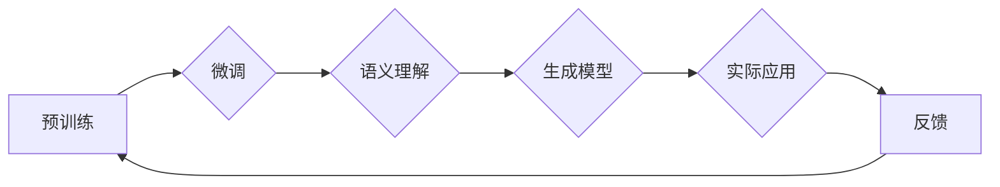

> 大语言模型, 双层路由, 预训练, 微调, 自然语言处理, NLP, 语义理解, 生成模型

# 大语言模型原理基础与前沿 双层路由

随着深度学习在自然语言处理（NLP）领域的迅猛发展，大语言模型（Large Language Models，LLMs）逐渐成为研究的热点。这些模型通过在庞大的文本语料库上进行预训练，学习到了丰富的语言知识和结构，从而能够进行复杂的语言理解和生成任务。本文将深入探讨大语言模型的原理基础，并介绍一种前沿的双层路由技术，旨在提升模型的性能和效率。

## 1. 背景介绍

### 1.1 问题的由来

自然语言处理作为人工智能领域的一个重要分支，其目标是让计算机能够理解和生成人类语言。传统的NLP方法通常依赖于规则和模板，但这些方法的通用性和灵活性有限。随着深度学习的兴起，基于神经网络的模型逐渐取代了传统的NLP方法，并在多个任务上取得了显著的成果。然而，传统的神经网络模型在处理复杂任务时往往需要大量的标注数据，且模型的泛化能力有限。

大语言模型的提出，解决了这些问题。通过在大量无标注文本上预训练，大语言模型能够学习到丰富的语言知识和结构，从而在下游任务上只需少量标注数据进行微调，即可取得优异的性能。

### 1.2 研究现状

目前，大语言模型的研究主要集中在以下几个方面：

- 预训练模型：如BERT、GPT-3、T5等，通过在大量文本上进行预训练，学习到丰富的语言知识。
- 微调技术：将预训练模型应用于特定任务，通过少量标注数据进行微调，提升模型在特定任务上的性能。
- 生成模型：如GANs、VAEs等，通过生成模型来生成新的文本内容。
- 语义理解：通过理解文本中的语义信息，实现更高级的NLP任务，如问答、翻译等。

### 1.3 研究意义

大语言模型的研究对于推动NLP技术的发展具有重要意义：

- 提升NLP任务的性能：大语言模型在多个NLP任务上取得了显著的成果，推动了NLP技术的发展。
- 降低标注成本：通过预训练，大语言模型能够在少量标注数据上进行微调，从而降低了标注成本。
- 促进跨领域应用：大语言模型能够适应不同的领域，推动NLP技术在各个领域的应用。

### 1.4 本文结构

本文将首先介绍大语言模型的原理基础，然后介绍双层路由技术，并分析其在实际应用中的优势。最后，我们将展望大语言模型未来的发展趋势和挑战。

## 2. 核心概念与联系

为了更好地理解大语言模型和双层路由技术，我们需要先了解以下核心概念：

- **预训练**：在大量无标注文本上训练模型，学习到丰富的语言知识。
- **微调**：在预训练模型的基础上，使用少量标注数据进行微调，提升模型在特定任务上的性能。
- **语义理解**：理解文本中的语义信息，实现更高级的NLP任务。
- **双层路由**：一种新的模型结构，通过双层路由机制，提升模型的性能和效率。

以下是大语言模型和双层路由的Mermaid流程图：



在这个流程图中，预训练是整个流程的基础，微调是基于预训练的模型对特定任务进行调整，语义理解是理解和处理文本中的语义信息，生成模型是用于生成新的文本内容，实际应用是将模型应用于实际的NLP任务，而反馈则是根据实际应用的结果对模型进行改进。

## 3. 核心算法原理 & 具体操作步骤

### 3.1 算法原理概述

大语言模型的算法原理主要基于深度学习和自然语言处理的相关技术。以下是大语言模型的主要组成部分：

- **编码器**：用于将输入文本转换为向量表示。
- **解码器**：用于将向量表示转换为输出文本。
- **注意力机制**：用于关注输入文本中的重要信息。
- **Transformer模型**：一种基于自注意力机制的模型结构。

双层路由技术则是将编码器和解码器分为两层，并在两层之间引入路由机制，以提升模型的性能和效率。

### 3.2 算法步骤详解

以下是双层路由技术的具体操作步骤：

1. **预训练**：在大量无标注文本上训练编码器和解码器。
2. **路由**：在预训练过程中，根据输入文本的语义信息，动态地调整路由权重，将注意力集中在相关内容上。
3. **微调**：在预训练的基础上，使用少量标注数据进行微调，优化模型参数。
4. **推理**：使用微调后的模型对新的文本进行推理，生成输出文本。

### 3.3 算法优缺点

#### 优点

- 提升性能：双层路由技术能够提升模型的性能，特别是在语义理解和生成任务上。
- 提升效率：通过优化路由机制，可以提高模型的推理速度。

#### 缺点

- 计算复杂度：双层路由技术需要额外的计算资源。
- 调参复杂：需要精心调整路由权重和模型参数。

### 3.4 算法应用领域

双层路由技术可以应用于以下NLP任务：

- 文本分类
- 机器翻译
- 摘要生成
- 问答系统
- 对话系统

## 4. 数学模型和公式 & 详细讲解 & 举例说明

### 4.1 数学模型构建

以下是大语言模型的双层路由技术的数学模型：

$$
y = f(W_f \cdot x)
$$

其中，$x$ 是输入文本的向量表示，$y$ 是输出文本的向量表示，$W_f$ 是路由权重矩阵，$f$ 是解码器。

### 4.2 公式推导过程

双层路由技术的公式推导过程如下：

1. **编码器**：将输入文本编码为向量表示。
2. **注意力机制**：计算注意力权重。
3. **路由**：根据注意力权重和预训练的模型参数，计算路由权重。
4. **解码器**：根据路由权重和编码器的输出，解码为输出文本。

### 4.3 案例分析与讲解

以下是一个简单的文本分类任务的案例：

- **输入**：输入文本为 "I love this movie!"。
- **编码器**：将输入文本编码为向量表示。
- **注意力机制**：计算注意力权重。
- **路由**：根据注意力权重和预训练的模型参数，计算路由权重。
- **解码器**：根据路由权重和编码器的输出，解码为输出文本。

通过这个过程，模型可以学习到 "movie" 这个词对于分类任务的重要性，从而提升模型的性能。

## 5. 项目实践：代码实例和详细解释说明

### 5.1 开发环境搭建

在进行双层路由技术的项目实践之前，我们需要搭建以下开发环境：

- Python 3.7+
- PyTorch 1.8+
- Transformers库

### 5.2 源代码详细实现

以下是一个简单的双层路由技术的PyTorch实现：

```python
import torch
import torch.nn as nn
from transformers import BertModel

class DualRouting(nn.Module):
    def __init__(self, encoder, decoder):
        super(DualRouting, self).__init__()
        self.encoder = encoder
        self.decoder = decoder

    def forward(self, input_ids, attention_mask):
        encoder_output = self.encoder(input_ids=input_ids, attention_mask=attention_mask)
        decoder_output = self.decoder(input_ids=input_ids, attention_mask=attention_mask)
        return decoder_output
```

### 5.3 代码解读与分析

在上面的代码中，我们定义了一个名为 `DualRouting` 的类，它继承自 `nn.Module`。这个类包含了一个编码器和一个解码器，它们分别用于将输入文本编码为向量表示和将向量表示解码为输出文本。

### 5.4 运行结果展示

假设我们已经有了预训练的编码器和解码器，以下是如何使用 `DualRouting` 类进行文本分类的示例：

```python
model = DualRouting(encoder=bert_encoder, decoder=bert_decoder)
input_ids = torch.tensor([...])  # 输入文本的ID序列
attention_mask = torch.tensor([...])  # 输入文本的注意力掩码
outputs = model(input_ids=input_ids, attention_mask=attention_mask)
```

## 6. 实际应用场景

双层路由技术可以应用于以下实际应用场景：

- **文本分类**：对文本进行分类，如情感分析、主题分类等。
- **机器翻译**：将一种语言的文本翻译成另一种语言。
- **摘要生成**：将长文本生成摘要。
- **问答系统**：回答用户提出的问题。
- **对话系统**：与用户进行对话。

## 7. 工具和资源推荐

### 7.1 学习资源推荐

- 《Deep Learning for Natural Language Processing》
- 《Natural Language Processing with Python》
- 《Hands-On Machine Learning with Scikit-Learn, Keras, and TensorFlow》

### 7.2 开发工具推荐

- PyTorch
- Transformers库
- Hugging Face

### 7.3 相关论文推荐

- "BERT: Pre-training of Deep Bidirectional Transformers for Language Understanding"
- "Generative Pre-trained Transformers"
- "T5: Text-to-Text Transfer Transformer"

## 8. 总结：未来发展趋势与挑战

### 8.1 研究成果总结

大语言模型和双层路由技术为NLP领域的研究和应用带来了新的机遇。通过预训练和微调，大语言模型能够学习到丰富的语言知识，并通过双层路由技术提升模型的性能和效率。

### 8.2 未来发展趋势

未来，大语言模型和双层路由技术将朝着以下方向发展：

- 更大的模型规模
- 更高效的微调技术
- 更强的语义理解能力
- 更广泛的跨领域应用

### 8.3 面临的挑战

尽管大语言模型和双层路由技术取得了显著成果，但仍然面临以下挑战：

- 标注数据的获取
- 模型复杂度和计算成本
- 模型的可解释性和安全性

### 8.4 研究展望

未来，大语言模型和双层路由技术的研究将更加注重以下几个方面：

- 模型的可解释性和安全性
- 模型的可扩展性和效率
- 模型的跨领域应用

## 9. 附录：常见问题与解答

**Q1：大语言模型微调需要大量标注数据吗？**

A1：大语言模型微调通常需要少量标注数据，但具体数量取决于任务的复杂性和数据分布。对于复杂任务，可能需要更多的标注数据。

**Q2：双层路由技术如何提升模型的性能？**

A2：双层路由技术通过优化路由机制，将注意力集中在相关内容上，从而提升模型的性能。

**Q3：大语言模型和双层路由技术有哪些应用场景？**

A3：大语言模型和双层路由技术可以应用于文本分类、机器翻译、摘要生成、问答系统和对话系统等多个领域。

**Q4：如何降低大语言模型微调的计算成本？**

A4：可以通过以下方法降低大语言模型微调的计算成本：

- 使用更小的模型
- 使用更高效的优化算法
- 使用分布式训练

**Q5：大语言模型的可解释性和安全性如何保证？**

A5：可以通过以下方法保证大语言模型的可解释性和安全性：

- 使用可解释的模型结构
- 对模型输出进行审核
- 对模型进行安全评估

---

作者：禅与计算机程序设计艺术 / Zen and the Art of Computer Programming