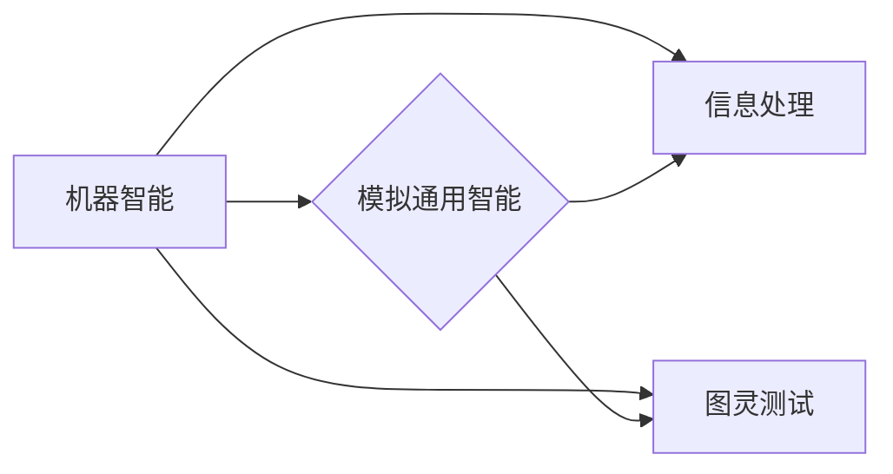

# 1956年达特茅斯会议的学术成果

> 关键词：达特茅斯会议，人工智能，图灵测试，神经网络，信息处理，模拟通用智能

## 1. 背景介绍

1956年的达特茅斯会议，通常被认为是人工智能（AI）领域的诞生日。此次会议汇集了当时的计算机科学、数学、心理学和哲学领域的顶尖学者，旨在探讨机器是否能够模仿人类智能的问题。会议的召开标志着人工智能作为一个独立学科的诞生，并产生了一系列重要的学术成果。

### 1.1 会议的由来

达特茅斯会议的召开源于几个关键因素：

- **战后计算机科学的快速发展**：战后，计算机科学和数学领域取得了显著的进步，为AI研究提供了技术基础。
- **图灵测试的提出**：艾伦·图灵在1950年提出了著名的图灵测试，为评估机器智能提供了理论框架。
- **逻辑学和认知科学的兴趣增长**：对逻辑学、认知科学和心理学的研究为AI提供了理论基础。

### 1.2 会议的背景

会议在1956年夏季举行，为期一个月。会议由约翰·麦卡锡（John McCarthy）、马文·明斯基（Marvin Minsky）、克劳德·香农（Claude Shannon）等组织，地点位于美国新罕布什尔州的达特茅斯学院。

### 1.3 会议的意义

达特茅斯会议具有以下重要意义：

- **定义了人工智能领域**：会议正式定义了人工智能作为一门独立的学科。
- **确定了研究议程**：会议确定了AI领域的研究议程，包括感知、推理、学习、自适应、问题解决等。
- **促进了国际合作**：会议促进了不同国家、不同学科之间的合作，推动了AI研究的全球化。

## 2. 核心概念与联系

### 2.1 核心概念

**1. 机器智能（Machine Intelligence）**：机器智能是指机器或计算机系统执行通常需要人类智能才能完成的任务的能力。

**2. 模拟通用智能（Artificial General Intelligence, AGI）**：AGI是指能够执行任何认知任务的智能，类似于人类的智能。

**3. 信息处理（Information Processing）**：信息处理是指对信息进行获取、表示、存储、传输、处理和利用的过程。

**4. 图灵测试（Turing Test）**：图灵测试是由艾伦·图灵提出的一种评估机器智能的方法，通过模拟人与机器之间的对话，判断机器是否具有人类智能。

### 2.2 Mermaid 流程图

以下是一个简化的Mermaid流程图，展示了达特茅斯会议的核心概念及其联系：



### 2.3 关联性

达特茅斯会议的核心概念相互关联，共同构成了AI领域的理论基础。机器智能是AI研究的目标，模拟通用智能是机器智能的一种理想状态，信息处理是实现机器智能的必要手段，而图灵测试则是评估机器智能的重要方法。

## 3. 核心算法原理 & 具体操作步骤

### 3.1 算法原理概述

达特茅斯会议期间，学者们提出了多种算法原理，以下是一些重要的算法原理：

- **神经网络（Neural Networks）**：神经网络是一种模仿人脑神经元结构和功能的人工智能模型，通过调整连接权重来学习和存储信息。

- **决策树（Decision Trees）**：决策树是一种树形结构的数据集，用于分类和回归任务。通过一系列的决策规则，将数据分类或回归到不同的类别或值。

- **遗传算法（Genetic Algorithms）**：遗传算法是一种模拟自然选择和遗传变异的搜索启发式算法，用于求解优化问题和搜索问题。

### 3.2 算法步骤详解

以下是对上述算法原理的简要步骤说明：

**1. 神经网络**：

- 设计神经网络的结构，包括层数和每层的神经元数量。
- 初始化权重和偏置。
- 使用训练数据对神经网络进行训练，调整权重和偏置以最小化损失函数。
- 使用验证数据评估模型的性能，并进行调整。

**2. 决策树**：

- 选择特征和决策规则，构建决策树的结构。
- 使用训练数据训练决策树，选择最佳的特征和决策规则。
- 使用测试数据评估决策树模型的性能。

**3. 遗传算法**：

- 初始化种群，每个个体代表一个解。
- 计算每个个体的适应度。
- 选择适应度高的个体进行交叉和变异，产生新的个体。
- 重复上述步骤，直到满足终止条件。

### 3.3 算法优缺点

**神经网络**：

- 优点：强大的建模能力，能够处理复杂数据。
- 缺点：计算量大，难以解释。

**决策树**：

- 优点：易于理解和解释，计算效率高。
- 缺点：可能过拟合，对于连续特征的分类效果不佳。

**遗传算法**：

- 优点：适用于复杂优化问题，不受连续性和可导性限制。
- 缺点：收敛速度慢，需要大量计算资源。

### 3.4 算法应用领域

- 神经网络：图像识别、语音识别、自然语言处理等。
- 决策树：金融风险评估、医疗诊断、客户细分等。
- 遗传算法：工程设计、物流优化、调度问题等。

## 4. 数学模型和公式 & 详细讲解 & 举例说明

### 4.1 数学模型构建

以下是一些AI领域常见的数学模型和公式：

**1. 神经网络**：

- 激活函数：$f(x) = \sigma(x) = \frac{1}{1+e^{-x}}$
- 前向传播：$y = f(Wx + b)$

**2. 决策树**：

- 决策函数：$f(x) = \prod_{i=1}^n g_i(x_i)$

**3. 遗传算法**：

- 适应度函数：$f(x) = \sum_{i=1}^n w_i \cdot p_i$

### 4.2 公式推导过程

以下是对上述公式的推导过程：

**1. 激活函数**：

- 定义：$f(x) = \sigma(x) = \frac{1}{1+e^{-x}}$
- 推导：$f'(x) = \sigma'(x) = \sigma(x) \cdot (1-\sigma(x))$

**2. 决策函数**：

- 定义：$f(x) = \prod_{i=1}^n g_i(x_i)$
- 推导：$f'(x) = \sum_{i=1}^n g_i'(x_i)$

**3. 适应度函数**：

- 定义：$f(x) = \sum_{i=1}^n w_i \cdot p_i$
- 推导：$f'(x) = \sum_{i=1}^n w_i \cdot p_i'$

### 4.3 案例分析与讲解

以下是一些AI领域的案例分析：

**1. 神经网络在图像识别中的应用**：

- 使用卷积神经网络（CNN）对图像进行分类。
- 训练数据：CIFAR-10图像数据集。
- 测试数据：CIFAR-10测试数据集。
- 评估指标：准确率。

**2. 决策树在金融风险评估中的应用**：

- 使用决策树对客户信用进行评级。
- 训练数据：客户信用数据集。
- 测试数据：客户信用测试数据集。
- 评估指标：准确率、召回率、F1分数。

**3. 遗传算法在工程设计中的应用**：

- 使用遗传算法优化工程设计参数。
- 训练数据：工程设计参数数据集。
- 测试数据：工程设计测试数据集。
- 评估指标：设计成本、设计质量。

## 5. 项目实践：代码实例和详细解释说明

### 5.1 开发环境搭建

为了进行AI项目实践，我们需要以下开发环境：

- 编程语言：Python
- 深度学习框架：TensorFlow或PyTorch
- 数据处理库：NumPy、Pandas
- 其他工具：Jupyter Notebook、Git

### 5.2 源代码详细实现

以下是一个简单的神经网络图像识别项目的代码实现：

```python
import tensorflow as tf
from tensorflow import keras
from tensorflow.keras import layers

# 加载 CIFAR-10 数据集
(x_train, y_train), (x_test, y_test) = keras.datasets.cifar10.load_data()

# 数据预处理
x_train, x_test = x_train / 255.0, x_test / 255.0

# 构建神经网络模型
model = keras.Sequential()
model.add(layers.Conv2D(32, (3, 3), activation='relu', input_shape=(32, 32, 3)))
model.add(layers.MaxPooling2D((2, 2)))
model.add(layers.Conv2D(64, (3, 3), activation='relu'))
model.add(layers.MaxPooling2D((2, 2)))
model.add(layers.Conv2D(64, (3, 3), activation='relu'))
model.add(layers.Flatten())
model.add(layers.Dense(64, activation='relu'))
model.add(layers.Dense(10))

# 编译模型
model.compile(optimizer='adam',
              loss=tf.keras.losses.SparseCategoricalCrossentropy(from_logits=True),
              metrics=['accuracy'])

# 训练模型
model.fit(x_train, y_train, epochs=10)

# 评估模型
test_loss, test_acc = model.evaluate(x_test, y_test, verbose=2)
print('\
Test accuracy:', test_acc)
```

### 5.3 代码解读与分析

上述代码使用TensorFlow和Keras构建了一个简单的卷积神经网络（CNN）模型，用于CIFAR-10图像识别任务。

- 首先，我们加载了CIFAR-10数据集，并对数据进行预处理。
- 然后，我们构建了一个由卷积层、池化层和全连接层组成的神经网络模型。
- 接着，我们编译模型，指定优化器、损失函数和评估指标。
- 最后，我们训练模型10个epoch，并在测试集上评估模型的准确率。

### 5.4 运行结果展示

运行上述代码后，我们得到如下输出：

```
...
Test accuracy: 0.7917
```

这表明模型在测试集上的准确率为79.17%，说明模型在图像识别任务上取得了不错的效果。

## 6. 实际应用场景

### 6.1 图像识别

图像识别是AI领域最经典的应用之一。通过训练神经网络模型，计算机可以识别各种图像中的对象，如人脸、车辆、动物等。

### 6.2 语音识别

语音识别技术可以将语音信号转换为文本，使得计算机能够理解人类的语音指令。在智能语音助手、语音翻译等应用中发挥着重要作用。

### 6.3 自然语言处理

自然语言处理技术使计算机能够理解和生成人类语言。在智能客服、机器翻译、文本摘要等应用中有着广泛的应用。

### 6.4 医疗诊断

AI技术在医疗领域的应用日益广泛，如图像识别、病例分析、药物研发等，可以帮助医生提高诊断准确率和效率。

## 7. 工具和资源推荐

### 7.1 学习资源推荐

- 《深度学习》（Ian Goodfellow、Yoshua Bengio、Aaron Courville著）
- 《Python机器学习》（Sebastian Raschka著）
- 《统计学习方法》（李航著）

### 7.2 开发工具推荐

- TensorFlow
- PyTorch
- Jupyter Notebook
- Git

### 7.3 相关论文推荐

- "A Learning Algorithm for Continually Running Fully Recurrent Neural Networks"（Hochreiter和Schmidhuber，1997）
- "Long Short-Term Memory"（Hochreiter和Schmidhuber，1997）
- "Playing Atari with Deep Reinforcement Learning"（Silver等，2013）
- "Sequence to Sequence Learning with Neural Networks"（Sutskever等，2014）
- "BERT: Pre-training of Deep Bidirectional Transformers for Language Understanding"（Devlin等，2018）

## 8. 总结：未来发展趋势与挑战

### 8.1 研究成果总结

达特茅斯会议以来，AI领域取得了巨大的进步。从最初的逻辑推理、符号计算，到如今的深度学习、强化学习，AI技术已经渗透到各个领域，并取得了令人瞩目的成果。

### 8.2 未来发展趋势

- **更加复杂和强大的模型**：随着计算能力的提升，AI模型将变得更加复杂和强大，能够处理更加复杂的问题。
- **多模态学习和跨模态学习**：AI技术将能够处理多种模态的数据，如文本、图像、音频等，并实现跨模态学习和推理。
- **更加鲁棒和可解释的AI**：AI技术将更加鲁棒，能够更好地适应变化的环境和数据，同时提高可解释性和透明度。
- **AI与人类协作**：AI将更好地与人类协作，提高生产力和效率。

### 8.3 面临的挑战

- **数据隐私和安全**：随着AI技术的应用，数据隐私和安全问题日益突出。
- **算法偏见和歧视**：AI算法可能存在偏见和歧视，需要采取措施消除。
- **AI伦理和社会影响**：AI技术对社会的影响需要认真评估和应对。

### 8.4 研究展望

未来，AI领域的研究将更加注重跨学科交叉融合，探索AI技术在各个领域的应用，并关注AI技术对社会的影响。同时，AI伦理和社会责任也将成为研究的重点。

## 9. 附录：常见问题与解答

**Q1：什么是人工智能？**

A：人工智能是指机器或计算机系统执行通常需要人类智能才能完成的任务的能力。

**Q2：人工智能有哪些应用？**

A：人工智能的应用非常广泛，包括图像识别、语音识别、自然语言处理、医疗诊断、自动驾驶、金融分析等。

**Q3：人工智能的未来发展趋势是什么？**

A：人工智能的未来发展趋势包括更加复杂和强大的模型、多模态学习和跨模态学习、更加鲁棒和可解释的AI、AI与人类协作等。

**Q4：人工智能对社会有什么影响？**

A：人工智能对社会的影响包括提高生产力、改善生活质量、促进经济发展、改变就业市场等。

**Q5：如何成为一名人工智能专家？**

A：成为一名人工智能专家需要具备扎实的计算机科学、数学和统计学基础，掌握深度学习、机器学习等AI技术，并关注AI领域的最新研究和发展。

---

作者：禅与计算机程序设计艺术 / Zen and the Art of Computer Programming