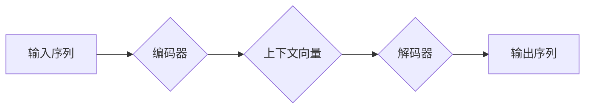

## 序列到序列学习 原理与代码实例讲解

> 关键词：序列到序列学习、循环神经网络、长短期记忆网络、编码器-解码器、Transformer、自然语言处理、机器翻译

## 1. 背景介绍

序列到序列学习（Sequence-to-Sequence Learning，简称Seq2Seq）是一种强大的机器学习模型，能够处理输入序列和输出序列之间的映射关系。它在自然语言处理（NLP）、计算机视觉、语音识别等领域有着广泛的应用。

传统的机器学习模型通常处理的是独立的数据点，而Seq2Seq模型能够处理具有顺序依赖关系的数据，例如文本、语音、时间序列等。它通过学习输入序列的上下文信息，生成与输入序列相关的输出序列。

## 2. 核心概念与联系

Seq2Seq模型的核心思想是将输入序列编码成一个固定长度的向量表示，然后解码该向量表示生成输出序列。

**流程图：**



**核心概念：**

* **编码器:** 负责将输入序列映射到一个固定长度的上下文向量。
* **解码器:** 负责根据上下文向量生成输出序列。
* **上下文向量:** 编码器输出的向量表示，包含了输入序列的语义信息。

**联系：**

编码器和解码器通常都是循环神经网络（RNN）或其变体，例如长短期记忆网络（LSTM）和格特网络（GRU）。RNN能够处理序列数据，并学习序列中的依赖关系。

## 3. 核心算法原理 & 具体操作步骤

### 3.1  算法原理概述

Seq2Seq模型的基本原理是使用编码器-解码器结构。编码器将输入序列逐个处理，并将其转换为一个固定长度的上下文向量。解码器则根据上下文向量生成输出序列，逐个生成每个单词。

**具体步骤：**

1. **编码阶段:** 编码器接收输入序列，并逐个处理每个单词。每个单词会被映射到一个隐藏状态，最终生成一个上下文向量。
2. **解码阶段:** 解码器接收上下文向量作为初始输入，并逐个生成输出序列。每个时间步，解码器会根据当前隐藏状态和之前生成的输出单词预测下一个单词。

### 3.2  算法步骤详解

1. **输入序列处理:** 将输入序列转换为数字表示，例如使用词嵌入将每个单词映射到一个向量。
2. **编码器前向传播:** 将输入序列逐个输入编码器，并计算每个单词的隐藏状态。
3. **上下文向量生成:** 将编码器最后一个隐藏状态作为上下文向量。
4. **解码器前向传播:** 将上下文向量作为初始输入，并逐个生成输出序列。
5. **输出序列解码:** 将生成的输出序列的数字表示转换为文本。

### 3.3  算法优缺点

**优点:**

* 可以处理任意长度的输入和输出序列。
* 可以学习输入序列的上下文信息，生成更准确的输出序列。
* 在各种序列到序列学习任务中表现出色，例如机器翻译、文本摘要、对话系统等。

**缺点:**

* 训练时间较长，需要大量的训练数据。
* 对于长序列数据，可能会出现梯度消失或梯度爆炸问题。

### 3.4  算法应用领域

* **机器翻译:** 将一种语言的文本翻译成另一种语言的文本。
* **文本摘要:** 将长篇文本压缩成短篇摘要。
* **对话系统:** 创建能够与人类进行自然对话的系统。
* **语音识别:** 将语音信号转换为文本。
* **图像字幕:** 将图像描述为文本。

## 4. 数学模型和公式 & 详细讲解 & 举例说明

### 4.1  数学模型构建

Seq2Seq模型的数学模型可以概括为以下公式：

* **编码器输出:**  $h_t = f(x_t, h_{t-1})$
* **上下文向量:** $c = h_T$
* **解码器输出:** $y_t = g(y_{t-1}, c, h_t)$

其中：

* $x_t$ 是输入序列的第 $t$ 个单词。
* $h_t$ 是编码器第 $t$ 个时间步的隐藏状态。
* $c$ 是上下文向量。
* $y_t$ 是解码器第 $t$ 个时间步生成的输出单词。
* $f$ 和 $g$ 分别是编码器和解码器的激活函数。

### 4.2  公式推导过程

编码器和解码器的具体实现方式有很多种，例如使用 LSTM 或 Transformer。

**LSTM 编码器:**

LSTM 编码器使用门控机制来控制信息的流动，能够更好地处理长序列数据。

**Transformer 解码器:**

Transformer 解码器使用注意力机制来学习输入序列和输出序列之间的关系，能够更好地捕捉长距离依赖关系。

### 4.3  案例分析与讲解

**机器翻译:**

在机器翻译任务中，输入序列是源语言的文本，输出序列是目标语言的文本。Seq2Seq 模型可以学习源语言和目标语言之间的映射关系，从而实现文本翻译。

**举例:**

输入序列: "Hello, world!"

目标语言: "你好，世界！"

Seq2Seq 模型会学习 "Hello" 对应 "你好"，"world" 对应 "世界" 等映射关系，并生成目标语言的文本。

## 5. 项目实践：代码实例和详细解释说明

### 5.1  开发环境搭建

* Python 3.6+
* TensorFlow 或 PyTorch

### 5.2  源代码详细实现

```python
import tensorflow as tf

# 定义编码器模型
class Encoder(tf.keras.Model):
    def __init__(self, vocab_size, embedding_dim, hidden_dim):
        super(Encoder, self).__init__()
        self.embedding = tf.keras.layers.Embedding(vocab_size, embedding_dim)
        self.lstm = tf.keras.layers.LSTM(hidden_dim)

    def call(self, inputs):
        x = self.embedding(inputs)
        x = self.lstm(x)
        return x

# 定义解码器模型
class Decoder(tf.keras.Model):
    def __init__(self, vocab_size, embedding_dim, hidden_dim):
        super(Decoder, self).__init__()
        self.embedding = tf.keras.layers.Embedding(vocab_size, embedding_dim)
        self.lstm = tf.keras.layers.LSTM(hidden_dim)
        self.dense = tf.keras.layers.Dense(vocab_size)

    def call(self, inputs, hidden_state, context_vector):
        x = self.embedding(inputs)
        x = tf.concat([x, context_vector], axis=-1)
        x = self.lstm(x, initial_state=hidden_state)
        x = self.dense(x)
        return x, x

# 定义 Seq2Seq 模型
class Seq2Seq(tf.keras.Model):
    def __init__(self, vocab_size, embedding_dim, hidden_dim):
        super(Seq2Seq, self).__init__()
        self.encoder = Encoder(vocab_size, embedding_dim, hidden_dim)
        self.decoder = Decoder(vocab_size, embedding_dim, hidden_dim)

    def call(self, inputs, targets):
        encoder_outputs = self.encoder(inputs)
        decoder_outputs, _ = self.decoder(targets[:, :-1], encoder_outputs, encoder_outputs)
        return decoder_outputs

# 实例化模型
model = Seq2Seq(vocab_size=10000, embedding_dim=128, hidden_dim=256)

# 编译模型
model.compile(optimizer='adam', loss='sparse_categorical_crossentropy')

# 训练模型
model.fit(train_inputs, train_targets, epochs=10)
```

### 5.3  代码解读与分析

* **编码器:** 使用 Embedding 层将单词映射到向量表示，然后使用 LSTM 层处理序列数据，生成上下文向量。
* **解码器:** 使用 Embedding 层将单词映射到向量表示，然后使用 LSTM 层处理序列数据，并使用 Dense 层预测下一个单词。
* **Seq2Seq 模型:** 将编码器和解码器组合在一起，实现序列到序列的映射关系。

### 5.4  运行结果展示

训练完成后，可以将模型应用于新的输入序列，生成相应的输出序列。

## 6. 实际应用场景

### 6.1  机器翻译

Seq2Seq 模型在机器翻译领域取得了显著的成果，例如 Google Translate 和 DeepL 等翻译工具都使用了 Seq2Seq 模型。

### 6.2  文本摘要

Seq2Seq 模型可以用于生成文本摘要，例如将长篇新闻文章压缩成短篇摘要。

### 6.3  对话系统

Seq2Seq 模型可以用于构建对话系统，例如聊天机器人和虚拟助手。

### 6.4  未来应用展望

Seq2Seq 模型在未来将有更广泛的应用，例如：

* **代码生成:** 使用 Seq2Seq 模型生成代码。
* **药物发现:** 使用 Seq2Seq 模型预测药物的活性。
* **个性化教育:** 使用 Seq2Seq 模型提供个性化的学习内容。

## 7. 工具和资源推荐

### 7.1  学习资源推荐

* **书籍:**
    * "深度学习" by Ian Goodfellow, Yoshua Bengio, and Aaron Courville
    * "序列到序列学习" by Sutskever, Vinyals, and Le
* **在线课程:**
    * Coursera: "Natural Language Processing Specialization"
    * Udacity: "Deep Learning Nanodegree"

### 7.2  开发工具推荐

* **TensorFlow:** https://www.tensorflow.org/
* **PyTorch:** https://pytorch.org/

### 7.3  相关论文推荐

* "Sequence to Sequence Learning with Neural Networks" by Sutskever, Vinyals, and Le
* "Attention Is All You Need" by Vaswani et al.

## 8. 总结：未来发展趋势与挑战

### 8.1  研究成果总结

Seq2Seq 模型在自然语言处理和机器学习领域取得了显著的成果，为解决各种序列到序列学习任务提供了有效的方法。

### 8.2  未来发展趋势

* **更强大的模型架构:** 研究更强大的模型架构，例如 Transformer 的变体，以提高模型的性能和效率。
* **更好的训练方法:** 研究更有效的训练方法，例如自监督学习和迁移学习，以减少模型训练所需的数据量和时间。
* **更广泛的应用场景:** 将 Seq2Seq 模型应用于更多领域，例如代码生成、药物发现和个性化教育。

### 8.3  面临的挑战

* **长序列数据处理:** Seq2Seq 模型在处理长序列数据时可能会出现梯度消失或梯度爆炸问题。
* **数据稀疏性:** 某些任务的数据稀疏性较高，这会影响模型的训练效果。
* **可解释性:** Seq2Seq 模型的决策过程难以解释，这限制了其在一些应用场景中的使用。

### 8.4  研究展望

未来研究将继续探索 Seq2Seq 模型的潜力，解决其面临的挑战，并将其应用于更多领域。

## 9. 附录：常见问题与解答

* **Q: Seq2Seq 模型的训练时间很长，如何加速训练？**

A: 可以使用以下方法加速训练：

* 使用更强大的硬件，例如 GPU。
* 使用更有效的训练方法，例如微调预训练模型。
* 使用数据增强技术，例如文本随机替换。

* **Q: Seq2Seq 模型的输出结果质量不高，如何提高输出质量？**

A: 可以使用以下方法提高输出质量：

* 使用更大的模型，例如增加隐藏层数或隐藏单元数。
* 使用更丰富的训练数据。
* 使用更复杂的解码器架构，例如使用注意力机制。


作者：禅与计算机程序设计艺术 / Zen and the Art