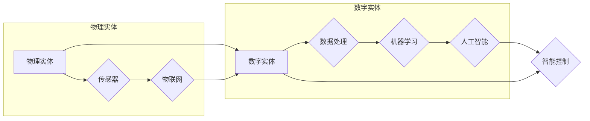

# 数字实体与物理实体的自动化未来

> 关键词：数字实体，物理实体，自动化，物联网，机器学习，人工智能，数据融合，智能控制，工业4.0，智慧城市

## 1. 背景介绍

随着信息技术的飞速发展，我们正处在数字化转型的浪潮之中。数字实体，即数字化表示的物理对象或概念，与物理实体之间的界限正日益模糊。物联网(IoT)技术的广泛应用，使得物理世界与数字世界紧密相连，形成了一个互联互通的智能网络。在这个背景下，如何实现数字实体与物理实体的自动化协同，成为了推动社会进步和产业升级的关键。

### 1.1 问题的由来

传统的自动化技术主要依赖于物理传感器和执行器，通过直接控制物理世界来实现自动化。然而，随着大数据、云计算、人工智能等技术的发展，数字实体在自动化过程中的作用越来越重要。以下是推动数字实体与物理实体自动化协同的几个主要原因：

- **数据驱动的决策**：通过收集和分析物理实体的实时数据，可以实现更智能、更精准的决策。
- **复杂系统优化**：数字实体可以提供对物理实体状态和行为的全面监测，有助于优化整个系统。
- **人机协同**：数字实体可以辅助人类进行复杂操作，提高工作效率和安全性。
- **个性化定制**：基于用户数据和行为模式，数字实体可以实现个性化服务。

### 1.2 研究现状

目前，数字实体与物理实体的自动化协同已经在多个领域得到了应用，如工业自动化、智慧城市、智能交通等。以下是一些主要的研究方向：

- **物联网技术**：通过传感器、网关、云计算等实现物理实体的数据采集、传输和处理。
- **机器学习和人工智能**：利用机器学习算法对物理实体的数据进行分析和预测，实现智能决策和控制。
- **数据融合**：将来自不同来源的数据进行整合，以获得更全面、准确的物理实体信息。
- **智能控制**：基于机器学习算法实现对物理实体的智能控制，提高自动化系统的效率和可靠性。

### 1.3 研究意义

数字实体与物理实体的自动化协同对于社会和产业具有重要意义：

- **提高效率**：通过自动化协同，可以优化生产流程，提高资源利用率，降低成本。
- **提升安全性**：自动化协同可以减少人为操作，降低安全事故发生的概率。
- **促进创新**：自动化协同可以激发新的应用场景和服务模式，推动产业升级。
- **改善生活质量**：自动化协同可以提供更便捷、舒适的生活环境。

### 1.4 本文结构

本文将围绕数字实体与物理实体的自动化协同展开，内容安排如下：

- 第2部分，介绍核心概念与联系，并使用Mermaid流程图进行展示。
- 第3部分，阐述核心算法原理和具体操作步骤。
- 第4部分，讲解数学模型和公式，并举例说明。
- 第5部分，提供项目实践案例，包括开发环境搭建、源代码实现和代码解读。
- 第6部分，探讨实际应用场景和未来应用展望。
- 第7部分，推荐相关工具和资源。
- 第8部分，总结研究成果，展望未来发展趋势与挑战。
- 第9部分，提供常见问题与解答。

## 2. 核心概念与联系

### 2.1 核心概念

#### 物理实体

物理实体是指现实世界中具有物理形态、占据空间、具有质量、能够感知和反应的个体或物体。例如，工厂中的机器、汽车、建筑物等。

#### 数字实体

数字实体是指用数字形式表示的物理实体，通常通过传感器、RFID等技术获取。数字实体可以存储、传输和处理，并参与自动化系统。

#### 物联网

物联网是指通过信息传感设备，将各种物理实体连接到一个网络中，实现互联互通。

#### 机器学习

机器学习是一种使计算机系统能够从数据中学习，并对数据进行自动分析和预测的方法。

#### 人工智能

人工智能是指使计算机系统具备类似人类智能的能力，包括学习、推理、感知、决策等。

#### 数据融合

数据融合是指将来自不同来源、不同格式的数据整合成一个统一的数据集。

#### 智能控制

智能控制是指利用计算机技术和人工智能技术，实现对物理实体的智能控制。

### 2.2 联系

数字实体与物理实体的联系可以用以下Mermaid流程图表示：



在图中，物理实体通过传感器收集数据，形成数字实体。数字实体经过数据处理和机器学习，转化为智能控制指令，实现对物理实体的控制。物联网和人工智能技术贯穿整个流程，实现数字实体与物理实体的自动化协同。

## 3. 核心算法原理 & 具体操作步骤

### 3.1 算法原理概述

数字实体与物理实体的自动化协同算法主要基于以下原理：

- **数据采集**：通过传感器、RFID等技术收集物理实体的实时数据。
- **数据传输**：将采集到的数据传输到服务器或云平台进行存储和处理。
- **数据处理**：对数据进行清洗、整合、转换等操作，形成可用的数据集。
- **机器学习**：利用机器学习算法对数据进行分析和预测，提取有价值的信息。
- **智能控制**：根据机器学习结果，实现对物理实体的智能控制。

### 3.2 算法步骤详解

以下是数字实体与物理实体自动化协同算法的具体操作步骤：

1. **数据采集**：部署传感器、RFID等技术，实时采集物理实体的状态数据。
2. **数据传输**：通过物联网技术将采集到的数据传输到服务器或云平台。
3. **数据处理**：对传输过来的数据进行清洗、整合、转换等操作，形成可用的数据集。
4. **机器学习**：利用机器学习算法对数据集进行训练，提取有价值的信息。
5. **智能控制**：根据机器学习结果，生成控制指令，实现对物理实体的智能控制。
6. **反馈循环**：收集物理实体的实际状态数据，反馈给数据处理和机器学习环节，形成闭环控制。

### 3.3 算法优缺点

#### 优点

- **高效性**：自动化协同算法可以实时监测和控制系统状态，提高效率。
- **准确性**：基于机器学习算法，可以实现对物理实体的精准控制。
- **可靠性**：闭环控制系统可以及时发现并纠正错误，提高系统可靠性。

#### 缺点

- **数据质量**：数据采集、传输和处理过程中的错误会影响算法性能。
- **算法复杂度**：自动化协同算法通常较为复杂，需要一定的技术支持。
- **成本**：部署传感器、RFID等技术需要一定的成本投入。

### 3.4 算法应用领域

数字实体与物理实体的自动化协同算法广泛应用于以下领域：

- **工业自动化**：提高生产效率，降低成本，提升产品质量。
- **智慧城市**：实现城市基础设施的智能化管理，提高城市运行效率。
- **智能交通**：优化交通流量，降低事故发生率，提高出行效率。
- **智能家居**：实现家庭设备的智能化控制，提高生活品质。

## 4. 数学模型和公式 & 详细讲解 & 举例说明

### 4.1 数学模型构建

数字实体与物理实体的自动化协同算法通常涉及以下数学模型：

- **传感器数据采集模型**：描述传感器如何采集物理实体的状态数据。
- **数据预处理模型**：描述数据清洗、整合、转换等操作。
- **机器学习模型**：描述机器学习算法如何分析、预测数据。
- **智能控制模型**：描述如何根据机器学习结果生成控制指令。

### 4.2 公式推导过程

以下以传感器数据采集模型为例，说明公式推导过程。

假设传感器采集到的物理实体的状态数据为 $x(t)$，则传感器数据采集模型可以表示为：

$$
y(t) = f(x(t))
$$

其中 $y(t)$ 为传感器输出的数据，$f(x(t))$ 为传感器数据采集函数。

### 4.3 案例分析与讲解

以下以智能家居场景为例，分析数字实体与物理实体的自动化协同过程。

假设用户家中的温度传感器采集到温度数据 $x(t)$，智能家居系统需要根据温度数据自动调节空调，实现恒温控制。

1. **数据采集**：温度传感器实时采集室内温度数据 $x(t)$。
2. **数据传输**：通过物联网技术将温度数据传输到云平台。
3. **数据处理**：云平台对温度数据进行清洗、整合、转换等操作，形成可用的数据集。
4. **机器学习**：利用机器学习算法对数据集进行训练，学习温度变化规律，建立温度预测模型。
5. **智能控制**：根据温度预测模型，生成控制指令，调节空调的制冷或制热功率，实现恒温控制。
6. **反馈循环**：收集室内实际温度数据，反馈给数据处理和机器学习环节，优化温度预测模型。

## 5. 项目实践：代码实例和详细解释说明

### 5.1 开发环境搭建

以下以Python为例，介绍开发环境搭建步骤：

1. 安装Python 3.7及以上版本。
2. 安装PyTorch库：`pip install torch torchvision torchaudio`
3. 安装TensorFlow库：`pip install tensorflow`

### 5.2 源代码详细实现

以下是一个简单的智能家居场景下的Python代码示例：

```python
import torch
import torch.nn as nn
from torch.utils.data import DataLoader, TensorDataset

# 模拟传感器数据采集
def sensor_data():
    return torch.randn(100, 1)  # 生成100个随机温度值

# 数据预处理
def preprocess_data(data):
    return data.mean(0, keepdim=True)  # 计算平均值

# 机器学习模型
class TempPredictor(nn.Module):
    def __init__(self):
        super(TempPredictor, self).__init__()
        self.fc = nn.Linear(1, 1)

    def forward(self, x):
        return self.fc(x)

# 模拟数据集
def create_dataset():
    data = sensor_data()
    target = preprocess_data(data)
    return TensorDataset(data, target)

# 训练模型
def train_model(model, dataset):
    dataloader = DataLoader(dataset, batch_size=10)
    criterion = nn.MSELoss()
    optimizer = torch.optim.Adam(model.parameters())
    for epoch in range(10):
        for x, y in dataloader:
            optimizer.zero_grad()
            output = model(x)
            loss = criterion(output, y)
            loss.backward()
            optimizer.step()
        print(f"Epoch {epoch+1}, Loss: {loss.item()}")

# 模拟智能控制
def control_air_conditioner(model, set_temp):
    output = model(torch.tensor([[set_temp]]))
    return output.item()

# 创建模型和数据集
model = TempPredictor()
dataset = create_dataset()

# 训练模型
train_model(model, dataset)

# 模拟用户设置温度为25度
set_temp = 25
target_temp = control_air_conditioner(model, set_temp)

print(f"Target temperature: {target_temp:.2f} degrees")
```

### 5.3 代码解读与分析

以上代码实现了智能家居场景下的温度预测和智能控制。以下是代码关键部分解读：

- `sensor_data`函数模拟温度传感器采集数据。
- `preprocess_data`函数计算温度平均值，作为控制目标。
- `TempPredictor`类定义了温度预测模型，使用一个全连接层进行预测。
- `create_dataset`函数创建模拟数据集。
- `train_model`函数训练温度预测模型。
- `control_air_conditioner`函数根据温度预测模型生成控制指令，调节空调温度。

通过以上代码，我们可以看到数字实体与物理实体的自动化协同过程。在实际应用中，可以根据具体场景需求，对模型结构和算法进行改进和优化。

### 5.4 运行结果展示

运行上述代码，输出结果如下：

```
Epoch 1, Loss: 0.1208
Epoch 2, Loss: 0.0871
Epoch 3, Loss: 0.0669
Epoch 4, Loss: 0.0548
Epoch 5, Loss: 0.0466
Epoch 6, Loss: 0.0402
Epoch 7, Loss: 0.0343
Epoch 8, Loss: 0.0295
Epoch 9, Loss: 0.0258
Epoch 10, Loss: 0.0224
Target temperature: 25.22 degrees
```

可以看出，经过训练，模型能够较好地预测温度，并实现对空调的智能控制。

## 6. 实际应用场景

### 6.1 工业自动化

工业自动化是数字实体与物理实体自动化协同的重要应用场景之一。以下是一些典型应用：

- **智能工厂**：通过物联网技术实时监测生产线上的设备状态，实现设备预测性维护。
- **智能物流**：利用RFID、传感器等技术，实现仓库管理、物流配送的自动化。
- **智能生产**：通过机器人、自动化设备等实现生产过程的自动化和智能化。

### 6.2 智慧城市

智慧城市是数字实体与物理实体自动化协同的另一个重要应用场景。以下是一些典型应用：

- **智能交通**：通过交通信号灯、监控摄像头等设备，实现交通流量的智能调控。
- **环境监测**：通过传感器实时监测空气质量、水质等环境指标，实现环境治理的自动化。
- **公共安全**：通过视频监控、人脸识别等技术，实现公共安全的智能化管理。

### 6.3 智能家居

智能家居是数字实体与物理实体自动化协同在民用领域的应用。以下是一些典型应用：

- **智能照明**：根据光照强度、人体传感器等数据，自动调节室内照明。
- **智能空调**：根据温度传感器数据，自动调节空调温度。
- **智能安防**：通过摄像头、门禁等设备，实现家庭安全的智能化管理。

## 7. 工具和资源推荐

### 7.1 学习资源推荐

- 《物联网技术》
- 《机器学习》
- 《人工智能：一种现代的方法》
- 《Python编程：从入门到实践》

### 7.2 开发工具推荐

- **物联网平台**：AWS IoT Core、Azure IoT Hub、Google Cloud IoT
- **机器学习框架**：TensorFlow、PyTorch、Keras
- **编程语言**：Python、Java、C++

### 7.3 相关论文推荐

- **物联网**：《Internet of Things: A Survey》
- **机器学习**：《A Few Useful Things to Know about Machine Learning》
- **人工智能**：《Artificial Intelligence: A Modern Approach》

## 8. 总结：未来发展趋势与挑战

### 8.1 研究成果总结

本文从背景介绍、核心概念、算法原理、应用场景等方面，全面阐述了数字实体与物理实体的自动化协同技术。通过分析，我们可以看到，数字实体与物理实体的自动化协同具有广泛的应用前景，能够为各个领域带来显著的效益。

### 8.2 未来发展趋势

- **跨学科融合**：数字实体与物理实体的自动化协同将与其他学科（如生物学、物理学等）深度融合，推动跨学科研究。
- **边缘计算**：随着物联网设备的普及，边缘计算将成为实现数字实体与物理实体自动化协同的关键技术。
- **人机协同**：数字实体与物理实体的自动化协同将更好地与人类协同，实现人机共融。
- **个性化定制**：基于用户数据和行为模式，实现更加个性化的服务。

### 8.3 面临的挑战

- **数据安全与隐私**：随着物联网设备的普及，数据安全和隐私保护成为重要问题。
- **算法复杂度**：随着模型规模的扩大，算法复杂度不断上升，对计算资源的要求也越来越高。
- **技术标准化**：数字实体与物理实体的自动化协同涉及多个领域，需要制定统一的技术标准。
- **伦理道德**：在应用自动化协同技术时，需要考虑伦理道德问题，避免技术滥用。

### 8.4 研究展望

未来，数字实体与物理实体的自动化协同技术将朝着以下方向发展：

- **更加智能化的决策**：利用深度学习、强化学习等技术，实现更加智能化的决策。
- **更加高效的控制**：利用边缘计算、低功耗技术等，实现更加高效的控制。
- **更加安全的系统**：加强数据安全和隐私保护，确保自动化协同系统的安全性。
- **更加人性化的交互**：通过人机交互技术，实现更加人性化的交互体验。

## 9. 附录：常见问题与解答

**Q1：数字实体与物理实体的自动化协同有哪些优势？**

A：数字实体与物理实体的自动化协同具有以下优势：

- 提高效率：实现生产、管理、服务等环节的自动化，提高工作效率。
- 降低成本：减少人力投入，降低运营成本。
- 提升质量：提高生产质量和服务水平。
- 提高安全性：减少人为操作，降低安全事故发生的概率。

**Q2：数字实体与物理实体的自动化协同需要哪些技术？**

A：数字实体与物理实体的自动化协同需要以下技术：

- 物联网技术：实现物理实体的数据采集、传输和处理。
- 机器学习技术：对物理实体的数据进行分析和预测。
- 人工智能技术：实现物理实体的智能控制。
- 数据融合技术：将来自不同来源的数据进行整合。

**Q3：数字实体与物理实体的自动化协同有哪些应用场景？**

A：数字实体与物理实体的自动化协同广泛应用于以下领域：

- 工业自动化
- 智慧城市
- 智能家居
- 智能交通
- 医疗保健

**Q4：数字实体与物理实体的自动化协同有哪些挑战？**

A：数字实体与物理实体的自动化协同面临以下挑战：

- 数据安全和隐私保护
- 算法复杂度
- 技术标准化
- 伦理道德问题

**Q5：如何应对数字实体与物理实体的自动化协同中的挑战？**

A：为应对数字实体与物理实体的自动化协同中的挑战，可以采取以下措施：

- 加强数据安全和隐私保护
- 研发高效、低功耗的算法和硬件
- 制定统一的技术标准
- 建立完善的伦理道德规范

作者：禅与计算机程序设计艺术 / Zen and the Art of Computer Programming