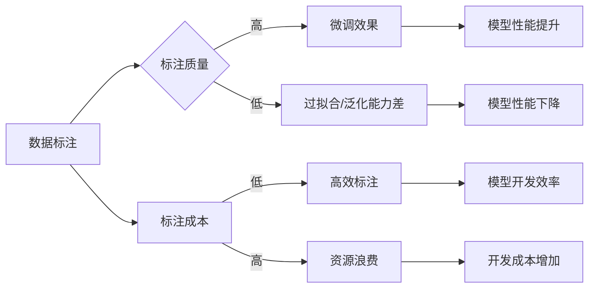

> 数据标注，微调，小模型，机器学习，人工智能，深度学习，监督学习，标注质量，标注成本，标注效率，标注工具

# 数据标注的重要性：微调小模型的基础

数据标注是机器学习和深度学习领域中的基础工作，它是将人类知识转化为机器可学习数据的关键步骤。对于微调小模型，数据标注的重要性尤为突出。本文将深入探讨数据标注在微调小模型中的作用，包括其核心概念、算法原理、操作步骤、数学模型、项目实践、实际应用场景、工具和资源推荐，以及未来发展趋势与挑战。

## 1. 背景介绍

随着人工智能技术的飞速发展，机器学习模型在各个领域得到了广泛应用。然而，这些模型的学习过程需要大量的数据，而这些数据往往需要经过标注才能用于训练。数据标注是将人类知识转化为机器可学习数据的过程，它对于模型的质量和性能至关重要。

在微调小模型的过程中，数据标注的重要性更加凸显。小模型由于参数量较少，对数据的依赖性更强，因此对标注数据的准确性和质量要求更高。本文将重点关注数据标注在微调小模型中的应用，分析其重要性、挑战和最佳实践。

## 2. 核心概念与联系

### 2.1 核心概念

**数据标注**：指对数据进行人工标记或注解，使其能够被机器学习模型理解的过程。

**微调**：在预训练模型的基础上，使用少量标注数据对模型进行进一步训练的过程。

**小模型**：指参数量较少的机器学习模型，通常用于特定任务或资源受限的场景。

**监督学习**：一种机器学习范式，通过标注数据进行模型训练。

**深度学习**：一种人工智能技术，通过多层神经网络模拟人类大脑的学习过程。

### 2.2 核心概念原理和架构的 Mermaid 流程图



## 3. 核心算法原理 & 具体操作步骤

### 3.1 算法原理概述

数据标注的过程涉及到多个步骤，包括数据收集、数据预处理、标注规则制定、标注执行和标注质量评估。

### 3.2 算法步骤详解

1. **数据收集**：根据模型训练需求，收集相关领域的原始数据。
2. **数据预处理**：对收集到的数据进行清洗、格式化等处理，以便于标注。
3. **标注规则制定**：根据任务需求，制定明确的标注规则和标准。
4. **标注执行**：由标注人员根据规则对数据进行标注。
5. **标注质量评估**：对标注结果进行评估，确保标注的准确性和一致性。

### 3.3 算法优缺点

**优点**：

- 提供高质量的数据，有助于提升模型性能。
- 可以为小模型提供足够的标注数据。
- 可以根据任务需求定制标注规则。

**缺点**：

- 标注成本高，需要大量的人力投入。
- 标注质量受标注人员主观因素的影响。
- 标注规则难以覆盖所有情况。

### 3.4 算法应用领域

数据标注在机器学习和深度学习领域的应用非常广泛，包括：

- 图像识别：对图像进行分类、标注物体、检测人脸等。
- 语音识别：对语音进行转写、标注语音情感等。
- 自然语言处理：对文本进行分词、词性标注、语义分析等。

## 4. 数学模型和公式 & 详细讲解 & 举例说明

### 4.1 数学模型构建

在微调小模型时，常用的数学模型是监督学习中的损失函数。常见的损失函数包括：

- 交叉熵损失（Cross-Entropy Loss）
- 均方误差损失（Mean Squared Error Loss）
- 对数似然损失（Log-Likelihood Loss）

### 4.2 公式推导过程

以交叉熵损失为例，其公式如下：

$$
L(\theta) = -\sum_{i=1}^N [y_i \log(\hat{y}_i) + (1-y_i) \log(1-\hat{y}_i)]
$$

其中，$y_i$ 为真实标签，$\hat{y}_i$ 为模型预测的概率。

### 4.3 案例分析与讲解

假设我们要对一组图像进行分类，模型预测结果如下：

$$
\hat{y}_1 = 0.6, \hat{y}_2 = 0.3, \hat{y}_3 = 0.1
$$

真实标签为：

$$
y_1 = 1, y_2 = 0, y_3 = 1
$$

则交叉熵损失为：

$$
L(\theta) = -[1 \log(0.6) + 0 \log(0.3) + 1 \log(0.1)]
$$

## 5. 项目实践：代码实例和详细解释说明

### 5.1 开发环境搭建

为了进行数据标注和微调小模型，我们需要搭建以下开发环境：

- 操作系统：Linux或Windows
- 编程语言：Python
- 框架：TensorFlow或PyTorch
- 数据标注工具：LabelImg、VGG Image Annotator、CVAT等

### 5.2 源代码详细实现

以下是一个简单的图像分类任务的数据标注和微调示例：

```python
import tensorflow as tf
from tensorflow.keras.models import Sequential
from tensorflow.keras.layers import Dense, Flatten
from tensorflow.keras.preprocessing.image import ImageDataGenerator

# 加载图像数据
train_data = ImageDataGenerator(rescale=1./255).flow_from_directory('train_data', target_size=(150, 150))
val_data = ImageDataGenerator(rescale=1./255).flow_from_directory('val_data', target_size=(150, 150))

# 构建模型
model = Sequential([
    Flatten(input_shape=(150, 150, 3)),
    Dense(128, activation='relu'),
    Dense(10, activation='softmax')
])

# 编译模型
model.compile(optimizer='adam', loss='sparse_categorical_crossentropy', metrics=['accuracy'])

# 训练模型
model.fit(train_data, steps_per_epoch=50, epochs=5, validation_data=val_data)

# 评估模型
val_loss, val_accuracy = model.evaluate(val_data)

print(f"Validation accuracy: {val_accuracy:.4f}")
```

### 5.3 代码解读与分析

以上代码展示了如何使用TensorFlow和Keras构建一个简单的图像分类模型，并对训练和验证数据集进行训练和评估。

- `ImageDataGenerator` 类用于加载和预处理图像数据。
- `Sequential` 类用于构建模型，其中包含一个Flatten层将图像数据展平，一个全连接层进行特征提取，另一个全连接层进行分类。
- `compile` 方法用于编译模型，指定优化器、损失函数和评估指标。
- `fit` 方法用于训练模型，指定训练数据、迭代轮数和验证数据。
- `evaluate` 方法用于评估模型在验证数据集上的性能。

## 6. 实际应用场景

数据标注和微调小模型在实际应用场景中具有重要意义，以下是一些典型的应用：

- **医疗影像诊断**：对医学影像数据进行标注，用于辅助诊断疾病。
- **自动驾驶**：对道路、车辆、行人等图像进行标注，用于训练自动驾驶系统。
- **语音识别**：对语音数据进行标注，用于训练语音识别模型。
- **文本分类**：对文本数据进行标注，用于分类新闻、邮件等。

## 7. 工具和资源推荐

### 7.1 学习资源推荐

- 《Python机器学习》
- 《深度学习》
- 《机器学习实战》
- 《TensorFlow 2.x深度学习实战》

### 7.2 开发工具推荐

- LabelImg
- VGG Image Annotator
- CVAT
- Label Studio

### 7.3 相关论文推荐

- **《Deep Learning for Computer Vision with Python》**
- **《Practical Deep Learning for Computer Vision》**
- **《Convolutional Neural Networks for Visual Recognition》**

## 8. 总结：未来发展趋势与挑战

### 8.1 研究成果总结

数据标注在微调小模型中发挥着重要作用。通过高质量的数据标注，可以提升模型性能，降低过拟合风险，提高模型的泛化能力。

### 8.2 未来发展趋势

- **自动化标注**：利用自动标注技术降低标注成本，提高标注效率。
- **半监督学习**：结合标注数据和未标注数据，提高模型的学习效率。
- **迁移学习**：利用预训练模型进行微调，降低标注需求。

### 8.3 面临的挑战

- **标注成本高**：高质量的数据标注需要大量人力投入。
- **标注一致性**：不同标注人员可能存在主观差异。
- **标注数据质量**：标注数据可能存在噪声和错误。

### 8.4 研究展望

未来，数据标注和微调小模型的研究将集中在以下方向：

- **开发更高效的标注工具**：提高标注效率，降低标注成本。
- **研究自动化标注技术**：减少对人工标注的依赖。
- **探索新的标注范式**：如弱监督学习、无监督学习等。

## 9. 附录：常见问题与解答

**Q1：数据标注是否一定需要人工进行？**

A：虽然人工标注是当前最常用的标注方式，但随着技术的发展，自动化标注技术也在逐渐成熟。例如，利用图像识别、语音识别等技术进行自动标注，可以有效降低标注成本。

**Q2：如何提高标注数据的质量？**

A：提高标注数据质量的关键在于制定明确的标注规则和标准，并对标注人员进行培训。此外，还可以使用数据清洗、数据增强等技术来提高数据质量。

**Q3：微调小模型与微调大模型有什么区别？**

A：微调小模型与微调大模型的主要区别在于模型参数量。小模型参数量较少，对数据的依赖性更强，因此对标注数据的准确性和质量要求更高。

**Q4：如何选择合适的微调小模型？**

A：选择合适的微调小模型需要考虑以下因素：

- 任务需求：根据任务需求选择合适的模型类型。
- 计算资源：根据计算资源限制选择模型规模。
- 标注数据量：根据标注数据量选择模型复杂度。

作者：禅与计算机程序设计艺术 / Zen and the Art of Computer Programming