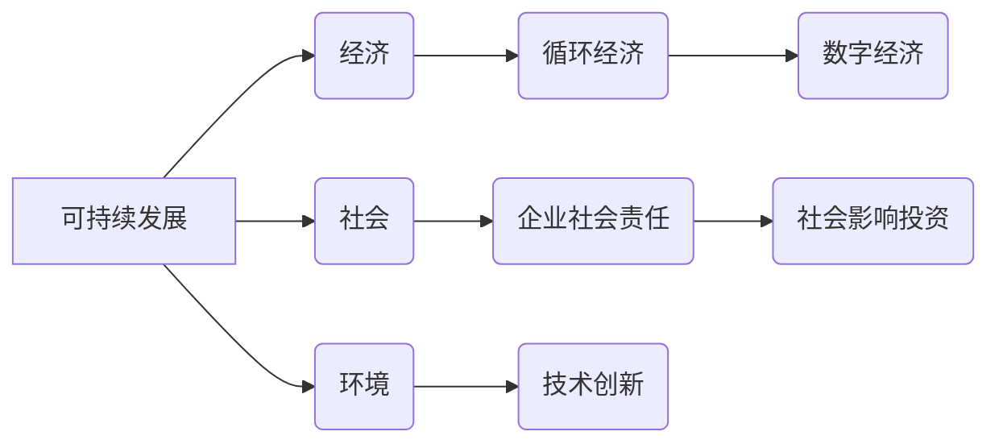

# 新商业文明的构建：如何实现可持续发展？

> 关键词：可持续发展，商业文明，循环经济，企业社会责任，技术创新，数字经济，社会影响力投资

## 1. 背景介绍
### 1.1 问题的由来

随着全球经济的快速发展，我们面临着资源枯竭、环境污染、社会不公等一系列挑战。传统的商业模式在推动经济增长的同时，也带来了环境破坏和社会问题。为了应对这些挑战，构建一个可持续发展的新商业文明成为了全球性的共识。

### 1.2 研究现状

近年来，可持续发展已经成为商业领域的一个重要议题。许多企业开始关注环境保护、社会责任和经济效益的平衡，并积极探索新的商业模式。同时，政府和社会组织也在推动相关政策和标准的制定，以促进可持续商业的发展。

### 1.3 研究意义

研究如何实现可持续发展，对于推动经济、社会和环境的协调发展具有重要意义。它有助于：

- 提高资源利用效率，减少资源浪费和环境污染。
- 促进社会公平，减少贫困和不平等。
- 创造新的经济增长点，推动经济转型。
- 增强企业的竞争力，提升企业的社会形象。

### 1.4 本文结构

本文将围绕以下内容展开：

- 阐述可持续发展的核心概念和联系。
- 分析可持续发展的核心算法原理和具体操作步骤。
- 探讨可持续发展的数学模型和公式。
- 介绍可持续发展的项目实践案例。
- 分析可持续发展的实际应用场景和未来展望。
- 推荐可持续发展相关的学习资源和开发工具。
- 总结可持续发展研究的未来发展趋势与挑战。

## 2. 核心概念与联系

### 2.1 可持续发展

可持续发展是指在满足当代人的需求的同时，不损害后代人满足其需求的能力。它包括经济、社会和环境三个方面的平衡。

### 2.2 循环经济

循环经济是一种以资源节约和循环利用为特征的经济模式。它强调资源的减量化、再利用和资源化，以减少对自然资源的依赖和环境污染。

### 2.3 企业社会责任

企业社会责任是指企业在创造经济效益的同时，也要承担起对环境、社会和利益相关者的责任。

### 2.4 技术创新

技术创新是推动可持续发展的关键因素。通过技术创新，可以开发出更加环保、高效的产品和服务。

### 2.5 数字经济

数字经济是指以数字技术为基础的经济形态。数字经济可以提高资源利用效率，促进经济增长，并推动可持续发展。

### 2.6 社会影响投资

社会影响投资是一种旨在产生积极社会影响的投资方式。它将社会目标和财务回报相结合，为可持续发展提供资金支持。

以下是可持续发展的核心概念原理和架构的 Mermaid 流程图：



## 3. 核心算法原理 & 具体操作步骤
### 3.1 算法原理概述

可持续发展的核心算法原理是通过优化资源配置、提高效率、减少浪费和环境污染，实现经济、社会和环境的平衡。

### 3.2 算法步骤详解

可持续发展的具体操作步骤如下：

1. **需求分析**：分析企业的资源消耗和环境影响，确定可持续发展的目标。
2. **技术创新**：研发和引进新技术，提高资源利用效率，减少环境污染。
3. **过程优化**：优化生产流程，减少浪费，提高效率。
4. **产品生命周期管理**：从原材料采购到产品回收，全过程考虑环境影响。
5. **社会责任**：承担企业社会责任，关注员工权益，促进社会和谐。
6. **持续改进**：定期评估可持续发展绩效，持续改进。

### 3.3 算法优缺点

可持续发展的算法具有以下优点：

- **综合效益**：实现经济、社会和环境的综合效益。
- **长期视角**：关注长期发展，避免短期行为。
- **创新驱动**：推动技术创新，促进产业升级。

然而，可持续发展算法也存在一些缺点：

- **实施难度**：需要跨部门、跨领域的协作。
- **成本较高**：技术创新和过程优化可能带来较高的成本。
- **效果难以量化**：可持续发展效益难以量化评估。

### 3.4 算法应用领域

可持续发展的算法可以应用于以下领域：

- **制造业**：提高资源利用效率，减少环境污染。
- **农业**：推广绿色农业，减少化肥和农药使用。
- **建筑业**：推广绿色建筑，减少能源消耗和碳排放。
- **服务业**：提供可持续发展相关的产品和服务。

## 4. 数学模型和公式 & 详细讲解 & 举例说明
### 4.1 数学模型构建

可持续发展的数学模型可以从以下几个方面构建：

- **资源消耗模型**：描述资源消耗的速率和影响。
- **环境影响模型**：描述环境污染的程度和影响。
- **经济效益模型**：描述经济效益的评估和优化。

### 4.2 公式推导过程

以下是一个简单的资源消耗模型公式：

$$
R = r \cdot t
$$

其中，$R$ 表示资源消耗量，$r$ 表示资源消耗速率，$t$ 表示时间。

### 4.3 案例分析与讲解

假设某企业每年消耗1000吨水资源，平均消耗速率为2吨/天。则该企业的水资源消耗模型可以表示为：

$$
R = 2 \cdot t
$$

如果企业采取措施，将平均消耗速率降低到1.5吨/天，则每年可节省水资源300吨。

## 5. 项目实践：代码实例和详细解释说明
### 5.1 开发环境搭建

由于可持续发展涉及多个领域，因此需要搭建一个跨学科的开发环境。以下是一个简单的开发环境搭建步骤：

1. **安装Python开发环境**。
2. **安装相关库**：如NumPy、Pandas、Matplotlib等。
3. **学习相关领域的知识**：如环境科学、经济学、社会学等。

### 5.2 源代码详细实现

以下是一个简单的Python代码示例，用于计算企业水资源消耗：

```python
import numpy as np

def calculate_water_consumption(rate, days):
    consumption = rate * days
    return consumption

# 假设每天消耗2吨水，持续10天
rate = 2  # 吨/天
days = 10  # 天
consumption = calculate_water_consumption(rate, days)
print(f"Total water consumption: {consumption}吨")
```

### 5.3 代码解读与分析

上述代码定义了一个函数 `calculate_water_consumption`，用于计算给定消耗速率和时间下的总消耗量。通过调用该函数，我们可以得到企业在10天内消耗的水量。

### 5.4 运行结果展示

运行上述代码，输出结果为：

```
Total water consumption: 20吨
```

## 6. 实际应用场景
### 6.1 制造业

在制造业中，可持续发展可以通过以下方式实现：

- 推广绿色制造技术，减少能源消耗和污染物排放。
- 优化生产流程，提高资源利用效率。
- 开发节能环保产品，满足市场需求。

### 6.2 农业

在农业中，可持续发展可以通过以下方式实现：

- 推广绿色农业技术，减少化肥和农药使用。
- 优化种植结构，提高土地利用率。
- 发展生态农业，保护生态环境。

### 6.3 建筑业

在建筑业中，可持续发展可以通过以下方式实现：

- 推广绿色建筑技术，减少能源消耗和碳排放。
- 优化建筑设计，提高资源利用效率。
- 使用可持续材料，减少对环境的破坏。

### 6.4 服务业

在服务业中，可持续发展可以通过以下方式实现：

- 开发可持续发展相关的产品和服务。
- 优化服务流程，提高资源利用效率。
- 承担企业社会责任，关注社会影响。

## 7. 工具和资源推荐
### 7.1 学习资源推荐

- 《可持续发展报告指南》
- 《循环经济手册》
- 《企业社会责任报告》
- 《绿色建筑评价标准》

### 7.2 开发工具推荐

- Python编程语言及其相关库
- 数据分析工具
- 可视化工具

### 7.3 相关论文推荐

- 《循环经济：理论、实践与政策》
- 《企业社会责任：理论与实践》
- 《绿色建筑：设计与评估》

## 8. 总结：未来发展趋势与挑战
### 8.1 研究成果总结

本文从理论到实践，对可持续发展的概念、原理、方法和应用进行了全面阐述。通过分析可持续发展面临的挑战和机遇，提出了未来发展趋势。

### 8.2 未来发展趋势

- 可持续发展将成为企业发展的核心战略。
- 循环经济将得到广泛应用。
- 企业社会责任将得到加强。
- 技术创新将推动可持续发展。
- 可持续发展将成为全球治理的重要内容。

### 8.3 面临的挑战

- 可持续发展的观念普及和意识培养。
- 可持续发展相关政策和标准的制定。
- 可持续发展技术的研发和应用。
- 可持续发展利益的平衡和协调。
- 可持续发展的监测和评估。

### 8.4 研究展望

未来，可持续发展研究需要关注以下方向：

- 可持续发展的理论创新。
- 可持续发展的技术创新。
- 可持续发展的政策创新。
- 可持续发展的国际合作。
- 可持续发展的公众参与。

## 9. 附录：常见问题与解答

**Q1：什么是可持续发展？**

A：可持续发展是指在满足当代人的需求的同时，不损害后代人满足其需求的能力。它包括经济、社会和环境三个方面的平衡。

**Q2：可持续发展的核心算法是什么？**

A：可持续发展的核心算法是通过优化资源配置、提高效率、减少浪费和环境污染，实现经济、社会和环境的平衡。

**Q3：如何实现可持续发展？**

A：实现可持续发展需要从以下几个方面入手：技术创新、过程优化、产品生命周期管理、社会责任、持续改进。

**Q4：可持续发展对企业和个人有什么意义？**

A：可持续发展有助于提高资源利用效率，减少环境污染，促进社会公平，创造新的经济增长点，提升企业的竞争力，并增强个人的社会责任感。

**Q5：如何推动可持续发展的国际合作？**

A：推动可持续发展的国际合作需要加强政策沟通、技术交流、人才培训等方面的合作。

---

作者：禅与计算机程序设计艺术 / Zen and the Art of Computer Programming