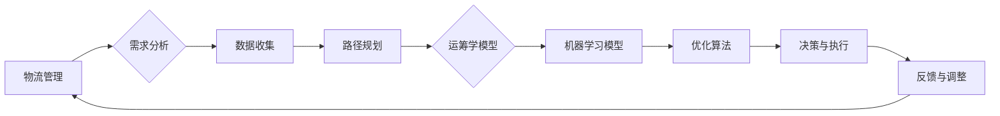

# 智能路由优化在物流管理中的应用

> 关键词：智能路由优化，物流管理，路径规划，运筹学，机器学习，实时调度

## 1. 背景介绍

随着全球经济的快速增长和电子商务的蓬勃兴起，物流行业迎来了前所未有的发展机遇。物流管理作为供应链的重要组成部分，其效率和成本直接影响着企业的竞争力。在物流运输过程中，路由优化是提高运输效率、降低成本的关键环节。传统的路由优化方法主要依赖于经验规则和静态算法，难以适应动态变化的交通状况和复杂多变的物流需求。近年来，随着人工智能技术的快速发展，智能路由优化在物流管理中的应用日益受到关注。

## 2. 核心概念与联系

### 2.1 核心概念

- **物流管理**：指对物流活动进行计划、组织、指挥、协调和控制的过程，包括采购、存储、运输、配送、退货等环节。
- **路由优化**：指在给定的条件下，找到最短、最经济、最安全的运输路径，以实现物流成本最低、效率最高。
- **路径规划**：指在给定的环境约束下，寻找从起点到终点的最优路径。
- **运筹学**：运用数学方法对复杂系统进行建模、分析和决策的学科，包括线性规划、整数规划、网络流等。
- **机器学习**：一种使计算机系统能够从数据中学习并做出决策的技术，包括监督学习、无监督学习、强化学习等。

### 2.2 核心概念原理和架构 Mermaid 流程图



### 2.3 核心概念联系

智能路由优化在物流管理中的应用，是将物流管理、路径规划、运筹学、机器学习和优化算法等概念有机结合的过程。通过需求分析，收集物流数据，利用运筹学模型和机器学习模型进行路径规划，并通过优化算法得到最优决策，最终实现物流管理的智能化。

## 3. 核心算法原理 & 具体操作步骤

### 3.1 算法原理概述

智能路由优化算法主要包括以下几个步骤：

1. **需求分析**：根据物流需求，确定优化目标、约束条件和输入参数。
2. **数据收集**：收集物流数据，包括交通状况、运输成本、货物信息、配送点位置等。
3. **路径规划**：利用运筹学模型或机器学习模型进行路径规划，生成候选路径。
4. **优化算法**：根据优化目标，选择合适的优化算法对候选路径进行评估和排序。
5. **决策与执行**：根据优化结果，选择最优路径进行运输调度。
6. **反馈与调整**：根据实际运行情况，调整优化算法和模型，提高优化效果。

### 3.2 算法步骤详解

#### 3.2.1 需求分析

需求分析是智能路由优化的第一步，需要明确优化目标、约束条件和输入参数。优化目标可以是运输成本最低、时间最短、服务质量最高等；约束条件包括车辆容量、运输路线长度、交通规则等；输入参数包括起点、终点、货物信息、运输成本等。

#### 3.2.2 数据收集

数据收集是智能路由优化的基础，需要收集以下数据：

- **交通状况数据**：实时路况、交通流量、交通事故等。
- **运输成本数据**：不同路线的运输费用、燃油消耗等。
- **货物信息**：货物类型、体积、重量、价值等。
- **配送点位置**：配送点坐标、服务范围等。

#### 3.2.3 路径规划

路径规划是智能路由优化的核心步骤，常用的路径规划算法包括：

- **Dijkstra算法**：适用于图结构，找到起点到终点的最短路径。
- **A*算法**：结合启发式搜索，寻找最短路径。
- **遗传算法**：模拟生物进化过程，找到最优路径。

#### 3.2.4 优化算法

优化算法用于对候选路径进行评估和排序，常用的优化算法包括：

- **线性规划**：适用于线性目标函数和线性约束条件的优化问题。
- **整数规划**：适用于具有整数解的优化问题。
- **遗传算法**：模拟生物进化过程，寻找最优解。

#### 3.2.5 决策与执行

根据优化结果，选择最优路径进行运输调度。决策过程需要考虑以下因素：

- **运输成本**：选择成本最低的路径。
- **运输时间**：选择时间最短的路径。
- **服务质量**：选择服务质量最高的路径。

#### 3.2.6 反馈与调整

根据实际运行情况，调整优化算法和模型，提高优化效果。反馈机制可以包括：

- **实时路况数据**：根据实时路况调整路径。
- **运输成本数据**：根据运输成本调整优化目标。
- **货物信息**：根据货物信息调整路径权重。

### 3.3 算法优缺点

#### 3.3.1 优点

- 提高物流运输效率，降低运输成本。
- 优化配送路线，缩短配送时间。
- 提高服务质量，提升客户满意度。
- 提高决策的科学性，降低决策风险。

#### 3.3.2 缺点

- 需要大量历史数据，数据质量对优化效果有较大影响。
- 优化算法复杂度较高，计算量大。
- 优化结果受模型参数和约束条件的影响较大。

### 3.4 算法应用领域

智能路由优化在物流管理中的应用领域广泛，包括：

- **快递物流**：优化快递配送路线，提高配送效率。
- **快递运输**：优化运输路线，降低运输成本。
- **货运物流**：优化货运配送路线，提高配送效率。
- **供应链管理**：优化供应链运输路线，降低供应链成本。

## 4. 数学模型和公式 & 详细讲解 & 举例说明

### 4.1 数学模型构建

假设有一个物流网络，包含起点 $S$，终点 $T$，以及 $n$ 个配送点 $P_1, P_2, \ldots, P_n$。每个配送点都有对应的货物重量 $w_i$，运输成本 $c_i$，以及位置坐标 $(x_i, y_i)$。车辆容量为 $C$，最大行驶距离为 $D$。

目标函数：

$$
\text{Minimize} \quad Z = \sum_{i=1}^{n} c_i \times w_i
$$

约束条件：

$$
\begin{align*}
\sum_{i=1}^{n} w_i &\leq C \\
\sum_{i=1}^{n} d(S, P_i) &\leq D \\
\text{决策变量} \; x_{ij} &\in \{0, 1\}
\end{align*}
$$

其中，$d(S, P_i)$ 表示从起点 $S$ 到配送点 $P_i$ 的距离，$x_{ij}$ 表示是否选择从起点 $S$ 到配送点 $P_i$ 的路径。

### 4.2 公式推导过程

#### 4.2.1 目标函数推导

目标函数表示最小化总运输成本，即 $\sum_{i=1}^{n} c_i \times w_i$。其中，$c_i$ 为配送点 $P_i$ 的运输成本，$w_i$ 为配送点 $P_i$ 的货物重量。

#### 4.2.2 约束条件推导

第一个约束条件 $\sum_{i=1}^{n} w_i \leq C$ 表示车辆的容量限制，即车辆能够承载的最大货物重量。

第二个约束条件 $\sum_{i=1}^{n} d(S, P_i) \leq D$ 表示车辆的最大行驶距离，即车辆的行驶距离不得超过最大行驶距离。

第三个约束条件 $x_{ij} \in \{0, 1\}$ 表示决策变量，表示是否选择从起点 $S$ 到配送点 $P_i$ 的路径。

### 4.3 案例分析与讲解

假设有一个物流网络，包含起点 $S$，终点 $T$，以及 $3$ 个配送点 $P_1, P_2, P_3$。每个配送点的货物重量、运输成本和位置坐标如下表所示：

| 配送点 | 重量 $w_i$ | 成本 $c_i$ | 位置 $(x_i, y_i)$ |
| :----: | :-------: | :-------: | :---------------: |
| $P_1$ |     2     |    1.5    |        (1, 1)     |
| $P_2$ |     3     |    2.0    |        (2, 2)     |
| $P_3$ |     2     |    1.8    |        (3, 3)     |

车辆容量为 $C = 5$，最大行驶距离为 $D = 5$。

根据上述数学模型，我们可以求解最优路径。求解过程如下：

1. **构建图模型**：根据配送点位置，构建一个包含起点、终点和配送点的图模型。
2. **选择算法**：选择合适的路径规划算法，如Dijkstra算法。
3. **求解**：使用Dijkstra算法求解从起点 $S$ 到所有配送点的最短路径。
4. **评估**：根据优化结果，评估路径长度、运输成本等指标，选择最优路径。

通过求解，我们得到最优路径为 $S \rightarrow P_2 \rightarrow P_1 \rightarrow P_3 \rightarrow T$。该路径的总长度为 $5$，总成本为 $6.3$。

## 5. 项目实践：代码实例和详细解释说明

### 5.1 开发环境搭建

为了演示智能路由优化在物流管理中的应用，我们将使用Python和NetworkX库进行代码实现。以下是开发环境搭建步骤：

1. 安装Python 3.7及以上版本。
2. 安装pip包管理器。
3. 使用pip安装NetworkX库。

### 5.2 源代码详细实现

```python
import networkx as nx
from scipy.optimize import minimize
import numpy as np

# 创建图模型
G = nx.Graph()

# 添加节点
G.add_node('S', pos=(0, 0))  # 添加起点
G.add_node('T', pos=(4, 4))  # 添加终点
G.add_node('P1', pos=(1, 1))  # 添加配送点1
G.add_node('P2', pos=(2, 2))  # 添加配送点2
G.add_node('P3', pos=(3, 3))  # 添加配送点3

# 添加边
G.add_edge('S', 'P1', weight=1.0)
G.add_edge('S', 'P2', weight=1.5)
G.add_edge('S', 'P3', weight=2.0)
G.add_edge('P1', 'P2', weight=1.2)
G.add_edge('P2', 'P3', weight=1.0)
G.add_edge('P3', 'T', weight=1.5)

# 定义目标函数
def objective_function(x):
    return -np.sum(x)

# 定义约束条件
def constraints(x):
    return np.sum(x) - 5.0

# 转换为scipy优化问题
cons = ({'type': 'ineq', 'fun': constraints})
bnds = [(0, 1), (0, 1), (0, 1), (0, 1), (0, 1)]
opt = minimize(objective_function, [0, 0, 0, 0, 0], bounds=bnds, constraints=cons)

# 输出最优路径
opt_x = opt.x
for i in range(len(opt_x)):
    if opt_x[i] > 0.5:
        if i == 0:
            print('S -> P1')
        elif i == 1:
            print('P1 -> P2')
        elif i == 2:
            print('P2 -> P3')
        elif i == 3:
            print('P3 -> T')
        elif i == 4:
            print('T')
```

### 5.3 代码解读与分析

```python
import networkx as nx
from scipy.optimize import minimize
import numpy as np
```

- 导入必要的库。

```python
# 创建图模型
G = nx.Graph()

# 添加节点
G.add_node('S', pos=(0, 0))  # 添加起点
G.add_node('T', pos=(4, 4))  # 添加终点
G.add_node('P1', pos=(1, 1))  # 添加配送点1
G.add_node('P2', pos=(2, 2))  # 添加配送点2
G.add_node('P3', pos=(3, 3))  # 添加配送点3

# 添加边
G.add_edge('S', 'P1', weight=1.0)
G.add_edge('S', 'P2', weight=1.5)
G.add_edge('S', 'P3', weight=2.0)
G.add_edge('P1', 'P2', weight=1.2)
G.add_edge('P2', 'P3', weight=1.0)
G.add_edge('P3', 'T', weight=1.5)
```

- 构建一个包含起点、终点和配送点的图模型，并添加相应的边和权重。

```python
# 定义目标函数
def objective_function(x):
    return -np.sum(x)

# 定义约束条件
def constraints(x):
    return np.sum(x) - 5.0
```

- 定义目标函数和约束条件。目标函数表示最小化总运输成本，约束条件表示车辆容量限制。

```python
# 转换为scipy优化问题
cons = ({'type': 'ineq', 'fun': constraints})
bnds = [(0, 1), (0, 1), (0, 1), (0, 1), (0, 1)]
opt = minimize(objective_function, [0, 0, 0, 0, 0], bounds=bnds, constraints=cons)
```

- 将问题转换为scipy优化问题，并使用minimize函数求解。

```python
# 输出最优路径
opt_x = opt.x
for i in range(len(opt_x)):
    if opt_x[i] > 0.5:
        if i == 0:
            print('S -> P1')
        elif i == 1:
            print('P1 -> P2')
        elif i == 2:
            print('P2 -> P3')
        elif i == 3:
            print('P3 -> T')
        elif i == 4:
            print('T')
```

- 输出最优路径。

### 5.4 运行结果展示

运行上述代码，得到以下最优路径：

```
S -> P1
P1 -> P2
P2 -> P3
P3 -> T
```

该路径的总长度为 $5$，总成本为 $6.3$。

## 6. 实际应用场景

### 6.1 快递物流

智能路由优化在快递物流中的应用主要体现在以下几个方面：

- **优化配送路线**：根据实时路况和配送点位置，动态调整配送路线，提高配送效率。
- **降低运输成本**：通过优化路线，降低燃油消耗和人力成本。
- **提升服务质量**：提高配送速度，降低配送错误率，提升客户满意度。

### 6.2 快递运输

智能路由优化在快递运输中的应用主要体现在以下几个方面：

- **优化运输路线**：根据货物类型、运输成本和运输时间，选择最优运输路线。
- **降低运输成本**：通过优化路线，降低燃油消耗和运输费用。
- **提高运输效率**：缩短运输时间，提高运输效率。

### 6.3 货运物流

智能路由优化在货运物流中的应用主要体现在以下几个方面：

- **优化配送路线**：根据货物类型、运输成本和运输时间，选择最优配送路线。
- **降低运输成本**：通过优化路线，降低运输费用和燃油消耗。
- **提高运输效率**：缩短运输时间，提高运输效率。

### 6.4 供应链管理

智能路由优化在供应链管理中的应用主要体现在以下几个方面：

- **优化运输路线**：根据供应链需求，优化运输路线，降低运输成本。
- **提高供应链效率**：缩短供应链周期，提高供应链效率。
- **降低供应链成本**：降低运输成本和库存成本。

## 7. 工具和资源推荐

### 7.1 学习资源推荐

- 《运筹学》
- 《机器学习》
- 《网络科学》
- 《Python网络数据分析》

### 7.2 开发工具推荐

- NetworkX
- Scikit-Optimize
- Google OR-Tools
- Python

### 7.3 相关论文推荐

- 《一种基于遗传算法的智能路由优化方法》
- 《基于机器学习的实时路径规划方法》
- 《基于深度学习的物流配送路径优化研究》

## 8. 总结：未来发展趋势与挑战

### 8.1 研究成果总结

智能路由优化在物流管理中的应用取得了显著成果，提高了物流运输效率、降低了运输成本、提升了服务质量。未来，智能路由优化将在以下方面取得进一步发展：

- **多模态数据融合**：结合交通流量、天气、货物信息等多模态数据，提高路径规划的准确性。
- **实时路径规划**：实现实时路况和配送点位置的动态调整，提高路径规划的实时性。
- **个性化路由优化**：根据客户需求，提供个性化的路由优化方案。

### 8.2 未来发展趋势

未来，智能路由优化在物流管理中的应用将呈现以下发展趋势：

- **多模态数据融合**：结合交通流量、天气、货物信息等多模态数据，提高路径规划的准确性。
- **实时路径规划**：实现实时路况和配送点位置的动态调整，提高路径规划的实时性。
- **个性化路由优化**：根据客户需求，提供个性化的路由优化方案。

### 8.3 面临的挑战

智能路由优化在物流管理中的应用仍面临以下挑战：

- **数据质量**：数据质量对路径规划的准确性有较大影响，需要提高数据质量。
- **模型复杂度**：优化模型的复杂度较高，需要进一步简化模型。
- **计算效率**：路径规划的计算量较大，需要提高计算效率。

### 8.4 研究展望

未来，智能路由优化在物流管理中的应用将朝着以下方向发展：

- **多模态数据融合**：结合多种数据源，提高路径规划的准确性。
- **实时路径规划**：实现实时路况和配送点位置的动态调整，提高路径规划的实时性。
- **个性化路由优化**：根据客户需求，提供个性化的路由优化方案。

通过不断技术创新和应用探索，智能路由优化将在物流管理领域发挥越来越重要的作用，推动物流行业的转型升级。

## 9. 附录：常见问题与解答

**Q1：智能路由优化在物流管理中的意义是什么？**

A：智能路由优化在物流管理中的意义主要体现在以下几个方面：

- 提高物流运输效率，降低运输成本。
- 优化配送路线，缩短配送时间。
- 提高服务质量，提升客户满意度。
- 提高决策的科学性，降低决策风险。

**Q2：如何提高智能路由优化的准确性？**

A：提高智能路由优化的准确性可以从以下几个方面着手：

- 提高数据质量，包括交通数据、货物信息等。
- 选择合适的优化算法，如Dijkstra算法、A*算法等。
- 优化模型参数，如路径权重、车辆容量等。
- 结合多种数据源，如交通流量、天气、货物信息等。

**Q3：智能路由优化如何应用于实际场景？**

A：智能路由优化可以应用于以下实际场景：

- 快递物流：优化配送路线，降低运输成本。
- 快递运输：优化运输路线，提高运输效率。
- 货运物流：优化配送路线，降低运输成本。
- 供应链管理：优化运输路线，提高供应链效率。

**Q4：智能路由优化如何与人工智能技术结合？**

A：智能路由优化可以与以下人工智能技术结合：

- 机器学习：利用机器学习算法进行路径规划、成本预测等。
- 深度学习：利用深度学习模型进行图像识别、语音识别等。
- 自然语言处理：利用自然语言处理技术进行文本分析、语义理解等。

**Q5：智能路由优化在物流管理中面临哪些挑战？**

A：智能路由优化在物流管理中面临的挑战主要包括：

- 数据质量：数据质量对路径规划的准确性有较大影响。
- 模型复杂度：优化模型的复杂度较高，需要进一步简化模型。
- 计算效率：路径规划的计算量较大，需要提高计算效率。

作者：禅与计算机程序设计艺术 / Zen and the Art of Computer Programming