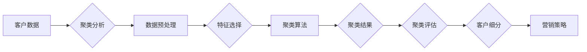

> 关键词：机器学习，客户细分，聚类分析，市场细分，客户价值，客户忠诚度，K-means，层次聚类，DBSCAN，决策树，随机森林

# 机器学习在客户细分中的应用

在当今的商业环境中，了解客户群体是至关重要的。客户细分能够帮助企业更有效地定位目标市场、优化营销策略、提高客户满意度和忠诚度。机器学习技术在客户细分中的应用，为这一过程带来了革命性的变革。本文将深入探讨机器学习在客户细分中的应用原理、算法、实践案例以及未来发展趋势。

## 1. 背景介绍

### 1.1 问题的由来

随着市场竞争的加剧和消费者行为的日益复杂，传统的客户细分方法，如简单的问卷调查或分段统计，已经难以满足企业对精准营销和个性化服务的要求。机器学习技术的出现，为从海量数据中挖掘客户群体特征提供了强大的工具。

### 1.2 研究现状

近年来，机器学习在客户细分领域得到了广泛应用，包括聚类分析、决策树、随机森林等多种算法。这些算法能够处理非结构化和半结构化数据，自动发现客户群体之间的隐含关系，为企业提供更深入的洞察。

### 1.3 研究意义

研究机器学习在客户细分中的应用，有助于：
- 提高营销效率，降低营销成本。
- 优化产品和服务，提升客户满意度。
- 发现潜在客户，提高客户忠诚度。
- 增强企业竞争力，实现可持续发展。

### 1.4 本文结构

本文将分为以下几个部分：
- 核心概念与联系
- 核心算法原理与具体操作步骤
- 数学模型和公式
- 项目实践：代码实例和详细解释说明
- 实际应用场景
- 工具和资源推荐
- 总结：未来发展趋势与挑战
- 附录：常见问题与解答

## 2. 核心概念与联系

### 2.1 核心概念

- **客户细分**：将客户群体根据不同的特征和行为划分为若干子群体，以便于企业进行更有针对性的营销和服务。
- **聚类分析**：一种无监督学习算法，用于将数据点按照相似性进行分组。
- **决策树**：一种基于树结构的预测模型，用于分类和回归任务。
- **随机森林**：一种集成学习方法，由多个决策树组成，以提高模型的准确性和稳定性。

### 2.2 核心概念原理和架构的 Mermaid 流程图



## 3. 核心算法原理 & 具体操作步骤

### 3.1 算法原理概述

机器学习在客户细分中的应用主要包括以下算法：

- **K-means聚类**：将数据点划分为K个簇，每个簇内的数据点相似度高，簇间数据点相似度低。
- **层次聚类**：根据数据点之间的相似性，构建一棵树，将相似度高的数据点合并成簇。
- **DBSCAN**：一种密度聚类算法，可以识别出任意形状的簇。
- **决策树**：根据特征值对数据进行划分，形成树状结构。
- **随机森林**：由多个决策树组成，通过投票或平均预测结果来提高模型的准确性。

### 3.2 算法步骤详解

1. 数据收集：收集客户数据，包括人口统计学信息、消费行为、历史交易数据等。
2. 数据预处理：清洗数据，处理缺失值，进行特征工程，选择与客户细分相关的特征。
3. 选择算法：根据数据特点和业务需求选择合适的聚类算法。
4. 训练模型：使用训练数据对模型进行训练。
5. 验证模型：使用验证数据对模型进行评估，调整模型参数。
6. 应用模型：使用训练好的模型对新的客户数据进行细分。

### 3.3 算法优缺点

- **K-means聚类**：优点是简单易用，缺点是容易受初始值影响，且只能识别球形簇。
- **层次聚类**：优点是能够识别任意形状的簇，缺点是计算复杂度高。
- **DBSCAN**：优点是能够识别任意形状的簇，缺点是参数选择困难。
- **决策树**：优点是易于解释，缺点是容易过拟合。
- **随机森林**：优点是准确性和稳定性高，缺点是难以解释。

### 3.4 算法应用领域

机器学习在客户细分中的应用领域包括：
- 金融行业：客户风险评分、欺诈检测、信用评估。
- 零售行业：客户细分、推荐系统、个性化营销。
- 电信行业：客户流失预测、客户价值分析、市场细分。
- 娱乐行业：用户行为分析、内容推荐、广告投放。

## 4. 数学模型和公式 & 详细讲解 & 举例说明

### 4.1 数学模型构建

聚类分析中常用的数学模型包括：

- **K-means聚类**：最小化距离平方和：
  $$
 J(\mu_1, \mu_2, ..., \mu_K) = \sum_{i=1}^K \sum_{x \in C_i} ||x - \mu_i||^2 
$$
  其中 $\mu_i$ 是第 $i$ 个簇的中心点，$C_i$ 是第 $i$ 个簇的样本集合。

- **层次聚类**：通过构建距离矩阵和树状图来表示簇之间的关系。

### 4.2 公式推导过程

以K-means聚类为例，以下是目标函数的推导过程：

- 初始化K个簇中心点 $\mu_1, \mu_2, ..., \mu_K$。
- 对于每个数据点 $x$，将其分配到最近的簇中心点所在簇。
- 更新簇中心点为该簇所有成员点的均值。

### 4.3 案例分析与讲解

假设我们有一个包含100个客户的数据集，其中包含3个特征：年龄、收入和消费金额。我们希望使用K-means聚类将客户分为3个簇。

```python
from sklearn.cluster import KMeans
import numpy as np

# 假设数据
data = np.array([[25, 30000, 5000], [30, 35000, 6000], [45, 45000, 7500], ...])

# 创建KMeans聚类对象，设置聚类数量为3
kmeans = KMeans(n_clusters=3)

# 训练模型
kmeans.fit(data)

# 获取聚类结果
labels = kmeans.labels_
centroids = kmeans.cluster_centers_

# 输出结果
print("Cluster labels:", labels)
print("Cluster centroids:", centroids)
```

## 5. 项目实践：代码实例和详细解释说明

### 5.1 开发环境搭建

在进行客户细分的项目实践前，我们需要搭建相应的开发环境。以下是使用Python进行机器学习实践的环境配置流程：

1. 安装Anaconda：从官网下载并安装Anaconda，用于创建独立的Python环境。
2. 创建并激活虚拟环境：
   ```bash
   conda create -n ml-env python=3.8
   conda activate ml-env
   ```
3. 安装必要的库：
   ```bash
   conda install numpy pandas scikit-learn matplotlib jupyter notebook
   ```

### 5.2 源代码详细实现

以下是一个使用Python和Scikit-learn库进行客户细分的项目实践实例。

```python
from sklearn.cluster import KMeans
from sklearn.datasets import make_blobs
import matplotlib.pyplot as plt

# 生成模拟数据
X, _ = make_blobs(n_samples=100, centers=3, cluster_std=0.6, random_state=0)

# 创建KMeans聚类对象，设置聚类数量为3
kmeans = KMeans(n_clusters=3)

# 训练模型
kmeans.fit(X)

# 获取聚类结果
labels = kmeans.labels_

# 绘制结果
plt.scatter(X[:, 0], X[:, 1], c=labels)
plt.scatter(kmeans.cluster_centers_[:, 0], kmeans.cluster_centers_[:, 1], s=300, c='red', marker='x')
plt.title('K-means Clustering')
plt.xlabel('Feature 1')
plt.ylabel('Feature 2')
plt.show()
```

### 5.3 代码解读与分析

- 代码首先使用Scikit-learn的`make_blobs`函数生成了一个包含100个样本的模拟数据集。
- 然后创建了一个KMeans聚类对象，并设置了聚类数量为3。
- 接着使用模拟数据对聚类模型进行训练。
- 最后，使用matplotlib库绘制了样本点和簇中心点。

通过以上代码，我们可以直观地看到K-means聚类算法将数据点划分为3个簇，簇中心点位于样本点附近。

### 5.4 运行结果展示

运行上述代码后，我们将得到一个散点图，展示样本点和簇中心点的分布情况。每个不同的颜色代表一个不同的簇。

## 6. 实际应用场景

机器学习在客户细分中的应用场景非常广泛，以下是一些典型的应用案例：

- **零售行业**：通过分析客户的购买历史和偏好，将客户划分为不同的群体，以便于进行精准营销和个性化推荐。
- **金融行业**：通过分析客户的信用记录和交易行为，将客户划分为不同的信用等级，以便于进行风险评估和控制欺诈行为。
- **电信行业**：通过分析客户的通话记录和流量使用情况，将客户划分为不同的套餐，以便于制定更合理的定价策略。
- **医疗行业**：通过分析患者的病历和检查结果，将患者划分为不同的疾病群体，以便于进行个性化治疗和疾病预防。

## 7. 工具和资源推荐

### 7.1 学习资源推荐

- 《Python机器学习》
- 《机器学习实战》
- Scikit-learn官方文档
- TensorFlow官方文档
- PyTorch官方文档

### 7.2 开发工具推荐

- Jupyter Notebook
- Anaconda
- PyCharm
- Scikit-learn
- TensorFlow
- PyTorch

### 7.3 相关论文推荐

- "K-means++: The Advantages of Careful Seeding" by David Arthur and Sergei Vassilvitskii
- "A Comparison of Best First, Random, and Genetic Local Search Strategies for K-Means Clustering" by Anil K. Jain and R. C. Dubes
- "The Quest to Build the Best Clustering Algorithm: A Comprehensive Comparison of 53 Clustering Algorithms" by T. R. G. Theiler

## 8. 总结：未来发展趋势与挑战

### 8.1 研究成果总结

机器学习在客户细分中的应用取得了显著的成果，为企业提供了更精准的营销策略和个性化服务。然而，随着数据量的不断增长和算法的日益复杂，机器学习在客户细分领域仍然面临着一些挑战。

### 8.2 未来发展趋势

- **算法的智能化**：开发更加智能的聚类算法，能够自动选择合适的聚类数量和簇结构。
- **数据融合**：将结构化和非结构化数据进行融合，以更全面地了解客户。
- **模型的可解释性**：提高模型的可解释性，使企业能够理解模型的决策过程。
- **实时分析**：开发实时分析技术，以便于企业能够及时响应客户需求。

### 8.3 面临的挑战

- **数据质量**：数据质量直接影响模型的性能，需要确保数据的质量和准确性。
- **算法选择**：不同的算法适用于不同的场景，需要根据具体问题选择合适的算法。
- **模型解释性**：提高模型的可解释性，以便于企业理解模型的决策过程。
- **隐私保护**：在处理客户数据时，需要确保数据的隐私安全。

### 8.4 研究展望

机器学习在客户细分领域的应用具有广阔的前景，未来需要进一步研究以下方向：

- 开发更加智能的聚类算法，能够自动选择合适的聚类数量和簇结构。
- 将结构化和非结构化数据进行融合，以更全面地了解客户。
- 提高模型的可解释性，使企业能够理解模型的决策过程。
- 开发实时分析技术，以便于企业能够及时响应客户需求。

## 9. 附录：常见问题与解答

**Q1：客户细分有什么意义？**

A：客户细分有助于企业更有效地定位目标市场、优化营销策略、提高客户满意度和忠诚度。

**Q2：机器学习在客户细分中有哪些应用？**

A：机器学习在客户细分中的应用包括聚类分析、决策树、随机森林等多种算法。

**Q3：如何选择合适的聚类算法？**

A：选择合适的聚类算法需要考虑数据特点、业务需求和计算资源等因素。

**Q4：如何评估聚类结果？**

A：可以使用轮廓系数、Calinski-Harabasz指数等指标来评估聚类结果。

**Q5：如何提高模型的可解释性？**

A：可以使用特征重要性、LIME等工具来提高模型的可解释性。

作者：禅与计算机程序设计艺术 / Zen and the Art of Computer Programming