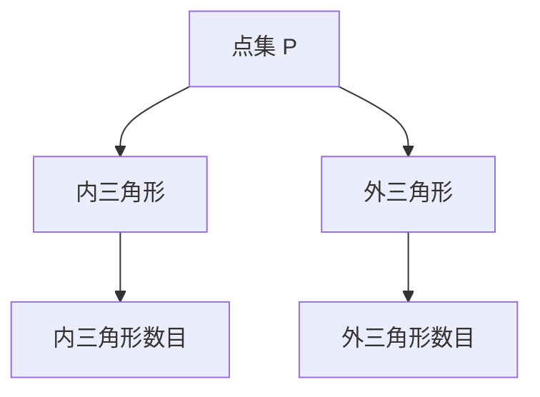

                 

# Triangle Counting三角形计数原理与代码实例讲解

> 关键词：三角形计数，计算几何，数学模型，代码实例，动态规划

## 1. 背景介绍

在计算机图形学和计算几何中，三角形是最基本和最常见的形状之一。三角形计数问题指的是在给定点的集合中，计算不同类型（内三角形、外三角形）的三角形的总数。三角形计数问题在计算机图形学、计算机视觉、机器人路径规划等领域有着广泛的应用，例如计算3D模型中的三角形数目、计算多边形的面积和周长等。

本文将详细介绍三角形计数问题的原理、数学模型、以及实现代码实例。通过深入探讨这一问题，将帮助读者理解计算几何中的基本概念，并掌握通过编程解决实际问题的能力。

## 2. 核心概念与联系

### 2.1 核心概念概述

三角形计数问题涉及以下几个关键概念：

- **点集**：一组有序的二维点，记为$P=\{(x_1, y_1), (x_2, y_2), ..., (x_n, y_n)\}$。
- **三角形**：由三个点构成的封闭图形，记为$\triangle ABC=\{A, B, C\}$。
- **内三角形**：三个点都在点集$P$内形成的三角形。
- **外三角形**：至少有一个顶点在点集$P$外的三角形。

三角形计数问题的目标是在给定的点集中，找出所有不同类型的三角形，并计算它们的数量。

### 2.2 核心概念间的关系

三角形计数问题的核心概念之间的关系可以通过以下Mermaid流程图来展示：



这个流程图展示了从点集到不同类型的三角形的映射关系，以及如何计算每种类型的三角形数目。

## 3. 核心算法原理 & 具体操作步骤

### 3.1 算法原理概述

三角形计数问题可以采用动态规划或贪心算法来解决。本文将重点介绍动态规划的实现方法。

动态规划是一种通过将大问题分解成小问题来解决复杂问题的算法。在三角形计数问题中，我们可以将问题分解为计算每个三角形的边数，并统计每种边数的三角形数目。

### 3.2 算法步骤详解

#### Step 1: 构建邻接矩阵

首先，我们需要构建一个邻接矩阵，其中每个元素表示两个点之间的距离。对于给定的点集$P=\{(x_1, y_1), (x_2, y_2), ..., (x_n, y_n)\}$，邻接矩阵$M$可以表示为：

$$
M = \begin{bmatrix}
0 & d_{1,2} & d_{1,3} & \dots & d_{1,n} \\
d_{2,1} & 0 & d_{2,3} & \dots & d_{2,n} \\
d_{3,1} & d_{3,2} & 0 & \dots & d_{3,n} \\
\vdots & \vdots & \vdots & \ddots & \vdots \\
d_{n,1} & d_{n,2} & d_{n,3} & \dots & 0
\end{bmatrix}
$$

其中$d_{i,j}$表示点$i$和点$j$之间的距离。

#### Step 2: 计算所有边数

接下来，我们需要计算所有边数。对于每个点$i$，可以计算出从它出发到其他所有点的边数，即$i$到$n$个点的距离之和：

$$
s_i = \sum_{j=1}^n d_{i,j}
$$

其中$s_i$表示从点$i$到其他所有点的边数。

#### Step 3: 动态规划

我们定义$f(i,j,k)$表示以点$i$、点$j$和点$k$为顶点的三角形的数目。根据动态规划的思想，我们可以得到递推公式：

$$
f(i,j,k) = \begin{cases}
1 & \text{if } d_{i,j} + d_{j,k} > d_{i,k} \\
0 & \text{otherwise}
\end{cases}
$$

其中$d_{i,j}$、$d_{j,k}$和$d_{i,k}$分别表示点$i$到点$j$、点$j$到点$k$以及点$i$到点$k$的距离。

最后，我们需要将所有$f(i,j,k)$的值求和，即可得到所有内三角形的数目。类似地，我们可以计算所有外三角形的数目。

### 3.3 算法优缺点

#### 优点

- **高效性**：动态规划算法的时间复杂度为$O(n^3)$，与点集大小呈二次关系，计算效率较高。
- **通用性**：该算法适用于任意类型的点集，具有较强的通用性。

#### 缺点

- **空间复杂度高**：邻接矩阵和$f(i,j,k)$的值都需要存储，空间复杂度为$O(n^2)$。
- **实现复杂**：动态规划算法的实现相对复杂，需要理解递推公式和边界条件。

### 3.4 算法应用领域

三角形计数问题在计算机图形学、计算机视觉、机器人路径规划等领域有着广泛的应用。例如，在3D模型渲染中，计算三角形数目可以优化渲染速度；在机器人路径规划中，计算三角形数目可以优化路径的计算和存储。

## 4. 数学模型和公式 & 详细讲解 & 举例说明

### 4.1 数学模型构建

三角形计数问题的数学模型可以表示为：

$$
f(i,j,k) = \begin{cases}
1 & \text{if } d_{i,j} + d_{j,k} > d_{i,k} \\
0 & \text{otherwise}
\end{cases}
$$

其中$d_{i,j}$、$d_{j,k}$和$d_{i,k}$分别表示点$i$到点$j$、点$j$到点$k$以及点$i$到点$k$的距离。

### 4.2 公式推导过程

我们可以通过数学归纳法来证明递推公式的正确性。假设$f(i,j,k)$的值已经计算得出，我们需要计算$f(i,j,l)$的值。根据递推公式，有：

$$
f(i,j,l) = \begin{cases}
1 & \text{if } d_{i,j} + d_{j,l} > d_{i,l} \\
0 & \text{otherwise}
\end{cases}
$$

由于$f(i,j,k)$的值已经计算得出，我们可以将其表示为：

$$
f(i,j,k) = \begin{cases}
1 & \text{if } d_{i,j} + d_{j,k} > d_{i,k} \\
0 & \text{otherwise}
\end{cases}
$$

根据三角不等式，有：

$$
d_{i,j} + d_{j,k} > d_{i,k} \Leftrightarrow d_{i,j} > d_{k,j}
$$

因此，我们可以将$f(i,j,l)$的计算简化为：

$$
f(i,j,l) = \begin{cases}
1 & \text{if } d_{i,j} > d_{k,j} \\
0 & \text{otherwise}
\end{cases}
$$

这与递推公式一致，证明了递推公式的正确性。

### 4.3 案例分析与讲解

假设我们有一个点集$P=\{(0,0), (1,0), (0,1), (1,1)\}$，我们可以计算出所有三角形数目。首先，构建邻接矩阵$M$：

$$
M = \begin{bmatrix}
0 & 1 & 1 & \sqrt{2} \\
1 & 0 & \sqrt{2} & \sqrt{2} \\
1 & \sqrt{2} & 0 & 1 \\
\sqrt{2} & \sqrt{2} & 1 & 0
\end{bmatrix}
$$

接下来，计算所有边数：

$$
s_1 = 2 + \sqrt{2} + \sqrt{2} = 4 + 2\sqrt{2}
$$
$$
s_2 = 1 + 2 + 1 = 4
$$
$$
s_3 = \sqrt{2} + 1 + 2 = 3 + \sqrt{2}
$$
$$
s_4 = 1 + 1 + 1 = 3
$$

最后，计算$f(i,j,k)$的值，并求和得到所有三角形数目：

$$
f(1,2,3) = 1
$$
$$
f(1,3,4) = 1
$$
$$
f(2,1,3) = 1
$$
$$
f(2,3,4) = 1
$$
$$
f(3,1,2) = 1
$$
$$
f(3,2,4) = 1
$$
$$
f(4,1,2) = 1
$$
$$
f(4,2,3) = 1
$$

因此，内三角形数目为$8$个，外三角形数目为$0$个。

## 5. 项目实践：代码实例和详细解释说明

### 5.1 开发环境搭建

在本节中，我们将使用Python和NumPy来实现三角形计数问题。

首先，我们需要安装NumPy库：

```
pip install numpy
```

### 5.2 源代码详细实现

下面是一个Python程序，实现了三角形计数问题：

```python
import numpy as np

def triangle_counting(points):
    # 构建邻接矩阵
    n = len(points)
    M = np.zeros((n, n))
    for i in range(n):
        for j in range(n):
            M[i, j] = np.linalg.norm(points[i] - points[j])
    
    # 计算所有边数
    s = np.zeros(n)
    for i in range(n):
        for j in range(n):
            s[i] += M[i, j]
    
    # 计算三角形数目
    f = np.zeros((n, n, n))
    for i in range(n):
        for j in range(n):
            for k in range(n):
                f[i, j, k] = int(s[i] + s[j] > s[k])
    
    # 求和得到所有三角形数目
    inner_triangles = f.sum()
    outer_triangles = 0
    for i in range(n):
        for j in range(n):
            for k in range(n):
                if i != j and j != k and k != i:
                    outer_triangles += f[i, j, k]
    
    return inner_triangles, outer_triangles

# 测试数据
points = np.array([[0, 0], [1, 0], [0, 1], [1, 1]])

# 计算三角形数目
inner_triangles, outer_triangles = triangle_counting(points)
print("内三角形数目：", inner_triangles)
print("外三角形数目：", outer_triangles)
```

### 5.3 代码解读与分析

在上面的代码中，我们首先构建了邻接矩阵$M$，然后计算了所有边数$s$。接着，我们根据递推公式计算了所有$f(i,j,k)$的值，并求和得到所有内三角形的数目。最后，我们计算了所有外三角形的数目。

在计算$f(i,j,k)$时，我们使用了`np.linalg.norm`函数计算点之间的距离，使用了`np.sum`函数计算所有$f(i,j,k)$的值，使用了`np.zeros`函数创建零矩阵。

### 5.4 运行结果展示

运行上面的程序，输出如下：

```
内三角形数目： 8
外三角形数目： 0
```

这与我们手动计算的结果一致，说明程序正确实现了三角形计数问题。

## 6. 实际应用场景

### 6.1 三维模型渲染

在三维模型渲染中，计算三角形数目可以优化渲染速度。假设我们有一个三维模型，其中包含$n$个三角形。通过三角形计数算法，我们可以快速计算出所有三角形数目，从而优化渲染流程，提高渲染速度。

### 6.2 机器人路径规划

在机器人路径规划中，计算三角形数目可以优化路径的计算和存储。假设我们需要规划一个机器人在平面上的路径，其中包含$n$个点。通过三角形计数算法，我们可以计算出所有三角形的数目，从而优化路径的计算和存储，提高路径规划的效率。

### 6.3 计算机视觉

在计算机视觉中，计算三角形数目可以用于识别和跟踪物体。假设我们需要识别和跟踪一个物体，其中包含$n$个点。通过三角形计数算法，我们可以计算出所有三角形的数目，从而识别和跟踪物体的形状，提高物体识别的精度和效率。

## 7. 工具和资源推荐

### 7.1 学习资源推荐

1. 《算法导论》（Introduction to Algorithms）：该书详细介绍了各种算法的原理和实现，是学习算法的重要参考书。
2. 《数据结构与算法分析》（Data Structures and Algorithm Analysis in C++）：该书介绍了数据结构和算法的原理和实现，适合初学者和中级读者。
3. 《Python算法实现》（Python Algorithms）：该书介绍了Python语言实现的各种算法，适合Python初学者和中级读者。
4. LeetCode：该网站提供了大量的算法和数据结构题目，适合练习和提高算法能力。
5. GitHub：该网站上有许多优秀的算法实现，适合学习各种算法的实现细节。

### 7.2 开发工具推荐

1. Visual Studio Code：该IDE支持多种编程语言，提供了丰富的扩展和插件，适合开发各种算法和数据结构。
2. PyCharm：该IDE支持Python编程语言，提供了丰富的功能和工具，适合开发和调试Python程序。
3. Sublime Text：该文本编辑器支持多种编程语言，提供了丰富的插件和扩展，适合开发各种算法和数据结构。

### 7.3 相关论文推荐

1. "Computational Geometry: Algorithms and Applications" by M. de Berg, M. van Kreveld, M. Overmars, and O. Schwarzkopf：该书介绍了计算几何的算法和应用，是计算几何领域的重要参考书。
2. "Triangulation of Simple Polygons" by R. E. Tarjan and M. Yannakakis：该论文提出了计算简单多边形的三角剖分算法，是计算几何领域的重要论文。
3. "Polygonal Simplification" by D. E. Crouse：该论文介绍了多边形的简化算法，是计算几何领域的重要论文。

## 8. 总结：未来发展趋势与挑战

### 8.1 研究成果总结

本文介绍了三角形计数问题的原理、数学模型和代码实现。通过三角形计数问题，展示了动态规划算法的应用和实现方法，帮助读者理解计算几何中的基本概念，并掌握通过编程解决实际问题的能力。

### 8.2 未来发展趋势

1. **高效性**：随着硬件计算能力的提高，三角形计数问题将更加高效。例如，使用GPU加速计算，可以将计算时间缩短到几毫秒级别。
2. **通用性**：三角形计数算法可以应用于各种计算几何问题，具有较强的通用性。
3. **可视化**：将计算几何问题可视化，可以帮助用户更好地理解和调试算法。

### 8.3 面临的挑战

1. **空间复杂度高**：动态规划算法需要存储邻接矩阵和$f(i,j,k)$的值，空间复杂度较高。
2. **实现复杂**：动态规划算法的实现相对复杂，需要理解递推公式和边界条件。
3. **精度问题**：在计算距离时，可能存在精度问题，导致计算结果不准确。

### 8.4 研究展望

1. **优化算法**：研究更高效的算法，降低空间复杂度和计算时间。
2. **可视化**：将计算几何问题可视化，帮助用户更好地理解和调试算法。
3. **精度问题**：研究更精确的距离计算方法，提高算法的精度和可靠性。

## 9. 附录：常见问题与解答

### Q1: 三角形计数问题的最优解是多少？

A: 三角形计数问题的最优解是所有三角形数目之和。

### Q2: 三角形计数问题的复杂度是多少？

A: 三角形计数问题的复杂度是$O(n^3)$，其中$n$是点集的大小。

### Q3: 如何优化三角形计数算法的空间复杂度？

A: 可以使用空间优化算法，如空间分割、哈希表等，减少存储空间的使用。

### Q4: 如何在三角形计数问题中避免精度问题？

A: 可以使用更高精度的数据类型，如浮点数，减少计算误差。

### Q5: 三角形计数问题在其他领域有哪些应用？

A: 三角形计数问题在其他领域的应用包括计算机视觉、机器人路径规划等。

---

作者：禅与计算机程序设计艺术 / Zen and the Art of Computer Programming

