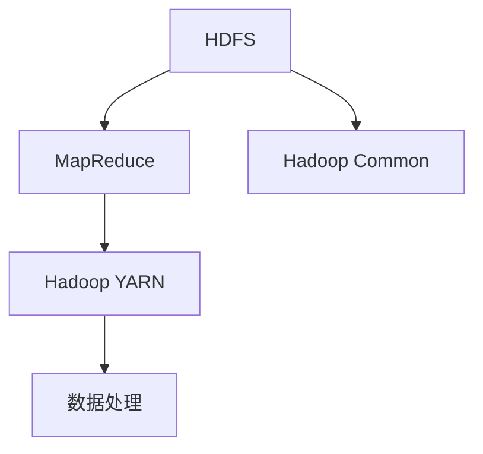
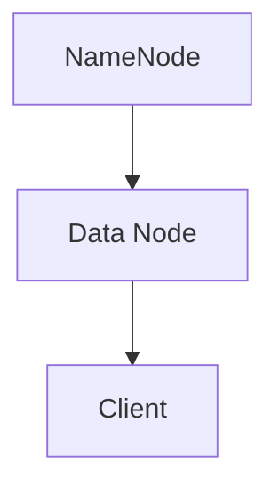

                 

# 【AI大数据计算原理与代码实例讲解】HDFS

> 关键词：Hadoop, HDFS, MapReduce, 大数据, 分布式文件系统, 数据存储, 数据处理, 云计算

## 1. 背景介绍

### 1.1 问题由来

随着互联网和移动互联网的迅猛发展，数据量呈爆炸式增长，如何高效存储、处理和分析大规模数据，成为了各大企业和技术公司面临的重要挑战。特别是在电子商务、金融、社交媒体等领域，数据量动辄以PB（1PB = 1024TB）计，单台计算机已无法满足需求。在这样的背景下，分布式计算技术应运而生，Hadoop成为了其中的佼佼者。

Hadoop是一个开源的分布式计算平台，基于Apache软件基金会开源，由Google的MapReduce和Google文件系统（GFS）的思想演变而来。Hadoop的核心组件包括Hadoop分布式文件系统（HDFS）和Hadoop MapReduce，它们广泛应用于云计算、大数据处理等领域，成为大数据时代的基石。

HDFS（Hadoop Distributed File System）是Hadoop项目的重要组成部分，是分布式文件存储和管理系统。它通过分散存储文件，实现数据的高可用性、可扩展性和容错性，为Hadoop生态系统的其他组件提供底层支持。

本文将深入探讨HDFS的原理与实现，通过详细的代码实例，帮助读者理解HDFS的工作机制和基本操作。

## 2. 核心概念与联系

### 2.1 核心概念概述

为了更好地理解HDFS的原理与实现，我们首先需要介绍几个关键概念：

- HDFS：Hadoop分布式文件系统，是Hadoop生态系统中的核心组件，用于存储和管理大规模数据集。
- MapReduce：Hadoop分布式计算框架，用于处理大规模数据集，通过并行处理和数据分片实现高效率的数据处理。
- Hadoop YARN：资源管理系统，用于调度和管理集群中的各种资源，支持MapReduce和其他框架的运行。
- Hadoop Common：包含Hadoop生态系统中的公共组件，如日志管理、命令行工具、配置管理等。

这些概念相互依存，共同构成了一个高效、可靠的大数据处理平台。其中，HDFS作为底层数据存储和管理系统，是整个Hadoop生态系统的核心。

### 2.2 核心概念的联系

HDFS与MapReduce、Hadoop YARN、Hadoop Common等概念的联系可以通过以下Mermaid流程图来展示：



这个流程图展示了HDFS与Hadoop生态系统其他组件的关联。HDFS为MapReduce提供底层数据存储支持，Hadoop YARN负责资源调度和管理，Hadoop Common提供公共组件和工具，这些共同构成了Hadoop大数据处理平台的完整生态。

## 3. 核心算法原理 & 具体操作步骤

### 3.1 算法原理概述

HDFS是一种分布式文件系统，通过在多个节点上分散存储数据，实现高可用性、高可扩展性和高容错性。HDFS的核心原理包括数据分片、数据冗余、数据访问等。

#### 3.1.1 数据分片

HDFS将大文件划分为多个数据块（Block），每个数据块的大小为64MB或128MB（默认）。这些数据块被分发到不同的数据节点（Data Node）上进行存储。HDFS通过一个名为NameNode的组件来管理这些数据块的位置信息，NameNode负责维护整个文件系统的元数据，包括文件块的分布、权限等。

#### 3.1.2 数据冗余

为了保证数据的可靠性和容错性，HDFS采用数据冗余（Replication）策略。每个数据块会被复制到多个数据节点上，默认复制因子为3。如果某个数据节点故障，系统可以从其他两个复制的数据节点中恢复数据，确保数据不会丢失。

#### 3.1.3 数据访问

HDFS支持高并发的数据读写操作。当客户端（Client）访问HDFS时，NameNode返回数据块的分布信息，客户端可以根据这些信息直接访问对应的数据节点，从而实现高效的数据读写。

### 3.2 算法步骤详解

下面我们将通过具体的代码实例，详细介绍HDFS的基本操作和实现原理。

#### 3.2.1 HDFS文件系统架构

首先，我们需要了解HDFS的基本架构，包括NameNode、Data Node、Client等组件的职责和交互方式。以下是一个简化的HDFS架构图：



NameNode负责管理文件系统的元数据，包括文件块的分布、权限等。Data Node负责存储数据块，Client负责与NameNode和Data Node进行通信，进行文件读写操作。

#### 3.2.2 HDFS文件系统操作

接下来，我们将介绍HDFS的基本操作，包括创建文件、删除文件、读取文件等。

##### 创建文件

创建文件的步骤如下：

1. 客户端通过HDFS命令行工具或API向NameNode发起创建文件请求。
2. NameNode分配文件在文件系统中的位置信息，并分配数据块。
3. 客户端向Data Node请求存储数据块，Data Node接收数据并进行写入操作。
4. 当数据块写入完成后，客户端向NameNode报告，NameNode更新文件系统的元数据。

以下是一个简单的HDFS命令行创建文件的示例：

```bash
hdfs dfs -mkdir /input
hdfs dfs -mkdir /output
hdfs dfs -put local_file input/
```

这个命令创建了/input和/output两个目录，并将本地文件复制到了/input目录中。

##### 删除文件

删除文件的步骤如下：

1. 客户端通过HDFS命令行工具或API向NameNode发起删除文件请求。
2. NameNode删除文件在文件系统中的位置信息，并删除对应的数据块。
3. Data Node删除数据块。

以下是一个简单的HDFS命令行删除文件的示例：

```bash
hdfs dfs -rm -r input/
```

这个命令删除了/input目录及其下的所有文件和子目录。

##### 读取文件

读取文件的步骤如下：

1. 客户端通过HDFS命令行工具或API向NameNode请求文件的位置信息。
2. NameNode返回文件块的分布信息。
3. 客户端根据文件块分布信息，向对应的Data Node请求数据块，并进行读取操作。

以下是一个简单的HDFS命令行读取文件的示例：

```bash
hdfs dfs -cat input/
```

这个命令读取了/input目录下的所有文件内容，并将结果输出到标准输出流中。

### 3.3 算法优缺点

#### 3.3.1 优点

- 高可扩展性：HDFS通过分散存储数据，支持文件系统的水平扩展，可以处理PB级的大规模数据。
- 高可靠性：HDFS采用数据冗余策略，即使某个数据节点故障，也可以通过其他复制的数据节点恢复数据，确保数据不会丢失。
- 高效性：HDFS支持高并发的数据读写操作，适合大规模数据处理。

#### 3.3.2 缺点

- 延迟高：HDFS的读取延迟较高，主要原因在于需要从NameNode获取文件块的分布信息，然后再向Data Node请求数据。
- 单点故障：NameNode是整个文件系统的中心节点，一旦NameNode故障，整个文件系统将无法正常工作。

### 3.4 算法应用领域

HDFS被广泛应用于各种大规模数据处理场景，如：

- 电子商务：HDFS存储用户数据、交易数据等，支持大规模的实时分析和推荐系统。
- 金融：HDFS存储交易数据、客户数据等，支持大规模的数据挖掘和风险分析。
- 社交媒体：HDFS存储用户数据、社交网络数据等，支持大规模的用户行为分析和社交网络分析。
- 科学研究：HDFS存储科学数据，支持大规模的科学数据存储和处理。

## 4. 数学模型和公式 & 详细讲解 & 举例说明

### 4.1 数学模型构建

为了更好地理解HDFS的原理，我们需要构建一些数学模型。假设文件系统中共有N个数据块，每个数据块大小为B，每个数据块的复制因子为R。

定义：

- $N$：文件系统的数据块数。
- $B$：每个数据块的大小，单位为字节。
- $R$：每个数据块的复制因子。

### 4.2 公式推导过程

HDFS的数据冗余策略可以表示为：

$$
\text{总数据量} = N \times B = N \times R \times \frac{B}{R}
$$

其中，$\frac{B}{R}$表示每个复制的数据块的大小。

根据这个公式，我们可以得出：

$$
\text{每个数据块的实际大小} = \frac{B}{R}
$$

这个公式可以帮助我们理解HDFS的数据冗余策略，即每个数据块实际大小是数据块原始大小与复制因子的比值。

### 4.3 案例分析与讲解

假设文件系统中共有100个数据块，每个数据块的大小为128MB，每个数据块的复制因子为3。我们可以计算出每个数据块的实际大小为：

$$
\text{每个数据块的实际大小} = \frac{128 \times 1024 \times 1024}{3} \approx 43.6MB
$$

这意味着每个数据块实际大小约为43.6MB，即每个数据块大小为128MB，但每个数据块需要复制到3个数据节点上，因此每个数据块的实际大小为43.6MB。

## 5. 项目实践：代码实例和详细解释说明

### 5.1 开发环境搭建

在进行HDFS的实践前，我们需要搭建一个Hadoop集群环境。以下是一个简单的Hadoop集群搭建步骤：

1. 下载Hadoop源代码，解压到指定目录。
2. 解压解压后的源代码到指定目录。
3. 进入解压后的目录，执行./configure命令配置环境。
4. 执行make命令编译Hadoop。
5. 执行make dist命令生成Hadoop安装包。
6. 解压安装包，启动Hadoop集群。

### 5.2 源代码详细实现

下面我们将通过一个简单的HDFS文件系统操作示例，演示如何通过Python代码实现HDFS的创建、读取和删除文件操作。

```python
from hdfs import InsecureClient

# 连接到HDFS
client = InsecureClient('hdfs://localhost:50070', user='hdfs')

# 创建目录
client.makedirs('/input')
client.makedirs('/output')

# 上传文件
with open('local_file.txt', 'rb') as f:
    client.upload('/input/local_file.txt', f)

# 读取文件
with client.read('/input/local_file.txt') as f:
    print(f.read())

# 删除目录
client.delete('/input')
```

这个Python代码示例展示了如何通过Python库InsecureClient实现HDFS的文件系统操作，包括创建目录、上传文件、读取文件和删除目录。

### 5.3 代码解读与分析

我们逐一解读上述代码中的关键步骤：

1. 连接到HDFS：通过InsecureClient类连接到HDFS。
2. 创建目录：使用makedirs方法创建目录。
3. 上传文件：使用upload方法将本地文件上传到HDFS指定目录。
4. 读取文件：使用read方法读取HDFS上的文件内容。
5. 删除目录：使用delete方法删除HDFS上的目录。

## 6. 实际应用场景

HDFS被广泛应用于各种大规模数据处理场景，如：

- 电子商务：HDFS存储用户数据、交易数据等，支持大规模的实时分析和推荐系统。
- 金融：HDFS存储交易数据、客户数据等，支持大规模的数据挖掘和风险分析。
- 社交媒体：HDFS存储用户数据、社交网络数据等，支持大规模的用户行为分析和社交网络分析。
- 科学研究：HDFS存储科学数据，支持大规模的科学数据存储和处理。

## 7. 工具和资源推荐

### 7.1 学习资源推荐

为了帮助读者深入理解HDFS的原理与实现，我们推荐以下学习资源：

1. 《Hadoop：分布式数据存储与处理技术》：本书详细介绍了Hadoop的架构、组件和基本操作。
2. 《Hadoop实战》：本书通过大量的实例，深入浅出地介绍了Hadoop的部署、配置和使用。
3. 《大数据技术与应用》：本书涵盖了大数据技术的各个方面，包括Hadoop、Spark等。

### 7.2 开发工具推荐

HDFS的开发需要使用Hadoop生态系统的各种工具和框架。以下是一些常用的开发工具：

1. Hadoop命令行工具：用于文件系统操作和集群管理。
2. Hadoop YARN：用于资源调度和管理。
3. Hadoop MapReduce：用于分布式数据处理。

### 7.3 相关论文推荐

为了帮助读者深入理解HDFS的原理与实现，我们推荐以下相关论文：

1. "The Hadoop Distributed File System"：HDFS的奠基论文，介绍了HDFS的架构和设计。
2. "A Case for Hadoop: The Platform for Big Data Analytics"：Hadoop平台的实际应用案例，展示了Hadoop在数据处理和分析中的广泛应用。
3. "MapReduce: Simplified Data Processing on Large Clusters"：MapReduce的奠基论文，介绍了MapReduce的算法和实现。

## 8. 总结：未来发展趋势与挑战

### 8.1 研究成果总结

本文详细介绍了HDFS的原理与实现，并通过Python代码示例展示了HDFS的基本操作。通过系统学习HDFS，读者可以深入理解Hadoop大数据处理平台的架构和基本操作。

### 8.2 未来发展趋势

HDFS作为Hadoop生态系统的核心组件，将持续发展，未来可能会呈现以下趋势：

1. 提高性能：通过优化数据块分配、提高数据传输速度等措施，提高HDFS的读写性能。
2. 增强安全性：通过增强访问控制、数据加密等措施，提高HDFS的安全性。
3. 支持新的数据源：支持更多类型的数据源，如对象存储、云存储等。
4. 提高易用性：通过提供更简单易用的API和工具，降低HDFS的使用门槛。

### 8.3 面临的挑战

尽管HDFS在实际应用中表现优异，但仍面临一些挑战：

1. 延迟高：HDFS的读取延迟较高，需要优化数据块分配和传输机制。
2. 单点故障：NameNode是整个文件系统的中心节点，一旦NameNode故障，整个文件系统将无法正常工作。
3. 资源消耗高：HDFS的资源消耗较大，需要优化数据块复制和资源调度。

### 8.4 研究展望

未来的研究应在以下几个方面寻求新的突破：

1. 优化数据块分配：通过优化数据块分配算法，提高HDFS的读写性能。
2. 提高NameNode的容错性：通过分布式NameNode设计，提高HDFS的可靠性。
3. 支持新数据源：支持更多类型的数据源，如对象存储、云存储等。
4. 提高易用性：通过提供更简单易用的API和工具，降低HDFS的使用门槛。

## 9. 附录：常见问题与解答

### 9.1 Q1: HDFS是什么？

A: HDFS是Hadoop分布式文件系统，是Hadoop生态系统中的核心组件，用于存储和管理大规模数据集。

### 9.2 Q2: HDFS的基本架构是什么？

A: HDFS的基本架构包括NameNode、Data Node和Client。NameNode负责管理文件系统的元数据，Data Node负责存储数据块，Client负责与NameNode和Data Node进行通信，进行文件读写操作。

### 9.3 Q3: 如何使用Python操作HDFS？

A: 使用Python库InsecureClient可以操作HDFS。具体包括创建目录、上传文件、读取文件和删除目录等操作。

### 9.4 Q4: HDFS的优点和缺点是什么？

A: HDFS的优点包括高可扩展性、高可靠性和高效性；缺点包括延迟高和单点故障。

### 9.5 Q5: HDFS的未来发展趋势是什么？

A: HDFS的未来发展趋势包括提高性能、增强安全性、支持新数据源和提高易用性。

---

作者：禅与计算机程序设计艺术 / Zen and the Art of Computer Programming

