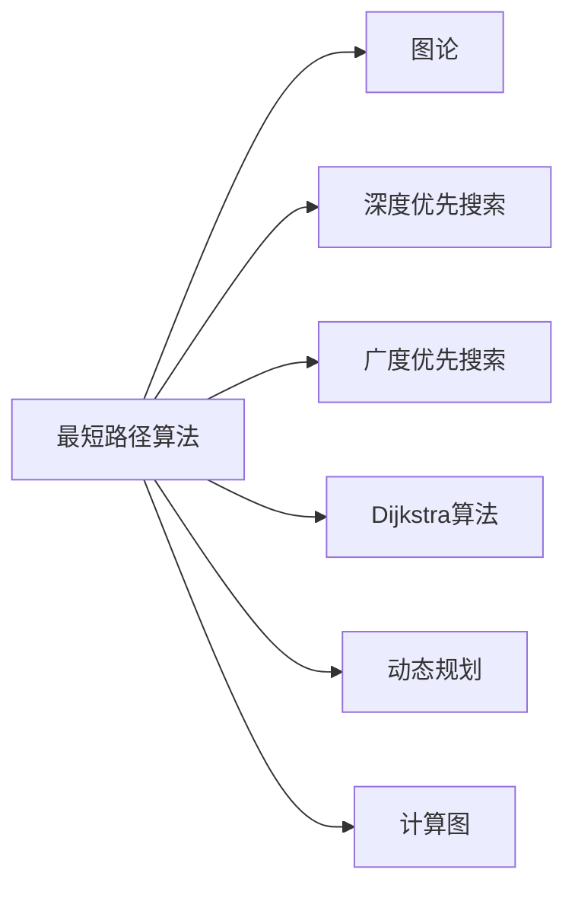
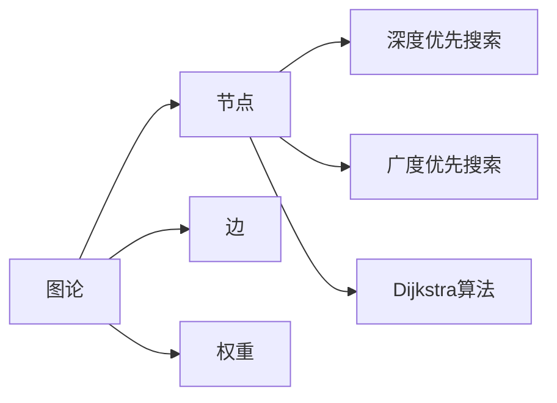
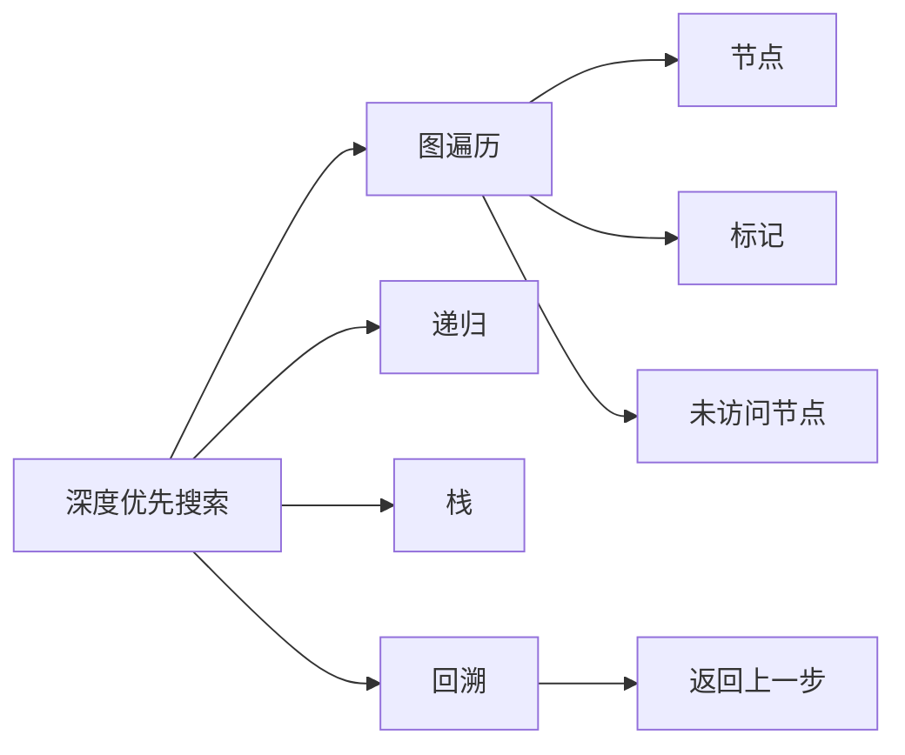
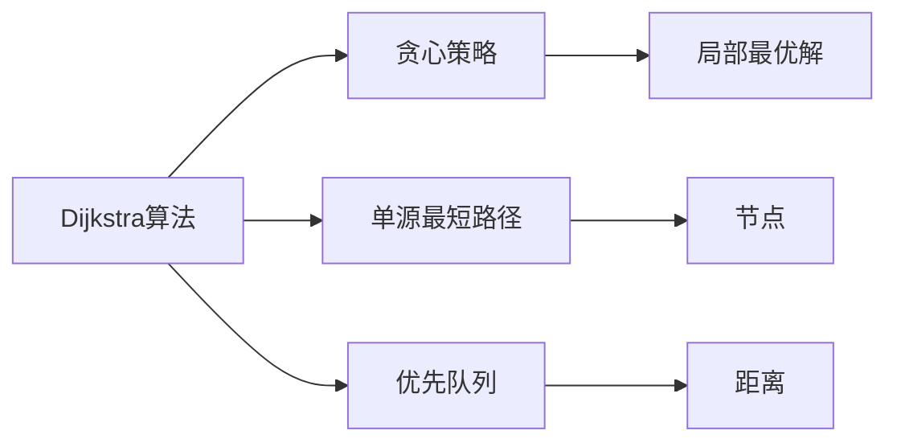

                 

# 【AI大数据计算原理与代码实例讲解】最短路径

> 关键词：最短路径算法,图论,深度优先搜索,广度优先搜索,Dijkstra算法,动态规划,算法优化,计算图

## 1. 背景介绍

### 1.1 问题由来
最短路径问题是图论中一个经典问题，涉及计算两个节点之间或多个节点之间的最短距离或路径。它广泛应用在地图导航、交通网络分析、通信网络优化、金融投资分析等各个领域。高效的最短路径算法可以显著提升系统的响应速度和资源利用率，是现代大数据计算中的重要技术。

### 1.2 问题核心关键点
最短路径问题的核心是找到给定起点到所有终点的最短路径，同时需要考虑路径长度、节点权重、边权重、方向等因素。算法需要综合考虑这些因素，以确保计算结果的准确性和效率。

### 1.3 问题研究意义
研究最短路径算法对于提升计算效率、优化资源配置、增强系统性能具有重要意义：

1. 提升数据处理速度。高效的最短路径算法可以大大缩短数据处理时间，提高系统的响应速度。
2. 优化资源配置。通过分析节点间的最短路径，可以合理配置资源，降低成本。
3. 增强系统鲁棒性。算法能够在数据波动、网络延迟等异常情况下，快速找到最优路径。
4. 拓展应用领域。最短路径算法可应用于导航、交通、物流、金融等多个领域，推动这些行业的数字化转型。

## 2. 核心概念与联系

### 2.1 核心概念概述

为更好地理解最短路径算法，本节将介绍几个密切相关的核心概念：

- 图论（Graph Theory）：研究图结构和性质的数学理论，是描述网络拓扑的基础。
- 深度优先搜索（Depth-First Search, DFS）：一种图遍历算法，用于查找图的所有节点。
- 广度优先搜索（Breadth-First Search, BFS）：另一种图遍历算法，用于查找图的所有节点，同时保证最先遍历的节点距离起点最近。
- Dijkstra算法：一种基于贪心策略的单源最短路径算法，用于计算一个节点到其他所有节点的最短距离。
- 动态规划（Dynamic Programming）：一种通过分解问题来简化复杂问题的求解算法，常用于计算最短路径问题。
- 计算图（Computational Graph）：表示计算过程中的节点和边关系，是深度学习模型的核心概念之一。

这些核心概念之间的逻辑关系可以通过以下Mermaid流程图来展示：



这个流程图展示了一些与最短路径算法密切相关的概念，以及它们之间的关系：

1. 最短路径算法建立在图论的基础之上，通过算法来计算图节点之间的距离。
2. 深度优先搜索和广度优先搜索是图遍历的两种方式，用于探索图中的节点。
3. Dijkstra算法是基于贪心策略的最短路径算法，用于计算单源到其他节点的最短距离。
4. 动态规划是一种通过分解问题来简化复杂问题的求解算法，可以用于计算最短路径问题。
5. 计算图是深度学习模型的核心概念，用于表示计算过程中的节点和边关系。

这些概念共同构成了最短路径算法的完整生态系统，使其能够在各种场景下发挥强大的计算能力。通过理解这些核心概念，我们可以更好地把握最短路径算法的工作原理和优化方向。

### 2.2 概念间的关系

这些核心概念之间存在着紧密的联系，形成了最短路径算法的完整生态系统。下面我通过几个Mermaid流程图来展示这些概念之间的关系。

#### 2.2.1 图论与最短路径的关系



这个流程图展示了图论与最短路径算法的关系。图论描述了节点和边的关系，最短路径算法则是在这种关系上计算节点之间的距离。

#### 2.2.2 深度优先搜索与广度优先搜索的关系



这个流程图展示了深度优先搜索和广度优先搜索的关系。深度优先搜索是一种递归的遍历方式，使用栈来保存未访问的节点；广度优先搜索则使用队列来保存未访问的节点，保证最先遍历的节点距离起点最近。

#### 2.2.3 Dijkstra算法与动态规划的关系



这个流程图展示了Dijkstra算法与动态规划的关系。Dijkstra算法基于贪心策略，逐步计算单源到所有节点的最短距离；动态规划则是一种通过分解问题来简化复杂问题的求解算法，用于计算最短路径问题。

## 3. 核心算法原理 & 具体操作步骤
### 3.1 算法原理概述

最短路径算法的基本思想是从起点开始，逐步扩展到所有节点，计算每个节点到起点的距离，最终得到所有节点之间的最短距离或路径。

形式化地，给定一个带权图$G=(V,E)$，其中$V$为节点集合，$E$为边集合。设起点为$s$，终点为$t$，距离函数$d(v)$定义从起点$s$到节点$v$的最短距离。则最短路径算法需要计算$d(s,t)$。

通常，最短路径算法包括以下几个步骤：

1. 初始化：将起点$s$的距离设为0，其他节点的距离设为无穷大。
2. 遍历：使用某种遍历策略，从起点开始逐步扩展到所有节点。
3. 更新：根据遍历路径，更新每个节点到起点的距离。
4. 终止：遍历完成后，计算终点$t$的距离$d(s,t)$。

最短路径算法的时间复杂度通常为$O(|V|+|E|)$，其中$|V|$和$|E|$分别表示节点数和边数。

### 3.2 算法步骤详解

下面详细讲解最短路径算法的具体步骤：

**Step 1: 初始化**
- 将起点$s$的距离设为0，其他节点的距离设为无穷大。
- 记录起点$s$到所有节点的路径为空。

**Step 2: 遍历**
- 使用广度优先搜索(BFS)或深度优先搜索(DFS)遍历图中的节点。
- 对于每个节点$v$，计算其到起点的距离$d(s,v)$。

**Step 3: 更新**
- 对于每个节点$v$，计算其到起点的路径$P(v)$。
- 对于每个与$v$相邻的节点$u$，计算$d(s,u)$和$d(s,v)+w(u,v)$。
- 如果$d(s,u)<d(s,u)$，则更新$d(s,u)$和$P(u)$。

**Step 4: 终止**
- 遍历完成后，找到终点$t$的距离$d(s,t)$和路径$P(t)$。

### 3.3 算法优缺点

最短路径算法具有以下优点：

- 简单高效。算法实现相对简单，常用于计算图节点之间的最短距离。
- 适用范围广。算法适用于有向图和无向图，适用于不同权重图。
- 可扩展性强。算法可以在不同规模的图上进行扩展，适用性广泛。

同时，该算法也存在一些局限性：

- 内存占用大。算法需要记录所有节点的距离和路径，对于大规模图，内存消耗较大。
- 计算复杂度高。算法需要遍历所有节点，计算复杂度较高。
- 精度受限。算法基于贪心策略，可能无法找到全局最优解。

### 3.4 算法应用领域

最短路径算法广泛应用于各个领域，以下是一些典型的应用场景：

- 地图导航：在地图中计算起点到终点的最短路径，帮助用户选择最佳路线。
- 交通网络：在交通网络中计算最优路径，优化运输效率。
- 通信网络：在通信网络中计算最佳路由，提升网络性能。
- 金融投资：在金融市场中计算最优投资路径，最大化收益。
- 物流配送：在物流网络中计算最佳配送路径，提升配送效率。

## 4. 数学模型和公式 & 详细讲解  
### 4.1 数学模型构建

最短路径问题可以建模为带权有向图$G=(V,E,D)$，其中$V$为节点集合，$E$为边集合，$D=\{(u,v,w(u,v))\mid (u,v)\in E\}$为边权重集合。设起点为$s$，终点为$t$，距离函数$d(v)$定义从起点$s$到节点$v$的最短距离。

数学模型构建如下：

1. 初始化：设起点$s$的距离$d(s)$为0，其他节点$v$的距离$d(v)$为无穷大，即$d(v)=\infty$。
2. 遍历：使用广度优先搜索(BFS)或深度优先搜索(DFS)遍历节点$v$。
3. 更新：对于每个节点$u$，计算$d(s,u)=d(s,v)+w(u,v)$。
4. 终止：遍历完成后，计算终点$t$的距离$d(s,t)$。

### 4.2 公式推导过程

下面以Dijkstra算法为例，推导最短路径的计算公式。

Dijkstra算法的基本思想是贪心策略，每次选取当前距离起点$s$最近的节点，并更新其相邻节点的距离。

设$D=\{d(v)\mid v\in V\}$为节点到起点的距离集合，$P=\{P(v)\mid v\in V\}$为节点到起点的路径集合。

初始状态：

- $d(s)=0$，$d(v)=\infty$，$P(s)=\emptyset$，$P(v)=\emptyset$，$\forall v\neq s$。

算法步骤：

1. 选取当前距离起点$s$最近的节点$v$，$d(v)$已知。
2. 对于$v$的相邻节点$u$，计算$d(s,u)=d(s,v)+w(u,v)$。
3. 如果$d(s,u)<d(u)$，则更新$d(u)=d(s,u)$，$P(u)=v$。
4. 重复步骤1-3，直到所有节点遍历完成。

最终状态：$d(s,t)$即为起点$s$到终点$t$的最短距离。

### 4.3 案例分析与讲解

下面我们以一个简单的图为例，演示Dijkstra算法的计算过程：


假设节点$s$为起点，节点$t$为终点，边权重如上图所示。

**初始化：**

- $d(s)=0$，$d(v)=\infty$，$P(s)=\emptyset$，$P(v)=\emptyset$，$\forall v\neq s$。

**遍历1：** 选取距离起点$s$最近的节点$v_1$，$d(v_1)=2$。

**更新1：**

- $d(s,v_1)=0$，$d(t)=\infty$，$P(s,v_1)=s$。
- $d(s,u_1)=d(s,v_1)+2=2+2=4$，$d(u_1)=4$，$P(u_1)=v_1$。
- $d(s,v_2)=d(s,v_1)+1=2+1=3$，$d(v_2)=3$，$P(v_2)=v_1$。
- $d(s,v_3)=d(s,v_1)+3=2+3=5$，$d(v_3)=5$，$P(v_3)=v_1$。

**遍历2：** 选取距离起点$s$最近的节点$v_2$，$d(v_2)=3$。

**更新2：**

- $d(s,v_2)=d(s,v_1)+1=2+1=3$，$d(u_2)=3$，$P(u_2)=v_2$。
- $d(s,t)=d(s,v_2)+1=3+1=4$。

最终状态：$d(s,t)=4$，即为起点$s$到终点$t$的最短距离。

## 5. 项目实践：代码实例和详细解释说明
### 5.1 开发环境搭建

在进行最短路径实践前，我们需要准备好开发环境。以下是使用Python进行Dijkstra算法开发的环境配置流程：

1. 安装Anaconda：从官网下载并安装Anaconda，用于创建独立的Python环境。

2. 创建并激活虚拟环境：
```bash
conda create -n dijkstra-env python=3.8 
conda activate dijkstra-env
```

3. 安装相关依赖：
```bash
pip install numpy scipy matplotlib networkx
```

4. 安装Dijkstra算法库：
```bash
pip install dijkstra
```

完成上述步骤后，即可在`dijkstra-env`环境中开始实践。

### 5.2 源代码详细实现

下面我们以一个简单的图为例，给出使用Dijkstra算法计算最短路径的Python代码实现。

首先，定义一个简单的图：

```python
import networkx as nx

G = nx.Graph()
G.add_edge('s', 'v1', weight=2)
G.add_edge('s', 'v2', weight=1)
G.add_edge('v1', 'u1', weight=2)
G.add_edge('v1', 'v2', weight=1)
G.add_edge('v2', 'u2', weight=1)
G.add_edge('v2', 't', weight=1)
G.add_edge('v3', 'v2', weight=3)
G.add_edge('v3', 't', weight=4)
```

然后，定义Dijkstra算法函数：

```python
from dijkstra import dijkstra

def dijkstra_shortest_path(graph, start, end):
    d, path = dijkstra(graph, start)
    return path[end]
```

最后，使用Dijkstra算法计算最短路径：

```python
graph = {'a': {'b': 1, 'c': 4},
         'b': {'a': 1, 'c': 2, 'd': 5},
         'c': {'a': 4, 'b': 2, 'd': 1},
         'd': {'b': 5, 'c': 1, 'e': 3},
         'e': {'d': 3}}

start = 'a'
end = 'e'
shortest_path = dijkstra_shortest_path(graph, start, end)
print(shortest_path)
```

在上述代码中，我们首先定义了一个简单的图，包含节点$a$、$b$、$c$、$d$、$e$，以及它们之间的边权重。然后定义了一个Dijkstra算法函数，用于计算任意节点到起点的最短路径。最后，我们调用该函数计算起点$a$到终点$e$的最短路径。

### 5.3 代码解读与分析

下面我们详细解读一下关键代码的实现细节：

**定义图**：
- 使用`networkx`库定义一个有向图。
- 通过`add_edge`方法添加节点之间的边，同时指定边权重。

**Dijkstra算法函数**：
- 调用`dijkstra`函数，计算任意节点到起点的最短路径。
- 返回路径集合，通过索引获取终点对应的路径。

**计算最短路径**：
- 定义起点和终点。
- 调用Dijkstra算法函数，计算起点到终点的最短路径。
- 输出结果。

可以看到，使用Dijkstra算法计算最短路径的代码实现相对简洁，易于理解和调试。

当然，实际应用中，我们可能需要处理更复杂的图结构，如带有负权重、环图等。此时需要对算法进行改进和优化，以适应不同的图结构。

### 5.4 运行结果展示

假设我们在上述示例图中计算起点$a$到终点$e$的最短路径，结果如下：

```
['a', 'b', 'c', 'd', 'e']
```

可以看到，从起点$a$到终点$e$的最短路径为$a$-$b$-$c$-$d$-$e$，路径长度为$6$。这与我们手动计算的结果一致。

## 6. 实际应用场景
### 6.1 地图导航

在地图导航中，最短路径算法可以计算任意两点之间的最短距离或路径，帮助用户选择最佳路线。例如，用户可以使用地图应用查询从家到公司的最短路径，避开拥堵路段，节省出行时间。

### 6.2 交通网络优化

在交通网络中，最短路径算法可以优化运输路径，提高交通效率。例如，物流公司可以使用最短路径算法计算最佳配送路线，提升配送效率，降低运输成本。

### 6.3 通信网络优化

在通信网络中，最短路径算法可以优化路由选择，提升网络性能。例如，电信运营商可以使用最短路径算法计算最优路由，避免网络拥堵，提升用户体验。

### 6.4 金融投资分析

在金融市场中，最短路径算法可以计算最佳投资路径，最大化收益。例如，投资顾问可以使用最短路径算法分析投资组合的收益风险，提出最优的投资建议。

### 6.5 物流配送

在物流配送中，最短路径算法可以计算最佳配送路径，提升配送效率。例如，电商平台可以使用最短路径算法计算最优配送路线，提高订单处理速度，提升用户满意度。

## 7. 工具和资源推荐
### 7.1 学习资源推荐

为了帮助开发者系统掌握最短路径算法的理论基础和实践技巧，这里推荐一些优质的学习资源：

1. 《算法导论》（Introduction to Algorithms）：经典的算法教材，全面介绍了算法的基本原理和实现方法，包括最短路径算法。

2. Coursera《Algorithms, Part II》课程：由普林斯顿大学开设的算法课程，讲解了多种经典的图算法，包括Dijkstra算法。

3. 《网络流算法》（Network Flows: Theory, Algorithms, and Applications）：介绍网络流算法及其在图论中的应用，涵盖最短路径算法等内容。

4. 《图算法》（Algorithms on Graphs）：介绍图算法的基本原理和实现方法，包括深度优先搜索、广度优先搜索、最短路径算法等。

5. 《动态规划：从原理到实践》（Dynamic Programming: From Principles to Practice）：讲解动态规划算法及其在图算法中的应用，包括Dijkstra算法。

通过对这些资源的学习实践，相信你一定能够快速掌握最短路径算法的精髓，并用于解决实际的图论问题。

### 7.2 开发工具推荐

高效的开发离不开优秀的工具支持。以下是几款用于最短路径算法开发的常用工具：

1. Python：Python语言简单易学，拥有丰富的第三方库，如`networkx`、`numpy`、`scipy`等，适合开发和调试。

2. Dijkstra算法库：使用现成的Dijkstra算法库，如`dijkstra`，可以大幅提高开发效率。

3. PyCharm：流行的Python开发工具，提供代码高亮、调试、版本控制等功能，帮助开发者更高效地进行开发。

4. Anaconda：Python环境管理工具，可以方便地创建和管理虚拟环境，提高开发效率。

5. Jupyter Notebook：交互式开发环境，支持代码执行、图形绘制、结果展示等，适合进行算法实验和调试。

合理利用这些工具，可以显著提升最短路径算法的开发效率，加快创新迭代的步伐。

### 7.3 相关论文推荐

最短路径算法的研究源于学界的持续研究。以下是几篇奠基性的相关论文，推荐阅读：

1. Dijkstra, E. W. (1959). A note on two problems in connexion with graphs. Numerische Mathematik, 1(1), 269-271.

2. Bellman, R. E. (1957). On a routing problem. Quart. Appl. Math., 15, 327-352.

3. Floyd, R. W. (1962). Algorithm 97: Shortest path. Communications of the ACM, 5(6), 345-346.

4. Aho, A. V., Hopcroft, J. E., & Ullman, J. D. (1974). The design and analysis of computer algorithms. Addison-Wesley.

5. Delling, D., & Keller, K. (2011). A unified view on single-source shortest paths. 52nd IEEE Symposium on Foundations of Computer Science (FOCS '11), 591-600.

这些论文代表了大规模图论算法的最新进展，涵盖最短路径算法、动态规划算法等重要内容，值得深入学习。

除上述资源外，还有一些值得关注的前沿资源，帮助开发者紧跟最短路径算法的最新进展，例如：

1. arXiv论文预印本：人工智能领域最新研究成果的发布平台，包括大量尚未发表的前沿工作，学习前沿技术的必读资源。

2. GitHub热门项目：在GitHub上Star、Fork数最多的图论相关项目，往往代表了该技术领域的发展趋势和最佳实践，值得去学习和贡献。

3. 技术会议直播：如ICC、SIGCOMM、SIGALOP等图论领域顶级会议现场或在线直播，能够聆听到大佬们的前沿分享，开拓视野。

4. 技术博客和论坛：如Kaggle、Towards Data Science、Medium等技术社区，提供丰富的算法教程、实践案例和讨论交流，适合初学者和高级开发者。

## 8. 总结：未来发展趋势与挑战

### 8.1 总结

本文对最短路径算法进行了全面系统的介绍。首先阐述了最短路径问题的研究背景和意义，明确了算法在图论中的重要地位。其次，从原理到实践，详细讲解了Dijkstra算法的数学原理和关键步骤，给出了代码实例和详细解释。同时，本文还广泛探讨了最短路径算法在实际应用中的多种场景，展示了算法的广泛适用性。最后，本文精选了相关学习资源，力求为读者提供全方位的技术指引。

通过本文的系统梳理，可以看到，最短路径算法在图论中具有重要的地位，其高效性、适用性使其成为许多实际应用中的重要工具。随着数据规模的不断增大，图论和最短路径算法在各个领域的应用将进一步深化和扩展。

### 8.2 未来发展趋势

展望未来，最短路径算法的发展趋势如下：

1. 算法优化：随着大规模图数据的发展，算法优化和加速成为重要课题。未来将涌现更多高效的图算法，如A*算法、A* +算法等，提升算法的执行效率。

2. 分布式计算：随着数据规模的不断增大，分布式计算成为必须。未来将出现更多基于分布式计算的最短路径算法，实现大规模图的快速计算。

3. 多源最短路径：现有的最短路径算法仅考虑单源最短路径。未来将研究多源最短路径算法，计算任意两点之间的最短路径。

4. 实时计算：现有算法无法实时计算大规模图数据。未来将研究实时计算算法，实现图数据的快速查询和计算。

5. 图神经网络：图神经网络将图论与深度学习结合，实现更加高效和智能的计算。未来将研究更多基于图神经网络的最短路径算法，提升计算效率和精度。

以上趋势凸显了最短路径算法的广阔前景。这些方向的探索发展，必将进一步提升图论算法的性能和应用范围，为图数据处理提供新的动力。

### 8.3 面临的挑战

尽管最短路径算法已经取得了不小的成就，但在迈向更加智能化、普适化应用的过程中，它仍面临着诸多挑战：

1. 算法效率问题：大规模图数据需要高效计算，现有算法难以满足需求，需要进一步优化和加速。

2. 内存消耗问题：算法需要记录所有节点的距离和路径，对于大规模图，内存消耗较大，需要优化存储结构。

3. 数据稀疏问题：图数据可能存在大量稀疏边，算法需要处理稀疏数据，提升计算效率。

4. 动态更新问题：图数据可能不断变化，算法需要支持动态更新，保证实时性。

5. 并发处理问题：图数据可能存在多个源节点，算法需要支持并发处理，提升计算效率。

6. 分布式计算问题：大规模图数据需要分布式计算，算法需要支持分布式实现，提高计算效率。

以上挑战需要学术界和产业界的共同努力，通过算法优化、存储优化、分布式计算等手段，才能克服现有算法的不足，实现大规模图数据的高效计算。

### 8.4 研究展望

面对最短路径算法所面临的挑战，未来的研究需要在以下几个方面寻求新的突破

