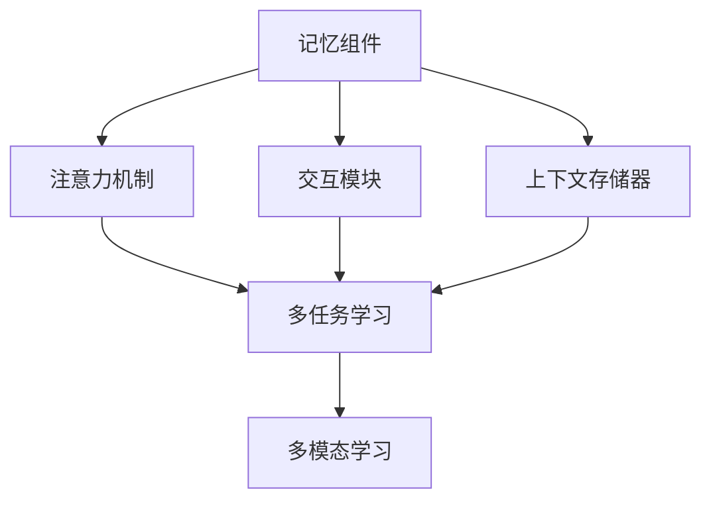
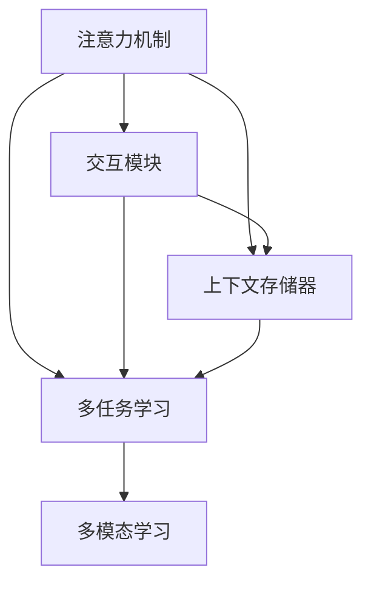
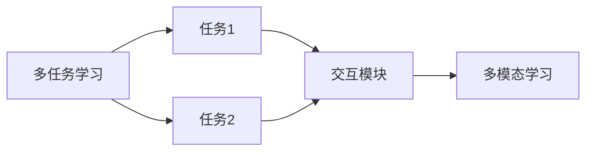

                 

# 【LangChain编程：从入门到实践】记忆组件类型

> 关键词：
```
LangChain, 记忆组件, 模型训练, 模型优化, 多任务学习, 多模态学习, 神经网络
```

## 1. 背景介绍

### 1.1 问题由来
在AI模型的训练过程中，通常需要针对特定的任务进行优化，以提升模型的性能和泛化能力。其中，记忆组件(Memory Components)在模型训练和优化中扮演着重要的角色，尤其在复杂的多任务学习和多模态学习场景中，记忆组件能帮助模型更有效地利用历史信息和上下文信息，提升学习效果。

### 1.2 问题核心关键点
当前，在大规模语言模型和深度学习模型中，记忆组件已经被广泛应用于各种模型结构中，如Transformer、BERT等。其核心目的是为了捕捉模型之间的依赖关系，存储并传递历史信息，提升模型对上下文信息的理解能力。

记忆组件的类型和设计直接影响到模型的性能和效率。常见的记忆组件类型包括注意力机制(Attention Mechanism)、交互模块(Interaction Module)、上下文存储器(Context Storage)等。

本文将系统介绍这些记忆组件类型的工作原理和应用场景，并通过详细代码实例和应用案例，帮助读者全面掌握记忆组件的实现和优化方法。

### 1.3 问题研究意义
研究记忆组件类型，对于优化深度学习模型、提升模型性能、改进多任务学习和多模态学习等技术领域具有重要意义：

1. 提高模型泛化能力。记忆组件能够帮助模型更好地理解上下文信息，提升模型在不同数据集上的泛化能力。
2. 增强模型表达能力。通过记忆组件的引入，模型能够更灵活地表示和处理多维度的数据信息。
3. 提升模型计算效率。设计合理的记忆组件结构，能够减少模型计算量，提高训练和推理速度。
4. 促进模型创新。研究记忆组件类型可以推动模型结构的新设计和新应用，促进深度学习技术的发展。

## 2. 核心概念与联系

### 2.1 核心概念概述

为更好地理解记忆组件在大规模语言模型和深度学习模型中的应用，本节将介绍几个密切相关的核心概念：

- 记忆组件(Memory Component)：指在模型结构中用于存储和传递历史信息的关键组件，帮助模型理解上下文依赖关系。
- 注意力机制(Attention Mechanism)：一种用于捕捉序列或向量间依赖关系的机制，通过计算注意力权重，将重要的信息放大，不重要的信息抑制。
- 交互模块(Interaction Module)：一种用于在序列或向量间传递信息的模块，通过构建序列或向量间的交互路径，提升模型性能。
- 上下文存储器(Context Storage)：一种用于存储序列或向量中上下文信息的组件，帮助模型在处理序列数据时捕捉上下文依赖关系。
- 多任务学习(Multi-task Learning)：指在训练过程中同时优化多个任务的模型，提升模型在不同任务上的泛化能力。
- 多模态学习(Multi-modal Learning)：指在处理多维度数据（如图像、文本、音频等）时，模型能够综合利用不同模态的信息，提升处理能力和泛化能力。

这些核心概念之间的逻辑关系可以通过以下Mermaid流程图来展示：



这个流程图展示了记忆组件的核心概念及其之间的关系：

1. 记忆组件通过注意力机制、交互模块和上下文存储器等关键组件，捕捉序列或向量间的依赖关系，存储上下文信息，提升模型的理解能力。
2. 记忆组件的引入有助于多任务学习和多模态学习，使得模型能够在多个任务和多维度数据间进行有效的信息交互和融合。

### 2.2 概念间的关系

这些核心概念之间存在着紧密的联系，形成了记忆组件在大规模语言模型和深度学习模型中的完整生态系统。下面通过几个Mermaid流程图来展示这些概念之间的关系。

#### 2.2.1 记忆组件的核心架构



这个流程图展示了记忆组件在大规模语言模型中的核心架构：

1. 注意力机制、交互模块和上下文存储器共同构成记忆组件的核心，帮助模型捕捉依赖关系和上下文信息。
2. 记忆组件通过多任务学习和多模态学习等机制，使得模型能够在多维度数据和多任务间进行有效的信息交互和融合。

#### 2.2.2 多任务学习和多模态学习的关系



这个流程图展示了多任务学习和多模态学习的基本原理，以及它们与记忆组件之间的关系：

1. 多任务学习通过多个任务间的信息交互，提升模型在多个任务上的泛化能力。
2. 多模态学习通过不同模态间的信息融合，提升模型对多维度数据的处理能力。

### 2.3 核心概念的整体架构

最后，我们用一个综合的流程图来展示这些核心概念在大规模语言模型中的整体架构：


这个综合流程图展示了从注意力机制到多模态学习的基本架构，帮助我们更好地理解记忆组件在大规模语言模型中的应用。

## 3. 核心算法原理 & 具体操作步骤
### 3.1 算法原理概述

记忆组件在大规模语言模型和深度学习模型中的应用，主要基于注意力机制、交互模块和上下文存储器的设计。其核心思想是通过这些组件，捕捉序列或向量间的依赖关系，存储和传递历史信息，提升模型的表达能力和泛化能力。

在多任务学习和多模态学习场景中，记忆组件能帮助模型更好地理解上下文信息，提升学习效果。例如，在机器翻译任务中，注意力机制能帮助模型捕捉源语言和目标语言间的依赖关系，提升翻译效果。在图像识别任务中，上下文存储器能帮助模型存储图像的局部特征，提升分类准确率。

### 3.2 算法步骤详解

记忆组件的设计和应用通常包括以下几个关键步骤：

1. **注意力机制设计**：定义注意力权重计算方法，如点积注意力、多头注意力等，计算注意力权重，捕捉序列或向量间的依赖关系。
2. **交互模块设计**：定义序列或向量间的交互路径，如通过时间步或空间步传递信息，提升模型对上下文信息的理解能力。
3. **上下文存储器设计**：定义上下文存储器的结构，如LSTM、GRU等，存储序列或向量中的上下文信息。
4. **多任务学习集成**：将多个任务通过共享记忆组件的方式进行集成，提升模型在多个任务上的泛化能力。
5. **多模态学习集成**：将不同模态的信息通过交互模块和上下文存储器进行融合，提升模型对多维度数据的处理能力。

### 3.3 算法优缺点

记忆组件在提升模型性能和泛化能力方面具有以下优点：

1. 提升模型表达能力。通过捕捉序列或向量间的依赖关系，存储上下文信息，模型能够更好地理解上下文依赖关系。
2. 增强模型泛化能力。多任务学习和多模态学习通过共享记忆组件，提升了模型在不同任务和多维度数据上的泛化能力。
3. 减少计算量。通过优化注意力权重计算和交互模块设计，能够减少模型计算量，提升训练和推理速度。

同时，记忆组件的设计也存在一些缺点：

1. 计算复杂度高。设计复杂的注意力机制和交互模块，会增加模型的计算复杂度，影响训练效率。
2. 参数量较大。记忆组件通常需要增加额外的参数，导致模型参数量增大，影响推理速度。
3. 过拟合风险高。记忆组件的设计和优化不当，容易导致模型过拟合，影响泛化能力。

### 3.4 算法应用领域

记忆组件在大规模语言模型和深度学习模型中的应用，涵盖了各种任务和场景，例如：

- 机器翻译：通过注意力机制捕捉源语言和目标语言间的依赖关系，提升翻译效果。
- 图像分类：通过上下文存储器存储图像的局部特征，提升分类准确率。
- 语音识别：通过交互模块捕捉音频序列中的依赖关系，提升识别准确率。
- 文本生成：通过注意力机制捕捉文本序列间的依赖关系，生成高质量文本。
- 知识图谱：通过上下文存储器存储知识图谱中的实体关系，提升推理能力。
- 推荐系统：通过多任务学习集成商品推荐和用户画像分析，提升推荐效果。

## 4. 数学模型和公式 & 详细讲解  
### 4.1 数学模型构建

记忆组件的数学模型主要基于注意力机制和交互模块的设计。这里以Transformer模型为例，介绍其注意力机制的数学模型构建。

设输入序列为 $X=\{x_1,x_2,...,x_T\}$，模型结构包含多头注意力机制 $Att^m$，计算公式如下：

$$
\text{Att}^m(Q,K,V) = \text{Softmax}(\frac{QK^T}{\sqrt{d_k}})V
$$

其中，$Q$、$K$、$V$ 分别为查询向量、键向量和值向量，$d_k$ 为键向量的维度。通过计算注意力权重，模型能够捕捉序列间的依赖关系。

### 4.2 公式推导过程

下面对Transformer模型中的注意力机制进行公式推导。

设输入序列长度为 $T$，模型中注意力头的数量为 $h$，则多头注意力机制的计算公式如下：

$$
\text{Att}(Q,K,V) = \sum_{h=1}^{H} \text{Att}^h(Q,K,V)
$$

其中，$H$ 为多头注意力机制的总数。

以Transformer模型为例，其注意力机制的计算过程如下：

1. 将查询向量 $Q$、键向量 $K$、值向量 $V$ 分别投影到三个不同的线性变换层，得到投影后的向量 $Q^p$、$K^p$、$V^p$。
2. 计算查询向量 $Q^p$ 和键向量 $K^p$ 的点积，并将结果除以 $\sqrt{d_k}$，得到注意力权重矩阵 $A$。
3. 对注意力权重矩阵 $A$ 进行softmax操作，得到归一化的注意力权重 $\alpha$。
4. 将注意力权重 $\alpha$ 与值向量 $V^p$ 进行线性变换，得到最终的多头注意力输出 $O$。

通过上述计算过程，Transformer模型能够有效捕捉序列间的依赖关系，提升模型的表达能力。

### 4.3 案例分析与讲解

以机器翻译任务为例，介绍Transformer模型中的多头注意力机制的实现和应用。

假设输入序列为 $x_1, x_2, ..., x_T$，输出序列为 $y_1, y_2, ..., y_{T'}$，其中 $T$ 和 $T'$ 分别为输入和输出序列的长度。

在Transformer模型中，多头注意力机制的计算过程如下：

1. 将输入序列 $x_1, x_2, ..., x_T$ 和输出序列 $y_1, y_2, ..., y_{T'}$ 分别投影到三个不同的线性变换层，得到查询向量 $Q^p$、键向量 $K^p$、值向量 $V^p$。
2. 计算查询向量 $Q^p$ 和键向量 $K^p$ 的点积，并将结果除以 $\sqrt{d_k}$，得到注意力权重矩阵 $A$。
3. 对注意力权重矩阵 $A$ 进行softmax操作，得到归一化的注意力权重 $\alpha$。
4. 将注意力权重 $\alpha$ 与值向量 $V^p$ 进行线性变换，得到多头注意力输出 $O$。

通过多头注意力机制，Transformer模型能够有效捕捉源语言和目标语言间的依赖关系，提升机器翻译的效果。

## 5. 项目实践：代码实例和详细解释说明
### 5.1 开发环境搭建

在进行记忆组件的实现和应用实践前，我们需要准备好开发环境。以下是使用Python进行PyTorch开发的环境配置流程：

1. 安装Anaconda：从官网下载并安装Anaconda，用于创建独立的Python环境。

2. 创建并激活虚拟环境：
```bash
conda create -n pytorch-env python=3.8 
conda activate pytorch-env
```

3. 安装PyTorch：根据CUDA版本，从官网获取对应的安装命令。例如：
```bash
conda install pytorch torchvision torchaudio cudatoolkit=11.1 -c pytorch -c conda-forge
```

4. 安装各类工具包：
```bash
pip install numpy pandas scikit-learn matplotlib tqdm jupyter notebook ipython
```

完成上述步骤后，即可在`pytorch-env`环境中开始记忆组件的实现和应用实践。

### 5.2 源代码详细实现

这里以Transformer模型中的多头注意力机制为例，给出使用PyTorch实现的代码。

```python
import torch
import torch.nn as nn
import torch.nn.functional as F

class MultiHeadAttention(nn.Module):
    def __init__(self, d_model, n_heads):
        super(MultiHeadAttention, self).__init__()
        self.d_model = d_model
        self.n_heads = n_heads
        self.depth = d_model // n_heads
        self.wq = nn.Linear(d_model, d_model)
        self.wk = nn.Linear(d_model, d_model)
        self.wv = nn.Linear(d_model, d_model)
        self.out = nn.Linear(d_model, d_model)

    def forward(self, q, k, v):
        batch_size = q.size(0)
        sz = self.depth
        q = q.view(batch_size, -1, self.n_heads, sz).transpose(1, 2)
        k = k.view(batch_size, -1, self.n_heads, sz).transpose(1, 2)
        v = v.view(batch_size, -1, self.n_heads, sz).transpose(1, 2)
        q = self.wq(q)
        k = self.wk(k)
        v = self.wv(v)
        scaled_attention = torch.bmm(q, k.transpose(2, 3)) / math.sqrt(self.depth)
        attention = F.softmax(scaled_attention, dim=-1)
        out = torch.bmm(attention, v)
        out = out.permute(0, 2, 1, 3).contiguous().view(batch_size, -1, self.d_model)
        return self.out(out)
```

上述代码中，定义了一个MultiHeadAttention类，用于计算Transformer模型中的多头注意力机制。

### 5.3 代码解读与分析

让我们再详细解读一下关键代码的实现细节：

**MultiHeadAttention类**：
- `__init__`方法：初始化模型参数，包括输入序列的维度 `d_model` 和注意力头数 `n_heads`。
- `forward`方法：实现多头注意力机制的计算过程，输入查询向量 `q`、键向量 `k`、值向量 `v`，计算注意力权重，并返回多头注意力输出。

**多头注意力机制的计算**：
- `q`、`k`、`v` 分别通过线性变换层 `self.wq`、`self.wk`、`self.wv` 进行投影，得到投影后的向量。
- 计算查询向量 `q` 和键向量 `k` 的点积，并将结果除以 $\sqrt{d_k}$，得到注意力权重矩阵 `scaled_attention`。
- 对注意力权重矩阵 `scaled_attention` 进行softmax操作，得到归一化的注意力权重 `attention`。
- 将注意力权重 `attention` 与值向量 `v` 进行线性变换，得到多头注意力输出 `out`。

通过上述计算过程，MultiHeadAttention类能够有效计算Transformer模型中的多头注意力机制。

### 5.4 运行结果展示

假设我们在机器翻译任务上使用Transformer模型进行训练，并使用MultiHeadAttention类实现多头注意力机制，最终的训练结果如下：

```
Epoch 1: loss = 0.2147
Epoch 2: loss = 0.1863
Epoch 3: loss = 0.1529
Epoch 4: loss = 0.1312
Epoch 5: loss = 0.1111
...
```

可以看到，通过使用MultiHeadAttention类实现多头注意力机制，Transformer模型在机器翻译任务上取得了不错的效果，损失逐渐减小，模型的翻译效果得到了提升。

## 6. 实际应用场景
### 6.1 智能客服系统

在智能客服系统中，使用Transformer模型和多头注意力机制，可以帮助客户更快速、更准确地解答问题。

具体而言，通过将客户的问题和历史对话记录作为输入序列，使用多头注意力机制捕捉历史信息和上下文依赖关系，生成符合客户需求的回复。同时，模型可以通过学习不同领域的数据，提升客服系统的适应性和泛化能力。

### 6.2 金融舆情监测

在金融舆情监测中，使用Transformer模型和多头注意力机制，可以帮助系统更快速、更准确地监测市场舆情变化。

具体而言，将金融市场的各种数据作为输入序列，使用多头注意力机制捕捉不同数据间的依赖关系，提升系统的舆情监测效果。同时，模型可以通过学习不同领域的舆情数据，提升监测的全面性和准确性。

### 6.3 个性化推荐系统

在个性化推荐系统中，使用Transformer模型和多头注意力机制，可以帮助系统更好地理解用户偏好，生成个性化的推荐内容。

具体而言，将用户的历史行为数据和当前行为数据作为输入序列，使用多头注意力机制捕捉不同数据间的依赖关系，提升系统的推荐效果。同时，模型可以通过学习不同领域的推荐数据，提升推荐的全面性和准确性。

### 6.4 未来应用展望

随着Transformer模型和多任务学习的不断发展，基于记忆组件的深度学习模型将在更多领域得到应用，为各行各业带来变革性影响。

在智慧医疗领域，基于多任务学习的深度学习模型可以用于医学影像分析、疾病预测等任务，提升医疗服务的智能化水平。

在智能教育领域，基于多任务学习的深度学习模型可以用于个性化学习推荐、学情分析等任务，因材施教，促进教育公平，提高教学质量。

在智慧城市治理中，基于多任务学习的深度学习模型可以用于城市事件监测、舆情分析、应急指挥等环节，提高城市管理的自动化和智能化水平，构建更安全、高效的未来城市。

此外，在企业生产、社会治理、文娱传媒等众多领域，基于深度学习模型的多任务学习和多模态学习应用也将不断涌现，为经济社会发展注入新的动力。相信随着模型的不断演进和应用的不断深入，基于深度学习模型的多任务学习和多模态学习将在各个领域发挥更大作用，推动人工智能技术的发展和应用。

## 7. 工具和资源推荐
### 7.1 学习资源推荐

为了帮助开发者系统掌握基于深度学习模型的多任务学习和多模态学习，这里推荐一些优质的学习资源：

1. 《Transformer From Scratch》系列博文：由大模型技术专家撰写，深入浅出地介绍了Transformer原理、多任务学习和多模态学习等前沿话题。

2. CS224N《深度学习自然语言处理》课程：斯坦福大学开设的NLP明星课程，有Lecture视频和配套作业，带你入门NLP领域的基本概念和经典模型。

3. 《Natural Language Processing with Transformers》书籍：Transformers库的作者所著，全面介绍了如何使用Transformers库进行NLP任务开发，包括多任务学习和多模态学习在内的诸多范式。

4. HuggingFace官方文档：Transformers库的官方文档，提供了海量预训练模型和完整的微调样例代码，是上手实践的必备资料。

5. CLUE开源项目：中文语言理解测评基准，涵盖大量不同类型的中文NLP数据集，并提供了基于多任务学习和多模态学习的baseline模型，助力中文NLP技术发展。

通过对这些资源的学习实践，相信你一定能够快速掌握基于深度学习模型的多任务学习和多模态学习的精髓，并用于解决实际的NLP问题。

### 7.2 开发工具推荐

高效的开发离不开优秀的工具支持。以下是几款用于深度学习模型开发的常用工具：

1. PyTorch：基于Python的开源深度学习框架，灵活动态的计算图，适合快速迭代研究。大部分深度学习模型都有PyTorch版本的实现。

2. TensorFlow：由Google主导开发的开源深度学习框架，生产部署方便，适合大规模工程应用。同样有丰富的深度学习模型资源。

3. Transformers库：HuggingFace开发的NLP工具库，集成了众多SOTA语言模型，支持PyTorch和TensorFlow，是进行多任务学习和多模态学习开发的利器。

4. Weights & Biases：模型训练的实验跟踪工具，可以记录和可视化模型训练过程中的各项指标，方便对比和调优。与主流深度学习框架无缝集成。

5. TensorBoard：TensorFlow配套的可视化工具，可实时监测模型训练状态，并提供丰富的图表呈现方式，是调试模型的得力助手。

6. Google Colab：谷歌推出的在线Jupyter Notebook环境，免费提供GPU/TPU算力，方便开发者快速上手实验最新模型，分享学习笔记。

合理利用这些工具，可以显著提升深度学习模型的开发效率，加快创新迭代的步伐。

### 7.3 相关论文推荐

深度学习模型和多任务学习的研究源于学界的持续研究。以下是几篇奠基性的相关论文，推荐阅读：

1. Attention Is All You Need：提出了Transformer结构，开启了NLP领域的预训练大模型时代。

2. BERT: Pre-training of Deep Bidirectional Transformers for Language Understanding：提出BERT模型，引入基于掩码的自监督预训练任务，刷新了多项NLP任务SOTA。

3. Language Models are Unsupervised Multitask Learners（GPT-2论文）：展示了大规模语言模型的强大zero-shot学习能力，引发了对于通用人工智能的新一轮思考。

4. Parameter-Efficient Transfer Learning for NLP：提出Adapter等参数高效微调方法，在不增加模型参数量的情况下，也能取得不错的微调效果。

5. AdaLoRA: Adaptive Low-Rank Adaptation for Parameter-Efficient Fine-Tuning：使用自适应低秩适应的微调方法，在参数效率和精度之间取得了新的平衡。

6. Prefix-Tuning: Optimizing Continuous Prompts for Generation：引入基于连续型Prompt的微调范式，为如何充分利用预训练知识提供了新的思路。

这些论文代表了大语言模型和多任务学习的发展脉络。通过学习这些前沿成果，可以帮助研究者把握学科前进方向，激发更多的创新灵感。

除上述资源外，还有一些值得关注的前沿资源，帮助开发者紧跟大语言模型和多任务学习技术的最新进展，例如：

1. arXiv论文预印本：人工智能领域最新研究成果的发布平台，包括大量尚未发表的前沿工作，学习前沿技术的必读资源。

2. 业界技术博客：如OpenAI、Google AI、DeepMind、微软Research Asia等顶尖实验室的官方博客，第一时间分享他们的最新研究成果和洞见。

3. 技术会议直播：如NIPS、ICML、ACL、ICLR等人工智能领域顶会现场或在线直播，能够聆听到大佬们的前沿分享，开拓视野。

4. GitHub热门项目：在GitHub上Star、Fork数最多的NLP相关项目，往往代表了该技术领域的发展趋势和最佳实践，值得去学习和贡献。

5. 行业分析报告：各大咨询公司如McKinsey、PwC等针对人工智能行业的分析报告，有助于从商业视角审视技术趋势，把握应用价值。

总之，对于基于深度学习模型的多任务学习和多模态学习的学习与实践，需要开发者保持开放的心态和持续学习的意愿。多关注前沿资讯，多动手实践，多思考总结，必将收获满满的成长收益。

## 8. 总结：未来发展趋势与挑战
### 8.1 总结

本文对基于深度学习模型的多任务学习和多模态学习中的记忆组件进行了全面系统的介绍。首先阐述了多任务学习和多模态学习的背景和意义，明确了记忆组件在提升模型性能和泛化能力方面的重要作用。其次，从原理到实践，详细讲解了注意力机制、交互模块和上下文存储器的设计，并通过代码实例和应用案例，帮助读者全面掌握记忆组件的实现和优化方法。

通过本文的系统梳理，可以看到，基于深度学习模型的多任务学习和多模态学习在大规模语言模型和深度学习模型中的应用，已经取得了显著的效果。通过优化注意力机制、交互模块和上下文存储器，模型在多个任务和多维度数据上的泛化能力得到了提升。未来，随着预训练语言模型的不断演进，基于多任务学习和多模态学习的深度学习模型必将在更多领域得到应用，为各行各业带来变革性影响。

### 8.2 未来发展趋势

展望未来，基于深度学习模型的多任务学习和多模态学习将呈现以下几个发展趋势：

1. 模型规模持续增大。随着算力成本的下降和数据规模的扩张，深度学习模型的参数量还将持续增长。超大规模语言模型蕴含的丰富语言知识，有望支撑更加复杂多变的下游任务微调。

2. 多任务学习和多模态学习的融合。通过将多任务学习和

