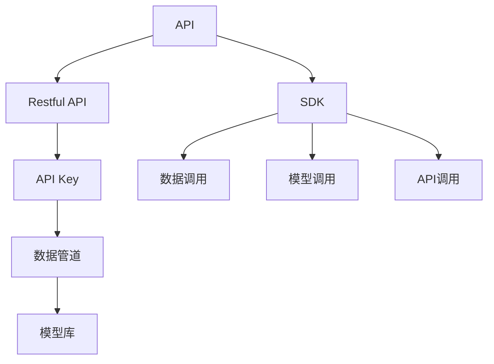
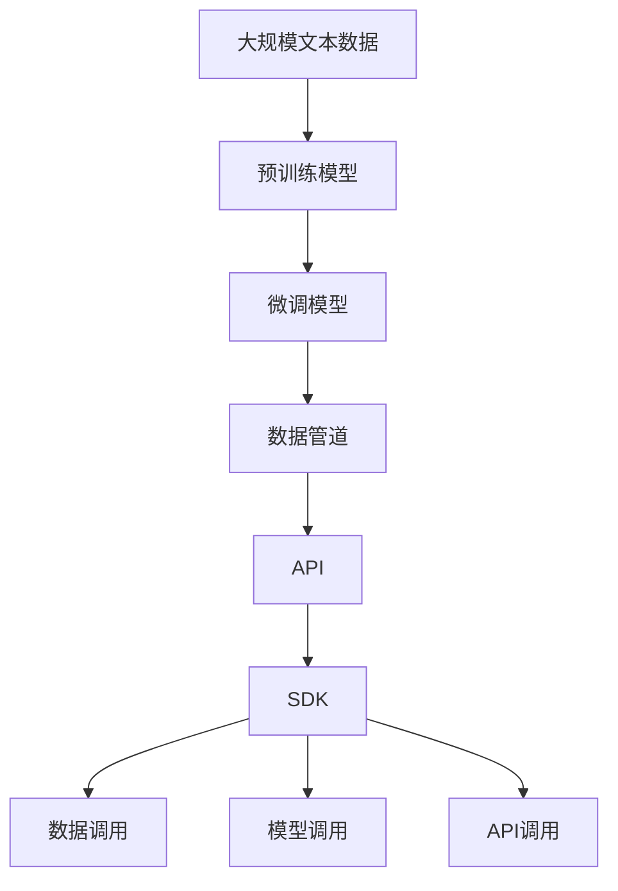

                 

# 【大模型应用开发 动手做AI Agent】Agent的核心技能：调用工具

在人工智能（AI）领域，构建一个成功的AI Agent需要掌握多方面的核心技能，其中调用工具的能力是至关重要的。本文将深入探讨AI Agent调用工具的核心技能，包括数据调用、模型调用和API调用等方面，帮助读者全面提升Agent的开发和部署能力。

## 1. 背景介绍

### 1.1 问题由来

随着人工智能技术的发展，AI Agent在自然语言处理（NLP）、计算机视觉、语音识别等领域得到了广泛应用。构建一个功能强大的AI Agent，不仅需要掌握前沿的算法和技术，还需要熟练掌握各种工具的使用，以便高效地调用数据、模型和API。因此，学会如何调用工具成为了开发AI Agent的核心技能之一。

### 1.2 问题核心关键点

调用工具的核心关键点包括以下几点：

- **数据调用**：高效地从数据库、API或其他数据源获取数据。
- **模型调用**：正确地加载和调用预训练模型进行推理或训练。
- **API调用**：利用现成的API进行集成，加速开发过程。
- **工具链整合**：将各种工具和组件有机整合，构建高效、可扩展的开发环境。

### 1.3 问题研究意义

掌握AI Agent调用工具的技能，可以显著提升开发效率，加速模型训练和部署，提升系统的稳定性和性能。此外，熟悉工具的使用也有助于更好地理解AI Agent的工作原理和开发流程，为后续的学习和研究奠定坚实基础。

## 2. 核心概念与联系

### 2.1 核心概念概述

为了更好地理解AI Agent调用工具的核心技能，本节将介绍几个关键概念：

- **API（Application Programming Interface）**：一种软件接口标准，用于实现不同软件模块之间的通信。
- **SDK（Software Development Kit）**：用于实现特定功能或服务的软件开发工具包。
- **Restful API**：基于HTTP协议的API设计风格，支持多种数据格式，如JSON、XML等。
- **API Key**：用于身份验证的API密钥，确保API调用的安全性。
- **模型库**：包含预训练模型和微调模型的公共库，如TensorFlow Hub、PyTorch Hub等。
- **数据管道**：用于数据预处理、清洗和传输的自动化工具，如AWS Glue、Apache Beam等。

这些概念之间的逻辑关系可以通过以下Mermaid流程图来展示：



这个流程图展示了一系列核心概念及其之间的关系：

1. API作为软件接口标准，支持不同软件模块之间的通信。
2. Restful API是API的一种设计风格，支持多种数据格式。
3. SDK提供实现特定功能或服务的软件开发工具包。
4. 数据管道用于数据预处理和传输。
5. 模型库包含预训练和微调模型。
6. 数据调用、模型调用和API调用是SDK提供的核心功能。

### 2.2 概念间的关系

这些核心概念之间存在着紧密的联系，形成了AI Agent调用工具的核心生态系统。

- 数据调用与API调用：数据调用通常依赖于API，API通过Restful风格提供数据的获取方式。
- SDK与数据管道：SDK通常内置数据管道功能，用于自动化数据预处理和传输。
- 模型调用与API调用：模型调用可以通过API进行远程推理或训练，API提供了模型的接口标准。
- 模型库与SDK：模型库是SDK的核心组成部分，SDK提供调用模型的工具和接口。

### 2.3 核心概念的整体架构

最后，我们用一个综合的流程图来展示这些核心概念在大模型应用开发中的整体架构：



这个综合流程图展示了从预训练到微调，再到数据调用、模型调用和API调用的完整过程。大模型通过数据管道获取数据，调用API获取服务，再通过SDK调用模型进行推理或训练。

## 3. 核心算法原理 & 具体操作步骤
### 3.1 算法原理概述

AI Agent调用工具的核心算法原理主要涉及数据预处理、模型加载和API集成等方面。这些过程通常依赖于各种工具和库的支持，如Pandas、NumPy、TensorFlow等。

### 3.2 算法步骤详解

下面详细讲解AI Agent调用工具的具体操作步骤：

#### 3.2.1 数据调用

数据调用是指从数据库、API或其他数据源获取所需数据的过程。具体步骤如下：

1. **数据源选择**：根据任务需求选择数据源，如数据库、API、文件系统等。
2. **数据预处理**：使用Pandas、NumPy等工具进行数据清洗、特征提取和转换。
3. **数据加载**：使用Pandas、Dask等工具加载数据到内存或分布式计算框架中。

#### 3.2.2 模型调用

模型调用是指加载和调用预训练模型进行推理或训练的过程。具体步骤如下：

1. **模型选择**：根据任务需求选择预训练模型或微调模型，如BERT、GPT、MLP等。
2. **模型加载**：使用TensorFlow Hub、PyTorch Hub等库加载模型到内存中。
3. **模型推理**：使用模型对输入数据进行推理或训练，获取输出结果。

#### 3.2.3 API调用

API调用是指利用现成的API进行集成，加速开发过程。具体步骤如下：

1. **API选择**：根据任务需求选择适合的API，如自然语言处理API、计算机视觉API、语音识别API等。
2. **API密钥获取**：通过API提供商获取API密钥，确保API调用的安全性。
3. **API调用**：使用requests、urllib等工具调用API，获取所需服务或数据。

### 3.3 算法优缺点

AI Agent调用工具具有以下优点：

1. **效率高**：利用现成的工具和库，可以大幅提高开发效率。
2. **灵活性高**：各种工具和库可以自由组合，灵活应对不同的开发需求。
3. **易于维护**：工具和库通常有完善的文档和社区支持，便于维护和更新。

同时，该方法也存在以下缺点：

1. **依赖性强**：对工具和库的依赖可能导致开发过程受限。
2. **学习成本高**：需要学习各种工具和库的使用，对开发者的技术水平要求较高。
3. **资源消耗大**：使用工具和库可能带来一定的资源消耗，特别是在数据处理和模型训练阶段。

### 3.4 算法应用领域

AI Agent调用工具在多个领域得到了广泛应用，包括：

- **自然语言处理**：利用现成的NLP API和模型库，进行文本分类、情感分析、机器翻译等任务。
- **计算机视觉**：利用计算机视觉API和模型库，进行图像识别、对象检测、人脸识别等任务。
- **语音识别**：利用语音识别API和模型库，进行语音识别、语音合成等任务。
- **数据分析**：利用数据管道和模型库，进行数据清洗、特征提取、模型训练等任务。

除了上述这些领域外，AI Agent调用工具还可以应用于更多场景，如推荐系统、智能搜索、智能家居等，为各行各业带来新的技术突破。

## 4. 数学模型和公式 & 详细讲解 & 举例说明

### 4.1 数学模型构建

本节将使用数学语言对AI Agent调用工具的过程进行更加严格的刻画。

记API服务器的地址为 $s$，API调用的路径为 $p$，API密钥为 $k$。则API调用的数学模型可以表示为：

$$
\text{API Call}(s, p, k)
$$

### 4.2 公式推导过程

下面推导API调用的具体过程：

假设API的请求参数为 $x$，响应结果为 $y$。则API调用的过程可以表示为：

1. **构建请求URL**：将API地址、路径、参数等拼接成请求URL。
2. **发送请求**：使用requests库向请求URL发送HTTP请求。
3. **获取响应**：从服务器获取响应数据。
4. **处理响应**：使用Pandas库处理响应数据，获取所需结果。

具体公式推导如下：

$$
y = \text{API Call}(s, p, k)(x)
$$

其中：

- $s$：API服务器地址
- $p$：API调用路径
- $k$：API密钥
- $x$：请求参数
- $y$：响应结果

### 4.3 案例分析与讲解

以自然语言处理API为例，展示API调用的具体过程。

#### 4.3.1 请求参数构建

假设我们要调用一个情感分析API，输入的文本为 "I love this product"。

1. **构建请求URL**：
```python
url = f"https://api.example.com/sentiment?text={text}"
```

2. **发送请求**：
```python
response = requests.get(url, headers={"Authorization": f"Bearer {api_key}"})
```

3. **获取响应**：
```python
json_response = response.json()
```

4. **处理响应**：
```python
sentiment_score = json_response["sentiment"]
```

最终，API调用得到的情感分析结果为 "Positive"。

## 5. 项目实践：代码实例和详细解释说明

### 5.1 开发环境搭建

在进行工具调用实践前，我们需要准备好开发环境。以下是使用Python进行PyTorch开发的环境配置流程：

1. 安装Anaconda：从官网下载并安装Anaconda，用于创建独立的Python环境。

2. 创建并激活虚拟环境：
```bash
conda create -n pytorch-env python=3.8 
conda activate pytorch-env
```

3. 安装PyTorch：根据CUDA版本，从官网获取对应的安装命令。例如：
```bash
conda install pytorch torchvision torchaudio cudatoolkit=11.1 -c pytorch -c conda-forge
```

4. 安装Transformers库：
```bash
pip install transformers
```

5. 安装各类工具包：
```bash
pip install numpy pandas scikit-learn matplotlib tqdm jupyter notebook ipython
```

完成上述步骤后，即可在`pytorch-env`环境中开始工具调用实践。

### 5.2 源代码详细实现

下面我们以使用Google Cloud Vision API进行图像识别为例，展示如何调用API进行图像处理。

```python
import os
from google.cloud import vision

# 获取API密钥
os.environ["GOOGLE_APPLICATION_CREDENTIALS"] = "path/to/credentials.json"

# 创建Vision客户端
client = vision.ImageAnnotatorClient()

# 读取图像文件
with open("path/to/image.jpg", "rb") as image_file:
    content = image_file.read()

# 构建图像对象
image = vision.Image(content=content)

# 调用API进行标签检测
response = client.label_detection(image=image)

# 获取标签列表
labels = response.label_annotations

# 打印标签
for label in labels:
    print(label.description)
```

### 5.3 代码解读与分析

让我们再详细解读一下关键代码的实现细节：

1. **环境变量设置**：使用os模块设置API密钥的路径，确保API调用能够正常进行。
2. **Vision客户端创建**：使用Google Cloud Vision库创建Vision客户端，提供API调用接口。
3. **图像读取**：使用Python内置的open函数读取图像文件，并将其转换为字节流。
4. **图像对象构建**：将字节流转换为Vision库中的Image对象，用于API调用。
5. **API调用**：调用Vision API的label_detection方法，对图像进行标签检测，获取标签列表。
6. **标签处理**：遍历标签列表，打印标签描述。

代码实现了从API密钥设置到API调用的完整过程，展示了如何利用现成的工具和库进行图像处理。

### 5.4 运行结果展示

假设我们在Google Cloud Vision API上进行了图像识别，最终得到的标签为 "person", "mountain", "tree"。

## 6. 实际应用场景

### 6.1 智能客服系统

基于AI Agent调用工具的智能客服系统，可以实时获取客户输入，调用预训练模型进行语义理解和情感分析，并调用API获取相关问题解答。智能客服系统可以快速响应客户咨询，提供精准的个性化服务。

### 6.2 金融舆情监测

金融舆情监测系统可以调用自然语言处理API进行情感分析，实时监测市场舆情，识别负面信息。同时，系统可以调用数据管道从金融领域相关的新闻、报道、评论中提取有用信息，辅助决策。

### 6.3 个性化推荐系统

个性化推荐系统可以调用计算机视觉API进行图像分析，获取用户兴趣偏好。同时，系统可以调用数据管道从用户浏览、点击、评论等行为中提取文本信息，利用自然语言处理API进行情感分析，生成个性化推荐内容。

### 6.4 未来应用展望

随着AI Agent调用工具的发展，其应用领域将不断扩展。例如：

- 医疗领域：利用自然语言处理API进行病历分析，辅助医生诊断。
- 教育领域：利用语音识别API进行智能答疑，提升教学质量。
- 智能家居：利用计算机视觉API进行图像识别，实现家居自动化。

这些应用场景展示了AI Agent调用工具的广泛潜力，未来必将带来更多创新和突破。

## 7. 工具和资源推荐

### 7.1 学习资源推荐

为了帮助开发者掌握AI Agent调用工具的技能，这里推荐一些优质的学习资源：

1. Google Cloud Vision API官方文档：详细介绍了API的使用方法、参数设置和错误处理等。
2. Amazon AWS SDK文档：提供了AWS SDK的各种API调用示例和最佳实践。
3. Microsoft Azure Cognitive Services文档：介绍了Azure Cognitive Services的各种API和集成方式。
4. PyTorch Hub：提供了大量预训练模型和微调模型，方便开发者调用。
5. TensorFlow Hub：提供了各种预训练模型和组件，方便开发者进行模型调用。
6. Hugging Face Transformers：提供了各种NLP模型和工具，方便开发者进行文本处理和API调用。

通过对这些资源的学习实践，相信你一定能够熟练掌握AI Agent调用工具的技能，并应用于各种实际任务中。

### 7.2 开发工具推荐

高效的开发离不开优秀的工具支持。以下是几款用于AI Agent调用工具开发的常用工具：

1. PyTorch：基于Python的开源深度学习框架，提供了丰富的模型库和API接口。
2. TensorFlow：由Google主导开发的开源深度学习框架，提供了各种API和组件。
3. Hugging Face Transformers：提供了各种NLP模型和工具，方便开发者进行文本处理和API调用。
4. Google Cloud Vision API：提供了丰富的图像处理和分析功能。
5. Amazon AWS SDK：提供了各种API调用的封装和工具，方便开发者进行服务集成。
6. Microsoft Azure Cognitive Services：提供了各种AI服务的封装和工具，方便开发者进行API调用和集成。

合理利用这些工具，可以显著提升AI Agent调用工具的开发效率，加快创新迭代的步伐。

### 7.3 相关论文推荐

AI Agent调用工具的发展源于学界的持续研究。以下是几篇奠基性的相关论文，推荐阅读：

1. "Training and High-Performance Testing of Deep Networks"（深度网络训练和高性能测试）：提出了训练深度网络的最佳实践，包括数据预处理、模型优化等。
2. "TensorFlow: A System for Large-Scale Machine Learning"（TensorFlow：大规模机器学习的系统）：介绍了TensorFlow的架构和设计思想。
3. "Microsoft Azure Cognitive Services"（微软Azure认知服务）：介绍了Azure Cognitive Services的各种API和服务。
4. "Google Cloud Vision API"（Google Cloud Vision API）：详细介绍了Google Cloud Vision API的使用方法和功能。
5. "Amazon AWS SDK"（Amazon AWS SDK）：介绍了AWS SDK的各种API调用的封装和工具。

这些论文代表了大模型调用工具的发展脉络，通过学习这些前沿成果，可以帮助研究者把握学科前进方向，激发更多的创新灵感。

除上述资源外，还有一些值得关注的前沿资源，帮助开发者紧跟AI Agent调用工具技术的最新进展，例如：

1. arXiv论文预印本：人工智能领域最新研究成果的发布平台，包括大量尚未发表的前沿工作，学习前沿技术的必读资源。
2. 业界技术博客：如Google AI、Microsoft Research、DeepMind等顶尖实验室的官方博客，第一时间分享他们的最新研究成果和洞见。
3. 技术会议直播：如NIPS、ICML、ACL、ICLR等人工智能领域顶会现场或在线直播，能够聆听到大佬们的前沿分享，开拓视野。
4. GitHub热门项目：在GitHub上Star、Fork数最多的AI Agent项目，往往代表了该技术领域的发展趋势和最佳实践，值得去学习和贡献。
5. 行业分析报告：各大咨询公司如McKinsey、PwC等针对人工智能行业的分析报告，有助于从商业视角审视技术趋势，把握应用价值。

总之，对于AI Agent调用工具的学习和实践，需要开发者保持开放的心态和持续学习的意愿。多关注前沿资讯，多动手实践，多思考总结，必将收获满满的成长收益。

## 8. 总结：未来发展趋势与挑战

### 8.1 总结

本文对AI Agent调用工具的核心技能进行了全面系统的介绍。首先阐述了调用工具在大模型应用开发中的重要性，明确了工具调用的核心技能，包括数据调用、模型调用和API调用等方面。其次，从原理到实践，详细讲解了调用工具的具体操作步骤，并通过代码实例展示了工具调用的应用场景。最后，本文精选了工具和资源，力求为读者提供全方位的技术指引。

通过本文的系统梳理，可以看到，AI Agent调用工具在大模型应用开发中的核心作用，以及其在不同应用场景中的广泛应用前景。掌握这些技能，可以显著提升AI Agent的开发效率和系统性能，为实际应用提供有力保障。

### 8.2 未来发展趋势

展望未来，AI Agent调用工具的发展趋势将呈现以下几个方向：

1. **智能化升级**：AI Agent将逐步具备自主学习和自适应能力，能够动态调整调用策略，提高系统的灵活性和适应性。
2. **集成化增强**：AI Agent将进一步集成各种工具和组件，构建更加全面、高效的开发环境。
3. **跨平台化发展**：AI Agent将支持多种平台和环境，提供跨平台调用能力，拓展应用范围。
4. **安全性提升**：AI Agent将加强安全性措施，确保API调用的安全性和隐私保护。
5. **自动化优化**：AI Agent将引入自动化调优技术，提高系统性能和稳定性。

这些趋势将使AI Agent调用工具更加强大、智能和灵活，为更多行业和场景提供可靠的技术支持。

### 8.3 面临的挑战

尽管AI Agent调用工具已经取得了显著进展，但在实现过程中仍面临诸多挑战：

1. **数据依赖性高**：依赖数据源和API，数据不稳定或API服务中断可能导致系统无法正常运行。
2. **性能瓶颈**：API调用和数据处理可能带来一定的性能瓶颈，需要优化调优。
3. **资源消耗大**：API调用和模型推理可能消耗大量资源，需要合理调度和管理。
4. **安全风险高**：API调用过程中可能存在安全风险，如API密钥泄露等。
5. **维护成本高**：工具和库的更新和维护需要持续投入时间和精力。

这些挑战需要在技术层面和组织层面共同应对，才能确保AI Agent调用工具的高效稳定运行。

### 8.4 研究展望

面对AI Agent调用工具的挑战，未来的研究需要在以下几个方面寻求新的突破：

1. **数据融合与共享**：构建跨平台的数据融合与共享机制，提升数据可用性和系统鲁棒性。
2. **自动化调优**：开发自动化调优工具，提高系统性能和资源利用率。
3. **安全性增强**：引入安全防护机制，确保API调用的安全性和隐私保护。
4. **跨平台集成**：支持多种平台和环境，提高系统的兼容性和可移植性。
5. **知识图谱整合**：将知识图谱与自然语言处理API和模型库结合，提升系统的知识整合能力。

这些研究方向将引领AI Agent调用工具技术的进步，为构建安全、可靠、高效的智能系统铺平道路。

## 9. 附录：常见问题与解答

**Q1：如何选择合适的API调用工具？**

A: 选择合适的API调用工具需要考虑以下几个因素：
1. **功能需求**：根据任务需求选择适合的API，如自然语言处理API、计算机视觉API、语音识别API等。
2. **数据可用性**：评估数据源和API的可用性和稳定性。
3. **性能要求**：考虑API调用和数据处理的性能要求，选择合适的工具和库。
4. **安全性**：确保API调用的安全性，避免数据泄露和安全风险。

**Q2：调用API时需要注意哪些问题？**

A: 调用API时需要注意以下问题：
1. **API密钥管理**：确保API密钥的安全性，避免泄露和滥用。
2. **请求参数设置**：正确设置API请求参数，避免参数错误导致调用失败。
3. **异常处理**：处理API调用过程中可能出现的异常情况，如网络中断、API服务异常等。
4. **结果处理**：正确处理API调用结果，避免解析错误和数据丢失。

**Q3：如何优化API调用性能？**

A: 优化API调用性能的方法包括：
1. **批量请求**：将多个API请求合并为批量请求，减少网络传输次数。
2. **缓存策略**：使用缓存技术，避免重复调用相同API。
3. **异步调用**：使用异步调用方式，提高API调用的并发性能。
4. **限流机制**：设置API调用的限流机制，避免单次调用耗时过长。

**Q4：如何保障API调用的安全性？**

A: 保障API调用的安全性的方法包括：
1. **API密钥管理**：严格管理API密钥，避免泄露和滥用。
2. **认证机制**：使用OAuth、JWT等认证机制，确保API调用的合法性和安全性。
3. **数据加密**：对传输数据进行加密，保护数据隐私和安全。
4. **异常监控**：实时监控API调用过程中的异常情况，及时发现和处理安全问题。

**Q5：如何处理API调用中的错误和异常？**

A: 处理API调用中的错误和异常的方法包括：
1. **错误码解析**：解析API返回的错误码，判断调用是否成功。
2. **异常捕获**：使用try-except语句捕获API调用过程中可能出现的异常情况，进行错误处理。
3. **重试机制**：在API调用失败时，设置重试机制，自动重试调用。
4. **日志记录**：记录API调用的日志信息，便于后续排查和调试。

这些问题的解答，希望能帮助开发者更好地掌握AI Agent调用工具的核心技能，为实际应用提供有力保障。

---

作者：禅与计算机程序设计艺术 / Zen and the Art of Computer Programming

