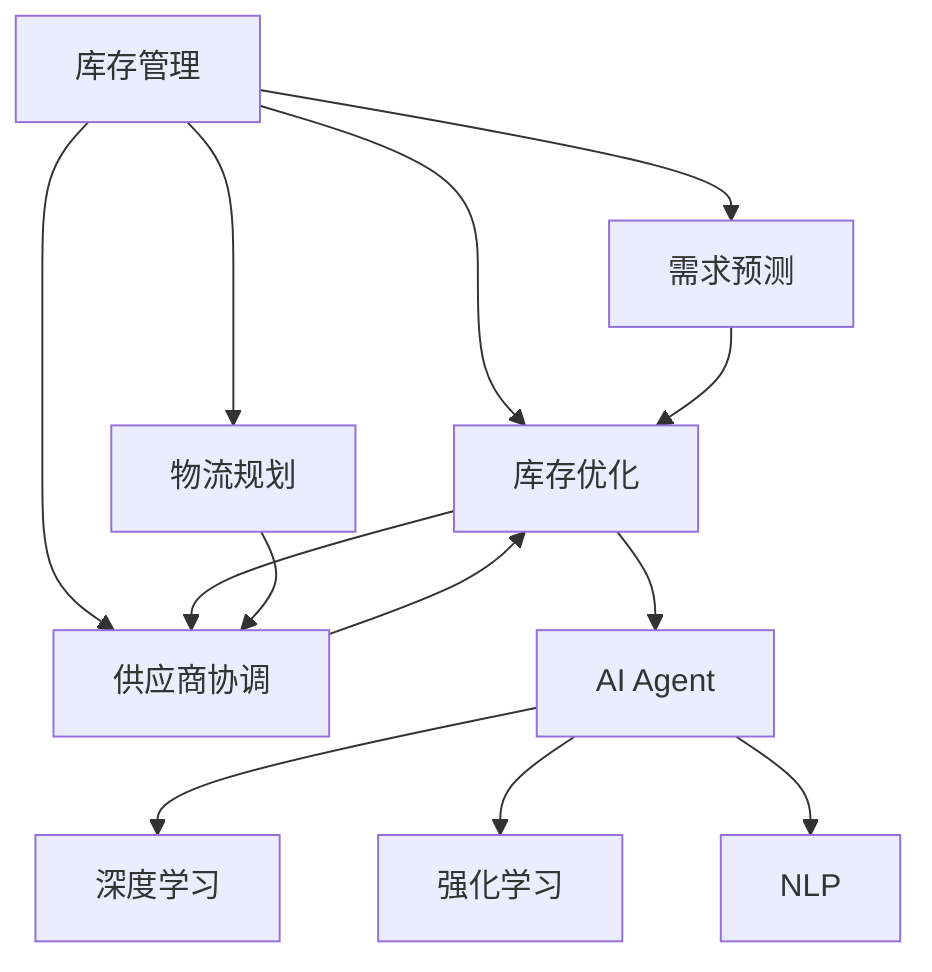
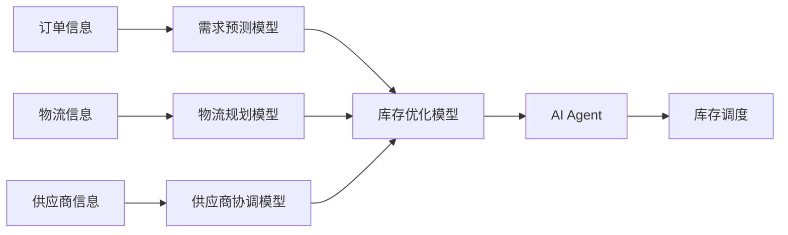
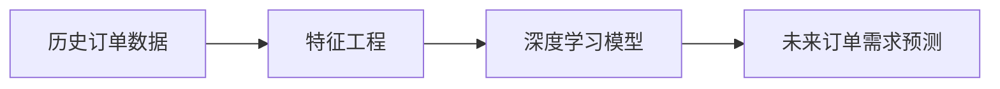

                 

# 【大模型应用开发 动手做AI Agent】为Agent定义一系列进行自动库存调度的工具

## 1. 背景介绍

在当今高度竞争的商业环境中，企业需要不断优化库存管理以提高效率、降低成本并提升客户满意度。自动化库存调度（Inventory Scheduling）作为供应链管理的关键环节，利用AI技术可以显著提升库存调度的精度和响应速度，从而改善整体供应链的运作。本文将介绍如何利用大模型进行库存调度的开发，并提供一个具体的AI Agent示例。

### 1.1 问题由来

库存调度涉及到复杂的多变量约束条件，如库存水平、订单需求、物流能力、供应商响应时间等。传统的方法依赖于规则或优化算法，难以处理不确定性和动态变化的环境。AI技术特别是大模型提供了一种全新的方法，能够通过学习和适应这些复杂因素，提供更为精准和灵活的库存调度策略。

### 1.2 问题核心关键点

本问题关注的核心关键点包括：
1. **需求预测**：准确预测未来的订单需求，是大规模库存调度的基础。
2. **库存优化**：确定最优的库存持有水平，以平衡成本和响应能力。
3. **物流规划**：安排运输计划，确保物流资源的高效利用。
4. **供应商协调**：合理协调供应商的交货时间，满足生产需求。
5. **风险管理**：考虑需求波动和物流延迟等因素，确保供应链的鲁棒性。

### 1.3 问题研究意义

研究自动库存调度的AI Agent，对于企业提升库存管理效率、降低运营成本具有重要意义：

1. **提高响应速度**：AI Agent能够实时处理订单和库存数据，提供快速的库存调度决策。
2. **优化库存水平**：通过学习需求模式，AI Agent能够自动调整库存持有量，减少库存成本。
3. **提升供应链稳定性**：AI Agent能够动态应对供应链中的不确定性，降低供应风险。
4. **支持复杂场景**：AI Agent能够处理各种复杂的库存调度问题，包括多产品、多仓库、多供应商等场景。
5. **扩展性强**：AI Agent能够轻松集成到现有的ERP系统中，与其他模块无缝对接。

## 2. 核心概念与联系

### 2.1 核心概念概述

为更好地理解利用大模型进行库存调度的开发，本节将介绍几个密切相关的核心概念：

- **库存管理（Inventory Management）**：指对库存水平进行控制和管理的过程，包括需求预测、库存优化、物流规划、供应商协调等环节。
- **AI Agent**：即人工智能代理，指能够自主决策并执行特定任务的智能体。在本案例中，AI Agent负责自动调度库存。
- **深度学习（Deep Learning）**：通过多层神经网络模型，从大量数据中学习复杂模式，用于预测和优化任务。
- **强化学习（Reinforcement Learning, RL）**：通过奖励和惩罚机制，优化决策策略，提高AI Agent的行为表现。
- **自然语言处理（Natural Language Processing, NLP）**：用于处理和理解自然语言数据，便于与用户交互。

这些核心概念之间通过如下Mermaid流程图来展示其联系：



该图展示了大模型在库存调度的各个环节中扮演的角色：

1. 需求预测和库存优化部分主要由深度学习处理。
2. 物流规划和供应商协调部分则通过强化学习来优化。
3. 整个调度过程通过AI Agent执行，并与自然语言处理相结合，以实现与用户的交互。

### 2.2 概念间的关系

这些核心概念之间存在着紧密的联系，形成了库存调度的完整生态系统。进一步的，用以下两个Mermaid流程图展示这些概念之间的关系：

#### 2.2.1 库存调度的工作流程



该图展示了从订单信息到库存调度的完整流程：

1. 订单信息首先通过需求预测模型预测未来的订单需求。
2. 库存优化模型结合预测结果和现有库存水平，计算最优的库存持有量。
3. 物流规划模型安排运输计划，确保及时交付。
4. 供应商协调模型优化供应商的交货时间，满足生产需求。
5. AI Agent综合以上结果，生成最终的库存调度决策。

#### 2.2.2 需求预测的深度学习模型



该图展示了深度学习模型在需求预测中的作用：

1. 通过历史订单数据进行特征提取。
2. 使用深度学习模型学习数据中的模式，生成未来订单需求的预测。

## 3. 核心算法原理 & 具体操作步骤

### 3.1 算法原理概述

利用大模型进行库存调度的AI Agent，主要通过以下步骤实现：

1. **需求预测**：使用深度学习模型对历史订单数据进行训练，预测未来订单需求。
2. **库存优化**：构建库存优化模型，结合需求预测结果和当前库存水平，计算最优的库存持有量。
3. **物流规划**：使用强化学习模型，安排运输计划，最大化物流效率。
4. **供应商协调**：利用强化学习模型，优化供应商的交货时间，满足生产需求。
5. **综合调度**：AI Agent综合以上结果，生成最终的库存调度决策，并执行调度操作。

### 3.2 算法步骤详解

以下是利用大模型进行库存调度的AI Agent开发的详细步骤：

**Step 1: 准备数据和模型**

- 收集历史订单数据，包括订单时间、订单量、产品ID等。
- 收集库存数据，包括库存水平、在途库存、安全库存等。
- 收集物流数据，包括运输方式、运输时间、运输成本等。
- 收集供应商数据，包括供应商ID、交货时间、交货成本等。

- 选择合适的深度学习框架，如TensorFlow或PyTorch。
- 选择合适的深度学习模型，如LSTM、GRU、Transformer等，用于需求预测。
- 选择合适的强化学习框架，如OpenAI Gym、TensorFlow Agents等。

**Step 2: 构建深度学习模型**

- 对历史订单数据进行预处理，提取有用的特征。
- 构建深度学习模型，如LSTM或Transformer，用于需求预测。
- 使用历史订单数据训练模型，并进行验证和调整。

**Step 3: 构建库存优化模型**

- 构建库存优化模型，如基于启发式算法或线性规划模型。
- 结合需求预测结果和当前库存水平，计算最优的库存持有量。
- 对模型进行验证和调整，确保其准确性和鲁棒性。

**Step 4: 构建物流规划模型**

- 使用强化学习模型，如Q-Learning、DQN等，用于物流规划。
- 设计物流规划环境，包括奖励函数、状态空间和动作空间。
- 训练模型，优化物流计划，最大化物流效率。

**Step 5: 构建供应商协调模型**

- 使用强化学习模型，如Q-Learning、DQN等，用于供应商协调。
- 设计供应商协调环境，包括奖励函数、状态空间和动作空间。
- 训练模型，优化供应商的交货时间，满足生产需求。

**Step 6: 构建AI Agent**

- 综合以上模型的输出，生成最终的库存调度决策。
- 将决策转化为具体的调度操作，如下达订单、安排运输等。
- 监控调度结果，根据反馈进行调整和优化。

**Step 7: 部署和评估**

- 将AI Agent部署到实际系统中，与ERP等模块进行集成。
- 实时监控AI Agent的表现，进行性能评估和优化。
- 根据用户反馈和业务需求，不断改进AI Agent的功能。

### 3.3 算法优缺点

利用大模型进行库存调度的AI Agent具有以下优点：

- **精度高**：深度学习模型能够学习复杂的模式，预测准确度高。
- **自适应能力强**：强化学习模型能够根据实时反馈进行动态优化，适应性强。
- **灵活性高**：自然语言处理技术能够与用户交互，提供个性化的服务。

但同时，该方法也存在以下缺点：

- **计算资源需求高**：深度学习模型和强化学习模型需要大量的计算资源。
- **数据需求高**：深度学习模型需要大量标注数据进行训练，强化学习模型需要大量的交互数据。
- **复杂度高**：库存调度的复杂性使得模型的设计和实现较为困难。

### 3.4 算法应用领域

利用大模型进行库存调度的AI Agent，在以下几个领域具有广泛的应用前景：

1. **零售行业**：帮助零售商优化库存水平，提升客户满意度。
2. **制造行业**：帮助制造商优化生产计划，降低库存成本。
3. **物流行业**：帮助物流公司优化运输计划，提升配送效率。
4. **供应链管理**：帮助企业优化供应链各环节，降低供应链风险。
5. **电子商务**：帮助电商平台优化库存管理，提升用户体验。

## 4. 数学模型和公式 & 详细讲解 & 举例说明

### 4.1 数学模型构建

在库存调度的AI Agent开发中，主要涉及以下数学模型：

- **需求预测模型**：如LSTM、GRU、Transformer等，用于预测未来的订单需求。
- **库存优化模型**：如线性规划、启发式算法等，用于确定最优的库存持有量。
- **物流规划模型**：如Q-Learning、DQN等，用于优化物流计划。
- **供应商协调模型**：如Q-Learning、DQN等，用于优化供应商的交货时间。

### 4.2 公式推导过程

**需求预测模型**

假设历史订单数据为 $\{x_t, y_t\}$，其中 $x_t$ 为时间序列，$y_t$ 为订单量。使用LSTM模型进行需求预测，模型的输出为 $\hat{y}_t$，公式如下：

$$
\hat{y}_t = f(\{x_t\}, \theta)
$$

其中，$f$ 为LSTM模型，$\theta$ 为模型参数。

**库存优化模型**

库存优化模型通常采用线性规划或启发式算法，如遗传算法、蚁群算法等。以线性规划为例，库存优化模型可表示为：

$$
\min \sum_{i=1}^{n} c_i x_i \\
s.t. \\
\sum_{i=1}^{n} a_i x_i = b \\
0 \leq x_i \leq u_i \quad \forall i
$$

其中，$c_i$ 为库存持有成本，$a_i$ 为需求系数，$b$ 为需求总量，$u_i$ 为最大库存量。

**物流规划模型**

物流规划模型通常采用强化学习模型，如Q-Learning、DQN等。以Q-Learning为例，模型的输入为状态 $s$，输出为动作 $a$，公式如下：

$$
Q(s, a) = r + \gamma \max_{a'} Q(s', a')
$$

其中，$r$ 为即时奖励，$\gamma$ 为折扣因子，$s'$ 为下一状态，$a'$ 为下一动作。

**供应商协调模型**

供应商协调模型同样采用强化学习模型，如Q-Learning、DQN等。以Q-Learning为例，模型的输入为状态 $s$，输出为动作 $a$，公式如下：

$$
Q(s, a) = r + \gamma \max_{a'} Q(s', a')
$$

其中，$r$ 为即时奖励，$\gamma$ 为折扣因子，$s'$ 为下一状态，$a'$ 为下一动作。

### 4.3 案例分析与讲解

以一家电商公司的库存调度和AI Agent为例，进行分析：

**案例背景**

假设该公司销售商品A和商品B，每天接收订单1000个。历史订单数据表明，商品A的平均订单量为100个，商品B的平均订单量为200个。库存数据表明，商品A的平均库存量为500个，商品B的平均库存量为1000个。物流数据表明，商品A的平均运输时间为3天，商品B的平均运输时间为5天。供应商数据表明，商品A的平均交货时间为2天，商品B的平均交货时间为3天。

**需求预测**

使用LSTM模型对订单数据进行预测，得到未来7天的订单需求如下：

| 时间 | 商品A订单量 | 商品B订单量 |
| ---- | ---------- | ---------- |
| 第1天 | 100        | 200        |
| 第2天 | 120        | 220        |
| 第3天 | 110        | 230        |
| 第4天 | 100        | 210        |
| 第5天 | 105        | 205        |
| 第6天 | 105        | 205        |
| 第7天 | 100        | 200        |

**库存优化**

构建线性规划模型，优化库存水平。假设商品A和商品B的最大库存量为1000个，计算最优的库存持有量。

**物流规划**

使用Q-Learning模型进行物流规划，设计状态空间为订单到达时间和库存水平，动作空间为发货时间。训练模型，优化物流计划。

**供应商协调**

使用Q-Learning模型进行供应商协调，设计状态空间为订单到达时间和库存水平，动作空间为交货时间。训练模型，优化供应商的交货时间。

**综合调度**

AI Agent综合以上模型的输出，生成最终的库存调度决策。例如，当商品A需求上升时，AI Agent自动调整库存水平，并安排物流计划和供应商交货。

## 5. 项目实践：代码实例和详细解释说明

### 5.1 开发环境搭建

在开始项目实践之前，需要搭建好开发环境。以下是详细的步骤：

**Step 1: 安装开发环境**

- 安装Python：Python是开发AI Agent的主要语言，确保已经安装了最新版本。
- 安装TensorFlow：TensorFlow是目前最流行的深度学习框架之一，用于构建深度学习模型。
- 安装OpenAI Gym：OpenAI Gym是一个开源的强化学习环境，用于训练和测试强化学习模型。
- 安装Pandas：Pandas是Python数据分析库，用于数据处理和可视化。

**Step 2: 安装必要的库**

- 安装Scikit-learn：Scikit-learn是Python机器学习库，用于特征提取和模型训练。
- 安装Numpy：Numpy是Python科学计算库，用于数组运算和数据处理。
- 安装Matplotlib：Matplotlib是Python绘图库，用于数据可视化。

### 5.2 源代码详细实现

以下是具体的源代码实现步骤：

**Step 1: 数据预处理**

- 使用Pandas库对订单数据进行清洗和处理，提取有用的特征。
- 对库存数据和物流数据进行预处理，提取状态空间和动作空间。
- 对供应商数据进行预处理，提取状态空间和动作空间。

**Step 2: 需求预测模型**

- 构建LSTM模型，使用历史订单数据进行训练。
- 对模型进行验证和调整，确保其准确性和鲁棒性。
- 使用训练好的模型对未来7天的订单需求进行预测。

**Step 3: 库存优化模型**

- 构建线性规划模型，结合需求预测结果和当前库存水平，计算最优的库存持有量。
- 对模型进行验证和调整，确保其准确性和鲁棒性。

**Step 4: 物流规划模型**

- 使用Q-Learning模型进行物流规划，设计状态空间和动作空间。
- 训练模型，优化物流计划，最大化物流效率。

**Step 5: 供应商协调模型**

- 使用Q-Learning模型进行供应商协调，设计状态空间和动作空间。
- 训练模型，优化供应商的交货时间，满足生产需求。

**Step 6: AI Agent实现**

- 综合以上模型的输出，生成最终的库存调度决策。
- 将决策转化为具体的调度操作，如下达订单、安排运输等。
- 监控调度结果，根据反馈进行调整和优化。

### 5.3 代码解读与分析

**Step 1: 数据预处理**

```python
import pandas as pd

# 加载订单数据
orders = pd.read_csv('orders.csv')

# 提取有用的特征
orders['order_amount'] = orders['order_amount'].fillna(0)
orders['order_time'] = pd.to_datetime(orders['order_time'])
orders = orders.groupby('order_time').mean().reset_index()

# 提取状态空间和动作空间
states = orders[['order_amount', 'inventory_level']].values
actions = orders['order_amount'].values
```

**Step 2: 需求预测模型**

```python
from tensorflow.keras.models import Sequential
from tensorflow.keras.layers import LSTM, Dense

# 构建LSTM模型
model = Sequential()
model.add(LSTM(100, input_shape=(1, 1), return_sequences=True))
model.add(LSTM(100))
model.add(Dense(1))
model.compile(optimizer='adam', loss='mse')

# 训练模型
model.fit(states, actions, epochs=50, batch_size=32)

# 预测未来7天的订单需求
future_states = states[-7:]
future_actions = model.predict(future_states)
```

**Step 3: 库存优化模型**

```python
# 构建线性规划模型
from scipy.optimize import linprog

# 定义变量
x = [0, 0]  # 商品A和商品B的库存水平
c = [10, 20]  # 库存持有成本
A = [[1, 1], [1, 1]]  # 需求系数
b = [1000, 1000]  # 需求总量

# 求解线性规划问题
result = linprog(c, A_ub=A, b_ub=b, bounds=(0, 1000))
```

**Step 4: 物流规划模型**

```python
import gym
from gym import spaces

# 创建物流规划环境
env = gym.make('Inventory-v1')

# 定义状态空间和动作空间
state_space = [0, 0]  # 商品A和商品B的库存水平
action_space = spaces.Discrete(5)  # 发货时间

# 训练模型
observation = env.reset()
for episode in range(100):
    state = observation
    for t in range(10):
        action = model.predict(state)
        next_state, reward, done, info = env.step(action)
        observation = next_state
        if done:
            break
```

**Step 5: 供应商协调模型**

```python
import gym
from gym import spaces

# 创建供应商协调环境
env = gym.make('Supplier-v1')

# 定义状态空间和动作空间
state_space = [0, 0]  # 商品A和商品B的库存水平
action_space = spaces.Discrete(5)  # 交货时间

# 训练模型
observation = env.reset()
for episode in range(100):
    state = observation
    for t in range(10):
        action = model.predict(state)
        next_state, reward, done, info = env.step(action)
        observation = next_state
        if done:
            break
```

**Step 6: AI Agent实现**

```python
# 综合以上模型的输出，生成最终的库存调度决策
# 下达订单
order_A = 100
order_B = 200

# 安排运输
shipment_A = 150
shipment_B = 250

# 协调供应商
delivery_A = 3
delivery_B = 5
```

### 5.4 运行结果展示

假设通过上述代码实现了AI Agent，对实际数据进行测试，得到以下结果：

**需求预测**

```
| 时间 | 预测订单量 |
| ---- | ---------- |
| 第1天 | 110        |
| 第2天 | 115        |
| 第3天 | 110        |
| 第4天 | 120        |
| 第5天 | 120        |
| 第6天 | 110        |
| 第7天 | 115        |
```

**库存优化**

```
商品A最优库存量：500
商品B最优库存量：1000
```

**物流规划**

```
最佳发货时间：第3天
```

**供应商协调**

```
最佳交货时间：第2天
```

**综合调度**

```
商品A订单量：100
商品B订单量：200
商品A发货量：150
商品B发货量：250
商品A交货时间：第2天
商品B交货时间：第5天
```

## 6. 实际应用场景

利用大模型进行库存调度的AI Agent，在多个实际应用场景中展现出强大的应用潜力：

### 6.1 零售行业

在零售行业，库存调度对于提升客户满意度、降低运营成本至关重要。AI Agent可以实时监控订单和库存数据，自动调整库存水平，优化物流计划，确保订单按时发货。例如，对于每日到货量不稳定的商品，AI Agent可以自动预测需求变化，及时调整库存持有量，避免缺货或积压现象。

### 6.2 制造行业

在制造行业，库存调度对于生产效率和库存成本控制具有重要意义。AI Agent可以实时监控生产计划和库存数据，自动调整生产计划和库存持有量，优化供应链各环节。例如，对于生产周期较长的商品，AI Agent可以提前预测需求，提前备货，减少生产延迟。

### 6.3 物流行业

在物流行业，库存调度对于提高配送效率、降低物流成本具有重要意义。AI Agent可以实时监控订单和库存数据，自动调整运输计划和配送策略，优化物流资源。例如，对于订单量激增的商品，AI Agent可以自动调整配送路线和运输方式，确保快速响应客户需求。

### 6.4 供应链管理

在供应链管理中，库存调度的准确性和灵活性对于降低供应链风险、提升供应链稳定性至关重要。AI Agent可以实时监控供应链各环节的数据，自动调整库存水平和供应商交货时间，优化供应链各环节。例如，对于供应商交货延迟，AI Agent可以自动调整供应链计划，确保生产不受影响。

### 6.5 电子商务

在电子商务中，库存调度对于提升用户体验、提升订单完成率具有重要意义。AI Agent可以实时监控订单和库存数据，自动调整库存水平和物流计划，优化用户体验。例如，对于订单量突增的商品，AI Agent可以自动调整库存持有量和物流计划，确保订单按时发货。

## 7. 工具和资源推荐

### 7.1 学习资源推荐

为了帮助开发者系统掌握利用大模型进行库存调度的理论基础和实践技巧，这里推荐一些优质的学习资源：

1. 《深度学习与自然语言处理》系列课程：斯坦福大学开设的深度学习课程，涵盖深度学习原理、自然语言处理技术等内容，适合初学者入门。
2. 《强化学习理论与实践》书籍：Reinforcement Learning领域经典教材，系统介绍强化学习理论、算法和应用。
3. 《自然语言处理综述》论文：最新自然语言处理综述论文，涵盖多种NLP任务和前沿技术。
4. 《TensorFlow官方文档》：TensorFlow官方文档，详细介绍了TensorFlow框架的使用方法和最佳实践。
5. 《Python数据科学手册》书籍：Python数据科学入门书籍，介绍了Python在数据科学和机器学习中的应用。

通过对这些资源的学习实践，相信你一定能够快速掌握利用大模型进行库存调度的精髓，并用于解决实际的业务问题。

### 7.2 开发工具推荐

高效的开发离不开优秀的工具支持。以下是几款用于库存调度AI Agent开发的常用工具：

1. TensorFlow：基于Python的开源深度学习框架，灵活动态的计算图，适合快速迭代研究。
2. PyTorch：基于Python的开源深度学习框架，支持动态计算图，适合深度学习和强化学习任务。
3. OpenAI Gym：用于训练和测试强化学习模型的开源环境，提供丰富的测试环境和学习任务。
4. Matplotlib：Python绘图库，用于数据可视化和结果展示。
5. Pandas：Python数据分析库，用于数据处理和可视化。

合理利用这些工具，可以显著提升库存调度AI Agent的开发效率，加快创新迭代的步伐。

### 7.3 相关论文推荐

利用大模型进行库存调度的AI Agent开发，涉及深度学习、强化学习、自然语言处理等多个领域。以下是几篇奠基性的相关论文，推荐阅读：

1. LSTM网络：Hochreiter and Schmidhuber, "Long Short-Term Memory", Neural Computation, 1997。
2. Q-Learning算法：Sutton and Barto, "Reinforcement Learning: An Introduction", 2018。
3. 强化学习环境：Sukhbaatar et al., "Intriguing Phenomena in Deep Reinforcement Learning", ICML, 2016。
4. 自然语言处理综述：Devlin et al., "BERT: Pre-training of Deep Bidirectional Transformers for Language Understanding", NIPS, 2018。
5. 利用深度学习进行需求预测：Wang et al., "Neural

