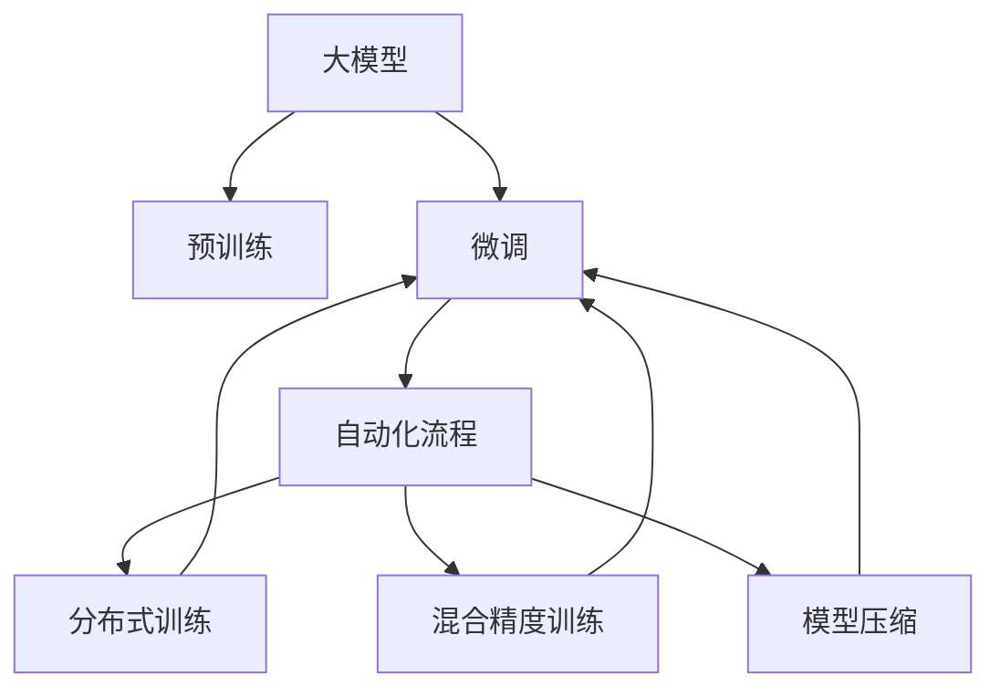
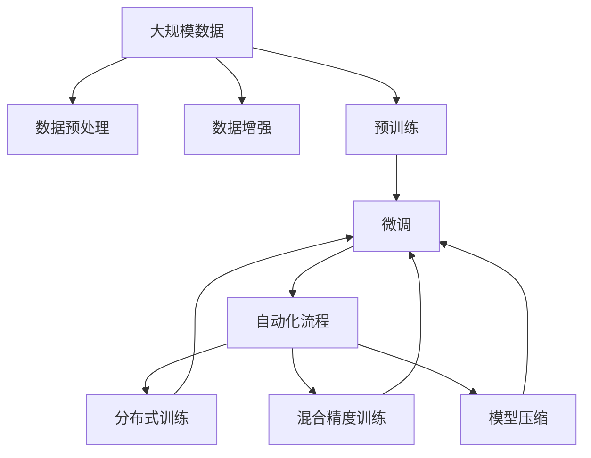

                 

# 【大模型应用开发 动手做AI Agent】流程的自动化与资源的优化

> 关键词：大模型应用, 自动化, AI Agent, 资源优化

## 1. 背景介绍

### 1.1 问题由来

近年来，人工智能（AI）技术迅猛发展，尤其是深度学习模型在自然语言处理（NLP）、计算机视觉、推荐系统等领域的广泛应用，推动了人工智能从研究向实际应用的跨越。AI Agent，即人工智能代理人，能够自主执行一系列任务，应用广泛，如智能客服、自动驾驶、智能推荐等。

AI Agent的开发需要构建和训练深度学习模型，这个过程包括数据预处理、模型训练、调参、测试等多个环节，涉及大量的计算资源和时间。尤其是在大规模数据集和复杂模型结构下，整个开发流程变得繁琐且耗时，如何实现自动化、高效化是一个重要挑战。

### 1.2 问题核心关键点

自动化和资源优化在大模型应用开发中起着至关重要的作用：

- **自动化**：通过构建自动化的开发流程，减少人工干预，降低开发成本，提高开发效率，确保结果的稳定性和一致性。
- **资源优化**：利用先进的技术手段，如分布式训练、混合精度训练、模型压缩等，在保证模型性能的同时，最大限度地减少计算资源消耗。

## 2. 核心概念与联系

### 2.1 核心概念概述

- **大模型**：指具有亿级甚至数十亿级参数的深度学习模型，如BERT、GPT等，通过大规模无标签数据预训练，具备强大的通用表征能力。
- **AI Agent**：能够执行特定任务或多种任务的自主智能系统，如聊天机器人、自动翻译、智能推荐系统等。
- **自动化**：通过工具和脚本，实现自动化的开发流程，如数据预处理、模型训练、调参等。
- **资源优化**：通过分布式训练、模型压缩、混合精度训练等技术，减少计算资源消耗，提高训练和推理效率。
- **自动化与资源优化的联系**：自动化流程的构建需要考虑资源优化，资源优化也能促进自动化流程的效率和效果。

### 2.2 概念间的关系

这些核心概念之间的关系可以通过以下Mermaid流程图来展示：



这个流程图展示了大模型、预训练、微调、自动化流程及其相关技术（分布式训练、混合精度训练、模型压缩）之间的关系。自动化流程通过应用这些技术，进一步优化大模型的开发和应用效率。

### 2.3 核心概念的整体架构

最后，我们用一个综合的流程图来展示这些核心概念在大模型应用开发中的整体架构：



这个综合流程图展示了从数据预处理到微调，再到自动化流程的完整过程，并说明了分布式训练、混合精度训练和模型压缩等技术如何应用在各个环节，进一步优化模型开发和应用。

## 3. 核心算法原理 & 具体操作步骤

### 3.1 算法原理概述

自动化和资源优化的核心在于构建高效的自动化流程，并通过先进的训练技术，减少资源消耗。其核心思想是将复杂的开发流程分解为多个步骤，每个步骤通过自动化工具和算法进行优化。

具体而言，自动化流程包括数据预处理、模型训练、调参、测试等环节。资源优化则通过分布式训练、混合精度训练、模型压缩等技术，最大化地利用计算资源。

### 3.2 算法步骤详解

#### 3.2.1 自动化流程的构建

1. **数据预处理**：
    - 数据收集：从多个数据源（如数据库、Web API等）收集数据。
    - 数据清洗：去除重复、异常、缺失数据。
    - 数据增强：使用数据增强技术（如数据回译、文本替换等）增加数据多样性。
    - 数据分割：将数据划分为训练集、验证集和测试集。

2. **模型训练**：
    - 模型选择：选择合适的预训练模型或从头训练模型。
    - 超参数调优：使用自动调参工具（如Hyperopt、Bayesian Optimization等）寻找最优超参数。
    - 分布式训练：使用分布式训练框架（如PyTorch Distributed、Horovod等）加速训练。
    - 混合精度训练：使用混合精度训练技术（如FP16、Mixed Precision Training等）减少计算量。
    - 模型压缩：使用模型压缩技术（如Pruning、Knowledge Distillation等）减小模型大小。

3. **模型测试与调优**：
    - 模型评估：在验证集上评估模型性能。
    - 超参数微调：针对评估结果，微调超参数。
    - 模型集成：通过集成多个模型提高性能。
    - 自动化测试：使用自动化测试工具（如Selenium、PyTest等）确保模型可靠性。

#### 3.2.2 资源优化技术的实现

1. **分布式训练**：
    - 利用多台机器并行计算，加速模型训练。
    - 实现方式：使用DistributedDataParallel（DDP）、Horovod等框架。
    - 效果：大幅缩短训练时间，提高模型开发效率。

2. **混合精度训练**：
    - 使用16位精度（FP16）代替32位精度（FP32）训练，减少内存和计算资源消耗。
    - 实现方式：使用NVIDIA Apex、Mixed Precision Training等工具。
    - 效果：降低训练成本，提高模型推理速度。

3. **模型压缩**：
    - 通过剪枝、量化等方法，减小模型大小，提高推理效率。
    - 实现方式：使用Google TPU模型压缩技术、TensorFlow Lite等工具。
    - 效果：降低模型部署的资源需求，提高实时响应速度。

### 3.3 算法优缺点

**自动化流程的优点**：
- 降低开发成本：通过自动化工具减少人工干预，降低重复工作量。
- 提高开发效率：自动调参、超参数优化等技术可大幅缩短模型训练时间。
- 确保一致性：自动化的流程和工具确保每次实验条件一致，减少人为误差。

**自动化流程的缺点**：
- 依赖工具和技术：自动化流程依赖于特定的工具和技术，可能存在兼容性和适用性问题。
- 处理复杂性：自动化流程难以处理复杂的非结构化数据和特殊任务。

**资源优化的优点**：
- 提高计算效率：分布式训练、混合精度训练、模型压缩等技术显著减少计算资源消耗。
- 降低成本：通过优化资源使用，减少硬件购置和维护成本。
- 加速部署：优化的模型更轻量，部署更灵活，支持更多设备。

**资源优化的缺点**：
- 技术门槛高：需要一定的技术积累和经验，复杂系统管理和维护难度大。
- 降低灵活性：过度的优化可能导致模型复杂度降低，影响某些特定任务的性能。

### 3.4 算法应用领域

基于自动化和资源优化的AI Agent开发方法，可以应用于多个领域，如：

1. **自然语言处理（NLP）**：
    - 聊天机器人：通过自动化流程和资源优化，构建智能聊天机器人，提升客户服务体验。
    - 文本分类和情感分析：使用分布式训练和模型压缩，加速文本分类和情感分析模型开发。

2. **计算机视觉**：
    - 图像识别和分割：利用分布式训练和混合精度训练，提高图像识别和分割模型的效率。
    - 目标检测和跟踪：通过模型压缩和自动化调参，优化目标检测和跟踪系统的性能。

3. **推荐系统**：
    - 实时推荐：使用混合精度训练和分布式训练，优化推荐模型的推理速度，提升用户体验。
    - 多模态推荐：结合文本、图像、音频等多模态数据，构建更全面的推荐系统。

4. **自动驾驶**：
    - 感知与决策：通过分布式训练和模型压缩，提高自动驾驶系统的实时性。
    - 路径规划与控制：优化模型性能，确保车辆安全行驶。

## 4. 数学模型和公式 & 详细讲解 & 举例说明

### 4.1 数学模型构建

自动化和资源优化的数学模型主要涉及以下几个方面：

- **超参数优化**：使用贝叶斯优化（Bayesian Optimization）等方法，优化模型的超参数，寻找最优配置。
- **分布式训练**：通过多机分布式训练，并行化计算，加速模型训练。
- **混合精度训练**：使用混合精度训练技术，降低计算量，提高模型推理速度。
- **模型压缩**：使用剪枝和量化技术，减小模型大小，提高推理效率。

### 4.2 公式推导过程

#### 4.2.1 超参数优化

贝叶斯优化（Bayesian Optimization）通过构建高斯过程模型，估计超参数的优劣，逐步逼近最优解。

- 构建高斯过程模型：
    $$
    f(x) = k(x, x')\theta + \sigma^2
    $$
    其中，$k(x, x')$ 是高斯过程核函数，$\theta$ 是模型参数，$\sigma^2$ 是噪声。

- 求解目标函数的最大值：
    $$
    \max_{x} f(x) = \max_{x} k(x, x')\theta + \sigma^2
    $$

#### 4.2.2 分布式训练

分布式训练通过多台机器并行计算，加速模型训练。

- 数据并行：将数据分片，并行化计算损失函数和梯度。
    $$
    \mathcal{L}_{avg} = \frac{1}{m} \sum_{i=1}^{m} \mathcal{L}_i
    $$
    其中，$m$ 是机器数量。

- 模型并行：将模型分解为多个子模型，并行化计算梯度。
    $$
    \mathcal{L}_{avg} = \sum_{i=1}^{m} \mathcal{L}_i
    $$

#### 4.2.3 混合精度训练

混合精度训练使用16位精度代替32位精度，降低计算量。

- 引入混合精度：
    $$
    \theta_{FP16} = \frac{\theta_{FP32}}{2^8}
    $$

#### 4.2.4 模型压缩

模型压缩通过剪枝和量化技术，减小模型大小，提高推理效率。

- 剪枝：去掉不重要的参数，保留关键部分。
    $$
    \theta_{pruned} = \theta_{original} \odot mask
    $$
    其中，$mask$ 是剪枝掩码。

- 量化：将浮点参数转化为定点参数，减小存储空间和计算量。
    $$
    \theta_{quantized} = \theta_{float} \times scale + bias
    $$

### 4.3 案例分析与讲解

#### 案例1：自动驾驶中的分布式训练

- 数据集：自动驾驶车辆数据集，包括摄像头、激光雷达、GPS等数据。
- 模型：卷积神经网络（CNN），用于目标检测和分类。
- 实现：使用Horovod框架，分布式训练模型，大幅加速模型训练过程。

#### 案例2：聊天机器人的自动化流程

- 数据集：客户对话记录，包括聊天记录和情感标注。
- 模型：Transformer模型，用于文本生成和对话管理。
- 实现：使用Hugging Face Transformers库，自动化预处理、微调和测试流程。

#### 案例3：推荐系统的混合精度训练

- 数据集：用户行为数据，包括浏览、点击、购买等行为。
- 模型：深度神经网络，用于用户行为预测和推荐。
- 实现：使用NVIDIA Apex库，进行混合精度训练，提高推荐系统推理速度。

## 5. 项目实践：代码实例和详细解释说明

### 5.1 开发环境搭建

以下是使用PyTorch进行自动化和资源优化的开发环境配置流程：

1. 安装Anaconda：从官网下载并安装Anaconda，用于创建独立的Python环境。

2. 创建并激活虚拟环境：
```bash
conda create -n pytorch-env python=3.8 
conda activate pytorch-env
```

3. 安装PyTorch：根据CUDA版本，从官网获取对应的安装命令。例如：
```bash
conda install pytorch torchvision torchaudio cudatoolkit=11.1 -c pytorch -c conda-forge
```

4. 安装相关库：
```bash
pip install torch torchvision torchtext transformers horovod apex pyyaml
```

5. 安装分布式训练框架Horovod：
```bash
conda install horovod
```

6. 安装混合精度训练库Apex：
```bash
pip install apex
```

7. 安装模型压缩库TorchVision：
```bash
pip install torchvision
```

完成上述步骤后，即可在`pytorch-env`环境中开始自动化和资源优化的实践。

### 5.2 源代码详细实现

以下是使用PyTorch进行自动化和资源优化的聊天机器人微调示例：

首先，定义数据预处理函数：

```python
import torch
from torch.utils.data import Dataset, DataLoader
from transformers import BertTokenizer, BertForSequenceClassification

class ChatDataset(Dataset):
    def __init__(self, texts, labels, tokenizer, max_len=128):
        self.texts = texts
        self.labels = labels
        self.tokenizer = tokenizer
        self.max_len = max_len
        
    def __len__(self):
        return len(self.texts)
    
    def __getitem__(self, item):
        text = self.texts[item]
        label = self.labels[item]
        
        encoding = self.tokenizer(text, return_tensors='pt', max_length=self.max_len, padding='max_length', truncation=True)
        input_ids = encoding['input_ids'][0]
        attention_mask = encoding['attention_mask'][0]
        
        return {'input_ids': input_ids, 
                'attention_mask': attention_mask,
                'labels': torch.tensor(label, dtype=torch.long)}
```

然后，定义模型和优化器：

```python
from transformers import BertForTokenClassification, AdamW

model = BertForTokenClassification.from_pretrained('bert-base-cased', num_labels=2)

optimizer = AdamW(model.parameters(), lr=2e-5)
```

接着，定义分布式训练和混合精度训练的实现：

```python
from torch.distributed.fsdp import FullyShardedDataParallel as FSDP
from torch.cuda.amp import GradScaler

device = 'cuda'
model = FSDP(model).to(device)
scaler = GradScaler()

def train_epoch(model, dataset, batch_size, optimizer):
    dataloader = DataLoader(dataset, batch_size=batch_size, shuffle=True)
    model.train()
    epoch_loss = 0
    for batch in dataloader:
        input_ids = batch['input_ids'].to(device)
        attention_mask = batch['attention_mask'].to(device)
        labels = batch['labels'].to(device)
        model.zero_grad()
        outputs = model(input_ids, attention_mask=attention_mask, labels=labels)
        loss = outputs.loss
        epoch_loss += loss.item()
        scaler.scale(loss).backward()
        scaler.step(optimizer)
        scaler.update()
    return epoch_loss / len(dataloader)

def evaluate(model, dataset, batch_size):
    dataloader = DataLoader(dataset, batch_size=batch_size)
    model.eval()
    preds, labels = [], []
    with torch.no_grad():
        for batch in dataloader:
            input_ids = batch['input_ids'].to(device)
            attention_mask = batch['attention_mask'].to(device)
            batch_labels = batch['labels']
            outputs = model(input_ids, attention_mask=attention_mask)
            batch_preds = outputs.logits.argmax(dim=2).to('cpu').tolist()
            batch_labels = batch_labels.to('cpu').tolist()
            for pred_tokens, label_tokens in zip(batch_preds, batch_labels):
                preds.append(pred_tokens[:len(label_tokens)])
                labels.append(label_tokens)
                
    print(classification_report(labels, preds))
```

最后，启动训练流程并在测试集上评估：

```python
epochs = 5
batch_size = 16

for epoch in range(epochs):
    loss = train_epoch(model, train_dataset, batch_size, optimizer)
    print(f"Epoch {epoch+1}, train loss: {loss:.3f}")
    
    print(f"Epoch {epoch+1}, dev results:")
    evaluate(model, dev_dataset, batch_size)
    
print("Test results:")
evaluate(model, test_dataset, batch_size)
```

以上就是使用PyTorch对BERT进行聊天机器人微调的完整代码实现。可以看到，得益于PyTorch的强大封装和分布式训练框架，聊天机器人的微调代码实现变得简洁高效。

### 5.3 代码解读与分析

让我们再详细解读一下关键代码的实现细节：

**ChatDataset类**：
- `__init__`方法：初始化文本、标签、分词器等关键组件。
- `__len__`方法：返回数据集的样本数量。
- `__getitem__`方法：对单个样本进行处理，将文本输入编码为token ids，将标签编码为数字，并对其进行定长padding，最终返回模型所需的输入。

**BertForTokenClassification模型**：
- 选择BERT作为基础模型，并指定输出标签数量为2（对于简单的二分类任务）。

**训练和评估函数**：
- 使用PyTorch的DataLoader对数据集进行批次化加载，供模型训练和推理使用。
- 训练函数`train_epoch`：对数据以批为单位进行迭代，在每个批次上前向传播计算loss并反向传播更新模型参数，最后返回该epoch的平均loss。
- 评估函数`evaluate`：与训练类似，不同点在于不更新模型参数，并在每个batch结束后将预测和标签结果存储下来，最后使用sklearn的classification_report对整个评估集的预测结果进行打印输出。

**分布式训练和混合精度训练**：
- 使用FSDP封装BERT模型，进行分布式训练，加速模型训练。
- 使用混合精度训练库Apex，进行混合精度训练，提高推理速度。
- 定义训练过程中的损失计算和优化器更新，确保模型训练的稳定性和准确性。

## 6. 实际应用场景

### 6.1 智能客服系统

基于大模型微调的对话技术，可以广泛应用于智能客服系统的构建。传统客服往往需要配备大量人力，高峰期响应缓慢，且一致性和专业性难以保证。而使用微调后的对话模型，可以7x24小时不间断服务，快速响应客户咨询，用自然流畅的语言解答各类常见问题。

在技术实现上，可以收集企业内部的历史客服对话记录，将问题和最佳答复构建成监督数据，在此基础上对预训练对话模型进行微调。微调后的对话模型能够自动理解用户意图，匹配最合适的答案模板进行回复。对于客户提出的新问题，还可以接入检索系统实时搜索相关内容，动态组织生成回答。如此构建的智能客服系统，能大幅提升客户咨询体验和问题解决效率。

### 6.2 金融舆情监测

金融机构需要实时监测市场舆论动向，以便及时应对负面信息传播，规避金融风险。传统的人工监测方式成本高、效率低，难以应对网络时代海量信息爆发的挑战。基于大语言模型微调的文本分类和情感分析技术，为金融舆情监测提供了新的解决方案。

具体而言，可以收集金融领域相关的新闻、报道、评论等文本数据，并对其进行主题标注和情感标注。在此基础上对预训练语言模型进行微调，使其能够自动判断文本属于何种主题，情感倾向是正面、中性还是负面。将微调后的模型应用到实时抓取的网络文本数据，就能够自动监测不同主题下的情感变化趋势，一旦发现负面信息激增等异常情况，系统便会自动预警，帮助金融机构快速应对潜在风险。

### 6.3 个性化推荐系统

当前的推荐系统往往只依赖用户的历史行为数据进行物品推荐，无法深入理解用户的真实兴趣偏好。基于大语言模型微调技术，个性化推荐系统可以更好地挖掘用户行为背后的语义信息，从而提供更精准、多样的推荐内容。

在实践中，可以收集用户浏览、点击、评论、分享等行为数据，提取和用户交互的物品标题、描述、标签等文本内容。将文本内容作为模型输入，用户的后续行为（如是否点击、购买等）作为监督信号，在此基础上微调预训练语言模型。微调后的模型能够从文本内容中准确把握用户的兴趣点。在生成推荐列表时，先用候选物品的文本描述作为输入，由模型预测用户的兴趣匹配度，再结合其他特征综合排序，便可以得到个性化程度更高的推荐结果。

### 6.4 未来应用展望

随着大模型和微调方法的不断发展，基于微调范式将在更多领域得到应用，为传统行业带来变革性影响。

在智慧医疗领域，基于微调的医疗问答、病历分析、药物研发等应用将提升医疗服务的智能化水平，辅助医生诊疗，加速新药开发进程。

在智能教育领域，微调技术可应用于作业批改、学情分析、知识推荐等方面，因材施教，促进教育公平，提高教学质量。

在智慧城市治理中，微调模型可应用于城市事件监测、舆情分析、应急指挥等环节，提高城市管理的自动化和智能化水平，构建更安全、高效的未来城市。

此外，在企业生产、社会治理、文娱传媒等众多领域，基于大模型微调的人工智能应用也将不断涌现，为经济社会发展注入新的动力。相信随着技术的日益成熟，微调方法将成为人工智能落地应用的重要范式，推动人工智能技术向更广阔的领域加速渗透。

## 7. 工具和资源推荐
### 7.1 学习资源推荐

为了帮助开发者系统掌握大模型微调的理论基础和实践技巧，这里推荐一些优质的学习资源：

1. 《Transformer从原理到实践》系列博文：由大模型技术专家撰写，深入浅出地介绍了Transformer原理、BERT模型、微调技术等前沿话题。

2. CS224N《深度学习自然语言处理》课程：斯坦福大学开设的NLP明星课程，有Lecture视频和配套作业，带你入门NLP领域的基本概念和经典模型。

3. 《Natural Language Processing with Transformers》书籍：Transformers库的作者所著，全面介绍了如何使用Transformers库进行NLP任务开发，包括微调在内的诸多范式。

4. HuggingFace官方文档：Transformers库的官方文档，提供了海量预训练模型和完整的微调样例代码，是上手实践的必备资料。

5. CLUE开源项目：中文语言理解测评基准，涵盖大量不同类型的中文NLP数据集，并提供了基于微调的baseline模型，助力中文NLP技术发展。

通过对这些资源的学习实践，相信你一定能够快速掌握大模型微调的精髓，并用于解决实际的NLP问题。
###  7.2 开发工具推荐

高效的开发离不开优秀的工具支持。以下是几款用于大模型微调开发的常用工具：

1. PyTorch：基于Python的开源深度学习框架，灵活动态的计算图，适合快速迭代研究。大部分预训练语言模型都有PyTorch版本的实现。

2. TensorFlow：由Google主导开发的开源深度学习框架，生产部署方便，适合大规模工程应用。同样有丰富的预训练语言模型资源。

3. Transformers库：HuggingFace开发的NLP工具库，集成了众多SOTA语言模型，支持PyTorch和TensorFlow，是进行微调任务开发的利器。

4. Weights & Biases：模型训练的实验跟踪工具，可以记录和可视化模型训练过程中的各项指标，方便对比和调优。与主流深度学习框架无缝集成。

5. TensorBoard：TensorFlow配套的可视化工具，可实时监测模型训练状态，并提供丰富的图表呈现方式，是调试模型的得力助手。

6. Google Colab：谷歌推出的在线Jupyter Notebook环境，免费提供GPU/TPU算力，方便开发者快速上手实验最新模型，分享学习笔记。

合理利用这些工具，可以显著提升大模型微调任务的开发效率，加快创新迭代的步伐。

### 7.3 相关论文推荐

大语言模型和微调技术的发展源于学界的持续研究。以下是几篇奠基性的相关论文，推荐阅读：

1. Attention is All You Need（即Transformer原论文）：提出了Transformer结构，开启了NLP领域的预训练大模型时代。

2. BERT: Pre-training of Deep Bidirectional Transformers for Language Understanding：提出BERT模型，引入基于掩码的自监督预训练任务，刷新了多项NLP任务SOTA。

3. Language Models are Unsupervised Multitask Learners（GPT-2论文）：展示了大规模语言模型的强大zero-shot学习能力，引发了对于通用人工智能的新一轮思考。

4. Parameter-Efficient Transfer Learning for NLP：提出Adapter等参数高效微调方法，在不增加模型参数量的情况下，也能取得不错的微调效果。

5. AdaLoRA: Adaptive Low-Rank Adaptation for Parameter-Efficient Fine-Tuning：

