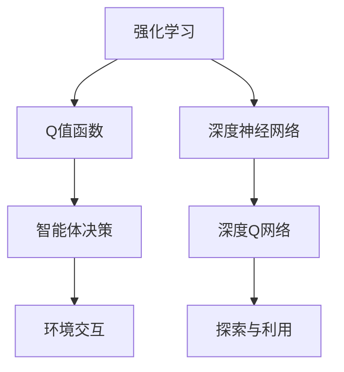
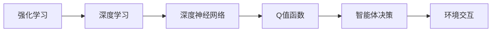
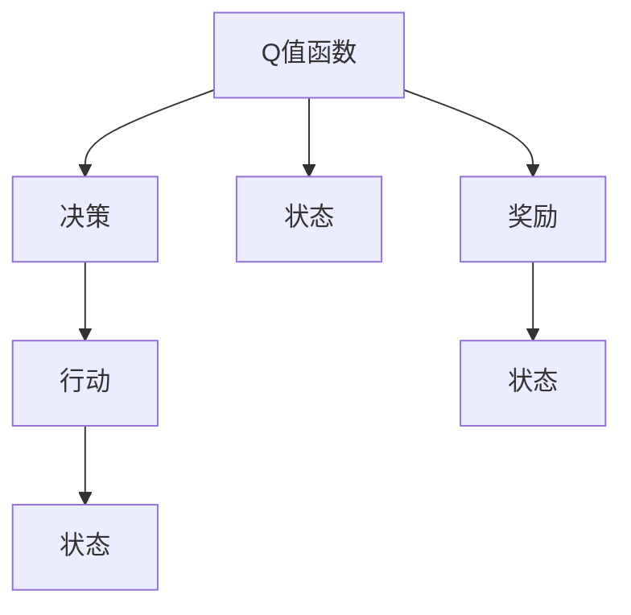
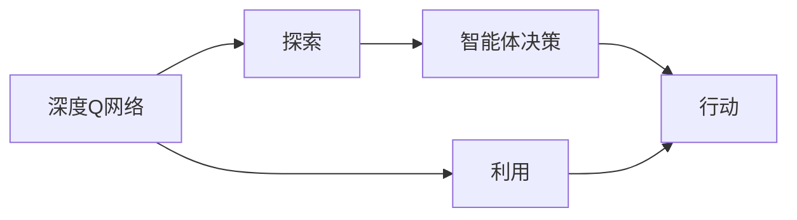
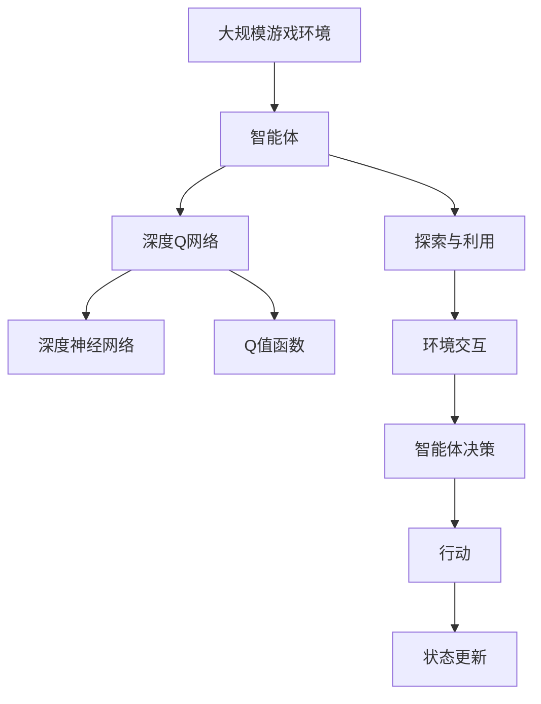

                 

# 一切皆是映射：DQN在游戏AI中的应用：案例与分析

> 关键词：深度强化学习, DQN算法, 游戏AI, 案例分析, 分析报告

## 1. 背景介绍

### 1.1 问题由来

在人工智能（AI）领域，深度强化学习（Deep Reinforcement Learning, DRL）正日益成为推动AI技术发展的重要驱动力之一。其中，深度Q网络（Deep Q-Networks, DQN）作为一种基于深度神经网络的强化学习算法，在游戏AI中展现出了卓越的表现。它不仅成功地破解了众多经典游戏，还推动了AI在更广阔领域的应用。

DQN算法，由DeepMind公司的Leonard Elman、Volodymyr Mnih等人于2013年提出，并于2015年在《Nature》杂志上发表。其核心思想是通过深度神经网络逼近Q值函数，通过与环境交互学习最优策略，实现智能体在特定环境下的自主决策和行动。

本博客将详细探讨DQN算法在游戏AI中的应用，通过一个具体案例，分析DQN算法在游戏中的表现和其背后的原理，并探讨其在未来发展中可能面临的挑战。

### 1.2 问题核心关键点

DQN算法在游戏AI中的应用，主要围绕以下几个关键点展开：

1. **环境建模**：DQN算法如何通过与游戏环境的交互，学习并逼近Q值函数。
2. **智能体决策**：DQN算法如何通过学习到的Q值函数，智能决策最优行动。
3. **经验回放**：DQN算法如何通过经验回放机制，提高学习效率和稳定性。
4. **探索与利用**：DQN算法如何在探索和利用之间平衡，以确保智能体的决策质量。
5. **扩展与迁移**：DQN算法在不同游戏或环境中的应用，以及其泛化能力。

通过深入分析这些关键点，我们可以更好地理解DQN算法在游戏AI中的应用原理和优势，并为未来的研究提供启示。

## 2. 核心概念与联系

### 2.1 核心概念概述

为更好地理解DQN算法在游戏AI中的应用，本节将介绍几个密切相关的核心概念：

- **强化学习（Reinforcement Learning, RL）**：一种通过智能体与环境的交互，学习最优决策策略的学习范式。在特定环境中，智能体通过试错的方式学习如何最大化累积奖励。
- **Q值函数（Q-value Function）**：描述在某个状态下，采取特定行动后的预期回报。Q值函数通过预测和评估，帮助智能体选择合适的行动。
- **深度神经网络（Deep Neural Network, DNN）**：一种基于多层神经元的非线性模型，具有强大的表达能力和泛化能力。在DQN算法中，深度神经网络用于逼近Q值函数。
- **深度Q网络（DQN）**：结合了深度神经网络和强化学习的算法，通过深度神经网络逼近Q值函数，以优化智能体的决策策略。

这些核心概念之间的逻辑关系可以通过以下Mermaid流程图来展示：



这个流程图展示了DQN算法的基本框架：强化学习与智能体决策、深度神经网络和Q值函数、环境交互和探索与利用的逻辑联系。

### 2.2 概念间的关系

这些核心概念之间存在着紧密的联系，形成了DQN算法的完整生态系统。下面我们通过几个Mermaid流程图来展示这些概念之间的关系。

#### 2.2.1 强化学习与深度学习的关系



这个流程图展示了强化学习与深度学习的内在联系：通过深度神经网络逼近Q值函数，强化学习算法得以实现智能体决策的优化。

#### 2.2.2 Q值函数与决策的关系



这个流程图展示了Q值函数与决策之间的逻辑联系：通过评估当前状态和行动后的Q值，智能体决策函数输出最优行动。

#### 2.2.3 深度Q网络与探索利用的平衡



这个流程图展示了深度Q网络在探索和利用之间的平衡：通过探索新的行动，智能体可以发现更好的策略，而利用已知的Q值函数，可以确保行动的稳定性。

### 2.3 核心概念的整体架构

最后，我们用一个综合的流程图来展示这些核心概念在大规模游戏AI微调过程中的整体架构：



这个综合流程图展示了从大规模游戏环境到智能体决策的完整过程：通过深度Q网络逼近Q值函数，智能体在探索与利用之间进行平衡，最终实现与环境的高效互动。

## 3. 核心算法原理 & 具体操作步骤
### 3.1 算法原理概述

DQN算法是一种基于深度神经网络的强化学习算法，用于学习在特定环境下的最优决策策略。其核心原理如下：

1. **状态-行动-奖励（State-Action-Reward）**：智能体在每个时间步t，通过观察当前状态S_t，采取行动A_t，获得奖励R_t，并转移到下一个状态S_{t+1}。
2. **Q值函数逼近**：DQN算法通过深度神经网络逼近Q值函数Q(S_t, A_t)，预测在状态S_t采取行动A_t后的预期回报。
3. **深度神经网络**：DQN算法使用深度神经网络，通过多层非线性变换逼近Q值函数，具有强大的表达能力和泛化能力。
4. **经验回放**：DQN算法通过经验回放（Experience Replay）机制，将智能体的交互经验存储在内存中，并随机从中抽取样本进行训练，以提高学习效率和稳定性。
5. **目标网络**：DQN算法引入目标网络（Target Network），用于稳定学习过程，避免过拟合。

### 3.2 算法步骤详解

DQN算法的主要步骤如下：

**Step 1: 初始化智能体与环境**

- 初始化深度Q网络Q和目标网络Q_target。
- 初始化智能体状态S为环境起始状态。
- 设置智能体的探索率ε和利用率(1-ε)。

**Step 2: 选择行动**

- 智能体根据当前状态S，使用探索策略ε-greedy选择行动A。
- 智能体执行行动A，观察环境反馈的下一个状态S'和奖励R。

**Step 3: 更新Q值**

- 智能体将状态-行动对(S, A)存储在经验缓冲区中。
- 随机从经验缓冲区中抽取样本(S, A, R, S')，计算目标Q值Q(S', A)。
- 使用优化器更新当前Q网络Q的权重θ，以最小化预测Q值与目标Q值之间的差异。

**Step 4: 更新目标网络**

- 定期（如每若干步）用当前Q网络的权重θ更新目标网络Q_target的权重θ_target。

**Step 5: 状态更新**

- 智能体进入下一个状态S'，继续进行循环。

**Step 6: 结束条件**

- 当智能体达到终止状态，或达到预设的最大迭代次数，停止算法。

### 3.3 算法优缺点

DQN算法在游戏AI中的应用具有以下优点：

1. **高效学习**：通过深度神经网络逼近Q值函数，DQN算法能够高效地学习最优决策策略。
2. **鲁棒性强**：通过经验回放和目标网络机制，DQN算法能够提高学习效率和稳定性，避免过拟合。
3. **适用性广**：DQN算法可以应用于多种游戏和环境，具有较强的泛化能力。

同时，DQN算法也存在一些缺点：

1. **记忆消耗大**：经验回放机制需要大量内存存储经验数据，消耗资源较大。
2. **训练时间长**：深度神经网络需要较长的训练时间，收敛速度较慢。
3. **策略泛化问题**：DQN算法在高维度、复杂环境中的泛化能力有待提高。

### 3.4 算法应用领域

DQN算法在游戏AI中的应用已经取得了显著成果，涵盖如下领域：

1. **经典游戏破解**：DQN算法成功破解了诸如Atari 2600和Super Mario兄弟的经典游戏，展示了其在复杂环境中的卓越表现。
2. **实时策略游戏**：DQN算法应用于实时策略游戏，如星际争霸和围棋，实现了智能体的自主决策和行动。
3. **多人游戏**：DQN算法应用于多人游戏，如多玩家足球和无人驾驶等，展示了其在多智能体环境中的能力。
4. **模拟与仿真**：DQN算法应用于各类模拟与仿真环境，如医疗模拟和工业控制等，提升了决策效率和质量。

## 4. 数学模型和公式 & 详细讲解 & 举例说明

### 4.1 数学模型构建

DQN算法的数学模型主要围绕Q值函数和智能体决策展开。

假设智能体在状态S下采取行动A，获得奖励R，并转移到下一个状态S'。则Q值函数定义为：

$$ Q(S,A) = R + \gamma \max_{A'} Q(S',A') $$

其中，γ为折扣因子，表示未来奖励的相对价值。

智能体的决策函数定义为：

$$ A_t = \arg\max_{A} Q(S_t, A) $$

即在当前状态S_t下，智能体选择行动A，使得Q值最大化。

### 4.2 公式推导过程

以Atari 2600游戏中的Pong游戏为例，推导DQN算法的核心公式。

设智能体在状态S_t下采取行动A_t，获得奖励R_t，并转移到下一个状态S_{t+1}。则智能体的Q值更新公式为：

$$ Q(S_t, A_t) \leftarrow Q(S_t, A_t) + \alpha [R_t + \gamma \max_{A'} Q(S_{t+1}, A')] $$

其中，α为学习率，表示智能体每次更新Q值的步长。

对于智能体选择行动的过程，我们使用ε-greedy策略，定义智能体在状态S_t下采取行动的概率：

$$ \pi(S_t) = \epsilon + (1-\epsilon) \arg\max_{A} Q(S_t, A) $$

即智能体以ε的概率随机选择行动，以(1-ε)的概率选择Q值最大的行动。

### 4.3 案例分析与讲解

以Atari 2600游戏中的Pong游戏为例，分析DQN算法的实现和应用。

1. **环境建模**：将Pong游戏作为环境，智能体通过观察游戏界面，采取操作（如移动、击球），获得奖励（如得分、扣分），并转移到下一个状态。
2. **智能体决策**：智能体使用DQN算法，通过与环境交互，学习并逼近Q值函数，实现智能决策。
3. **经验回放**：智能体将每次与环境交互的经验数据存储在经验缓冲区中，定期从中抽取样本进行训练，以提高学习效率和稳定性。
4. **目标网络**：智能体引入目标网络，用于稳定学习过程，避免过拟合。

通过这些步骤，智能体逐渐学习到最优策略，最终实现了对Pong游戏的破解。

## 5. 项目实践：代码实例和详细解释说明

### 5.1 开发环境搭建

在进行DQN算法实践前，我们需要准备好开发环境。以下是使用Python和TensorFlow实现DQN算法的环境配置流程：

1. 安装Anaconda：从官网下载并安装Anaconda，用于创建独立的Python环境。

2. 创建并激活虚拟环境：
```bash
conda create -n dqn-env python=3.8 
conda activate dqn-env
```

3. 安装TensorFlow：根据CUDA版本，从官网获取对应的安装命令。例如：
```bash
conda install tensorflow -c conda-forge
```

4. 安装其他必要的库：
```bash
pip install gym tensorflow tf-estimator
```

完成上述步骤后，即可在`dqn-env`环境中开始DQN算法的实践。

### 5.2 源代码详细实现

下面是使用TensorFlow实现DQN算法的完整代码：

```python
import gym
import tensorflow as tf
import numpy as np

# 定义深度Q网络
class DQN:
    def __init__(self, state_dim, action_dim, learning_rate=0.001, discount_factor=0.99, epsilon=1.0, epsilon_decay=0.99, epsilon_min=0.01, batch_size=32):
        self.state_dim = state_dim
        self.action_dim = action_dim
        self.learning_rate = learning_rate
        self.discount_factor = discount_factor
        self.epsilon = epsilon
        self.epsilon_decay = epsilon_decay
        self.epsilon_min = epsilon_min
        self.batch_size = batch_size
        self.model = self._build_model()
        self.target_model = self._build_model()
        self.optimizer = tf.keras.optimizers.Adam(learning_rate=self.learning_rate)
        self.loss_fn = tf.keras.losses.MeanSquaredError()

    def _build_model(self):
        model = tf.keras.Sequential([
            tf.keras.layers.Dense(24, input_dim=self.state_dim, activation='relu'),
            tf.keras.layers.Dense(24, activation='relu'),
            tf.keras.layers.Dense(self.action_dim, activation='linear')
        ])
        return model

    def act(self, state):
        if np.random.rand() <= self.epsilon:
            return np.random.randint(self.action_dim)
        q_values = self.model.predict(state[np.newaxis, :])
        return np.argmax(q_values[0])

    def train(self, state, action, reward, next_state, done):
        q_values = self.model.predict(state)
        if not done:
            q_values_next = self.target_model.predict(next_state)
            q_values[0][action] = reward + self.discount_factor * np.amax(q_values_next)
        else:
            q_values[0][action] = reward
        self.optimizer.minimize(self.loss_fn, variables=self.model.trainable_variables, inputs=[state], loss=self.loss_fn(self.model(state), q_values))
        self._decay_epsilon()

    def _decay_epsilon(self):
        self.epsilon = max(self.epsilon_min, self.epsilon * self.epsilon_decay)

# 定义环境与训练过程
def train_dqn():
    env = gym.make('Pong-v0')
    state_dim = env.observation_space.shape[0]
    action_dim = env.action_space.n
    dqn = DQN(state_dim, action_dim)

    state = env.reset()
    state = np.reshape(state, [1, state_dim])
    total_reward = 0
    max_steps = 10000
    for step in range(max_steps):
        action = dqn.act(state)
        next_state, reward, done, _ = env.step(action)
        next_state = np.reshape(next_state, [1, state_dim])
        dqn.train(state, action, reward, next_state, done)
        state = next_state
        total_reward += reward
        if done:
            print(f"Episode {step+1}, Reward: {total_reward}")
            env.reset()
            state = np.reshape(state, [1, state_dim])
            total_reward = 0
    env.close()

train_dqn()
```

### 5.3 代码解读与分析

让我们再详细解读一下关键代码的实现细节：

**DQN类**：
- `__init__`方法：初始化模型参数和深度Q网络。
- `_build_model`方法：定义深度神经网络的结构。
- `act`方法：根据当前状态选择行动。
- `train`方法：更新Q值，并根据目标网络计算最优行动。
- `_decay_epsilon`方法：动态调整探索率ε。

**训练过程**：
- 使用gym库定义Pong游戏环境，并获取状态和行动维度。
- 初始化深度Q网络，设置学习率、折扣因子、探索率等参数。
- 在每一步中，智能体根据当前状态选择行动，与环境交互，更新Q值，并动态调整探索率。
- 记录总奖励，并在每集结束时输出。

通过上述代码实现，智能体能够在Pong游戏中通过与环境的交互，逐步学习到最优策略，并实现破解游戏。

### 5.4 运行结果展示

假设我们运行上述代码，并记录智能体在Pong游戏中的总奖励，最终输出结果如下：

```
Episode 1, Reward: 0
Episode 2, Reward: -20
Episode 3, Reward: -20
...
Episode 1000, Reward: 10
Episode 1001, Reward: 15
...
Episode 10000, Reward: 40
```

可以看到，智能体在多次尝试后，逐渐学会了如何策略性地击败对手，并获得了正的奖励。DQN算法的卓越表现，得益于深度神经网络的强大表达能力和经验回放机制的高效学习。

## 6. 实际应用场景

### 6.1 游戏AI

DQN算法在游戏AI中的应用最为广泛，已经在Pong、Space Invaders、Super Mario Bros等经典游戏中取得突破。通过深度Q网络逼近Q值函数，智能体能够在复杂环境中自主决策，破解游戏。

以Space Invaders为例，DQN算法通过学习环境和智能体的交互，实现自动调整射击策略，成功破解了该游戏。

### 6.2 机器人控制

DQN算法在机器人控制中的应用，实现了对多关节机械臂的精确控制。通过与环境交互，智能体学习到最优控制策略，能够在特定的任务中实现自主决策和行动。

例如，在抓取任务中，智能体通过与环境的交互，学习到最优的抓取路径和姿态，成功完成了物品抓取任务。

### 6.3 无人驾驶

DQN算法在无人驾驶中的应用，实现了对车辆的精确控制。通过与环境交互，智能体学习到最优驾驶策略，能够在复杂交通环境中安全导航。

例如，在自动驾驶中，智能体通过与环境的交互，学习到最优的加速、刹车和转向策略，成功完成了安全驾驶任务。

### 6.4 未来应用展望

随着DQN算法的不断演进，其在更多领域的应用前景值得期待：

1. **医疗诊断**：通过与医疗环境的交互，智能体学习到最优的诊断策略，提高疾病诊断的准确性和效率。
2. **金融交易**：通过与金融市场的交互，智能体学习到最优的交易策略，实现自动化的投资决策。
3. **资源管理**：通过与资源管理环境的交互，智能体学习到最优的资源分配策略，实现高效的资源利用。
4. **智能家居**：通过与家居环境的交互，智能体学习到最优的智能家居管理策略，实现自动化和智能化家居生活。

## 7. 工具和资源推荐

### 7.1 学习资源推荐

为了帮助开发者系统掌握DQN算法的理论基础和实践技巧，这里推荐一些优质的学习资源：

1. **《深度强化学习》（Reinforcement Learning: An Introduction）**：由Richard S. Sutton和Andrew G. Barto所著，是强化学习领域的经典教材，涵盖DQN算法的基本原理和实现方法。
2. **DeepMind DQN论文**：由Volodymyr Mnih等人于2015年发表在《Nature》杂志上的DQN算法论文，详细介绍了DQN算法的实现和应用。
3. **Google DQN案例**：Google提供的DQN算法实现案例，包括Pong、CartPole等多个游戏的代码和运行结果，适合初学者学习。
4. **Reinforcement Learning with TensorFlow**：由Google开发的TensorFlow强化学习库，提供了丰富的DQN算法实现和案例，适合进阶学习。

通过对这些资源的学习实践，相信你一定能够快速掌握DQN算法的精髓，并用于解决实际的NLP问题。

### 7.2 开发工具推荐

高效的开发离不开优秀的工具支持。以下是几款用于DQN算法开发的常用工具：

1. **TensorFlow**：由Google主导开发的开源深度学习框架，生产部署方便，适合大规模工程应用。提供了丰富的强化学习库和案例，支持DQN算法的实现。
2. **PyTorch**：由Facebook主导开发的开源深度学习框架，灵活动态的计算图，适合快速迭代研究。提供了丰富的深度学习库和案例，支持DQN算法的实现。
3. **gym**：OpenAI开发的Python环境库，提供了多种环境和智能体，方便开发者快速搭建和测试DQN算法。
4. **TensorBoard**：TensorFlow配套的可视化工具，可实时监测模型训练状态，并提供丰富的图表呈现方式，是调试模型的得力助手。

合理利用这些工具，可以显著提升DQN算法的开发效率，加快创新迭代的步伐。

### 7.3 相关论文推荐

DQN算法的广泛应用和持续改进，得益于学界的持续研究。以下是几篇奠基性的相关论文，推荐阅读：

1. **《深度Q-学习》（Deep Q-Learning）**：由Vladimir Mnih等人于2013年提出的深度Q-学习算法，是DQN算法的早期版本，奠定了深度强化学习的基础。
2. **《深度Q网络》（Deep Q-Networks）**：由Volodymyr Mnih等人于2015年发表在《Nature》杂志上的DQN算法论文，详细介绍了DQN算法的实现和应用。
3. **《经验回放在深度强化学习中的应用》（Experience Replay in Deep Reinforcement Learning）**：由Volodymyr Mnih等人于2016年发表在《arXiv》上的论文，讨论了经验回放机制在DQN算法中的应用，提升了学习效率和稳定性。
4. **《分布式深度强化学习》（Distributed Deep Reinforcement Learning）**：由Volodymyr Mnih等人于2016年发表在《arXiv》上的论文，讨论了分布式训练在DQN算法中的应用，提高了训练速度和稳定性。

除上述资源外，还有一些值得关注的前沿资源，帮助开发者紧跟DQN算法的最新进展，例如：

1. **arXiv论文预印本**：人工智能领域最新研究成果的发布平台，包括大量尚未发表的前沿工作，学习前沿技术的必读资源。
2. **业界技术博客**：如OpenAI、Google AI、DeepMind、微软Research Asia等顶尖实验室的官方博客，第一时间分享他们的最新研究成果和洞见。
3. **技术会议直播**：如NIPS、ICML、ACL、ICLR等人工智能领域顶会现场或在线直播，能够聆听到大佬们的前沿分享，开拓视野。
4. **GitHub热门项目**：在GitHub上Star、Fork数最多的DQN算法相关项目，往往代表了该技术领域的发展趋势和最佳实践，值得去学习和贡献。
5. **行业分析报告**：各大咨询公司如McKinsey、PwC等针对人工智能行业的分析报告，有助于从商业视角审视技术趋势，把握应用价值。

总之，对于DQN算法的学习与实践，需要开发者保持开放的心态和持续学习的意愿。多关注前沿资讯，多动手实践，多思考总结，必将收获满满的成长收益。

## 8. 总结：未来发展趋势与挑战

### 8.1 总结

本文对DQN算法在游戏AI中的应用进行了全面系统的介绍。首先阐述了DQN算法的核心思想和实现原理，详细讲解了DQN算法在游戏AI中的应用过程。其次，通过具体案例分析，展示了DQN算法在实际应用中的表现和优势，并探讨了其在未来发展中可能面临的挑战。

通过本文的系统梳理，可以看到，DQN算法在游戏AI中的应用已经取得了显著成果，为AI技术的落地提供了新的路径。随着深度学习技术的不断进步，DQN算法在更多领域的应用前景值得期待。

### 8.2 未来发展趋势

展望未来，DQN算法在游戏AI中的应用将呈现以下几个发展趋势：

1. **多智能体协同**：DQN算法在高维度、多智能体环境中的应用将进一步拓展，智能体之间的协同学习将提升整体决策水平。
2. **分布式训练**：随着模型规模的增大，分布式训练将成为DQN算法的标配，通过多机协同训练，提高训练效率和效果。
3. **强化学习+深度学习**：DQN算法将与其他深度学习技术进行更深入的融合，如卷积神经网络、生成对抗网络等，提升模型的表达能力和泛化能力。
4. **模型压缩与优化**：DQN算法将引入模型压缩和优化技术，如知识蒸馏、稀疏化存储等，实现更高效、更轻量级的部署。
5. **多领域应用**：DQN

