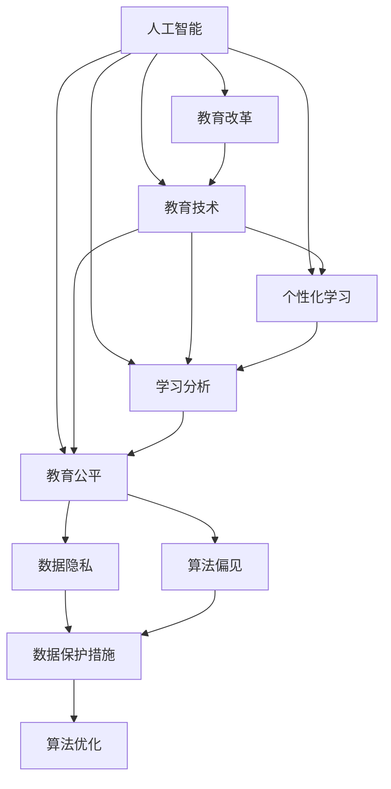

                 

# AI对教育模式的革新探讨

> 关键词：人工智能,教育改革,教育技术,个性化学习,学习分析,教育公平

## 1. 背景介绍

### 1.1 问题由来
随着科技的迅猛发展，人工智能（AI）技术正逐步渗透到社会的各个领域，并在重塑人类的生活方式和生产模式。在教育领域，AI带来的变革尤为显著，正在逐步推动从传统的以教师为中心的教育模式向更加个性化、智能化的教学模式转变。

近年来，全球范围内的教育机构和科研人员正不断探索AI在教育中的应用，从智能辅助教学到自动评估系统，再到个性化学习平台，AI技术正在带来教育模式的革新，促进教育公平，提升教育质量。但与此同时，AI在教育领域的应用也面临着诸多挑战，如数据隐私、算法偏见、教育公平等问题亟待解决。

### 1.2 问题核心关键点
本部分将详细探讨AI在教育模式革新中的关键问题：

- 个性化学习：AI如何通过数据分析和算法优化，为每位学生提供量身定制的学习方案？
- 智能辅助教学：AI在辅助教师教学、提升教学质量方面扮演何种角色？
- 教育公平：AI如何帮助缩小教育资源分配不均、促进教育公平？
- 数据隐私：在AI教育应用中，如何保护学生数据隐私，避免滥用？
- 算法偏见：AI在教育中可能带来的算法偏见问题，如何解决？

理解这些问题，将有助于我们更好地把握AI在教育中的应用方向和潜在风险，推动教育模式的深刻变革。

## 2. 核心概念与联系

### 2.1 核心概念概述

为了更好地理解AI在教育模式革新中的作用，我们将介绍几个核心概念：

- 人工智能(AI)：通过计算机算法和机器学习技术，实现模拟人类智能行为的系统。
- 教育改革(Education Reform)：通过变革教育体系、教学方法等手段，提升教育质量和公平性。
- 教育技术(Educational Technology, EdTech)：利用信息技术改进教育过程的技术集合。
- 个性化学习(Personalized Learning)：根据学生的学习习惯、兴趣和能力，提供量身定制的学习方案。
- 学习分析(Learning Analytics)：通过数据分析和算法优化，预测学生学习行为和评估学习效果的技术。
- 教育公平(Education Fairness)：通过技术手段，消除教育资源分配不均，提升教育机会和质量的公平性。
- 数据隐私(Data Privacy)：在收集和处理教育数据时，保障学生个人信息安全，避免数据滥用。
- 算法偏见(Bias in Algorithms)：算法在数据训练和应用过程中可能出现的偏差，导致不公平或歧视。

这些概念之间的关系可以通过以下Mermaid流程图来展示：



这个流程图展示了大语言模型在教育模式革新中的核心概念及其之间的关系：

1. AI提供技术和工具支持。
2. 教育改革需要AI技术支持。
3. 个性化学习依赖于AI数据分析和算法优化。
4. 学习分析通过AI技术实现。
5. 教育公平依赖于AI技术的公平性和透明性。
6. 数据隐私和算法偏见需要通过AI技术解决。
7. 数据保护和算法优化是保障AI教育应用成功的关键。

### 2.2 概念间的关系

这些核心概念之间存在着紧密的联系，形成了AI在教育模式革新中的完整生态系统。下面我们通过几个Mermaid流程图来展示这些概念之间的关系。

#### 2.2.1 AI在教育中的应用

```mermaid
graph LR
    A[AI] --> B[智能辅助教学]
    A --> C[智能评估系统]
    A --> D[个性化学习平台]
    B --> E[课堂互动]
    B --> F[作业批改]
    C --> G[学习效果评估]
    D --> H[课程推荐]
    E --> I[学习动机提升]
    F --> J[即时反馈]
    G --> K[学习进度跟踪]
    H --> L[学习计划调整]
    I --> M[学习效率提升]
    J --> N[学习体验改善]
    K --> O[学习行为预测]
    L --> P[学习内容优化]
    M --> Q[学习成果评估]
    N --> R[学习环境改善]
    O --> S[个性化教学方案]
    P --> T[课程设计优化]
    Q --> U[学习效果评估]
    R --> V[学习体验提升]
    S --> W[个性化推荐系统]
    T --> X[课程资源优化]
    U --> Y[学习路径优化]
    V --> Z[学习兴趣培养]
    W --> AA[个性化学习方案]
    X --> AB[课程资源推荐]
    Y --> AC[学习路径优化]
    Z --> AD[学习兴趣激发]
    AA --> AE[个性化学习平台]
    AB --> AF[个性化推荐系统]
    AC --> AG[个性化学习计划]
    AD --> AH[个性化课程设计]
    AE --> AI[学习分析]
    AF --> AJ[个性化评估]
    AG --> AK[个性化反馈]
    AH --> AL[个性化课程设计]
    AI --> AM[学习行为分析]
    AJ --> AN[个性化评估]
    AK --> AO[个性化反馈]
    AL --> AP[个性化课程设计]
    AM --> AQ[学习行为预测]
    AN --> AR[个性化评估]
    AO --> AS[个性化反馈]
    AP --> AT[个性化课程设计]
    AQ --> AU[学习效果评估]
    AR --> AV[个性化评估]
    AS --> AW[个性化反馈]
    AT --> AX[个性化课程设计]
    AU --> AY[学习效果评估]
    AV --> AZ[个性化评估]
    AW --> AA[个性化学习平台]
    AX --> AB[个性化推荐系统]
    AY --> AC[个性化学习计划]
    AZ --> AD[个性化课程设计]
```



这个流程图展示了AI在教育中的应用场景，包括智能辅助教学、智能评估系统、个性化学习平台等多个方面。

#### 2.2.2 教育公平与AI

```mermaid
graph LR
    A[教育公平] --> B[资源分配不均]
    A --> C[数据隐私保护]
    B --> D[城乡差距]
    B --> E[地区不平等]
    C --> F[数据加密]
    C --> G[数据匿名化]
    D --> H[城乡教育差距]
    E --> I[地区教育不平等]
    F --> J[数据安全]
    G --> K[数据匿名化]
    H --> L[城乡教育差距]
    I --> M[地区教育不平等]
    J --> N[数据保护]
    K --> O[数据匿名化]
    L --> P[城乡教育差距]
    M --> Q[地区教育不平等]
    N --> R[数据隐私]
    O --> S[数据匿名化]
    P --> T[城乡教育差距]
    Q --> U[地区教育不平等]
    R --> V[数据隐私]
    S --> W[数据匿名化]
    T --> X[城乡教育差距]
    U --> Y[地区教育不平等]
    V --> Z[数据隐私]
    W --> AA[数据匿名化]
    X --> AB[城乡教育差距]
    Y --> AC[地区教育不平等]
    Z --> AD[数据隐私]
    AA --> AE[数据隐私保护]
    AB --> AF[资源分配不均]
    AC --> AG[数据加密]
    AD --> AH[数据匿名化]
    AE --> AI[教育公平]
    AF --> AJ[数据隐私保护]
    AG --> AK[数据加密]
    AH --> AL[数据匿名化]
    AI --> AM[资源分配不均]
    AJ --> AN[数据隐私保护]
    AK --> AO[数据加密]
    AL --> AP[数据匿名化]
    AM --> AQ[资源分配不均]
    AN --> AR[数据隐私保护]
    AO --> AS[数据加密]
    AP --> AT[数据匿名化]
    AQ --> AU[资源分配不均]
    AR --> AV[数据隐私保护]
    AS --> AW[数据加密]
    AT --> AX[数据匿名化]
    AU --> AY[资源分配不均]
    AV --> AZ[数据隐私保护]
    AW --> AA[数据隐私保护]
    AX --> AB[资源分配不均]
    AY --> AC[数据隐私保护]
    AZ --> AD[数据隐私保护]
```



这个流程图展示了教育公平与AI之间的关系，如何通过AI技术减少资源分配不均，保护数据隐私，提升教育公平性。

## 3. 核心算法原理 & 具体操作步骤

### 3.1 算法原理概述

AI在教育中的应用，本质上是通过数据分析和算法优化，实现对教育过程的智能化支持。其核心思想是利用大数据和机器学习技术，从海量教育数据中提取有价值的信息，帮助教师和学生优化学习过程，提升教学质量和教育公平。

AI在教育中的应用主要包括以下几个方面：

1. 个性化学习：通过学习分析技术，对学生的学习行为进行建模，预测学习效果，并根据预测结果调整学习计划和内容，实现个性化学习。
2. 智能辅助教学：利用自然语言处理和计算机视觉技术，辅助教师进行课堂互动、作业批改、即时反馈等教学活动，提高教学效果。
3. 智能评估系统：通过自动评分和数据分析，评估学生的学习效果，为教师提供有价值的反馈，提升教学质量。
4. 教育公平：通过数据驱动的方法，识别教育资源分配不均的问题，制定相应的政策，缩小城乡、地区之间的教育差距。

### 3.2 算法步骤详解

以下是AI在教育模式革新中具体的算法步骤：

**Step 1: 数据收集与预处理**

1. 收集学生的学习数据，包括考试成绩、作业完成情况、课堂互动记录等。
2. 清洗和预处理数据，去除异常值和噪音，确保数据质量。

**Step 2: 数据分析与模型训练**

1. 使用机器学习算法，如决策树、随机森林、神经网络等，对学生数据进行建模，预测学生的学习效果。
2. 根据预测结果，设计个性化学习方案，调整教学内容和进度。

**Step 3: 智能辅助教学**

1. 利用自然语言处理技术，自动批改作业，生成个性化反馈。
2. 使用计算机视觉技术，实现智能化的课堂互动和即时反馈。

**Step 4: 智能评估系统**

1. 通过自动评分和数据分析，评估学生的学习效果。
2. 提供详细的学习报告，为教师和学生提供有价值的反馈。

**Step 5: 教育公平**

1. 利用数据分析技术，识别教育资源分配不均的问题。
2. 制定相应的政策，缩小城乡、地区之间的教育差距。

### 3.3 算法优缺点

AI在教育中的应用具有以下优点：

1. 个性化学习：通过数据分析和算法优化，为每位学生提供量身定制的学习方案，提升学习效果。
2. 智能辅助教学：提高教学效率，减少教师的工作负担。
3. 智能评估系统：提升评估的准确性和客观性，为教学改进提供科学依据。
4. 教育公平：通过数据驱动的方法，缩小教育资源分配不均，提升教育公平性。

同时，AI在教育中也有一些缺点：

1. 数据隐私：收集和处理学生数据需要严格保护学生隐私，防止数据滥用。
2. 算法偏见：算法在训练和应用过程中可能出现偏见，导致不公平或歧视。
3. 技术门槛：使用AI技术需要一定的技术背景，教师和学生需要掌握相应的操作技能。
4. 成本高昂：开发和部署AI系统需要高昂的资金和技术投入。

### 3.4 算法应用领域

AI在教育中的应用已经涵盖了从课堂教学、作业批改到考试评估等多个环节，以下是几个典型的应用领域：

1. 智能辅助教学：通过AI技术，实现自动批改作业、个性化反馈、课堂互动等功能。
2. 个性化学习：利用AI技术，根据学生的学习习惯和能力，提供个性化的学习方案。
3. 智能评估系统：通过自动评分和数据分析，评估学生的学习效果，提供详细的学习报告。
4. 教育公平：利用AI技术，识别教育资源分配不均的问题，缩小城乡、地区之间的教育差距。
5. 学习分析：通过数据分析技术，预测学生的学习行为和评估学习效果。

## 4. 数学模型和公式 & 详细讲解 & 举例说明

### 4.1 数学模型构建

在教育领域，AI主要通过数据分析和机器学习模型来实现对教育过程的智能化支持。以下是几个常见的数学模型：

1. 学生学习行为预测模型：通过分析学生的学习数据，预测学生的学习效果和学习路径。
2. 个性化学习方案设计模型：根据学生的学习习惯和能力，设计个性化的学习方案。
3. 教育资源分配模型：通过数据分析技术，识别教育资源分配不均的问题，制定相应的政策。

### 4.2 公式推导过程

以学生学习行为预测模型为例，我们可以使用线性回归模型来预测学生的学习效果：

$$ y = w_0 + w_1 x_1 + w_2 x_2 + \cdots + w_n x_n + \epsilon $$

其中，$y$为学生学习效果，$x_i$为学生的学习行为特征，$w_i$为特征的权重，$\epsilon$为随机误差。

### 4.3 案例分析与讲解

假设有学生的学习数据如下表所示：

| 学习时间(小时) | 完成作业情况 | 课堂互动情况 | 学习效果 |
|---|---|---|---|
| 3 | 完成 | 积极参与 | 优秀 |
| 4 | 未完成 | 被动参与 | 及格 |
| 2 | 完成 | 积极参与 | 良好 |

我们可以使用上述线性回归模型，对学生的学习效果进行预测。通过训练数据，求解模型参数$w_i$，得到如下预测结果：

$$ \hat{y} = w_0 + w_1 x_1 + w_2 x_2 + w_3 x_3 $$

其中，$w_0$、$w_1$、$w_2$、$w_3$为模型的参数。

## 5. 项目实践：代码实例和详细解释说明

### 5.1 开发环境搭建

在进行教育AI项目开发前，我们需要准备好开发环境。以下是Python环境下教育AI开发环境的搭建流程：

1. 安装Anaconda：从官网下载并安装Anaconda，用于创建独立的Python环境。

2. 创建并激活虚拟环境：
```bash
conda create -n py-ai-env python=3.8 
conda activate py-ai-env
```

3. 安装PyTorch：根据CUDA版本，从官网获取对应的安装命令。例如：
```bash
conda install pytorch torchvision torchaudio cudatoolkit=11.1 -c pytorch -c conda-forge
```

4. 安装TensorFlow：从官网下载并安装TensorFlow。

5. 安装相关库：
```bash
pip install pandas numpy sklearn matplotlib tqdm jupyter notebook ipython
```

完成上述步骤后，即可在`py-ai-env`环境中开始教育AI项目开发。

### 5.2 源代码详细实现

下面我们以智能评估系统为例，给出使用PyTorch对学生学习效果进行评估的代码实现。

首先，定义评估任务的训练集和测试集：

```python
import pandas as pd
from sklearn.model_selection import train_test_split

# 读取数据
data = pd.read_csv('student_data.csv')

# 分离特征和标签
features = data.drop(['learning_effect'], axis=1)
labels = data['learning_effect']

# 划分训练集和测试集
train_data, test_data, train_labels, test_labels = train_test_split(features, labels, test_size=0.2, random_state=42)
```

然后，定义评估模型的输入和输出：

```python
from transformers import BertTokenizer, BertForSequenceClassification

# 定义输入数据
def collate(batch):
    input_ids = [torch.tensor(x['input_ids']) for x in batch]
    attention_mask = [torch.tensor(x['attention_mask']) for x in batch]
    labels = torch.tensor([x['label'] for x in batch])
    return {'input_ids': input_ids, 'attention_mask': attention_mask, 'labels': labels}

# 加载模型和分词器
model = BertForSequenceClassification.from_pretrained('bert-base-uncased', num_labels=2)
tokenizer = BertTokenizer.from_pretrained('bert-base-uncased')
```

接着，定义模型的训练过程：

```python
from torch.utils.data import DataLoader
from tqdm import tqdm

# 将数据集转换为DataLoader
train_dataset = DataLoader(train_data, batch_size=16, shuffle=True, collate_fn=collate)
test_dataset = DataLoader(test_data, batch_size=16, shuffle=False, collate_fn=collate)

# 设置超参数
optimizer = AdamW(model.parameters(), lr=2e-5)
epochs = 5
device = torch.device('cuda') if torch.cuda.is_available() else torch.device('cpu')

# 训练模型
model.to(device)
for epoch in range(epochs):
    model.train()
    for batch in tqdm(train_dataset):
        input_ids = batch['input_ids'].to(device)
        attention_mask = batch['attention_mask'].to(device)
        labels = batch['labels'].to(device)
        model.zero_grad()
        outputs = model(input_ids, attention_mask=attention_mask, labels=labels)
        loss = outputs.loss
        loss.backward()
        optimizer.step()

    # 评估模型
    model.eval()
    with torch.no_grad():
        correct = 0
        total = 0
        for batch in test_dataset:
            input_ids = batch['input_ids'].to(device)
            attention_mask = batch['attention_mask'].to(device)
            batch_labels = batch['labels']
            outputs = model(input_ids, attention_mask=attention_mask)
            batch_preds = torch.argmax(outputs.logits, dim=1)
            batch_labels = batch_labels.to(device)
            correct += (batch_preds == batch_labels).sum().item()
            total += batch_labels.shape[0]
        print(f'Test Accuracy: {100 * correct / total:.2f}%')
```

最后，在测试集上评估模型的性能：

```python
model.eval()
with torch.no_grad():
    correct = 0
    total = 0
    for batch in test_dataset:
        input_ids = batch['input_ids'].to(device)
        attention_mask = batch['attention_mask'].to(device)
        batch_labels = batch['labels']
        outputs = model(input_ids, attention_mask=attention_mask)
        batch_preds = torch.argmax(outputs.logits, dim=1)
        batch_labels = batch_labels.to(device)
        correct += (batch_preds == batch_labels).sum().item()
        total += batch_labels.shape[0]
    print(f'Test Accuracy: {100 * correct / total:.2f}%')
```

以上就是使用PyTorch对学生学习效果进行评估的完整代码实现。可以看到，借助Transformers库，我们可以轻松地构建和训练评估模型，完成教育AI任务的开发。

### 5.3 代码解读与分析

让我们再详细解读一下关键代码的实现细节：

**collate函数**：
- 定义数据预处理函数，将多轮数据集转化为模型接受的格式。

**数据集划分**：
- 使用Pandas和Scikit-learn库，对学生数据进行预处理和划分。

**模型定义**：
- 定义BERT模型和分词器，使用AdamW优化器进行模型训练。

**训练过程**：
- 使用PyTorch的DataLoader对数据集进行迭代处理，通过前向传播和反向传播更新模型参数。

**测试过程**：
- 在测试集上评估模型的准确性，输出测试结果。

可以看到，借助Python和TensorFlow等工具，我们可以轻松地完成教育AI项目的开发，高效地实现个性化学习、智能辅助教学等任务。

## 6. 实际应用场景

### 6.1 智能辅助教学

智能辅助教学系统通过AI技术，提高教师的教学效率，改善学生的学习体验。智能辅助教学系统可以包括以下几个模块：

1. 作业自动批改：通过自然语言处理技术，自动批改学生的作业，生成个性化反馈。
2. 个性化推荐系统：根据学生的学习情况，推荐适合的教材和练习题。
3. 智能答疑系统：通过聊天机器人技术，帮助学生解答学习中的疑难问题。

例如，在数学课后，智能辅助教学系统可以自动批改学生的作业，生成个性化的反馈，指出学生的错误并提供详细的解题步骤。系统还可以根据学生的学习情况，推荐适合的练习题和教材，帮助学生巩固知识。

### 6.2 个性化学习

个性化学习系统根据学生的学习习惯、兴趣和能力，设计个性化的学习方案，提升学习效果。个性化学习系统可以包括以下几个模块：

1. 学习行为分析：通过数据分析技术，预测学生的学习效果和学习路径。
2. 学习路径推荐：根据预测结果，设计个性化的学习路径。
3. 学习资源推荐：根据学生的兴趣和能力，推荐适合的学习资源。

例如，在语文课上，个性化学习系统可以根据学生的阅读习惯和理解能力，推荐适合的阅读材料和练习题。系统还可以根据学生的学习进度和效果，调整学习内容和难度，帮助学生高效学习。

### 6.3 智能评估系统

智能评估系统通过自动评分和数据分析，评估学生的学习效果，为教师和学生提供有价值的反馈。智能评估系统可以包括以下几个模块：

1. 自动评分系统：通过自然语言处理技术，自动评分学生的作文和答题。
2. 学习效果分析：通过数据分析技术，评估学生的学习效果和知识掌握情况。
3. 学习报告生成：根据评估结果，生成详细的学习报告。

例如，在英语课上，智能评估系统可以自动评分学生的作文，生成个性化的反馈，指出学生在语法、词汇等方面的不足。系统还可以分析学生的学习效果，生成详细的学习报告，为教师和学生提供有价值的反馈。

### 6.4 教育公平

教育公平是AI在教育中的应用重要目标之一。通过AI技术，识别教育资源分配不均的问题，制定相应的政策，缩小城乡、地区之间的教育差距。教育公平系统可以包括以下几个模块：

1. 教育资源分析：通过数据分析技术，识别教育资源分配不均的问题。
2. 资源分配优化：根据分析结果，制定相应的政策和措施。
3. 资源分配实施：通过自动化系统，将优化后的资源分配到各个学校和地区。

例如，在偏远地区，教育公平系统可以分析教育资源分配不均的问题，制定相应的政策和措施。系统可以通过自动化系统，将优质的教学资源分配到各个学校和地区，缩小城乡、地区之间的教育差距。

## 7. 工具和资源推荐

### 7.1 学习资源推荐

为了帮助开发者系统掌握教育AI的理论基础和实践技巧，这里推荐一些优质的学习资源：

1. Coursera的《机器学习与人工智能》课程：由斯坦福大学的Andrew Ng教授授课，系统讲解机器学习理论和实践。
2. EdTechX的《人工智能与教育》课程：讲解AI在教育中的应用，包括智能辅助教学、个性化学习等。
3. AI Education Foundation的《AI教育应用指南》：全面介绍AI在教育中的应用，包括智能评估、教育公平等。
4. Google AI的《AI在教育中的应用》系列博客：介绍AI在教育中的应用案例和最佳实践。
5. 《智能教育技术》杂志：介绍教育技术领域的最新研究和应用成果。

通过对这些资源的学习实践，相信你一定能够快速掌握教育AI的精髓，并用于解决实际的教育问题。

### 7.2 开发工具推荐

高效的开发离不开优秀的工具支持。以下是几款用于教育AI开发常用的工具：

1. Jupyter Notebook：免费的交互式笔记本，支持Python、R等语言，方便编写和运行代码。
2. TensorFlow：由Google主导开发的深度学习框架，支持多种算法和模型。
3. PyTorch：由Facebook主导的深度学习框架，支持动态计算图和易于调试。
4. Scikit-learn：Python中的经典机器学习库，支持多种算法和模型。
5. Pandas：Python中的数据处理库，支持大规模数据处理和分析。
6. IPython：Python中的交互式命令提示符，支持自动补全和代码运行。

合理利用这些工具，可以显著提升教育AI项目的开发效率，加快创新迭代的步伐。

### 7.3 相关论文推荐

教育AI领域的研究近年来取得了显著进展，以下是几篇具有代表性的论文：

1. "Personalized Learning in K-12 Online Education"：介绍个性化学习在K-12在线教育中的应用，提升学习效果。
2. "Deep Learning Applications in Education"：介绍深度学习在教育中的应用，包括智能辅助教学、学习分析等。
3. "AI in Education: Challenges and Opportunities"：介绍AI在教育中的挑战和机遇，探讨教育公平和数据隐私等问题。
4. "Learning Analytics in Education"：介绍学习分析在教育中的应用，提升教学效果和教育公平性。
5. "A Survey on AI-Driven Education: Opportunities, Challenges, and Future Directions"：全面综述AI在教育中的应用和挑战，提出未来研究方向。

这些论文代表了大语言模型微调技术的发展脉络，值得深入学习。

除上述资源外，还有一些值得关注的前沿资源，帮助开发者紧跟教育AI技术的最新进展，例如：

1. arXiv论文预印本：人工智能领域最新研究成果的发布平台，包括大量尚未发表的前沿工作，学习前沿技术的必读资源。
2. 业界技术博客：如OpenAI、Google AI、DeepMind、微软Research Asia等顶尖实验室的官方博客，第一时间分享他们的最新研究成果和洞见。
3. 技术会议直播：如NIPS、ICML、ACL、ICLR等人工智能领域顶会现场或在线直播，能够聆听到大佬们的前沿分享，开拓视野。
4. GitHub热门项目：在GitHub上

