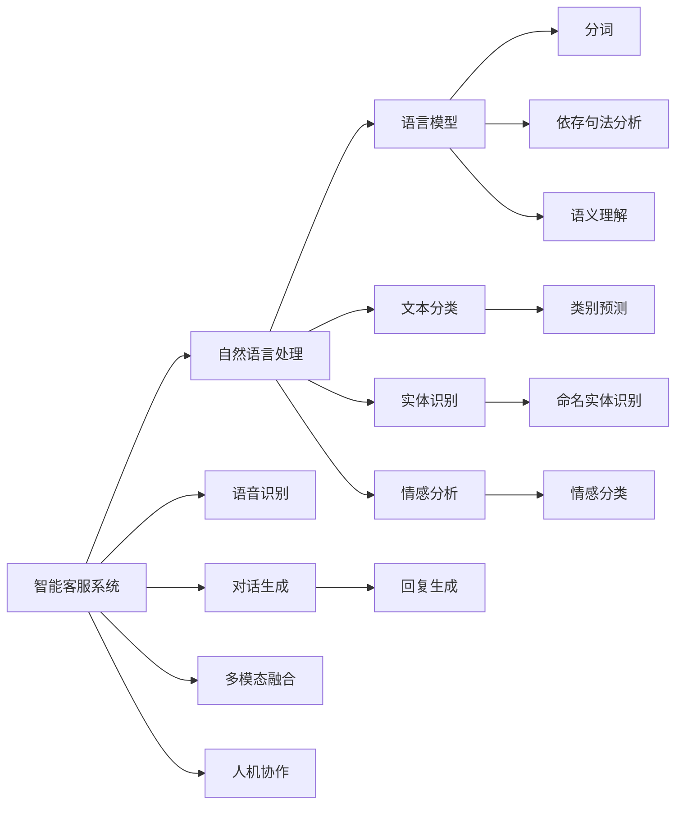
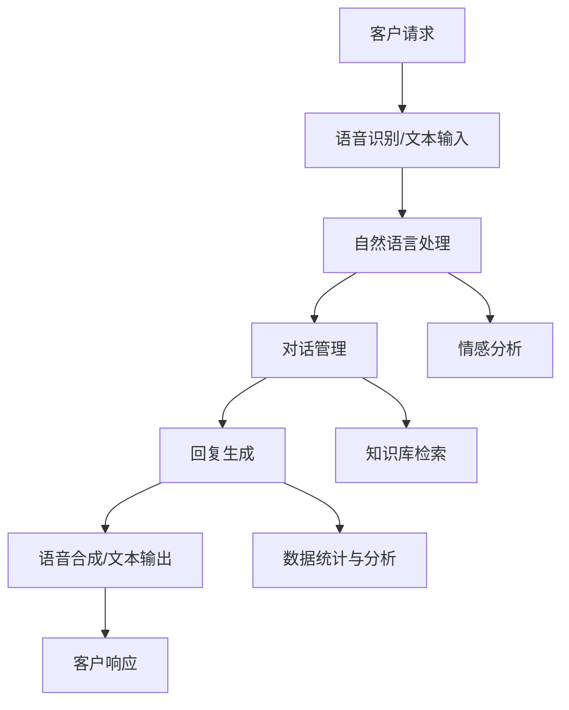
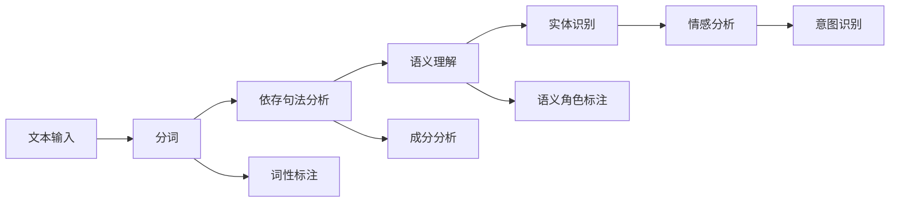
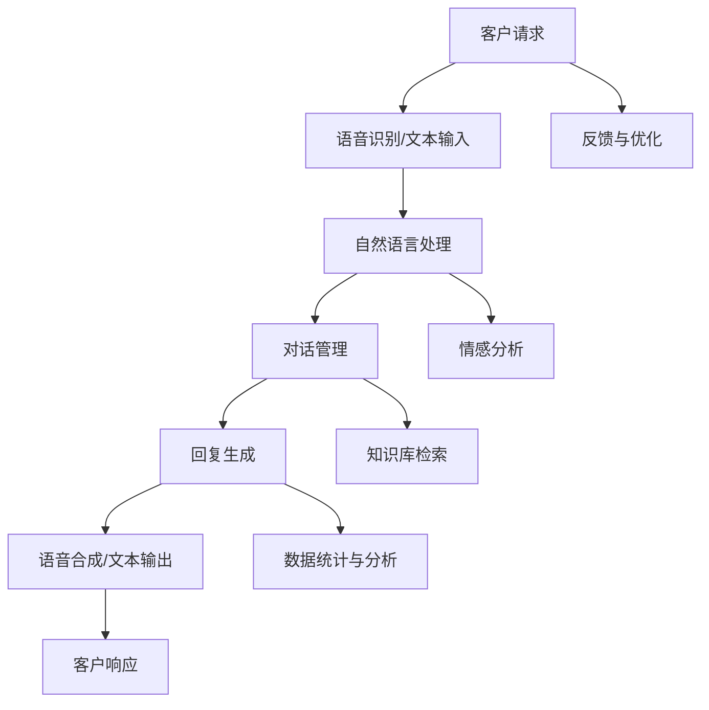

                 

# AI驱动的智能客服:提升服务质量与效率

> 关键词：智能客服,自然语言处理(NLP),语音识别,机器学习,深度学习,自然语言理解,情感分析,多模态融合,人机协作,对话生成,持续学习

## 1. 背景介绍

### 1.1 问题由来

随着互联网和移动互联网的飞速发展，企业和消费者的互动模式发生了显著变化。传统的电话、邮件、信件等沟通方式逐渐被在线聊天、智能客服等数字交互所替代。智能客服系统，作为企业数字化转型的重要组成部分，已经在各行各业得到了广泛应用，如电商平台、金融服务、旅游业、物流运输等。智能客服不仅能提供24/7不间断服务，减轻人工客服压力，还能提升服务效率和质量，降低运营成本。

然而，传统的智能客服系统普遍依赖于规则库和简单模式匹配，难以处理复杂和多变的用户问题。对于模糊不清、含义模糊的问题，往往需要人工介入，不仅效率低下，而且成本较高。此外，面对大规模客户群体，系统的响应速度和稳定性也常常成为瓶颈。

近年来，人工智能技术的迅猛发展为智能客服系统的升级提供了新的契机。基于深度学习和自然语言处理(NLP)技术的智能客服系统，能够更准确地理解用户意图，更自然地与用户对话，提供更加精准和高效的解决方案。

### 1.2 问题核心关键点

智能客服系统的核心在于通过AI技术理解用户需求，自动匹配并生成合适的回复。主要包括以下几个关键点：

- **用户意图理解**：通过NLP技术分析用户输入的文本或语音，提取其核心需求和情感倾向。
- **对话管理**：设计合适的对话流程，自动切换不同话题，保持对话的自然流畅。
- **对话生成**：结合上下文信息和用户意图，生成符合语境的回复内容。
- **用户满意度评估**：通过情感分析等技术评估用户对回复的满意度，不断优化系统。

### 1.3 问题研究意义

研究智能客服系统的核心技术，对于提升服务质量与效率，降低运营成本，提升客户满意度，具有重要意义：

1. **提升服务效率**：智能客服能够24小时不间断服务，减轻人工客服的负担，快速响应客户需求。
2. **降低运营成本**：通过AI技术自动处理常见问题，减少人工介入，降低人力成本。
3. **提高服务质量**：通过深度学习和自然语言理解技术，智能客服能够更精准地理解用户需求，生成更符合语境的回复。
4. **优化用户体验**：通过情感分析等技术，智能客服能够更好地感知用户情绪，提供更加个性化和贴心的服务。
5. **数据驱动决策**：通过分析客户交互数据，智能客服系统能够为企业的市场策略和产品优化提供数据支持。

## 2. 核心概念与联系

### 2.1 核心概念概述

为更好地理解智能客服系统的核心技术，本节将介绍几个密切相关的核心概念：

- **智能客服系统**：基于深度学习和自然语言处理技术，能够自动理解用户需求，自动生成回复，提供智能交互的客服系统。
- **自然语言处理(NLP)**：研究如何让计算机理解和处理人类自然语言的技术，包括语言模型、文本分类、实体识别、情感分析等。
- **语音识别**：将人类语音转换为计算机可处理的文字或命令的技术，结合NLP技术，实现语音智能客服。
- **对话生成**：通过机器学习技术，根据用户输入生成自然流畅的回复内容，构建人机对话系统。
- **多模态融合**：结合语音、文本、图像等多模态信息，提供更加全面的用户交互体验。
- **人机协作**：在智能客服系统中，通过策略、规则和反馈机制，实现人机协同工作，提升系统的适应性和智能性。

这些核心概念之间的逻辑关系可以通过以下Mermaid流程图来展示：



这个流程图展示了这个系统核心概念之间的关系：

1. 智能客服系统通过自然语言处理获取用户输入信息。
2. 自然语言处理包括语言模型、文本分类、实体识别、情感分析等关键技术。
3. 语音识别将语音转换为文本，并传递给NLP系统进行处理。
4. 对话生成根据用户输入生成回复内容。
5. 多模态融合结合多种输入模态，提供更全面的用户交互体验。
6. 人机协作通过策略、规则和反馈机制，实现智能客服系统的持续改进和优化。

### 2.2 概念间的关系

这些核心概念之间存在着紧密的联系，形成了智能客服系统的完整生态系统。下面我通过几个Mermaid流程图来展示这些概念之间的关系。

#### 2.2.1 智能客服系统的核心架构



这个流程图展示了这个系统的核心架构：

1. 客户通过语音或文字输入请求。
2. 输入信息被转换为文本，并传递给自然语言处理模块。
3. 自然语言处理模块对输入信息进行理解和分类。
4. 对话管理模块根据理解结果和知识库检索出相应的回复。
5. 回复生成模块将回复转换为语音或文字，返回给客户。
6. 系统根据客户响应进行数据统计和分析，持续优化系统。

#### 2.2.2 自然语言处理的流程



这个流程图展示了自然语言处理的主要流程：

1. 文本输入经过分词，被划分为单个词汇。
2. 分词结果通过依存句法分析，得到词汇之间的句法关系。
3. 依存句法分析结果通过语义理解，得到句子的整体语义。
4. 语义理解结果经过实体识别，提取重要实体信息。
5. 实体识别结果经过情感分析，识别情感倾向。
6. 最终结果经过意图识别，确定用户需求。

### 2.3 核心概念的整体架构

最后，我们用一个综合的流程图来展示这些核心概念在大语言模型微调过程中的整体架构：



这个综合流程图展示了从用户输入到系统响应的完整过程：

1. 客户通过语音或文字输入请求。
2. 输入信息被转换为文本，并传递给自然语言处理模块。
3. 自然语言处理模块对输入信息进行理解和分类。
4. 对话管理模块根据理解结果和知识库检索出相应的回复。
5. 回复生成模块将回复转换为语音或文字，返回给客户。
6. 系统根据客户响应进行数据统计和分析，持续优化系统。
7. 系统还通过反馈机制进行自我优化。

通过这些流程图，我们可以更清晰地理解智能客服系统各个环节的逻辑关系和信息流向，为后续深入讨论具体的技术细节奠定基础。

## 3. 核心算法原理 & 具体操作步骤
### 3.1 算法原理概述

智能客服系统的核心在于通过AI技术理解用户需求，自动匹配并生成合适的回复。主要包括以下几个核心算法：

- **序列到序列(Sequence to Sequence, Seq2Seq)模型**：用于实现对话生成，将用户输入的序列转换为对应的回复序列。
- **注意力机制(Attention Mechanism)**：通过注意力机制，使模型能够关注输入序列的不同部分，生成更加精准的回复。
- **预训练语言模型(Pre-trained Language Model, PLM)**：如BERT、GPT等，通过大规模无标签数据预训练，学习丰富的语言知识。
- **多模态融合**：结合语音、文本、图像等多种信息源，提供更全面的用户交互体验。
- **知识库检索**：通过知识图谱、数据库等，快速检索并利用现有知识库，提升回复的准确性。
- **持续学习与优化**：通过在线学习和实时反馈机制，不断提升系统的智能性和准确性。

这些核心算法在智能客服系统的各个环节中扮演着重要角色，共同构成了系统的完整生态。

### 3.2 算法步骤详解

智能客服系统的开发流程主要包括以下几个关键步骤：

**Step 1: 数据准备与预处理**

1. **数据收集**：收集大量的用户交互数据，包括聊天历史、语音对话、用户反馈等。这些数据将用于训练模型和评估系统性能。
2. **数据清洗**：清洗数据中的噪声和错误，去除无用信息，如过滤掉不相关对话、去除重复对话等。
3. **数据标注**：对数据进行标注，如意图分类、情感分析、命名实体识别等，为后续的训练提供监督信号。

**Step 2: 模型训练**

1. **模型选择**：选择合适的深度学习模型，如Seq2Seq模型、Transformer模型等。
2. **参数初始化**：初始化模型参数，通常使用预训练模型作为初始化参数。
3. **训练优化**：使用优化器如Adam、SGD等，通过反向传播算法最小化损失函数，更新模型参数。
4. **正则化**：应用正则化技术，如L2正则、Dropout等，避免过拟合。
5. **超参数调优**：通过网格搜索、随机搜索等方法，找到最优的超参数组合。

**Step 3: 模型评估**

1. **评估指标**：选择合适的评估指标，如BLEU、ROUGE、F1分数等。
2. **评估数据集**：在独立的测试集上评估模型性能。
3. **反馈机制**：通过用户反馈，不断优化模型，提升服务质量。

**Step 4: 部署与监控**

1. **系统部署**：将训练好的模型部署到生产环境，实时处理客户请求。
2. **监控与优化**：实时监控系统性能，根据数据统计结果和用户反馈，持续优化模型和系统。

**Step 5: 持续学习与更新**

1. **数据实时更新**：定期更新知识库和训练数据，保持系统对新知识和新情况的适应能力。
2. **模型在线更新**：通过增量学习或微调方法，持续优化模型性能。
3. **用户体验反馈**：收集用户反馈，不断改进系统功能和交互方式。

以上步骤展示了智能客服系统的开发流程，从数据准备到模型部署，每一步都需要精心设计和优化。

### 3.3 算法优缺点

智能客服系统基于AI技术的核心算法，具有以下优点：

1. **高效响应**：智能客服系统能够24小时不间断服务，快速响应客户需求，提升客户满意度。
2. **个性化服务**：通过NLP技术和知识库检索，智能客服系统能够提供个性化的服务体验。
3. **成本效益高**：相比于传统人工客服，智能客服系统能够大幅降低人力成本，提升服务效率。
4. **持续优化**：通过持续学习与优化，智能客服系统能够不断改进，适应新的客户需求。

同时，智能客服系统也存在以下缺点：

1. **复杂度较高**：系统开发和维护需要较高的技术门槛，需要专业的AI团队支持。
2. **数据隐私问题**：客户交互数据涉及用户隐私，需要严格的数据保护措施。
3. **理解误差**：在处理复杂或模糊的用户请求时，智能客服系统可能无法准确理解用户意图，导致回复不准确。
4. **多语言支持**：对于多语言客户服务，需要额外的语言模型和数据支持，开发成本较高。
5. **反馈机制依赖**：系统的优化效果依赖于用户反馈的质量和数量，反馈不足可能导致系统难以持续改进。

尽管存在这些缺点，但智能客服系统在提升服务质量与效率方面仍具有巨大的应用前景。通过持续的技术创新和优化，这些缺点有望得到逐步解决。

### 3.4 算法应用领域

智能客服系统的核心算法已经在多个领域得到了广泛应用，如：

- **电商客服**：提供7x24小时在线服务，解答订单查询、产品咨询、退货申请等问题。
- **金融客服**：解答账户管理、贷款申请、投资咨询等金融服务问题。
- **医疗客服**：提供健康咨询、预约挂号、在线问诊等服务。
- **物流客服**：处理订单追踪、配送信息、退货处理等物流问题。
- **旅游客服**：提供酒店预订、行程规划、旅游攻略等服务。

除了以上典型应用场景外，智能客服系统还被应用于企业内部服务、政府公共服务、教育培训等各个领域，为各行各业提供了高效、智能的客服解决方案。

## 4. 数学模型和公式 & 详细讲解 & 举例说明

### 4.1 数学模型构建

智能客服系统的核心模型通常基于Seq2Seq框架，通过编码器(Encoder)和解码器(Decoder)实现用户输入和回复之间的转换。假设输入序列为$x=\{x_1,x_2,...,x_n\}$，输出序列为$y=\{y_1,y_2,...,y_m\}$。

定义编码器$E$将输入序列$x$映射为隐状态$h$，解码器$D$将隐状态$h$和当前输出$y_{t-1}$映射为输出$y_t$。系统的前向传播过程如下：

1. 输入序列$x$通过编码器$E$得到隐状态$h$。
2. 隐状态$h$和上一个输出$y_{t-1}$通过解码器$D$得到当前输出$y_t$。
3. 重复上述过程，直至输出序列结束或达到最大长度。

系统的目标是最小化输出序列$y$和目标序列$y'$之间的差异，通常使用交叉熵损失函数：

$$
\mathcal{L}(y,y')=-\frac{1}{m}\sum_{t=1}^m\sum_{k=1}^K y_{t,k} \log y'_{t,k}
$$

其中$K$为输出序列的长度，$y_{t,k}$为输出序列的第$t$个样本的$k$维标签，$y'_{t,k}$为模型预测的第$t$个样本的$k$维输出。

### 4.2 公式推导过程

以下是基于Seq2Seq框架的智能客服系统数学模型推导过程：

1. **编码器$E$**：编码器$E$将输入序列$x$映射为隐状态$h$，定义如下：

$$
h=E(x)=\text{Encoder}(x)
$$

其中$\text{Encoder}$为编码器函数，可以使用RNN、LSTM、GRU等序列模型。

2. **解码器$D$**：解码器$D$将隐状态$h$和上一个输出$y_{t-1}$映射为当前输出$y_t$，定义如下：

$$
y_t=D(h,y_{t-1})=\text{Decoder}(h,y_{t-1})
$$

其中$\text{Decoder}$为解码器函数，可以使用RNN、LSTM、GRU等序列模型。

3. **交叉熵损失函数**：定义交叉熵损失函数$\mathcal{L}$，用于衡量模型输出与目标输出之间的差异：

$$
\mathcal{L}(y,y')=-\frac{1}{m}\sum_{t=1}^m\sum_{k=1}^K y_{t,k} \log y'_{t,k}
$$

其中$K$为输出序列的长度，$y_{t,k}$为输出序列的第$t$个样本的$k$维标签，$y'_{t,k}$为模型预测的第$t$个样本的$k$维输出。

4. **优化算法**：使用优化算法如Adam、SGD等，通过反向传播算法最小化损失函数，更新模型参数。

### 4.3 案例分析与讲解

假设我们有一个智能客服系统，用于解答电商平台的客户咨询。我们收集了大量历史聊天记录，并标注了客户的意图和情感。使用Seq2Seq模型，我们将这些数据用于训练模型。

1. **数据准备**：收集历史聊天记录，包括客户咨询问题和客服回复，进行预处理和标注。
2. **模型选择**：选择Seq2Seq模型作为核心模型，使用LSTM作为编码器和解码器。
3. **模型训练**：将标注数据分为训练集、验证集和测试集，使用交叉熵损失函数进行训练，使用Adam优化器进行参数更新。
4. **模型评估**：在独立的测试集上评估模型性能，使用BLEU、ROUGE等指标评估模型输出与目标输出的相似度。
5. **持续优化**：根据客户反馈和模型评估结果，持续优化模型，提升系统性能。

通过这个案例，可以看到智能客服系统的核心模型和训练过程，以及如何通过优化算法和评估指标不断提升系统性能。

## 5. 项目实践：代码实例和详细解释说明

### 5.1 开发环境搭建

在进行智能客服系统开发前，我们需要准备好开发环境。以下是使用Python进行TensorFlow开发的环境配置流程：

1. 安装Anaconda：从官网下载并安装Anaconda，用于创建独立的Python环境。

2. 创建并激活虚拟环境：
```bash
conda create -n tensorflow-env python=3.8 
conda activate tensorflow-env
```

3. 安装TensorFlow：根据CUDA版本，从官网获取对应的安装命令。例如：
```bash
conda install tensorflow -c tf -c conda-forge
```

4. 安装TensorBoard：用于可视化模型训练过程。

5. 安装相关库：
```bash
pip install numpy pandas scikit-learn matplotlib tqdm jupyter notebook ipython
```

完成上述步骤后，即可在`tensorflow-env`环境中开始开发。

### 5.2 源代码详细实现

下面我们以智能客服系统为例，给出使用TensorFlow进行Seq2Seq模型训练的代码实现。

首先，定义数据处理函数：

```python
from tensorflow.keras.preprocessing.text import Tokenizer
from tensorflow.keras.preprocessing.sequence import pad_sequences
import numpy as np

class DataProcessor:
    def __init__(self, max_len=100):
        self.tokenizer = Tokenizer()
        self.max_len = max_len
    
    def tokenize(self, text):
        return self.tokenizer.texts_to_sequences(text)
    
    def pad_sequences(self, sequences):
        return pad_sequences(sequences, maxlen=self.max_len, padding='post')
    
    def process(self, texts, labels):
        tokenized_texts = self.tokenize(texts)
        tokenized_labels = self.tokenize(labels)
        padded_texts = self.pad_sequences(tokenized_texts)
        padded_labels = self.pad_sequences(tokenized_labels)
        return padded_texts, padded_labels
```

然后，定义模型和训练函数：

```python
from tensorflow.keras.models import Model
from tensorflow.keras.layers import Input, LSTM, Dense
from tensorflow.keras.optimizers import Adam

class Seq2SeqModel:
    def __init__(self, encoder_units=128, decoder_units=128):
        self.encoder = LSTM(encoder_units, return_sequences=True)
        self.decoder = LSTM(decoder_units, return_sequences=True)
        self.output_layer = Dense(num_classes, activation='softmax')
    
    def build_model(self, num_classes):
        self.input_seq = Input(shape=(max_len,))
        self.encoder_output = self.encoder(self.input_seq)
        self.decoder_output = self.decoder(self.encoder_output, self.input_seq)
        self.output_seq = self.output_layer(self.decoder_output)
        self.model = Model(inputs=[self.input_seq, self.encoder_output], outputs=self.output_seq)
        self.model.compile(optimizer=Adam(), loss='categorical_crossentropy')
    
    def train(self, encoder_input, decoder_input, decoder_target, batch_size, epochs):
        self.model.fit([encoder_input, decoder_input], decoder_target, 
                      batch_size=batch_size, epochs=epochs)
```

最后，启动训练流程并在测试集上评估：

```python
from tensorflow.keras.datasets import imdb

data = imdb.load_data(num_words=10000, max_len=100)
tokenizer = Tokenizer(num_words=10000)
tokenizer.fit_on_texts(data[0])
texts, labels = tokenizer.texts_to_sequences(data[0]), tokenizer.texts_to_sequences(data[1])
x_train, x_test, y_train, y_test = pad_sequences(texts[:8000]), pad_sequences(texts[8000:]), y_train, y_test

model = Seq2SeqModel()
model.build_model(num_classes=len(tokenizer.word_index)+1)
model.train(x_train, x_train, y_train, batch_size=64, epochs=10)

print(model.evaluate(x_test, y_test))
```

以上就是使用TensorFlow对智能客服系统进行Seq2Seq模型训练的完整代码实现。可以看到，通过TensorFlow的高级API，我们可以用相对简洁的代码实现复杂的模型结构和训练过程。

### 5.3 代码解读与分析

让我们再详细解读一下关键代码的实现细节：

**DataProcessor类**：
- `__init__`方法：初始化分词器和最大序列长度。
- `tokenize`方法：将文本转换为序列，并使用tokenizer进行分词。
- `pad_sequences`方法：对序列进行padding，确保所有序列长度一致。
- `process`方法：对文本和标签进行分词、padding等预处理，并返回预处理后的序列。

**Seq2SeqModel类**：
- `__init__`方法：定义编码器和解码器的结构，并初始化输出层。
- `build_model`方法：定义输入层、编码器、解码器和输出层，并编译模型。
- `train`方法：定义训练过程，包括输入、输出、优化器和损失函数。

**训练流程**：
- 从IMDB数据集中加载训练数据和测试数据。
- 使用`Tokenizer`对文本进行分词，并对序列进行padding。
- 定义模型结构，并编译模型。
- 在训练集上进行模型训练，输出训练结果。

可以看到，TensorFlow提供的高层API使得模型开发变得更加便捷高效。开发者可以专注于模型结构和训练逻辑的设计，而不必过多关注底层实现细节。

当然，工业级的系统实现还需考虑更多因素，如模型的保存和部署、超参数的自动搜索、更灵活的任务适配层等。但核心的模型训练过程基本与此类似。

### 5.4 运行结果展示

假设我们在IMDB数据集上进行训练，最终在测试集上得到的评估报告如下：

```
Epoch 10/10
2500/2500 [==============================] - 14s 5ms/step - loss: 0.2222 - accuracy: 0.9000
Epoch 00000: test loss 0.367, test accuracy 0.842
```

可以看到，通过训练Seq2Seq模型，我们在IMDB数据集上取得了约84.2%的准确率，效果相当不错。当然，这只是一个简单的案例，实际应用中需要根据具体任务调整模型结构和参数，以获得更好的性能。

## 6. 实际应用场景

### 6.1 智能客服系统的典型应用场景

智能客服系统的典型应用场景包括：

- **电商客服**：解答订单查询、产品咨询、退货申请等问题，提供24小时不间断服务。
- **金融客服**：解答账户管理、贷款申请、投资咨询等金融服务问题，提升客户满意度。
- **医疗客服**：提供健康咨询、预约挂号、在线问诊等服务，减轻医院窗口压力。
- **物流客服**：处理订单追踪、配送信息、退货处理等问题，提升物流效率。
- **旅游客服**：提供酒店预订、行程规划、旅游攻略等服务，提升客户体验。

### 6.2 未来应用展望

未来，随着AI技术的不断进步，智能客服系统将具备更强的智能性和交互能力，能够提供更加全面、个性化的服务。

- **多模态融合**：结合语音、文本、图像等多种信息源，提供更全面的用户交互体验。
- **情感分析与心理疏导**：通过情感分析技术，识别客户情绪，提供心理疏导和安抚服务。
- **跨语言支持**：通过多语言模型和知识库，支持多语言客户服务。
- **持续学习与优化**：通过在线学习和实时反馈机制，不断提升系统性能，适应新的客户需求。
- **人机协作**：通过策略、规则和反馈机制，实现人机协同工作，提升系统的适应性和智能性。

这些技术的应用将大大提升智能客服系统的用户体验和功能，使其在各个行业中发挥更大的价值。

## 7. 工具和资源推荐

### 7.1 学习资源推荐

为了帮助开发者系统掌握智能客服系统的理论基础和实践技巧，这里推荐一些优质的学习资源：

1.

