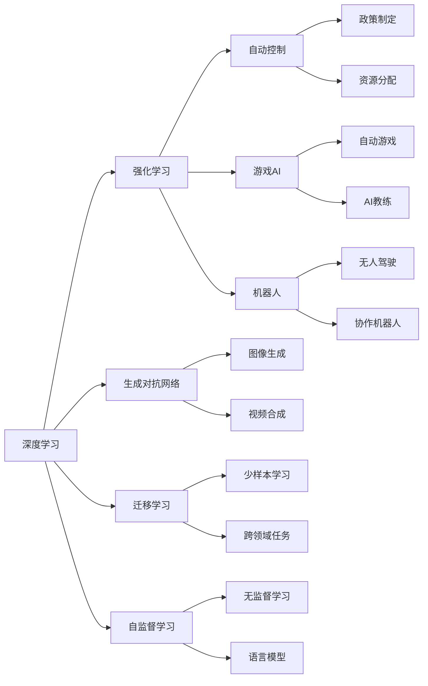

                 

# 安德里·卡帕西谈AI的未来

## 1. 背景介绍

### 1.1 问题由来
随着人工智能（AI）技术的迅速发展，其在医疗、金融、交通、教育等各个领域的应用前景日益广阔。然而，AI技术的应用也引发了诸多伦理、法律和社会问题，亟需社会各界的关注和引导。

安德里·卡帕西（Andrej Karpathy）作为斯坦福大学计算机视觉和AI领域的顶尖专家，曾主导开发Tesla的自动驾驶技术，在AI领域有深厚的造诣和广泛的影响力。近日，他在社交媒体上分享了对AI未来发展的看法，引发了广泛讨论。本文将对卡帕西的观点进行系统梳理，并结合学界和业界的研究进展，深入探讨AI未来的发展趋势和挑战。

## 2. 核心概念与联系

### 2.1 核心概念概述

安德里·卡帕西在分享中提到，AI的未来发展离不开以下几个核心概念：

- **深度学习（Deep Learning）**：一种通过多层神经网络实现复杂数据表示和模式识别的技术。深度学习在大数据集上取得了显著成效，广泛应用于图像识别、语音识别、自然语言处理等领域。

- **强化学习（Reinforcement Learning）**：一种通过试错学习最优策略的机器学习技术。强化学习在自动控制、游戏AI、机器人等领域具有重要应用。

- **生成对抗网络（Generative Adversarial Networks, GANs）**：一种生成模型，通过两个神经网络（生成器和判别器）交替训练，生成逼真的数据。GANs在图像生成、视频合成等领域展现了巨大潜力。

- **迁移学习（Transfer Learning）**：一种利用已有模型在新任务上的性能，通过微调（Fine-Tuning）提升新任务的性能的技术。迁移学习在少样本学习、跨领域任务中表现出色。

- **自监督学习（Self-Supervised Learning）**：一种通过数据自身的内在结构进行无监督学习的方法，如语言模型预训练。自监督学习在缺乏标注数据的情况下，能有效提升模型性能。

- **因果学习（Causal Learning）**：一种通过学习因果关系，进行复杂决策和规划的AI技术。因果学习在政策制定、资源分配等需要因果推理的场景中具有重要应用。

- **人机协作（Human-AI Collaboration）**：一种通过AI增强人类决策和操作的协作模式。人机协作在医疗、教育、交通等领域具有重要应用前景。

### 2.2 概念间的关系

这些核心概念之间存在着紧密的联系，构成了AI技术的基础架构。以下Mermaid流程图展示了这些概念之间的关系：



这些概念共同构成了AI技术的核心，通过相互配合，推动AI技术在各个领域的应用和发展。

## 3. 核心算法原理 & 具体操作步骤

### 3.1 算法原理概述

AI算法原理的核心在于通过数据训练模型，使其能够对新数据进行预测或生成。深度学习是AI中最常用的技术，其核心在于多层神经网络对数据的抽象和表示。强化学习和自监督学习则通过不同的学习方式，提升模型的泛化能力和性能。生成对抗网络和迁移学习则是基于数据生成和知识迁移的AI技术。

### 3.2 算法步骤详解

AI算法的训练过程大致分为以下几个步骤：

1. **数据准备**：收集和预处理数据，确保数据质量和多样性。
2. **模型构建**：选择合适的神经网络结构，设置超参数，构建模型。
3. **模型训练**：使用训练数据对模型进行迭代训练，最小化损失函数。
4. **模型评估**：使用测试数据评估模型性能，根据评估结果调整模型参数。
5. **模型应用**：将训练好的模型应用于实际场景，进行预测或生成。

### 3.3 算法优缺点

AI算法具有以下优点：

- **高精度**：深度学习等技术在大数据集上表现出色，能够实现高精度的预测和生成。
- **泛化能力强**：自监督学习和迁移学习等技术能够提升模型的泛化能力和性能，适应新任务和新数据。
- **自动化**：通过自动化训练和优化，AI算法能够快速迭代和优化，提升模型性能。

同时，AI算法也存在以下缺点：

- **数据依赖性强**：AI算法需要大量标注数据进行训练，数据采集和标注成本较高。
- **模型复杂度高**：深度学习等技术模型复杂度高，计算资源和存储空间需求大。
- **伦理和安全问题**：AI算法在医疗、金融等领域的应用可能涉及隐私和伦理问题，需要严格监管。

### 3.4 算法应用领域

AI算法已经在医疗、金融、交通、教育等多个领域取得了显著成效。以下列举了几个典型的应用领域：

- **医疗领域**：AI在影像诊断、病历分析、药物研发等方面展现了巨大潜力，辅助医生进行诊断和治疗。
- **金融领域**：AI在风险评估、客户分析、交易策略等方面表现出色，帮助金融机构提高效率和盈利能力。
- **交通领域**：AI在自动驾驶、交通规划、智能调度等方面具有重要应用，提升交通系统的智能化水平。
- **教育领域**：AI在智能辅助教学、自动评估、个性化推荐等方面应用广泛，提升教育质量和效率。
- **制造领域**：AI在智能制造、质量检测、设备维护等方面具有重要应用，提升制造效率和质量。

## 4. 数学模型和公式 & 详细讲解

### 4.1 数学模型构建

深度学习模型的基本架构包括输入层、隐藏层和输出层。其中，隐藏层通过非线性变换对输入数据进行抽象和表示，输出层则根据任务需求生成预测或分类结果。数学上，深度学习模型可以表示为：

$$
\hat{y} = f_\theta(x)
$$

其中，$f_\theta(x)$ 为模型参数 $\theta$ 下的非线性变换函数，$x$ 为输入数据，$\hat{y}$ 为预测结果。

### 4.2 公式推导过程

以图像分类任务为例，深度学习模型的前向传播过程可以表示为：

$$
h_0 = x
$$

$$
h_l = \sigma(W_lh_{l-1} + b_l)
$$

其中，$h_l$ 为第 $l$ 层的隐藏状态，$W_l$ 和 $b_l$ 为第 $l$ 层的权重和偏置，$\sigma$ 为激活函数。

模型的损失函数通常为交叉熵损失函数，可以表示为：

$$
L(y, \hat{y}) = -\sum_{i=1}^N y_i \log \hat{y}_i
$$

其中，$y$ 为真实标签，$\hat{y}$ 为模型预测结果。

### 4.3 案例分析与讲解

以图像分类为例，深度学习模型在训练过程中，通过反向传播算法计算损失函数的梯度，更新模型参数。以下展示了使用PyTorch进行图像分类任务的代码实现：

```python
import torch
import torch.nn as nn
import torchvision.transforms as transforms
from torchvision.datasets import CIFAR10
from torch.utils.data import DataLoader

# 定义模型
class Net(nn.Module):
    def __init__(self):
        super(Net, self).__init__()
        self.conv1 = nn.Conv2d(3, 64, 3, padding=1)
        self.relu = nn.ReLU(inplace=True)
        self.maxpool = nn.MaxPool2d(2, 2)
        self.conv2 = nn.Conv2d(64, 128, 3, padding=1)
        self.conv3 = nn.Conv2d(128, 128, 3, padding=1)
        self.fc = nn.Linear(128 * 8 * 8, 10)

    def forward(self, x):
        x = self.conv1(x)
        x = self.relu(x)
        x = self.maxpool(x)
        x = self.conv2(x)
        x = self.relu(x)
        x = self.maxpool(x)
        x = self.conv3(x)
        x = self.relu(x)
        x = self.maxpool(x)
        x = x.view(-1, 128 * 8 * 8)
        x = self.fc(x)
        return x

# 加载数据集
transform = transforms.Compose([
    transforms.ToTensor(),
    transforms.Normalize((0.5, 0.5, 0.5), (0.5, 0.5, 0.5))
])
trainset = CIFAR10(root='./data', train=True, download=True, transform=transform)
trainloader = DataLoader(trainset, batch_size=4, shuffle=True, num_workers=2)
testset = CIFAR10(root='./data', train=False, download=True, transform=transform)
testloader = DataLoader(testset, batch_size=4, shuffle=False, num_workers=2)

# 训练模型
model = Net()
criterion = nn.CrossEntropyLoss()
optimizer = torch.optim.Adam(model.parameters(), lr=0.001)
for epoch in range(10):
    running_loss = 0.0
    for i, data in enumerate(trainloader, 0):
        inputs, labels = data
        optimizer.zero_grad()
        outputs = model(inputs)
        loss = criterion(outputs, labels)
        loss.backward()
        optimizer.step()
        running_loss += loss.item()
    print('Epoch [%d/%d], Loss: %.3f' % (epoch + 1, 10, running_loss / len(trainloader)))
```

## 5. 项目实践：代码实例和详细解释说明

### 5.1 开发环境搭建

在进行AI项目开发前，首先需要搭建好开发环境。以下是使用Python和PyTorch进行AI开发的简单步骤：

1. 安装Python：确保Python版本为3.6或以上。
2. 安装PyTorch：使用pip安装PyTorch，确保GPU支持。
3. 安装Tensorboard：使用pip安装Tensorboard，可视化训练过程。
4. 安装CUDA：确保安装CUDA和cuDNN，使用GPU进行训练。

### 5.2 源代码详细实现

以下以图像分类为例，展示使用PyTorch进行深度学习模型训练的代码实现。

```python
import torch
import torch.nn as nn
import torchvision.transforms as transforms
from torchvision.datasets import CIFAR10
from torch.utils.data import DataLoader

# 定义模型
class Net(nn.Module):
    def __init__(self):
        super(Net, self).__init__()
        self.conv1 = nn.Conv2d(3, 64, 3, padding=1)
        self.relu = nn.ReLU(inplace=True)
        self.maxpool = nn.MaxPool2d(2, 2)
        self.conv2 = nn.Conv2d(64, 128, 3, padding=1)
        self.conv3 = nn.Conv2d(128, 128, 3, padding=1)
        self.fc = nn.Linear(128 * 8 * 8, 10)

    def forward(self, x):
        x = self.conv1(x)
        x = self.relu(x)
        x = self.maxpool(x)
        x = self.conv2(x)
        x = self.relu(x)
        x = self.maxpool(x)
        x = self.conv3(x)
        x = self.relu(x)
        x = self.maxpool(x)
        x = x.view(-1, 128 * 8 * 8)
        x = self.fc(x)
        return x

# 加载数据集
transform = transforms.Compose([
    transforms.ToTensor(),
    transforms.Normalize((0.5, 0.5, 0.5), (0.5, 0.5, 0.5))
])
trainset = CIFAR10(root='./data', train=True, download=True, transform=transform)
trainloader = DataLoader(trainset, batch_size=4, shuffle=True, num_workers=2)
testset = CIFAR10(root='./data', train=False, download=True, transform=transform)
testloader = DataLoader(testset, batch_size=4, shuffle=False, num_workers=2)

# 训练模型
model = Net()
criterion = nn.CrossEntropyLoss()
optimizer = torch.optim.Adam(model.parameters(), lr=0.001)
for epoch in range(10):
    running_loss = 0.0
    for i, data in enumerate(trainloader, 0):
        inputs, labels = data
        optimizer.zero_grad()
        outputs = model(inputs)
        loss = criterion(outputs, labels)
        loss.backward()
        optimizer.step()
        running_loss += loss.item()
    print('Epoch [%d/%d], Loss: %.3f' % (epoch + 1, 10, running_loss / len(trainloader)))
```

### 5.3 代码解读与分析

在上述代码中，我们首先定义了一个简单的卷积神经网络（CNN）模型，用于对CIFAR-10数据集进行图像分类。然后使用CIFAR-10数据集，并使用Adam优化器进行训练。在每个epoch结束时，我们打印出训练损失，并使用Tensorboard可视化训练过程。

## 6. 实际应用场景

### 6.1 智能交通

AI技术在智能交通领域具有重要应用。例如，通过摄像头和传感器收集交通数据，使用深度学习模型进行交通流预测和优化，提高道路通行效率，减少交通事故。

在实际应用中，我们可以使用AI模型进行交通流量分析和预测，通过动态调整信号灯和交通标志，优化交通流量。此外，还可以利用AI模型进行自动驾驶和无人驾驶技术的开发，提升道路安全性和出行效率。

### 6.2 医疗诊断

AI技术在医疗领域也具有广泛应用。例如，通过医学影像和病历数据，使用深度学习模型进行疾病诊断和预测，辅助医生进行精准治疗。

在实际应用中，我们可以使用AI模型进行疾病分类和预测，通过分析医学影像和病历数据，生成个性化治疗方案。此外，还可以利用AI模型进行药物研发，加速新药的开发和临床试验。

### 6.3 智能制造

AI技术在智能制造领域具有重要应用。例如，通过传感器和物联网设备收集生产数据，使用AI模型进行生产优化和预测维护，提高生产效率和产品质量。

在实际应用中，我们可以使用AI模型进行生产流程优化和预测维护，通过实时监控和分析生产数据，生成生产优化方案。此外，还可以利用AI模型进行设备故障预测和维护，提高设备利用率和生产效率。

## 7. 工具和资源推荐

### 7.1 学习资源推荐

- **深度学习框架**：TensorFlow、PyTorch、Keras等深度学习框架，提供了丰富的API和工具，方便进行模型开发和训练。
- **开源数据集**：Kaggle、UCI等数据集平台，提供了大量标注数据集，方便进行模型训练和验证。
- **在线课程**：Coursera、Udacity等在线平台，提供了大量AI和深度学习课程，方便进行系统学习和实践。

### 7.2 开发工具推荐

- **IDE和编辑器**：Jupyter Notebook、PyCharm等IDE和编辑器，提供了丰富的功能和插件，方便进行代码编写和调试。
- **版本控制**：Git等版本控制工具，提供了代码管理和协作功能，方便进行团队协作和代码版本管理。
- **数据处理和可视化**：Pandas、NumPy、Matplotlib等数据处理和可视化工具，提供了丰富的数据处理和可视化功能，方便进行数据预处理和模型验证。

### 7.3 相关论文推荐

- **深度学习**：《Deep Learning》（Ian Goodfellow等）、《Convolutional Neural Networks for Visual Recognition》（Alex Krizhevsky等）。
- **强化学习**：《Reinforcement Learning: An Introduction》（Richard S. Sutton和Andrew G. Barto）、《Playing Atari with Deep Reinforcement Learning》（Vladimir Mnih等）。
- **生成对抗网络**：《Image Synthesis with Generative Adversarial Networks》（Ian Goodfellow等）、《Generative Adversarial Nets》（Ian Goodfellow等）。

## 8. 总结：未来发展趋势与挑战

### 8.1 研究成果总结

AI技术在深度学习、强化学习、生成对抗网络等领域取得了显著进展，并在医疗、金融、交通、制造等多个领域展现了巨大潜力。通过数据驱动和模型优化，AI技术能够实现高效、精准的预测和生成，提升各行业的智能化水平。

### 8.2 未来发展趋势

未来，AI技术的发展将呈现以下几个趋势：

- **多模态学习**：融合图像、语音、文本等多种模态数据，提升AI系统的感知能力和理解能力。
- **跨领域迁移学习**：利用知识迁移技术，提升AI模型在不同领域中的泛化能力和性能。
- **自监督学习**：通过无监督学习技术，提升AI模型的泛化能力和数据利用率。
- **因果学习**：通过因果推理技术，提升AI模型在决策和规划中的效果和可解释性。
- **人机协作**：通过人机协同技术，提升AI系统在复杂环境中的智能水平和决策能力。

### 8.3 面临的挑战

AI技术在发展过程中，还面临以下挑战：

- **数据隐私和安全**：AI模型训练和应用过程中，涉及大量敏感数据，需要严格保护数据隐私和安全。
- **算法公平性和透明性**：AI模型在决策过程中，需要具备透明性和公平性，避免偏见和歧视。
- **模型鲁棒性和泛化能力**：AI模型在面对新数据和新任务时，需要具备鲁棒性和泛化能力，避免过拟合和泛化能力不足的问题。
- **资源消耗和计算成本**：AI模型训练和应用过程中，需要大量计算资源和存储资源，需要高效优化和资源管理。

### 8.4 研究展望

未来，AI技术需要在数据隐私、算法公平性、模型鲁棒性等方面进行深入研究，提升AI系统的透明性和可信度。同时，需要在多模态学习、跨领域迁移学习、因果学习等方面进行更多探索，提升AI系统的感知能力和决策能力。

总之，AI技术在未来将具有广泛的应用前景，但需要在多方面进行深入研究，才能实现高效、公平、可靠的智能化系统。通过技术创新和伦理引导，AI技术必将在各个领域发挥重要作用，推动社会进步和发展。

---

作者：禅与计算机程序设计艺术 / Zen and the Art of Computer Programming

