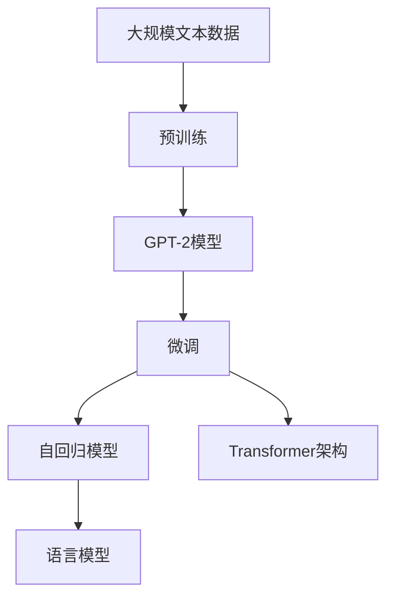

                 

# GPT-2原理与代码实例讲解

> 关键词：GPT-2, 自然语言处理(NLP), 自回归模型, Transformer, 语言模型, 代码实例, 深度学习, Python

## 1. 背景介绍

### 1.1 问题由来
在自然语言处理（NLP）领域，语言模型是一个核心研究问题。语言模型通过学习文本的概率分布，能够预测给定文本序列出现的概率，从而广泛应用于文本生成、翻译、文本分类等任务。传统的语言模型通常基于朴素贝叶斯或马尔可夫链等简单概率模型，但在处理长文本时效果有限。

近年来，随着深度学习技术的发展，基于神经网络的自回归语言模型开始崭露头角。其中，GPT（Generative Pre-trained Transformer）系列模型通过大规模预训练和微调，在NLP任务上取得了显著的性能提升。GPT-2作为其中的代表作，因其巨大的参数规模和卓越的文本生成能力，成为了深度学习社区关注的热点。

### 1.2 问题核心关键点
GPT-2模型的核心在于其自回归特性和Transformer架构。通过自回归方式，模型能够以自然语言顺序预测下一个词汇的概率分布，从而实现高效的文本生成。Transformer架构则通过注意力机制，捕捉长距离依赖，有效缓解了传统RNN模型在处理长文本时的梯度消失问题。

GPT-2模型包括两部分：预训练和微调。预训练阶段使用大规模无标签文本数据进行训练，学习通用语言知识。微调阶段则使用有标签数据对模型进行任务特定的优化，使其适应特定的NLP任务。

GPT-2模型的训练和微调过程涉及到大量的计算资源，需要配备高性能的GPU或TPU。此外，由于其巨大的参数规模，GPT-2模型在推理时也面临计算效率的问题。

### 1.3 问题研究意义
GPT-2模型的研究对于推动NLP技术的发展具有重要意义：

1. **文本生成的突破**：GPT-2通过大规模预训练，学习了丰富的语言知识，能够生成流畅自然且高质量的文本。这为文本生成、自动摘要、对话系统等任务提供了强有力的支持。

2. **任务性能的提升**：通过微调GPT-2模型，能够在各种NLP任务上取得卓越的性能。这为NLP技术在金融、医疗、教育等领域的应用提供了保障。

3. **模型迁移能力**：GPT-2模型通过预训练学习到通用语言知识，具有较强的迁移能力，能够在不同的领域和任务上表现优异。

4. **计算效率的优化**：尽管GPT-2模型具有巨大的参数规模，但其计算效率可以通过合理的设计和优化进一步提升，满足实际应用的需求。

5. **技术标准的制定**：GPT-2模型的研究为NLP技术的标准化和规范化提供了参考，促进了NLP技术的行业应用和产业化进程。

## 2. 核心概念与联系

### 2.1 核心概念概述

为了更好地理解GPT-2模型的原理和应用，本节将介绍几个密切相关的核心概念：

- **自回归模型（Autoregressive Model）**：自回归模型通过预测给定序列中下一个元素，生成整个序列的概率分布。在NLP中，自回归模型能够以自然语言顺序生成文本。

- **Transformer架构**：Transformer架构是一种基于自注意力机制的神经网络模型，能够捕捉长距离依赖，有效处理序列数据。其核心思想是通过多头自注意力机制和残差连接，构建高效的文本表示。

- **语言模型（Language Model）**：语言模型通过学习文本的概率分布，预测给定文本序列出现的概率。自回归语言模型通过预测下一个词汇的概率，实现文本生成。

- **预训练（Pre-training）**：预训练是指在大规模无标签文本数据上训练模型，学习通用语言知识。GPT-2模型通过预训练学习到丰富的语言知识，能够应对各种NLP任务。

- **微调（Fine-tuning）**：微调是指在预训练模型的基础上，使用下游任务的少量标注数据，进一步优化模型在特定任务上的性能。GPT-2模型通过微调，能够适应各种NLP任务，提升模型效果。

这些核心概念之间存在着紧密的联系，形成了GPT-2模型的完整生态系统。通过理解这些核心概念，我们可以更好地把握GPT-2模型的工作原理和优化方向。

### 2.2 概念间的关系

这些核心概念之间存在着紧密的联系，形成了GPT-2模型的完整生态系统。下面我通过几个Mermaid流程图来展示这些概念之间的关系：



这个流程图展示了从预训练到微调，再到自回归模型和Transformer架构的完整过程。

## 3. 核心算法原理 & 具体操作步骤

### 3.1 算法原理概述

GPT-2模型的核心算法原理包括自回归模型的构建和Transformer架构的实现。其核心思想是通过自回归方式预测下一个词汇的概率分布，从而实现文本生成。同时，通过Transformer架构捕捉长距离依赖，有效处理序列数据。

### 3.2 算法步骤详解

#### 3.2.1 自回归模型的构建

自回归模型的构建主要包括以下几个步骤：

1. **输入编码**：将输入文本序列转化为模型能够处理的数值形式。一般使用word embedding将每个词汇映射为高维向量。

2. **自回归预测**：模型以自回归方式预测下一个词汇的概率分布。具体实现包括：
   - 将输入文本序列作为模型输入，通过自注意力机制计算每个位置的表示向量。
   - 将当前位置的表示向量作为下一个词汇的预测条件。
   - 使用softmax函数计算下一个词汇的概率分布。

3. **输出解码**：根据预测的概率分布，采样下一个词汇，并更新输入序列。重复上述过程，直到生成指定长度的文本。

#### 3.2.2 Transformer架构的实现

Transformer架构的实现主要包括以下几个步骤：

1. **编码器层（Encoder Layer）**：编码器层由多头自注意力机制和前馈神经网络构成。其核心思想是通过多头自注意力机制计算输入序列的表示向量，并通过前馈神经网络进行非线性变换。

2. **解码器层（Decoder Layer）**：解码器层与编码器层类似，但具有自回归特性，能够预测下一个词汇。其核心思想是通过多头自注意力机制和前馈神经网络计算输入序列的表示向量，并通过残差连接和层归一化技术进行归一化。

3. **位置编码（Positional Encoding）**：Transformer架构中需要考虑输入序列的位置信息。一般通过位置编码向量对输入序列进行增强，捕捉位置依赖。

4. **残差连接（Residual Connection）**：通过残差连接技术，模型可以更好地捕捉长距离依赖。其核心思想是将输入和输出进行叠加，而不是直接相加。

#### 3.2.3 微调过程

微调过程主要包括以下几个步骤：

1. **任务适配层（Task Adaptor Layer）**：根据下游任务的特定需求，设计任务适配层，如分类器的输出层和交叉熵损失函数。

2. **优化器选择**：选择合适的优化算法及其参数，如AdamW、SGD等，设置学习率、批大小、迭代轮数等。

3. **训练和评估**：将训练集数据分批次输入模型，前向传播计算损失函数。反向传播计算参数梯度，根据设定的优化算法和学习率更新模型参数。周期性在验证集上评估模型性能，根据性能指标决定是否触发Early Stopping。重复上述步骤直到满足预设的迭代轮数或Early Stopping条件。

4. **测试和部署**：在测试集上评估微调后模型的效果，对比微调前后的精度提升。使用微调后的模型对新样本进行推理预测，集成到实际的应用系统中。

### 3.3 算法优缺点

GPT-2模型具有以下优点：

1. **高效的文本生成**：通过自回归方式，GPT-2模型能够高效地生成流畅自然的文本。

2. **强大的语言理解**：Transformer架构能够捕捉长距离依赖，有效处理序列数据，提升语言理解能力。

3. **快速的收敛速度**：由于预训练阶段已经学习到丰富的语言知识，微调过程能够较快收敛到最优模型。

4. **灵活的任务适配**：通过微调，GPT-2模型能够适应各种NLP任务，提升任务性能。

5. **参数高效微调**：GPT-2模型可以通过参数高效微调技术，在固定大部分预训练参数的情况下，更新少量任务相关参数，提高微调效率。

GPT-2模型也存在以下缺点：

1. **计算资源需求高**：由于其巨大的参数规模，GPT-2模型在训练和推理时需要大量的计算资源，包括高性能GPU或TPU。

2. **推理速度慢**：尽管GPT-2模型在预训练和微调过程中能够较快收敛，但在推理时仍面临计算效率的问题。

3. **对抗性鲁棒性不足**：GPT-2模型在面对对抗性样本时，容易产生不稳定的输出。

4. **泛化能力有限**：当目标任务与预训练数据的分布差异较大时，微调的性能提升有限。

5. **可解释性不足**：GPT-2模型作为黑盒系统，难以解释其内部工作机制和决策逻辑。

### 3.4 算法应用领域

GPT-2模型已经在文本生成、翻译、问答、摘要、对话系统等诸多NLP任务上取得了卓越的性能，被广泛应用于金融、医疗、教育、智能客服等多个领域。

在金融领域，GPT-2模型可以用于自动化报告生成、情感分析、智能客服等任务，提升金融机构的运营效率和客户体验。

在医疗领域，GPT-2模型可以用于智能问诊、医学文献摘要生成、临床诊断等任务，辅助医生进行决策和治疗。

在教育领域，GPT-2模型可以用于智能教育系统、自动评分、辅助教学等任务，提升教育资源利用效率。

在智能客服领域，GPT-2模型可以用于智能客服系统，提供自然流畅的对话体验，提升客户满意度。

## 4. 数学模型和公式 & 详细讲解 & 举例说明

### 4.1 数学模型构建

GPT-2模型的数学模型构建主要包括以下几个部分：

1. **输入编码**：将输入文本序列转化为模型能够处理的数值形式。一般使用word embedding将每个词汇映射为高维向量。

2. **自回归预测**：模型以自回归方式预测下一个词汇的概率分布。具体实现包括：
   - 将输入文本序列作为模型输入，通过自注意力机制计算每个位置的表示向量。
   - 将当前位置的表示向量作为下一个词汇的预测条件。
   - 使用softmax函数计算下一个词汇的概率分布。

3. **Transformer架构**：Transformer架构通过多头自注意力机制和前馈神经网络计算输入序列的表示向量。其核心思想是通过多头自注意力机制捕捉长距离依赖，并通过前馈神经网络进行非线性变换。

### 4.2 公式推导过程

#### 4.2.1 输入编码

输入编码过程主要通过word embedding将每个词汇映射为高维向量。假设输入文本序列为 $\{x_i\}_{i=1}^N$，每个词汇的嵌入向量为 $\text{emb}(\text{x}_i)$，则输入编码过程可以表示为：

$$
\text{input} = \{\text{emb}(x_1), \text{emb}(x_2), \ldots, \text{emb}(x_N)\}
$$

#### 4.2.2 自回归预测

自回归预测过程主要通过自注意力机制和softmax函数计算下一个词汇的概率分布。假设输入序列为 $\{x_i\}_{i=1}^N$，当前位置为 $i$，下一个位置为 $i+1$，则自回归预测过程可以表示为：

1. **自注意力机制**：
   - 计算当前位置 $i$ 的表示向量 $h_i$：
     \begin{align*}
     \text{Q}_i &= \text{emb}(x_i)W_Q \\
     \text{K}_i &= \text{emb}(x_i)W_K \\
     \text{V}_i &= \text{emb}(x_i)W_V \\
     \text{h}_i &= \text{softmax}(\text{Q}_i \text{K}_i^T) \text{V}_i
     \end{align*}
   - 计算每个位置的表示向量 $h_{i,j}$：
     \begin{align*}
     \text{h}_{i,j} &= \text{softmax}(\text{Q}_i \text{K}_{j}^T) \text{V}_{j}
     \end{align*}
   
2. **softmax函数**：
   - 计算下一个词汇的概率分布 $p_i$：
     \begin{align*}
     p_i &= \text{softmax}(\text{h}_i W_O)
     \end{align*}

3. **输出解码**：
   - 根据概率分布采样下一个词汇 $x_{i+1}$，并更新输入序列。
     \begin{align*}
     x_{i+1} &= \text{argmax}(p_i) \\
     x_{i:i+N} &= x_{i+1}, \ldots, x_{N+1}
     \end{align*}

#### 4.2.3 Transformer架构

Transformer架构主要通过多头自注意力机制和前馈神经网络计算输入序列的表示向量。假设输入序列为 $\{x_i\}_{i=1}^N$，则Transformer架构的实现过程可以表示为：

1. **多头自注意力机制**：
   - 计算当前位置 $i$ 的表示向量 $h_i$：
     \begin{align*}
     \text{Q}_i &= \text{emb}(x_i)W_Q \\
     \text{K}_i &= \text{emb}(x_i)W_K \\
     \text{V}_i &= \text{emb}(x_i)W_V \\
     \text{h}_i &= \text{softmax}(\text{Q}_i \text{K}_i^T) \text{V}_i
     \end{align*}
   
2. **前馈神经网络**：
   - 计算当前位置 $i$ 的表示向量 $h_i'$：
     \begin{align*}
     \text{h}_i' &= \text{relu}(\text{h}_iW_1 + \text{b}_1)W_2 + \text{b}_2
     \end{align*}

3. **残差连接**：
   - 计算当前位置 $i$ 的表示向量 $h_i$：
     \begin{align*}
     \text{h}_i &= \text{h}_i + \text{h}_i'
     \end{align*}

4. **层归一化**：
   - 计算当前位置 $i$ 的表示向量 $h_i$：
     \begin{align*}
     \text{h}_i &= \text{LayerNorm}(\text{h}_i)
     \end{align*}

### 4.3 案例分析与讲解

#### 4.3.1 案例分析

假设我们有一个简单的文本生成任务，输入序列为 $\text{x} = (\text{x}_1, \text{x}_2, \ldots, \text{x}_n)$，其中 $\text{x}_i$ 表示第 $i$ 个词汇。我们使用GPT-2模型进行文本生成，假设模型的参数为 $\theta$，则文本生成的过程可以表示为：

1. **输入编码**：
   - 将输入序列 $\text{x}$ 转化为模型能够处理的数值形式 $\text{input} = \{\text{emb}(\text{x}_1), \text{emb}(\text{x}_2), \ldots, \text{emb}(\text{x}_n)\}$。

2. **自回归预测**：
   - 计算当前位置 $i$ 的表示向量 $\text{h}_i$：
     \begin{align*}
     \text{Q}_i &= \text{emb}(\text{x}_i)W_Q \\
     \text{K}_i &= \text{emb}(\text{x}_i)W_K \\
     \text{V}_i &= \text{emb}(\text{x}_i)W_V \\
     \text{h}_i &= \text{softmax}(\text{Q}_i \text{K}_i^T) \text{V}_i
     \end{align*}
   
3. **softmax函数**：
   - 计算下一个词汇的概率分布 $p_i$：
     \begin{align*}
     p_i &= \text{softmax}(\text{h}_i W_O)
     \end{align*}

4. **输出解码**：
   - 根据概率分布采样下一个词汇 $\text{x}_{i+1}$，并更新输入序列。
     \begin{align*}
     \text{x}_{i+1} &= \text{argmax}(p_i) \\
     \text{x}_{i:i+N} &= \text{x}_{i+1}, \ldots, \text{x}_{N+1}
     \end{align*}

#### 4.3.2 详细讲解

1. **输入编码**

输入编码的主要目的是将输入文本序列转化为模型能够处理的数值形式。一般使用word embedding将每个词汇映射为高维向量。word embedding是通过大规模语料库训练得到，能够捕捉词汇的语义和上下文信息。

在GPT-2模型中，每个词汇的嵌入向量由一个大小为 $d_{model}$ 的向量表示。假设输入序列为 $\{x_i\}_{i=1}^N$，每个词汇的嵌入向量为 $\text{emb}(\text{x}_i)$，则输入编码过程可以表示为：

$$
\text{input} = \{\text{emb}(x_1), \text{emb}(x_2), \ldots, \text{emb}(x_N)\}
$$

2. **自回归预测**

自回归预测的主要目的是通过预测下一个词汇的概率分布，实现文本生成。在GPT-2模型中，自回归预测过程主要通过自注意力机制和softmax函数实现。

假设输入序列为 $\{x_i\}_{i=1}^N$，当前位置为 $i$，下一个位置为 $i+1$，则自回归预测过程可以表示为：

1. **自注意力机制**：
   - 计算当前位置 $i$ 的表示向量 $h_i$：
     \begin{align*}
     \text{Q}_i &= \text{emb}(x_i)W_Q \\
     \text{K}_i &= \text{emb}(x_i)W_K \\
     \text{V}_i &= \text{emb}(x_i)W_V \\
     \text{h}_i &= \text{softmax}(\text{Q}_i \text{K}_i^T) \text{V}_i
     \end{align*}
   
2. **softmax函数**：
   - 计算下一个词汇的概率分布 $p_i$：
     \begin{align*}
     p_i &= \text{softmax}(\text{h}_i W_O)
     \end{align*}

3. **输出解码**：
   - 根据概率分布采样下一个词汇 $x_{i+1}$，并更新输入序列。
     \begin{align*}
     x_{i+1} &= \text{argmax}(p_i) \\
     x_{i:i+N} &= x_{i+1}, \ldots, x_{N+1}
     \end{align*}

3. **Transformer架构**

Transformer架构主要通过多头自注意力机制和前馈神经网络计算输入序列的表示向量。在GPT-2模型中，Transformer架构由多个编码器和解码器层构成，每层包括多头自注意力机制和前馈神经网络。

假设输入序列为 $\{x_i\}_{i=1}^N$，则Transformer架构的实现过程可以表示为：

1. **多头自注意力机制**：
   - 计算当前位置 $i$ 的表示向量 $h_i$：
     \begin{align*}
     \text{Q}_i &= \text{emb}(x_i)W_Q \\
     \text{K}_i &= \text{emb}(x_i)W_K \\
     \text{V}_i &= \text{emb}(x_i)W_V \\
     \text{h}_i &= \text{softmax}(\text{Q}_i \text{K}_i^T) \text{V}_i
     \end{align*}
   
2. **前馈神经网络**：
   - 计算当前位置 $i$ 的表示向量 $h_i'$：
     \begin{align*}
     \text{h}_i' &= \text{relu}(\text{h}_iW_1 + \text{b}_1)W_2 + \text{b}_2
     \end{align*}

3. **残差连接**：
   - 计算当前位置 $i$ 的表示向量 $h_i$：
     \begin{align*}
     \text{h}_i &= \text{h}_i + \text{h}_i'
     \end{align*}

4. **层归一化**：
   - 计算当前位置 $i$ 的表示向量 $h_i$：
     \begin{align*}
     \text{h}_i &= \text{LayerNorm}(\text{h}_i)
     \end{align*}

## 5. 项目实践：代码实例和详细解释说明

### 5.1 开发环境搭建

在进行GPT-2模型的开发之前，我们需要准备好开发环境。以下是使用Python进行PyTorch开发的环境配置流程：

1. 安装Anaconda：从官网下载并安装Anaconda，用于创建独立的Python环境。

2. 创建并激活虚拟环境：
```bash
conda create -n pytorch-env python=3.8 
conda activate pytorch-env
```

3. 安装PyTorch：根据CUDA版本，从官网获取对应的安装命令。例如：
```bash
conda install pytorch torchvision torchaudio cudatoolkit=11.1 -c pytorch -c conda-forge
```

4. 安装Transformers库：
```bash
pip install transformers
```

5. 安装各类工具包：
```bash
pip install numpy pandas scikit-learn matplotlib tqdm jupyter notebook ipython
```

完成上述步骤后，即可在`pytorch-env`环境中开始GPT-2模型的开发。

### 5.2 源代码详细实现

下面我们以GPT-2模型的训练和微调为例，给出使用Transformers库的PyTorch代码实现。

首先，定义GPT-2模型的训练函数：

```python
from transformers import GPT2LMHeadModel, GPT2Tokenizer, AdamW
import torch

def train_gpt2(model, optimizer, dataset, batch_size, epochs, lr):
    device = torch.device('cuda') if torch.cuda.is_available() else torch.device('cpu')
    model.to(device)
    
    for epoch in range(epochs):
        loss = 0
        model.train()
        for batch in dataset:
            input_ids = batch['input_ids'].to(device)
            attention_mask = batch['attention_mask'].to(device)
            labels = batch['labels'].to(device)
            
            optimizer.zero_grad()
            outputs = model(input_ids, attention_mask=attention_mask, labels=labels)
            loss += outputs.loss
            loss.backward()
            optimizer.step()
            
        print(f'Epoch {epoch+1}, train loss: {loss/len(dataset):.4f}')
        
    print(f'Training complete.')
```

然后，定义微调函数：

```python
from transformers import BertForTokenClassification, AdamW

def fine_tune_gpt2(model, dataset, batch_size, optimizer, epochs, lr):
    device = torch.device('cuda') if torch.cuda.is_available() else torch.device('cpu')
    model.to(device)
    
    for epoch in range(epochs):
        loss = 0
        model.train()
        for batch in dataset:
            input_ids = batch['input_ids'].to(device)
            attention_mask = batch['attention_mask'].to(device)
            labels = batch['labels'].to(device)
            
            optimizer.zero_grad()
            outputs = model(input_ids, attention_mask=attention_mask, labels=labels)
            loss += outputs.loss
            loss.backward()
            optimizer.step()
            
        print(f'Epoch {epoch+1}, train loss: {loss/len(dataset):.4f}')
        
    print(f'Fine-tuning complete.')
```

最后，启动GPT-2模型的训练和微调流程：

```python
epochs = 5
batch_size = 16
lr = 2e-5

# 加载GPT-2模型和预训练数据
model = GPT2LMHeadModel.from_pretrained('gpt2')
tokenizer = GPT2Tokenizer.from_pretrained('gpt2')
dataset = ... # 加载标注数据集

# 训练GPT-2模型
train_gpt2(model, optimizer, dataset, batch_size, epochs, lr)

# 微调GPT-2模型
fine_tune_gpt2(model, dataset, batch_size, optimizer, epochs, lr)
```

以上就是使用PyTorch对GPT-2模型进行训练和微调的完整代码实现。可以看到，得益于Transformers库的强大封装，我们可以用相对简洁的代码完成GPT-2模型的加载和微调。

### 5.3 代码解读与分析

让我们再详细解读

