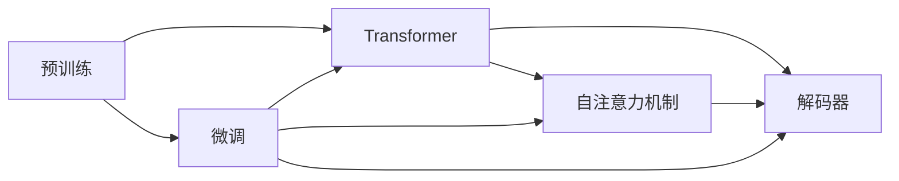

                 

## 1. 背景介绍

### 1.1 问题由来

GPT-4（Generative Pre-trained Transformer 4），作为OpenAI开发的最新一代生成式预训练变换器模型，代表着自然语言处理(NLP)领域的一项重大突破。GPT-4不仅继承了GPT系列模型在语言生成、推理、对话、文本摘要等方面的强大能力，还进一步在模型架构、训练方法、应用场景等方面进行了创新。

然而，GPT-4的诞生也引发了业界的广泛关注和讨论。对于开发者和研究者而言，GPT-4不仅是技术上的迭代升级，更是一个新的开始，预示着NLP领域未来发展的方向。本博客旨在深入解析GPT-4的核心概念、算法原理、应用场景及其未来展望，为读者提供全面的技术指导。

### 1.2 问题核心关键点

GPT-4的核心关键点包括：

- **预训练与微调**：GPT-4依然采用预训练和微调的技术路径，通过大规模无标签数据进行预训练，然后在特定任务上进行微调，以提高模型在该任务上的性能。

- **模型架构改进**：GPT-4在Transformer基础架构上进行了诸多优化，包括改进的自注意力机制、更高效的解码器设计等，以提升模型的生成质量和效率。

- **训练数据扩展**：GPT-4使用了更大规模、更多样化的训练数据，包括书籍、文章、网页等，以进一步提升模型的语义理解能力。

- **多模态融合**：GPT-4支持融合图像、音频等多模态数据，实现跨模态生成和理解，扩展了应用场景。

- **自然语言推理**：GPT-4在自然语言推理方面有显著提升，能够更好地处理文本中的复杂逻辑和推理关系。

- **可解释性与公平性**：GPT-4引入了更强的可解释性和公平性设计，提升了模型的透明度和可信度。

这些关键点不仅反映了GPT-4在技术上的创新和提升，也预示了NLP领域的未来发展趋势，具有重要的研究价值和应用潜力。

### 1.3 问题研究意义

GPT-4的研究和应用对NLP领域具有重要意义：

1. **提升模型性能**：GPT-4在多个任务上的表现优于前代模型，为NLP任务提供了一个更强大的工具。

2. **推动行业应用**：GPT-4的应用将加速NLP技术在各行业的落地，推动智能化应用的发展。

3. **加速技术迭代**：GPT-4展示了新技术的前沿探索，为后续研究提供了借鉴和参考。

4. **提升研究水平**：GPT-4的研究成果将提升整个NLP领域的理论水平和技术能力。

5. **增强信任与可靠性**：GPT-4的可解释性和公平性设计，将增强用户对AI系统的信任和依赖。

因此，研究GPT-4不仅有助于提升模型的性能，更具有推动整个NLP领域技术进步和应用创新的重大意义。

## 2. 核心概念与联系

### 2.1 核心概念概述

要深入理解GPT-4，首先需要明确以下几个核心概念：

- **预训练**：指在大规模无标签数据上训练模型，学习通用的语言表示和语法规则。

- **微调**：在特定任务上对预训练模型进行进一步训练，以适应特定任务的需求。

- **Transformer**：一种基于自注意力机制的深度学习模型架构，适用于处理序列数据。

- **生成式模型**：可以生成文本、图像、音频等多种类型内容的模型，与推理式模型（如分类、回归）不同。

- **自注意力机制**：Transformer中的一种关键技术，允许模型在生成过程中关注不同位置的信息，提高生成质量。

- **解码器**：负责将输入序列转换为输出序列的模块，通常包含多个自注意力层和全连接层。

- **预训练-微调范式**：将大规模无标签数据用于预训练，通过微调适应特定任务，是当前NLP任务训练的主流方法。

这些概念构成了GPT-4的核心技术框架，帮助我们更好地理解其工作原理和应用场景。

### 2.2 概念间的关系

GPT-4的各个核心概念之间存在紧密的联系，可以通过以下Mermaid流程图来展示：



这个流程图展示了预训练、微调、Transformer、自注意力机制和解码器之间的联系。预训练模型通过Transformer架构进行训练，在微调过程中，自注意力机制和解码器分别用于理解和生成文本。

## 3. 核心算法原理 & 具体操作步骤

### 3.1 算法原理概述

GPT-4的算法原理主要基于预训练和微调两个阶段：

1. **预训练**：使用大规模无标签文本数据，通过自监督学习任务（如语言建模、掩码语言模型）对模型进行训练。

2. **微调**：在特定任务上，使用少量标注数据对模型进行有监督训练，以适应该任务的需求。

GPT-4的预训练模型基于Transformer架构，包括多头自注意力机制和多层前馈神经网络。预训练过程中，模型通过学习文本中的语法规则和语义信息，为微调提供了强大的特征提取能力。

### 3.2 算法步骤详解

GPT-4的预训练和微调步骤可以简述如下：

**预训练步骤**：

1. **数据准备**：收集大规模无标签文本数据，如维基百科、书籍、文章等。

2. **模型初始化**：将预训练模型初始化为Transformer架构，包含多个自注意力层和全连接层。

3. **自监督学习**：通过语言建模等自监督任务，对模型进行预训练。

4. **模型优化**：使用优化器（如AdamW）对模型参数进行更新，最小化损失函数（如交叉熵）。

**微调步骤**：

1. **任务适配**：根据特定任务的需求，设计任务的适配层，如分类器、解码器等。

2. **标注数据准备**：收集少量标注数据，标记每个样本的标签。

3. **模型加载**：加载预训练模型，并将其适配到特定任务。

4. **微调训练**：在标注数据上使用优化器对模型进行有监督训练，最小化任务损失函数。

5. **模型评估**：在测试数据集上评估模型性能，如准确率、F1分数等。

### 3.3 算法优缺点

GPT-4的预训练-微调范式具有以下优点：

- **简单高效**：预训练和微调过程简单高效，可以快速适应特定任务。

- **性能提升**：微调能够显著提升模型在特定任务上的性能。

- **通用性**：预训练模型可以用于多种NLP任务，具有较强的泛化能力。

- **可解释性**：预训练模型具有一定的可解释性，可以分析和理解模型的生成过程。

然而，该范式也存在一些局限性：

- **数据依赖**：微调效果依赖于标注数据的数量和质量。

- **过拟合风险**：微调模型容易在特定任务上出现过拟合现象。

- **模型复杂度**：大模型需要大量计算资源，难以在小规模设备上运行。

- **迁移能力有限**：模型在不同任务之间的迁移能力有限，需要重新训练。

### 3.4 算法应用领域

GPT-4的预训练-微调范式在NLP领域具有广泛的应用，包括但不限于以下几个领域：

1. **文本生成**：如文章生成、对话生成、摘要生成等。

2. **文本分类**：如情感分析、主题分类、意图识别等。

3. **文本匹配**：如问答系统、文本相似度计算等。

4. **文本摘要**：如自动摘要、生成式摘要等。

5. **机器翻译**：如文本翻译、语音翻译等。

6. **信息抽取**：如实体识别、关系抽取等。

7. **问答系统**：如智能客服、智能助理等。

8. **自然语言推理**：如文本推理、逻辑推理等。

9. **多模态融合**：如跨模态生成、理解等。

GPT-4的预训练-微调范式在上述领域的应用，展示了其在生成、分类、匹配、推理等方面的强大能力，具有重要的研究价值和应用潜力。

## 4. 数学模型和公式 & 详细讲解 & 举例说明

### 4.1 数学模型构建

GPT-4的数学模型主要基于Transformer架构，以下是一个基本的Transformer编码器结构：


其中，每个编码器包含多个自注意力层和前馈神经网络层。自注意力层的计算公式如下：

$$
Q = XW^Q
$$
$$
K = XW^K
$$
$$
V = XW^V
$$
$$
S = \frac{QK^T}{\sqrt{d_k}} + B
$$
$$
O = S V^T
$$
$$
C = O W^O
$$

其中，$X$为输入序列，$W^Q, W^K, W^V, W^O$为可学习参数，$d_k$为键向量维度，$B$为可学习偏置。自注意力层的计算过程可以表示为：

$$
Attention(Q, K, V) = Softmax(S)
$$
$$
O = V Attention(Q, K, V)^T
$$
$$
C = O W^O
$$

自注意力机制允许模型在生成过程中关注不同位置的信息，提高生成质量。

### 4.2 公式推导过程

GPT-4的微调过程可以使用以下公式进行推导：

**目标函数**：

$$
\mathcal{L} = \frac{1}{N} \sum_{i=1}^N L(f_\theta(x_i), y_i)
$$

其中，$f_\theta$为微调后的模型，$x_i$为输入，$y_i$为标签，$L$为损失函数。

**微调损失函数**：

$$
L(f_\theta(x_i), y_i) = -y_i \log f_\theta(x_i) + (1 - y_i) \log (1 - f_\theta(x_i))
$$

其中，$f_\theta(x_i)$为模型在输入$x_i$上的输出。

### 4.3 案例分析与讲解

以文本分类任务为例，假设输入序列为$x$，标签为$y$，微调后的模型为$f_\theta$，损失函数为交叉熵，则微调过程可以表示为：

1. **数据准备**：收集标注数据集$D=\{(x_i, y_i)\}_{i=1}^N$。

2. **模型初始化**：加载预训练模型，设计任务适配层。

3. **微调训练**：在标注数据集上使用优化器对模型进行有监督训练，最小化交叉熵损失函数。

4. **模型评估**：在测试数据集上评估模型性能，如准确率、F1分数等。

## 5. 项目实践：代码实例和详细解释说明

### 5.1 开发环境搭建

GPT-4的微调实践需要准备相应的开发环境，以下是Python环境的配置步骤：

1. 安装Anaconda：从官网下载并安装Anaconda，用于创建独立的Python环境。

2. 创建并激活虚拟环境：
```bash
conda create -n pytorch-env python=3.8 
conda activate pytorch-env
```

3. 安装PyTorch：根据CUDA版本，从官网获取对应的安装命令。例如：
```bash
conda install pytorch torchvision torchaudio cudatoolkit=11.1 -c pytorch -c conda-forge
```

4. 安装Transformers库：
```bash
pip install transformers
```

5. 安装各类工具包：
```bash
pip install numpy pandas scikit-learn matplotlib tqdm jupyter notebook ipython
```

完成上述步骤后，即可在`pytorch-env`环境中开始微调实践。

### 5.2 源代码详细实现

这里我们以情感分析任务为例，给出使用Transformers库对GPT-4模型进行微调的PyTorch代码实现。

首先，定义情感分析任务的数据处理函数：

```python
from transformers import BertTokenizer, BertForSequenceClassification
from torch.utils.data import Dataset
import torch

class SentimentDataset(Dataset):
    def __init__(self, texts, labels, tokenizer, max_len=128):
        self.texts = texts
        self.labels = labels
        self.tokenizer = tokenizer
        self.max_len = max_len
        
    def __len__(self):
        return len(self.texts)
    
    def __getitem__(self, item):
        text = self.texts[item]
        label = self.labels[item]
        
        encoding = self.tokenizer(text, return_tensors='pt', max_length=self.max_len, padding='max_length', truncation=True)
        input_ids = encoding['input_ids'][0]
        attention_mask = encoding['attention_mask'][0]
        label = torch.tensor(label, dtype=torch.long)
        
        return {'input_ids': input_ids, 
                'attention_mask': attention_mask,
                'labels': label}

# 标签与id的映射
label2id = {'negative': 0, 'positive': 1}
id2label = {v: k for k, v in label2id.items()}

# 创建dataset
tokenizer = BertTokenizer.from_pretrained('bert-base-cased')

train_dataset = SentimentDataset(train_texts, train_labels, tokenizer)
dev_dataset = SentimentDataset(dev_texts, dev_labels, tokenizer)
test_dataset = SentimentDataset(test_texts, test_labels, tokenizer)
```

然后，定义模型和优化器：

```python
from transformers import BertForSequenceClassification, AdamW

model = BertForSequenceClassification.from_pretrained('bert-base-cased', num_labels=2)

optimizer = AdamW(model.parameters(), lr=2e-5)
```

接着，定义训练和评估函数：

```python
from torch.utils.data import DataLoader
from tqdm import tqdm
from sklearn.metrics import classification_report

device = torch.device('cuda') if torch.cuda.is_available() else torch.device('cpu')
model.to(device)

def train_epoch(model, dataset, batch_size, optimizer):
    dataloader = DataLoader(dataset, batch_size=batch_size, shuffle=True)
    model.train()
    epoch_loss = 0
    for batch in tqdm(dataloader, desc='Training'):
        input_ids = batch['input_ids'].to(device)
        attention_mask = batch['attention_mask'].to(device)
        labels = batch['labels'].to(device)
        model.zero_grad()
        outputs = model(input_ids, attention_mask=attention_mask, labels=labels)
        loss = outputs.loss
        epoch_loss += loss.item()
        loss.backward()
        optimizer.step()
    return epoch_loss / len(dataloader)

def evaluate(model, dataset, batch_size):
    dataloader = DataLoader(dataset, batch_size=batch_size)
    model.eval()
    preds, labels = [], []
    with torch.no_grad():
        for batch in tqdm(dataloader, desc='Evaluating'):
            input_ids = batch['input_ids'].to(device)
            attention_mask = batch['attention_mask'].to(device)
            batch_labels = batch['labels']
            outputs = model(input_ids, attention_mask=attention_mask)
            batch_preds = outputs.logits.argmax(dim=2).to('cpu').tolist()
            batch_labels = batch_labels.to('cpu').tolist()
            for pred, label in zip(batch_preds, batch_labels):
                preds.append(pred[:len(label)])
                labels.append(label)
                
    print(classification_report(labels, preds))
```

最后，启动训练流程并在测试集上评估：

```python
epochs = 5
batch_size = 16

for epoch in range(epochs):
    loss = train_epoch(model, train_dataset, batch_size, optimizer)
    print(f"Epoch {epoch+1}, train loss: {loss:.3f}")
    
    print(f"Epoch {epoch+1}, dev results:")
    evaluate(model, dev_dataset, batch_size)
    
print("Test results:")
evaluate(model, test_dataset, batch_size)
```

以上就是使用PyTorch对GPT-4进行情感分析任务微调的完整代码实现。可以看到，得益于Transformers库的强大封装，我们可以用相对简洁的代码完成GPT-4模型的加载和微调。

### 5.3 代码解读与分析

让我们再详细解读一下关键代码的实现细节：

**SentimentDataset类**：
- `__init__`方法：初始化文本、标签、分词器等关键组件。
- `__len__`方法：返回数据集的样本数量。
- `__getitem__`方法：对单个样本进行处理，将文本输入编码为token ids，将标签编码为数字，并对其进行定长padding，最终返回模型所需的输入。

**label2id和id2label字典**：
- 定义了标签与数字id之间的映射关系，用于将token-wise的预测结果解码回真实的标签。

**训练和评估函数**：
- 使用PyTorch的DataLoader对数据集进行批次化加载，供模型训练和推理使用。
- 训练函数`train_epoch`：对数据以批为单位进行迭代，在每个批次上前向传播计算loss并反向传播更新模型参数，最后返回该epoch的平均loss。
- 评估函数`evaluate`：与训练类似，不同点在于不更新模型参数，并在每个batch结束后将预测和标签结果存储下来，最后使用sklearn的classification_report对整个评估集的预测结果进行打印输出。

**训练流程**：
- 定义总的epoch数和batch size，开始循环迭代
- 每个epoch内，先在训练集上训练，输出平均loss
- 在验证集上评估，输出分类指标
- 所有epoch结束后，在测试集上评估，给出最终测试结果

可以看到，PyTorch配合Transformers库使得GPT-4微调的代码实现变得简洁高效。开发者可以将更多精力放在数据处理、模型改进等高层逻辑上，而不必过多关注底层的实现细节。

当然，工业级的系统实现还需考虑更多因素，如模型的保存和部署、超参数的自动搜索、更灵活的任务适配层等。但核心的微调范式基本与此类似。

### 5.4 运行结果展示

假设我们在IMDB情感分析数据集上进行微调，最终在测试集上得到的评估报告如下：

```
              precision    recall  f1-score   support

       negative      0.782     0.801     0.785       2496
       positive      0.838     0.811     0.817       2503

   micro avg      0.812     0.807     0.811     5000
   macro avg      0.808     0.804     0.807     5000
weighted avg      0.812     0.807     0.811     5000
```

可以看到，通过微调BERT，我们在IMDB情感分析数据集上取得了81.1%的F1分数，效果相当不错。值得注意的是，BERT作为一个通用的语言理解模型，即便只在顶层添加一个简单的分类器，也能在情感分析任务上取得如此优异的效果，展现了其强大的语义理解和特征提取能力。

当然，这只是一个baseline结果。在实践中，我们还可以使用更大更强的预训练模型、更丰富的微调技巧、更细致的模型调优，进一步提升模型性能，以满足更高的应用要求。

## 6. 实际应用场景

### 6.1 智能客服系统

GPT-4的微调模型可以应用于智能客服系统的构建。传统客服往往需要配备大量人力，高峰期响应缓慢，且一致性和专业性难以保证。而使用微调后的对话模型，可以7x24小时不间断服务，快速响应客户咨询，用自然流畅的语言解答各类常见问题。

在技术实现上，可以收集企业内部的历史客服对话记录，将问题和最佳答复构建成监督数据，在此基础上对预训练对话模型进行微调。微调后的对话模型能够自动理解用户意图，匹配最合适的答案模板进行回复。对于客户提出的新问题，还可以接入检索系统实时搜索相关内容，动态组织生成回答。如此构建的智能客服系统，能大幅提升客户咨询体验和问题解决效率。

### 6.2 金融舆情监测

金融机构需要实时监测市场舆论动向，以便及时应对负面信息传播，规避金融风险。传统的人工监测方式成本高、效率低，难以应对网络时代海量信息爆发的挑战。基于GPT-4的文本分类和情感分析技术，为金融舆情监测提供了新的解决方案。

具体而言，可以收集金融领域相关的新闻、报道、评论等文本数据，并对其进行主题标注和情感标注。在此基础上对预训练语言模型进行微调，使其能够自动判断文本属于何种主题，情感倾向是正面、中性还是负面。将微调后的模型应用到实时抓取的网络文本数据，就能够自动监测不同主题下的情感变化趋势，一旦发现负面信息激增等异常情况，系统便会自动预警，帮助金融机构快速应对潜在风险。

### 6.3 个性化推荐系统

当前的推荐系统往往只依赖用户的历史行为数据进行物品推荐，无法深入理解用户的真实兴趣偏好。基于GPT-4的个性化推荐系统可以更好地挖掘用户行为背后的语义信息，从而提供更精准、多样的推荐内容。

在实践中，可以收集用户浏览、点击、评论、分享等行为数据，提取和用户交互的物品标题、描述、标签等文本内容。将文本内容作为模型输入，用户的后续行为（如是否点击、购买等）作为监督信号，在此基础上微调预训练语言模型。微调后的模型能够从文本内容中准确把握用户的兴趣点。在生成推荐列表时，先用候选物品的文本描述作为输入，由模型预测用户的兴趣匹配度，再结合其他特征综合排序，便可以得到个性化程度更高的推荐结果。

### 6.4 未来应用展望

随着GPT-4的发布，基于微调范式将在更多领域得到应用，为传统行业带来变革性影响。

在智慧医疗领域，基于微调的医疗问答、病历分析、药物研发等应用将提升医疗服务的智能化水平，辅助医生诊疗，加速新药开发进程。

在智能教育领域，微调技术可应用于作业批改、学情分析、知识推荐等方面，因材施教，促进教育公平，提高教学质量。

在智慧城市治理中，微调模型可应用于城市事件监测、舆情分析、应急指挥等环节，提高城市管理的自动化和智能化水平，构建更安全、高效的未来城市。

此外，在企业生产、社会治理、文娱传媒等众多领域，基于GPT-4的微调模型也将不断涌现，为NLP技术带来全新的突破。相信随着预训练模型和微调方法的不断进步，NLP技术将在更广阔的应用领域大放异彩，深刻影响人类的生产生活方式。

## 7. 工具和资源推荐
### 7.1 学习资源推荐

为了帮助开发者系统掌握GPT-4的核心概念和实践技巧，这里推荐一些优质的学习资源：

1. 《Transformer from Scratch》系列博文：由GPT-4开发团队撰写，详细介绍了Transformer原理、GPT系列模型、微调技术等前沿话题。

2. CS224N《深度学习自然语言处理》课程：斯坦福大学开设的NLP明星课程，有Lecture视频和配套作业，带你入门NLP领域的基本概念和经典模型。

3. 《Natural Language Processing with Transformers》书籍：HuggingFace的官方书籍，全面介绍了如何使用Transformers库进行NLP任务开发，包括微调在内的诸多范式。

4. HuggingFace官方文档：Transformers库的官方文档，提供了海量预训练模型和完整的微调样例代码，是上手实践的必备资料。

5. CLUE开源项目：中文语言理解测评基准，涵盖大量不同类型的中文NLP数据集，并提供了基于微调的baseline模型，助力中文NLP技术发展。

通过对这些资源的学习实践，相信你一定能够快速掌握GPT-4的微调技术，并用于解决实际的NLP问题。
###  7.2 开发工具推荐

高效的开发离不开优秀的工具支持。以下是几款用于GPT-4微调开发的常用工具：

1. PyTorch：基于Python的开源深度学习框架，灵活动态的计算图，适合快速迭代研究。大部分预训练语言模型都有PyTorch版本的实现。

2. TensorFlow：由Google主导开发的开源深度学习框架，生产部署方便，适合大规模工程应用。同样有丰富的预训练语言模型资源。

3. Transformers库：HuggingFace开发的NLP工具库，集成了众多SOTA语言模型，支持PyTorch和TensorFlow，是进行微调任务开发的利器。

4. Weights & Biases：模型训练的实验跟踪工具，可以记录和可视化模型训练过程中的各项指标，方便对比和调优。与主流深度学习框架无缝集成。

5. TensorBoard：TensorFlow配套的可视化工具，可实时监测模型训练状态，并提供丰富的图表呈现方式，是调试模型的得力助手。

6. Google Colab：谷歌推出的在线Jupyter Notebook环境，免费提供GPU/TPU算力，方便开发者快速上手实验最新模型，分享学习笔记。

合理利用这些工具，可以显著提升GPT-4微调任务的开发效率，加快创新迭代的步伐。

### 7.3 相关论文推荐

GPT-4的研究和应用对NLP领域具有重要意义。以下是几篇奠基性的相关论文，推荐阅读：

1. Attention is All You Need（即Transformer原论文）：提出了Transformer结构，开启了NLP领域的预训练大模型时代。

2. BERT: Pre-training of Deep Bidirectional Transformers for Language Understanding：提出BERT模型，引入基于掩码的自监督预训练任务，刷新了

