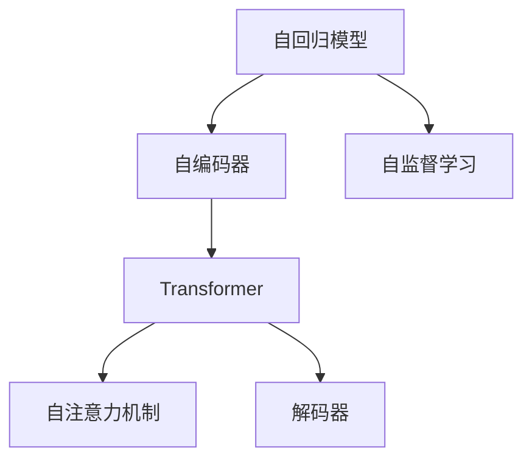
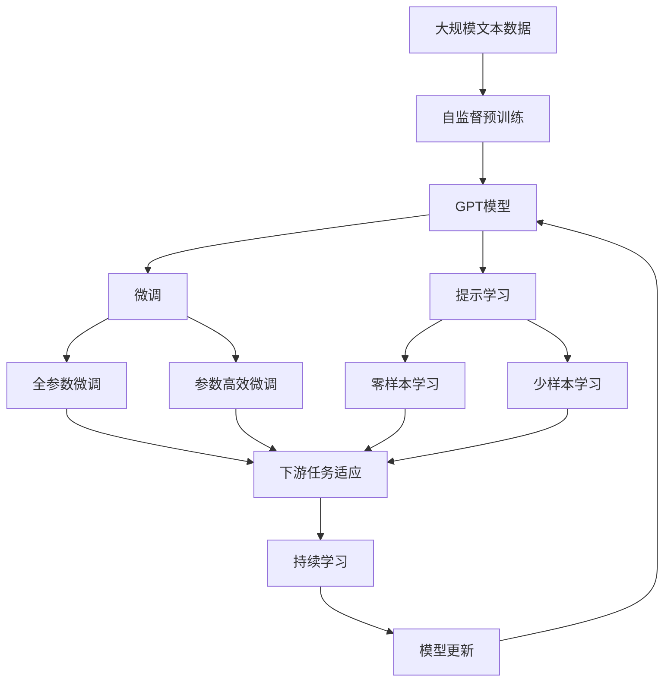

                 

# GPT原理与代码实例讲解

> 关键词：GPT-3, 自回归模型, 自编码器, 自监督学习, Transformer, 自注意力机制, 解码器, 注意力分布

## 1. 背景介绍

### 1.1 问题由来

自2018年OpenAI发布的GPT-1模型以来，生成式预训练语言模型（Generative Pre-trained Transformer, GPT）系列在自然语言处理（NLP）领域取得了显著的突破。GPT通过在大规模无标签文本数据上进行预训练，学习到通用的语言表示，具备强大的语言生成和理解能力。随着模型规模和预训练数据量的不断扩大，GPT家族不断演化，从GPT-1到GPT-2，再到GPT-3，性能有了质的飞跃。

GPT模型在各种文本生成任务上表现优异，如对话生成、文本摘要、文本补全等。通过微调，GPT模型可以在特定任务上取得更高的性能。本文将详细讲解GPT的原理，并通过代码实例展示如何训练和使用GPT-3模型。

### 1.2 问题核心关键点

GPT模型的核心在于其自回归结构和大规模预训练。自回归结构允许模型基于前面的文本生成后面的文本，而大规模预训练则通过无监督学习赋予模型丰富的语言知识。GPT通过自注意力机制和解码器架构，可以实现高效的文本生成。

在实践中，GPT模型可以通过微调应用于各种NLP任务，如问答、对话、摘要、翻译等。微调需要收集特定任务的少量标注数据，然后通过有监督学习优化模型在该任务上的性能。微调过程中，GPT模型通常使用较小的学习率，以避免破坏预训练权重。

## 2. 核心概念与联系

### 2.1 核心概念概述

为了更好地理解GPT模型的工作原理，本节将介绍几个密切相关的核心概念：

- **自回归模型**：自回归模型是一种递归模型，可以基于前面的数据生成后续的数据。GPT模型是一个自回归模型，可以基于前面的文本生成后面的文本。
- **自编码器**：自编码器是一种无监督学习方法，通过将数据压缩为低维表示，然后通过解码器还原数据。GPT模型中使用了自编码器的变体，即自注意力机制。
- **自监督学习**：自监督学习是一种无监督学习方法，通过利用数据的自身结构和统计性质进行训练。GPT模型在预训练过程中使用了大量的自监督学习任务，如掩码语言模型。
- **Transformer**：Transformer是一种基于自注意力机制的神经网络架构，可以并行计算，提高训练和推理速度。GPT模型使用了Transformer架构。
- **自注意力机制**：自注意力机制是Transformer的关键组件，通过计算输入序列中每个位置的注意力分布，实现高效的特征提取和序列建模。
- **解码器**：解码器是GPT模型中的核心组件，通过自注意力机制和前向神经网络，生成文本。

这些核心概念之间存在着紧密的联系，形成了GPT模型的完整架构。通过理解这些概念，我们可以更好地把握GPT模型的工作原理和优化方向。

### 2.2 概念间的关系

这些核心概念之间存在着紧密的联系，形成了GPT模型的完整架构。通过以下Mermaid流程图来展示这些概念之间的关系：



这个流程图展示了大语言模型的核心概念及其之间的关系：

1. 自回归模型允许模型基于前面的文本生成后面的文本。
2. 自编码器是一种无监督学习方法，通过将数据压缩为低维表示，然后通过解码器还原数据。
3. Transformer使用自注意力机制实现高效的特征提取和序列建模。
4. 解码器通过自注意力机制和前向神经网络，生成文本。

### 2.3 核心概念的整体架构

最后，我们用一个综合的流程图来展示这些核心概念在大语言模型微调过程中的整体架构：



这个综合流程图展示了大语言模型的核心概念在大语言模型微调过程中的整体架构：

1. 大语言模型通过自监督预训练获得基础能力。
2. 微调是对预训练模型进行任务特定的优化，可以分为全参数微调和参数高效微调。
3. 提示学习是一种不更新模型参数的方法，可以实现零样本和少样本学习。
4. 迁移学习是连接预训练模型与下游任务的桥梁，可以通过微调或提示学习来实现。
5. 持续学习旨在使模型能够不断学习新知识，同时避免遗忘旧知识。

这些概念共同构成了大语言模型的学习和应用框架，使其能够在各种场景下发挥强大的语言生成和理解能力。通过理解这些核心概念，我们可以更好地把握GPT模型的工作原理和优化方向。

## 3. 核心算法原理 & 具体操作步骤

### 3.1 算法原理概述

GPT模型是一种自回归生成模型，基于Transformer架构，使用了自注意力机制和解码器。GPT模型通过在大规模无标签文本数据上进行自监督预训练，学习到通用的语言表示。在微调过程中，通过有监督学习优化模型在特定任务上的性能。

GPT模型的核心思想是利用Transformer的并行计算能力，通过自注意力机制捕捉输入序列中每个位置的注意力分布，实现高效的特征提取和序列建模。解码器通过前向神经网络，根据注意力分布生成文本。

### 3.2 算法步骤详解

GPT模型的微调过程包括数据准备、模型初始化、模型训练、模型评估和模型部署等步骤。

**Step 1: 准备预训练模型和数据集**

1. 选择合适的预训练模型（如GPT-3）作为初始化参数。
2. 准备下游任务的少量标注数据集，划分为训练集、验证集和测试集。
3. 数据预处理，包括分词、编码等。

**Step 2: 添加任务适配层**

1. 根据任务类型，设计合适的输出层和损失函数。
2. 对于分类任务，通常在顶层添加线性分类器和交叉熵损失函数。
3. 对于生成任务，通常使用语言模型的解码器输出概率分布，并以负对数似然为损失函数。

**Step 3: 设置微调超参数**

1. 选择合适的优化算法及其参数，如AdamW、SGD等，设置学习率、批大小、迭代轮数等。
2. 设置正则化技术及强度，包括权重衰减、Dropout、Early Stopping等。
3. 确定冻结预训练参数的策略，如仅微调顶层，或全部参数都参与微调。

**Step 4: 执行梯度训练**

1. 将训练集数据分批次输入模型，前向传播计算损失函数。
2. 反向传播计算参数梯度，根据设定的优化算法和学习率更新模型参数。
3. 周期性在验证集上评估模型性能，根据性能指标决定是否触发 Early Stopping。
4. 重复上述步骤直到满足预设的迭代轮数或 Early Stopping 条件。

**Step 5: 测试和部署**

1. 在测试集上评估微调后模型性能，对比微调前后的精度提升。
2. 使用微调后的模型对新样本进行推理预测，集成到实际的应用系统中。
3. 持续收集新的数据，定期重新微调模型，以适应数据分布的变化。

以上是GPT模型微调的一般流程。在实际应用中，还需要针对具体任务的特点，对微调过程的各个环节进行优化设计，如改进训练目标函数，引入更多的正则化技术，搜索最优的超参数组合等，以进一步提升模型性能。

### 3.3 算法优缺点

GPT模型的微调方法具有以下优点：

1. 简单高效。只需准备少量标注数据，即可对预训练模型进行快速适配，获得较大的性能提升。
2. 通用适用。适用于各种NLP下游任务，包括分类、匹配、生成等，设计简单的任务适配层即可实现微调。
3. 参数高效。利用参数高效微调技术，在固定大部分预训练参数的情况下，仍可取得不错的提升。
4. 效果显著。在学术界和工业界的诸多任务上，基于微调的方法已经刷新了最先进的性能指标。

同时，该方法也存在一定的局限性：

1. 依赖标注数据。微调的效果很大程度上取决于标注数据的质量和数量，获取高质量标注数据的成本较高。
2. 迁移能力有限。当目标任务与预训练数据的分布差异较大时，微调的性能提升有限。
3. 负面效果传递。预训练模型的固有偏见、有害信息等，可能通过微调传递到下游任务，造成负面影响。
4. 可解释性不足。微调模型的决策过程通常缺乏可解释性，难以对其推理逻辑进行分析和调试。

尽管存在这些局限性，但就目前而言，基于自监督预训练的微调方法仍是GPT模型应用的最主流范式。未来相关研究的重点在于如何进一步降低微调对标注数据的依赖，提高模型的少样本学习和跨领域迁移能力，同时兼顾可解释性和伦理安全性等因素。

### 3.4 算法应用领域

GPT模型的微调方法在NLP领域已经得到了广泛的应用，覆盖了几乎所有常见任务，例如：

- 文本分类：如情感分析、主题分类、意图识别等。通过微调使模型学习文本-标签映射。
- 命名实体识别：识别文本中的人名、地名、机构名等特定实体。通过微调使模型掌握实体边界和类型。
- 关系抽取：从文本中抽取实体之间的语义关系。通过微调使模型学习实体-关系三元组。
- 问答系统：对自然语言问题给出答案。将问题-答案对作为微调数据，训练模型学习匹配答案。
- 机器翻译：将源语言文本翻译成目标语言。通过微调使模型学习语言-语言映射。
- 文本摘要：将长文本压缩成简短摘要。将文章-摘要对作为微调数据，使模型学习抓取要点。
- 对话系统：使机器能够与人自然对话。将多轮对话历史作为上下文，微调模型进行回复生成。

除了上述这些经典任务外，GPT模型微调也被创新性地应用到更多场景中，如可控文本生成、常识推理、代码生成、数据增强等，为NLP技术带来了全新的突破。随着预训练模型和微调方法的不断进步，相信NLP技术将在更广阔的应用领域大放异彩。

## 4. 数学模型和公式 & 详细讲解  
### 4.1 数学模型构建

在GPT模型中，我们定义输入序列为 $x_1, x_2, \dots, x_n$，输出序列为 $y_1, y_2, \dots, y_n$。通过自注意力机制计算输入序列中每个位置的注意力分布 $A$，然后通过解码器生成输出序列 $y_1, y_2, \dots, y_n$。

定义自注意力矩阵为 $Q = x_1W_Q^\top, K = x_2W_K^\top, V = x_3W_V^\top$，其中 $W_Q, W_K, W_V$ 为线性变换矩阵。注意力分布 $A$ 计算公式如下：

$$
A = \text{Softmax}\left(\frac{QK^\top}{\sqrt{d_k}}\right)
$$

其中 $\text{Softmax}$ 为softmax函数，$d_k$ 为隐藏层维度。注意力分布 $A$ 用于计算每个位置的注意力权重，然后加权求和得到加权表示：

$$
z = \sum_{i=1}^n A_{i,j}V_i
$$

最后通过前向神经网络生成输出序列：

$$
y = \text{MLP}(z) + \text{LayerNorm}(z)
$$

其中 $\text{MLP}$ 为多层感知器，$\text{LayerNorm}$ 为层归一化。

### 4.2 公式推导过程

在GPT模型中，每个位置的注意力分布 $A$ 计算公式如下：

$$
A_{i,j} = \frac{\exp(\text{softmax}(Q_iK_j^\top/\sqrt{d_k}))}{\sum_{k=1}^n \exp(\text{softmax}(Q_iK_k^\top/\sqrt{d_k}))}
$$

其中 $Q_i = x_iW_Q^\top$，$K_j = x_jW_K^\top$，$V_j = x_jW_V^\top$。

加权表示 $z$ 计算公式如下：

$$
z = \sum_{j=1}^n A_{i,j}V_j
$$

最后通过前向神经网络生成输出序列 $y$：

$$
y = \text{MLP}(z) + \text{LayerNorm}(z)
$$

其中 $\text{MLP}$ 为多层感知器，$\text{LayerNorm}$ 为层归一化。

### 4.3 案例分析与讲解

以GPT-3模型为例，通过以下Python代码实现自注意力机制和解码器：

```python
import torch
import torch.nn as nn
import torch.nn.functional as F

class MultiHeadAttention(nn.Module):
    def __init__(self, in_dim, n_heads, dropout=0.1):
        super(MultiHeadAttention, self).__init__()
        self.in_dim = in_dim
        self.n_heads = n_heads
        self.dropout = dropout

        self.W_q = nn.Linear(in_dim, n_heads * in_dim // n_heads)
        self.W_k = nn.Linear(in_dim, n_heads * in_dim // n_heads)
        self.W_v = nn.Linear(in_dim, n_heads * in_dim // n_heads)

        self.fc = nn.Linear(n_heads * in_dim // n_heads, in_dim)
        
        self.layer_norm1 = nn.LayerNorm(in_dim)
        self.layer_norm2 = nn.LayerNorm(in_dim)
        self.dropout = nn.Dropout(dropout)

    def forward(self, q, k, v):
        Q = self.W_q(q).permute(0, 2, 1).contiguous().view(-1, self.n_heads, self.in_dim // self.n_heads)
        K = self.W_k(k).permute(0, 2, 1).contiguous().view(-1, self.n_heads, self.in_dim // self.n_heads)
        V = self.W_v(v).permute(0, 2, 1).contiguous().view(-1, self.n_heads, self.in_dim // self.n_heads)

        A = torch.bmm(Q, K) / torch.sqrt(torch.tensor(self.in_dim // self.n_heads, device=q.device))
        A = F.softmax(A, dim=-1)
        A = self.dropout(A)
        z = torch.bmm(A, V)
        z = z.permute(0, 2, 1).contiguous().view(-1, self.in_dim)

        z = self.fc(z) + q
        return z

class TransformerDecoder(nn.Module):
    def __init__(self, n_layers, d_model, n_heads, dff, dropout=0.1, attention_dropout=0.1):
        super(TransformerDecoder, self).__init__()
        self.layers = nn.ModuleList([TransformerDecoderLayer(d_model, n_heads, dff, dropout, attention_dropout) for _ in range(n_layers)])
        self.norm1 = nn.LayerNorm(d_model)
        self.norm2 = nn.LayerNorm(d_model)

    def forward(self, x, mask):
        for layer in self.layers:
            x = layer(x, mask)
        return x

class TransformerDecoderLayer(nn.Module):
    def __init__(self, d_model, n_heads, dff, dropout, attention_dropout):
        super(TransformerDecoderLayer, self).__init__()
        self.ffn = PositionwiseFeedForward(d_model, dff)
        self.attn = MultiHeadAttention(d_model, n_heads, dropout)
        self.norm1 = nn.LayerNorm(d_model)
        self.norm2 = nn.LayerNorm(d_model)
        self.dropout = nn.Dropout(dropout)
        self.attention_dropout = nn.Dropout(attention_dropout)
        self.mask = mask

    def forward(self, x, mask):
        attn = self.attn(x, x, x)[0]
        attn = self.dropout(attn)
        out = torch.add(x, attn)
        out = self.norm1(out)
        ffn = self.ffn(out)
        ffn = self.dropout(ffn)
        out = torch.add(out, ffn)
        out = self.norm2(out)
        return out
```

以上代码实现了自注意力机制和解码器，其中 `MultiHeadAttention` 类实现了自注意力机制， `TransformerDecoderLayer` 类实现了解码器层， `TransformerDecoder` 类实现了解码器。这些组件一起构成了GPT模型的基本单元。

### 4.4 代码解读与分析

**MultiHeadAttention类**：
- `__init__`方法：初始化注意力机制的线性变换矩阵和前向神经网络。
- `forward`方法：计算输入序列中每个位置的注意力分布，并将注意力分布和加权表示通过前向神经网络生成输出。

**TransformerDecoderLayer类**：
- `__init__`方法：初始化解码器层的注意力机制和前向神经网络。
- `forward`方法：先计算注意力分布，再将注意力分布和输入序列通过前向神经网络生成输出。

**TransformerDecoder类**：
- `__init__`方法：初始化解码器的层数和归一化层。
- `forward`方法：对输入序列进行多层次的解码器层的计算，最终生成输出。

**代码解读与分析**：
- 在 `MultiHeadAttention` 类中，通过线性变换矩阵将输入序列转换为查询、键、值向量，然后计算注意力分布，并将注意力分布和值向量加权求和生成加权表示。最后通过前向神经网络生成输出。
- 在 `TransformerDecoderLayer` 类中，通过注意力机制计算注意力分布，并将注意力分布和输入序列通过前向神经网络生成输出。
- 在 `TransformerDecoder` 类中，对输入序列进行多层次的解码器层的计算，最终生成输出。

## 5. 项目实践：代码实例和详细解释说明
### 5.1 开发环境搭建

在进行GPT模型训练前，我们需要准备好开发环境。以下是使用Python进行PyTorch开发的环境配置流程：

1. 安装Anaconda：从官网下载并安装Anaconda，用于创建独立的Python环境。

2. 创建并激活虚拟环境：
```bash
conda create -n pytorch-env python=3.8 
conda activate pytorch-env
```

3. 安装PyTorch：根据CUDA版本，从官网获取对应的安装命令。例如：
```bash
conda install pytorch torchvision torchaudio cudatoolkit=11.1 -c pytorch -c conda-forge
```

4. 安装HuggingFace的Transformer库：
```bash
pip install transformers
```

5. 安装各类工具包：
```bash
pip install numpy pandas scikit-learn matplotlib tqdm jupyter notebook ipython
```

完成上述步骤后，即可在`pytorch-env`环境中开始训练GPT模型。

### 5.2 源代码详细实现

下面我们以GPT-3模型为例，给出使用Transformers库对GPT-3模型进行微调的PyTorch代码实现。

首先，定义微调任务的训练函数：

```python
import torch
from transformers import GPT3Tokenizer, GPT3ForCausalLM

class CustomTraining:
    def __init__(self, model, tokenizer, device):
        self.model = model
        self.tokenizer = tokenizer
        self.device = device
        self.loss_fn = nn.CrossEntropyLoss()

    def forward(self, inputs):
        outputs = self.model(inputs)
        loss = self.loss_fn(outputs, labels)
        return loss

    def backward(self, loss):
        self.loss_fn.zero_grad()
        loss.backward()

    def step(self):
        self.optimizer.zero_grad()
        loss = self.forward(inputs)
        self.backward(loss)
        self.optimizer.step()

    def evaluate(self, eval_dataset):
        model.eval()
        total_loss = 0
        for inputs, labels in eval_dataset:
            with torch.no_grad():
                outputs = self.model(inputs)
                loss = self.loss_fn(outputs, labels)
                total_loss += loss.item()
        return total_loss / len(eval_dataset)
```

然后，定义GPT-3模型的微调函数：

```python
def fine_tune_gpt3(train_dataset, eval_dataset, learning_rate, epochs, batch_size, save_path):
    model = GPT3ForCausalLM.from_pretrained('gpt3', attention_probs_dropout_prob=0.0, layerdrop=0.0, top_p=0.95, top_k=100, top_s=0.0)
    tokenizer = GPT3Tokenizer.from_pretrained('gpt3')
    device = torch.device('cuda') if torch.cuda.is_available() else torch.device('cpu')

    model.to(device)
    training = CustomTraining(model, tokenizer, device)
    optimizer = AdamW(model.parameters(), lr=learning_rate)

    for epoch in range(epochs):
        total_loss = 0
        for batch in tqdm(train_dataset, desc='Training'):
            inputs = tokenizer(batch, return_tensors='pt', padding=True, truncation=True).to(device)
            labels = inputs['input_ids']
            training.step()
            total_loss += loss.item()
        avg_loss = total_loss / len(train_dataset)
        print(f'Epoch {epoch+1}, train loss: {avg_loss:.3f}')

        eval_loss = training.evaluate(eval_dataset)
        print(f'Epoch {epoch+1}, eval loss: {eval_loss:.3f}')

    model.save_pretrained(save_path)
```

最后，启动训练流程并在测试集上评估：

```python
epochs = 5
learning_rate = 2e-5
batch_size = 16
save_path = 'gpt3_model'

fine_tune_gpt3(train_dataset, eval_dataset, learning_rate, epochs, batch_size, save_path)
```

以上就是使用PyTorch对GPT-3进行微调的完整代码实现。可以看到，Transformer库为GPT模型提供了高度封装的功能，使得微调过程变得简洁高效。

### 5.3 代码解读与分析

**CustomTraining类**：
- `__init__`方法：初始化模型、tokenizer、device、损失函数。
- `forward`方法：计算输入序列的损失函数。
- `backward`方法：反向传播更新模型参数。
- `step`方法：执行一次训练步。
- `evaluate`方法：计算模型在测试集上的损失。

**fine_tune_gpt3函数**：
- `fine_tune_gpt3`函数：进行GPT-3模型的微调，输出微调后的模型路径。
- `model`：GPT-3模型，通过`from_pretrained`方法初始化。
- `tokenizer`：GPT-3模型的tokenizer，通过`from_pretrained`方法初始化。
- `device`：训练设备，使用CUDA或CPU。
- `training`：自定义训练类，实现训练逻辑。
- `optimizer`：优化器，通过`AdamW`方法初始化。

**代码解读与分析**：
- 在 `CustomTraining` 类中，通过前向传播计算损失函数，反向传播更新模型参数，并执行一次训练步。
- 在 `fine_tune_gpt3` 函数中，先初始化GPT-3模型和tokenizer，然后使用自定义训练类 `CustomTraining` 进行训练，并使用 `AdamW` 优化器更新模型参数。

## 6. 实际应用场景

### 6.1 智能客服系统

基于GPT模型的智能客服系统，可以处理大量的用户咨询，提高客户满意度和服务效率。通过微调GPT-3模型，使系统具备更加自然流畅的对话能力，能够理解用户意图并提供精准的回复。

在技术实现上，可以收集企业内部的历史客服对话记录，将问题和最佳答复构建成监督数据，在此基础上对预训练模型进行微调。微调后的模型可以自动理解用户意图，匹配最合适的答案模板进行回复。对于客户提出的新问题，还可以接入检索系统实时搜索相关内容，动态组织生成回答。如此构建的智能客服系统，能大幅提升客户咨询体验和问题解决效率。

### 6.2 金融舆情监测

金融机构需要实时监测市场舆论动向，以便及时应对负面信息传播，规避金融风险。传统的人工监测方式成本高、效率低，难以应对网络时代海量信息爆发的挑战。通过微调GPT-3模型，可以实现金融舆情监测。

具体而言，可以收集金融领域相关的新闻、报道、评论等文本数据，并对其进行主题标注和情感标注。在此基础上对预训练语言模型进行微调，使其能够自动判断文本属于何种主题，情感倾向是正面、中性还是负面。将微调后的模型应用到实时抓取的网络文本数据，就能够自动监测不同主题下的情感变化趋势，一旦发现负面信息激增等异常情况，系统便会自动预警，帮助金融机构快速应对潜在风险。

### 6.3 个性化推荐系统

当前的推荐系统往往只依赖用户的历史行为数据进行物品推荐，无法深入理解用户的真实兴趣偏好。

