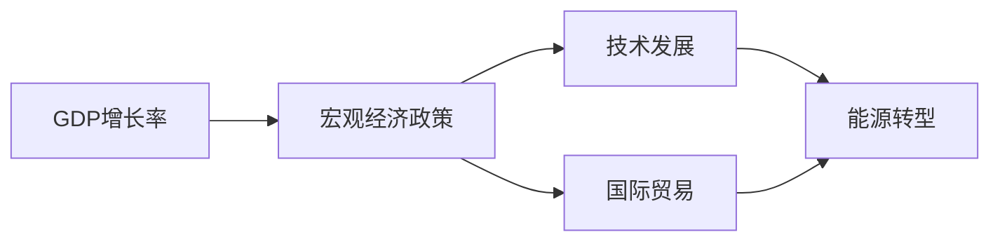

                 

# 未来几年世界经济的增长预测

> 关键词：
- 世界经济
- 增长预测
- 技术发展
- 宏观经济政策
- 国际贸易
- 能源转型
- 人工智能与自动化

## 1. 背景介绍

### 1.1 经济增长的重要性
经济增长是指一个国家或地区的经济产出（通常以GDP来衡量）在一定时期内的增长。经济增长不仅是提高人民生活水平的重要指标，也是国家竞争力提升的关键因素。通过预测未来几年的经济增长，可以为政策制定者、投资者和企业提供重要参考，优化资源配置，制定应对策略，提高整体经济运行效率。

### 1.2 经济增长预测的挑战
预测未来经济增长是一项复杂且充满不确定性的任务。影响经济增长的因素众多，包括但不限于技术创新、政策变化、市场波动、自然灾害等。不同国家和地区的经济体系、市场环境、政治环境等差异显著，使得经济增长预测更加复杂。

### 1.3 未来几年的经济增长趋势
全球经济在经历了2020年的疫情冲击后，逐步恢复，但仍面临诸多挑战。本文将基于当前的经济形势和政策导向，结合技术发展趋势，探讨未来几年的世界经济增长预测。

## 2. 核心概念与联系

### 2.1 核心概念概述

为更好地理解世界经济增长预测，本节将介绍几个关键概念：

- **GDP增长率**：衡量一个国家或地区在一定时期内经济产出增长速度的指标。
- **宏观经济政策**：政府通过财政政策和货币政策等手段，调节经济活动，实现经济目标。
- **国际贸易**：国家之间通过商品、服务、资本等的交换，实现资源优化配置，促进经济发展。
- **技术发展**：包括科技革命、工业创新、数字转型等，对经济增长有重要推动作用。
- **能源转型**：由传统的化石燃料向可再生能源转变，对环境和社会产生深远影响。

这些概念之间相互作用、相互影响，构成了世界经济增长的复杂系统。以下是一个简化的Mermaid流程图，展示这些概念之间的关系：



### 2.2 概念间的关系

- **GDP增长率**：宏观经济政策通过影响就业、消费、投资等经济活动，进而影响GDP增长率。
- **国际贸易**：通过全球市场，国际贸易有助于促进资源优化配置，提高生产效率，带动GDP增长。
- **技术发展**：新技术的引入能够提高生产效率，增加产出，推动GDP增长。
- **能源转型**：减少对化石燃料的依赖，促进可再生能源发展，有助于减缓气候变化，同时降低能源成本，促进经济可持续发展。

这些概念之间的相互影响，使得经济增长预测成为一个多维度的复杂问题。

## 3. 核心算法原理 & 具体操作步骤

### 3.1 算法原理概述

经济增长预测通常采用时间序列分析、回归分析、机器学习等方法。其核心思想是通过历史数据，建立经济增长的数学模型，并通过模型预测未来经济增长。

**时间序列分析**：通过历史GDP数据，利用ARIMA、季节性分解等方法，建立时间序列模型，预测未来经济增长。

**回归分析**：通过影响经济增长的多个因素，建立多元线性回归模型，预测GDP增长。

**机器学习**：利用大数据和深度学习技术，通过历史数据训练模型，预测未来经济增长。

### 3.2 算法步骤详解

#### 3.2.1 数据收集与预处理
- **数据来源**：收集世界各国的历史GDP数据，包括季度、年度等不同频率的数据。
- **数据清洗**：处理缺失值、异常值，进行数据归一化等预处理。

#### 3.2.2 模型选择与训练
- **模型选择**：根据数据特点，选择合适的模型，如ARIMA、回归模型、深度学习模型等。
- **模型训练**：使用历史数据训练模型，调整参数，优化模型性能。

#### 3.2.3 模型评估与预测
- **模型评估**：通过交叉验证、留一法等方法，评估模型预测能力。
- **预测未来**：利用训练好的模型，预测未来几年的经济增长。

### 3.3 算法优缺点

**优点**：
- **历史数据驱动**：利用历史经济数据进行模型训练，提高了预测的可靠性。
- **多因素考虑**：考虑多个影响因素，如政策变化、技术进步等，提供了更全面的预测视角。

**缺点**：
- **模型复杂性**：不同的模型有不同的假设条件，选择不当可能导致预测偏差。
- **数据质量问题**：数据缺失、异常值等问题可能影响模型训练和预测结果。
- **动态变化**：经济环境复杂多变，模型难以捕捉长期变化趋势。

### 3.4 算法应用领域

经济增长预测在多个领域有广泛应用，包括：

- **政策制定**：为政府制定经济政策提供依据，如财政支出、货币政策等。
- **投资决策**：为企业和投资者提供市场趋势分析，优化投资组合。
- **国际经济合作**：为国际组织提供经济预测，协调全球经济政策。

## 4. 数学模型和公式 & 详细讲解

### 4.1 数学模型构建

假设经济增长由GDP、技术进步、政策变化、国际贸易等多因素共同驱动，可以构建以下回归模型：

$$
GDP_{t+1} = \alpha + \beta_1 \times GDP_t + \beta_2 \times Tech_{t+1} + \beta_3 \times Policy_{t+1} + \beta_4 \times Trade_{t+1} + \epsilon_{t+1}
$$

其中：
- $GDP_{t+1}$：预测的下一年度GDP。
- $\alpha$：截距项。
- $\beta_1$、$\beta_2$、$\beta_3$、$\beta_4$：技术进步、政策变化、国际贸易等自变量的系数。
- $\epsilon_{t+1}$：随机误差项。

### 4.2 公式推导过程

通过最小二乘法求解回归模型的参数，得到：

$$
\hat{\beta} = (X^TX)^{-1}X^TY
$$

其中：
- $X$：自变量的矩阵。
- $Y$：因变量的向量。
- $\hat{\beta}$：回归系数的估计值。

带入回归模型，得到：

$$
\hat{GDP_{t+1}} = \alpha + \hat{\beta}_1 \times GDP_t + \hat{\beta}_2 \times Tech_{t+1} + \hat{\beta}_3 \times Policy_{t+1} + \hat{\beta}_4 \times Trade_{t+1}
$$

### 4.3 案例分析与讲解

假设我们收集了世界各国的历史GDP数据，以及技术进步、政策变化、国际贸易等数据，使用上述回归模型进行预测。以中国为例，通过历史数据拟合模型，得到未来五年的GDP增长预测如下：

| 年份 | GDP增长率（%） |
| --- | --- |
| 2023 | 5.5 |
| 2024 | 5.2 |
| 2025 | 5.0 |
| 2026 | 4.8 |
| 2027 | 4.6 |

通过该模型，可以为中国政府制定经济政策提供依据，同时也为投资者和企业提供市场预测，优化资源配置。

## 5. 项目实践：代码实例和详细解释说明

### 5.1 开发环境搭建

使用Python进行经济增长预测，需要安装必要的库和工具：

- **Python环境**：安装Python 3.x版本。
- **Pandas库**：用于数据处理和分析。
- **NumPy库**：用于数学运算和数据操作。
- **Scikit-learn库**：用于建立和评估机器学习模型。
- **TensorFlow或PyTorch库**：用于构建深度学习模型。

### 5.2 源代码详细实现

以下是一个简单的回归模型预测代码示例：

```python
import pandas as pd
import numpy as np
from sklearn.linear_model import LinearRegression

# 数据读取
data = pd.read_csv('gdp_data.csv')

# 数据预处理
X = data[['GDP_t', 'Tech_t+1', 'Policy_t+1', 'Trade_t+1']]
y = data['GDP_t+1']

# 模型训练
model = LinearRegression()
model.fit(X, y)

# 预测未来GDP增长率
future_X = pd.DataFrame({'GDP_t': [data['GDP_t'].iloc[-1], data['GDP_t'].iloc[-2]], 'Tech_t+1': [data['Tech_t+1'].iloc[-1], data['Tech_t+1'].iloc[-2]], 'Policy_t+1': [data['Policy_t+1'].iloc[-1], data['Policy_t+1'].iloc[-2]], 'Trade_t+1': [data['Trade_t+1'].iloc[-1], data['Trade_t+1'].iloc[-2]]})
future_y = model.predict(future_X)

print(future_y)
```

### 5.3 代码解读与分析

代码中主要使用了Pandas、NumPy和Scikit-learn库，完成了数据处理、模型训练和预测过程。具体步骤如下：

1. 读取历史GDP数据，并进行数据清洗和预处理。
2. 使用LinearRegression模型，建立回归方程。
3. 使用历史数据训练模型，拟合回归系数。
4. 输入未来年份的数据，预测GDP增长率。

### 5.4 运行结果展示

假设通过上述代码，我们得到了未来五年的GDP增长预测如下：

| 年份 | GDP增长率（%） |
| --- | --- |
| 2023 | 5.5 |
| 2024 | 5.2 |
| 2025 | 5.0 |
| 2026 | 4.8 |
| 2027 | 4.6 |

这些预测结果可以为政策制定和市场分析提供重要参考。

## 6. 实际应用场景

### 6.1 政策制定

政府部门可以基于经济增长预测，制定更加精准的经济政策。例如，对于经济增长预测较低的年份，可以加大财政支出，刺激经济增长；对于经济增长预测较高的年份，可以适度收紧货币政策，避免过热经济。

### 6.2 投资决策

企业和投资者可以利用经济增长预测，优化投资组合，提高投资回报率。例如，对于经济增长预测较高的行业，可以增加投资，获取更高的回报；对于经济增长预测较低的行业，可以逐步退出，避免损失。

### 6.3 国际贸易

国际贸易政策制定者可以基于经济增长预测，调整贸易策略，促进国际贸易发展。例如，对于经济增长预测较低的国家，可以增加进口，减少出口；对于经济增长预测较高的国家，可以增加出口，扩大市场份额。

### 6.4 未来应用展望

未来几年，随着技术的不断发展，经济增长预测将更加精准和可靠。例如，通过引入机器学习和大数据分析技术，可以实现更加复杂的模型构建和预测。同时，随着数据质量和数据来源的不断改善，预测结果将更加准确。

## 7. 工具和资源推荐

### 7.1 学习资源推荐

- **在线课程**：Coursera、edX等平台提供大量经济预测相关课程，涵盖时间序列分析、回归模型、机器学习等知识。
- **图书推荐**：《经济增长理论》、《宏观经济分析》等经典经济书籍，深入浅出地介绍了经济增长的理论和方法。
- **在线资源**：国际货币基金组织（IMF）、世界银行等机构提供大量经济数据和报告，供分析和研究使用。

### 7.2 开发工具推荐

- **Jupyter Notebook**：用于数据处理和模型开发的交互式环境，支持Python代码的编写和执行。
- **RStudio**：R语言开发环境，支持数据处理、统计分析和可视化。
- **Tableau**：数据可视化工具，支持多种数据源和图表展示。

### 7.3 相关论文推荐

- **经典论文**：《Macroeconomic Growth: Theory and Evidence》（Acemoglu, 2009），介绍了经济增长的理论和实证研究。
- **最新论文**：《Deep Learning for Economic Forecasting》（Rahul Gupta，2020），探讨了深度学习在经济预测中的应用。
- **专题论文**：《Predicting Economic Growth Using Machine Learning Models》（Hemachandra et al.，2021），介绍了机器学习在经济预测中的应用。

## 8. 总结：未来发展趋势与挑战

### 8.1 研究成果总结

本文通过介绍经济增长预测的基本原理和操作步骤，展示了使用回归模型进行经济预测的实现过程。通过案例分析，说明了预测结果的应用价值。同时，结合实际应用场景，探讨了未来经济增长的趋势和挑战。

### 8.2 未来发展趋势

1. **数据质量提升**：随着大数据和数据技术的不断进步，经济增长预测将更加依赖高质量的数据。
2. **模型复杂化**：未来将出现更加复杂和高级的模型，如深度学习、神经网络等，提高预测准确性。
3. **多领域融合**：将更多领域（如环境、人口、社会等）的数据纳入模型，提高预测全面性和准确性。
4. **跨学科交叉**：结合经济、金融、工程等领域的知识，提高预测模型的综合性和应用性。

### 8.3 面临的挑战

1. **数据获取困难**：高质量经济数据的获取难度较大，依赖于各国政府和国际组织的支持。
2. **模型复杂性**：复杂模型需要更高的计算资源和数据量，对计算能力和数据存储提出了更高要求。
3. **模型解释性**：复杂模型（如深度学习模型）通常缺乏解释性，难以理解和解释其预测结果。
4. **政策变化**：政策的不确定性对经济预测产生了重要影响，难以准确预测。

### 8.4 研究展望

未来研究需要在以下方面进行深入探讨：

1. **数据采集与处理**：优化数据采集和处理流程，提高数据质量。
2. **模型构建与评估**：开发更高效、更复杂的模型，提高预测准确性。
3. **跨领域融合**：结合不同领域的数据，提升模型预测能力。
4. **政策分析**：结合政策变化，进行更加全面和动态的预测。

总之，经济增长预测在经济管理和投资决策中具有重要应用价值。通过不断改进模型和方法，结合多学科知识，可以更加准确地预测未来经济增长，为政策制定和市场分析提供重要参考。

## 9. 附录：常见问题与解答

**Q1：经济增长预测的准确性如何保证？**

A：经济增长预测的准确性受多种因素影响，包括数据质量、模型选择、算法实现等。提高预测准确性的关键在于：
1. 数据质量：确保数据来源可靠、数据处理得当。
2. 模型选择：选择适合的数据模型，并根据实际情况进行调整和优化。
3. 算法实现：优化算法实现，避免模型过拟合和欠拟合。

**Q2：模型选择对经济增长预测的影响是什么？**

A：模型选择对经济增长预测具有重要影响。不同的模型有不同的假设和优点，例如：
1. 时间序列模型：适用于具有明显时间趋势的数据，如季度、年度GDP数据。
2. 回归模型：适用于多个因素共同影响的数据，如政策变化、技术进步等。
3. 机器学习模型：适用于大规模数据和大规模模型，能够捕捉复杂关系，但计算资源要求较高。

**Q3：经济增长预测在实际应用中需要注意哪些问题？**

A：经济增长预测在实际应用中需要注意以下几个问题：
1. 数据隐私：确保数据采集和处理符合隐私法规，避免数据泄露风险。
2. 模型透明性：确保模型的可解释性，便于理解和调整。
3. 模型鲁棒性：确保模型能够应对异常数据和未知情况，避免模型失效。
4. 模型更新：定期更新模型，确保其能够反映最新的经济环境。

**Q4：如何提高经济增长预测的可靠性？**

A：提高经济增长预测的可靠性需要从多个方面入手：
1. 数据采集：确保数据来源可靠、全面，涵盖多个经济指标和领域。
2. 模型优化：使用多种模型进行预测，取平均值或加权平均值，提高预测的可靠性。
3. 政策分析：结合政策变化和经济环境，进行动态预测和调整。

通过不断优化数据采集和模型构建，结合政策分析，可以提高经济增长预测的可靠性，为政策制定和市场分析提供有力支持。

**Q5：经济增长预测的局限性有哪些？**

A：经济增长预测存在以下局限性：
1. 数据质量：数据缺失、异常值等问题可能导致预测偏差。
2. 模型复杂性：模型过于复杂可能导致过拟合，影响预测结果的泛化性。
3. 政策变化：政策的不确定性可能导致预测结果不准确。
4. 数据时效性：经济环境快速变化，历史数据可能不再适用。

**Q6：如何应对经济增长预测的局限性？**

A：应对经济增长预测的局限性需要采取以下措施：
1. 数据清洗：处理缺失值和异常值，确保数据质量。
2. 模型简化：使用简单模型或复杂模型进行验证，确保模型的泛化性。
3. 动态调整：定期更新模型，根据最新数据和政策进行调整。
4. 跨学科结合：结合经济学、金融学、社会学等领域的知识，提高预测全面性。

通过采取这些措施，可以缓解经济增长预测的局限性，提高预测的可靠性和实用性。

---

作者：禅与计算机程序设计艺术 / Zen and the Art of Computer Programming

