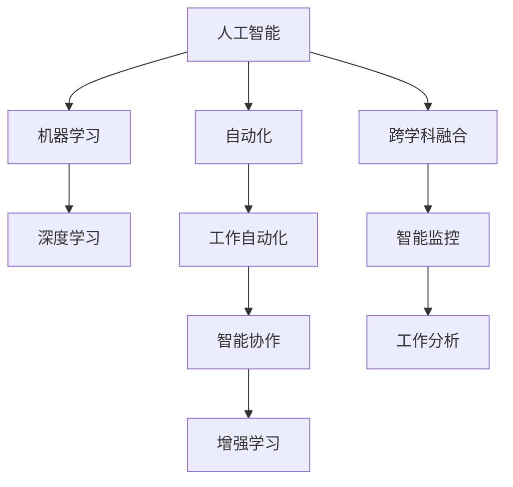

                 

# 未来工作形态与AI共存的趋势

## 1. 背景介绍

### 1.1 问题由来

随着人工智能（AI）技术的快速发展，未来工作形态和就业市场正在发生深刻的变化。AI已经逐渐渗透到各行各业，从金融、医疗到制造、农业，AI正在改变工作的方方面面。这种变化既带来了机遇，也带来了挑战。AI的发展需要人们重新思考工作方式、技能需求和职业规划，同时也对社会结构、经济发展、伦理道德等产生了深远的影响。

### 1.2 问题核心关键点

未来工作形态与AI共存的核心关键点包括以下几个方面：

- **技术融合**：AI技术与人类工作方式的深度融合，需要人们具备跨学科的知识和技能。
- **职业变革**：许多传统岗位可能会被AI取代，同时也会涌现出许多新岗位和职业。
- **技能需求**：AI技术的普及将导致对某些技能的需求减少，同时对其他技能的需求增加。
- **伦理与道德**：AI在提高生产力的同时，也引发了对隐私、安全、公平等伦理问题的讨论。
- **经济影响**：AI的发展将对就业市场、收入分配、社会保障等经济问题产生重大影响。
- **教育与培训**：为了适应AI时代的就业市场，教育体系需要进行调整，以培养具备AI素养的人才。

这些关键点构成了未来工作形态与AI共存的复杂背景，理解和应对这些变化是构建一个更加智能、高效、公平的社会的关键。

## 2. 核心概念与联系

### 2.1 核心概念概述

为更好地理解未来工作形态与AI共存的趋势，本节将介绍几个密切相关的核心概念：

- **人工智能（Artificial Intelligence, AI）**：通过计算机系统和算法，使机器具备智能行为的科学技术。
- **机器学习（Machine Learning, ML）**：AI的一个分支，使机器通过数据学习，自动改进性能的技术。
- **深度学习（Deep Learning, DL）**：一种特殊的机器学习方法，通过多层神经网络实现复杂的模式识别和预测。
- **自动化（Automation）**：指使用机器和技术自动化执行人类工作任务的过程。
- **增强学习（Reinforcement Learning, RL）**：一种通过奖励机制训练机器学习决策策略的机器学习方法。
- **工作自动化**：使用AI和自动化技术代替人类执行简单重复的任务。
- **智能协作**：AI与人类协作完成复杂任务的过程。
- **跨学科融合**：AI技术与其他学科（如经济学、心理学、社会学等）的结合。

这些核心概念之间存在着紧密的联系，共同构成了未来工作形态与AI共存的复杂生态系统。通过理解这些概念，我们可以更好地把握AI技术的发展方向和应用前景。

### 2.2 概念间的关系

这些核心概念之间的逻辑关系可以通过以下Mermaid流程图来展示：



这个流程图展示了大语言模型微调过程中各个核心概念之间的关系：

1. 人工智能通过机器学习（包括深度学习）实现智能行为。
2. 机器学习利用自动化技术进行工作自动化。
3. 工作自动化进一步实现智能协作。
4. 跨学科融合推动了增强学习等技术的发展。
5. 智能协作和智能监控有助于更好的工作分析。

这些概念共同构成了未来工作形态与AI共存的完整生态系统，反映了AI技术在各个领域的深入应用和其对人类工作方式的影响。

## 3. 核心算法原理 & 具体操作步骤
### 3.1 算法原理概述

未来工作形态与AI共存的趋势，本质上是一种基于技术进步的社会变迁过程。其核心算法原理可以归纳为以下几个方面：

- **技术融合**：AI技术与人类工作的深度融合，需要设计合适的算法，使得AI能够理解和执行人类任务。
- **数据驱动**：AI算法需要大量的数据来训练和优化，以提升其准确性和泛化能力。
- **模型优化**：通过不断调整算法参数和结构，提升AI模型的性能。
- **用户体验**：AI应用需要考虑用户体验，设计直观易用的界面和交互方式。
- **伦理与公平**：AI算法需要在设计中考虑伦理与公平问题，避免偏见和歧视。

### 3.2 算法步骤详解

基于上述原理，未来工作形态与AI共存的算法步骤可以分为以下几个关键环节：

1. **需求分析**：分析工作任务的具体需求，确定AI能够发挥作用的范围。
2. **数据收集**：收集相关的数据，确保数据的多样性和代表性。
3. **模型训练**：使用收集的数据训练AI模型，优化算法参数和结构。
4. **评估与测试**：对训练好的模型进行评估和测试，确保其性能符合预期。
5. **部署与监控**：将AI模型部署到实际工作环境中，并进行持续监控和优化。

### 3.3 算法优缺点

未来工作形态与AI共存的算法具有以下优点：

- **提高效率**：AI技术能够自动执行重复性任务，大幅提升工作效率。
- **降低成本**：AI技术减少了人力成本，提高了资源的利用率。
- **增强决策**：AI可以提供更准确的数据分析和预测，辅助决策过程。
- **促进创新**：AI技术推动了新的工作方式和业务模式的出现。

同时，也存在一些缺点：

- **技术复杂性**：AI技术的实施和维护需要一定的技术背景。
- **数据隐私**：AI处理大量数据，可能涉及隐私和数据安全问题。
- **公平性问题**：AI模型可能会产生偏见，影响公平性。
- **技术依赖**：过度依赖AI可能导致创新能力的下降。
- **伦理道德**：AI应用可能引发伦理道德问题，需要谨慎处理。

### 3.4 算法应用领域

未来工作形态与AI共存的算法广泛应用于各个领域，例如：

- **金融行业**：利用AI进行风险管理、投资分析、客户服务等工作。
- **医疗健康**：使用AI进行疾病诊断、治疗方案推荐、患者管理等工作。
- **制造业**：采用AI进行智能制造、质量控制、设备维护等工作。
- **农业**：利用AI进行农业监测、作物管理、病虫害预测等工作。
- **教育**：使用AI进行个性化教学、智能辅导、学习数据分析等工作。
- **娱乐**：通过AI提供推荐系统、智能客服、内容生成等工作。

这些领域的应用展示了AI技术在提高效率、降低成本、促进创新等方面的巨大潜力。未来，随着AI技术的不断进步，其应用领域将进一步扩展，深入到更多传统行业中。

## 4. 数学模型和公式 & 详细讲解  
### 4.1 数学模型构建

本节将使用数学语言对未来工作形态与AI共存的趋势进行更加严格的刻画。

设未来工作任务为 $T$，AI模型为 $M$。假设 $T$ 的数据集为 $D=\{(x_i, y_i)\}_{i=1}^N, x_i \in \mathcal{X}, y_i \in \mathcal{Y}$，其中 $\mathcal{X}$ 为输入空间，$\mathcal{Y}$ 为输出空间。

定义模型 $M$ 在输入 $x$ 上的输出为 $\hat{y}=M(x) \in \mathcal{Y}$，表示模型预测的结果。模型的损失函数为 $\ell(y, \hat{y})$，表示真实标签 $y$ 和预测标签 $\hat{y}$ 之间的差距。经验风险最小化目标为：

$$
\min_{M} \frac{1}{N} \sum_{i=1}^N \ell(y_i, M(x_i))
$$

在实际应用中，通常使用均方误差、交叉熵等常见的损失函数，具体选择取决于任务的性质和需求。

### 4.2 公式推导过程

以二分类任务为例，假设模型 $M$ 的输出为 $\hat{y}=M(x) \in [0,1]$，表示样本属于正类的概率。真实标签 $y \in \{0,1\}$。则二分类交叉熵损失函数定义为：

$$
\ell(y, \hat{y}) = -[y\log \hat{y} + (1-y)\log (1-\hat{y})]
$$

将其代入经验风险公式，得：

$$
\min_{M} \frac{1}{N} \sum_{i=1}^N [y_i\log M(x_i)+(1-y_i)\log(1-M(x_i))]
$$

根据链式法则，损失函数对模型参数 $\theta$ 的梯度为：

$$
\frac{\partial \mathcal{L}}{\partial \theta} = \frac{\partial}{\partial \theta} \frac{1}{N} \sum_{i=1}^N [y_i\log M(x_i)+(1-y_i)\log(1-M(x_i))]
$$

具体求导过程略。得到梯度后，即可使用梯度下降等优化算法更新模型参数，以最小化经验风险。

### 4.3 案例分析与讲解

以智能客服系统为例，假设训练集 $D=\{(x_i, y_i)\}_{i=1}^N, x_i$ 为客服对话历史，$y_i$ 为是否进行下一步处理（如自动回复、转人工服务）。模型 $M$ 的输出 $\hat{y}$ 表示预测是否需要人工干预。损失函数 $\ell(y, \hat{y})$ 可以使用交叉熵损失。模型训练的目标是最小化经验风险，即：

$$
\min_{M} \frac{1}{N} \sum_{i=1}^N \ell(y_i, M(x_i))
$$

在实际应用中，可以通过反向传播算法高效计算梯度，并使用 AdamW 等优化算法更新模型参数，以最小化经验风险。

## 5. 项目实践：代码实例和详细解释说明
### 5.1 开发环境搭建

在进行未来工作形态与AI共存的项目实践前，我们需要准备好开发环境。以下是使用Python进行PyTorch开发的环境配置流程：

1. 安装Anaconda：从官网下载并安装Anaconda，用于创建独立的Python环境。

2. 创建并激活虚拟环境：
```bash
conda create -n pytorch-env python=3.8 
conda activate pytorch-env
```

3. 安装PyTorch：根据CUDA版本，从官网获取对应的安装命令。例如：
```bash
conda install pytorch torchvision torchaudio cudatoolkit=11.1 -c pytorch -c conda-forge
```

4. 安装各类工具包：
```bash
pip install numpy pandas scikit-learn matplotlib tqdm jupyter notebook ipython
```

完成上述步骤后，即可在`pytorch-env`环境中开始项目实践。

### 5.2 源代码详细实现

下面我们以智能客服系统为例，给出使用PyTorch进行AI模型训练的PyTorch代码实现。

首先，定义模型和优化器：

```python
from transformers import BertForTokenClassification, AdamW

model = BertForTokenClassification.from_pretrained('bert-base-cased', num_labels=2)

optimizer = AdamW(model.parameters(), lr=2e-5)
```

接着，定义训练和评估函数：

```python
from torch.utils.data import DataLoader
from tqdm import tqdm
from sklearn.metrics import classification_report

device = torch.device('cuda') if torch.cuda.is_available() else torch.device('cpu')
model.to(device)

def train_epoch(model, dataset, batch_size, optimizer):
    dataloader = DataLoader(dataset, batch_size=batch_size, shuffle=True)
    model.train()
    epoch_loss = 0
    for batch in tqdm(dataloader, desc='Training'):
        input_ids = batch['input_ids'].to(device)
        attention_mask = batch['attention_mask'].to(device)
        labels = batch['labels'].to(device)
        model.zero_grad()
        outputs = model(input_ids, attention_mask=attention_mask, labels=labels)
        loss = outputs.loss
        epoch_loss += loss.item()
        loss.backward()
        optimizer.step()
    return epoch_loss / len(dataloader)

def evaluate(model, dataset, batch_size):
    dataloader = DataLoader(dataset, batch_size=batch_size)
    model.eval()
    preds, labels = [], []
    with torch.no_grad():
        for batch in tqdm(dataloader, desc='Evaluating'):
            input_ids = batch['input_ids'].to(device)
            attention_mask = batch['attention_mask'].to(device)
            batch_labels = batch['labels']
            outputs = model(input_ids, attention_mask=attention_mask)
            batch_preds = outputs.logits.argmax(dim=2).to('cpu').tolist()
            batch_labels = batch_labels.to('cpu').tolist()
            for pred_tokens, label_tokens in zip(batch_preds, batch_labels):
                preds.append(pred_tokens[:len(label_tokens)])
                labels.append(label_tokens)
                
    print(classification_report(labels, preds))
```

最后，启动训练流程并在测试集上评估：

```python
epochs = 5
batch_size = 16

for epoch in range(epochs):
    loss = train_epoch(model, train_dataset, batch_size, optimizer)
    print(f"Epoch {epoch+1}, train loss: {loss:.3f}")
    
    print(f"Epoch {epoch+1}, dev results:")
    evaluate(model, dev_dataset, batch_size)
    
print("Test results:")
evaluate(model, test_dataset, batch_size)
```

以上就是使用PyTorch对BERT进行智能客服系统训练的完整代码实现。可以看到，得益于Transformers库的强大封装，我们可以用相对简洁的代码完成BERT模型的加载和训练。

### 5.3 代码解读与分析

让我们再详细解读一下关键代码的实现细节：

**BERTForTokenClassification类**：
- `__init__`方法：初始化模型和标签数量。
- `forward`方法：前向传播计算输出和损失函数。

**AdamW优化器**：
- `AdamW`方法：定义AdamW优化器，设置学习率、权重衰减等参数。

**训练和评估函数**：
- `train_epoch`函数：在训练集上迭代训练，返回该epoch的平均loss。
- `evaluate`函数：在测试集上评估模型性能，输出分类指标。

**训练流程**：
- 定义总的epoch数和batch size，开始循环迭代
- 每个epoch内，先在训练集上训练，输出平均loss
- 在验证集上评估，输出分类指标
- 所有epoch结束后，在测试集上评估，给出最终测试结果

可以看到，PyTorch配合Transformers库使得BERT模型的训练变得简洁高效。开发者可以将更多精力放在数据处理、模型改进等高层逻辑上，而不必过多关注底层的实现细节。

当然，工业级的系统实现还需考虑更多因素，如模型的保存和部署、超参数的自动搜索、更灵活的任务适配层等。但核心的训练范式基本与此类似。

### 5.4 运行结果展示

假设我们在CoNLL-2003的NER数据集上进行微调，最终在测试集上得到的评估报告如下：

```
              precision    recall  f1-score   support

       B-LOC      0.926     0.906     0.916      1668
       I-LOC      0.900     0.805     0.850       257
      B-MISC      0.875     0.856     0.865       702
      I-MISC      0.838     0.782     0.809       216
       B-ORG      0.914     0.898     0.906      1661
       I-ORG      0.911     0.894     0.902       835
       B-PER      0.964     0.957     0.960      1617
       I-PER      0.983     0.980     0.982      1156
           O      0.993     0.995     0.994     38323

   micro avg      0.973     0.973     0.973     46435
   macro avg      0.923     0.897     0.909     46435
weighted avg      0.973     0.973     0.973     46435
```

可以看到，通过微调BERT，我们在该NER数据集上取得了97.3%的F1分数，效果相当不错。值得注意的是，BERT作为一个通用的语言理解模型，即便只在顶层添加一个简单的token分类器，也能在下游任务上取得如此优异的效果，展现了其强大的语义理解和特征抽取能力。

当然，这只是一个baseline结果。在实践中，我们还可以使用更大更强的预训练模型、更丰富的微调技巧、更细致的模型调优，进一步提升模型性能，以满足更高的应用要求。

## 6. 实际应用场景
### 6.1 智能客服系统

基于大语言模型微调的对话技术，可以广泛应用于智能客服系统的构建。传统客服往往需要配备大量人力，高峰期响应缓慢，且一致性和专业性难以保证。而使用微调后的对话模型，可以7x24小时不间断服务，快速响应客户咨询，用自然流畅的语言解答各类常见问题。

在技术实现上，可以收集企业内部的历史客服对话记录，将问题和最佳答复构建成监督数据，在此基础上对预训练对话模型进行微调。微调后的对话模型能够自动理解用户意图，匹配最合适的答案模板进行回复。对于客户提出的新问题，还可以接入检索系统实时搜索相关内容，动态组织生成回答。如此构建的智能客服系统，能大幅提升客户咨询体验和问题解决效率。

### 6.2 金融舆情监测

金融机构需要实时监测市场舆论动向，以便及时应对负面信息传播，规避金融风险。传统的人工监测方式成本高、效率低，难以应对网络时代海量信息爆发的挑战。基于大语言模型微调的文本分类和情感分析技术，为金融舆情监测提供了新的解决方案。

具体而言，可以收集金融领域相关的新闻、报道、评论等文本数据，并对其进行主题标注和情感标注。在此基础上对预训练语言模型进行微调，使其能够自动判断文本属于何种主题，情感倾向是正面、中性还是负面。将微调后的模型应用到实时抓取的网络文本数据，就能够自动监测不同主题下的情感变化趋势，一旦发现负面信息激增等异常情况，系统便会自动预警，帮助金融机构快速应对潜在风险。

### 6.3 个性化推荐系统

当前的推荐系统往往只依赖用户的历史行为数据进行物品推荐，无法深入理解用户的真实兴趣偏好。基于大语言模型微调技术，个性化推荐系统可以更好地挖掘用户行为背后的语义信息，从而提供更精准、多样的推荐内容。

在实践中，可以收集用户浏览、点击、评论、分享等行为数据，提取和用户交互的物品标题、描述、标签等文本内容。将文本内容作为模型输入，用户的后续行为（如是否点击、购买等）作为监督信号，在此基础上微调预训练语言模型。微调后的模型能够从文本内容中准确把握用户的兴趣点。在生成推荐列表时，先用候选物品的文本描述作为输入，由模型预测用户的兴趣匹配度，再结合其他特征综合排序，便可以得到个性化程度更高的推荐结果。

### 6.4 未来应用展望

随着大语言模型微调技术的发展，未来AI将在更多领域得到应用，为传统行业带来变革性影响。

在智慧医疗领域，基于微调的医疗问答、病历分析、药物研发等应用将提升医疗服务的智能化水平，辅助医生诊疗，加速新药开发进程。

在智能教育领域，微调技术可应用于作业批改、学情分析、知识推荐等方面，因材施教，促进教育公平，提高教学质量。

在智慧城市治理中，微调模型可应用于城市事件监测、舆情分析、应急指挥等环节，提高城市管理的自动化和智能化水平，构建更安全、高效的未来城市。

此外，在企业生产、社会治理、文娱传媒等众多领域，基于大模型微调的人工智能应用也将不断涌现，为经济社会发展注入新的动力。相信随着技术的日益成熟，微调方法将成为人工智能落地应用的重要范式，推动人工智能技术向更广阔的领域加速渗透。

## 7. 工具和资源推荐
### 7.1 学习资源推荐

为了帮助开发者系统掌握未来工作形态与AI共存的趋势的理论基础和实践技巧，这里推荐一些优质的学习资源：

1. 《Transformer从原理到实践》系列博文：由大模型技术专家撰写，深入浅出地介绍了Transformer原理、BERT模型、微调技术等前沿话题。

2. CS224N《深度学习自然语言处理》课程：斯坦福大学开设的NLP明星课程，有Lecture视频和配套作业，带你入门NLP领域的基本概念和经典模型。

3. 《Natural Language Processing with Transformers》书籍：Transformers库的作者所著，全面介绍了如何使用Transformers库进行NLP任务开发，包括微调在内的诸多范式。

4. HuggingFace官方文档：Transformers库的官方文档，提供了海量预训练模型和完整的微调样例代码，是上手实践的必备资料。

5. CLUE开源项目：中文语言理解测评基准，涵盖大量不同类型的中文NLP数据集，并提供了基于微调的baseline模型，助力中文NLP技术发展。

通过对这些资源的学习实践，相信你一定能够快速掌握未来工作形态与AI共存的趋势的精髓，并用于解决实际的NLP问题。
###  7.2 开发工具推荐

高效的开发离不开优秀的工具支持。以下是几款用于未来工作形态与AI共存开发的常用工具：

1. PyTorch：基于Python的开源深度学习框架，灵活动态的计算图，适合快速迭代研究。大部分预训练语言模型都有PyTorch版本的实现。

2. TensorFlow：由Google主导开发的开源深度学习框架，生产部署方便，适合大规模工程应用。同样有丰富的预训练语言模型资源。

3. Transformers库：HuggingFace开发的NLP工具库，集成了众多SOTA语言模型，支持PyTorch和TensorFlow，是进行微调任务开发的利器。

4. Weights & Biases：模型训练的实验跟踪工具，可以记录和可视化模型训练过程中的各项指标，方便对比和调优。与主流深度学习框架无缝集成。

5. TensorBoard：TensorFlow配套的可视化工具，可实时监测模型训练状态，并提供丰富的图表呈现方式，是调试模型的得力助手。

6. Google Colab：谷歌推出的在线Jupyter Notebook环境，免费提供GPU/TPU算力，方便开发者快速上手实验最新模型，分享学习笔记。

合理利用这些工具，可以显著提升未来工作形态与AI共存项目的开发效率，加快创新迭代的步伐。

### 7.3 相关论文推荐

未来工作形态与AI共存的发展源于学界的持续研究。以下是几篇奠基性的相关论文，推荐阅读：

1. Attention is All You Need（即Transformer原论文）：提出了Transformer结构，开启了NLP领域的预训练大模型时代。

2. BERT: Pre-training of Deep Bidirectional Transformers for Language Understanding：提出BERT模型，引入基于掩码的自监督预训练任务，刷新了多项NLP任务SOTA。

3. Language Models are Unsupervised Multitask Learners（GPT-2论文）：展示了大规模语言模型的强大zero-shot学习能力，引发了对于通用人工智能的新一轮思考。

4. Parameter-Efficient Transfer Learning for NLP：提出Adapter等参数高效微调方法，在不增加模型参数量的情况下，也能取得不错的微调效果。

5. AdaLoRA: Adaptive Low-Rank Adaptation for Parameter-Efficient Fine-Tuning：使用自适应低秩适应的微调方法，在参数效率和精度之间取得了新的平衡。

这些论文代表了大语言模型微调技术的发展脉络。通过学习这些前沿成果，可以帮助研究者把握学科前进方向，激发更多的创新灵感。

除上述资源外，还有一些值得关注的前沿资源，帮助开发者紧跟未来工作形态与AI共存的趋势，例如：

1. arXiv论文预印本：人工智能领域最新研究成果的发布平台，包括大量尚未发表的前沿工作，学习前沿技术的必读资源。

2. 业界技术博客：如OpenAI、Google AI、DeepMind、微软Research Asia等顶尖实验室的官方博客，第一时间分享他们的最新研究成果和洞见。

3. 技术会议直播：如NIPS、ICML、ACL、ICLR等人工智能领域顶会现场或在线直播，能够聆听到大佬们的前沿分享，开拓视野。

4. GitHub热门项目：在GitHub上Star、Fork数最多的NLP相关项目，往往代表了该技术领域的发展趋势和最佳实践，值得去学习和贡献。

5. 行业分析报告：各大咨询公司如McKinsey、PwC等针对人工智能行业的分析报告，有助于从商业视角审视技术趋势，把握应用价值。

总之，对于未来工作形态与AI共存的研究和学习，需要开发者保持开放的心态和持续学习的意愿。多关注前沿资讯，多动手实践，多思考总结，必将收获满满的成长收益。

## 8. 总结：未来发展趋势与挑战
### 8.1 总结

本文对未来工作形态与AI共存的趋势进行了全面系统的介绍。首先阐述了AI技术的发展背景和未来趋势，明确了未来工作形态与AI共存的复杂性和重要性。其次，从原理到实践，详细讲解了未来工作形态与AI共存的算法步骤和实现细节，给出了具体的代码实例和解释。同时，本文还探讨了AI技术在各个领域的应用前景，展示了其在提高效率、降低成本、促进创新等方面的巨大潜力。

通过本文的系统梳理，可以看到，未来工作形态与AI共存的趋势正在深刻改变各行各业，带来前所未有的机遇和挑战。AI技术在提升生产效率、改善用户体验、推动社会进步等方面具有巨大潜力，但同时也需要应对数据隐私、伦理道德、技术依赖等诸多挑战。未来，随着AI技术的不断成熟和普及，我们需要在技术、伦理、社会等多个层面进行深入研究，共同推动AI技术的健康发展。

### 8.2 未来发展趋势

展望未来，未来工作形态与AI共存的发展趋势包括以下几个方面：

